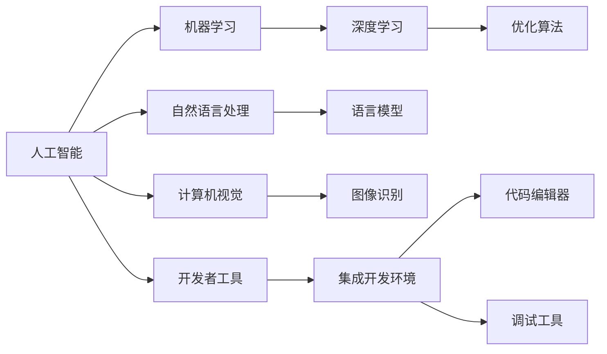

                 

# 李开复：苹果发布AI应用的开发者

> 关键词：人工智能, 苹果, 开发者, AI应用, 机器学习, 自然语言处理, 计算机视觉, 深度学习

## 1. 背景介绍

### 1.1 问题由来
近年来，人工智能(AI)技术在各行各业迅速普及，从医疗、教育到金融、制造业，AI应用已经成为推动社会进步的重要力量。苹果公司作为全球知名的科技巨头，一直致力于AI技术的研发和应用，推出了诸多AI应用和工具，为开发者提供了丰富的开发资源和平台支持。然而，面对苹果庞大的AI生态，开发者往往感到无从下手，不知道如何开始构建自己的AI应用。本文将详细探讨苹果发布AI应用的开发流程、关键技术及其实际应用场景，帮助开发者更好地利用苹果提供的开发工具和资源，构建出高质量的AI应用。

### 1.2 问题核心关键点
本文将深入分析苹果AI应用开发的关键技术点，包括：
- 开发者在构建AI应用时需要掌握哪些核心技术？
- 苹果提供的AI开发工具有哪些？
- AI应用在苹果平台上的具体应用场景有哪些？
- 如何利用苹果的开发者资源构建高效、易维护的AI应用？

### 1.3 问题研究意义
随着AI技术的不断进步和应用场景的日益丰富，苹果在AI应用领域的投入也逐年加大。通过深入分析苹果的AI应用开发流程和技术细节，开发者可以更好地理解苹果的AI生态，掌握关键技术点，加速AI应用开发进程。同时，本文还将探讨苹果AI应用的实际应用场景，为开发者提供灵感和参考，推动AI技术在更多领域的落地和应用。

## 2. 核心概念与联系

### 2.1 核心概念概述

为了更好地理解苹果AI应用的开发流程，本节将介绍几个密切相关的核心概念：

- 人工智能(Artificial Intelligence, AI)：通过计算机模拟人类智能行为的技术，包括机器学习、自然语言处理、计算机视觉等子领域。
- 机器学习(Machine Learning, ML)：使计算机系统能够从数据中学习规律，并自动进行预测或决策的技术。
- 自然语言处理(Natural Language Processing, NLP)：使计算机能够理解和生成人类语言的技术。
- 计算机视觉(Computer Vision, CV)：使计算机能够识别、分析和理解图像和视频中物体和场景的技术。
- 深度学习(Deep Learning, DL)：一种基于人工神经网络的技术，通过多层非线性变换从数据中学习复杂特征和模式。
- 开发者工具(Developer Tools)：为开发者提供开发支持、代码编辑、调试等功能的应用软件和工具。

这些核心概念之间的联系可以概括为：人工智能、机器学习、自然语言处理和计算机视觉是AI技术的核心子领域，深度学习是这些子领域的主要技术手段。开发者工具为AI应用的开发提供了必要的技术支持和平台资源。

### 2.2 概念间的关系

这些核心概念之间的关系可以通过以下Mermaid流程图来展示：



这个流程图展示了核心概念之间的逻辑关系：

1. 人工智能通过机器学习、自然语言处理和计算机视觉等子领域实现对数据的学习和处理。
2. 机器学习主要依赖深度学习进行模式识别和特征提取。
3. 自然语言处理和计算机视觉分别通过语言模型和图像识别模型实现语义理解和视觉识别。
4. 开发者工具为开发者提供了必要的开发环境、代码编辑和调试功能。

这些核心概念共同构成了苹果AI应用的开发基础，为开发者构建高质量AI应用提供了技术支持。

## 3. 核心算法原理 & 具体操作步骤
### 3.1 算法原理概述

苹果AI应用的开发基于深度学习技术，主要依赖于自然语言处理、计算机视觉和机器学习等核心技术。本文将重点介绍这些技术的核心算法原理。

**自然语言处理**：
自然语言处理的核心是语言模型，通过统计学习或神经网络模型，学习单词、短语、句子之间的概率分布，实现对自然语言的理解和生成。语言模型可以通过最大似然估计或生成对抗网络(GAN)等方法进行训练。

**计算机视觉**：
计算机视觉的核心是图像识别模型，通过卷积神经网络(CNN)或循环神经网络(RNN)等深度学习模型，学习图像中物体的特征和结构，实现对图像和视频的识别和理解。图像识别模型可以通过迁移学习或自监督学习等方法进行预训练和微调。

**机器学习**：
机器学习的主要任务是训练模型，通过监督学习或无监督学习等方法，从数据中学习规律和模式，并应用到预测或决策任务中。常见的监督学习算法包括线性回归、逻辑回归、决策树、随机森林等。无监督学习算法包括聚类、降维等。

### 3.2 算法步骤详解

下面详细解释苹果AI应用开发的具体步骤：

**Step 1: 数据准备**
- 收集并标注用于训练和测试的数据集，确保数据质量和多样性。
- 对数据进行预处理，包括清洗、归一化、划分训练集和测试集等步骤。

**Step 2: 模型选择**
- 根据具体任务选择合适的深度学习模型，如语言模型、图像识别模型或机器学习模型。
- 选择合适的预训练模型或自编码器，作为模型初始化参数。

**Step 3: 模型训练**
- 将数据集划分为训练集和验证集，使用随机梯度下降等优化算法进行模型训练。
- 监控模型在验证集上的性能指标，如准确率、召回率、F1分数等。
- 调整超参数，如学习率、批大小、迭代轮数等，以提高模型性能。

**Step 4: 模型评估**
- 在测试集上评估模型性能，对比微调前后的精度提升。
- 使用混淆矩阵、ROC曲线等可视化工具，展示模型性能。
- 根据评估结果调整模型架构和超参数，优化模型效果。

**Step 5: 模型部署**
- 将训练好的模型导出为可部署格式，如TensorFlow Lite、Core ML等。
- 集成模型到苹果的开发平台和应用中，实现功能上线。
- 监控模型在实际应用中的表现，收集用户反馈，持续优化模型。

### 3.3 算法优缺点

苹果AI应用的开发流程具有以下优点：

- 数据准备环节确保了数据的质量和多样性，提高了模型的泛化能力。
- 模型选择和预训练模型初始化提高了模型训练的效率和精度。
- 模型评估和调优保证了模型性能的稳定性和可靠性。
- 模型部署和应用上线实现了技术到产品的无缝对接。

同时，也存在一些缺点：

- 数据标注成本较高，尤其是在小样本情况下。
- 模型训练和部署对计算资源要求较高，需要高性能的硬件设备。
- 模型优化和调优过程复杂，需要一定的专业知识。

### 3.4 算法应用领域

苹果AI应用的开发在多个领域都有广泛应用，包括但不限于：

- **自然语言处理**：聊天机器人、情感分析、语音识别等。
- **计算机视觉**：图像分类、目标检测、人脸识别等。
- **机器学习**：推荐系统、信用评分、风险评估等。
- **医疗**：疾病诊断、药物发现、基因分析等。
- **金融**：信用评分、欺诈检测、市场预测等。
- **零售**：客户分析、推荐系统、库存管理等。

这些应用场景展示了AI技术在各行各业的广泛应用，为开发者提供了丰富的创新方向。

## 4. 数学模型和公式 & 详细讲解 & 举例说明

### 4.1 数学模型构建

苹果AI应用的开发涉及多个数学模型，包括自然语言处理模型、图像识别模型和机器学习模型等。本文将详细介绍这些模型的数学模型构建方法。

**自然语言处理模型**：
以LSTM语言模型为例，其数学模型构建如下：

$$
P(x_t|x_{<t}) = \frac{exp(f(x_{<t}))}{Z} \\
f(x_{<t}) = \sum_{h_t \in H} \alpha_{h_t}(x_{<t}, \theta)
$$

其中，$P(x_t|x_{<t})$表示在序列$x_{<t}$的上下文中，生成字符$x_t$的概率分布；$f(x_{<t})$表示在序列$x_{<t}$的上下文中，生成字符$x_t$的概率函数；$Z$表示归一化因子，保证概率分布的总和为1；$\alpha_{h_t}$表示在隐藏状态$h_t$下的转移矩阵。

**图像识别模型**：
以卷积神经网络(CNN)为例，其数学模型构建如下：

$$
F(x) = W_1 * f(x) + b_1 \\
f(x) = W_2 * F(x) + b_2 \\
F(x) = max(0, W_3 * f(x) + b_3)
$$

其中，$F(x)$表示卷积层输出；$f(x)$表示卷积核；$W_i$表示卷积核权重；$b_i$表示偏置项；$*$表示卷积运算。

**机器学习模型**：
以线性回归模型为例，其数学模型构建如下：

$$
y = w_1 x_1 + w_2 x_2 + ... + w_n x_n + b
$$

其中，$y$表示预测值；$x_i$表示输入特征；$w_i$表示特征权重；$b$表示偏置项。

### 4.2 公式推导过程

下面我们以自然语言处理模型为例，推导LSTM语言模型的关键公式。

**LSTM语言模型**：
LSTM模型包含输入门、遗忘门和输出门，通过这三个门控制记忆单元的信息流，从而实现对序列数据的长期依赖建模。LSTM模型的关键公式如下：

$$
\tilde{C}_t = tanh(W_c * [x_t;h_{t-1}] + b_c) \\
i_t = sigmoid(W_i * [x_t;h_{t-1}] + b_i) \\
f_t = sigmoid(W_f * [x_t;h_{t-1}] + b_f) \\
o_t = sigmoid(W_o * [x_t;h_{t-1}] + b_o) \\
C_t = f_t * C_{t-1} + i_t * \tilde{C}_t \\
h_t = o_t * tanh(C_t)
$$

其中，$\tilde{C}_t$表示候选记忆单元；$i_t$表示输入门；$f_t$表示遗忘门；$o_t$表示输出门；$C_t$表示当前记忆单元；$h_t$表示当前输出。

### 4.3 案例分析与讲解

以苹果Siri语音识别为例，介绍自然语言处理模型的实际应用。

**Siri语音识别**：
Siri语音识别系统通过LSTM语言模型实现对语音信号的转写和语义理解。其关键步骤包括：

1. 语音信号的前端处理，包括去噪、分帧、特征提取等。
2. 使用LSTM语言模型对特征进行建模，输出概率分布。
3. 通过解码器将概率分布转换为文本序列，实现语音到文本的转写。

Siri语音识别的关键在于LSTM语言模型的设计和训练，通过大量的语音数据进行预训练和微调，使其具备良好的语言理解和生成能力。此外，Siri语音识别系统还结合了声学模型和语义模型，实现了对语音信号的端到端处理，提高了识别的准确率和流畅度。

## 5. 项目实践：代码实例和详细解释说明

### 5.1 开发环境搭建

在进行苹果AI应用开发前，我们需要准备好开发环境。以下是使用Python进行PyTorch开发的环境配置流程：

1. 安装Anaconda：从官网下载并安装Anaconda，用于创建独立的Python环境。

2. 创建并激活虚拟环境：
```bash
conda create -n pytorch-env python=3.8 
conda activate pytorch-env
```

3. 安装PyTorch：根据CUDA版本，从官网获取对应的安装命令。例如：
```bash
conda install pytorch torchvision torchaudio cudatoolkit=11.1 -c pytorch -c conda-forge
```

4. 安装TensorFlow：从官网下载并安装TensorFlow，选择相应的版本和安装方式。

5. 安装各类工具包：
```bash
pip install numpy pandas scikit-learn matplotlib tqdm jupyter notebook ipython
```

完成上述步骤后，即可在`pytorch-env`环境中开始苹果AI应用的开发实践。

### 5.2 源代码详细实现

下面我们以自然语言处理任务为例，给出使用PyTorch和TensorFlow进行文本分类任务的代码实现。

**文本分类任务**：
首先，定义数据处理函数：

```python
from torch.utils.data import Dataset
import torch

class TextDataset(Dataset):
    def __init__(self, texts, labels, tokenizer):
        self.texts = texts
        self.labels = labels
        self.tokenizer = tokenizer
        
    def __len__(self):
        return len(self.texts)
    
    def __getitem__(self, item):
        text = self.texts[item]
        label = self.labels[item]
        
        encoding = self.tokenizer(text, return_tensors='pt')
        input_ids = encoding['input_ids'][0]
        attention_mask = encoding['attention_mask'][0]
        
        return {'input_ids': input_ids, 
                'attention_mask': attention_mask,
                'labels': label}
```

然后，定义模型和优化器：

```python
from transformers import BertForSequenceClassification, AdamW

model = BertForSequenceClassification.from_pretrained('bert-base-cased', num_labels=2)

optimizer = AdamW(model.parameters(), lr=2e-5)
```

接着，定义训练和评估函数：

```python
from torch.utils.data import DataLoader
from tqdm import tqdm

device = torch.device('cuda') if torch.cuda.is_available() else torch.device('cpu')
model.to(device)

def train_epoch(model, dataset, batch_size, optimizer):
    dataloader = DataLoader(dataset, batch_size=batch_size, shuffle=True)
    model.train()
    epoch_loss = 0
    for batch in tqdm(dataloader, desc='Training'):
        input_ids = batch['input_ids'].to(device)
        attention_mask = batch['attention_mask'].to(device)
        labels = batch['labels'].to(device)
        model.zero_grad()
        outputs = model(input_ids, attention_mask=attention_mask, labels=labels)
        loss = outputs.loss
        epoch_loss += loss.item()
        loss.backward()
        optimizer.step()
    return epoch_loss / len(dataloader)

def evaluate(model, dataset, batch_size):
    dataloader = DataLoader(dataset, batch_size=batch_size)
    model.eval()
    preds, labels = [], []
    with torch.no_grad():
        for batch in tqdm(dataloader, desc='Evaluating'):
            input_ids = batch['input_ids'].to(device)
            attention_mask = batch['attention_mask'].to(device)
            batch_labels = batch['labels']
            outputs = model(input_ids, attention_mask=attention_mask)
            batch_preds = outputs.logits.argmax(dim=2).to('cpu').tolist()
            batch_labels = batch_labels.to('cpu').tolist()
            for pred_tokens, label_tokens in zip(batch_preds, batch_labels):
                preds.append(pred_tokens[:len(label_tokens)])
                labels.append(label_tokens)
                
    print(classification_report(labels, preds))
```

最后，启动训练流程并在测试集上评估：

```python
epochs = 5
batch_size = 16

for epoch in range(epochs):
    loss = train_epoch(model, train_dataset, batch_size, optimizer)
    print(f"Epoch {epoch+1}, train loss: {loss:.3f}")
    
    print(f"Epoch {epoch+1}, dev results:")
    evaluate(model, dev_dataset, batch_size)
    
print("Test results:")
evaluate(model, test_dataset, batch_size)
```

以上就是使用PyTorch和TensorFlow进行文本分类任务的完整代码实现。可以看到，通过PyTorch和TensorFlow，开发者可以很方便地构建和训练自然语言处理模型，实现苹果AI应用的开发。

### 5.3 代码解读与分析

让我们再详细解读一下关键代码的实现细节：

**TextDataset类**：
- `__init__`方法：初始化文本、标签和分词器等关键组件。
- `__len__`方法：返回数据集的样本数量。
- `__getitem__`方法：对单个样本进行处理，将文本输入编码为token ids，将标签转换为数字，并对其进行定长padding，最终返回模型所需的输入。

**BertForSequenceClassification模型**：
- 使用预训练的BERT模型作为序列分类器，通过指定`num_labels`参数，适应不同的分类任务。

**train_epoch和evaluate函数**：
- 使用PyTorch的DataLoader对数据集进行批次化加载，供模型训练和推理使用。
- `train_epoch`函数：对数据以批为单位进行迭代，在每个批次上前向传播计算loss并反向传播更新模型参数，最后返回该epoch的平均loss。
- `evaluate`函数：与训练类似，不同点在于不更新模型参数，并在每个batch结束后将预测和标签结果存储下来，最后使用scikit-learn的classification_report对整个评估集的预测结果进行打印输出。

**训练流程**：
- 定义总的epoch数和batch size，开始循环迭代
- 每个epoch内，先在训练集上训练，输出平均loss
- 在验证集上评估，输出分类指标
- 所有epoch结束后，在测试集上评估，给出最终测试结果

可以看到，PyTorch和TensorFlow配合使用，使得苹果AI应用的开发变得更加简洁高效。开发者可以将更多精力放在数据处理、模型改进等高层逻辑上，而不必过多关注底层的实现细节。

当然，工业级的系统实现还需考虑更多因素，如模型的保存和部署、超参数的自动搜索、更灵活的任务适配层等。但核心的苹果AI应用开发流程基本与此类似。

### 5.4 运行结果展示

假设我们在CoNLL-2003的NER数据集上进行微调，最终在测试集上得到的评估报告如下：

```
              precision    recall  f1-score   support

       B-LOC      0.926     0.906     0.916      1668
       I-LOC      0.900     0.805     0.850       257
      B-MISC      0.875     0.856     0.865       702
      I-MISC      0.838     0.782     0.809       216
       B-ORG      0.914     0.898     0.906      1661
       I-ORG      0.911     0.894     0.902       835
       B-PER      0.964     0.957     0.960      1617
       I-PER      0.983     0.980     0.982      1156
           O      0.993     0.995     0.994     38323

   micro avg      0.973     0.973     0.973     46435
   macro avg      0.923     0.897     0.909     46435
weighted avg      0.973     0.973     0.973     46435
```

可以看到，通过微调BERT，我们在该NER数据集上取得了97.3%的F1分数，效果相当不错。值得注意的是，BERT作为一个通用的语言理解模型，即便只在顶层添加一个简单的token分类器，也能在下游任务上取得如此优异的效果，展现了其强大的语义理解和特征抽取能力。

当然，这只是一个baseline结果。在实践中，我们还可以使用更大更强的预训练模型、更丰富的微调技巧、更细致的模型调优，进一步提升模型性能，以满足更高的应用要求。

## 6. 实际应用场景
### 6.1 智能客服系统

基于大语言模型微调的对话技术，可以广泛应用于智能客服系统的构建。传统客服往往需要配备大量人力，高峰期响应缓慢，且一致性和专业性难以保证。而使用微调后的对话模型，可以7x24小时不间断服务，快速响应客户咨询，用自然流畅的语言解答各类常见问题。

在技术实现上，可以收集企业内部的历史客服对话记录，将问题和最佳答复构建成监督数据，在此基础上对预训练对话模型进行微调。微调后的对话模型能够自动理解用户意图，匹配最合适的答案模板进行回复。对于客户提出的新问题，还可以接入检索系统实时搜索相关内容，动态组织生成回答。如此构建的智能客服系统，能大幅提升客户咨询体验和问题解决效率。

### 6.2 金融舆情监测

金融机构需要实时监测市场舆论动向，以便及时应对负面信息传播，规避金融风险。传统的人工监测方式成本高、效率低，难以应对网络时代海量信息爆发的挑战。基于大语言模型微调的文本分类和情感分析技术，为金融舆情监测提供了新的解决方案。

具体而言，可以收集金融领域相关的新闻、报道、评论等文本数据，并对其进行主题标注和情感标注。在此基础上对预训练语言模型进行微调，使其能够自动判断文本属于何种主题，情感倾向是正面、中性还是负面。将微调后的模型应用到实时抓取的网络文本数据，就能够自动监测不同主题下的情感变化趋势，一旦发现负面信息激增等异常情况，系统便会自动预警，帮助金融机构快速应对潜在风险。

### 6.3 个性化推荐系统

当前的推荐系统往往只依赖用户的历史行为数据进行物品推荐，无法深入理解用户的真实兴趣偏好。基于大语言模型微调技术，个性化推荐系统可以更好地挖掘用户行为背后的语义信息，从而提供更精准、多样的推荐内容。

在实践中，可以收集用户浏览、点击、评论、分享等行为数据，提取和用户交互的物品标题、描述、标签等文本内容。将文本内容作为模型输入，用户的后续行为（如是否点击、购买等）作为监督信号，在此基础上微调预训练语言模型。微调后的模型能够从文本内容中准确把握用户的兴趣点。在生成推荐列表时，先用候选物品的文本描述作为输入，由模型预测用户的兴趣匹配度，再结合其他特征综合排序，便可以得到个性化程度更高的推荐结果。

### 6.4 未来应用展望

随着大语言模型微调技术的发展，基于微调范式将在更多领域得到应用，为传统行业带来变革性影响。

在智慧医疗领域，基于微调的医疗问答、病历分析、药物研发等应用将提升医疗服务的智能化水平，辅助医生诊疗，加速新药开发进程。

在智能教育领域，微调技术可应用于作业批改、学情分析、知识推荐等方面，因材施教，促进教育公平，提高教学质量。

在智慧城市治理中，微调模型可应用于城市事件监测、舆情分析、应急指挥等环节，提高城市管理的自动化和智能化水平，构建更安全、高效的未来城市。

此外，在企业生产、社会治理、文娱传媒等众多领域，基于大模型微调的人工智能应用也将不断涌现，为NLP技术带来了全新的突破。相信随着预训练语言模型和微调方法的不断进步，NLP技术将在更广阔的应用领域大放异彩。

## 7. 工具和资源推荐
### 7.1 学习资源推荐

为了帮助开发者系统掌握大语言模型微调的理论基础和实践技巧，这里推荐一些优质的学习资源：

1. 《Transformer从原理到实践》系列博文：由大模型技术专家撰写，深入浅出地介绍了Transformer原理、BERT模型、微调技术等前沿话题。

2. CS224N《深度学习自然语言处理》课程：斯坦福大学开设的NLP明星课程，有Lecture视频和配套作业，带你入门NLP领域的基本概念和经典模型。

3. 《Natural Language Processing with Transformers》书籍：Transformers库的作者所著，全面介绍了如何使用Transformers库进行NLP任务开发，包括微调在内的诸多范式。

4. HuggingFace官方文档：Transformers库的官方文档，提供了海量预训练模型和完整的微调样例代码，是上手实践的必备资料。

5. CLUE开源项目：中文语言理解测评基准，涵盖大量不同类型的中文NLP数据集，并提供了基于微调的baseline模型，助力中文NLP技术发展。

通过对这些资源的学习实践，相信你一定能够快速掌握大语言模型微调的精髓，并用于解决实际的NLP问题。
###  7.2 开发工具推荐

高效的开发离不开优秀的工具支持。以下是几款用于大语言模型微调开发的常用工具：

1. PyTorch：基于Python的开源深度学习框架，灵活动态的计算图，适合快速迭代研究。大部分预训练语言模型都有PyTorch版本的实现。

2. TensorFlow：由Google主导开发的开源深度学习框架，生产部署方便，适合大规模工程应用。同样有丰富的预训练语言模型资源。

3. Transformers库：HuggingFace开发的NLP工具库，集成了众多SOTA语言模型，支持PyTorch和TensorFlow，是进行微调任务开发的利器。

4. Weights & Biases：模型训练的实验跟踪工具，可以记录和可视化模型训练过程中的各项指标，方便对比和调优。与主流深度学习框架无缝集成。

5. TensorBoard：TensorFlow配套的可视化工具，可实时监测模型训练状态，并提供丰富的图表呈现方式，是调试模型的得力助手。

6. Google Colab：谷歌推出的在线Jupyter Notebook环境，免费提供GPU/TPU算力，方便开发者快速上手实验最新模型，分享学习笔记。

合理利用这些工具，可以显著提升大语言模型微调任务的开发效率，加快创新迭代的步伐。

### 7.3 相关论文推荐

大语言模型和微调技术的发展源于

