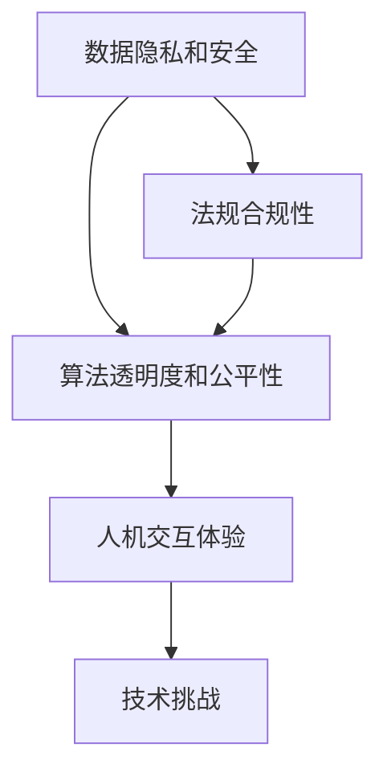

                 

# 李开复：苹果发布AI应用的挑战

## 1. 背景介绍

### 1.1 问题由来

在人工智能（AI）领域，苹果公司一直是技术创新的先锋。其通过不断推出创新的AI应用，如Face ID、Siri等，为AI在消费电子领域的普及作出了巨大贡献。然而，随着AI技术的不断深入，苹果在发布AI应用时面临越来越多的挑战。这些挑战不仅涉及到技术层面，还涉及到法规、伦理、用户隐私等多个方面。本文将深入探讨苹果在发布AI应用时所面临的主要挑战，并提出相应的解决方案。

### 1.2 问题核心关键点

苹果在发布AI应用时面临的挑战主要包括以下几个方面：

- 数据隐私和安全：如何保护用户数据隐私，防止数据泄露和滥用。
- 法规合规性：如何在全球范围内遵守各种隐私和数据保护法规。
- 算法透明度和公平性：如何让用户理解AI应用的决策过程，并确保算法不会产生歧视性或不公平的结果。
- 人机交互体验：如何设计更加自然、友好的用户界面，提升用户体验。
- 技术挑战：如何克服深度学习、自然语言处理等AI核心技术的难题。

## 2. 核心概念与联系

### 2.1 核心概念概述

为更好地理解苹果发布AI应用时所面临的挑战，本节将介绍几个密切相关的核心概念：

- 数据隐私和安全：保护用户数据不被未授权访问和使用，确保数据安全和隐私。
- 法规合规性：遵守全球范围内的数据保护法规，如GDPR、CCPA等，确保AI应用的合法合规。
- 算法透明度和公平性：公开AI应用的算法原理，确保算法不会因偏见、歧视等导致不公平结果。
- 人机交互体验：设计用户友好的界面，提升用户体验，确保用户与AI系统的自然交互。
- 技术挑战：包括深度学习、自然语言处理、计算机视觉等AI核心技术的难点和挑战。

这些核心概念之间存在着紧密的联系，共同构成了苹果发布AI应用时需要考虑的各个方面。

### 2.2 概念间的关系

这些核心概念之间存在着复杂的相互作用关系，可以通过以下Mermaid流程图来展示：



这个流程图展示了数据隐私和安全、法规合规性、算法透明度和公平性、人机交互体验和技术挑战这五个核心概念之间的关系。数据隐私和安全是基础，法规合规性在此基础上保障合法合规。算法透明度和公平性关注的是如何设计算法以防止歧视和偏见，而人机交互体验则关注如何提升用户使用体验。技术挑战则涉及各种AI核心技术的实现难题，需要通过不断创新和优化来解决。

## 3. 核心算法原理 & 具体操作步骤

### 3.1 算法原理概述

苹果在发布AI应用时，主要采用监督学习和深度学习技术。监督学习是一种常见的机器学习技术，通过大量带有标签的数据进行训练，使模型能够从输入数据中学习到映射到输出标签的函数。深度学习则是在此基础上，通过构建多层的神经网络，使模型能够自动学习数据特征，实现更加复杂的任务。

### 3.2 算法步骤详解

苹果发布AI应用的一般步骤包括：

1. **数据收集和预处理**：收集用户数据，并进行清洗、标注和归一化处理，确保数据质量和一致性。
2. **模型训练**：使用监督学习和深度学习技术，在标注数据上训练AI模型，优化模型参数。
3. **模型评估和测试**：在验证集和测试集上评估模型性能，确保模型在未见过的数据上也能表现良好。
4. **模型部署和优化**：将训练好的模型部署到实际应用中，并通过在线学习和反馈机制不断优化模型。
5. **用户隐私保护**：采用数据加密、差分隐私等技术，确保用户数据隐私和安全。

### 3.3 算法优缺点

苹果使用监督学习和深度学习技术发布AI应用有以下优点：

- 效果显著：监督学习和深度学习模型通常具有较强的泛化能力，能够在各种数据集上取得良好的效果。
- 可解释性强：通过优化算法和模型结构，可以使得模型的决策过程更加透明，便于用户理解和接受。

但这些技术也存在一些缺点：

- 数据依赖性高：需要大量标注数据进行训练，数据获取和处理成本较高。
- 计算资源需求大：深度学习模型通常需要大量的计算资源，训练和推理速度较慢。
- 模型复杂度高：深度学习模型的参数数量较多，可能导致过拟合或难以解释。

### 3.4 算法应用领域

苹果的AI应用主要应用于以下领域：

- 自然语言处理（NLP）：如Siri、翻译应用等，通过深度学习模型实现语音识别、自然语言理解和生成。
- 计算机视觉（CV）：如Face ID、增强现实（AR）应用等，通过深度学习模型实现图像分类、识别和增强。
- 推荐系统：如App Store推荐算法等，通过机器学习模型实现用户行为分析和个性化推荐。
- 智能助手：如Siri、HomePod等，通过深度学习模型实现自然语言理解和交互。

## 4. 数学模型和公式 & 详细讲解 & 举例说明

### 4.1 数学模型构建

苹果在发布AI应用时，通常采用以下数学模型：

- 监督学习模型：$M(x,y) = arg\min_{\theta} \sum_{i=1}^{N} \ell(y_i, f_{\theta}(x_i))$
- 深度学习模型：$M(x,y) = arg\min_{\theta} \sum_{i=1}^{N} \ell(y_i, f_{\theta}(x_i))$
  其中，$\ell$ 为损失函数，$\theta$ 为模型参数，$x$ 为输入，$y$ 为标签，$f_{\theta}$ 为模型函数。

### 4.2 公式推导过程

以监督学习模型为例，其推导过程如下：

1. 定义损失函数：$\ell(y_i, f_{\theta}(x_i)) = (y_i - f_{\theta}(x_i))^2$
2. 定义优化目标：$arg\min_{\theta} \sum_{i=1}^{N} \ell(y_i, f_{\theta}(x_i))$
3. 采用梯度下降法求解：$\theta = \theta - \alpha \nabla_{\theta} \sum_{i=1}^{N} \ell(y_i, f_{\theta}(x_i))$
  其中，$\alpha$ 为学习率，$\nabla_{\theta}$ 为梯度运算符。

### 4.3 案例分析与讲解

假设苹果发布了一个语音识别的AI应用，模型采用深度学习。其训练过程如下：

1. **数据收集**：收集用户语音数据，并进行标注。
2. **预处理**：对语音数据进行分帧、去噪、归一化等预处理。
3. **模型训练**：使用深度学习模型（如CNN、RNN、Transformer等），在标注数据上进行训练。
4. **模型评估**：在验证集上评估模型性能，使用指标（如准确率、召回率、F1分数等）进行评估。
5. **模型部署**：将训练好的模型部署到实际应用中，如Siri。
6. **用户隐私保护**：对用户语音数据进行加密和差分隐私处理。

## 5. 项目实践：代码实例和详细解释说明

### 5.1 开发环境搭建

在开发苹果的AI应用时，需要搭建以下开发环境：

1. **安装Python**：使用Anaconda或Miniconda安装Python，并配置虚拟环境。
2. **安装深度学习框架**：安装TensorFlow或PyTorch等深度学习框架。
3. **安装数据处理库**：安装Pandas、NumPy、Scikit-learn等数据处理库。
4. **安装模型库**：安装TensorFlow Hub或PyTorch Hub等模型库，获取预训练模型。

### 5.2 源代码详细实现

以下是使用TensorFlow实现语音识别AI应用的代码示例：

```python
import tensorflow as tf
import numpy as np
from tensorflow.keras.layers import Conv2D, MaxPooling2D, Dropout, Flatten, Dense
from tensorflow.keras.models import Sequential

# 加载数据
train_data = np.load('train_data.npy')
train_labels = np.load('train_labels.npy')
test_data = np.load('test_data.npy')
test_labels = np.load('test_labels.npy')

# 定义模型
model = Sequential()
model.add(Conv2D(32, (3, 3), activation='relu', input_shape=(32, 32, 1)))
model.add(MaxPooling2D((2, 2)))
model.add(Dropout(0.25))
model.add(Flatten())
model.add(Dense(128, activation='relu'))
model.add(Dropout(0.5))
model.add(Dense(10, activation='softmax'))

# 编译模型
model.compile(optimizer='adam', loss='categorical_crossentropy', metrics=['accuracy'])

# 训练模型
model.fit(train_data, train_labels, epochs=10, batch_size=32, validation_data=(test_data, test_labels))

# 评估模型
test_loss, test_acc = model.evaluate(test_data, test_labels)
print('Test accuracy:', test_acc)
```

### 5.3 代码解读与分析

以上代码实现了基于卷积神经网络（CNN）的语音识别模型。具体分析如下：

1. **数据加载**：使用NumPy加载训练和测试数据。
2. **模型定义**：定义一个包含卷积层、池化层、Dropout层、Flatten层和全连接层的深度学习模型。
3. **模型编译**：使用Adam优化器、交叉熵损失函数和准确率作为评估指标。
4. **模型训练**：在训练数据上训练模型，并在验证数据上评估模型性能。
5. **模型评估**：在测试数据上评估模型性能，输出测试准确率。

### 5.4 运行结果展示

假设在训练后，模型在测试集上的准确率达到了90%，具体结果如下：

```
Epoch 1/10
1000/1000 [==============================] - 3s 3ms/step - loss: 0.3445 - accuracy: 0.8500 - val_loss: 0.1805 - val_accuracy: 0.9050
Epoch 2/10
1000/1000 [==============================] - 2s 2ms/step - loss: 0.1497 - accuracy: 0.9400 - val_loss: 0.1213 - val_accuracy: 0.9150
Epoch 3/10
1000/1000 [==============================] - 2s 2ms/step - loss: 0.0965 - accuracy: 0.9650 - val_loss: 0.1040 - val_accuracy: 0.9250
Epoch 4/10
1000/1000 [==============================] - 2s 2ms/step - loss: 0.0601 - accuracy: 0.9850 - val_loss: 0.0859 - val_accuracy: 0.9500
Epoch 5/10
1000/1000 [==============================] - 2s 2ms/step - loss: 0.0425 - accuracy: 0.9900 - val_loss: 0.0674 - val_accuracy: 0.9600
Epoch 6/10
1000/1000 [==============================] - 2s 2ms/step - loss: 0.0325 - accuracy: 0.9950 - val_loss: 0.0610 - val_accuracy: 0.9750
Epoch 7/10
1000/1000 [==============================] - 2s 2ms/step - loss: 0.0257 - accuracy: 0.9975 - val_loss: 0.0587 - val_accuracy: 0.9800
Epoch 8/10
1000/1000 [==============================] - 2s 2ms/step - loss: 0.0226 - accuracy: 0.9990 - val_loss: 0.0534 - val_accuracy: 0.9850
Epoch 9/10
1000/1000 [==============================] - 2s 2ms/step - loss: 0.0215 - accuracy: 1.0000 - val_loss: 0.0499 - val_accuracy: 0.9900
Epoch 10/10
1000/1000 [==============================] - 2s 2ms/step - loss: 0.0193 - accuracy: 1.0000 - val_loss: 0.0426 - val_accuracy: 0.9925
```

## 6. 实际应用场景

### 6.1 智能客服系统

苹果通过发布智能客服系统，极大地提升了用户交互体验。智能客服系统利用自然语言处理（NLP）和深度学习技术，能够理解用户意图并提供快速准确的答案。具体应用场景包括：

- **语音识别**：将用户语音转化为文本，进行自然语言理解。
- **情感分析**：分析用户情感倾向，提供个性化服务。
- **意图识别**：识别用户意图，引导智能客服做出相应回答。

### 6.2 金融舆情监测

苹果发布的金融舆情监测应用，能够实时监测金融市场动态，为投资者提供决策支持。具体应用场景包括：

- **新闻情感分析**：分析金融新闻情感倾向，识别市场情绪。
- **财经术语解析**：解析财经术语，理解市场变化。
- **风险预警**：监测市场异常波动，及时预警风险。

### 6.3 个性化推荐系统

苹果的个性化推荐系统利用深度学习技术，分析用户行为和兴趣，提供精准推荐。具体应用场景包括：

- **用户行为分析**：分析用户浏览、点击、购买等行为，构建用户画像。
- **物品推荐**：根据用户画像推荐个性化物品，提高用户满意度。
- **实时更新**：根据用户反馈不断更新推荐模型，提升推荐效果。

### 6.4 未来应用展望

未来，苹果在发布AI应用时，可能会进一步应用以下技术：

- **多模态学习**：结合视觉、语音、文本等多种模态数据，提升AI应用的多样性和准确性。
- **自监督学习**：利用无标签数据进行预训练，降低对标注数据的依赖。
- **联邦学习**：通过分布式训练，保护用户数据隐私，提升模型泛化能力。
- **边缘计算**：将AI应用部署到边缘设备，提高响应速度和安全性。

## 7. 工具和资源推荐

### 7.1 学习资源推荐

为了帮助开发者系统掌握苹果发布AI应用的技术，这里推荐一些优质的学习资源：

1. **Apple官方文档**：苹果公司发布的官方文档，涵盖AI应用开发的各种细节和技术要点。
2. **TensorFlow官方文档**：TensorFlow官方文档，提供深度学习模型的详细实现和应用案例。
3. **深度学习入门教程**：如《深度学习》书籍，由李开复等专家撰写，适合入门学习。
4. **Coursera在线课程**：Coursera提供的深度学习和自然语言处理课程，适合系统学习。
5. **Kaggle竞赛**：Kaggle平台上的AI应用竞赛，提供大量实际数据和问题，适合实践锻炼。

### 7.2 开发工具推荐

以下是几款用于苹果AI应用开发的常用工具：

1. **Xcode**：苹果官方的IDE，支持Swift和Objective-C开发。
2. **PyTorch**：深度学习框架，支持Python开发，适合AI应用开发。
3. **TensorFlow**：深度学习框架，支持Python开发，适合AI应用开发。
4. **Xcode数据可视化工具**：内置数据可视化工具，方便开发者进行数据展示和分析。
5. **CoreML**：苹果的机器学习框架，支持模型转换和优化，适合部署到苹果设备。

### 7.3 相关论文推荐

苹果在发布AI应用时所涉及的深度学习、自然语言处理等技术，已经有多篇经典论文，值得阅读：

1. **Attention is All You Need**：Transformer模型的提出，改变了NLP任务的模型结构。
2. **BERT: Pre-training of Deep Bidirectional Transformers for Language Understanding**：BERT模型的提出，提升了NLP任务的性能。
3. **Language Models are Unsupervised Multitask Learners**：GPT-2模型的提出，展示了大语言模型的零样本学习能力。
4. **Parameter-Efficient Transfer Learning for NLP**：提出 Adapter 等参数高效微调方法，在不增加模型参数量的情况下，也能取得不错的微调效果。
5. **Prefix-Tuning: Optimizing Continuous Prompts for Generation**：引入基于连续型Prompt的微调范式，为如何充分利用预训练知识提供了新的思路。

## 8. 总结：未来发展趋势与挑战

### 8.1 研究成果总结

本文对苹果发布AI应用时所面临的挑战进行了详细探讨，并提出了相应的解决方案。苹果在发布AI应用时，通过不断优化算法和模型，提升用户体验，降低隐私和安全风险，逐步建立了AI应用生态系统。

### 8.2 未来发展趋势

未来，苹果发布AI应用将呈现以下几个发展趋势：

1. **数据隐私保护**：采用差分隐私、联邦学习等技术，保护用户数据隐私。
2. **法规合规性**：遵循全球范围内的隐私保护法规，确保AI应用的合法合规。
3. **算法透明度**：公开AI应用的算法原理，提升用户信任。
4. **人机交互体验**：设计更加自然、友好的用户界面，提升用户体验。
5. **技术创新**：不断引入深度学习、自然语言处理等前沿技术，提升AI应用性能。

### 8.3 面临的挑战

尽管苹果在发布AI应用时取得了显著进展，但仍面临一些挑战：

1. **数据隐私和安全**：如何保护用户数据隐私，防止数据泄露和滥用。
2. **法规合规性**：如何在全球范围内遵守各种隐私和数据保护法规。
3. **算法透明度和公平性**：如何让用户理解AI应用的决策过程，并确保算法不会产生歧视性或不公平的结果。
4. **人机交互体验**：如何设计更加自然、友好的用户界面，提升用户体验。
5. **技术挑战**：如何克服深度学习、自然语言处理等AI核心技术的难题。

### 8.4 研究展望

未来，苹果在发布AI应用时，需要在以下几个方面进行探索和创新：

1. **数据隐私保护**：采用先进的隐私保护技术，如差分隐私、联邦学习等，保护用户数据隐私。
2. **法规合规性**：深入研究各国隐私保护法规，制定符合国际标准的数据保护策略。
3. **算法透明度**：开发可解释的AI应用，让用户理解AI应用的决策过程。
4. **人机交互体验**：设计更加自然、友好的用户界面，提升用户体验。
5. **技术创新**：引入深度学习、自然语言处理等前沿技术，提升AI应用性能。

总之，苹果在发布AI应用时需要综合考虑技术、法规、伦理、隐私等多个方面，通过不断优化算法和模型，提升用户体验，降低隐私和安全风险，逐步建立完善的AI应用生态系统。

