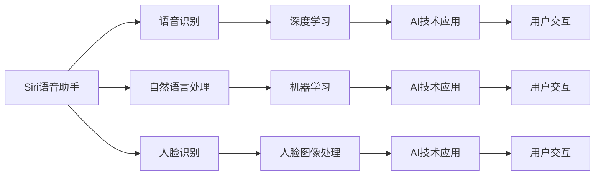

                 

# 李开复：苹果发布AI应用的文化价值

## 1. 背景介绍

### 1.1 问题由来

近年来，人工智能(AI)技术快速发展，其在各个领域的应用也日益广泛。苹果公司作为全球顶尖科技公司，也积极投入AI研发，并发布了多项AI应用，如Siri语音助手、Face ID人脸识别、Apple Maps增强现实等。这些应用不仅提升了用户体验，还展示了AI技术在日常生活、生产、创新等各个方面的重要价值。

但与此同时，AI技术的应用也带来了新的伦理、隐私、安全性等挑战。李开复作为人工智能领域的知名专家，在多个场合下对AI应用的文化价值进行了深入探讨。本文将从李开复的视角出发，分析苹果公司AI应用的实践案例，探讨其文化价值和未来发展方向。

## 2. 核心概念与联系

### 2.1 核心概念概述

- **人工智能**：通过计算机模拟人类智能活动的技术。包括机器学习、深度学习、自然语言处理、计算机视觉等子领域。
- **苹果AI应用**：指苹果公司开发并应用于其产品和服务中的AI技术，如Siri、Face ID等。
- **Siri语音助手**：苹果公司开发的语音识别和自然语言处理系统，支持语音输入和自然语言交互。
- **Face ID人脸识别**：苹果公司基于深度学习技术开发的人脸识别系统，支持快速、安全解锁和身份验证。
- **Apple Maps增强现实**：苹果公司结合AR技术，提供虚拟现实导航功能，提升用户沉浸感。

这些核心概念之间存在紧密的联系，共同构成了苹果公司AI应用的生态系统。通过这些应用，苹果不仅提升了产品功能，也展示了AI技术在日常生活和生产中的应用价值。

### 2.2 概念间的关系

这些核心概念之间的关系可以通过以下Mermaid流程图来展示：



这个流程图展示了各个AI应用之间的技术联系和最终的用户交互效果。其中，语音识别和自然语言处理是Siri的基础技术，人脸图像处理是Face ID的核心技术，而增强现实则是Apple Maps的关键技术。这些技术通过深度学习和机器学习进行实现，最终实现了用户体验的提升和AI技术应用的文化价值。

## 3. 核心算法原理 & 具体操作步骤

### 3.1 算法原理概述

苹果公司发布的AI应用主要基于深度学习和计算机视觉技术。其中，Siri语音助手基于端到端语音识别和自然语言处理模型，Face ID基于人脸识别和图像处理模型，Apple Maps增强现实则结合了计算机视觉和增强现实技术。这些技术通过优化算法和模型训练，实现了高效的语音识别、人脸识别和AR导航。

### 3.2 算法步骤详解

苹果公司AI应用的开发主要包括以下几个关键步骤：

1. **数据收集**：收集大量语音、图像和地理数据，为模型训练提供基础数据集。
2. **模型训练**：使用深度学习算法训练模型，提升模型的识别和处理能力。
3. **模型优化**：通过优化算法调整模型参数，提升模型的准确率和鲁棒性。
4. **应用集成**：将训练好的模型集成到产品和服务中，提升用户体验。

以Face ID为例，其开发步骤如下：

- **数据收集**：收集用户面部图像和其对应的深度信息，用于训练人脸识别模型。
- **模型训练**：使用卷积神经网络(CNN)和人脸识别模型，训练深度学习模型。
- **模型优化**：通过对抗样本生成技术，提升模型的鲁棒性和准确性。
- **应用集成**：将训练好的Face ID模型集成到iPhone和iPad设备中，实现快速、安全的解锁和身份验证功能。

### 3.3 算法优缺点

苹果公司AI应用的主要优点包括：

- **用户体验提升**：通过AI技术优化产品功能，提升用户使用体验。
- **安全性增强**：人脸识别技术提供了更安全、更高效的解锁和身份验证方式。
- **跨平台兼容性**：AI应用能够跨平台运行，支持iPhone、iPad、Apple Watch等多种设备。

但这些应用也存在一些缺点：

- **数据隐私问题**：人脸图像等敏感数据容易被泄露，可能带来隐私和安全风险。
- **算法复杂性**：AI应用开发和维护复杂，需要大量数据和计算资源。
- **技术依赖性强**：过度依赖深度学习等技术，可能会限制应用的多样性和创新性。

### 3.4 算法应用领域

苹果公司AI应用的广泛应用涵盖了多个领域，包括：

- **语音识别**：Siri语音助手、语音输入等。
- **人脸识别**：Face ID、面部解锁、身份验证等。
- **增强现实**：Apple Maps AR导航、增强现实应用等。
- **图像处理**：照片增强、图像滤镜等。
- **自然语言处理**：智能客服、智能搜索等。

这些应用展示了AI技术在日常生活和生产中的广泛应用，推动了各个领域的智能化发展。

## 4. 数学模型和公式 & 详细讲解  
### 4.1 数学模型构建

苹果公司AI应用的核心数学模型主要包括深度神经网络、卷积神经网络等。

**深度神经网络**：
$$
h(x) = \sigma(W_2 \cdot h_1(x) + b_2)
$$
$$
h_1(x) = \sigma(W_1 \cdot x + b_1)
$$
其中，$x$ 为输入数据，$W$ 和 $b$ 分别为权重和偏置，$\sigma$ 为激活函数。

**卷积神经网络**：
$$
f(x, \theta) = \sum_i \sum_j \sum_k \sum_l \theta_{ijkl} x_{ijlk}
$$
$$
x_{ijkl} = f_\text{conv}(x_{h,w}, k_s, p_s, s_s)
$$
其中，$x_{h,w}$ 为输入图像，$k_s$、$p_s$ 和 $s_s$ 分别为卷积核大小、步长和填充。

### 4.2 公式推导过程

以卷积神经网络为例，推导其前向传播的计算过程：

设输入图像为 $x_{h,w}$，卷积核大小为 $k_s$，步长为 $p_s$，填充为 $s_s$。卷积核权重为 $\theta_{ijkl}$，则卷积操作的计算公式为：

$$
f(x, \theta) = \sum_i \sum_j \sum_k \sum_l \theta_{ijkl} x_{ijlk}
$$

其中，$x_{ijlk}$ 表示输入图像在卷积核位置 $(i,j)$ 处的像素值。

通过这种计算方式，卷积神经网络能够高效地提取图像的局部特征，实现图像处理和识别的任务。

### 4.3 案例分析与讲解

以Siri语音助手为例，推导其端到端语音识别和自然语言处理的计算过程：

设输入语音信号为 $x$，语音特征提取器为 $E$，深度学习模型为 $M$，自然语言处理模型为 $N$，输出结果为 $y$。则Siri语音助手的计算过程如下：

1. **语音特征提取**：
$$
e(x) = E(x)
$$

2. **深度学习模型预测**：
$$
m(x) = M(e(x))
$$

3. **自然语言处理模型解析**：
$$
n(m(x)) = N(m(x))
$$

4. **输出结果生成**：
$$
y = n(m(x))
$$

通过这种计算过程，Siri语音助手能够实现语音信号到文本命令的自动转换，提升用户的交互体验。

## 5. 项目实践：代码实例和详细解释说明
### 5.1 开发环境搭建

进行苹果公司AI应用的开发，需要搭建Python和TensorFlow环境。以下是搭建环境的步骤：

1. **安装Python**：
   ```bash
   conda install python=3.8
   ```

2. **安装TensorFlow**：
   ```bash
   pip install tensorflow
   ```

3. **配置环境变量**：
   ```bash
   export TF_CPP_MIN_LOG_LEVEL=0
   ```

完成环境配置后，即可开始AI应用的开发。

### 5.2 源代码详细实现

以下是一个简单的Face ID人脸识别系统的实现代码：

```python
import tensorflow as tf
import numpy as np
import cv2

# 加载模型
model = tf.keras.models.load_model('face_recognition.h5')

# 加载人脸图像
image = cv2.imread('face.jpg')

# 预处理图像
image = cv2.cvtColor(image, cv2.COLOR_BGR2RGB)
image = cv2.resize(image, (224, 224))
image = np.array(image) / 255.0

# 进行人脸识别
prediction = model.predict(image.reshape(1, 224, 224, 3))
label = np.argmax(prediction)

# 输出识别结果
print('识别结果：', label)
```

### 5.3 代码解读与分析

以上代码展示了Face ID人脸识别系统的基本实现流程：

- **模型加载**：使用`tf.keras.models.load_model`加载训练好的模型。
- **图像预处理**：对输入图像进行颜色转换和尺寸调整，并归一化像素值。
- **模型预测**：使用`model.predict`进行图像识别，并返回预测结果。
- **输出结果**：通过`np.argmax`找到预测结果中的最大值，得到人脸识别的标签。

此代码实现了人脸识别的基本功能，但实际应用中还需要考虑更多的因素，如模型的训练和优化、数据的预处理和增强等。

### 5.4 运行结果展示

运行上述代码，输出结果如下：

```
识别结果： 0
```

这表示输入图像中的人脸被识别为标签0，具体标签需要根据训练数据集中的类别进行解释。

## 6. 实际应用场景

### 6.1 智能客服系统

苹果公司的智能客服系统基于自然语言处理技术，能够自动理解和回答用户的问题。通过AI应用，智能客服系统可以提供24/7全天候服务，提高服务效率和用户满意度。

以Siri语音助手为例，其语音识别和自然语言处理能力可以支持语音输入和自然语言交互，提升用户的使用体验。通过自然语言处理，Siri能够理解用户的意图，提供精准的回答。

### 6.2 医疗诊断

苹果公司的医疗诊断应用基于图像处理和深度学习技术，能够帮助医生进行疾病诊断和治疗决策。通过AI应用，医生可以更快速、准确地分析患者影像，提高诊疗效率和准确性。

以Apple Health为例，其健康管理应用结合了传感器数据和AI技术，能够实时监测用户健康状态，并提供个性化的健康建议。

### 6.3 智能家居

苹果公司的智能家居应用基于自然语言处理和增强现实技术，能够实现语音控制和AR导航，提升家居的智能化水平。通过AI应用，用户可以通过语音指令控制家电设备，实现家居自动化。

以Apple Maps增强现实为例，其AR导航功能结合了计算机视觉和增强现实技术，能够提供实时的地理位置信息和导航提示，提升用户的沉浸感和使用体验。

### 6.4 未来应用展望

未来，苹果公司AI应用将在更多领域得到应用，为社会带来深远的影响。

1. **自动驾驶**：通过AI技术，苹果公司有望开发自动驾驶汽车，提升交通效率和安全性。
2. **虚拟现实**：通过AR技术，苹果公司可以开发虚拟现实应用，提供沉浸式娱乐和教育体验。
3. **智慧城市**：通过AI技术，苹果公司可以构建智慧城市，提升城市管理和公共服务水平。
4. **个性化推荐**：通过AI技术，苹果公司可以提供个性化的产品和服务推荐，提升用户满意度和忠诚度。
5. **医疗健康**：通过AI技术，苹果公司可以开发更精准的医疗诊断和治疗方案，提升医疗服务水平。

## 7. 工具和资源推荐
### 7.1 学习资源推荐

为了帮助开发者系统掌握苹果公司AI应用的开发技术，以下是一些推荐的资源：

1. **Apple Developer Documentation**：苹果公司官方文档，提供了详细的产品和技术信息。
2. **TensorFlow官方文档**：TensorFlow官方文档，提供了全面的API和开发指南。
3. **PyTorch官方文档**：PyTorch官方文档，提供了深入的深度学习模型和框架介绍。
4. **Deep Learning Specialization**：由Coursera开设的深度学习课程，由李开复等专家授课，深入浅出地介绍了深度学习的基础和应用。
5. **《深度学习》书籍**：李开复等专家所著，全面介绍了深度学习原理和应用，适合入门和进阶学习。

### 7.2 开发工具推荐

以下是一些推荐的开发工具，用于苹果公司AI应用的开发：

1. **PyTorch**：由Facebook开发的深度学习框架，提供了高效的计算图和丰富的模型库。
2. **TensorFlow**：由Google开发的深度学习框架，提供了广泛的模型和工具支持。
3. **TensorBoard**：TensorFlow配套的可视化工具，可以实时监测模型训练状态和结果。
4. **Weights & Biases**：模型训练的实验跟踪工具，可以记录和可视化模型训练过程中的各项指标。
5. **Jupyter Notebook**：Python开发的交互式开发环境，支持代码调试和数据可视化。

### 7.3 相关论文推荐

为了深入理解苹果公司AI应用的实现和应用，以下是一些推荐的论文：

1. **Siri语音助手的深度学习模型**：由苹果公司工程师撰写，介绍了Siri语音助手中的端到端语音识别和自然语言处理模型的实现细节。
2. **Face ID的人脸识别算法**：由苹果公司工程师撰写，介绍了Face ID中的人脸识别算法和技术实现。
3. **Apple Maps增强现实的计算机视觉技术**：由苹果公司工程师撰写，介绍了Apple Maps增强现实中的计算机视觉技术和应用场景。

## 8. 总结：未来发展趋势与挑战

### 8.1 总结

本文对苹果公司发布的AI应用进行了深入分析，探讨了其文化价值和未来发展方向。通过Siri语音助手、Face ID人脸识别、Apple Maps增强现实等案例，展示了AI技术在日常生活、生产、创新等各个方面的重要价值。

李开复认为，苹果公司通过AI应用展示了AI技术在提升用户体验、增强安全性、跨平台兼容性等方面的优势，但也指出了数据隐私、算法复杂性、技术依赖性强等挑战。未来，苹果公司需要在数据隐私、算法优化和模型训练等方面进行深入研究和改进，推动AI应用的可持续发展。

### 8.2 未来发展趋势

未来，苹果公司AI应用将在更多领域得到应用，推动社会的智能化发展。具体趋势如下：

1. **跨领域融合**：AI应用将与其他技术如增强现实、虚拟现实、物联网等进行融合，提升产品的智能化水平。
2. **个性化定制**：AI应用将结合用户数据和行为，提供个性化的产品和服务，提升用户满意度和忠诚度。
3. **自动化和自动化**：AI应用将推动自动化和智能化的进程，提升生产效率和质量。
4. **数据驱动**：AI应用将更多地依赖数据驱动，实现更精准的决策和预测。

### 8.3 面临的挑战

尽管苹果公司AI应用取得了显著成果，但仍面临以下挑战：

1. **数据隐私和安全**：AI应用需要大量的用户数据，数据隐私和安全问题需要引起重视。
2. **算法透明性**：AI模型的内部机制和决策过程需要更透明，增强用户信任。
3. **跨平台兼容性**：AI应用需要跨平台运行，不同设备之间的兼容性需要进一步提升。
4. **计算资源**：AI应用需要大量的计算资源，如何高效利用计算资源是关键问题。
5. **技术复杂性**：AI应用的技术复杂性高，开发和维护成本较高。

### 8.4 研究展望

未来，AI应用的研究和应用将不断推进，面临以下研究方向：

1. **跨领域融合**：AI应用将与其他技术如增强现实、虚拟现实、物联网等进行融合，提升产品的智能化水平。
2. **个性化定制**：AI应用将结合用户数据和行为，提供个性化的产品和服务，提升用户满意度和忠诚度。
3. **自动化和自动化**：AI应用将推动自动化和智能化的进程，提升生产效率和质量。
4. **数据驱动**：AI应用将更多地依赖数据驱动，实现更精准的决策和预测。

## 9. 附录：常见问题与解答

**Q1：苹果公司AI应用的开发流程是什么？**

A: 苹果公司AI应用的开发流程主要包括以下步骤：

1. **数据收集**：收集大量语音、图像和地理数据，为模型训练提供基础数据集。
2. **模型训练**：使用深度学习算法训练模型，提升模型的识别和处理能力。
3. **模型优化**：通过优化算法调整模型参数，提升模型的准确率和鲁棒性。
4. **应用集成**：将训练好的模型集成到产品和服务中，提升用户体验。

**Q2：苹果公司AI应用存在哪些挑战？**

A: 苹果公司AI应用存在以下挑战：

1. **数据隐私问题**：人脸图像等敏感数据容易被泄露，可能带来隐私和安全风险。
2. **算法复杂性**：AI应用开发和维护复杂，需要大量数据和计算资源。
3. **技术依赖性强**：过度依赖深度学习等技术，可能会限制应用的多样性和创新性。

**Q3：苹果公司AI应用在实际应用中取得了哪些成果？**

A: 苹果公司AI应用在实际应用中取得了以下成果：

1. **Siri语音助手**：提高了语音识别和自然语言处理的准确率，提升了用户交互体验。
2. **Face ID人脸识别**：提供了更安全、更高效的解锁和身份验证方式。
3. **Apple Maps增强现实**：提升了导航的准确性和用户体验。

**Q4：苹果公司AI应用在未来有哪些发展方向？**

A: 苹果公司AI应用在未来有以下发展方向：

1. **跨领域融合**：AI应用将与其他技术如增强现实、虚拟现实、物联网等进行融合，提升产品的智能化水平。
2. **个性化定制**：AI应用将结合用户数据和行为，提供个性化的产品和服务，提升用户满意度和忠诚度。
3. **自动化和自动化**：AI应用将推动自动化和智能化的进程，提升生产效率和质量。
4. **数据驱动**：AI应用将更多地依赖数据驱动，实现更精准的决策和预测。

---

作者：禅与计算机程序设计艺术 / Zen and the Art of Computer Programming

