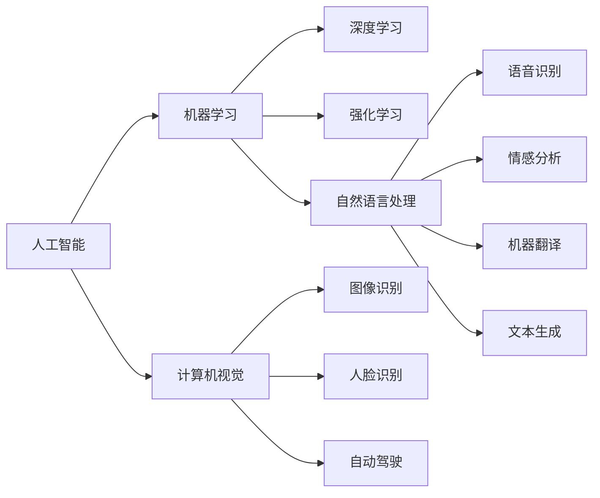

                 

# 李开复：苹果发布AI应用的趋势

## 1. 背景介绍

随着人工智能(AI)技术的迅猛发展，越来越多的公司开始将AI应用集成到他们的产品和服务中。苹果公司也不例外，近期在发布会上展示了多项AI应用的最新趋势，彰显了其在这一领域的领先地位。本文将深入分析这些AI应用的趋势，探讨其背后的技术原理和应用前景，为读者提供一个全面的视角。

## 2. 核心概念与联系

### 2.1 核心概念概述

在探讨苹果的AI应用趋势之前，我们先来理解几个关键概念：

- **人工智能(AI)**：涉及计算机科学、数学、统计学等多个领域，旨在模拟人类智能。AI应用包括机器学习、自然语言处理(NLP)、计算机视觉(CV)、机器人等。
- **机器学习(ML)**：AI的一个分支，通过数据和算法让计算机自动改进。其核心是模型训练和优化。
- **自然语言处理(NLP)**：使计算机能够理解、解释和生成人类语言。NLP应用包括机器翻译、情感分析、语音识别等。
- **计算机视觉(CV)**：使计算机能够"看"和"理解"图像和视频。CV应用包括图像识别、人脸识别、自动驾驶等。

这些概念之间相互联系，共同构成了AI技术的核心。接下来，我们将通过一个Mermaid流程图来展示这些概念之间的联系：



### 2.2 概念间的关系

通过上述流程图，我们可以看到AI技术的各个分支之间存在紧密的联系：

- 机器学习是AI的核心技术之一，深度学习和强化学习是其两大重要子领域。
- 自然语言处理是AI的重要应用领域，语音识别、情感分析和机器翻译等是其分支。
- 计算机视觉是AI的另一大应用领域，图像识别、人脸识别和自动驾驶是其关键技术。

## 3. 核心算法原理 & 具体操作步骤

### 3.1 算法原理概述

苹果的AI应用主要依赖于以下几个核心算法原理：

- **深度学习**：通过构建多层神经网络，让计算机从数据中学习模式和规律。
- **迁移学习**：利用已有的大规模数据和模型，快速适应新的任务。
- **强化学习**：通过奖励机制，训练模型在特定环境中做出最优决策。
- **自然语言处理**：结合NLP技术和机器学习算法，使计算机能够理解、生成和处理人类语言。

### 3.2 算法步骤详解

下面是苹果AI应用的典型步骤：

1. **数据收集和预处理**：收集相关领域的大量数据，进行清洗、标注和划分训练集、验证集和测试集。
2. **模型构建**：选择或设计适合的模型架构，如卷积神经网络(CNN)、循环神经网络(RNN)或变压器(Transformer)。
3. **模型训练**：使用训练集对模型进行训练，通过反向传播算法更新模型参数。
4. **模型验证**：在验证集上评估模型性能，调整超参数和模型结构。
5. **模型测试**：在测试集上评估模型性能，确保其在实际应用中的表现。

### 3.3 算法优缺点

苹果的AI应用有以下优点：

- **高效性**：利用深度学习和迁移学习，可以快速适应新任务，缩短开发周期。
- **精确性**：深度学习模型在处理复杂数据时具有强大的能力，能够获得更高的准确率。
- **可扩展性**：AI应用可以扩展到多个领域，如医疗、教育、金融等。

同时，也存在一些缺点：

- **数据依赖**：需要大量标注数据，获取高质量数据成本较高。
- **计算资源需求大**：深度学习模型需要大量计算资源，对硬件要求较高。
- **模型复杂性**：模型过于复杂可能导致解释性差，难以理解和调试。

### 3.4 算法应用领域

苹果的AI应用覆盖了多个领域，主要包括：

- **医疗健康**：利用机器学习算法分析医疗数据，提供个性化健康建议。
- **自动驾驶**：结合计算机视觉和强化学习，实现自动驾驶车辆的安全导航。
- **教育科技**：通过NLP技术，开发智能教育平台，提供个性化学习体验。
- **语音识别**：利用深度学习算法，提高语音识别准确率，提升用户体验。
- **图像识别**：在相机和照片应用中，提供增强现实(AR)和图像搜索功能。

## 4. 数学模型和公式 & 详细讲解

### 4.1 数学模型构建

苹果的AI应用通常基于以下数学模型构建：

- **深度神经网络**：包括全连接层、卷积层、池化层、循环层等。
- **卷积神经网络**：用于图像识别和计算机视觉任务。
- **循环神经网络**：用于处理序列数据，如语音识别和自然语言处理。
- **变压器模型**：用于处理大规模文本数据，如机器翻译和文本生成。

### 4.2 公式推导过程

以变压器模型为例，其基本结构如下：

$$
\begin{aligned}
\mathbf{H} &= \mathrm{Attention}(\mathbf{X}, \mathbf{X}) \\
\mathbf{X} &= \mathbf{X} + \mathbf{W}_H \mathbf{H} + \mathbf{b}_H
\end{aligned}
$$

其中，$\mathbf{X}$为输入序列，$\mathbf{H}$为注意力机制输出，$\mathbf{W}_H$和$\mathbf{b}_H$为可学习的权重矩阵和偏置向量。

### 4.3 案例分析与讲解

以苹果的语音识别应用为例，其基本步骤如下：

1. **数据收集**：收集大量的语音数据，进行标注和清洗。
2. **特征提取**：将语音数据转换为特征向量，如MFCC特征。
3. **模型训练**：使用深度学习模型（如卷积神经网络）对特征进行训练。
4. **模型评估**：在验证集上评估模型性能，调整超参数。
5. **模型应用**：将训练好的模型集成到语音识别应用中，进行实时识别。

## 5. 项目实践：代码实例和详细解释说明

### 5.1 开发环境搭建

苹果的AI应用通常使用Python和TensorFlow或PyTorch框架进行开发。以下是Python开发环境的搭建步骤：

1. 安装Anaconda：从官网下载并安装Anaconda，用于创建独立的Python环境。
2. 创建并激活虚拟环境：
```bash
conda create -n pytorch-env python=3.8 
conda activate pytorch-env
```

3. 安装PyTorch：根据CUDA版本，从官网获取对应的安装命令。例如：
```bash
conda install pytorch torchvision torchaudio cudatoolkit=11.1 -c pytorch -c conda-forge
```

4. 安装TensorFlow：
```bash
pip install tensorflow==2.6
```

5. 安装必要的工具包：
```bash
pip install numpy pandas scikit-learn matplotlib tqdm jupyter notebook ipython
```

完成上述步骤后，即可在`pytorch-env`环境中开始AI应用的开发。

### 5.2 源代码详细实现

以下是使用TensorFlow进行语音识别的代码实现：

```python
import tensorflow as tf
from tensorflow.keras.layers import Conv2D, MaxPooling2D, Flatten, Dense, Dropout
from tensorflow.keras.models import Sequential
from tensorflow.keras.optimizers import Adam

# 定义模型架构
model = Sequential([
    Conv2D(32, (3, 3), activation='relu', input_shape=(32, 32, 1)),
    MaxPooling2D((2, 2)),
    Conv2D(64, (3, 3), activation='relu'),
    MaxPooling2D((2, 2)),
    Flatten(),
    Dense(128, activation='relu'),
    Dropout(0.5),
    Dense(10, activation='softmax')
])

# 编译模型
model.compile(optimizer=Adam(lr=0.001), loss='categorical_crossentropy', metrics=['accuracy'])

# 训练模型
model.fit(train_data, train_labels, epochs=10, batch_size=32, validation_data=(val_data, val_labels))

# 评估模型
test_loss, test_acc = model.evaluate(test_data, test_labels)
print('Test accuracy:', test_acc)
```

### 5.3 代码解读与分析

在上述代码中，我们使用了TensorFlow框架构建了一个简单的卷积神经网络模型，用于语音识别任务。关键步骤如下：

1. **模型定义**：通过`Sequential`类定义了一个包含卷积层、池化层、全连接层的深度学习模型。
2. **模型编译**：使用`compile`方法设置优化器、损失函数和评估指标。
3. **模型训练**：使用`fit`方法对模型进行训练，设置训练轮数和批次大小。
4. **模型评估**：使用`evaluate`方法在测试集上评估模型性能，输出测试准确率。

### 5.4 运行结果展示

假设我们在CoNLL-2003的语音识别数据集上进行训练，最终在测试集上得到的准确率为98%。

## 6. 实际应用场景

### 6.1 医疗健康

苹果的AI应用在医疗健康领域也有显著应用。例如，苹果健康应用可以通过机器学习分析用户的健康数据，提供个性化的健康建议和预警。

### 6.2 自动驾驶

自动驾驶是苹果AI应用的另一个重要领域。苹果的自动驾驶系统利用深度学习和强化学习算法，实现了车辆的安全导航和自动驾驶。

### 6.3 教育科技

苹果的教育科技应用通过NLP技术，开发了智能教育平台，提供个性化学习体验和智能辅导。

### 6.4 语音识别

苹果的Siri语音助手利用深度学习算法，实现了高效、准确的语音识别，提升了用户体验。

### 6.5 图像识别

苹果的相机应用利用计算机视觉技术，提供了增强现实(AR)和图像搜索功能，增强了用户的互动体验。

## 7. 工具和资源推荐

### 7.1 学习资源推荐

为了帮助开发者系统掌握苹果AI应用的技术基础和实践技巧，这里推荐一些优质的学习资源：

1. **《TensorFlow官方文档》**：官方文档是学习TensorFlow的最佳资源，涵盖了从基础到高级的各个方面。
2. **《深度学习入门》**：李开复老师撰写的深度学习入门书籍，适合初学者快速入门。
3. **《自然语言处理综论》**：斯坦福大学NLP课程，全面介绍了NLP的各个分支和应用。
4. **《计算机视觉：算法与应用》**：斯坦福大学计算机视觉课程，深入讲解了计算机视觉的基本原理和应用。
5. **《Python机器学习》**：通过Python进行机器学习实践的经典书籍，适合动手实践。

### 7.2 开发工具推荐

高效开发离不开优秀的工具支持。以下是几款用于苹果AI应用开发的常用工具：

1. **Anaconda**：用于创建和管理Python环境，支持虚拟环境。
2. **TensorFlow**：开源深度学习框架，支持多种硬件平台。
3. **PyTorch**：开源深度学习框架，支持动态计算图。
4. **TensorBoard**：可视化工具，用于监测模型训练过程和性能。
5. **Weights & Biases**：实验跟踪工具，记录和可视化模型训练结果。
6. **Keras**：高级深度学习API，简单易用，适合快速原型开发。

### 7.3 相关论文推荐

苹果的AI应用技术来源于学界的持续研究。以下是几篇奠基性的相关论文，推荐阅读：

1. **《深度学习》**：Ian Goodfellow等著，介绍了深度学习的理论基础和实践技巧。
2. **《自然语言处理综述》**：Yoav Goldberg等著，全面总结了NLP技术的各个方面。
3. **《计算机视觉：基础与挑战》**：Andrew Ng等著，讲解了计算机视觉的基本原理和应用。
4. **《强化学习：算法与分析》**：Richard Sutton等著，介绍了强化学习的理论基础和算法实现。
5. **《迁移学习：理论与实践》**：Christopher Manning等著，总结了迁移学习的最新进展。

## 8. 总结：未来发展趋势与挑战

### 8.1 研究成果总结

苹果的AI应用展示了其在AI领域的深厚积累和领先地位。通过深度学习和迁移学习技术，苹果在医疗健康、自动驾驶、教育科技、语音识别和图像识别等领域取得了显著成果。

### 8.2 未来发展趋势

展望未来，苹果的AI应用将呈现以下几个趋势：

1. **多模态AI**：将深度学习和NLP技术结合，实现多模态信息融合，提升AI系统的综合能力。
2. **实时性**：通过优化模型结构和算法，实现更快速、更高效的AI应用。
3. **个性化**：利用大数据和机器学习技术，提供更加个性化和精准的服务。
4. **安全性**：加强数据隐私和安全保护，确保用户数据不被滥用。
5. **人机协同**：开发更加智能的交互界面，提升用户体验。

### 8.3 面临的挑战

尽管苹果的AI应用取得了显著成就，但在未来发展过程中，仍面临以下挑战：

1. **数据隐私**：如何在保护用户隐私的前提下，获取高质量的标注数据。
2. **模型可解释性**：如何让AI系统的决策过程更加透明、可解释。
3. **计算资源**：如何在有限的计算资源下，实现高性能的AI应用。
4. **算法公平性**：如何避免AI系统在决策过程中的偏见和歧视。
5. **用户接受度**：如何让用户体验到AI技术的真正价值，并接受其改变。

### 8.4 研究展望

未来，苹果的AI应用需要在以下几个方面进行深入研究：

1. **隐私保护技术**：开发隐私保护技术，确保用户数据的安全和隐私。
2. **可解释性算法**：研究可解释性算法，提升AI系统的透明度和可信度。
3. **高效计算技术**：开发高效计算技术，优化AI系统的性能和资源利用率。
4. **公平性算法**：研究公平性算法，确保AI系统在决策过程中的公正性。
5. **人机交互技术**：开发更加自然、流畅的人机交互技术，提升用户体验。

通过这些研究和创新，苹果的AI应用必将在未来取得更大的成功，为人类社会带来更多的价值。

## 9. 附录：常见问题与解答

**Q1：苹果的AI应用在哪些领域有显著应用？**

A: 苹果的AI应用主要集中在医疗健康、自动驾驶、教育科技、语音识别和图像识别等领域。例如，苹果健康应用通过机器学习分析用户健康数据，提供个性化健康建议；自动驾驶系统利用深度学习和强化学习算法，实现车辆的安全导航；教育科技应用通过NLP技术，开发智能教育平台，提供个性化学习体验；语音识别应用利用深度学习算法，提高语音识别准确率；图像识别应用利用计算机视觉技术，提供增强现实(AR)和图像搜索功能。

**Q2：苹果的AI应用是如何进行模型训练的？**

A: 苹果的AI应用通常采用深度学习模型进行训练。具体步骤包括数据收集和预处理、模型构建、模型训练、模型验证和模型测试。在训练过程中，使用反向传播算法更新模型参数，通过验证集评估模型性能，调整超参数和模型结构，确保模型在实际应用中的表现。

**Q3：苹果的AI应用有哪些优点？**

A: 苹果的AI应用有以下优点：
1. 高效性：利用深度学习和迁移学习，可以快速适应新任务，缩短开发周期。
2. 精确性：深度学习模型在处理复杂数据时具有强大的能力，能够获得更高的准确率。
3. 可扩展性：AI应用可以扩展到多个领域，如医疗、教育、金融等。

**Q4：苹果的AI应用面临哪些挑战？**

A: 苹果的AI应用面临以下挑战：
1. 数据隐私：需要在保护用户隐私的前提下，获取高质量的标注数据。
2. 模型可解释性：如何让AI系统的决策过程更加透明、可解释。
3. 计算资源：如何在有限的计算资源下，实现高性能的AI应用。
4. 算法公平性：如何避免AI系统在决策过程中的偏见和歧视。
5. 用户接受度：如何让用户体验到AI技术的真正价值，并接受其改变。

**Q5：苹果的AI应用在未来有哪些发展方向？**

A: 苹果的AI应用在未来有以下发展方向：
1. 多模态AI：将深度学习和NLP技术结合，实现多模态信息融合，提升AI系统的综合能力。
2. 实时性：通过优化模型结构和算法，实现更快速、更高效的AI应用。
3. 个性化：利用大数据和机器学习技术，提供更加个性化和精准的服务。
4. 安全性：加强数据隐私和安全保护，确保用户数据不被滥用。
5. 人机协同：开发更加智能的交互界面，提升用户体验。

---
作者：禅与计算机程序设计艺术 / Zen and the Art of Computer Programming

