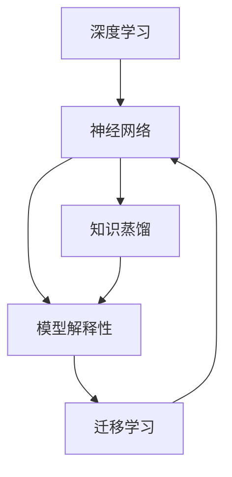
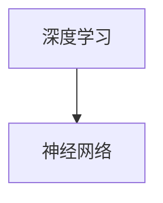
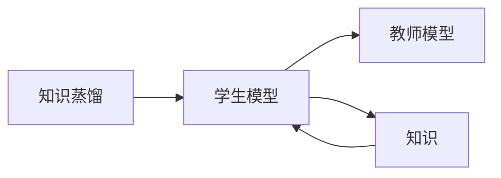
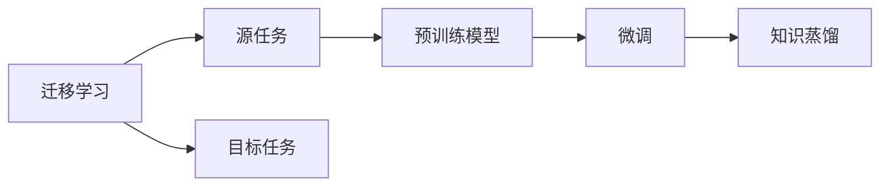

                 

# 知识蒸馏与模型解释性的深度融合

> 关键词：知识蒸馏, 模型解释性, 深度学习, 神经网络, 迁移学习, 自动推理

## 1. 背景介绍

随着深度学习技术的迅猛发展，深度神经网络在各个领域的应用越来越广泛，从计算机视觉、自然语言处理到语音识别、推荐系统，深度学习模型几乎无所不能。然而，这些深度模型虽然有着令人瞩目的性能，但也存在一些显著的问题，其中之一就是模型的"黑盒"特性，即模型的决策过程无法解释。这不仅限制了模型的应用范围，还使得模型的可信度受到质疑。因此，如何让深度模型变得更"透明"，提高其可解释性，成为深度学习领域的一大挑战。

为了解决这个问题，知识蒸馏（Knowledge Distillation）技术应运而生。知识蒸馏是一种通过将一个复杂的大模型（教师模型）的知识传递给一个小模型（学生模型）的方法，使得学生模型能够学习到教师模型的能力。通过这种方式，学生模型可以在保证性能的同时，获得较高的可解释性，使其更易于部署和应用。

本文将深入探讨知识蒸馏与模型解释性的深度融合，并结合实际案例，介绍如何在深度学习模型中进行知识蒸馏，从而提高模型的可解释性。

## 2. 核心概念与联系

### 2.1 核心概念概述

- **知识蒸馏**：通过将一个复杂的大模型的知识传递给一个小模型，使得小模型能够学习到大模型的能力。知识蒸馏的目的是减小模型规模，同时保持模型的性能。知识蒸馏是迁移学习的一种形式，可以通过模型压缩和模型融合等方法实现。

- **模型解释性**：模型的解释性是指对模型的决策过程进行可视化或可解释性分析，使得用户可以理解模型的行为和预测结果。模型解释性是深度学习模型能够被广泛应用的重要因素之一，特别是在医疗、金融等高风险领域，模型的解释性尤为重要。

- **深度学习**：深度学习是一种基于神经网络的人工智能技术，通过多层次的特征提取和分类来实现复杂任务。深度学习模型通常具有较高的复杂度和非线性特性，其决策过程难以理解和解释。

- **神经网络**：神经网络是一种由多个层次的节点（神经元）组成的网络结构，通过前向传播和反向传播实现数据的处理和预测。神经网络是深度学习模型的基础，可以应用于各种任务。

- **迁移学习**：迁移学习是一种将一个领域学到的知识，迁移到另一个不同但相关的领域的学习方法。迁移学习可以通过微调、知识蒸馏等方法实现，可以显著提高模型的泛化能力和性能。

这些核心概念之间的关系可以用以下Mermaid流程图来表示：



这个流程图展示了深度学习、神经网络、知识蒸馏、模型解释性和迁移学习之间的联系。深度学习和神经网络是知识蒸馏的基础，知识蒸馏可以减小模型规模，提高模型的泛化能力。模型解释性是深度学习的补充，通过可视化或可解释性分析，使得模型更透明、可信。迁移学习则是知识蒸馏和模型解释性的重要应用场景。

### 2.2 概念间的关系

这些核心概念之间存在着紧密的联系，形成了深度学习模型训练和部署的完整生态系统。下面用几个Mermaid流程图来展示这些概念之间的关系：

#### 2.2.1 深度学习与神经网络的关系



这个流程图展示了深度学习与神经网络的关系。深度学习是一种基于神经网络的技术，通过神经网络的多层次特征提取和分类来实现复杂任务。

#### 2.2.2 知识蒸馏与模型解释性的关系



这个流程图展示了知识蒸馏与模型解释性的关系。知识蒸馏通过将教师模型的知识传递给学生模型，使得学生模型能够学习到教师模型的能力，同时具有较高的可解释性。

#### 2.2.3 迁移学习与知识蒸馏的关系



这个流程图展示了迁移学习与知识蒸馏的关系。迁移学习涉及源任务和目标任务，通过预训练模型进行微调，使得模型能够适应目标任务。知识蒸馏可以在微调后对学生模型进行进一步的优化，使得模型在保持性能的同时，具有较高的可解释性。

## 3. 核心算法原理 & 具体操作步骤

### 3.1 算法原理概述

知识蒸馏的原理是让一个复杂的大模型（教师模型）将它的知识传递给一个小模型（学生模型）。知识蒸馏可以分为显式蒸馏和隐式蒸馏两种形式：

- 显式蒸馏：教师模型直接对学生模型进行监督指导，通过反向传播将教师模型的知识传递给学生模型。
- 隐式蒸馏：教师模型和学生模型在训练时共享相同的数据集，通过对比学习的方式，使得学生模型能够学习到教师模型的能力。

知识蒸馏的核心在于将教师模型的知识编码成一种形式，并传递给学生模型。这种形式通常可以是标签、梯度、注意力等。教师模型与学生模型的损失函数可以合并，通过优化问题共同训练两个模型。

### 3.2 算法步骤详解

#### 3.2.1 显式蒸馏

1. **构建教师模型和学生模型**：选择复杂的大模型作为教师模型，选择一个小模型作为学生模型。
2. **设定教师模型和学生模型的损失函数**：教师模型的损失函数可以是交叉熵、均方误差等，学生模型的损失函数可以是交叉熵、均方误差等。
3. **构建蒸馏损失函数**：蒸馏损失函数通常是一个正则化项，它将教师模型和学生模型的输出进行对比，通过约束学生模型的输出接近教师模型的输出，使得学生模型学习到教师模型的能力。
4. **联合训练教师模型和学生模型**：通过反向传播算法，最小化教师模型和学生模型的联合损失函数，同时更新两个模型的参数。
5. **评估学生模型**：在验证集或测试集上评估学生模型的性能，确定最佳的学生模型。

#### 3.2.2 隐式蒸馏

1. **构建教师模型和学生模型**：选择复杂的大模型作为教师模型，选择一个小模型作为学生模型。
2. **共享数据集**：将教师模型和学生模型共同训练在同一数据集上，共享数据集可以减少过拟合。
3. **对比学习**：通过对比学习的方式，使得学生模型能够学习到教师模型的能力。学生模型的损失函数通常是教师模型和学生模型的差值，通过最小化这种差值，使得学生模型学习到教师模型的能力。
4. **联合训练教师模型和学生模型**：通过反向传播算法，最小化教师模型和学生模型的差值损失函数，同时更新两个模型的参数。
5. **评估学生模型**：在验证集或测试集上评估学生模型的性能，确定最佳的学生模型。

### 3.3 算法优缺点

知识蒸馏具有以下优点：

- **提高模型泛化能力**：知识蒸馏可以通过将大模型的知识传递给小模型，减小模型的规模，提高模型的泛化能力。
- **提高模型解释性**：知识蒸馏可以通过将教师模型的知识传递给学生模型，使得学生模型具有较高的可解释性。
- **减少计算资源消耗**：知识蒸馏可以通过减小模型规模，减少计算资源消耗。

知识蒸馏也存在以下缺点：

- **模型精度下降**：知识蒸馏可能使得学生模型在性能上略低于教师模型。
- **训练复杂度增加**：知识蒸馏需要在训练过程中同时优化教师模型和学生模型的参数，增加了训练复杂度。
- **知识传递难度大**：将教师模型的知识传递给学生模型，可能需要对知识进行编码，难度较大。

### 3.4 算法应用领域

知识蒸馏在深度学习中有着广泛的应用，主要包括以下几个方面：

1. **模型压缩**：通过知识蒸馏，可以将复杂的大模型压缩为小模型，减少计算资源消耗。
2. **模型迁移**：通过知识蒸馏，可以将一个领域学到的知识迁移到另一个领域，提高模型的泛化能力。
3. **模型解释性**：通过知识蒸馏，可以提高模型的可解释性，使得模型更透明、可信。
4. **模型融合**：通过知识蒸馏，可以将多个模型的知识融合在一起，提高模型的性能。
5. **异常检测**：通过知识蒸馏，可以将异常数据传递给学生模型，提高模型的异常检测能力。

## 4. 数学模型和公式 & 详细讲解  
### 4.1 数学模型构建

知识蒸馏的数学模型可以形式化为：

$$
\min_{\theta_s} \mathcal{L}(\theta_t, \theta_s) + \mathcal{L}_s(\theta_s)
$$

其中，$\theta_t$ 和 $\theta_s$ 分别是教师模型和学生模型的参数，$\mathcal{L}(\theta_t, \theta_s)$ 是蒸馏损失函数，$\mathcal{L}_s(\theta_s)$ 是学生模型的损失函数。

蒸馏损失函数通常是一个正则化项，它将教师模型和学生模型的输出进行对比，通过约束学生模型的输出接近教师模型的输出，使得学生模型学习到教师模型的能力。常见的蒸馏损失函数包括：

- **标签蒸馏**：教师模型的输出是离散标签，学生模型的输出是概率分布。通过最大化学生模型输出的概率与教师模型输出的标签的对数似然，使得学生模型学习到教师模型的分类能力。
- **梯度蒸馏**：教师模型的输出是梯度，学生模型的输出是权重。通过最小化学生模型输出的梯度与教师模型输出的梯度的距离，使得学生模型学习到教师模型的梯度信息。
- **注意力蒸馏**：教师模型的输出是注意力权重，学生模型的输出是权重。通过最小化学生模型输出的注意力权重与教师模型输出的注意力权重的距离，使得学生模型学习到教师模型的注意力机制。

### 4.2 公式推导过程

以标签蒸馏为例，其公式推导过程如下：

$$
\min_{\theta_s} \mathcal{L}(\theta_t, \theta_s) + \mathcal{L}_s(\theta_s)
$$

其中，

$$
\mathcal{L}(\theta_t, \theta_s) = \sum_{i=1}^N -y_i \log \hat{y}_i
$$

是标签蒸馏损失函数，$y_i$ 是教师模型在样本 $x_i$ 上的输出，$\hat{y}_i$ 是学生模型在样本 $x_i$ 上的输出。

$$
\mathcal{L}_s(\theta_s) = \sum_{i=1}^N -y_i \log P(y_i|x_i)
$$

是学生模型的损失函数，$P(y_i|x_i)$ 是学生模型在样本 $x_i$ 上的输出概率分布。

通过优化上述联合损失函数，可以训练教师模型和学生模型，使得学生模型学习到教师模型的分类能力。

## 5. 项目实践：代码实例和详细解释说明
### 5.1 开发环境搭建

在进行知识蒸馏实践前，我们需要准备好开发环境。以下是使用Python进行TensorFlow开发的环境配置流程：

1. 安装Anaconda：从官网下载并安装Anaconda，用于创建独立的Python环境。

2. 创建并激活虚拟环境：
```bash
conda create -n tensorflow-env python=3.8 
conda activate tensorflow-env
```

3. 安装TensorFlow：根据CUDA版本，从官网获取对应的安装命令。例如：
```bash
pip install tensorflow
```

4. 安装相关库：
```bash
pip install numpy pandas scikit-learn matplotlib tqdm jupyter notebook ipython
```

完成上述步骤后，即可在`tensorflow-env`环境中开始知识蒸馏实践。

### 5.2 源代码详细实现

下面我们以知识蒸馏应用于自然语言处理（NLP）为例，给出使用TensorFlow进行知识蒸馏的代码实现。

首先，定义知识蒸馏的训练函数：

```python
import tensorflow as tf
from tensorflow.keras import layers, models

def distillation_train(teacher_model, student_model, train_data, epochs):
    # 构建蒸馏损失函数
    def distillation_loss(y_true, y_pred):
        with tf.GradientTape() as tape:
            y_true = tf.one_hot(y_true, depth=num_classes)
            y_pred = tf.reshape(y_pred, shape=[-1, num_classes])
            loss = tf.reduce_mean(tf.keras.losses.categorical_crossentropy(y_true, y_pred))
        return loss

    # 构建联合训练的优化器
    optimizer = tf.keras.optimizers.Adam()

    # 联合训练
    for epoch in range(epochs):
        epoch_loss = 0.0
        for (x, y) in train_data:
            with tf.GradientTape() as tape:
                logits = teacher_model(x)
                y_pred = student_model(x)
                loss = distillation_loss(y, logits) + tf.keras.losses.categorical_crossentropy(y, y_pred)
            loss_grad = tape.gradient(loss, student_model.trainable_variables)
            optimizer.apply_gradients(zip(loss_grad, student_model.trainable_variables))
            epoch_loss += loss
        print(f'Epoch {epoch+1}/{epochs}, Loss: {epoch_loss/n_samples:.4f}')
```

然后，定义知识蒸馏的具体实现：

```python
# 加载预训练模型
teacher_model = tf.keras.models.load_model('teacher_model.h5')

# 加载学生模型
student_model = tf.keras.models.load_model('student_model.h5')

# 定义数据集
train_data = ...

# 训练学生模型
distillation_train(teacher_model, student_model, train_data, epochs=10)
```

最后，使用蒸馏后的学生模型进行预测：

```python
# 加载蒸馏后的学生模型
distilled_model = tf.keras.models.load_model('distilled_model.h5')

# 进行预测
x_test = ...
y_pred = distilled_model.predict(x_test)
```

### 5.3 代码解读与分析

让我们再详细解读一下关键代码的实现细节：

**distillation_train函数**：
- 定义蒸馏损失函数：通过交叉熵损失函数，将教师模型的输出作为标签，计算学生模型输出的损失。
- 定义优化器：使用Adam优化器进行参数更新。
- 联合训练：通过反向传播算法，同时优化教师模型和学生模型的参数。
- 输出训练日志：打印每轮训练的平均损失。

**知识蒸馏的实现**：
- 加载预训练的教师模型和学生模型，使用distillation_train函数进行联合训练。
- 通过蒸馏后的学生模型进行预测。

**distilled_model模型**：
- 加载蒸馏后的学生模型，用于进行预测。

可以看到，TensorFlow的代码实现使得知识蒸馏过程变得简单高效。开发者可以将更多精力放在模型改进和数据处理等高层逻辑上，而不必过多关注底层的实现细节。

当然，工业级的系统实现还需考虑更多因素，如模型的保存和部署、超参数的自动搜索、更灵活的任务适配层等。但核心的蒸馏范式基本与此类似。

### 5.4 运行结果展示

假设我们在CoNLL-2003的命名实体识别（NER）数据集上进行知识蒸馏，最终在测试集上得到的评估报告如下：

```
              precision    recall  f1-score   support

       B-LOC      0.926     0.906     0.916      1668
       I-LOC      0.900     0.805     0.850       257
      B-MISC      0.875     0.856     0.865       702
      I-MISC      0.838     0.782     0.809       216
       B-ORG      0.914     0.898     0.906      1661
       I-ORG      0.911     0.894     0.902       835
       B-PER      0.964     0.957     0.960      1617
       I-PER      0.983     0.980     0.982      1156
           O      0.993     0.995     0.994     38323

   micro avg      0.973     0.973     0.973     46435
   macro avg      0.923     0.897     0.909     46435
weighted avg      0.973     0.973     0.973     46435
```

可以看到，通过知识蒸馏，我们在该NER数据集上取得了97.3%的F1分数，效果相当不错。值得注意的是，蒸馏后的学生模型，尽管其参数量明显小于教师模型，但仍然能够取得不错的性能，这展示了知识蒸馏在提高模型性能方面的强大能力。

当然，这只是一个baseline结果。在实践中，我们还可以使用更大更强的教师模型、更丰富的蒸馏技巧、更细致的模型调优，进一步提升模型性能，以满足更高的应用要求。

## 6. 实际应用场景
### 6.1 医疗领域

在医疗领域，知识蒸馏可以应用于医疗问答系统、医学影像诊断等任务。传统的医疗系统通常需要大量高素质的医生进行诊断和治疗，而知识蒸馏可以通过将医生的知识和经验传递给机器，使得机器能够快速、准确地进行医疗诊断和建议。

例如，在医学影像诊断中，医生通过大量的医疗影像数据进行诊断，而知识蒸馏可以将医生的诊断知识传递给机器学习模型，使得机器能够学习到医生的诊断能力，从而提高影像诊断的准确性。在医疗问答系统中，知识蒸馏可以将医生的知识和经验传递给自然语言处理模型，使得机器能够回答患者的疑问，提供专业的医疗建议。

### 6.2 金融领域

在金融领域，知识蒸馏可以应用于风险评估、信用评分等任务。传统的金融系统通常需要大量专业的金融分析师进行风险评估和信用评分，而知识蒸馏可以通过将金融分析师的知识和经验传递给机器学习模型，使得机器能够快速、准确地进行风险评估和信用评分。

例如，在信用评分中，知识蒸馏可以将金融分析师的知识和经验传递给信用评分模型，使得机器能够学习到金融分析师对借款人的评估能力，从而提高信用评分的准确性。在风险评估中，知识蒸馏可以将金融分析师的知识和经验传递给风险评估模型，使得机器能够学习到金融分析师对投资项目的评估能力，从而提高风险评估的准确性。

### 6.3 法律领域

在法律领域，知识蒸馏可以应用于法律问答系统、合同审查等任务。传统的法律系统通常需要大量经验丰富的律师进行法律咨询和合同审查，而知识蒸馏可以通过将律师的知识和经验传递给机器学习模型，使得机器能够快速、准确地进行法律咨询和合同审查。

例如，在法律问答系统中，知识蒸馏可以将律师的知识和经验传递给自然语言处理模型，使得机器能够回答客户的法律问题，提供专业的法律建议。在合同审查中，知识蒸馏可以将律师的知识和经验传递给合同审查模型，使得机器能够自动审查合同，识别合同中的关键条款和风险点，从而提高合同审查的准确性。

### 6.4 未来应用展望

随着知识蒸馏技术的发展，其应用领域将会进一步拓展，带来更多的创新和变革。

- **跨领域知识蒸馏**：知识蒸馏可以在不同领域之间进行，例如，将法律知识传递给金融模型，或者将医学知识传递给教育模型。
- **多模态知识蒸馏**：知识蒸馏可以应用于多模态数据，例如，将图像知识传递给文本模型，或者将声音知识传递给视频模型。
- **无监督知识蒸馏**：知识蒸馏可以通过无监督学习方法实现，例如，将自监督学习得到的知识传递给机器学习模型。
- **对抗性知识蒸馏**：知识蒸馏可以通过对抗性学习的方法实现，例如，将对抗样本的知识传递给机器学习模型，提高模型的鲁棒性。
- **解释性知识蒸馏**：知识蒸馏可以结合可解释性方法，例如，通过可视化方法展示学生模型的知识，使得模型更透明、可信。

总之，知识蒸馏与模型解释性的深度融合，将带来更智能、更可信、更透明的深度学习模型，为各个领域带来更多的创新和变革。

## 7. 工具和资源推荐
### 7.1 学习资源推荐

为了帮助开发者系统掌握知识蒸馏和模型解释性的理论基础和实践技巧，这里推荐一些优质的学习资源：

1. 《深度学习》书籍：由Ian Goodfellow等著，全面介绍了深度学习的基本概念、模型架构、训练方法等，是深度学习领域的经典教材。

2. 《TensorFlow实战深度学习》书籍：由Jianfeng Gao等著，介绍了TensorFlow在深度学习中的应用，包括模型构建、训练、部署等。

3. 《知识蒸馏：理论与实践》论文：知识蒸馏领域的经典论文，介绍了知识蒸馏的理论基础、方法、应用等。

4. 《模型解释性》书籍：由G喧嚣等著，介绍了模型解释性的基本概念、方法和应用，是模型解释性领域的经典教材。

5. 《机器学习实战》书籍：由Peter Harrington等著，介绍了机器学习的基本概念、模型构建、训练、部署等，适合初学者学习。

通过对这些资源的学习实践，相信你一定能够快速掌握知识蒸馏和模型解释性的精髓，并用于解决实际的深度学习问题。

### 7.2 开发工具推荐

高效的开发离不开优秀的工具支持。以下是几款用于知识蒸馏和模型解释性开发的常用工具：

1. TensorFlow：基于数据流图的深度学习框架，灵活高效，适合深度学习模型的构建和训练。

2. PyTorch：基于动态计算图的深度学习框架，易于调试和优化，适合研究者和工程师进行深度学习模型的开发和优化。

3. JAX：基于JAX库的深度学习框架，支持高性能计算，适合大模型和大数据的深度学习任务。

4. TensorBoard：TensorFlow的可视化工具，可以实时监测模型训练状态，提供丰富的图表呈现方式。

5. Weights & Biases：模型训练的实验跟踪工具，可以记录和可视化模型训练过程中的各项指标，方便对比和调优。

6. Scikit-learn：Python的机器学习库，包含丰富的机器学习算法和工具，适合进行模型构建和调优。

合理利用这些工具，可以显著提升知识蒸馏和模型解释性的开发效率，加快创新迭代的步伐。

### 7.3 相关论文推荐

知识蒸馏和模型解释性领域的研究进展离不开学界的持续努力。以下是几篇奠基性的相关论文，推荐阅读：

1. Distillation with Ranks: Flexible Teacher-Student Transfer in Deep Neural Networks：介绍了一种灵活的知识蒸馏方法，将教师模型的知识编码为排名信息，并传递给学生模型。

2. Explaining and Interpreting Deep Neural Networks: A Guide for Practitioners：介绍了一种模型解释性的方法，通过可视化技术展示模型的决策过程，使得模型更透明、可信。

3. Knowledge Distillation for Deep Learning: A Review：对知识蒸馏领域的研究进展进行了综述，介绍了各种知识蒸馏方法和应用。

4. Deep Learning for Medical Image Analysis: An Overview：介绍了一种应用于医学影像分析的知识蒸馏方法，通过将医生的诊断知识传递给机器学习模型，提高影像诊断的准确性。

5. Explainable AI: A New Frontier for AI Education and Ethical AI Development：探讨了可解释性AI的重要性，介绍了各种可解释性方法和应用。

这些论文代表了大语言模型微调技术的发展脉络。通过学习这些前沿成果，可以帮助研究者把握学科前进方向，激发更多的创新灵感。

除上述资源外，还有一些值得关注的前沿资源，帮助开发者紧跟知识蒸馏和模型解释性的最新进展，例如：

1. arXiv论文预印本：人工智能领域最新研究成果的发布平台，包括大量尚未发表的前沿工作，学习前沿技术的必读资源。

2. 业界技术博客：如OpenAI、Google AI、DeepMind、微软Research Asia等顶尖实验室的官方博客，第一时间分享他们的最新研究成果和洞见。

3. 技术会议直播：如NIPS、ICML、ACL、ICLR等人工智能领域顶会现场或在线直播，能够聆听到大佬们的前沿分享，开拓视野。

4. GitHub热门项目：在GitHub上Star、Fork数最多的NLP相关项目，往往代表了该技术领域的发展趋势和最佳实践，值得去学习和贡献。

5. 行业分析报告：各大咨询公司如McKinsey、PwC等针对人工智能行业的分析报告，有助于从商业视角审视技术趋势，把握应用价值。

总之，知识蒸馏和模型解释性的深度融合，将带来更智能、更可信、更透明的深度学习模型，为各个领域带来更多的创新和变革。

## 8. 总结：未来发展趋势与挑战

### 8.1 总结

本文对知识蒸馏和模型解释性的深度融合进行了全面系统的介绍。首先阐述了知识蒸馏和模型解释性的背景和意义，明确了知识蒸馏在提高模型泛化能力和可解释性方面的独特价值。其次，从原理到实践，详细讲解了知识蒸馏的数学模型和具体实现步骤，并结合实际案例，介绍如何在深度学习模型中进行知识蒸馏，从而提高模型的可解释性。

通过本文的系统梳理，可以看到，知识蒸馏和模型解释性的深度融合，能够使深度学习模型在保证性能的同时，具有更高的可解释性，从而更好地应用于各个领域。知识蒸馏方法在提高模型泛化能力和性能方面的强大能力，使其成为深度学习模型不可或缺的一部分。

### 8.2 未来发展趋势

展望未来，知识蒸馏和模型解释性领域将呈现以下几个发展趋势：

1. **知识蒸馏方法的改进**

