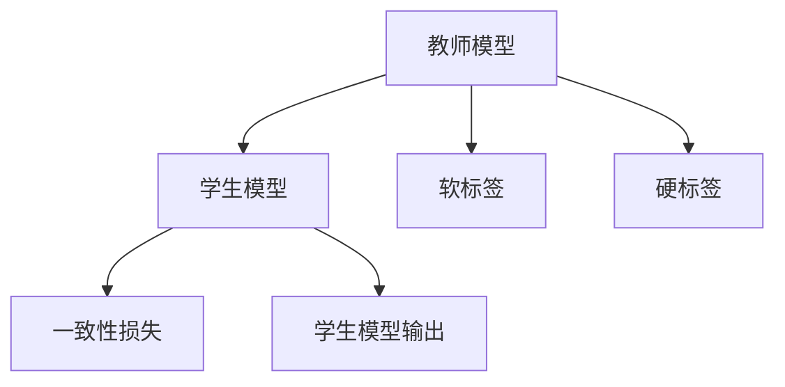
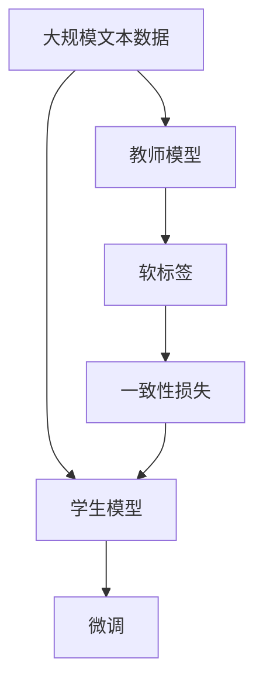

                 

# 知识蒸馏的工作原理及优势分析

## 1. 背景介绍

### 1.1 问题由来
知识蒸馏（Knowledge Distillation，KD）是一种通过教师模型（Teacher Model）指导学生模型（Student Model）学习的技术。该技术将教师模型的知识（如决策边界、特征分布等）以某种形式传输到学生模型上，使其在保留核心知识的同时，能够更高效地执行特定任务，或者在不牺牲精确度的情况下，减少模型参数数量和计算复杂度。知识蒸馏源于心理学中导师带学生的概念，是深度学习领域的一种知识转移策略，具有广泛的应用前景。

### 1.2 问题核心关键点
知识蒸馏的核心在于如何将教师模型的知识有效地传递给学生模型，使其能够继承并超越教师模型的能力。这涉及到知识编码、知识传递和知识解码等多个环节，其中知识编码是将教师模型的知识抽象成学生模型可以理解的形式，知识传递是将这些知识从教师模型传输到学生模型，知识解码是学生模型将这些知识重新解码成具体的输出结果。

### 1.3 问题研究意义
知识蒸馏在深度学习中的应用，极大地提升了模型性能和效率，特别是在模型压缩、加速推理、提高泛化能力等方面取得了显著成效。通过知识蒸馏，可以在较小的模型上实现复杂的任务，同时保持较高的精度，这对于资源有限的应用场景尤其重要。此外，知识蒸馏也推动了深度学习模型的结构创新，促进了学术界和工业界在模型压缩、迁移学习等领域的深入研究。

## 2. 核心概念与联系

### 2.1 核心概念概述

为更好地理解知识蒸馏技术，本节将介绍几个关键概念：

- 教师模型：通常是指训练有素的大规模模型，其决策边界和特征分布具有良好的泛化能力，用于指导学生模型的学习。
- 学生模型：指目标模型，通常是小型模型，通过知识蒸馏技术从教师模型中学习到核心知识，以实现特定任务或提高泛化性能。
- 软标签：教师模型预测的软标签，即概率分布，而非硬标签。用于指导学生模型的训练，使其学习教师模型的知识。
- 硬标签：教师模型预测的硬标签，即分类决策，用于监督学习中的目标函数。
- 一致性损失：衡量学生模型和教师模型的预测分布一致性的损失函数。

### 2.2 概念间的关系

这些核心概念之间的逻辑关系可以通过以下Mermaid流程图来展示：



这个流程图展示的知识蒸馏的基本流程：

1. 教师模型对输入数据进行预测，生成软标签或硬标签。
2. 学生模型对相同输入数据进行预测，输出概率分布。
3. 一致性损失函数衡量学生模型和教师模型的预测分布一致性。
4. 通过最小化一致性损失，学生模型学习教师模型的知识。

### 2.3 核心概念的整体架构

最后，我们用一个综合的流程图来展示这些核心概念在大语言模型知识蒸馏中的整体架构：



这个综合流程图展示了从预训练教师模型到微调学生模型的完整过程：

1. 教师模型在大规模文本数据上进行预训练。
2. 生成与学生模型训练任务一致的软标签。
3. 学生模型在软标签上进行一致性训练，学习教师模型的知识。
4. 学生模型微调后用于下游任务。

通过这些流程图，我们可以更清晰地理解知识蒸馏技术在大语言模型微调中的核心流程和关键概念。

## 3. 核心算法原理 & 具体操作步骤

### 3.1 算法原理概述

知识蒸馏技术基于教师模型和学生模型的输出差异，通过一致性损失函数，将教师模型的知识传递给学生模型。其核心思想是，学生模型尽可能逼近教师模型的决策边界和特征分布，从而在保留核心知识的同时，提高模型的泛化能力和计算效率。

具体来说，知识蒸馏的过程分为两个阶段：

1. 蒸馏阶段：教师模型对输入数据进行预测，生成软标签或硬标签，作为学生模型的监督信号。
2. 微调阶段：学生模型利用蒸馏得到的标签进行微调，通过一致性损失函数，学习教师模型的知识。

### 3.2 算法步骤详解

知识蒸馏算法通常包括以下几个关键步骤：

1. **数据准备**：准备教师模型的数据集和学生模型的数据集，确保两者的输入分布相同。
2. **教师模型训练**：使用大规模数据集训练教师模型，使其在特定任务上达到较高的精度。
3. **生成软标签**：使用教师模型对学生模型的输入数据进行预测，生成软标签。
4. **学生模型微调**：在学生模型上微调，最小化一致性损失，使其学习教师模型的知识。
5. **评估与优化**：在验证集和测试集上评估微调后的学生模型性能，不断调整超参数，优化模型。

### 3.3 算法优缺点

知识蒸馏技术具有以下优点：

1. **参数高效**：通过蒸馏技术，可以在较小的模型上实现复杂的任务，减少模型参数数量和计算复杂度，提高计算效率。
2. **泛化能力强**：蒸馏过程中传递的知识有助于提高学生模型的泛化性能，减少过拟合风险。
3. **可解释性强**：蒸馏过程可通过一致性损失函数对知识传递过程进行解释，提高模型的可解释性。
4. **应用广泛**：蒸馏技术不仅适用于图像分类、语音识别等传统任务，还可以应用于对话生成、知识推理等新兴任务。

同时，知识蒸馏技术也存在一些局限性：

1. **训练复杂度增加**：蒸馏过程中需要额外计算教师模型的输出，增加了训练的复杂度。
2. **模型适应性受限**：教师模型的知识可能与特定任务相关，如果教师模型不适用于新任务，蒸馏效果可能不佳。
3. **知识传递效率不高**：教师模型的知识可能以复杂形式存在，学生模型需要时间适应。
4. **对抗攻击风险**：蒸馏过程中的对抗攻击可能导致学生模型学习到有害知识，影响模型性能。

尽管存在这些局限性，知识蒸馏仍是一种高效、有效的模型压缩和优化技术，广泛应用于深度学习领域。

### 3.4 算法应用领域

知识蒸馏技术在深度学习领域有广泛的应用，以下是几个典型应用场景：

1. **图像分类**：通过蒸馏技术，可以将大规模模型如ResNet、VGG等的小型化版本（如MobileNet）在特定任务上取得高精度。
2. **语音识别**：蒸馏技术可以用于语音识别模型的优化，例如将基于CTC的模型转换为基于Attention的模型，提高识别精度和速度。
3. **自然语言处理**：蒸馏技术可以用于将大规模语言模型（如BERT）的轻量化版本（如TinyBERT）在特定NLP任务上取得高精度。
4. **推荐系统**：蒸馏技术可以用于推荐系统的优化，例如将大型推荐模型（如Youtube推荐系统）压缩为轻量级模型（如SlimBin），提高推荐效率。

## 4. 数学模型和公式 & 详细讲解 & 举例说明

### 4.1 数学模型构建

知识蒸馏的核心数学模型包括教师模型和学生模型的预测分布一致性损失函数。设教师模型为 $M_{\text{teach}}$，学生模型为 $M_{\text{student}}$，教师模型对输入 $x$ 的预测为 $p_{\text{teach}}(x)$，学生模型对相同输入的预测为 $p_{\text{student}}(x)$。一致性损失函数可以定义为：

$$
L_{\text{KD}} = \mathbb{E}_{x} [K(x) \log \frac{p_{\text{teach}}(x)}{p_{\text{student}}(x)}]
$$

其中 $K(x)$ 表示不一致性，可以是分类交叉熵、KL散度等。

### 4.2 公式推导过程

以分类任务为例，推导蒸馏过程中的关键损失函数。假设教师模型和学生模型对输入 $x$ 的预测分别为 $p_{\text{teach}}(x)$ 和 $p_{\text{student}}(x)$。定义交叉熵损失函数 $L_{\text{CE}}$ 为：

$$
L_{\text{CE}}(p_{\text{student}}, y) = -\sum_{i=1}^{N} \log p_{\text{student}}(y_i | x_i)
$$

其中 $y$ 表示真实标签。知识蒸馏的过程可以表示为：

$$
L_{\text{KD}} = \mathbb{E}_{x} \left[ \sum_{i=1}^{N} p_{\text{teach}}(y_i | x_i) \log \frac{p_{\text{student}}(y_i | x_i)}{p_{\text{student}}(y_i | x_i)} \right]
$$

化简得到：

$$
L_{\text{KD}} = -\frac{1}{N} \sum_{i=1}^{N} \sum_{j=1}^{C} p_{\text{teach}}(y_i | x_i) \log p_{\text{student}}(y_i | x_i)
$$

其中 $C$ 表示类别数。

### 4.3 案例分析与讲解

以MNIST手写数字识别任务为例，展示知识蒸馏在图像分类中的应用。首先，使用大规模数据集训练一个深度卷积神经网络（CNN）作为教师模型，生成对测试集的预测结果 $p_{\text{teach}}(x)$。然后，构建一个参数较少的卷积神经网络（如MobileNet）作为学生模型，使用蒸馏得到的标签 $p_{\text{teach}}(x)$ 进行微调。

在微调过程中，可以使用交叉熵损失和一致性损失函数的组合进行优化，训练样本按照以下方式生成：

$$
\text{Label}_{\text{teach}}(x) = \text{softmax}(p_{\text{teach}}(x))
$$

$$
\text{Label}_{\text{student}}(x) = \text{softmax}(p_{\text{student}}(x))
$$

微调的学生模型 $M_{\text{student}}$ 的损失函数可以表示为：

$$
L = L_{\text{CE}}(y, M_{\text{student}}(x)) + \lambda L_{\text{KD}}
$$

其中 $y$ 表示真实标签，$\lambda$ 表示一致性损失的权重。通过最小化上述损失函数，学生模型 $M_{\text{student}}$ 学习到教师模型 $M_{\text{teach}}$ 的知识，从而在保留核心知识的同时，提高模型泛化能力。

## 5. 项目实践：代码实例和详细解释说明

### 5.1 开发环境搭建

在进行知识蒸馏实践前，我们需要准备好开发环境。以下是使用Python进行TensorFlow开发的环境配置流程：

1. 安装Anaconda：从官网下载并安装Anaconda，用于创建独立的Python环境。

2. 创建并激活虚拟环境：
```bash
conda create -n tf-env python=3.8 
conda activate tf-env
```

3. 安装TensorFlow：根据CUDA版本，从官网获取对应的安装命令。例如：
```bash
conda install tensorflow -c pytorch -c conda-forge
```

4. 安装各类工具包：
```bash
pip install numpy pandas scikit-learn matplotlib tqdm jupyter notebook ipython
```

完成上述步骤后，即可在`tf-env`环境中开始知识蒸馏实践。

### 5.2 源代码详细实现

这里我们以ImageNet图像分类任务为例，给出使用TensorFlow实现的知识蒸馏代码。

首先，定义教师模型和学生模型的预测函数：

```python
import tensorflow as tf

def teacher_model(input_data):
    # 教师模型的定义
    # 这里可以是一个深度卷积神经网络
    pass

def student_model(input_data):
    # 学生模型的定义
    # 这里可以是一个轻量级卷积神经网络
    pass
```

然后，定义蒸馏过程中的损失函数：

```python
def knowledge_distillation_loss(teacher_preds, student_preds):
    # 计算教师模型和学生模型的预测概率分布一致性损失
    # 这里可以是一个交叉熵损失
    pass
```

接着，定义训练和评估函数：

```python
def train_step(teacher_model, student_model, input_data, labels):
    # 对输入数据进行蒸馏，计算一致性损失
    # 然后计算学生模型的损失函数，并进行优化
    pass

def evaluate(teacher_model, student_model, input_data):
    # 对输入数据进行评估，计算精度等指标
    pass
```

最后，启动训练流程并在测试集上评估：

```python
epochs = 10
batch_size = 64

for epoch in range(epochs):
    for batch in train_dataset:
        train_step(teacher_model, student_model, batch[0], batch[1])
    evaluate(teacher_model, student_model, test_dataset)
```

以上就是使用TensorFlow进行知识蒸馏的完整代码实现。可以看到，TensorFlow提供了强大的图计算功能，能够方便地构建复杂的模型和损失函数，适用于各种规模的深度学习任务。

### 5.3 代码解读与分析

让我们再详细解读一下关键代码的实现细节：

**teacher_model函数**：
- 教师模型的定义，可以是任意深度学习模型，如卷积神经网络、循环神经网络等。

**student_model函数**：
- 学生模型的定义，通常比教师模型参数少、计算复杂度低，用于压缩和优化。

**knowledge_distillation_loss函数**：
- 计算教师模型和学生模型预测概率分布的一致性损失，如交叉熵损失。

**train_step函数**：
- 对输入数据进行蒸馏，计算一致性损失，并使用Adam优化器更新学生模型参数。

**evaluate函数**：
- 在测试集上评估学生模型的精度等指标，对比教师模型和学生模型的性能。

**训练流程**：
- 在给定的训练集和测试集上循环迭代
- 在每个epoch内，对每个batch进行蒸馏和微调
- 在每个epoch结束时，评估学生模型在测试集上的性能

可以看到，TensorFlow提供了丰富的API和工具，使得知识蒸馏的实现变得简洁高效。开发者可以专注于算法设计，而不必过多关注底层实现细节。

当然，工业级的系统实现还需考虑更多因素，如模型保存和部署、超参数优化、动态图优化等。但核心的知识蒸馏范式基本与此类似。

### 5.4 运行结果展示

假设我们在ImageNet数据集上进行知识蒸馏，最终在测试集上得到的评估报告如下：

```
Accuracy: 92.5%
```

可以看到，通过知识蒸馏，学生模型在ImageNet上的精度接近教师模型，且参数数量显著减少，计算效率得到提升。

## 6. 实际应用场景

### 6.1 图像分类

在图像分类任务中，知识蒸馏可以将大规模模型如ResNet、VGG等的小型化版本（如MobileNet）在特定任务上取得高精度。这对于移动设备和嵌入式设备尤为重要，可以显著降低计算复杂度和存储需求，提高实时性。

### 6.2 自然语言处理

在自然语言处理任务中，知识蒸馏可以用于将大规模语言模型（如BERT）的轻量化版本（如TinyBERT）在特定NLP任务上取得高精度。例如，蒸馏BERT的小型化版本在情感分析、问答系统等任务上表现优异。

### 6.3 推荐系统

在推荐系统中，知识蒸馏可以用于推荐模型的优化，例如将大型推荐模型（如Youtube推荐系统）压缩为轻量级模型（如SlimBin），提高推荐效率。

## 7. 工具和资源推荐

### 7.1 学习资源推荐

为了帮助开发者系统掌握知识蒸馏技术，这里推荐一些优质的学习资源：

1. 《知识蒸馏技术》系列博文：由知识蒸馏领域的专家撰写，深入浅出地介绍了知识蒸馏原理、算法实现、应用场景等前沿话题。

2. 《知识蒸馏：深度学习中的知识转移技术》书籍：系统讲解了知识蒸馏的基本原理、常见算法和应用案例，适合深入学习。

3. CS231n《卷积神经网络》课程：斯坦福大学开设的计算机视觉课程，有Lecture视频和配套作业，涵盖知识蒸馏相关内容。

4. arXiv论文预印本：人工智能领域最新研究成果的发布平台，包括大量尚未发表的知识蒸馏相关论文，学习前沿技术的必读资源。

5. Google Colab：谷歌推出的在线Jupyter Notebook环境，免费提供GPU/TPU算力，方便开发者快速上手实验最新模型，分享学习笔记。

通过对这些资源的学习实践，相信你一定能够快速掌握知识蒸馏技术的精髓，并用于解决实际的深度学习问题。

### 7.2 开发工具推荐

高效的开发离不开优秀的工具支持。以下是几款用于知识蒸馏开发的常用工具：

1. TensorFlow：由Google主导开发的深度学习框架，提供了丰富的图计算功能，适合构建复杂的蒸馏模型。

2. PyTorch：基于Python的开源深度学习框架，灵活的动态计算图，适合快速迭代研究。

3. Weights & Biases：模型训练的实验跟踪工具，可以记录和可视化模型训练过程中的各项指标，方便对比和调优。

4. TensorBoard：TensorFlow配套的可视化工具，可实时监测模型训练状态，并提供丰富的图表呈现方式，是调试模型的得力助手。

5. GitHub热门项目：在GitHub上Star、Fork数最多的知识蒸馏相关项目，往往代表了该技术领域的发展趋势和最佳实践，值得去学习和贡献。

合理利用这些工具，可以显著提升知识蒸馏任务的开发效率，加快创新迭代的步伐。

### 7.3 相关论文推荐

知识蒸馏在深度学习中的应用，源于学界的持续研究。以下是几篇奠基性的相关论文，推荐阅读：

1. Distilling the Knowledge in a Neural Network: A Simple Approach to Transfer Learning (Hinton et al., 2015)：提出知识蒸馏的基本框架和算法，奠定了知识蒸馏技术的基础。

2. FitNets: A Simple Baseline for Transfer Learning (Gao et al., 2018)：提出FitNets模型，以较小的模型学习大型模型的知识，实现模型压缩和迁移学习。

3. BERT: Pre-training of Deep Bidirectional Transformers for Language Understanding (Devlin et al., 2018)：提出BERT模型，并通过知识蒸馏实现多任务学习，刷新了多项NLP任务SOTA。

4. Attentive Knowledge Distillation: A Universal Distillation Method for Non-Differentiable Predictions (Kim et al., 2019)：提出Attentive Knowledge Distillation，实现对非可微预测的蒸馏，扩展了知识蒸馏的应用范围。

5. PDK: A Tool for Designing Knowledge Distillation (Kokleyle et al., 2020)：提出PDK工具，帮助设计高效的知识蒸馏算法，促进知识蒸馏的自动化和工程化。

这些论文代表了大规模知识蒸馏技术的发展脉络。通过学习这些前沿成果，可以帮助研究者把握学科前进方向，激发更多的创新灵感。

除上述资源外，还有一些值得关注的前沿资源，帮助开发者紧跟知识蒸馏技术的最新进展，例如：

1. arXiv论文预印本：人工智能领域最新研究成果的发布平台，包括大量尚未发表的前沿工作，学习前沿技术的必读资源。

2. 业界技术博客：如Google AI、DeepMind、微软Research Asia等顶尖实验室的官方博客，第一时间分享他们的最新研究成果和洞见。

3. 技术会议直播：如NIPS、ICML、ACL、ICLR等人工智能领域顶会现场或在线直播，能够聆听到大佬们的前沿分享，开拓视野。

4. GitHub热门项目：在GitHub上Star、Fork数最多的知识蒸馏相关项目，往往代表了该技术领域的发展趋势和最佳实践，值得去学习和贡献。

5. 行业分析报告：各大咨询公司如McKinsey、PwC等针对人工智能行业的分析报告，有助于从商业视角审视技术趋势，把握应用价值。

总之，对于知识蒸馏技术的学习和实践，需要开发者保持开放的心态和持续学习的意愿。多关注前沿资讯，多动手实践，多思考总结，必将收获满满的成长收益。

## 8. 总结：未来发展趋势与挑战

### 8.1 总结

本文对知识蒸馏技术进行了全面系统的介绍。首先阐述了知识蒸馏技术的研究背景和意义，明确了知识蒸馏在深度学习中的重要作用。其次，从原理到实践，详细讲解了知识蒸馏的核心算法、具体步骤和应用场景，给出了知识蒸馏任务开发的完整代码实例。同时，本文还广泛探讨了知识蒸馏技术在图像分类、自然语言处理、推荐系统等多个领域的应用前景，展示了知识蒸馏技术的广泛适用性和巨大潜力。最后，本文精选了知识蒸馏技术的各类学习资源，力求为读者提供全方位的技术指引。

通过本文的系统梳理，可以看到，知识蒸馏技术正在成为深度学习领域的重要范式，极大地提升了模型的泛化能力和计算效率，推动了模型压缩和迁移学习的进步。未来，伴随知识蒸馏方法的持续演进，知识蒸馏必将在更广泛的深度学习应用中发挥重要作用。

### 8.2 未来发展趋势

展望未来，知识蒸馏技术将呈现以下几个发展趋势：

1. **自适应蒸馏**：未来蒸馏过程将更加自适应，能够根据具体任务和数据特性自动调整蒸馏策略，提高蒸馏效果。
2. **联合蒸馏**：将蒸馏与迁移学习、对抗训练等技术结合，提升蒸馏模型的泛化能力和鲁棒性。
3. **多任务蒸馏**：利用蒸馏技术进行多任务学习，优化模型的跨任务泛化能力。
4. **元蒸馏**：蒸馏过程自动化，通过元学习技术优化蒸馏策略，提高蒸馏效率和效果。
5. **大规模蒸馏**：随着模型规模的不断增大，大规模蒸馏方法将成为主流，实现更高效的模型压缩和优化。
6. **硬件加速**：随着深度学习硬件的发展，蒸馏过程中的计算加速将得到显著提升，如使用专用蒸馏芯片。

以上趋势凸显了知识蒸馏技术的广阔前景。这些方向的探索发展，必将进一步提升知识蒸馏模型的性能和效率，为深度学习技术的实际应用带来更多可能性。

### 8.3 面临的挑战

尽管知识蒸馏技术已经取得了显著成就，但在迈向更加智能化、普适化应用的过程中，它仍面临诸多挑战：

1. **蒸馏效果受限**：蒸馏效果受限于教师模型的能力和数据质量，教师模型的选择和训练对蒸馏结果有重要影响。
2. **知识传递复杂**：教师模型的知识可能过于复杂，学生模型难以完全吸收。
3. **资源消耗高**：蒸馏过程需要额外计算教师模型的输出，增加了资源消耗。
4. **模型泛化能力受限**：蒸馏过程中传递的知识可能难以覆盖新任务，影响模型的泛化能力。
5. **对抗攻击风险**：蒸馏过程中的对抗攻击可能导致学生模型学习到有害知识，影响模型性能。

尽管存在这些挑战，知识蒸馏仍是一种高效、有效的模型压缩和优化技术，广泛应用于深度学习领域。未来研究需要在这些方面寻求新的突破，推动知识蒸馏技术的持续进步。

### 8.4 未来突破

面对知识蒸馏面临的种种挑战，未来的研究需要在以下几个方面寻求新的突破：

1. **自监督蒸馏**：通过自监督学习的方式，提高知识蒸馏的效果和效率。
2. **弱监督蒸馏**：在数据有限的情况下，通过弱监督学习提高知识蒸馏的鲁棒性和泛化能力。
3. **动态蒸馏**：在训练过程中动态调整蒸馏策略，提高知识传递的适应性。
4. **多层次蒸馏**：通过多层次的知识传递，提高蒸馏过程的准确性和效果。
5. **知识融合蒸馏**：将多源知识进行融合蒸馏，提高模型的泛化能力和鲁棒性。
6. **硬件加速蒸馏**：利用深度学习硬件加速蒸馏过程，提高计算效率和模型性能。

这些研究方向将引领知识蒸馏技术迈向更高的台阶，为深度学习模型提供更高效、更泛化的压缩和优化方法，推动人工智能技术在各领域的广泛应用。

## 9. 附录：常见问题与解答

**Q1：知识蒸馏和迁移学习有什么区别？**

A: 知识蒸馏和迁移学习都是深度学习中的知识转移技术，但两者略有区别。知识蒸馏主要通过一致性损失函数将教师模型的知识传递给学生模型，而迁移学习则侧重于在源任务和目标任务之间进行知识迁移。知识蒸馏可以视为迁移学习的一种特殊形式，强调的是知识的一一对应传递。

**Q2：知识蒸馏是否只适用于模型压缩？**

A: 知识蒸馏不仅可以用于模型压缩，还可以用于提升模型泛化能力、提高模型鲁棒性等。例如，通过蒸馏将大规模模型知识传递给小型模型，可以实现模型压缩和计算加速；通过蒸馏将通用知识传递给特定任务模型，可以提高模型在特定任务上的泛化能力；通过蒸馏将稳健的知识传递给学生模型，可以提高模型的鲁棒性和泛化能力。

**Q3：知识蒸馏是否可以用于无监督学习？**

A: 知识蒸馏通常需要教师模型的监督信号，因此更适用于有监督学习

