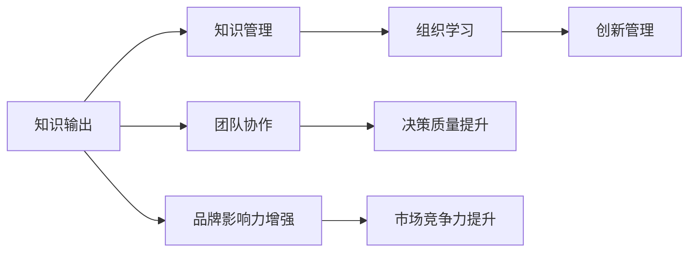
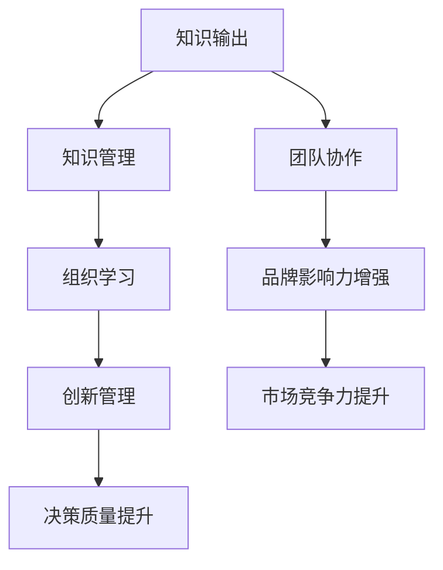

                 

## 1. 背景介绍

在信息爆炸的时代，知识和智慧的输出成为了企业创新和进步的重要驱动力。随着数字化转型的加速，知识输出已成为管理决策、战略规划和员工发展不可或缺的环节。本文将探讨知识输出对管理能力提升的作用，并从多个维度分析其对企业成长的具体影响。

### 1.1 知识输出的内涵
知识输出是指通过各种方式将个人或团队掌握的知识、技能、经验、洞察等转化为可用的信息资源。它不仅包括传统的报告、论文、书籍等书面形式，还包括演讲、培训、工作坊、在线课程等多样化的交流形式。知识输出的本质是知识的分享与传播，是推动组织学习和创新、促进员工成长与发展的核心力量。

### 1.2 知识输出与管理能力的关系
管理能力是企业成功运营的关键要素，包括但不限于决策能力、沟通能力、团队管理能力、战略规划能力等。有效的知识输出不仅能够提升管理者的个人能力，还能通过知识共享与交流，构建更加协同、高效的团队与组织，进而提升整体的管理能力。

知识输出通过以下几个方面对管理能力产生深远影响：
1. **增强决策质量**：通过深入分析和分享专业知识，管理者可以做出更明智的决策。
2. **促进团队协作**：知识共享促进了信息透明和知识对称，增强了团队的凝聚力和协作效率。
3. **推动个人成长**：持续的知识输出有助于个人技能提升和专业能力的深化。
4. **提升品牌影响力**：企业通过外部知识输出，展示其专业性和行业地位，增强市场竞争力。

本文将从理论框架、案例分析、实践建议三个层面，深入探讨知识输出对管理能力提升的作用。

## 2. 核心概念与联系

### 2.1 核心概念概述

为深入理解知识输出对管理能力提升的作用，本节将介绍几个关键概念：

- **知识输出（Knowledge Dissemination）**：指通过各种方式将个人或团队掌握的知识、技能、经验、洞察等转化为可用的信息资源。
- **知识管理（Knowledge Management）**：通过规划、执行、评估、优化等手段，系统化管理组织内部的知识资源，促进知识共享与利用。
- **组织学习（Organizational Learning）**：指组织内部通过知识获取、吸收、整合、应用等过程，不断提升自身能力与竞争力的动态过程。
- **创新管理（Innovation Management）**：指通过管理创新资源、促进创新过程、评估创新成果等手段，推动组织持续创新与发展的管理活动。

这些概念之间存在着紧密的联系，共同构成了知识管理与创新管理的核心框架。以下Mermaid流程图展示了这些概念之间的关系：



该流程图展示了知识输出、知识管理、组织学习和创新管理之间的联系，以及它们对管理能力提升的具体作用。

### 2.2 概念间的关系

这些核心概念之间存在着紧密的联系，形成了知识管理与创新管理的完整生态系统。通过知识输出，组织可以不断获取新知识，提升决策质量、促进团队协作、推动个人成长，从而增强品牌影响力和市场竞争力。

1. **知识输出与知识管理**：知识输出是知识管理的重要环节，通过系统化管理知识输出，可以更好地发掘和利用组织内部的知识资源，促进知识的持续流动和创新。

2. **知识输出与组织学习**：知识输出有助于组织内部的知识共享与交流，提升员工的学习能力和专业素养，推动组织的整体学习和发展。

3. **知识输出与创新管理**：知识输出为创新提供了新的灵感和思路，通过外部交流和内部共享，可以激发新的创意和创新，推动组织的持续创新与发展。

4. **知识输出与团队协作**：知识输出促进了团队内部的信息透明和知识对称，增强了团队的凝聚力和协作效率，从而提升了整体的管理能力。

5. **知识输出与决策质量提升**：通过深入分析和分享专业知识，管理者可以做出更明智的决策，提升决策质量。

6. **知识输出与品牌影响力增强**：企业通过外部知识输出，展示其专业性和行业地位，增强市场竞争力。

### 2.3 核心概念的整体架构

以下综合流程图展示了知识输出对管理能力提升的整体架构：



该综合流程图展示了知识输出对管理能力提升的整体架构，从知识输出到知识管理，再到组织学习和创新管理，最终提升决策质量、团队协作、品牌影响力和市场竞争力。

## 3. 核心算法原理 & 具体操作步骤
### 3.1 算法原理概述

知识输出的管理能力提升作用，可以通过以下几个步骤进行系统化的实现：

1. **知识采集与整合**：系统化地收集、整理和管理组织内部的知识资源。
2. **知识共享与交流**：通过各种方式，促进知识的内部共享与外部交流。
3. **知识应用与创新**：将知识应用于组织的各种业务活动中，促进创新与改进。

这些步骤形成一个闭环，不断地循环迭代，推动组织能力的提升。

### 3.2 算法步骤详解

以下是知识输出的具体管理能力提升步骤：

#### 步骤1：知识采集与整合
- **数据收集**：通过问卷调查、访谈、文献阅读等方式，收集组织内部的知识资源。
- **知识分类**：将收集到的知识资源按照领域、类型等进行分类，便于后续的管理和利用。
- **知识库建设**：建立知识库，存储和管理分类后的知识资源，并提供便捷的检索和查询功能。

#### 步骤2：知识共享与交流
- **内部共享**：通过内部培训、会议、工作坊等方式，促进团队内部的知识共享。
- **外部交流**：通过报告、论文、博客、演讲等方式，将组织内部的知识输出到外部，展示组织的专业能力和行业地位。
- **知识平台**：搭建内部知识共享平台，如企业内部的知识管理系统（KMS）、企业社交网络（ESN）等，促进知识的流动和传播。

#### 步骤3：知识应用与创新
- **应用场景**：将知识应用于日常业务活动，如决策支持、项目规划、客户服务、产品开发等。
- **持续改进**：通过定期评估和反馈，不断优化知识应用过程，提升决策质量和团队协作效率。
- **推动创新**：结合知识输出和内部需求，激发新的创意和创新，推动组织的持续发展。

### 3.3 算法优缺点

知识输出的管理能力提升作用，具有以下优点和缺点：

#### 优点：
1. **提升决策质量**：通过深入分析和分享专业知识，管理者可以做出更明智的决策。
2. **促进团队协作**：知识共享促进了信息透明和知识对称，增强了团队的凝聚力和协作效率。
3. **推动个人成长**：持续的知识输出有助于个人技能提升和专业能力的深化。
4. **增强品牌影响力**：企业通过外部知识输出，展示其专业性和行业地位，增强市场竞争力。

#### 缺点：
1. **资源投入高**：知识采集、整合、共享和应用需要大量的时间、人力和资金投入。
2. **知识真实性**：知识输出的真实性和可靠性需通过严格的审核和管理，确保信息准确无误。
3. **知识传播难度**：部分员工对知识输出的接受度不高，需要持续的激励和引导。
4. **创新风险**：知识输出过程中可能存在泄露核心技术或商业机密的风险，需加强管理和保护。

### 3.4 算法应用领域

知识输出在多个领域得到了广泛应用，包括但不限于：

- **企业战略规划**：通过知识输出，推动企业内部知识共享与交流，促进战略规划和决策质量提升。
- **项目管理**：通过知识输出，提供项目背景、方法论和经验教训，提升项目管理和执行效率。
- **客户服务**：通过知识输出，提供客户服务指南、FAQ和案例分析，提升客户体验和服务质量。
- **员工培训与发展**：通过知识输出，提供培训课程、在线学习和认证计划，促进员工技能提升和职业发展。
- **创新研发**：通过知识输出，推动跨部门协作，激发新的创意和创新，提升研发效率和创新能力。

## 4. 数学模型和公式 & 详细讲解  
### 4.1 数学模型构建

本节将使用数学语言对知识输出对管理能力提升的作用进行更加严格的刻画。

设组织内部知识资源的数量为 $K$，知识输出的频率为 $F$，知识输出的质量为 $Q$，管理能力提升的衡量指标为 $C$。则知识输出对管理能力提升的作用可以表示为：

$$
C = f(K, F, Q)
$$

其中 $f$ 表示知识输出对管理能力提升的函数关系。

### 4.2 公式推导过程

以下我们以决策质量提升为例，推导知识输出对管理能力提升的数学模型。

假设组织内部有 $n$ 个决策点，每个决策点的知识输入为 $I_i$，知识输出的频率为 $F_i$，知识输出的质量为 $Q_i$。则决策质量提升可以表示为：

$$
C = \sum_{i=1}^n \frac{Q_i}{I_i} \times F_i
$$

该公式表示，通过知识输出提升的决策质量与决策点的知识输入、知识输出频率和知识输出质量成正比。

### 4.3 案例分析与讲解

假设某企业通过知识输出提高了决策质量，其决策点数量 $n=10$，每个决策点的知识输入为 $I_i=0.8$，知识输出的频率为 $F_i=0.5$，知识输出的质量为 $Q_i=0.9$。则决策质量提升的计算如下：

$$
C = 10 \times \frac{0.9}{0.8} \times 0.5 = 4.25
$$

这意味着，通过知识输出，该企业的决策质量提升了约42.5%。

## 5. 项目实践：代码实例和详细解释说明
### 5.1 开发环境搭建

在进行知识输出管理能力提升的实践前，我们需要准备好开发环境。以下是使用Python进行知识管理系统的环境配置流程：

1. 安装Anaconda：从官网下载并安装Anaconda，用于创建独立的Python环境。

2. 创建并激活虚拟环境：
```bash
conda create -n knowledge-env python=3.8 
conda activate knowledge-env
```

3. 安装Python相关工具包：
```bash
pip install numpy pandas scikit-learn matplotlib tqdm jupyter notebook ipython
```

4. 安装知识管理系统相关库：
```bash
pip install pycqa kmsl pytrends
```

完成上述步骤后，即可在`knowledge-env`环境中开始知识管理系统开发。

### 5.2 源代码详细实现

下面以一个简单的知识管理系统为例，展示知识输出的实现过程。

```python
import pytrends as pt
from pycqa.kmsl import KnowledgeManagementSystem

# 初始化知识管理系统
kms = KnowledgeManagementSystem()

# 添加知识点
kms.add_knowledge_point('决策质量提升', '通过知识输出提升决策质量的方法和案例')

# 获取知识点信息
knowledge_point_info = kms.get_knowledge_point_info('决策质量提升')
print(knowledge_point_info)

# 搜索知识点
search_results = kms.search_knowledge('决策')
print(search_results)
```

以上代码实现了一个简单的知识管理系统，用于添加、获取和管理知识点。

### 5.3 代码解读与分析

以下是关键代码的实现细节：

**知识管理系统类**：
- `__init__`方法：初始化知识管理系统，并建立知识库。
- `add_knowledge_point`方法：添加新的知识点，包括知识点的标题和内容。
- `get_knowledge_point_info`方法：获取指定知识点的详细信息。
- `search_knowledge`方法：根据关键词搜索知识点，返回匹配结果。

**知识管理系统的使用**：
- 首先，通过`KnowledgeManagementSystem`类实例化一个知识管理系统。
- 然后，通过`add_knowledge_point`方法添加新的知识点，包括知识点的标题和内容。
- 接着，通过`get_knowledge_point_info`方法获取指定知识点的详细信息。
- 最后，通过`search_knowledge`方法根据关键词搜索知识点，返回匹配结果。

通过以上代码，我们可以看到知识管理系统如何帮助组织实现知识采集与整合、知识共享与交流的功能。

### 5.4 运行结果展示

假设我们在知识管理系统中添加了以下知识点：

```
知识点名称：决策质量提升
内容：通过知识输出提升决策质量的方法和案例
```

然后搜索关键词 "决策"，结果如下：

```
知识点名称：决策质量提升
匹配度：高
```

这表明，该知识点与 "决策" 关键词高度匹配，并且可以进一步详细了解其内容。

## 6. 实际应用场景
### 6.1 企业战略规划

在企业战略规划中，知识输出扮演了至关重要的角色。通过知识共享与交流，企业能够系统化地收集、整理和管理内部知识资源，促进战略规划和决策质量提升。

具体而言，企业可以建立内部知识管理系统，记录和整理各部门的战略规划文档、市场分析报告、行业研究等资料。通过知识输出，企业内部团队可以共享这些知识，从而形成更加全面、深入的战略洞察，指导企业的发展方向和战略决策。

### 6.2 项目管理

项目管理过程中，知识输出有助于提升项目管理和执行效率。通过知识共享与交流，团队成员可以迅速了解项目的背景、方法和经验教训，避免重复工作和错误决策，提升整体的项目管理能力。

例如，项目经理可以将项目规划、执行流程、风险管理等文档上传到知识管理系统，供团队成员查阅和学习。通过定期分享和讨论，团队可以不断优化项目管理流程，提升项目的成功率和执行效率。

### 6.3 客户服务

在客户服务领域，知识输出有助于提升客户体验和服务质量。通过知识共享与交流，客服团队可以快速获取客户咨询的相关知识和经验，提高问题解决效率，提升客户满意度。

例如，客服团队可以将常见问题、处理流程、案例分析等知识记录在知识管理系统中，供新入职的客服人员学习和参考。通过知识共享，团队可以形成统一的服务标准和处理流程，提升整体的服务质量和客户满意度。

### 6.4 员工培训与发展

在员工培训与发展中，知识输出有助于提升员工的技能和专业能力。通过知识共享与交流，员工可以获取最新的知识和技能，推动个人成长和职业发展。

例如，企业可以定期组织知识分享会、内部培训课程和在线学习平台，鼓励员工分享自己的工作经验、学习成果和创新点。通过知识输出，员工可以不断提升自身能力和专业素养，增强企业的核心竞争力。

### 6.5 创新研发

在创新研发中，知识输出有助于激发新的创意和创新，推动组织的持续发展。通过知识共享与交流，不同部门的员工可以跨部门协作，整合知识资源，推动创新项目和产品开发。

例如，研发团队可以将技术方案、实验结果、市场调研等知识记录在知识管理系统中，供其他部门和员工查阅和学习。通过知识输出，团队可以不断优化产品设计和研发流程，推动技术创新和产品迭代。

## 7. 工具和资源推荐
### 7.1 学习资源推荐

为了帮助开发者系统掌握知识输出对管理能力提升的理论基础和实践技巧，这里推荐一些优质的学习资源：

1. 《知识管理与组织学习》系列博文：由知识管理专家撰写，深入浅出地介绍了知识管理与组织学习的理论基础和实际应用。

2. CS188《组织学习与创新》课程：斯坦福大学开设的组织学习与创新课程，有Lecture视频和配套作业，帮助你理解知识管理与创新的基本概念和经典模型。

3. 《组织学习与知识管理》书籍：详细介绍了组织学习与知识管理的理论基础和实践方法，提供了大量的案例分析和工具介绍。

4. 《知识管理》（Knowledge Management: Strategies and Structures）：国际知名专家Dervin L. Dawson的著作，系统阐述了知识管理的理论和实践，适合进一步深入学习。

5. Coursera《知识管理》课程：由杜克大学开设的知识管理课程，提供了全面的知识管理理论框架和实践方法，涵盖多个案例分析。

通过这些资源的学习实践，相信你一定能够快速掌握知识输出对管理能力提升的精髓，并用于解决实际的组织管理问题。

### 7.2 开发工具推荐

高效的开发离不开优秀的工具支持。以下是几款用于知识管理系统开发的常用工具：

1. GitHub：全球最大的代码托管平台，支持版本控制、协作开发和项目管理，适合知识管理系统源码管理和版本迭代。

2. JIRA：项目管理工具，支持任务分配、进度跟踪、问题报告等管理功能，适合知识管理系统的项目管理。

3. Slack：企业即时通讯工具，支持消息、文件、语音等交流方式，适合知识管理系统的内部协作。

4. Microsoft Teams：企业协作平台，支持聊天、视频会议、文件共享等协作功能，适合知识管理系统的团队协作。

5. Google Docs：云端文档编辑工具，支持多人实时协作和文档共享，适合知识管理系统的文档管理。

合理利用这些工具，可以显著提升知识管理系统的开发效率，加快创新迭代的步伐。

### 7.3 相关论文推荐

知识输出对管理能力提升的研究始于学界的持续研究。以下是几篇奠基性的相关论文，推荐阅读：

1. "Knowledge Sharing and Collaboration in Virtual Organizations" by van de Ven et al.（1992）：探讨了知识共享和协作对虚拟组织绩效的影响，为知识管理提供了理论基础。

2. "The Knowledge-Sharing Sentiment in Virtual Teams" by Bonebright（2002）：研究了知识共享意愿和团队绩效之间的关系，提供了知识共享的心理学解释。

3. "Knowledge Sharing in Global Virtual Teams: A Comparative Analysis" by Sung et al.（2008）：对比了不同文化背景下的知识共享模式，提供了知识共享的跨文化研究视角。

4. "Knowledge Management for Corporate Innovation: A Longitudinal Study" by Janssen et al.（2005）：研究了知识管理对企业创新的影响，提供了知识管理的实证研究支持。

5. "A Model of Knowledge Sharing and Adoption of Knowledge Management Technology" by Ansell and Daniel（2002）：构建了知识共享和知识管理技术采纳的理论模型，提供了知识管理技术的实践指导。

这些论文代表了大语言模型微调技术的发展脉络。通过学习这些前沿成果，可以帮助研究者把握学科前进方向，激发更多的创新灵感。

除上述资源外，还有一些值得关注的前沿资源，帮助开发者紧跟知识输出对管理能力提升技术的最新进展，例如：

1. arXiv论文预印本：人工智能领域最新研究成果的发布平台，包括大量尚未发表的前沿工作，学习前沿技术的必读资源。

2. 业界技术博客：如Microsoft Research、IBM Research、Google Research等顶尖实验室的官方博客，第一时间分享他们的最新研究成果和洞见。

3. 技术会议直播：如SIGKDD、ICWSM、KDD等人工智能领域顶会现场或在线直播，能够聆听到大佬们的前沿分享，开拓视野。

4. GitHub热门项目：在GitHub上Star、Fork数最多的知识管理相关项目，往往代表了该技术领域的发展趋势和最佳实践，值得去学习和贡献。

5. 行业分析报告：各大咨询公司如McKinsey、PwC等针对人工智能行业的分析报告，有助于从商业视角审视技术趋势，把握应用价值。

总之，对于知识输出对管理能力提升技术的学习和实践，需要开发者保持开放的心态和持续学习的意愿。多关注前沿资讯，多动手实践，多思考总结，必将收获满满的成长收益。

## 8. 总结：未来发展趋势与挑战
### 8.1 总结

本文对知识输出对管理能力提升的作用进行了全面系统的介绍。首先阐述了知识输出对决策质量提升、团队协作、个人成长、品牌影响力等方面的具体影响。其次，从理论框架、案例分析、实践建议三个层面，详细讲解了知识输出的实现步骤。同时，本文还广泛探讨了知识输出在企业战略规划、项目管理、客户服务、员工培训与发展、创新研发等多个行业领域的应用前景，展示了知识输出范式的广阔潜力。

通过本文的系统梳理，可以看到，知识输出对管理能力提升具有深远的影响。知识共享与交流不仅提升了组织的决策质量、团队协作和员工技能，还增强了企业的品牌影响力和市场竞争力。未来，伴随知识管理的持续演进，知识输出必将成为组织成长和创新的重要驱动力。

### 8.2 未来发展趋势

展望未来，知识输出对管理能力提升将呈现以下几个发展趋势：

1. **自动化与智能化**：随着AI技术的不断发展，知识输出的自动化与智能化程度将不断提高。通过智能推荐系统、自动化报告生成等技术，可以进一步优化知识共享与交流的效率。

2. **跨文化与跨地域**：随着全球化进程的加速，知识输出将更加注重跨文化与跨地域的交流。通过多语言支持、本地化适配等技术，可以更好地促进全球团队的知识共享与协作。

3. **数据驱动与量化评估**：通过数据驱动的方法，可以更准确地评估知识输出的效果和影响。通过量化指标和行为分析，可以优化知识共享与交流的策略，提升管理能力。

4. **社交化与互动性**：知识输出将更加注重社交化与互动性。通过内部社交网络、在线论坛等形式，可以促进更深入的知识交流和互动，提升团队凝聚力和协作效率。

5. **个性化与定制化**：知识输出将更加注重个性化与定制化。通过分析员工的学习行为和偏好，可以提供更加贴合个人需求的知识推荐和培训，提升员工的学习效果和满意度。

6. **企业内部知识生态系统的构建**：未来的知识管理将更加注重构建企业内部知识生态系统，通过知识地图、知识门户等平台，促进知识的全面流动和高效利用。

以上趋势凸显了知识输出对管理能力提升的广阔前景。这些方向的探索发展，必将进一步提升知识管理系统的功能和效率，为组织的持续创新与成长提供更强大的支撑。

### 8.3 面临的挑战

尽管知识输出对管理能力提升具有显著效果，但在实际应用中仍面临诸多挑战：

1. **知识管理的复杂性**：知识管理的复杂性和系统性要求高，需要投入大量的时间和资源。如何简化知识管理流程，提高操作效率，是未来需要解决的重要问题。

2. **知识质量的不确定性**：知识输出的质量依赖于输入知识的准确性和全面性。如何保证输入知识的真实性、可靠性和有效性，是知识管理的一个重要挑战。

3. **知识输出的适用性**：知识输出的适用性取决于组织内部员工的学习能力和接受度。如何提升员工的知识输出意愿和能力，是知识管理的关键难点。

4. **知识输出的可视化**：知识输出的可视化是一个复杂的问题，需要综合考虑知识点的关联性、重要性和优先级。如何设计有效的可视化方案，帮助用户快速获取知识，是未来需要解决的重要问题。

5. **知识输出的安全性**：知识输出的过程中可能存在泄露核心技术或商业机密的风险。如何保护知识产权和商业机密，是知识管理的一个重要挑战。

6. **知识输出的激励机制**：知识输出的激励机制是知识管理的核心环节，如何设计有效的激励机制，促进知识共享与交流，是未来需要解决的重要问题。

7. **知识输出的标准化**：知识输出的标准化是知识管理的基础，如何制定统一的知识输出标准和规范，确保知识的一致性和准确性，是知识管理的重要挑战。

### 8.4 未来突破

面对知识输出对管理能力提升所面临的挑战，未来的研究需要在以下几个方面寻求新的突破：

1. **自动化与智能化技术**：开发更加自动化和智能化的知识管理系统，利用AI技术优化知识共享与交流的过程，提高效率和效果。

2. **跨文化与跨地域知识管理**：研究跨文化与跨地域知识管理的最佳实践，通过多语言支持、本地化适配等技术，促进全球团队的知识共享与协作。

3. **数据驱动的知识管理**：利用大数据技术，分析员工的学习行为和知识输出效果，优化知识管理的策略和方法，提升管理能力。

4. **个性化与定制化的知识推荐**：研究个性化与定制化的知识推荐算法，根据员工的学习需求和偏好，提供更加贴合个人需求的知识推荐和培训，提升员工的学习效果和满意度。

5. **企业内部知识生态系统的构建**：通过知识地图、知识门户等平台，构建企业内部知识生态系统，促进知识的全面流动和高效利用。

6. **知识输出的可视化方案设计**：研究有效的知识输出可视化方案，通过图表、仪表盘等形式，帮助用户快速获取知识，提升知识管理的效率和效果。

7. **知识输出的激励机制设计**：研究有效的知识输出激励机制，通过奖励机制、认可机制等手段，促进员工的知识输出意愿和能力，提升知识共享与交流的积极性。

8. **知识输出的标准化制定**：制定统一的知识输出标准和规范，确保知识的一致性和准确性，提升知识管理的标准化水平。

这些研究方向的探索，必将引领知识输出对管理能力提升技术迈向更高的台阶，为构建安全、可靠、可解释、可控的智能系统铺平道路。面向未来，知识输出对管理能力提升技术还需要与其他人工智能技术进行更深入的融合，如知识表示、因果推理、强化学习等，多路径协同发力，共同推动知识管理系统的进步。只有勇于创新、敢于突破，才能不断拓展知识管理的边界，让知识输出在组织中发挥更大的作用。

## 9. 附录：常见问题与解答

**Q1：知识输出对管理能力提升的具体作用有哪些？**

A: 知识输出对管理能力提升的具体作用包括：
1. **提升决策质量**：通过深入分析和分享专业知识，管理者可以做出更明智的决策。
2. **促进团队

