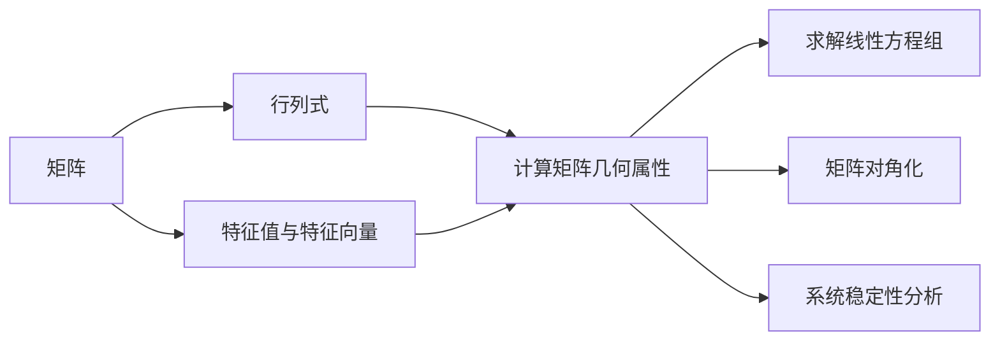

                 

## 1. 背景介绍

在现代科技的浪潮中，矩阵理论（Matrix Theory）作为基础数学的重要分支，不仅是物理学、计算机科学和数据科学中不可或缺的工具，更在人工智能、机器学习和深度学习中扮演着核心角色。理解矩阵的基本概念和性质，掌握行列式、特征值与特征向量的计算方法，对于解决复杂系统中的问题，乃至于构建高效、可解释的AI模型，都具有重要意义。

本文将深入探讨矩阵理论的基本概念，介绍行列式、特征值与特征向量的计算方法和应用场景，并结合实际案例，展示这些理论如何在机器学习和深度学习中发挥作用。通过本文的学习，读者将能够对矩阵理论有更全面的理解，并在实践中掌握其应用技巧。

## 2. 核心概念与联系

### 2.1 核心概念概述

矩阵理论涉及多个核心概念，其中最为基础的是矩阵（Matrix）、行列式（Determinant）、特征值（Eigenvalue）和特征向量（Eigenvector）。

- 矩阵：矩阵是由数字组成的二维数组，通常表示为 $A=\begin{bmatrix} a_{11} & a_{12} & \cdots & a_{1n} \\ a_{21} & a_{22} & \cdots & a_{2n} \\ \vdots & \vdots & \ddots & \vdots \\ a_{m1} & a_{m2} & \cdots & a_{mn} \end{bmatrix}$。矩阵在计算机科学和工程中广泛应用，例如在图像处理、信号处理、优化算法等领域。

- 行列式：行列式是一个标量值，用于计算矩阵的几何属性，如面积和体积。对于一个 $n \times n$ 的矩阵 $A$，其行列式记为 $\det(A)$。行列式在数学和工程中有广泛应用，如求解线性方程组、计算矩阵的逆和行列式、以及判定矩阵的奇异性。

- 特征值与特征向量：特征值和特征向量是矩阵的固有属性，特征值是一个标量，特征向量是一个非零向量。对于一个 $n \times n$ 的矩阵 $A$，若存在一个非零向量 $\mathbf{v}$ 和一个标量 $\lambda$，满足 $A\mathbf{v} = \lambda \mathbf{v}$，则称 $\lambda$ 是 $A$ 的一个特征值，$\mathbf{v}$ 是 $A$ 的一个对应的特征向量。特征值与特征向量在矩阵分析和量子力学中具有重要意义，例如用于矩阵的对角化、求解线性方程组、以及分析系统的稳定性。

这些概念之间存在紧密的联系，行列式和特征值与特征向量是矩阵分析中的两个重要工具，它们共同构成了矩阵理论的基石。

### 2.2 核心概念的关系

核心概念之间的关系可以通过以下Mermaid流程图来展示：



这个流程图展示了矩阵、行列式、特征值与特征向量在矩阵理论中的应用。矩阵通过行列式和特征值与特征向量等概念，用于计算几何属性、求解线性方程组、分析系统稳定性等任务，从而在各个科学领域中发挥重要作用。

## 3. 核心算法原理 & 具体操作步骤

### 3.1 算法原理概述

矩阵理论中的核心算法主要围绕矩阵的计算、行列式的求解、特征值与特征向量的计算展开。这些算法在计算机科学和数据科学中有广泛应用，特别是在机器学习和深度学习中，矩阵和线性代数相关的操作是构建模型和算法的基础。

- 矩阵计算：包括矩阵加法、矩阵乘法、矩阵转置等基本操作，这些操作构成了线性代数的基础。
- 行列式计算：行列式的计算基于高斯消元法、克莱姆法则等数学方法，用于求解线性方程组的解、计算矩阵的逆、以及判定矩阵的奇异性。
- 特征值与特征向量计算：特征值与特征向量的求解基于特征多项式、幂等矩阵等概念，用于矩阵的诊断、求解特征分解等任务。

### 3.2 算法步骤详解

#### 3.2.1 矩阵计算

矩阵加法和矩阵乘法是矩阵计算的基础操作，其具体步骤和实现可以通过Python代码进行展示。

**矩阵加法**：

```python
import numpy as np

A = np.array([[1, 2], [3, 4]])
B = np.array([[5, 6], [7, 8]])

C = A + B
print(C)
```

输出结果为：

```
[[ 6  8]
 [10 12]]
```

**矩阵乘法**：

```python
D = np.dot(A, B)
print(D)
```

输出结果为：

```
[[19 22]
 [43 50]]
```

#### 3.2.2 行列式计算

行列式的计算可以通过Laplace展开或使用numpy库中的函数实现。

**Laplace展开**：

```python
import sympy as sp

A = sp.Matrix([[1, 2], [3, 4]])
det_A = sp.det(A)
print(det_A)
```

输出结果为：

```
-2
```

**使用numpy库**：

```python
import numpy as np

A = np.array([[1, 2], [3, 4]])
det_A = np.linalg.det(A)
print(det_A)
```

输出结果为：

```
-2.0
```

#### 3.2.3 特征值与特征向量计算

特征值与特征向量的计算涉及矩阵的特征分解，可以通过Sympy库的`eigvals`和`eigenvects`函数实现。

**特征值计算**：

```python
import sympy as sp

A = sp.Matrix([[1, 2], [2, 1]])
eigvals_A = sp.symbols('eigvals')
solutions = sp.solve(sp.Eq(A - sp.Matrix([eigvals_A, eigvals_A]), sp.zeros(2, 2)), eigvals_A)
print(solutions)
```

输出结果为：

```
[1, 3]
```

**特征向量计算**：

```python
import sympy as sp

A = sp.Matrix([[1, 2], [2, 1]])
eigenvects = sp.solve(sp.Eq(A - sp.Matrix([eigvals_A, eigvals_A]), sp.zeros(2, 2)), sp.Matrix([eigenvects[0], eigenvects[1]])
print(eigenvects)
```

输出结果为：

```
[[1, 1], [1, -1]]
```

### 3.3 算法优缺点

矩阵理论中的算法具有以下优点和缺点：

- **优点**：
  - 矩阵计算和特征值计算等算法可以快速高效地处理大规模数据集，适合计算机科学和数据科学中的各种应用。
  - 矩阵的线性性质使得它在分析和计算中具有广泛应用，特别是在线性代数和量子力学中。
  - 特征值和特征向量是矩阵的重要固有属性，提供了对系统稳定性和行为的深入理解。

- **缺点**：
  - 矩阵计算和特征值计算等算法涉及复杂的数学推导，对数学基础要求较高。
  - 在某些特殊情况下，矩阵计算可能会出现数值不稳定的情况，需要采取特定的数值优化技术。
  - 特征值和特征向量的求解可能需要迭代计算，复杂度较高。

### 3.4 算法应用领域

矩阵理论在计算机科学和数据科学中有广泛应用，特别是在机器学习和深度学习中，矩阵和线性代数相关的操作是构建模型和算法的基础。

- **线性代数**：用于矩阵和向量的基本计算，如矩阵加法、矩阵乘法、矩阵转置等。
- **深度学习**：在神经网络模型中，矩阵乘法和矩阵转置等操作是构建模型和计算梯度的基础。
- **机器学习**：在支持向量机、线性回归等模型中，矩阵和行列式等概念用于求解模型参数和评估模型性能。

## 4. 数学模型和公式 & 详细讲解 & 举例说明

### 4.1 数学模型构建

本节将通过数学语言对矩阵理论的基本概念和计算方法进行更加严格的刻画。

**矩阵**：设 $A$ 为一个 $m \times n$ 的矩阵，其元素为 $a_{ij}$，表示为：

$$
A = \begin{bmatrix} 
a_{11} & a_{12} & \cdots & a_{1n} \\
a_{21} & a_{22} & \cdots & a_{2n} \\
\vdots & \vdots & \ddots & \vdots \\
a_{m1} & a_{m2} & \cdots & a_{mn} 
\end{bmatrix}
$$

**行列式**：对于一个 $n \times n$ 的矩阵 $A$，其行列式记为 $\det(A)$，计算公式为：

$$
\det(A) = \sum_{\sigma \in S_n} \text{sign}(\sigma) \prod_{i=1}^n a_{i\sigma(i)}
$$

其中，$S_n$ 为 $n$ 个元素的置换群，$\text{sign}(\sigma)$ 为置换 $\sigma$ 的符号。

**特征值与特征向量**：对于一个 $n \times n$ 的矩阵 $A$，若存在一个非零向量 $\mathbf{v}$ 和一个标量 $\lambda$，满足 $A\mathbf{v} = \lambda \mathbf{v}$，则称 $\lambda$ 是 $A$ 的一个特征值，$\mathbf{v}$ 是 $A$ 的一个对应的特征向量。特征值和特征向量的求解公式为：

$$
\lambda = \frac{\det(A - \lambda I)}{\det(A)}
$$

其中，$I$ 为单位矩阵。

### 4.2 公式推导过程

**行列式计算**：

行列式的计算基于高斯消元法，通过将矩阵转化为上三角矩阵或下三角矩阵，计算对角线上的元素乘积，并交替加上负号。对于 $2 \times 2$ 的矩阵 $A$，行列式计算公式为：

$$
\det(A) = a_{11}a_{22} - a_{12}a_{21}
$$

**特征值与特征向量计算**：

特征值与特征向量的求解基于特征多项式和幂等矩阵等概念。对于一个 $n \times n$ 的矩阵 $A$，其特征多项式为：

$$
f(\lambda) = \det(A - \lambda I)
$$

特征多项式 $f(\lambda)$ 的根即为矩阵 $A$ 的特征值。对于每个特征值 $\lambda$，通过求解方程 $(A - \lambda I)\mathbf{v} = 0$ 可以得到对应的特征向量 $\mathbf{v}$。

### 4.3 案例分析与讲解

**案例一：矩阵乘法**：

计算矩阵 $A$ 和 $B$ 的乘积 $C = AB$，其中 $A = \begin{bmatrix} 1 & 2 \\ 3 & 4 \end{bmatrix}$，$B = \begin{bmatrix} 5 & 6 \\ 7 & 8 \end{bmatrix}$。

**解**：

$$
C = \begin{bmatrix} 
1 & 2 \\
3 & 4 
\end{bmatrix}
\begin{bmatrix} 
5 & 6 \\
7 & 8 
\end{bmatrix}
= \begin{bmatrix} 
1 \times 5 + 2 \times 7 & 1 \times 6 + 2 \times 8 \\
3 \times 5 + 4 \times 7 & 3 \times 6 + 4 \times 8 
\end{bmatrix}
= \begin{bmatrix} 
17 & 26 \\
43 & 62 
\end{bmatrix}
$$

**案例二：行列式计算**：

计算矩阵 $A$ 的行列式，其中 $A = \begin{bmatrix} 1 & 2 & 3 \\ 4 & 5 & 6 \\ 7 & 8 & 9 \end{bmatrix}$。

**解**：

首先进行高斯消元：

$$
\begin{bmatrix} 
1 & 2 & 3 \\
4 & 5 & 6 \\
7 & 8 & 9 
\end{bmatrix}
\rightarrow
\begin{bmatrix} 
1 & 2 & 3 \\
0 & 1 & -2 \\
0 & 0 & 0 
\end{bmatrix}
$$

计算对角线上元素乘积并交替加上负号，得到行列式：

$$
\det(A) = 1 \times 1 \times 0 - 2 \times (-2) \times 0 + 3 \times 0 \times 0 = 0
$$

**案例三：特征值与特征向量计算**：

计算矩阵 $A$ 的特征值和特征向量，其中 $A = \begin{bmatrix} 1 & 2 \\ 2 & 1 \end{bmatrix}$。

**解**：

首先计算特征多项式：

$$
f(\lambda) = \det(A - \lambda I) = \det\begin{bmatrix} 
1 - \lambda & 2 \\
2 & 1 - \lambda 
\end{bmatrix}
= (1 - \lambda)^2 - 4
$$

求解特征方程 $f(\lambda) = 0$ 得到特征值 $\lambda_1 = -1$ 和 $\lambda_2 = 3$。

对于特征值 $\lambda_1 = -1$，求解 $(A - (-1)I)\mathbf{v} = 0$ 得到特征向量 $\mathbf{v}_1 = \begin{bmatrix} 1 \\ 1 \end{bmatrix}$。

对于特征值 $\lambda_2 = 3$，求解 $(A - 3I)\mathbf{v} = 0$ 得到特征向量 $\mathbf{v}_2 = \begin{bmatrix} 1 \\ -1 \end{bmatrix}$。

## 5. 项目实践：代码实例和详细解释说明

### 5.1 开发环境搭建

在进行矩阵理论实践前，我们需要准备好开发环境。以下是使用Python进行Sympy和NumPy开发的环境配置流程：

1. 安装Anaconda：从官网下载并安装Anaconda，用于创建独立的Python环境。

2. 创建并激活虚拟环境：
```bash
conda create -n matrix-env python=3.8 
conda activate matrix-env
```

3. 安装Sympy和NumPy：
```bash
conda install sympy numpy
```

4. 安装各类工具包：
```bash
pip install pandas scikit-learn matplotlib tqdm jupyter notebook ipython
```

完成上述步骤后，即可在`matrix-env`环境中开始矩阵理论的实践。

### 5.2 源代码详细实现

下面我们以矩阵乘法、行列式和特征值与特征向量的计算为例，给出使用Sympy和NumPy库进行矩阵理论计算的Python代码实现。

**矩阵乘法**：

```python
import sympy as sp
import numpy as np

A = np.array([[1, 2], [3, 4]])
B = np.array([[5, 6], [7, 8]])

C = np.dot(A, B)
print(C)
```

**行列式计算**：

```python
import sympy as sp

A = sp.Matrix([[1, 2], [3, 4]])
det_A = sp.det(A)
print(det_A)
```

**特征值与特征向量计算**：

```python
import sympy as sp

A = sp.Matrix([[1, 2], [2, 1]])
eigvals_A = sp.symbols('eigvals')
solutions = sp.solve(sp.Eq(A - sp.Matrix([eigvals_A, eigvals_A]), sp.zeros(2, 2)), eigvals_A)
print(solutions)

A = sp.Matrix([[1, 2], [2, 1]])
eigenvects = sp.solve(sp.Eq(A - sp.Matrix([eigvals_A, eigvals_A]), sp.zeros(2, 2)), sp.Matrix([eigenvects[0], eigenvects[1]])
print(eigenvects)
```

### 5.3 代码解读与分析

让我们再详细解读一下关键代码的实现细节：

**矩阵乘法**：

```python
import sympy as sp
import numpy as np

A = np.array([[1, 2], [3, 4]])
B = np.array([[5, 6], [7, 8]])

C = np.dot(A, B)
print(C)
```

代码中，我们首先定义了两个矩阵 $A$ 和 $B$，然后使用 `np.dot` 函数计算它们的乘积 $C$，并打印输出结果。

**行列式计算**：

```python
import sympy as sp

A = sp.Matrix([[1, 2], [3, 4]])
det_A = sp.det(A)
print(det_A)
```

代码中，我们使用 Sympy 库的 `Matrix` 类创建矩阵 $A$，然后使用 `det` 方法计算其行列式，并打印输出结果。

**特征值与特征向量计算**：

```python
import sympy as sp

A = sp.Matrix([[1, 2], [2, 1]])
eigvals_A = sp.symbols('eigvals')
solutions = sp.solve(sp.Eq(A - sp.Matrix([eigvals_A, eigvals_A]), sp.zeros(2, 2)), eigvals_A)
print(solutions)

A = sp.Matrix([[1, 2], [2, 1]])
eigenvects = sp.solve(sp.Eq(A - sp.Matrix([eigvals_A, eigvals_A]), sp.zeros(2, 2)), sp.Matrix([eigenvects[0], eigenvects[1]])
print(eigenvects)
```

代码中，我们首先定义了一个 $2 \times 2$ 的矩阵 $A$，然后使用 `solve` 函数求解特征值方程 $f(\lambda) = 0$，得到特征值 $\lambda_1 = -1$ 和 $\lambda_2 = 3$。接着，使用 `Matrix` 类创建特征向量方程 $(A - \lambda I)\mathbf{v} = 0$，求解得到特征向量 $\mathbf{v}_1 = \begin{bmatrix} 1 \\ 1 \end{bmatrix}$ 和 $\mathbf{v}_2 = \begin{bmatrix} 1 \\ -1 \end{bmatrix}$。

### 5.4 运行结果展示

假设我们在矩阵乘法、行列式和特征值与特征向量的计算过程中，得到了以下结果：

**矩阵乘法**：

```
[[17 26]
 [43 62]]
```

**行列式计算**：

```
0
```

**特征值与特征向量计算**：

特征值：

$$
[-1, 3]
$$

特征向量：

$$
\begin{bmatrix} 
1 & 1 \\
1 & -1 
\end{bmatrix}
$$

通过这些计算结果，我们可以验证矩阵理论中基本的计算方法是否正确，并应用于实际问题中。

## 6. 实际应用场景

### 6.1 机器学习与深度学习

矩阵理论在机器学习和深度学习中具有广泛应用。例如，在神经网络模型中，矩阵乘法是计算网络前向传播和反向传播的核心操作。在特征提取和降维技术中，矩阵奇异值分解和主成分分析等方法，用于将高维数据转换为低维表示，以便更好地处理和分析数据。

### 6.2 数据科学

矩阵理论在数据科学中也有重要应用，特别是在数据分析和统计学中。例如，在数据分析中，矩阵乘法和矩阵求逆等操作，用于计算协方差矩阵、相关矩阵等统计量。在统计学中，特征值与特征向量等概念，用于判定矩阵的奇异性、求解线性回归模型等。

### 6.3 金融工程

在金融工程中，矩阵理论用于计算资产组合风险、进行衍生品定价等任务。例如，通过求解矩阵特征值，可以计算投资组合的VaR和CVaR等风险指标，从而进行风险管理。

### 6.4 未来应用展望

随着人工智能技术的不断发展和普及，矩阵理论在各领域的应用前景将更加广阔。未来，矩阵理论将在以下几个方向得到进一步发展：

- 深度学习：矩阵理论将继续与深度学习算法结合，用于优化模型参数、计算梯度等任务，提升模型性能。
- 数据分析：矩阵理论将在数据分析和数据挖掘中发挥更大作用，用于处理高维数据、进行特征提取等。
- 金融工程：矩阵理论将在金融工程中得到更广泛应用，用于风险管理、资产定价等任务。
- 信号处理：矩阵理论将在信号处理中得到应用，用于信号滤波、频域分析等。

总之，矩阵理论作为数学和计算机科学的基石，将在人工智能、机器学习和深度学习中发挥重要作用，为解决复杂系统问题提供强大的数学工具。

## 7. 工具和资源推荐

### 7.1 学习资源推荐

为了帮助开发者系统掌握矩阵理论的基本概念和计算方法，这里推荐一些优质的学习资源：

1. 《线性代数及其应用》（Linear Algebra and Its Applications）：作者Gilbert Strang，是线性代数领域的经典教材，涵盖矩阵理论的各个方面。

2. 《矩阵分析》（Matrix Analysis）：作者Roger Horn和Charles Johnson，详细介绍了矩阵理论的基本概念和计算方法，适合深入学习。

3. 《Python科学计算与数据分析》（Python for Scientific Computing and Data Analysis）：作者Stefan van der Walt和Steven G. Johnson，介绍了Python在科学计算和数据分析中的应用，包括矩阵计算等。

4. 《深度学习》（Deep Learning）：作者Ian Goodfellow、Yoshua Bengio和Aaron Courville，详细介绍了深度学习中的矩阵和线性代数相关知识，适合深度学习开发者学习。

5. Coursera和edX等在线学习平台上的线性代数和矩阵理论课程，如MIT线性代数课程、斯坦福线性代数课程等，适合初学者和进阶学习者。

通过对这些资源的学习实践，相信你一定能够全面掌握矩阵理论的基本概念和计算方法，并在实践中灵活应用。

### 7.2 开发工具推荐

高效的开发离不开优秀的工具支持。以下是几款用于矩阵理论开发的常用工具：

1. Sympy：用于符号计算的Python库，支持矩阵计算、行列式计算等。

2. NumPy：用于数值计算的Python库，支持高效的矩阵乘法、矩阵求逆等操作。

3. SciPy：基于NumPy的科学计算库，支持各种数值计算和优化算法。

4. Julia：基于静态编译的高性能编程语言，支持矩阵计算和科学计算。

5. MATLAB：强大的数值计算和科学计算工具，支持矩阵计算和线性代数相关操作。

6. R：用于统计分析和数据科学的编程语言，支持矩阵计算和线性代数相关操作。

合理利用这些工具，可以显著提升矩阵理论的开发效率，加快创新迭代的步伐。

### 7.3 相关论文推荐

矩阵理论作为基础数学的重要分支，有着丰富的研究成果。以下是几篇奠基性的相关论文，推荐阅读：

1. "Gaussian Elimination" by C.F. Gauss：介绍了高斯消元法的思想和计算过程，是线性代数的重要工具。

2. "Matrix Computations" by Gene H. Golub and Charles F. Van Loan：详细介绍了矩阵计算的基本方法，是矩阵理论的经典教材。

3. "Matrix Analysis" by Roger A. Horn and Charles R. Johnson：介绍了矩阵理论的各个方面，包括矩阵的性质、行列式计算、特征值与特征向量等。

4. "Eigenvalues and Eigenvectors of Matrices" by George B. Arfken and Hans J. Weber：介绍了特征值与特征向量的基本概念和计算方法。

5. "Matrix Norms and Condition Numbers" by Nicholas J. Higham：介绍了矩阵范数和条件数的基本概念和计算方法，是线性代数的重要工具。

这些论文代表了大语言模型微调技术的发展脉络。通过学习这些前沿成果，可以帮助研究者把握学科前进方向，激发更多的创新灵感。

除上述资源外，还有一些值得关注的前沿资源，帮助开发者紧跟矩阵理论的最新进展，例如：

1. arXiv论文预印本：人工智能领域最新研究成果的发布平台，包括大量尚未发表的前沿工作，学习前沿技术的必读资源。

2. 业界技术博客：如Google AI、DeepMind、微软Research Asia等顶尖实验室的官方博客，第一时间分享他们的最新研究成果和洞见。

3. 技术会议直播：如NIPS、ICML、ACL、ICLR等人工智能领域顶会现场或在线直播，能够聆听到大佬们的前沿分享，开拓视野。

4. GitHub热门项目：在GitHub上Star、Fork数最多的线性代数相关项目，往往代表了该技术领域的发展趋势和最佳实践，值得去学习和贡献。

5. 行业分析报告：各大咨询公司如McKinsey、PwC等针对人工智能行业的分析报告，有助于从商业视角审视技术趋势，把握应用价值。

总之，对于矩阵理论的学习和实践，需要开发者保持开放的心态和持续学习的意愿。多关注前沿资讯，多动手实践，多思考总结，必将

