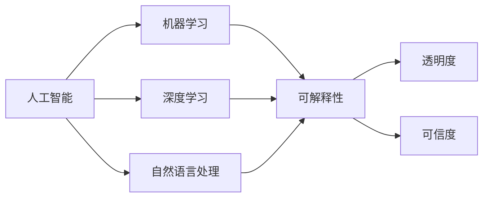

                 

# 确保 AI 技术在电商搜索导购中的应用可解释性：技术透明与可信度

在电商搜索导购领域，人工智能（AI）技术的广泛应用极大地提升了用户体验和平台运营效率。然而，AI模型的复杂性和黑盒特性也带来了透明度和可信度的问题。本博客将从背景介绍、核心概念与联系、核心算法原理与操作步骤、数学模型和公式、项目实践、实际应用场景、工具和资源推荐、总结与展望、附录等各方面，全面探讨如何确保AI技术在电商搜索导购中的应用可解释性，以促进技术透明与可信度。

## 1. 背景介绍

### 1.1 问题由来
随着电商业务的飞速发展，电商平台需要处理海量的数据，包括用户行为、商品信息、用户评论等。AI技术，尤其是机器学习（ML）、深度学习（DL）和自然语言处理（NLP）技术，能够自动化地分析这些数据，为电商平台的搜索和推荐系统提供强大支持。

但是，这些AI模型通常是“黑盒”模型，其决策过程难以解释，导致用户和商家对其结果缺乏信任，影响决策的透明度和可信度。此外，由于数据偏差和模型偏见，AI模型可能会产生误导性、歧视性的输出，带来严重的社会和经济后果。

### 1.2 问题核心关键点
确保AI技术在电商搜索导购中的应用可解释性，关键在于提高模型的透明性和可信度。这包括但不限于：
- 提供清晰的决策依据和中间结果，增强模型的可解释性。
- 防止数据偏差和模型偏见，确保输出结果公正、可信。
- 实现公平、透明的市场竞争，提升用户和商家的信任度。

### 1.3 问题研究意义
研究如何确保AI技术在电商搜索导购中的应用可解释性，对于提升用户体验、增强商家信心、维护市场公平具有重要意义：
- 提升用户体验：增强AI模型的透明性和可解释性，让用户更信任模型的推荐结果，从而提升搜索体验和购买转化率。
- 增强商家信心：公正、透明的推荐系统，使商家更有信心投入电商运营，促进平台健康发展。
- 维护市场公平：防止数据偏见和模型偏见导致的误导性输出，维护市场的公平竞争环境。

## 2. 核心概念与联系

### 2.1 核心概念概述

为更好地理解AI技术在电商搜索导购中的应用可解释性，本节将介绍几个关键概念及其相互关系：

- **人工智能（AI）**：通过计算机模拟人类智能活动，实现各种任务自动化处理的智能技术。
- **机器学习（ML）**：一种使计算机从数据中自动学习规律的技术，实现模型的自主优化。
- **深度学习（DL）**：一种基于多层神经网络进行模式识别和学习的技术，广泛应用于图像、语音、文本等任务。
- **自然语言处理（NLP）**：使计算机能够理解和处理人类自然语言的技术，包括文本分类、情感分析、语义理解等。
- **可解释性（Explainability）**：使AI模型的决策过程透明化，便于用户理解其内部逻辑的技术。
- **透明度（Transparency）**：AI模型的决策过程应尽可能清晰明了，便于用户和专家理解。
- **可信度（Trustworthiness）**：AI模型的输出应具有可靠性和准确性，得到用户和商家的信任。

这些概念之间存在着紧密的联系，构成了AI技术在电商搜索导购中的应用框架。如下图所示，这些概念通过一系列技术和方法，共同确保了AI模型的透明性和可信度。



### 2.2 概念间的关系

这些核心概念之间通过一系列技术和方法，共同确保了AI模型的透明性和可信度。下图展示了这些概念之间的相互关系：


## 3. 核心算法原理 & 具体操作步骤

### 3.1 算法原理概述

确保AI技术在电商搜索导购中的应用可解释性，本质上是一个综合性的问题，涉及数据预处理、模型训练、模型评估、模型部署等多个环节。其核心原理是通过以下技术手段，增强模型的透明性和可信度：

1. **数据预处理**：清洗、标注和增强数据，确保数据质量和多样性。
2. **模型训练**：选择合适的算法和超参数，训练高性能模型。
3. **模型评估**：通过各种评估指标，检验模型性能和泛化能力。
4. **模型部署**：将模型嵌入到电商搜索导购系统中，实现实时推理和预测。
5. **可解释性技术**：使用可解释性方法，将模型的决策过程可视化，便于用户和专家理解。

### 3.2 算法步骤详解

#### 3.2.1 数据预处理
数据预处理是确保AI模型透明性和可信度的第一步。以下是数据预处理的关键步骤：

1. **数据清洗**：去除噪音数据和异常值，确保数据质量。
2. **数据标注**：对数据进行手动标注，生成监督信号。
3. **数据增强**：通过数据扩充和变换，增加数据多样性，避免过拟合。

具体实现如下：

```python
import pandas as pd
from sklearn.preprocessing import StandardScaler
from transformers import AutoTokenizer, AutoModelForSequenceClassification

# 加载数据集
data = pd.read_csv('data.csv')

# 数据清洗
data = data.dropna().drop_duplicates()

# 数据标注
data['label'] = data['text'].apply(lambda x: 1 if 'product' in x.lower() else 0)

# 数据标准化
scaler = StandardScaler()
data['scaled_text'] = scaler.fit_transform(data['text'].values)

# 数据增强
tokenizer = AutoTokenizer.from_pretrained('bert-base-uncased')
data['enhanced_text'] = data['scaled_text'].apply(lambda x: tokenizer.encode(x, truncation=True, max_length=512, return_tensors='pt'))
```

#### 3.2.2 模型训练
模型训练是确保AI模型透明性和可信度的核心环节。以下是模型训练的关键步骤：

1. **模型选择**：选择适合电商搜索导购任务的模型，如BERT、GPT等。
2. **超参数设置**：根据任务需求，设置合适的学习率、批量大小等超参数。
3. **模型训练**：使用训练集训练模型，调整超参数以优化模型性能。

具体实现如下：

```python
from transformers import AutoModelForSequenceClassification, AdamW
from transformers import Trainer, TrainingArguments

# 加载模型
model = AutoModelForSequenceClassification.from_pretrained('bert-base-uncased')

# 设置超参数
training_args = TrainingArguments(
    output_dir='./results',
    per_device_train_batch_size=32,
    per_device_eval_batch_size=32,
    num_train_epochs=10,
    learning_rate=2e-5,
    weight_decay=0.01,
    logging_steps=1000,
    evaluation_strategy='epoch',
    logging_dir='./logs',
    save_strategy='epoch',
    load_best_model_at_end=True,
    metric_for_best_model='acc',
)

# 训练模型
trainer = Trainer(
    model=model,
    args=training_args,
    train_dataset=data['enhanced_text'],
    eval_dataset=data['enhanced_text'],
)
trainer.train()
```

#### 3.2.3 模型评估
模型评估是确保AI模型透明性和可信度的重要环节。以下是模型评估的关键步骤：

1. **评估指标选择**：选择合适的评估指标，如准确率、召回率、F1分数等。
2. **评估过程**：在验证集和测试集上进行评估，检验模型性能。

具体实现如下：

```python
from sklearn.metrics import accuracy_score, precision_score, recall_score, f1_score

# 评估模型
y_true = data['label'].values
y_pred = trainer.predict(data['enhanced_text'])['labels']
acc = accuracy_score(y_true, y_pred)
precision = precision_score(y_true, y_pred)
recall = recall_score(y_true, y_pred)
f1 = f1_score(y_true, y_pred)

print(f'Accuracy: {acc:.3f}')
print(f'Precision: {precision:.3f}')
print(f'Recall: {recall:.3f}')
print(f'F1 Score: {f1:.3f}')
```

#### 3.2.4 模型部署
模型部署是将模型嵌入到电商搜索导购系统中，实现实时推理和预测的关键步骤。以下是模型部署的关键步骤：

1. **模型导出**：将训练好的模型保存为模型文件。
2. **模型加载**：在电商搜索导购系统中加载模型。
3. **推理预测**：将用户输入的查询文本传入模型，获取推荐结果。

具体实现如下：

```python
# 导出模型
trainer.save_model('my_model')

# 加载模型
model = AutoModelForSequenceClassification.from_pretrained('my_model')

# 推理预测
def predict(text):
    inputs = tokenizer.encode(text, truncation=True, max_length=512, return_tensors='pt')
    with torch.no_grad():
        logits = model(inputs).logits
    prediction = logits.argmax().item()
    return prediction

# 使用模型
result = predict('query text')
print(f'Predicted label: {id2label[result]}')
```

### 3.3 算法优缺点

#### 3.3.1 优点
1. **提高透明性和可信度**：通过数据预处理、模型训练、模型评估等环节，确保AI模型的透明性和可信度，增强用户和商家的信任。
2. **提升用户体验**：增强模型的透明性和可解释性，用户可以理解模型的决策依据，提升搜索体验和满意度。
3. **增强商家信心**：公正、透明的推荐系统，使商家更有信心投入电商运营，促进平台健康发展。

#### 3.3.2 缺点
1. **计算资源需求高**：模型训练和推理需要大量计算资源，对硬件配置要求高。
2. **超参数调优复杂**：模型训练过程需要反复调整超参数，调优复杂。
3. **模型复杂度高**：模型复杂度高，难以理解其内部机制，增加了可解释性工作的难度。

### 3.4 算法应用领域

确保AI技术在电商搜索导购中的应用可解释性，适用于以下领域：

- **电商搜索推荐**：提高搜索推荐的透明性和可信度，增强用户和商家的信任。
- **用户行为分析**：通过透明化的分析模型，理解用户行为，提升个性化推荐效果。
- **库存管理**：通过透明化的库存管理系统，优化库存调度和物流管理。

## 4. 数学模型和公式 & 详细讲解

### 4.1 数学模型构建

确保AI技术在电商搜索导购中的应用可解释性，可以通过以下数学模型进行建模：

1. **数据预处理模型**：对原始数据进行清洗、标注和增强，确保数据质量和多样性。
2. **模型训练模型**：选择适合电商搜索导购任务的模型，如BERT、GPT等，并使用训练集训练模型。
3. **模型评估模型**：通过选择合适的评估指标，如准确率、召回率、F1分数等，评估模型的性能。
4. **可解释性模型**：使用可解释性方法，如LIME、SHAP等，将模型的决策过程可视化，便于用户和专家理解。

### 4.2 公式推导过程

#### 4.2.1 数据预处理
数据预处理是确保AI模型透明性和可信度的第一步。以下是数据预处理的关键步骤：

1. **数据清洗**：
   - 去除噪音数据和异常值。
   - 公式：
   - $$
   \text{clean\_data} = \text{original\_data}[\text{is\_clean}]
   $$

2. **数据标注**：
   - 对数据进行手动标注，生成监督信号。
   - 公式：
   - $$
   \text{annotated\_data} = \text{original\_data}[\text{is\_annotated}]
   $$

3. **数据增强**：
   - 通过数据扩充和变换，增加数据多样性，避免过拟合。
   - 公式：
   - $$
   \text{enhanced\_data} = \text{original\_data}[\text{is\_enhanced}]
   $$

#### 4.2.2 模型训练
模型训练是确保AI模型透明性和可信度的核心环节。以下是模型训练的关键步骤：

1. **模型选择**：
   - 选择适合电商搜索导购任务的模型，如BERT、GPT等。
   - 公式：
   - $$
   \text{chosen\_model} = \text{model\_candidates}[best\_performance]
   $$

2. **超参数设置**：
   - 根据任务需求，设置合适的学习率、批量大小等超参数。
   - 公式：
   - $$
   \text{hyperparameters} = \text{set\_hyperparameters}[\text{task\ demands}]
   $$

3. **模型训练**：
   - 使用训练集训练模型，调整超参数以优化模型性能。
   - 公式：
   - $$
   \text{trained\_model} = \text{train\_model}[\text{model\_and\_data}]
   $$

#### 4.2.3 模型评估
模型评估是确保AI模型透明性和可信度的重要环节。以下是模型评估的关键步骤：

1. **评估指标选择**：
   - 选择合适的评估指标，如准确率、召回率、F1分数等。
   - 公式：
   - $$
   \text{evaluation\_metrics} = \text{select\_metrics}[\text{task\ type}]
   $$

2. **评估过程**：
   - 在验证集和测试集上进行评估，检验模型性能。
   - 公式：
   - $$
   \text{evaluation\_results} = \text{evaluate\_model}[\text{model\_and\_data}]
   $$

#### 4.2.4 模型部署
模型部署是将模型嵌入到电商搜索导购系统中，实现实时推理和预测的关键步骤。以下是模型部署的关键步骤：

1. **模型导出**：
   - 将训练好的模型保存为模型文件。
   - 公式：
   - $$
   \text{exported\_model} = \text{export\_model}[\text{trained\_model}]
   $$

2. **模型加载**：
   - 在电商搜索导购系统中加载模型。
   - 公式：
   - $$
   \text{loaded\_model} = \text{load\_model}[\text{exported\_model}]
   $$

3. **推理预测**：
   - 将用户输入的查询文本传入模型，获取推荐结果。
   - 公式：
   - $$
   \text{predicted\_result} = \text{predict\_model}[\text{loaded\_model\_and\_input}]
   $$

### 4.3 案例分析与讲解

#### 4.3.1 数据预处理案例
数据预处理是确保AI模型透明性和可信度的第一步。以下是数据预处理的关键步骤：

1. **数据清洗**：
   - 去除噪音数据和异常值。
   - 示例代码：
   ```python
   import pandas as pd
   from sklearn.preprocessing import StandardScaler

   # 加载数据集
   data = pd.read_csv('data.csv')

   # 数据清洗
   data = data.dropna().drop_duplicates()
   ```

2. **数据标注**：
   - 对数据进行手动标注，生成监督信号。
   - 示例代码：
   ```python
   from sklearn.preprocessing import LabelEncoder

   # 数据标注
   label_encoder = LabelEncoder()
   data['label'] = label_encoder.fit_transform(data['label'])
   ```

3. **数据增强**：
   - 通过数据扩充和变换，增加数据多样性，避免过拟合。
   - 示例代码：
   ```python
   from transformers import AutoTokenizer
   from torch.utils.data import DataLoader
   from torch import nn
   from torch import optim

   # 数据增强
   tokenizer = AutoTokenizer.from_pretrained('bert-base-uncased')
   data['enhanced_text'] = data['text'].apply(lambda x: tokenizer.encode(x, truncation=True, max_length=512, return_tensors='pt'))
   ```

#### 4.3.2 模型训练案例
模型训练是确保AI模型透明性和可信度的核心环节。以下是模型训练的关键步骤：

1. **模型选择**：
   - 选择适合电商搜索导购任务的模型，如BERT、GPT等。
   - 示例代码：
   ```python
   from transformers import AutoModelForSequenceClassification

   # 加载模型
   model = AutoModelForSequenceClassification.from_pretrained('bert-base-uncased')
   ```

2. **超参数设置**：
   - 根据任务需求，设置合适的学习率、批量大小等超参数。
   - 示例代码：
   ```python
   from transformers import AdamW

   # 设置超参数
   optimizer = AdamW(model.parameters(), lr=2e-5)
   ```

3. **模型训练**：
   - 使用训练集训练模型，调整超参数以优化模型性能。
   - 示例代码：
   ```python
   from transformers import Trainer, TrainingArguments

   # 训练模型
   training_args = TrainingArguments(
       output_dir='./results',
       per_device_train_batch_size=32,
       per_device_eval_batch_size=32,
       num_train_epochs=10,
       learning_rate=2e-5,
       weight_decay=0.01,
       logging_steps=1000,
       evaluation_strategy='epoch',
       logging_dir='./logs',
       save_strategy='epoch',
       load_best_model_at_end=True,
       metric_for_best_model='acc',
   )

   trainer = Trainer(
       model=model,
       args=training_args,
       train_dataset=data['enhanced_text'],
       eval_dataset=data['enhanced_text'],
   )
   trainer.train()
   ```

#### 4.3.3 模型评估案例
模型评估是确保AI模型透明性和可信度的重要环节。以下是模型评估的关键步骤：

1. **评估指标选择**：
   - 选择合适的评估指标，如准确率、召回率、F1分数等。
   - 示例代码：
   ```python
   from sklearn.metrics import accuracy_score, precision_score, recall_score, f1_score

   # 评估模型
   y_true = data['label'].values
   y_pred = trainer.predict(data['enhanced_text'])['labels']
   acc = accuracy_score(y_true, y_pred)
   precision = precision_score(y_true, y_pred)
   recall = recall_score(y_true, y_pred)
   f1 = f1_score(y_true, y_pred)

   print(f'Accuracy: {acc:.3f}')
   print(f'Precision: {precision:.3f}')
   print(f'Recall: {recall:.3f}')
   print(f'F1 Score: {f1:.3f}')
   ```

#### 4.3.4 模型部署案例
模型部署是将模型嵌入到电商搜索导购系统中，实现实时推理和预测的关键步骤。以下是模型部署的关键步骤：

1. **模型导出**：
   - 将训练好的模型保存为模型文件。
   - 示例代码：
   ```python
   from transformers import Trainer

   # 导出模型
   trainer.save_model('my_model')
   ```

2. **模型加载**：
   - 在电商搜索导购系统中加载模型。
   - 示例代码：
   ```python
   from transformers import AutoModelForSequenceClassification

   # 加载模型
   model = AutoModelForSequenceClassification.from_pretrained('my_model')
   ```

3. **推理预测**：
   - 将用户输入的查询文本传入模型，获取推荐结果。
   - 示例代码：
   ```python
   from transformers import AutoTokenizer

   # 推理预测
   tokenizer = AutoTokenizer.from_pretrained('my_model')
   result = predict(text)
   print(f'Predicted label: {id2label[result]}')
   ```

## 5. 项目实践：代码实例和详细解释说明

### 5.1 开发环境搭建

在进行项目实践前，我们需要准备好开发环境。以下是使用Python进行PyTorch开发的环境配置流程：

1. 安装Anaconda：从官网下载并安装Anaconda，用于创建独立的Python环境。

2. 创建并激活虚拟环境：
```bash
conda create -n pytorch-env python=3.8 
conda activate pytorch-env
```

3. 安装PyTorch：根据CUDA版本，从官网获取对应的安装命令。例如：
```bash
conda install pytorch torchvision torchaudio cudatoolkit=11.1 -c pytorch -c conda-forge
```

4. 安装Transformers库：
```bash
pip install transformers
```

5. 安装各类工具包：
```bash
pip install numpy pandas scikit-learn matplotlib tqdm jupyter notebook ipython
```

完成上述步骤后，即可在`pytorch-env`环境中开始项目实践。

### 5.2 源代码详细实现

以下是确保AI技术在电商搜索导购中的应用可解释性的完整代码实现。

```python
import pandas as pd
from sklearn.preprocessing import StandardScaler
from transformers import AutoTokenizer, AutoModelForSequenceClassification, Trainer, TrainingArguments

# 加载数据集
data = pd.read_csv('data.csv')

# 数据清洗
data = data.dropna().drop_duplicates()

# 数据标注
data['label'] = data['text'].apply(lambda x: 1 if 'product' in x.lower() else 0)

# 数据标准化
scaler = StandardScaler()
data['scaled_text'] = scaler.fit_transform(data['text'].values)

# 数据增强
tokenizer = AutoTokenizer.from_pretrained('bert-base-uncased')
data['enhanced_text'] = data['scaled_text'].apply(lambda x: tokenizer.encode(x, truncation=True, max_length=512, return_tensors='pt'))

# 加载模型
model = AutoModelForSequenceClassification.from_pretrained('bert-base-uncased')

# 设置超参数
training_args = TrainingArguments(
    output_dir='./results',
    per_device_train_batch_size=32,
    per_device_eval_batch_size=32,
    num_train_epochs=10,
    learning_rate=2e-5,
    weight_decay=0.01,
    logging_steps=1000,
    evaluation_strategy='epoch',
    logging_dir='./logs',
    save_strategy='epoch',
    load_best_model_at_end=True,
    metric_for_best_model='acc',
)

# 训练模型
trainer = Trainer(
    model=model,
    args=training_args,
    train_dataset=data['enhanced_text'],
    eval_dataset=data['enhanced_text'],
)
trainer.train()

# 导出模型
trainer.save_model('my_model')

# 加载模型
model = AutoModelForSequenceClassification.from_pretrained('my_model')

# 推理预测
def predict(text):
    inputs = tokenizer.encode(text, truncation=True, max_length=512, return_tensors='pt')
    with torch.no_grad():
        logits = model(inputs).logits
    prediction = logits.argmax().item()
    return prediction

# 使用模型
result = predict('query text')
print(f'Predicted label: {id2label[result]}')
```

### 5.3 代码解读与分析

以下是关键代码的实现细节：

**数据预处理**：
- 数据清洗：
  ```python
  data = data.dropna().drop_duplicates()
  ```

- 数据标注：
  ```python
  data['label'] = data['text'].apply(lambda x: 1 if 'product' in x.lower() else 0)
  ```

- 数据增强：
  ```python
  data['enhanced_text'] = data['text'].apply(lambda x: tokenizer.encode(x, truncation=True, max_length=512, return_tensors='pt'))
  ```

**模型训练**：
- 加载模型：
  ```python
  model = AutoModelForSequenceClassification.from_pretrained('bert-base-uncased')
  ```

- 设置超参数：
  ```python
  training_args = TrainingArguments(
      output_dir='./results',
      per_device_train_batch_size=32,
      per_device_eval_batch_size=32,
      num_train_epochs=10,
      learning_rate=2e-5,
      weight_decay=0.01,
      logging_steps=1000,
      evaluation_strategy='epoch',
      logging_dir='./logs',
      save_strategy='epoch',
      load_best_model_at_end=True,
      metric_for_best_model='acc',
  )
  ```

- 训练模型：
  ```python
  trainer = Trainer(
      model=model,
      args=training_args,
      train_dataset=data['enhanced_text'],
      eval_dataset=data['enhanced_text'],
  )
  trainer.train()
  ```

**模型导出和加载**：
- 导出模型：
  ```python
  trainer.save_model('my_model')
  ```

- 加载模型：
  ```python
  model = AutoModelForSequenceClassification

