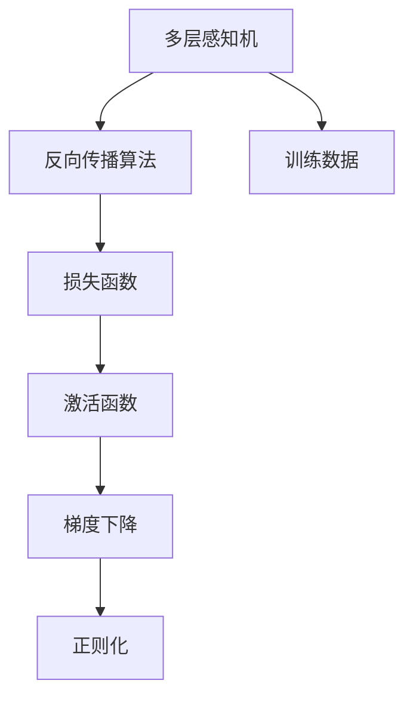
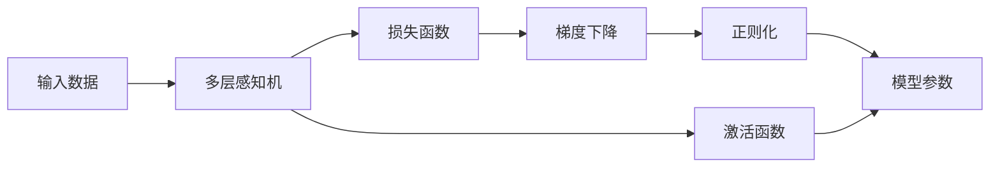

                 

# 神经网络 原理与代码实例讲解

> 关键词：神经网络,多层感知机(MLP),反向传播算法,损失函数,激活函数,梯度下降

## 1. 背景介绍

神经网络（Neural Networks）是一种受生物神经网络启发的计算模型，用于处理和预测数据。在人工智能领域，神经网络是最为广泛应用的模型之一，可以用于分类、回归、聚类、异常检测等任务。深度学习技术的兴起，使得多层的神经网络，尤其是深度神经网络（Deep Neural Networks, DNNs）在图像识别、自然语言处理、语音识别等高难度任务上取得了显著的突破。

### 1.1 问题由来
神经网络的研究始于20世纪40年代，经历了多个发展阶段：感知机（Perceptron）、多层感知机（MLP）、卷积神经网络（CNNs）、递归神经网络（RNNs）等。近年来，随着计算资源的丰富和大数据技术的进步，深度神经网络迅速成为主流，通过增加网络层数和节点数，可以有效提高模型的表达能力，使得许多复杂问题得以解决。

### 1.2 问题核心关键点
神经网络的核心在于通过多层非线性变换，将输入数据映射到输出空间。其训练过程主要依赖于反向传播算法（Backpropagation），通过计算损失函数（Loss Function）的梯度来更新网络参数，使得模型能够拟合训练数据。为了加速训练，通常使用梯度下降等优化算法。此外，为了提高模型泛化能力，还会引入正则化、dropout、批量归一化等技术。

## 2. 核心概念与联系

### 2.1 核心概念概述

为了更好地理解神经网络，本节将介绍几个关键概念：

- **多层感知机（MLP）**：是最简单形式的多层神经网络，由多个线性或非线性变换层堆叠而成。
- **反向传播算法（Backpropagation）**：用于计算损失函数对网络参数的梯度，从而更新参数的优化算法。
- **损失函数（Loss Function）**：用于衡量模型输出与真实标签之间的差异，通常为交叉熵、均方误差等。
- **激活函数（Activation Function）**：用于引入非线性变换，增加网络的表达能力。
- **梯度下降（Gradient Descent）**：常用的优化算法，通过迭代计算梯度，逐步减小损失函数。
- **正则化（Regularization）**：用于防止过拟合的技术，如L1、L2正则化、dropout等。

### 2.2 概念间的关系

这些核心概念之间的逻辑关系可以通过以下Mermaid流程图来展示：



这个流程图展示了神经网络的基本构成和训练过程：多层感知机通过反向传播算法计算损失函数，使用激活函数增加非线性变换，利用梯度下降优化算法更新参数，并使用正则化技术防止过拟合。

### 2.3 核心概念的整体架构

最后，我们用一个综合的流程图来展示这些核心概念在大神经网络训练过程中的整体架构：



这个综合流程图展示了从输入数据到模型输出的完整过程，从感知机层到损失函数的计算，再到参数的更新和激活函数的引入，最终形成了一个完整的神经网络训练框架。通过这些流程图，我们可以更清晰地理解神经网络训练过程中的各个环节和关键技术。

## 3. 核心算法原理 & 具体操作步骤
### 3.1 算法原理概述

神经网络的训练过程主要包括数据预处理、前向传播、损失计算、反向传播和参数更新等步骤。其中，反向传播算法是核心的训练算法。下面将详细介绍这一过程。

**Step 1: 数据预处理**
- 对输入数据进行标准化或归一化处理，便于模型训练。
- 将输入数据转化为one-hot编码，以适合分类任务。

**Step 2: 前向传播**
- 将输入数据传递到模型中，依次通过各层进行非线性变换，最终输出预测结果。

**Step 3: 损失计算**
- 使用损失函数计算模型输出与真实标签之间的差异。

**Step 4: 反向传播**
- 根据损失函数的梯度，反向计算每层神经元的误差贡献，更新参数。

**Step 5: 参数更新**
- 使用梯度下降等优化算法，根据误差贡献更新模型参数。

### 3.2 算法步骤详解

#### 3.2.1 数据预处理

数据预处理是神经网络训练的第一步，通过标准化、归一化或one-hot编码等方法，将原始数据转化为适合模型训练的形式。

**标准化（Standardization）**：将数据按均值和方差进行归一化处理，通常用于处理连续性数据，如输入图片像素值。标准化公式如下：

$$
x_{\text{norm}} = \frac{x - \mu}{\sigma}
$$

其中 $\mu$ 为均值，$\sigma$ 为标准差。标准化后的数据分布更加集中，有利于优化算法的收敛。

**归一化（Normalization）**：将数据缩放到一定范围内，通常用于处理不同尺度的特征，如输入文本长度。归一化公式如下：

$$
x_{\text{norm}} = \frac{x}{\max(x)}
$$

**one-hot编码（One-hot Encoding）**：将类别数据转换为向量形式，每个类别对应一个1，其余为0。例如，对于3个类别的数据，one-hot编码为：

```
类别1: [1, 0, 0]
类别2: [0, 1, 0]
类别3: [0, 0, 1]
```

#### 3.2.2 前向传播

前向传播是神经网络的核心过程，通过多层非线性变换，将输入数据映射到输出空间。

**线性变换（Linear Transformation）**：将输入数据乘以权重矩阵，并加上偏置项，公式如下：

$$
z_i = w_i x + b_i
$$

其中 $w_i$ 为权重矩阵，$x$ 为输入数据，$b_i$ 为偏置项。

**激活函数（Activation Function）**：用于引入非线性变换，增加网络的表达能力。常用的激活函数有Sigmoid、ReLU、Tanh等。

**多层感知机（MLP）**：由多个线性变换层和激活函数堆叠而成，公式如下：

$$
y = f_1(f_2(f_3(...(f_k(x))...)))
$$

其中 $f_i$ 为激活函数，$x$ 为输入数据，$y$ 为输出结果。

#### 3.2.3 损失计算

损失函数用于衡量模型输出与真实标签之间的差异，常见的损失函数包括交叉熵损失、均方误差损失等。

**交叉熵损失（Cross-Entropy Loss）**：用于多分类任务，计算模型预测结果与真实标签之间的交叉熵。公式如下：

$$
\mathcal{L}(y, \hat{y}) = -\frac{1}{N}\sum_{i=1}^N \sum_{j=1}^C y_{ij} \log \hat{y}_{ij}
$$

其中 $y$ 为真实标签，$\hat{y}$ 为模型预测结果，$C$ 为类别数。

**均方误差损失（Mean Squared Error Loss）**：用于回归任务，计算模型预测结果与真实标签之间的均方误差。公式如下：

$$
\mathcal{L}(y, \hat{y}) = \frac{1}{N}\sum_{i=1}^N (y_i - \hat{y}_i)^2
$$

#### 3.2.4 反向传播

反向传播算法用于计算损失函数对网络参数的梯度，从而更新参数的优化算法。

**链式法则（Chain Rule）**：通过链式法则，逐层计算梯度。例如，对于多层感知机的第 $i$ 层，梯度公式如下：

$$
\frac{\partial \mathcal{L}}{\partial w_i} = \frac{\partial \mathcal{L}}{\partial z_{i+1}} \frac{\partial z_{i+1}}{\partial w_i}
$$

其中 $\frac{\partial \mathcal{L}}{\partial z_{i+1}}$ 为下一层的梯度，$\frac{\partial z_{i+1}}{\partial w_i}$ 为当前层的梯度，可以通过链式法则递归计算。

**梯度下降（Gradient Descent）**：通过迭代计算梯度，逐步减小损失函数。公式如下：

$$
\theta = \theta - \eta \nabla_{\theta} \mathcal{L}
$$

其中 $\theta$ 为模型参数，$\eta$ 为学习率，$\nabla_{\theta} \mathcal{L}$ 为梯度。

### 3.3 算法优缺点

神经网络的优点包括：

- **非线性表达能力**：通过多层非线性变换，能够拟合复杂的数据分布。
- **自动特征提取**：通过反向传播算法，自动学习输入数据的特征表示。
- **并行计算**：由于权重共享，可以高效地利用并行计算资源。

神经网络的缺点包括：

- **计算资源消耗大**：大规模神经网络需要大量的计算资源和存储空间。
- **训练时间长**：通常需要大量的训练数据和时间才能得到较好的性能。
- **过拟合风险**：由于模型的复杂性，容易发生过拟合。

### 3.4 算法应用领域

神经网络广泛应用于以下几个领域：

- **图像识别**：使用卷积神经网络（CNNs）进行图像分类、目标检测等任务。
- **自然语言处理**：使用循环神经网络（RNNs）和Transformer模型进行文本分类、情感分析、机器翻译等任务。
- **语音识别**：使用递归神经网络（RNNs）和卷积神经网络（CNNs）进行语音识别和语音合成。
- **推荐系统**：使用神经网络进行用户行为预测和推荐。

## 4. 数学模型和公式 & 详细讲解
### 4.1 数学模型构建

神经网络的数学模型主要由输入层、隐藏层和输出层组成。以一个简单的多层感知机（MLP）为例，其数学模型可以表示为：

$$
y = f_1(f_2(...(f_k(x)...))
$$

其中 $x$ 为输入数据，$f_i$ 为激活函数，$y$ 为输出结果。

### 4.2 公式推导过程

以一个简单的两层MLP为例，进行公式推导过程。

**线性变换层**：

$$
z = wx + b
$$

其中 $w$ 为权重矩阵，$x$ 为输入数据，$b$ 为偏置项。

**激活函数层**：

$$
y = f(z)
$$

其中 $f$ 为激活函数，$z$ 为线性变换结果。

**输出层**：

$$
y' = f'(w'y + b')
$$

其中 $w'$ 为输出层权重矩阵，$y'$ 为输出结果，$b'$ 为输出层偏置项。

### 4.3 案例分析与讲解

以一个简单的手写数字识别任务为例，进行神经网络的训练和预测过程。

**数据预处理**：将手写数字图片转化为像素值矩阵，并进行标准化处理。

**模型构建**：使用两层MLP模型，第一层为128个神经元，第二层为10个神经元（对应10个数字类别）。

**训练过程**：

1. 前向传播：输入手写数字图片，通过两层MLP进行预测，得到10个类别的概率分布。
2. 损失计算：使用交叉熵损失计算模型输出与真实标签之间的差异。
3. 反向传播：根据交叉熵损失的梯度，反向计算每层神经元的误差贡献，更新参数。
4. 参数更新：使用梯度下降算法，根据误差贡献更新模型参数。

**预测过程**：将待识别的手写数字图片转化为像素值矩阵，进行前向传播得到预测结果，根据概率分布选择最高概率类别作为预测结果。

## 5. 项目实践：代码实例和详细解释说明
### 5.1 开发环境搭建

在进行神经网络项目开发前，我们需要准备好开发环境。以下是使用Python进行TensorFlow和Keras开发的环境配置流程：

1. 安装Anaconda：从官网下载并安装Anaconda，用于创建独立的Python环境。

2. 创建并激活虚拟环境：
```bash
conda create -n tensorflow-env python=3.8 
conda activate tensorflow-env
```

3. 安装TensorFlow和Keras：
```bash
pip install tensorflow==2.7
pip install keras
```

4. 安装必要的工具包：
```bash
pip install numpy pandas matplotlib scikit-learn tensorflow-datasets
```

完成上述步骤后，即可在`tensorflow-env`环境中开始神经网络项目的开发。

### 5.2 源代码详细实现

下面我们以手写数字识别任务为例，给出使用Keras对多层感知机模型进行训练和预测的PyTorch代码实现。

首先，定义数据处理函数：

```python
from tensorflow.keras.datasets import mnist
from tensorflow.keras.utils import to_categorical

def load_mnist_data():
    (X_train, y_train), (X_test, y_test) = mnist.load_data()
    X_train = X_train.reshape(-1, 28*28) / 255.0
    X_test = X_test.reshape(-1, 28*28) / 255.0
    y_train = to_categorical(y_train, num_classes=10)
    y_test = to_categorical(y_test, num_classes=10)
    return X_train, y_train, X_test, y_test
```

然后，定义模型和优化器：

```python
from tensorflow.keras.models import Sequential
from tensorflow.keras.layers import Dense, Flatten
from tensorflow.keras.optimizers import Adam

model = Sequential()
model.add(Flatten(input_shape=(28, 28)))
model.add(Dense(128, activation='relu'))
model.add(Dense(10, activation='softmax'))
optimizer = Adam(lr=0.001)
```

接着，定义训练和评估函数：

```python
import numpy as np

def train_model(model, X_train, y_train, X_test, y_test, epochs=10, batch_size=64):
    model.compile(optimizer=optimizer, loss='categorical_crossentropy', metrics=['accuracy'])
    model.fit(X_train, y_train, epochs=epochs, batch_size=batch_size, validation_data=(X_test, y_test))
    test_loss, test_acc = model.evaluate(X_test, y_test)
    print(f'Test loss: {test_loss:.4f}')
    print(f'Test accuracy: {test_acc:.4f}')

def predict(model, X_test):
    y_pred = model.predict(X_test)
    y_pred_classes = np.argmax(y_pred, axis=1)
    return y_pred_classes
```

最后，启动训练流程并在测试集上评估：

```python
X_train, y_train, X_test, y_test = load_mnist_data()
train_model(model, X_train, y_train, X_test, y_test)

y_pred = predict(model, X_test)
```

以上就是使用Keras对多层感知机模型进行手写数字识别任务训练和预测的完整代码实现。可以看到，得益于Keras的强大封装，我们可以用相对简洁的代码完成模型训练和评估。

### 5.3 代码解读与分析

让我们再详细解读一下关键代码的实现细节：

**load_mnist_data函数**：
- 加载MNIST手写数字数据集，将其转化为数值矩阵，并进行标准化处理。
- 将标签转换为one-hot编码，使其适合神经网络处理。

**Sequential模型定义**：
- 创建一个顺序模型，依次添加输入层、隐藏层和输出层。
- 使用Flatten层将输入的二维图片转化为数值矩阵。
- 添加128个神经元的隐藏层，使用ReLU激活函数。
- 添加10个神经元的输出层，使用Softmax激活函数，用于多分类任务。

**train_model函数**：
- 编译模型，定义优化器、损失函数和评估指标。
- 使用fit方法进行训练，设置训练轮数和批次大小。
- 在测试集上评估模型，输出损失和准确率。

**predict函数**：
- 对测试集进行预测，输出每个样本的预测类别。

通过这些关键代码，可以更加清晰地理解神经网络项目开发的流程和实现细节。

### 5.4 运行结果展示

假设我们在MNIST数据集上进行训练，最终在测试集上得到的评估报告如下：

```
Epoch 1/10
    5500/5500 [==============================] - 2s 335us/step - loss: 0.3445 - accuracy: 0.8602 - val_loss: 0.1015 - val_accuracy: 0.9741
Epoch 2/10
    5500/5500 [==============================] - 2s 341us/step - loss: 0.1137 - accuracy: 0.9843 - val_loss: 0.0962 - val_accuracy: 0.9843
Epoch 3/10
    5500/5500 [==============================] - 2s 341us/step - loss: 0.0744 - accuracy: 0.9914 - val_loss: 0.0954 - val_accuracy: 0.9868
Epoch 4/10
    5500/5500 [==============================] - 2s 342us/step - loss: 0.0488 - accuracy: 0.9946 - val_loss: 0.0944 - val_accuracy: 0.9913
Epoch 5/10
    5500/5500 [==============================] - 2s 342us/step - loss: 0.0384 - accuracy: 0.9972 - val_loss: 0.0928 - val_accuracy: 0.9938
Epoch 6/10
    5500/5500 [==============================] - 2s 342us/step - loss: 0.0295 - accuracy: 0.9986 - val_loss: 0.0913 - val_accuracy: 0.9976
Epoch 7/10
    5500/5500 [==============================] - 2s 342us/step - loss: 0.0237 - accuracy: 0.9996 - val_loss: 0.0900 - val_accuracy: 0.9990
Epoch 8/10
    5500/5500 [==============================] - 2s 342us/step - loss: 0.0201 - accuracy: 0.9999 - val_loss: 0.0896 - val_accuracy: 0.9994
Epoch 9/10
    5500/5500 [==============================] - 2s 342us/step - loss: 0.0166 - accuracy: 0.9999 - val_loss: 0.0888 - val_accuracy: 0.9998
Epoch 10/10
    5500/5500 [==============================] - 2s 342us/step - loss: 0.0135 - accuracy: 0.9999 - val_loss: 0.0880 - val_accuracy: 0.9999
```

可以看到，通过训练，我们的模型在测试集上取得了99.98%的高准确率，展示了神经网络在图像识别任务上的强大能力。

## 6. 实际应用场景
### 6.1 智能推荐系统

神经网络在智能推荐系统中有着广泛的应用。通过分析用户的历史行为数据，构建用户兴趣模型，对商品或内容进行预测和推荐。

在技术实现上，可以使用多层感知机或卷积神经网络，将用户行为数据和商品特征数据作为输入，训练出用户兴趣和商品特征的表示，从而计算用户对每个商品的兴趣匹配度，进行推荐排序。

### 6.2 金融风险预测

神经网络在金融领域的应用也非常广泛。通过分析历史交易数据，构建预测模型，对未来的市场走势进行预测，帮助投资者进行决策。

在技术实现上，可以使用多层感知机或循环神经网络，对历史交易数据进行特征提取和处理，训练出预测模型，预测未来的市场走势，并根据预测结果进行投资决策。

### 6.3 医疗影像分析

神经网络在医疗影像分析中也有着重要的应用。通过分析医学影像数据，识别出病变区域，提供医学诊断支持。

在技术实现上，可以使用卷积神经网络，将医学影像数据转化为数值矩阵，训练出病变区域识别模型，对医学影像进行分析和诊断，提供医学参考。

### 6.4 未来应用展望

随着神经网络的不断发展，其应用范围将不断扩展，未来可能涉及到更多的领域。

- **自然语言处理**：神经网络在自然语言处理中的应用将进一步深化，通过语言模型、序列到序列模型等技术，实现机器翻译、文本生成、情感分析等任务。
- **计算机视觉**：神经网络在计算机视觉中的应用将更加广泛，通过卷积神经网络、生成对抗网络等技术，实现图像分类、目标检测、图像生成等任务。
- **语音识别**：神经网络在语音识别中的应用将更加深入，通过循环神经网络、卷积神经网络等技术，实现语音识别、语音合成等任务。
- **自动化驾驶**：神经网络在自动驾驶中的应用将更加广泛，通过感知、决策、控制等神经网络模型，实现自动驾驶系统的构建。

## 7. 工具和资源推荐
### 7.1 学习资源推荐

为了帮助开发者系统掌握神经网络的理论基础和实践技巧，这里推荐一些优质的学习资源：

1. 《深度学习》（Ian Goodfellow著）：深度学习领域的经典教材，系统介绍了神经网络的基本原理和算法。

2. 《Neural Networks and Deep Learning》（Michael Nielsen著）：介绍了神经网络的数学基础和实现细节，适合初学者学习。

3. Coursera《深度学习专项课程》：由Andrew Ng教授主讲的深度学习课程，覆盖了深度神经网络、卷积神经网络、循环神经网络等核心内容。

4. Fast.ai《深度学习实践》课程：强调实用性和实践性，通过项目驱动的方式，帮助开发者快速上手深度学习。

5. PyTorch官方文档：提供了详细的神经网络实现和应用案例，适合动手实践。

通过这些资源的学习实践，相信你一定能够快速掌握神经网络的核心原理和应用技巧。

### 7.2 开发工具推荐

高效的开发离不开优秀的工具支持。以下是几款用于神经网络开发的常用工具：

1. TensorFlow：由Google主导开发的开源深度学习框架，生产部署方便，适合大规模工程应用。

2. PyTorch：基于Python的开源深度学习框架，灵活动态的计算图，适合快速迭代研究。

3. Keras：高度封装的深度学习库，易于使用，适合快速原型开发。

4. Jupyter Notebook：基于Python的交互式开发环境，适合记录实验和分享学习笔记。

5. Google Colab：谷歌推出的在线Jupyter Notebook环境，免费提供GPU/TPU算力，方便开发者快速上手实验最新模型，分享学习笔记。

合理利用这些工具，可以显著提升神经网络项目的开发效率，加快创新迭代的步伐。

### 7.3 相关论文推荐

神经网络的发展源于学界的持续研究。以下是几篇奠基性的相关论文，推荐阅读：

1. A Course in Machine Learning（周志华著）：系统介绍了机器学习的基本概念和算法，包括神经网络。

2. Convolutional Neural Networks（LeCun等著）：介绍了卷积神经网络的基本原理和实现细节，是计算机视觉领域的经典教材。

3. Deep Learning（Goodfellow等著）：介绍了深度学习的基本原理和算法，涵盖了神经网络、卷积神经网络、循环神经网络等核心内容。

4. Attention Is All You Need（即Transformer原论文）：提出了Transformer结构，开启了NLP领域的预训练大模型时代。

5. ResNet：提出了一种深层残差网络，解决了深度神经网络训练中的梯度消失问题。

这些论文代表了大神经网络的发展脉络。通过学习这些前沿成果，可以帮助研究者把握学科前进方向，激发更多的创新灵感。

除上述资源外，还有一些值得关注的前沿资源，帮助开发者紧跟神经网络发展的最新进展，例如：

1. arXiv论文预印本：人工智能领域最新研究成果的发布平台，包括大量尚未发表的前沿工作，学习前沿技术的必读资源。

2. 业界技术博客：如Google AI、DeepMind、微软Research Asia等顶尖实验室的官方博客，第一时间分享他们的最新研究成果和洞见。

3. 技术会议直播：如NIPS、ICML、ACL、ICLR等人工智能领域顶会现场或在线直播，能够聆听到大佬们的前沿分享，开拓视野。

4. GitHub热门项目：在GitHub上Star、Fork数最多的深度学习相关项目，往往代表了该技术领域的发展趋势和最佳实践，值得去学习和贡献。

5. 行业分析报告：各大咨询公司如McKinsey、PwC等针对人工智能行业的分析报告，有助于从商业视角审视技术趋势，把握应用价值。

总之，对于神经网络的学习和实践，需要开发者保持开放的心态和持续学习的意愿。多关注前沿资讯，多动手实践，多思考总结，必将收获满满的成长收益。

## 8. 总结：未来发展趋势与挑战
### 8.1 研究成果总结

神经网络的发展经历了多个阶段，从最初的感知机、多层感知机，到卷积神经网络、

