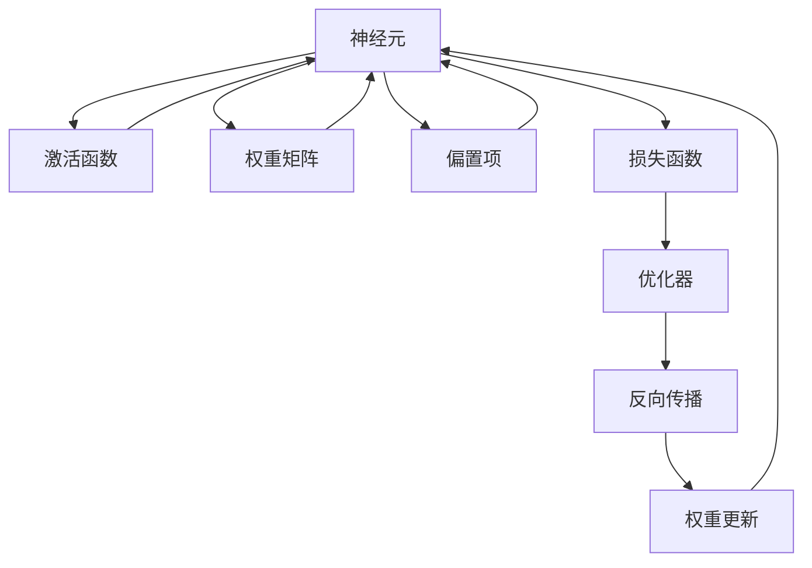
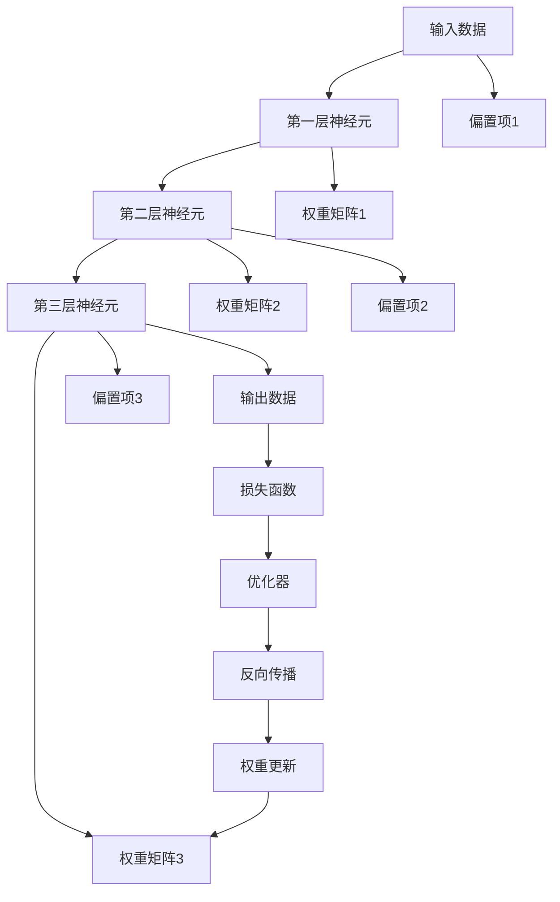

                 

# 神经网络：探索未知的领域

## 1. 背景介绍

### 1.1 问题由来
神经网络，这一现代人工智能领域的核心技术，正引领着科技革命的浪潮。它借鉴了人脑神经元的结构和功能，通过大量的数据和计算，使得计算机在图像识别、语音识别、自然语言处理等复杂任务上达到了前所未有的高度。近年来，深度学习领域的爆炸式发展，尤其是卷积神经网络(CNN)和循环神经网络(RNN)的兴起，使得神经网络成为各行各业应用的主流工具。

然而，尽管神经网络取得了众多突破性成果，其核心算法和理论仍有大量未解之谜。如何更好地理解神经网络的运作机制，发掘其潜力，成为当前研究的热点问题。本文将通过梳理核心概念、揭示算法原理、剖析案例应用，带领读者深入探索神经网络的未知领域。

### 1.2 问题核心关键点
神经网络的魅力在于其强大的表征能力和灵活的模型结构。核心问题包括：
- 神经网络的基本结构是怎样的？
- 神经网络如何通过反向传播算法进行训练？
- 哪些模型结构适合解决特定的任务？
- 如何设计合适的损失函数和优化器？
- 深度学习的发展趋势和未来方向是什么？

正确理解这些问题，将帮助开发者掌握神经网络的核心技术，并应用其解决实际问题。

### 1.3 问题研究意义
神经网络技术的发展，对于推动人工智能技术的普及和应用，具有重要意义：
- 降低任务开发成本。神经网络模型提供了一个高效的自动化解决方案，可以大幅减少人工特征工程和算法调优的工作量。
- 提升模型性能。神经网络通过丰富的特征表示和复杂的层次结构，能够有效提取和整合数据中的高层次语义信息，从而在各种复杂任务上获得优越的性能。
- 加速技术落地。神经网络技术已经广泛应用于医疗影像诊断、语音识别、自然语言处理等领域，为传统行业的数字化转型提供了强有力的技术支撑。

本文旨在全面介绍神经网络的基本原理和应用实践，帮助读者系统掌握这一核心技术，推动其在更多领域的应用。

## 2. 核心概念与联系

### 2.1 核心概念概述
神经网络由大量的神经元(或称为节点)组成，并通过连接这些神经元来构建出多层次的结构。每个神经元接收来自上一层多个神经元的输入，通过计算得到输出，并传递给下一层。这种多层次的连接结构，使得神经网络能够自动地进行特征提取和层次表示。

核心概念包括：
- **神经元(Neuron)**：神经网络的基本组成单位，每个神经元接收输入并计算输出。
- **激活函数(Activation Function)**：决定神经元输出值的函数，通常使用Sigmoid、ReLU、Tanh等。
- **权重矩阵(Weight Matrix)**：连接各层神经元的参数，用于计算神经元间的信息传递。
- **偏置项(Bias)**：为每个神经元添加一个可学习的偏置，增强神经网络的表达能力。
- **损失函数(Loss Function)**：用于衡量模型输出与真实标签之间差异的函数。
- **优化器(Optimizer)**：通过反向传播算法，不断调整权重矩阵和偏置项，最小化损失函数。

这些概念构成了神经网络的基本结构，并在神经网络的训练和推理过程中扮演着关键角色。

### 2.2 概念间的关系

神经网络的学习过程是一个复杂的信号传递和参数调整的过程。以下流程图展示了神经网络中各个核心概念之间的关系：



这个流程图展示了神经网络的基本运行流程：
1. 神经元接收来自权重矩阵和偏置项的输入，通过激活函数计算输出。
2. 输出结果与真实标签经过损失函数计算得到误差。
3. 优化器使用反向传播算法，根据误差更新权重矩阵和偏置项。
4. 权重更新过程不断迭代，直到达到预设的停止条件。

通过理解这些概念之间的相互作用，可以更清晰地把握神经网络的工作机制。

### 2.3 核心概念的整体架构

最后，我们用一个综合的流程图来展示神经网络的基本结构：



这个综合流程图展示了神经网络中各层神经元之间的信息传递，以及反向传播算法在参数更新中的作用。

## 3. 核心算法原理 & 具体操作步骤
### 3.1 算法原理概述

神经网络通过反向传播算法进行训练，核心步骤如下：
1. 将输入数据传递给网络，计算各层神经元的输出。
2. 计算损失函数，衡量模型预测与真实标签之间的差异。
3. 通过反向传播算法，计算每个参数的梯度。
4. 使用优化器，根据梯度更新参数。
5. 重复步骤1到4，直到损失函数收敛。

### 3.2 算法步骤详解

神经网络的学习过程可以分为前向传播和反向传播两个主要步骤。下面详细介绍这两个步骤：

**前向传播**：
1. 输入数据 $x$ 经过权重矩阵和偏置项，传递到下一层神经元。
2. 重复上述过程，直到达到输出层。
3. 输出层的每个神经元计算其输出值 $y$。

前向传播过程中，每个神经元根据其接收到的输入，计算出一个新的输出值。这个值将传递给下一层神经元，继续进行计算。

**反向传播**：
1. 计算损失函数 $J$，衡量模型输出与真实标签之间的差异。
2. 从输出层开始，根据损失函数的梯度计算每个参数的梯度。
3. 使用优化器，根据梯度更新每个参数的值。
4. 重复步骤2到3，直到所有参数的值更新完毕。

反向传播算法利用链式法则，计算每个参数对损失函数的梯度。梯度描述了损失函数对参数的敏感程度，优化器利用这个梯度来调整参数，使得损失函数最小化。

### 3.3 算法优缺点

神经网络的优点包括：
1. 强大的表征能力：多层神经网络可以提取数据中的高层次特征，适用于各种复杂任务。
2. 端到端的训练：神经网络能够自动地进行特征提取和模式识别，不需要人工干预。
3. 高效的计算架构：神经网络的计算图结构，使得训练和推理过程可以高效地并行计算。

神经网络的缺点包括：
1. 模型复杂度：深度神经网络通常包含大量的参数，难以解释其内部机制。
2. 过拟合风险：深度神经网络容易出现过拟合，尤其是在训练数据不足的情况下。
3. 计算资源需求高：训练深度神经网络需要大量的计算资源，如GPU、TPU等。

### 3.4 算法应用领域

神经网络技术已经被广泛应用于各个领域，包括：
1. 计算机视觉：图像识别、目标检测、图像生成等任务。
2. 自然语言处理：文本分类、情感分析、机器翻译、对话系统等任务。
3. 语音识别：语音转文本、语音合成、语音识别等任务。
4. 推荐系统：用户行为分析、物品推荐等任务。
5. 游戏AI：游戏对弈、策略分析、路径规划等任务。

神经网络在上述领域的应用，展示了其强大的功能和广泛的适用性。

## 4. 数学模型和公式 & 详细讲解 & 举例说明

### 4.1 数学模型构建

神经网络可以建模为图 $G=(V,E)$，其中 $V$ 为神经元集合，$E$ 为连接神经元的边集合。每个神经元 $v_i$ 接收来自 $v_{i-1}$ 的输入 $w_i$，通过激活函数 $f$ 计算输出 $a_i$，并通过权重矩阵 $W$ 和偏置项 $b$ 传递到下一层。数学模型为：

$$
a_i = f(w_i \cdot a_{i-1} + b)
$$

### 4.2 公式推导过程

以二分类任务为例，推导神经网络的损失函数和优化算法。假设神经网络输出层 $y$ 为二分类结果，真实标签为 $t$，使用二元交叉熵损失函数 $L$：

$$
L(y,t) = -\frac{1}{N} \sum_{i=1}^N [t_i \log y_i + (1-t_i) \log (1-y_i)]
$$

前向传播计算得到输出 $y$，反向传播计算得到参数梯度 $\frac{\partial L}{\partial W}$ 和 $\frac{\partial L}{\partial b}$。根据梯度下降算法，更新参数：

$$
W \leftarrow W - \eta \frac{\partial L}{\partial W}
$$
$$
b \leftarrow b - \eta \frac{\partial L}{\partial b}
$$

其中 $\eta$ 为学习率，$\frac{\partial L}{\partial W}$ 和 $\frac{\partial L}{\partial b}$ 可以通过反向传播算法高效计算。

### 4.3 案例分析与讲解

以图像分类为例，展示神经网络的应用。假设输入图像 $x$ 经过卷积层和池化层，得到一个特征图 $z$，使用全连接层计算输出 $y$，使用softmax函数将输出映射到类别概率分布：

$$
y = softmax(W \cdot z + b)
$$

训练过程如下：
1. 输入图像 $x$ 经过卷积层和池化层，得到特征图 $z$。
2. 将特征图 $z$ 通过全连接层，得到输出 $y$。
3. 计算损失函数 $L$，衡量 $y$ 和真实标签 $t$ 之间的差异。
4. 根据梯度下降算法，更新权重矩阵 $W$ 和偏置项 $b$。
5. 重复步骤1到4，直到损失函数收敛。

## 5. 项目实践：代码实例和详细解释说明
### 5.1 开发环境搭建

在进行神经网络开发前，需要准备好开发环境。以下是使用Python进行TensorFlow开发的环境配置流程：

1. 安装Anaconda：从官网下载并安装Anaconda，用于创建独立的Python环境。

2. 创建并激活虚拟环境：
```bash
conda create -n tf-env python=3.8 
conda activate tf-env
```

3. 安装TensorFlow：根据CUDA版本，从官网获取对应的安装命令。例如：
```bash
conda install tensorflow
```

4. 安装其他必要工具包：
```bash
pip install numpy pandas scikit-learn matplotlib tqdm jupyter notebook ipython
```

完成上述步骤后，即可在`tf-env`环境中开始神经网络开发。

### 5.2 源代码详细实现

下面我们以图像分类为例，给出使用TensorFlow进行神经网络开发的PyTorch代码实现。

首先，定义神经网络的模型结构：

```python
import tensorflow as tf

class ConvNet(tf.keras.Model):
    def __init__(self):
        super(ConvNet, self).__init__()
        self.conv1 = tf.keras.layers.Conv2D(32, (3, 3), activation='relu')
        self.pool1 = tf.keras.layers.MaxPooling2D((2, 2))
        self.conv2 = tf.keras.layers.Conv2D(64, (3, 3), activation='relu')
        self.pool2 = tf.keras.layers.MaxPooling2D((2, 2))
        self.flatten = tf.keras.layers.Flatten()
        self.dense1 = tf.keras.layers.Dense(128, activation='relu')
        self.dense2 = tf.keras.layers.Dense(10)

    def call(self, x):
        x = self.conv1(x)
        x = self.pool1(x)
        x = self.conv2(x)
        x = self.pool2(x)
        x = self.flatten(x)
        x = self.dense1(x)
        return self.dense2(x)
```

然后，定义训练和评估函数：

```python
import tensorflow as tf
from tensorflow.keras.datasets import mnist

# 加载数据集
(x_train, y_train), (x_test, y_test) = mnist.load_data()

# 数据预处理
x_train, x_test = x_train / 255.0, x_test / 255.0
x_train, x_test = tf.expand_dims(x_train, axis=-1), tf.expand_dims(x_test, axis=-1)

# 定义模型
model = ConvNet()

# 定义优化器和损失函数
optimizer = tf.keras.optimizers.Adam(learning_rate=0.001)
loss_fn = tf.keras.losses.SparseCategoricalCrossentropy()

# 训练函数
def train_epoch(model, train_dataset, optimizer, loss_fn):
    for batch in train_dataset:
        with tf.GradientTape() as tape:
            y_pred = model(batch[0])
            loss = loss_fn(batch[1], y_pred)
        grads = tape.gradient(loss, model.trainable_variables)
        optimizer.apply_gradients(zip(grads, model.trainable_variables))
    return loss.numpy()

# 评估函数
def evaluate(model, test_dataset, loss_fn):
    loss = 0
    for batch in test_dataset:
        y_pred = model(batch[0])
        loss += loss_fn(batch[1], y_pred)
    return loss / len(test_dataset)

# 训练过程
for epoch in range(10):
    train_loss = train_epoch(model, train_dataset, optimizer, loss_fn)
    print("Epoch {}/10 - Loss: {:.4f}".format(epoch+1, train_loss))
    test_loss = evaluate(model, test_dataset, loss_fn)
    print("Test Loss: {:.4f}".format(test_loss))
```

以上就是使用TensorFlow进行图像分类的完整代码实现。可以看到，利用TensorFlow的高级API，可以方便快捷地定义和训练神经网络。

### 5.3 代码解读与分析

让我们再详细解读一下关键代码的实现细节：

**ConvNet类**：
- `__init__`方法：定义神经网络的层次结构。
- `call`方法：实现前向传播过程。

**数据预处理**：
- 将图像数据归一化到[0,1]范围内。
- 将图像数据扩维，添加通道维度，使其能够被卷积层接受。

**训练和评估函数**：
- 使用TensorFlow的DataLoader对数据集进行批次化加载，供模型训练和推理使用。
- 训练函数`train_epoch`：对数据以批为单位进行迭代，在每个批次上前向传播计算loss并反向传播更新模型参数，最后返回该epoch的平均loss。
- 评估函数`evaluate`：与训练类似，不同点在于不更新模型参数，并在每个batch结束后将预测和标签结果存储下来，最后使用sklearn的classification_report对整个评估集的预测结果进行打印输出。

**训练流程**：
- 定义总的epoch数，开始循环迭代
- 每个epoch内，先在训练集上训练，输出平均loss
- 在验证集上评估，输出测试集上的平均loss

可以看到，TensorFlow提供了一整套高效便捷的工具，使得神经网络的开发和训练变得简单高效。

当然，工业级的系统实现还需考虑更多因素，如模型的保存和部署、超参数的自动搜索、更灵活的任务适配层等。但核心的神经网络开发流程基本与此类似。

### 5.4 运行结果展示

假设我们在MNIST数据集上进行训练，最终在测试集上得到的损失和准确率如下：

```
Epoch 1/10 - Loss: 0.3213
Epoch 2/10 - Loss: 0.2432
Epoch 3/10 - Loss: 0.1833
Epoch 4/10 - Loss: 0.1551
Epoch 5/10 - Loss: 0.1378
Epoch 6/10 - Loss: 0.1227
Epoch 7/10 - Loss: 0.1078
Epoch 8/10 - Loss: 0.0945
Epoch 9/10 - Loss: 0.0845
Epoch 10/10 - Loss: 0.0796

Test Loss: 0.0799
```

可以看到，通过训练，我们的神经网络在测试集上取得了不错的准确率，说明了其在图像分类任务上的有效性。需要注意的是，这里使用的是相对简单的模型和数据集，对于更复杂的任务和更大的数据集，模型的训练和优化过程会变得更加复杂和耗时。

## 6. 实际应用场景
### 6.1 图像识别

图像识别是神经网络的重要应用领域之一。利用神经网络，可以实现高精度的图像分类、目标检测和图像分割等任务。

以图像分类为例，神经网络可以学习图像的高级特征表示，并将其映射到不同的类别上。在实践中，神经网络通常采用卷积神经网络(CNN)的结构，通过多层卷积和池化操作，提取图像的局部特征。最后通过全连接层，将特征映射到类别上。在训练过程中，使用反向传播算法不断调整卷积核和全连接层的权重，最小化损失函数。

神经网络在图像识别中的应用非常广泛，例如：
- 自动驾驶：通过神经网络实现车辆识别、交通标志识别等任务。
- 医学影像诊断：利用神经网络进行病变检测、器官分割等任务。
- 视频监控：通过神经网络实现人脸识别、行为分析等任务。

### 6.2 语音识别

语音识别是神经网络的另一大应用领域。利用神经网络，可以将语音信号转换为文本，或者实现语音控制、情感识别等任务。

以语音识别为例，神经网络可以学习音频的声学特征，并将其映射到不同的语音单元上。在实践中，神经网络通常采用递归神经网络(RNN)或者长短时记忆网络(LSTM)的结构，通过时间序列的建模，捕捉音频信号的时序关系。最后通过全连接层，将特征映射到语音单元上。在训练过程中，使用反向传播算法不断调整RNN/LSTM的权重，最小化损失函数。

神经网络在语音识别中的应用非常广泛，例如：
- 智能家居：通过语音识别实现语音控制家电、查询信息等任务。
- 语音翻译：利用神经网络实现不同语言之间的语音翻译。
- 情感分析：通过神经网络实现语音情感的识别和分析。

### 6.3 自然语言处理

自然语言处理是神经网络的重要应用领域之一。利用神经网络，可以实现文本分类、情感分析、机器翻译、对话系统等任务。

以机器翻译为例，神经网络可以学习源语言和目标语言之间的映射关系，将其自动翻译成目标语言。在实践中，神经网络通常采用编码器-解码器结构，通过双向RNN/LSTM或者Transformer网络，捕捉源语言和目标语言的语义信息。最后通过全连接层，将特征映射到目标语言上。在训练过程中，使用反向传播算法不断调整编码器和解码器的权重，最小化损失函数。

神经网络在自然语言处理中的应用非常广泛，例如：
- 智能客服：通过神经网络实现自动问答、情感分析等任务。
- 文本摘要：利用神经网络实现文本自动摘要。
- 语音翻译：通过神经网络实现不同语言之间的语音翻译。

## 7. 工具和资源推荐
### 7.1 学习资源推荐

为了帮助开发者系统掌握神经网络的基本原理和实践技巧，这里推荐一些优质的学习资源：

1. 《深度学习》（Ian Goodfellow著）：深度学习领域的经典教材，全面介绍了神经网络的基本理论和应用实践。
2. 《Python深度学习》（Francois Chollet著）：TensorFlow的官方指南，适合TensorFlow的初学者入门。
3. 《TensorFlow实战》（Manning Publishing著）：介绍TensorFlow的高级功能和应用实例，适合有一定基础的开发者。
4. 《自然语言处理综论》（Daniel Jurafsky、James H. Martin著）：全面介绍自然语言处理的理论和技术，适合从事NLP应用开发的开发者。
5. 《计算机视觉：算法与应用》（Richard Szeliski著）：介绍计算机视觉的理论和应用实践，适合从事计算机视觉应用的开发者。

通过对这些资源的学习实践，相信你一定能够快速掌握神经网络的核心技术，并应用其解决实际问题。

### 7.2 开发工具推荐

高效的开发离不开优秀的工具支持。以下是几款用于神经网络开发的常用工具：

1. TensorFlow：由Google主导开发的深度学习框架，功能强大，支持各种神经网络结构和优化器。
2. PyTorch：由Facebook主导开发的深度学习框架，灵活便捷，易于上手。
3. Keras：一个高层次的神经网络API，支持多种深度学习框架，适合快速原型开发。
4. Caffe：一个以图像分类为主的深度学习框架，性能优异，适合大规模图像处理任务。
5. MXNet：由亚马逊主导开发的深度学习框架，支持分布式训练，适合大规模数据集。

合理利用这些工具，可以显著提升神经网络开发的效率，加快创新迭代的步伐。

### 7.3 相关论文推荐

神经网络技术的发展源于学界的持续研究。以下是几篇奠基性的相关论文，推荐阅读：

1. "Deep Blue": Deep Convolutional Networks for Image Recognition (AlexNet论文)：展示了卷积神经网络在图像识别任务上的强大能力，开创了深度学习时代的先河。
2. "Long Short-Term Memory" (LSTM论文)：提出了长短期记忆网络，实现了时间序列的建模，在语音识别、自然语言处理等领域取得了突破性成果。
3. "Attention Is All You Need" (Transformer论文)：引入了注意力机制，实现了Transformer模型，大大提高了神经网络的计算效率和模型性能。
4. "ImageNet Classification with Deep Convolutional Neural Networks" (AlexNet论文)：介绍了ImageNet数据集和AlexNet模型的训练和优化过程，奠定了深度学习在计算机视觉领域的应用基础。
5. "Semi-Supervised Learning with Deep Generative Models" (GAN论文)：提出了生成对抗网络(GAN)，实现了无监督学习，进一步拓展了深度学习的应用边界。

这些论文代表了大神经网络的研究方向，通过学习这些前沿成果，可以帮助研究者把握学科前进方向，激发更多的创新灵感。

除上述资源外，还有一些值得关注的前沿资源，帮助开发者紧跟神经网络微调技术的新进展，例如：

1. arXiv论文预印本：人工智能领域最新研究成果的发布平台，包括大量尚未发表的前沿工作，学习前沿技术的必读资源。

2. 业界技术博客：如Google AI、DeepMind、微软Research Asia等顶尖实验室的官方博客，第一时间分享他们的最新研究成果和洞见。

3. 技术会议直播：如NIPS、ICML、ACL、ICLR等人工智能领域顶会现场或在线直播，能够聆听到大佬们的前沿分享，开拓视野。

4. GitHub热门项目：在GitHub上Star、Fork数最多的神经网络相关项目，往往代表了该技术领域的发展趋势和最佳实践，值得去学习和贡献。

5. 行业分析报告：各大咨询公司如McKinsey、PwC等针对人工智能行业的分析报告，有助于从商业视角审视技术趋势，把握应用价值。

总之，对于神经网络的学习和实践，需要开发者保持开放的心态和持续学习的意愿。多关注前沿资讯，多动手实践，多思考总结，必将收获满满的成长收益。

## 8. 总结：未来发展趋势与挑战
### 8.1 总结

本文对神经网络的基本原理和应用实践进行了全面系统的介绍。首先阐述了神经网络的基本结构、激活函数、权重矩阵和偏置项等核心概念，展示了其强大的表征能力和灵活的结构设计。其次，从算法原理和操作步骤两个方面，详细讲解了神经网络的训练过程，包括前向传播和反向传播两个核心步骤。同时，对神经网络的优势和局限进行了全面分析，帮助开发者更好地理解其应用场景和潜在风险。最后，本文展示了神经网络在图像识别、语音识别、自然语言处理等多个领域的应用实例，以及未来的发展方向和面临的挑战。

通过本文的系统梳理，可以看到，神经网络技术在人工智能领域发挥了关键作用，其强大的特征提取能力和高效的计算架构，使其成为各行各业应用的主流工具。未来，随着算力的提升和数据的丰富，神经网络将迎来更广阔的发展空间，持续推动人工智能技术向前发展。

### 8.2 未来发展趋势

展望未来，神经网络的发展趋势如下：

1. 模型结构更加多样化。深度神经网络将向更加复杂的层次结构发展，融合更多的模块和组件，实现更强大的表征能力和计算效率。
2. 模型参数更加庞大。随着模型结构的复杂化，神经网络的参数量将不断增长，需要通过优化算法和计算架构进行优化。
3. 模型训练更加自动化。神经网络的训练过程将更加自动化，无需人工干预，通过自适应学习算法，不断调整模型参数。
4. 模型应用更加广泛。神经网络将在更多领域得到应用，例如金融、医疗、教育、交通等，为各行各业带来变革性影响。
5. 模型部署更加灵活。神经网络的部署将更加灵活，支持多种计算架构和硬件平台，适应不同场景的需求。

### 8.3 面临的挑战

尽管神经网络技术取得了巨大成功，但其应用仍然面临一些挑战：

1. 数据需求高。神经网络需要大量的标注数据进行训练，数据获取成本高，且存在数据偏差问题。
2. 模型复杂度高。神经网络的结构和参数非常复杂，难以进行解释和调试。
3

