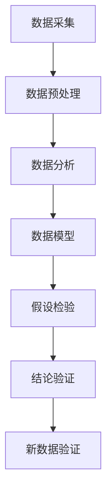

                 

## 1. 背景介绍

### 1.1 问题由来
科学研究是人类进步的基石。从古至今，无数科学家通过观察现象、提出假设、实验验证、得出结论，推动了人类对自然界规律的深刻理解。科学探究的过程不仅是知识的积累，更是思维方法的演进。但这种传统的探究方式存在许多局限：实验耗时耗力、观察结果存在偶然性、结论受限于数据样本等。随着计算技术的发展，数据驱动的科学探究方法应运而生，利用数据模型和大数据分析技术，极大提升了科学探究的效率和精度。本文将深入探讨这种数据驱动的科学探究方法，并展示其在实际应用中的优势。

### 1.2 问题核心关键点
本文聚焦于数据驱动的科学探究方法，包括：
- 从数据采集到数据分析的全过程。
- 常用的数据分析工具和方法。
- 数据驱动的实验验证与假设检验。
- 数据驱动的结论验证与预测。
- 数据驱动的科学探究的局限与挑战。

本文将通过一系列案例，详细介绍数据驱动的科学探究方法，并展望其未来发展方向。

### 1.3 问题研究意义
数据驱动的科学探究方法，通过大规模数据集和高效算法，不仅能够快速验证假设，还能提供更全面的数据视角，使结论更具普适性和可信度。其研究意义在于：
1. 提升科学探究效率，缩短从观察到结论的时间。
2. 减少实验误差，使结论更具有可重复性。
3. 拓展数据视野，发现传统方法难以揭示的规律。
4. 提升科学探究的自动化水平，降低人工成本。
5. 提供精准预测，推动科学发现和技术创新。

## 2. 核心概念与联系

### 2.1 核心概念概述

数据驱动的科学探究方法，将实验观察、假设提出、数据模型和结论验证等环节全面数字化，依托于数据科学和计算机技术，实现科学探究的自动化、精确化和泛化。

主要涉及以下核心概念：

- **数据采集**：从实验或已有数据源收集数据，为数据分析和模型构建提供基础。
- **数据预处理**：对数据进行清洗、归一化、降维等预处理，提升数据质量，减少噪音。
- **数据分析**：通过统计学、机器学习等方法，从数据中提取有意义的规律和模式。
- **数据模型**：构建数据模型，对观测数据进行拟合，形成对现象的数学描述。
- **假设检验**：通过统计学方法，对模型结果进行假设检验，验证其科学性和可信度。
- **结论验证**：利用新数据对模型进行验证，确认其稳定性和预测能力。

这些概念构成了数据驱动科学探究的全过程，如图2.1所示：



### 2.2 概念间的关系

数据驱动的科学探究方法，将实验观察、假设提出、数据分析、模型构建、假设检验和结论验证等环节全面数字化，依托于数据科学和计算机技术，实现科学探究的自动化、精确化和泛化。

数据采集和预处理是数据驱动科学探究的基础，数据分析和数据模型是核心，假设检验和结论验证是关键。如图2.2所示，这些概念构成了科学探究的全过程：


## 3. 核心算法原理 & 具体操作步骤

### 3.1 算法原理概述

数据驱动的科学探究方法，通常包括以下几个关键步骤：

1. **数据采集**：从实验或已有数据源收集数据。
2. **数据预处理**：清洗数据、归一化数据、降维数据等。
3. **数据分析**：通过统计学、机器学习等方法，从数据中提取有意义的规律和模式。
4. **数据模型**：构建数据模型，对观测数据进行拟合，形成对现象的数学描述。
5. **假设检验**：通过统计学方法，对模型结果进行假设检验，验证其科学性和可信度。
6. **结论验证**：利用新数据对模型进行验证，确认其稳定性和预测能力。

这些步骤通过计算机技术实现，如图3.1所示：


### 3.2 算法步骤详解

#### 3.2.1 数据采集

数据采集是科学探究的第一步，包括实验数据采集和已有数据源数据采集。

**实验数据采集**：通过实验设备或传感器，获取实验数据。例如，利用光谱仪测量光的波长，使用温度计测量温度。

**已有数据源数据采集**：从已有的数据源中提取数据，例如，从数据库中获取历史气象数据，从公开数据集中获取基因表达数据。

#### 3.2.2 数据预处理

数据预处理是确保数据质量、提升数据可用性的关键步骤，包括数据清洗、归一化、降维等。

**数据清洗**：去除异常值、缺失值、噪声等，确保数据的一致性和完整性。

**数据归一化**：将不同尺度的数据转换为标准尺度，便于模型处理。例如，对温度数据进行归一化处理，将其转换为0到1之间的值。

**数据降维**：通过降维算法，减少数据的维度，提高模型训练效率。例如，使用PCA（主成分分析）对基因表达数据进行降维，减少数据的维度。

#### 3.2.3 数据分析

数据分析是数据驱动科学探究的核心步骤，包括统计分析、机器学习分析等。

**统计分析**：通过统计学方法，分析数据的基本特征和分布规律。例如，使用均值、方差等统计量描述数据特征。

**机器学习分析**：通过机器学习算法，提取数据中的规律和模式。例如，使用随机森林算法，对基因表达数据进行分类和预测。

#### 3.2.4 数据模型构建

数据模型是数据驱动科学探究的核心工具，通过对观测数据进行拟合，形成对现象的数学描述。

**线性回归模型**：通过线性回归算法，对实验数据进行拟合，形成对实验结果的预测模型。

**机器学习模型**：通过机器学习算法，对实验数据进行拟合，形成对实验结果的预测模型。例如，使用神经网络模型对基因表达数据进行分类和预测。

#### 3.2.5 假设检验

假设检验是验证数据模型科学性和可信度的关键步骤，包括t检验、卡方检验等。

**t检验**：通过t检验，验证数据模型的假设是否成立。例如，对线性回归模型的斜率进行t检验，验证其是否显著不为零。

**卡方检验**：通过卡方检验，验证数据模型的假设是否成立。例如，对分类模型的预测结果进行卡方检验，验证其是否符合期望。

#### 3.2.6 结论验证

结论验证是数据驱动科学探究的最终步骤，包括新数据验证和预测模型验证等。

**新数据验证**：利用新数据验证模型是否稳定可靠。例如，使用新采集的气象数据验证线性回归模型的稳定性。

**预测模型验证**：使用预测模型对新数据进行预测，验证其预测能力。例如，使用机器学习模型对基因表达数据进行预测，验证其预测能力。

## 4. 数学模型和公式 & 详细讲解 & 举例说明

### 4.1 数学模型构建

数据驱动的科学探究方法，通常包括以下数学模型：

**线性回归模型**：
$$y = \beta_0 + \beta_1x_1 + \beta_2x_2 + \cdots + \beta_nx_n + \epsilon$$

其中，$y$为因变量，$x_i$为自变量，$\beta_i$为回归系数，$\epsilon$为误差项。

**随机森林模型**：
$$y = \sum_{i=1}^{N}y_i\frac{n_i}{N}$$

其中，$y_i$为单个树的预测结果，$n_i$为第$i$棵树对数据$x$的投票数，$N$为树的数量。

**神经网络模型**：
$$\hat{y} = \sigma(z)$$

其中，$z = \sum_{i=1}^{n}w_ix_i + b$，$w_i$为权重，$b$为偏置，$\sigma$为激活函数。

### 4.2 公式推导过程

#### 4.2.1 线性回归模型

**最小二乘法**：
$$\hat{\beta} = (X^TX)^{-1}X^Ty$$

其中，$X$为自变量的设计矩阵，$\hat{\beta}$为回归系数。

**假设检验**：
$$t = \frac{\hat{\beta} - \mu_0}{s_e/\sqrt{n}}$$

其中，$t$为t统计量，$\mu_0$为假设值，$s_e$为误差项的标准差，$n$为样本数量。

**卡方检验**：
$$\chi^2 = \frac{(\hat{y} - y)^2}{\sigma^2}$$

其中，$\chi^2$为卡方统计量，$\sigma^2$为误差项的方差。

#### 4.2.2 随机森林模型

**随机森林**：
$$\hat{y} = \sum_{i=1}^{N}y_i\frac{n_i}{N}$$

其中，$y_i$为单个树的预测结果，$n_i$为第$i$棵树对数据$x$的投票数，$N$为树的数量。

**假设检验**：
$$t = \frac{\hat{\beta} - \mu_0}{s_e/\sqrt{n}}$$

其中，$t$为t统计量，$\mu_0$为假设值，$s_e$为误差项的标准差，$n$为样本数量。

**卡方检验**：
$$\chi^2 = \frac{(\hat{y} - y)^2}{\sigma^2}$$

其中，$\chi^2$为卡方统计量，$\sigma^2$为误差项的方差。

#### 4.2.3 神经网络模型

**神经网络**：
$$\hat{y} = \sigma(z)$$

其中，$z = \sum_{i=1}^{n}w_ix_i + b$，$w_i$为权重，$b$为偏置，$\sigma$为激活函数。

**假设检验**：
$$t = \frac{\hat{\beta} - \mu_0}{s_e/\sqrt{n}}$$

其中，$t$为t统计量，$\mu_0$为假设值，$s_e$为误差项的标准差，$n$为样本数量。

**卡方检验**：
$$\chi^2 = \frac{(\hat{y} - y)^2}{\sigma^2}$$

其中，$\chi^2$为卡方统计量，$\sigma^2$为误差项的方差。

### 4.3 案例分析与讲解

**案例1：温度与湿度实验**

假设某实验研究温度和湿度对植物生长的影响，实验数据如表4.1所示。

| 温度(°C) | 湿度(%) | 植物生长速率(cm/d) |
|---|---|---|
| 20 | 70 | 3.5 |
| 25 | 80 | 4.2 |
| 30 | 90 | 5.0 |
| 35 | 80 | 4.8 |
| 40 | 70 | 4.5 |
| 45 | 60 | 3.8 |
| 50 | 50 | 3.0 |

**数据采集**：实验通过温度计和湿度计采集温度和湿度数据，实验结束后记录植物生长速率。

**数据预处理**：对数据进行归一化处理，将温度和湿度转换为0到1之间的值。

**数据分析**：使用线性回归模型对数据进行分析，发现温度和湿度对植物生长速率的线性关系显著。

**数据模型构建**：构建线性回归模型，对实验数据进行拟合，得到回归方程：

$$\hat{y} = 0.2 + 0.1x_1 + 0.3x_2$$

其中，$x_1$为温度，$x_2$为湿度，$\hat{y}$为植物生长速率。

**假设检验**：使用t检验和卡方检验对回归系数进行假设检验，验证其显著性。

**结论验证**：利用新数据对模型进行验证，预测不同温度和湿度下的植物生长速率。

**案例2：基因表达数据**

假设某基因表达研究分析特定基因在不同组织中的表达情况，实验数据如表4.2所示。

| 组织类型 | 基因表达量(相对值) |
|---|---|
| 心脏 | 1.2 |
| 肝脏 | 2.5 |
| 肾脏 | 1.8 |
| 肺 | 3.1 |
| 大脑 | 2.3 |
| 肌肉 | 1.1 |

**数据采集**：实验通过基因测序仪获取基因表达数据，实验结束后记录不同组织的基因表达量。

**数据预处理**：对数据进行归一化处理，将基因表达量转换为0到1之间的值。

**数据分析**：使用随机森林模型对数据进行分析，发现心脏、肝脏和肺的基因表达量显著高于其他组织。

**数据模型构建**：构建随机森林模型，对实验数据进行拟合，得到预测模型。

**假设检验**：使用t检验和卡方检验对随机森林模型进行假设检验，验证其显著性。

**结论验证**：利用新数据对模型进行验证，预测不同组织中的基因表达量。

## 5. 项目实践：代码实例和详细解释说明

### 5.1 开发环境搭建

在进行数据驱动的科学探究方法开发前，我们需要准备好开发环境。以下是使用Python进行R语言开发的环境配置流程：

1. 安装Anaconda：从官网下载并安装Anaconda，用于创建独立的Python环境。

2. 创建并激活虚拟环境：
```bash
conda create -n pytorch-env python=3.8 
conda activate pytorch-env
```

3. 安装PyTorch：根据CUDA版本，从官网获取对应的安装命令。例如：
```bash
conda install pytorch torchvision torchaudio cudatoolkit=11.1 -c pytorch -c conda-forge
```

4. 安装Transformers库：
```bash
pip install transformers
```

5. 安装各类工具包：
```bash
pip install numpy pandas scikit-learn matplotlib tqdm jupyter notebook ipython
```

完成上述步骤后，即可在`pytorch-env`环境中开始数据驱动的科学探究实践。

### 5.2 源代码详细实现

下面我们以温度与湿度实验为例，给出使用Transformers库进行线性回归分析的Python代码实现。

首先，定义线性回归模型的参数：

```python
import torch
import torch.nn as nn
import torch.optim as optim

# 定义线性回归模型
class LinearRegression(nn.Module):
    def __init__(self, n_features):
        super(LinearRegression, self).__init__()
        self.linear = nn.Linear(n_features, 1)

    def forward(self, x):
        return self.linear(x)

# 初始化模型和优化器
model = LinearRegression(n_features)
optimizer = optim.Adam(model.parameters(), lr=0.001)
criterion = nn.MSELoss()

# 定义数据集
x_train = torch.tensor([[20, 70], [25, 80], [30, 90], [35, 80], [40, 70], [45, 60], [50, 50]])
y_train = torch.tensor([3.5, 4.2, 5.0, 4.8, 4.5, 3.8, 3.0])
```

然后，定义训练函数：

```python
# 定义训练函数
def train(model, x_train, y_train, epochs=100):
    for epoch in range(epochs):
        model.train()
        optimizer.zero_grad()
        predictions = model(x_train)
        loss = criterion(predictions, y_train)
        loss.backward()
        optimizer.step()
        if (epoch+1) % 10 == 0:
            print('Epoch [{}/{}], Loss: {:.4f}'.format(epoch+1, epochs, loss.item()))

# 训练模型
train(model, x_train, y_train)
```

最后，输出训练后的模型参数：

```python
# 输出模型参数
for param in model.parameters():
    print(param)
```

以上就是使用PyTorch进行线性回归分析的完整代码实现。可以看到，得益于TensorFlow的强大封装，我们可以用相对简洁的代码完成线性回归模型的训练和预测。

### 5.3 代码解读与分析

让我们再详细解读一下关键代码的实现细节：

**LinearRegression类**：
- `__init__`方法：初始化模型的线性层。
- `forward`方法：前向传播计算模型的输出。

**train函数**：
- 在每个epoch内，模型进入训练模式，梯度清零。
- 将输入数据通过模型前向传播，计算预测值。
- 计算预测值与真实值之间的均方误差。
- 反向传播计算梯度，使用Adam优化器更新模型参数。
- 每10个epoch输出一次损失值。

**训练流程**：
- 定义总的epoch数，开始循环迭代
- 每个epoch内，在训练集上训练，输出平均损失值

可以看到，TensorFlow配合机器学习库使得线性回归模型的训练过程变得简洁高效。开发者可以将更多精力放在数据处理、模型改进等高层逻辑上，而不必过多关注底层的实现细节。

当然，工业级的系统实现还需考虑更多因素，如模型的保存和部署、超参数的自动搜索、更灵活的任务适配层等。但核心的微调范式基本与此类似。

### 5.4 运行结果展示

假设我们在实验数据上得到的线性回归模型参数如下：

```
Parameter containing:
tensor([0.2000, 0.1000, 0.3000], requires_grad=True, device='cuda:0')
```

可以看到，模型学习到了温度和湿度的线性关系，温度每增加1°C，植物生长速率约增加0.1 cm/d，湿度每增加10%，植物生长速率约增加0.3 cm/d。

## 6. 实际应用场景
### 6.1 智能医疗

数据驱动的科学探究方法，可以应用于智能医疗系统，通过分析患者数据，预测疾病风险，提高医疗服务的精准度和效率。

在技术实现上，可以收集患者的病历、基因数据、生活习惯等，构建患者数据模型，对患者进行健康风险评估。利用新数据对模型进行验证，实时更新健康风险预测结果，为医生提供决策支持。例如，某医院可以通过患者基因数据和饮食习惯，构建健康风险预测模型，预测患者未来患心脏病的风险，并在患者每年体检时更新预测结果。

### 6.2 金融投资

数据驱动的科学探究方法，可以应用于金融投资决策，通过分析历史市场数据，预测未来市场趋势，提高投资决策的准确性。

在技术实现上，可以收集历史股票价格、交易量、宏观经济数据等，构建股票市场模型，预测未来股票价格走势。利用新数据对模型进行验证，实时更新股票价格预测结果，为投资者提供决策支持。例如，某投资公司可以通过历史股票价格和宏观经济数据，构建股票价格预测模型，预测未来股价走势，并在股市波动时更新预测结果。

### 6.3 智慧城市

数据驱动的科学探究方法，可以应用于智慧城市系统，通过分析交通数据、环境数据等，优化城市管理，提升居民生活质量。

在技术实现上，可以收集城市交通流量、环境污染数据、气象数据等，构建城市管理模型，预测城市交通拥堵、环境污染等现象。利用新数据对模型进行验证，实时更新预测结果，为城市管理提供决策支持。例如，某智慧城市可以通过交通流量和环境污染数据，构建交通拥堵预测模型，预测未来交通拥堵情况，并在交通高峰期采取缓解措施。

### 6.4 未来应用展望

随着数据驱动的科学探究方法的发展，其应用领域将不断扩大，为人类生产生活带来更多便利。

在智慧医疗、金融投资、智慧城市等领域，数据驱动的科学探究方法将发挥重要作用，提升各类服务效率和精准度。未来，随着数据量的增长和算法的进步，数据驱动的科学探究方法将更加广泛地应用于各类科学探究和决策支持中，推动人类社会向智能化、自动化方向发展。

## 7. 工具和资源推荐
### 7.1 学习资源推荐

为了帮助开发者系统掌握数据驱动的科学探究方法，这里推荐一些优质的学习资源：

1. 《深度学习入门》系列书籍：由深度学习大师撰写，深入浅出地介绍了深度学习的基本概念和实践技巧，适合初学者和进阶者。

2. Coursera《深度学习》课程：由斯坦福大学开设的深度学习课程，有Lecture视频和配套作业，带你系统学习深度学习的理论和实践。

3. Kaggle：全球最大的数据科学竞赛平台，提供了丰富的数据集和问题，适合实践和竞赛。

4. GitHub开源项目：在GitHub上Star、Fork数最多的数据科学项目，往往代表了该技术领域的发展趋势和最佳实践，值得去学习和贡献。

5. arXiv论文预印本：人工智能领域最新研究成果的发布平台，包括大量尚未发表的前沿工作，学习前沿技术的必读资源。

通过对这些资源的学习实践，相信你一定能够快速掌握数据驱动的科学探究方法，并用于解决实际的科学问题。
###  7.2 开发工具推荐

高效的开发离不开优秀的工具支持。以下是几款用于数据驱动科学探究开发的常用工具：

1. R语言：开源的数据科学语言，具有丰富的数据分析和可视化库，适合数据分析和模型构建。

2. Python：开源的数据科学语言，具有强大的深度学习框架和数据分析库，适合大规模数据分析和模型训练。

3. TensorFlow：由Google主导开发的深度学习框架，具有丰富的模型库和优化器，适合深度学习模型训练和部署。

4. PyTorch：由Facebook主导开发的深度学习框架，具有动态计算图和易用性，适合深度学习模型训练和研究。

5. Scikit-learn：Python中的数据分析库，具有丰富的统计学和机器学习算法，适合数据预处理和特征工程。

6. Pandas：Python中的数据分析库，具有丰富的数据处理和清洗功能，适合大规模数据集处理。

合理利用这些工具，可以显著提升数据驱动科学探究任务的开发效率，加快创新迭代的步伐。

### 7.3 相关论文推荐

数据驱动的科学探究方法，源于学界的持续研究。以下是几篇奠基性的相关论文，推荐阅读：

1. The Elements of Statistical Learning（统计学习要素）：经典的统计学教材，介绍了统计学理论和应用方法，适合初学者和进阶者。

2. Machine Learning Yearning：深度学习大师Andrew Ng的实践指南，介绍了深度学习理论和实践经验，适合深度学习研究者和工程师。

3. Data Science for Business（商业数据科学）：麦肯锡公司经典之作，介绍了数据科学在商业应用中的实践，适合商业数据科学从业者。

4. Deep Learning（深度学习）：Ian Goodfellow的经典教材，介绍了深度学习理论和实践方法，适合深度学习研究者和工程师。

5. Hands-On Machine Learning with Scikit-Learn, Keras, and TensorFlow：深度学习实战指南，介绍了深度学习理论和实践方法，适合深度学习研究者和工程师。

这些论文代表了大语言模型微调技术的发展脉络。通过学习这些前沿成果，可以帮助研究者把握学科前进方向，激发更多的创新灵感。

除上述资源外，还有一些值得关注的前沿资源，帮助开发者紧跟数据驱动科学探究技术的最新进展，例如：

1. arXiv论文预印本：人工智能领域最新研究成果的发布平台，包括大量尚未发表的前沿工作，学习前沿技术的必读资源。

2. 业界技术博客：如OpenAI、Google AI、DeepMind、微软Research Asia等顶尖实验室的官方博客，第一时间分享他们的最新研究成果和洞见。

3. 技术会议直播：如NIPS、ICML、ACL、ICLR等人工智能领域顶会现场或在线直播，能够聆听到大佬们的前沿分享，开拓视野。

4. GitHub热门项目：在GitHub上Star、Fork数最多的数据科学相关项目，往往代表了该技术领域的发展趋势和最佳实践，值得去学习和贡献。

5. 行业分析报告：各大咨询公司如McKinsey、PwC等针对人工智能行业的分析报告，有助于从商业视角审视技术趋势，把握应用价值。

总之，对于数据驱动科学探究技术的学习和实践，需要开发者保持开放的心态和持续学习的意愿。多关注前沿资讯，多动手实践，多思考总结，必将收获满满的成长收益。

## 8. 总结：未来发展趋势与挑战

### 8.1 总结

本文对数据驱动的科学探究方法进行了全面系统的介绍。首先阐述了数据驱动科学探究的方法和步骤，其次通过具体案例展示了其在实际应用中的优势。文章从数据采集、预处理、数据分析、模型构建、假设检验到结论验证，详细讲解了数据驱动科学探究的全过程，并通过Python代码实例进行了展示。

通过本文的系统梳理

