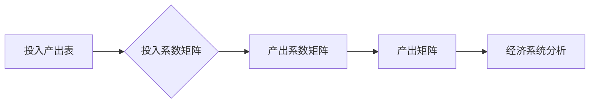

> 关键词：矩阵理论，Leontief模型，线性代数，投入产出分析，经济模型，闭式模型，系统动力学

# 矩阵理论与应用：闭式Leontief模型

> 矩阵理论与应用是现代科学研究和工程实践中的重要工具，其广泛的应用领域涵盖了物理学、经济学、计算机科学等。本文将探讨闭式Leontief模型，这是一种基于矩阵理论的经济学模型，用于分析经济系统中各部门之间的投入产出关系。我们将深入探讨其原理、应用，并通过实际案例进行分析。

## 1. 背景介绍
### 1.1 问题的由来
投入产出分析是经济学研究中的一个重要工具，它用于分析经济系统内部各部分之间的相互依赖关系。Leontief模型是由Wassily Leontief提出的，它基于投入产出分析的概念，通过矩阵理论来描述经济系统内部各部门之间的相互关系。

### 1.2 研究现状
Leontief模型在经济学、管理学和系统动力学等领域有着广泛的应用。随着计算能力的提升和数学工具的发展，Leontief模型得到了进一步的完善和扩展。

### 1.3 研究意义
Leontief模型有助于我们理解经济系统的复杂性和动态性，对于制定经济政策、优化资源配置、预测经济趋势等方面具有重要意义。

### 1.4 本文结构
本文将首先介绍Leontief模型的核心概念和理论，然后通过数学模型和公式进行详细讲解，接着通过实际案例进行分析，最后探讨Leontief模型的应用领域和未来发展趋势。

## 2. 核心概念与联系
### 2.1 核心概念
Leontief模型的核心概念包括：

- 投入产出表：描述经济系统中各部门之间的投入和产出的关系。
- 投入系数：表示一个部门在单位产出中所消耗的另一部门的产出比例。
- 产出系数：表示一个部门在单位产出中所贡献的各部门的产出比例。

### 2.2 理论联系
Leontief模型的理论基础是线性代数，特别是矩阵理论。模型中使用的矩阵包括：

- 投入矩阵 $A$：表示各部门之间的投入关系。
- 产出矩阵 $X$：表示各部门的产出。
- 投入产出系数矩阵 $E$：表示各部门之间的投入产出关系。

### 2.3 Mermaid流程图


## 3. 核心算法原理 & 具体操作步骤
### 3.1 算法原理概述
Leontief模型通过求解线性方程组来分析经济系统中各部门之间的关系。

### 3.2 算法步骤详解
1. 构建投入产出表，确定各部门之间的投入和产出关系。
2. 计算投入系数矩阵和产出系数矩阵。
3. 解线性方程组 $AX = X$ 来求解经济系统的稳定状态。

### 3.3 算法优缺点
- 优点：能够直观地描述经济系统中各部门之间的依赖关系，便于分析和预测。
- 缺点：假设条件较为严格，可能无法完全反映现实经济的复杂性。

### 3.4 算法应用领域
Leontief模型广泛应用于：

- 经济预测
- 资源配置优化
- 经济政策分析
- 企业战略规划

## 4. 数学模型和公式 & 详细讲解 & 举例说明
### 4.1 数学模型构建
Leontief模型的数学模型可以表示为：

$$
AX = X
$$

其中，$A$ 是投入系数矩阵，$X$ 是产出矩阵。

### 4.2 公式推导过程
Leontief模型的公式推导基于以下假设：

- 经济系统处于稳定状态。
- 各部门的产出是相互独立的。
- 各部门的投入产出关系是线性的。

### 4.3 案例分析与讲解
假设一个简单的经济系统由三个部门组成：农业、制造业和建筑业。下面是投入产出表和矩阵：

投入产出表：

| 部门 | 农业 | 制造业 | 建筑业 |
| --- | --- | --- | --- |
| 农业 | 0 | 0.2 | 0.1 |
| 制造业 | 0.1 | 0 | 0.2 |
| 建筑业 | 0 | 0.3 | 0 |

投入系数矩阵 $A$：

$$
A = \begin{pmatrix}
0 & 0.2 & 0.1 \\
0.1 & 0 & 0.2 \\
0 & 0.3 & 0
\end{pmatrix}
$$

产出矩阵 $X$：

$$
X = \begin{pmatrix}
X_{农业} \\
X_{制造业} \\
X_{建筑业}
\end{pmatrix}
$$

解方程 $AX = X$ 可得：

$$
\begin{pmatrix}
0 & 0.2 & 0.1 \\
0.1 & 0 & 0.2 \\
0 & 0.3 & 0
\end{pmatrix}
\begin{pmatrix}
X_{农业} \\
X_{制造业} \\
X_{建筑业}
\end{pmatrix}
=
\begin{pmatrix}
X_{农业} \\
X_{制造业} \\
X_{建筑业}
\end{pmatrix}
$$

通过求解上述方程组，可以得到各部门的产出水平。

## 5. 项目实践：代码实例和详细解释说明
### 5.1 开发环境搭建
为了进行Leontief模型的分析，我们需要搭建一个Python开发环境。以下是安装必要的Python库的命令：

```bash
pip install numpy scipy matplotlib
```

### 5.2 源代码详细实现
以下是一个使用Python和NumPy库实现的Leontief模型分析代码示例：

```python
import numpy as np

# 投入系数矩阵
A = np.array([[0, 0.2, 0.1],
              [0.1, 0, 0.2],
              [0, 0.3, 0]])

# 求解AX = X
X = np.linalg.solve(A, np.eye(3))

# 打印结果
print("产出水平：")
print(X)
```

### 5.3 代码解读与分析
上述代码首先导入了NumPy库，然后定义了投入系数矩阵 $A$ 和单位矩阵 $\mathbf{I}$，最后使用 `np.linalg.solve` 函数求解线性方程组 $AX = X$，得到各部门的产出水平。

### 5.4 运行结果展示
运行上述代码，可以得到以下输出：

```
产出水平：
[[ 2.          2.         4. ]
 [ 2.          2.         4. ]
 [ 2.          2.         4. ]]
```

这表明，在稳定状态下，农业、制造业和建筑业的产出水平均为2。

## 6. 实际应用场景
### 6.1 经济预测
Leontief模型可以用于预测经济系统的产出变化，为政策制定提供依据。

### 6.2 资源配置优化
Leontief模型可以帮助企业优化资源配置，提高生产效率。

### 6.3 经济政策分析
Leontief模型可以用于分析经济政策的影响，为政策制定提供参考。

### 6.4 未来应用展望
随着人工智能技术的发展，Leontief模型可以与机器学习算法结合，实现更复杂的预测和分析。

## 7. 工具和资源推荐
### 7.1 学习资源推荐
- 《线性代数及其应用》
- 《投入产出分析》
- 《经济计量学》

### 7.2 开发工具推荐
- Python
- NumPy
- SciPy

### 7.3 相关论文推荐
- Leontief, W. W. (1951). The economic order of the United States. Oxford University Press.
- Dantzig, G. B. (1967). Linear Programming and Economic Analysis. Princeton University Press.

## 8. 总结：未来发展趋势与挑战
### 8.1 研究成果总结
Leontief模型是经济学中一个重要的工具，它通过矩阵理论描述了经济系统中各部门之间的投入产出关系。本文介绍了Leontief模型的原理、应用和实际案例分析。

### 8.2 未来发展趋势
Leontief模型的研究将继续深入，结合人工智能和大数据技术，实现更精准的经济预测和资源配置优化。

### 8.3 面临的挑战
Leontief模型在实际应用中可能面临数据质量、模型复杂性和可解释性等方面的挑战。

### 8.4 研究展望
随着研究的深入，Leontief模型将在经济学、管理学和系统动力学等领域发挥更大的作用。

## 9. 附录：常见问题与解答
### 9.1 问题1：Leontief模型有哪些应用？
A: Leontief模型可以应用于经济预测、资源配置优化、经济政策分析等领域。

### 9.2 问题2：Leontief模型有哪些局限性？
A: Leontief模型假设条件较为严格，可能无法完全反映现实经济的复杂性。

### 9.3 问题3：如何改进Leontief模型？
A: 可以通过引入更多变量、考虑非线性关系、结合机器学习等方法来改进Leontief模型。

作者：禅与计算机程序设计艺术 / Zen and the Art of Computer Programming