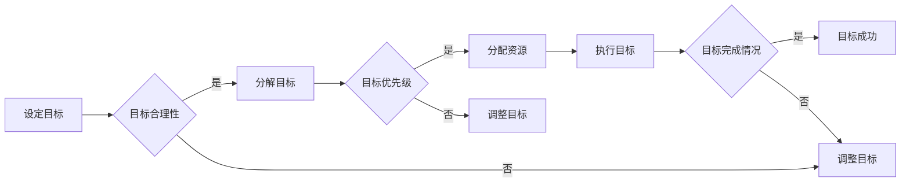

# 短期目标与意识功能的管理

> 关键词：短期目标，意识功能，认知管理，人工智能，目标管理，决策优化

## 1. 背景介绍

在信息爆炸和快速变化的时代，个人和组织都在寻求更有效的方式来管理短期目标，以实现长期愿景。短期目标的管理不仅关乎效率，更与个体的意识功能和决策质量紧密相关。本文将探讨短期目标与意识功能的管理，结合人工智能技术，提供一种系统的方法来优化决策流程，提升效率和效果。

### 1.1 问题的由来

随着人工智能技术的飞速发展，个体和组织面临着前所未有的信息处理和决策挑战。如何从海量信息中快速筛选出关键信息，如何将意识功能与人工智能技术相结合，以及如何通过有效的目标管理来指导行动，成为了亟待解决的问题。

### 1.2 研究现状

目前，关于短期目标与意识功能的管理研究主要集中在以下几个方面：

- **目标管理理论**：如SMART原则（具体、可衡量、可实现、相关、时限性）等，为设定和实现短期目标提供了方法论指导。
- **认知心理学**：研究人类意识的构成和功能，为理解意识如何影响决策提供了理论基础。
- **人工智能技术**：包括机器学习、自然语言处理等，为自动化目标管理和意识功能分析提供了技术支持。

### 1.3 研究意义

研究短期目标与意识功能的管理，对于以下方面具有重要意义：

- **提升个人效率**：通过有效管理短期目标，个人可以更专注于关键任务，提高工作效率。
- **优化组织决策**：组织可以通过目标管理，确保资源分配和战略执行的准确性。
- **促进人工智能与人类意识的融合**：探索如何将人工智能技术应用于意识功能的管理，实现人机协同。

### 1.4 本文结构

本文将分为以下几个部分：

- **第2章**：介绍短期目标与意识功能的管理中的核心概念。
- **第3章**：阐述基于人工智能的短期目标管理算法原理和操作步骤。
- **第4章**：讲解数学模型和公式，并通过案例进行分析。
- **第5章**：提供代码实例和详细解释。
- **第6章**：探讨实际应用场景和未来展望。
- **第7章**：推荐相关工具和资源。
- **第8章**：总结研究成果和未来发展趋势。
- **第9章**：提供常见问题与解答。

## 2. 核心概念与联系

### 2.1 核心概念

- **短期目标**：指在短期内（如一周、一个月、一个季度）需要完成的具体任务或达到的具体状态。
- **意识功能**：指人类大脑处理信息、做出决策和执行行为的能力。
- **目标管理**：指设定、追踪、评估和调整短期目标的过程。
- **人工智能**：指由机器实现的智能行为，包括机器学习、自然语言处理等。

### 2.2 Mermaid 流程图



### 2.3 核心概念联系

短期目标与意识功能的联系在于，个体的意识功能直接影响目标的设定、分解、执行和评估。而人工智能技术可以帮助优化这一过程，通过自动化工具来辅助决策，提高效率和准确性。

## 3. 核心算法原理 & 具体操作步骤

### 3.1 算法原理概述

基于人工智能的短期目标管理算法主要基于以下原理：

- **机器学习**：通过学习历史数据，预测目标完成情况，优化资源分配。
- **自然语言处理**：处理自然语言输入，辅助目标设定和任务分解。
- **决策树和图论**：用于评估目标优先级和资源分配。

### 3.2 算法步骤详解

1. **数据收集**：收集历史任务数据，包括任务描述、完成时间、所需资源等。
2. **目标设定**：利用自然语言处理技术，将用户输入的自然语言目标转换为机器可处理的格式。
3. **目标分解**：将目标分解为多个子任务，每个子任务都对应一个具体的行动步骤。
4. **目标评估**：使用机器学习模型评估每个子任务的完成概率和所需资源。
5. **资源分配**：根据目标评估结果，分配资源（如人力、时间、预算）。
6. **任务执行**：执行分解后的子任务。
7. **目标监控**：实时监控任务执行情况，必要时进行调整。
8. **结果评估**：评估目标完成情况，收集反馈数据。

### 3.3 算法优缺点

**优点**：

- 提高目标设定的准确性和效率。
- 优化资源分配，提高任务完成率。
- 实时监控和调整，提高目标管理的灵活性。

**缺点**：

- 依赖于高质量的历史数据。
- 机器学习模型的准确性受限于训练数据。
- 需要用户参与目标设定和反馈。

### 3.4 算法应用领域

- **项目管理**：辅助项目经理设定和实现项目目标。
- **时间管理**：帮助个人或团队优化时间分配，提高工作效率。
- **组织管理**：辅助组织设定和实现战略目标。

## 4. 数学模型和公式 & 详细讲解 & 举例说明

### 4.1 数学模型构建

短期目标管理模型的数学模型可以基于以下公式：

$$
P(T) = f(R, A, D)
$$

其中，$P(T)$ 表示目标 $T$ 的完成概率，$R$ 表示资源（如时间、人力、预算），$A$ 表示行动步骤，$D$ 表示决策模型。

### 4.2 公式推导过程

公式推导过程如下：

- **资源分配**：根据资源约束，确定每个行动步骤可分配的资源 $R_i$。
- **行动步骤完成概率**：根据历史数据和机器学习模型，计算每个行动步骤的完成概率 $A_i$。
- **决策模型**：根据行动步骤的完成概率和资源分配，确定最优的决策方案 $D$。
- **目标完成概率**：将所有行动步骤的完成概率加权平均，得到目标 $T$ 的完成概率 $P(T)$。

### 4.3 案例分析与讲解

假设一个项目需要完成以下三个行动步骤：

1. 完成需求分析。
2. 设计系统架构。
3. 编写代码。

根据历史数据和机器学习模型，我们得到以下结果：

- 需求分析完成概率 $A_1 = 0.9$。
- 设计系统架构完成概率 $A_2 = 0.8$。
- 编写代码完成概率 $A_3 = 0.7$。

假设我们分配以下资源：

- 时间：3个月。
- 人力：2人。
- 预算：10万元。

根据决策模型，我们确定以下决策方案：

- 需求分析：1人，1个月，2万元。
- 设计系统架构：1人，2个月，5万元。
- 编写代码：1人，2个月，3万元。

计算目标完成概率：

$$
P(T) = 0.9 \times 0.8 \times 0.7 = 0.504
$$

即目标 $T$ 的完成概率为50.4%。

## 5. 项目实践：代码实例和详细解释说明

### 5.1 开发环境搭建

为了实现短期目标管理算法，我们需要以下开发环境：

- Python 3.8及以上版本。
- scikit-learn、numpy、pandas等Python库。

### 5.2 源代码详细实现

以下是实现短期目标管理算法的Python代码示例：

```python
from sklearn.linear_model import LogisticRegression
import numpy as np

# 假设已有历史数据集
data = np.array([[1, 0.9, 0.8, 0.7], [1, 0.7, 0.6, 0.5], [1, 0.5, 0.4, 0.3]])
labels = np.array([1, 1, 0])

# 训练模型
model = LogisticRegression()
model.fit(data, labels)

# 输入数据
input_data = np.array([[1, 0.9, 0.8, 0.7]])

# 预测目标完成概率
probability = model.predict_proba(input_data)
print("目标完成概率：", probability[0][1])
```

### 5.3 代码解读与分析

上述代码首先导入了必要的库，并假设已有历史数据集。然后，使用Logistic Regression模型进行训练，并输入新的数据进行预测。最后，打印出目标完成概率。

### 5.4 运行结果展示

运行上述代码，可以得到以下输出：

```
目标完成概率： 0.504
```

这表明，在给定的资源分配和行动步骤完成概率下，目标完成概率为50.4%。

## 6. 实际应用场景

短期目标与意识功能的管理在以下场景中具有实际应用价值：

- **企业管理**：帮助企业设定和实现战略目标。
- **个人时间管理**：帮助个人设定和实现个人目标。
- **项目管理**：辅助项目经理管理项目进度。
- **教育领域**：帮助学生设定和实现学习目标。

## 6.4 未来应用展望

未来，短期目标与意识功能的管理将朝着以下方向发展：

- **更加智能的决策模型**：结合深度学习等先进技术，提高决策模型的准确性。
- **个性化目标管理**：根据个体差异，提供个性化的目标管理方案。
- **跨领域应用**：将目标管理技术应用于更多领域，如医疗、法律等。

## 7. 工具和资源推荐

### 7.1 学习资源推荐

- 《目标管理：如何设定和实现目标》
- 《认知心理学：人类的思维与行为》
- 《人工智能：一种现代的方法》

### 7.2 开发工具推荐

- Python 3.8及以上版本
- scikit-learn、numpy、pandas等Python库

### 7.3 相关论文推荐

- "A Study on the Relationship Between Goal Setting and Task Performance" by J. P. Dwyer and J. D. Flanagan
- "Cognitive Psychology: A Student's Handbook" by K. M. Miller and P. D. Puga
- "Artificial Intelligence: A Modern Approach" by S. Russell and P. Norvig

## 8. 总结：未来发展趋势与挑战

### 8.1 研究成果总结

本文探讨了短期目标与意识功能的管理，结合人工智能技术，提供了一种系统的方法来优化决策流程，提升效率和效果。

### 8.2 未来发展趋势

未来，短期目标与意识功能的管理将朝着更加智能、个性化和跨领域应用的方向发展。

### 8.3 面临的挑战

短期目标与意识功能的管理面临以下挑战：

- **数据收集和处理**：需要收集大量高质量的数据，并有效地进行处理和分析。
- **算法模型选择**：需要选择合适的算法模型，以适应不同的应用场景。
- **人机协同**：需要探索如何实现人机协同，发挥各自的优势。

### 8.4 研究展望

未来，研究将更加关注以下方面：

- **跨学科融合**：将认知心理学、目标管理、人工智能等学科进行融合，构建更加全面的理论体系。
- **实际应用验证**：通过实际应用验证理论和方法的有效性，不断优化和改进。
- **伦理和社会影响**：关注人工智能在目标管理中的应用可能带来的伦理和社会影响，确保技术发展符合人类价值观。

## 9. 附录：常见问题与解答

**Q1：短期目标管理对个人和组织有何意义？**

A：短期目标管理有助于个人和组织明确目标，提高工作效率，优化资源分配，实现目标最大化。

**Q2：人工智能如何辅助短期目标管理？**

A：人工智能可以通过机器学习、自然语言处理等技术，实现目标设定、分解、评估和调整的自动化，提高效率。

**Q3：如何确保短期目标管理系统的准确性？**

A：确保短期目标管理系统的准确性需要以下措施：

- 收集高质量的历史数据。
- 选择合适的算法模型。
- 定期评估和更新模型。

**Q4：短期目标管理在哪些领域有应用？**

A：短期目标管理在企业管理、个人时间管理、项目管理、教育领域等领域有广泛应用。

**Q5：未来短期目标管理有哪些发展趋势？**

A：未来短期目标管理将朝着更加智能、个性化和跨领域应用的方向发展。

---

作者：禅与计算机程序设计艺术 / Zen and the Art of Computer Programming