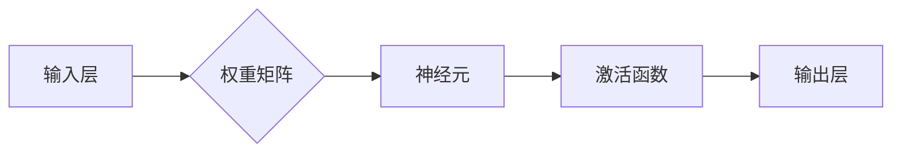
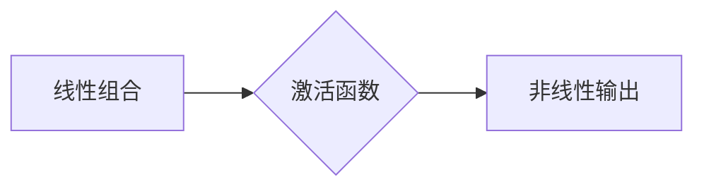

# 神经网络：人工智能的基石

> 关键词：神经网络，深度学习，机器学习，感知器，反向传播，激活函数，卷积神经网络，循环神经网络，生成对抗网络

## 1. 背景介绍

自20世纪50年代以来，人工智能（AI）领域经历了多个发展周期，其中最引人注目的莫过于近年来基于神经网络的深度学习技术的兴起。神经网络作为人工智能的基石，为机器学习领域带来了革命性的变化。本文将深入探讨神经网络的原理、应用和发展趋势，旨在帮助读者理解这一核心技术。

### 1.1 问题的由来

早期的人工智能研究主要依赖于逻辑推理和启发式搜索，这些方法在处理复杂问题时效率低下，难以实现通用的人工智能。随着计算机硬件的快速发展，以及大规模数据集的积累，神经网络作为一种模拟人脑神经元结构的计算模型，逐渐成为实现人工智能的关键技术。

### 1.2 研究现状

近年来，神经网络在图像识别、语音识别、自然语言处理等领域的应用取得了显著成果，推动了AI技术的飞速发展。深度学习，即多层神经网络的训练，成为当前AI研究的热点方向。

### 1.3 研究意义

神经网络的研究对于人工智能领域具有重要意义，它不仅为解决复杂问题提供了新的思路，而且推动了计算机硬件的发展，促进了人工智能技术的产业化进程。

### 1.4 本文结构

本文将按照以下结构展开：

- 第2部分：介绍神经网络的核心概念与联系，包括感知器、多层神经网络等。
- 第3部分：深入探讨神经网络的算法原理和具体操作步骤。
- 第4部分：讲解神经网络的数学模型和公式，并结合实例进行分析。
- 第5部分：通过项目实践，展示神经网络的代码实例和详细解释。
- 第6部分：探讨神经网络在实际应用场景中的表现和未来应用展望。
- 第7部分：推荐神经网络相关的学习资源、开发工具和参考文献。
- 第8部分：总结神经网络的研究成果、未来发展趋势和面临的挑战。
- 第9部分：提供常见问题与解答。

## 2. 核心概念与联系

### 2.1 感知器

感知器（Perceptron）是神经网络的基础，由单一神经元构成，用于处理线性可分问题。感知器模型由输入层、权重矩阵和输出层组成。输入层接收输入特征，权重矩阵存储输入特征与神经元之间的连接权重，输出层通过激活函数得到最终输出。



### 2.2 多层神经网络

多层神经网络（Multilayer Perceptron, MLP）是感知器的扩展，包含多个隐含层，可以处理更复杂的非线性问题。多层神经网络通过逐层学习特征，最终得到决策结果。


### 2.3 反向传播算法

反向传播算法（Backpropagation）是训练神经网络的核心算法，通过计算损失函数对权重的梯度，并更新权重，使模型在训练数据上拟合得更好。


### 2.4 激活函数

激活函数（Activation Function）是神经网络中不可或缺的部分，它将神经元的线性组合映射到非线性的输出空间，使神经网络能够学习复杂的非线性关系。



## 3. 核心算法原理 & 具体操作步骤

### 3.1 算法原理概述

神经网络的算法原理主要包括以下三个方面：

1. 数据预处理：包括数据清洗、特征提取、归一化等步骤，为模型提供高质量的数据。
2. 模型构建：选择合适的网络结构，包括层数、神经元数量、激活函数等。
3. 模型训练：使用反向传播算法优化模型参数，使模型在训练数据上拟合得更好。

### 3.2 算法步骤详解

以下是神经网络训练的基本步骤：

1. 初始化模型参数：随机初始化权重和偏置。
2. 前向传播：将输入数据输入网络，计算输出结果。
3. 计算损失：计算输出结果与真实标签之间的损失值。
4. 反向传播：计算损失函数对模型参数的梯度。
5. 更新参数：根据梯度更新模型参数。
6. 评估模型：在验证集上评估模型性能，调整超参数。
7. 重复步骤2-6，直至满足停止条件。

### 3.3 算法优缺点

#### 优点：

1. 能够处理非线性问题。
2. 能够自动学习特征。
3. 适用于各种数据类型。

#### 缺点：

1. 训练过程耗时较长。
2. 需要大量计算资源。
3. 对超参数敏感。

### 3.4 算法应用领域

神经网络在以下领域有广泛应用：

1. 图像识别：如人脸识别、物体检测等。
2. 语音识别：如语音转文字、语音合成等。
3. 自然语言处理：如机器翻译、情感分析等。
4. 推荐系统：如电影推荐、商品推荐等。

## 4. 数学模型和公式 & 详细讲解 & 举例说明

### 4.1 数学模型构建

神经网络的数学模型主要包括以下公式：

- 神经元输出公式：$y = \sigma(Wx + b)$，其中 $W$ 是权重矩阵，$b$ 是偏置项，$\sigma$ 是激活函数。
- 损失函数公式：$L(\theta) = -\frac{1}{m}\sum_{i=1}^{m}y^{(i)}\log(z^{(i)})$，其中 $m$ 是样本数量，$y^{(i)}$ 是真实标签，$z^{(i)}$ 是模型输出。

### 4.2 公式推导过程

以下以均方误差损失函数为例，说明其推导过程：

- 均方误差损失函数：$L(\theta) = \frac{1}{2}\sum_{i=1}^{m}(y_i - \hat{y}_i)^2$，其中 $y_i$ 是真实标签，$\hat{y}_i$ 是模型预测值。

### 4.3 案例分析与讲解

以下以图像分类任务为例，说明神经网络的实际应用。

1. 数据预处理：对图像数据进行预处理，包括归一化、裁剪等步骤。
2. 模型构建：构建卷积神经网络（CNN）模型，用于图像分类。
3. 模型训练：使用反向传播算法训练模型。
4. 模型评估：在测试集上评估模型性能。

## 5. 项目实践：代码实例和详细解释说明

### 5.1 开发环境搭建

1. 安装Python和必要的库，如NumPy、TensorFlow等。
2. 安装深度学习框架，如PyTorch、TensorFlow等。

### 5.2 源代码详细实现

以下使用PyTorch实现一个简单的神经网络模型：

```python
import torch
import torch.nn as nn

class SimpleNN(nn.Module):
    def __init__(self):
        super(SimpleNN, self).__init__()
        self.fc1 = nn.Linear(784, 128)
        self.relu = nn.ReLU()
        self.fc2 = nn.Linear(128, 10)

    def forward(self, x):
        x = self.fc1(x)
        x = self.relu(x)
        x = self.fc2(x)
        return x

model = SimpleNN()
```

### 5.3 代码解读与分析

- `SimpleNN` 类继承自 `nn.Module`，定义了一个简单的神经网络模型。
- `__init__` 方法初始化网络结构，包括线性层和ReLU激活函数。
- `forward` 方法定义了数据在模型中的传播过程。

### 5.4 运行结果展示

运行以下代码，训练和评估神经网络模型：

```python
import torch.optim as optim

criterion = nn.CrossEntropyLoss()
optimizer = optim.SGD(model.parameters(), lr=0.01)

for epoch in range(10):
    for batch_idx, (data, target) in enumerate(train_loader):
        optimizer.zero_grad()
        output = model(data)
        loss = criterion(output, target)
        loss.backward()
        optimizer.step()

print(f"Train loss: {loss.item()}")

# 评估模型
test_loss = 0
with torch.no_grad():
    for data, target in test_loader:
        output = model(data)
        test_loss += criterion(output, target).item()

print(f"Test loss: {test_loss / len(test_loader)}")
```

## 6. 实际应用场景

神经网络在以下领域有广泛应用：

1. **图像识别**：用于识别图像中的对象、场景、动作等。
2. **语音识别**：用于将语音信号转换为文本。
3. **自然语言处理**：用于文本分类、情感分析、机器翻译等。
4. **推荐系统**：用于推荐电影、音乐、商品等。
5. **医疗诊断**：用于诊断疾病、预测疾病风险等。
6. **自动驾驶**：用于车辆识别、路径规划等。

### 6.4 未来应用展望

随着神经网络技术的不断发展，未来将在以下领域发挥更大作用：

1. **更强大的模型**：开发更复杂的模型，处理更复杂的任务。
2. **更快的训练速度**：优化训练算法，提高训练速度。
3. **更少的计算资源**：优化模型结构，降低计算资源需求。
4. **更广泛的应用场景**：将神经网络应用到更多领域，如机器人、教育等。

## 7. 工具和资源推荐

### 7.1 学习资源推荐

1. 《深度学习》 - Goodfellow、Bengio和Courville合著，全面介绍了深度学习的基本概念、算法和实际应用。
2. 《神经网络与深度学习》 -邱锡鹏教授著作，深入浅出地讲解了神经网络和深度学习的基本原理。
3. Coursera上的《深度学习专项课程》 - 吴恩达教授开设，适合初学者系统学习深度学习。

### 7.2 开发工具推荐

1. TensorFlow：Google开源的深度学习框架，功能强大，易于使用。
2. PyTorch：Facebook开源的深度学习框架，灵活方便，适合快速原型设计和研究。
3. Keras：Python深度学习库，提供丰富的API，方便构建和训练神经网络。

### 7.3 相关论文推荐

1. "A Few Useful Things to Know about Machine Learning" - Pedro Domingos
2. "Playing for Data: Learning to Beat Human Players at Atari with Deep Reinforcement Learning" - Volodymyr Mnih et al.
3. "ImageNet Classification with Deep Convolutional Neural Networks" - Alex Krizhevsky et al.

## 8. 总结：未来发展趋势与挑战

### 8.1 研究成果总结

神经网络作为人工智能的基石，在图像识别、语音识别、自然语言处理等领域取得了显著的成果。深度学习技术的兴起，使得神经网络成为实现人工智能的关键技术。

### 8.2 未来发展趋势

1. **更强大的模型**：开发更复杂的模型，处理更复杂的任务。
2. **更快的训练速度**：优化训练算法，提高训练速度。
3. **更少的计算资源**：优化模型结构，降低计算资源需求。
4. **更广泛的应用场景**：将神经网络应用到更多领域，如机器人、教育等。

### 8.3 面临的挑战

1. **模型可解释性**：神经网络模型决策过程难以解释，需要进一步研究可解释性神经网络。
2. **过拟合**：神经网络模型容易过拟合，需要进一步研究正则化技术。
3. **数据隐私**：神经网络训练需要大量数据，如何保护数据隐私是一个重要问题。

### 8.4 研究展望

未来，神经网络技术将在以下方面取得突破：

1. **可解释性神经网络**：开发可解释性神经网络，提高模型决策过程的透明度。
2. **少样本学习**：在少量样本情况下，使神经网络模型也能取得良好效果。
3. **无监督学习**：开发无监督学习方法，使神经网络能够在无标签数据上学习。

## 9. 附录：常见问题与解答

**Q1：神经网络与机器学习的关系是什么？**

A：神经网络是机器学习的一种，它是机器学习的一种特殊模型，用于模拟人脑神经元结构，实现特征提取和学习。

**Q2：深度学习与机器学习的关系是什么？**

A：深度学习是机器学习的一个子领域，它使用深层神经网络模型进行学习，能够处理更复杂的数据和任务。

**Q3：神经网络的训练过程为什么需要大量数据？**

A：神经网络的训练过程需要大量数据来学习特征和模式，从而提高模型的泛化能力。

**Q4：如何防止神经网络过拟合？**

A：可以使用正则化技术、早停法、Dropout等方法来防止神经网络过拟合。

**Q5：神经网络的未来发展趋势是什么？**

A：神经网络的未来发展趋势包括更强大的模型、更快的训练速度、更少的计算资源、更广泛的应用场景等。