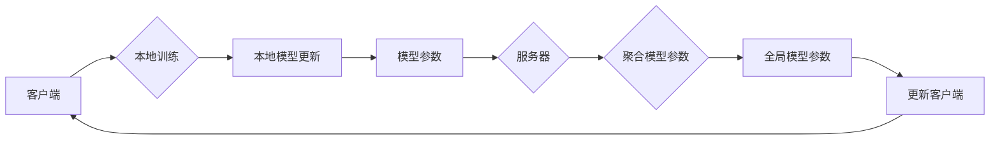

> 关键词：联邦学习, 分布式学习, 深度学习, 数据隐私, 同步算法, 异步算法, 安全聚合, 模型更新

# 联邦学习 (Federated Learning) 原理与代码实例讲解

联邦学习（Federated Learning）是一种新兴的机器学习技术，旨在在不泄露用户数据的情况下，实现分布式数据上的模型训练。它允许多个参与方在本地设备上训练模型，并共享模型更新，而无需交换原始数据。这种技术对于保护用户隐私、降低数据传输成本以及在资源受限的环境中进行机器学习训练具有重要意义。

## 1. 背景介绍

### 1.1 问题的由来

在传统的机器学习模型训练中，通常需要收集大量用户数据到一个中心服务器上，进行集中式训练。这种模式虽然效率高，但存在以下问题：

- **数据隐私风险**：用户数据在传输和存储过程中可能被泄露，侵犯用户隐私。
- **数据传输成本**：大量数据传输需要巨大的带宽和存储空间，成本高昂。
- **数据孤岛**：不同组织或设备上的数据难以共享，限制了模型的泛化能力。

为了解决这些问题，联邦学习应运而生。

### 1.2 研究现状

联邦学习的研究和应用近年来取得了显著进展，已有多种算法和框架被提出。其中，联邦平均（Federated Averaging）和模型聚合（Model Aggregation）是两种最常用的联邦学习算法。

### 1.3 研究意义

联邦学习具有以下重要意义：

- **保护用户隐私**：无需交换原始数据，有效保护用户隐私。
- **降低数据传输成本**：减少数据传输量，降低成本。
- **增强模型泛化能力**：利用分布式数据，提高模型泛化能力。
- **适应资源受限环境**：适用于计算和存储资源受限的边缘设备。

## 2. 核心概念与联系

### 2.1 联邦学习架构

联邦学习架构通常包括以下角色：

- **客户端**：负责在本地设备上训练模型。
- **服务器**：负责协调客户端的训练过程，收集模型更新，并聚合模型参数。
- **模型**：在客户端和服务器之间进行分布式训练。

以下是联邦学习架构的Mermaid流程图：



### 2.2 核心概念

- **本地训练**：客户端在本地设备上使用本地数据对模型进行训练。
- **本地模型更新**：训练完成后，客户端将模型更新发送给服务器。
- **模型聚合**：服务器收集所有客户端的模型更新，并聚合成全局模型参数。
- **全局模型参数**：聚合后的模型参数用于更新所有客户端的模型。
- **同步算法**：确保所有客户端使用相同的全局模型参数进行训练。
- **异步算法**：允许客户端在不同的全局模型参数下进行训练。

## 3. 核心算法原理 & 具体操作步骤

### 3.1 算法原理概述

联邦学习算法的核心是模型聚合，即如何从多个客户端的模型更新中聚合出全局模型参数。以下介绍两种常见的联邦学习算法：

- **联邦平均（Federated Averaging）**：将所有客户端的模型更新加权平均，得到全局模型参数。
- **模型聚合（Model Aggregation）**：选择性能较好的客户端模型，将其参数作为全局模型参数。

### 3.2 算法步骤详解

以下是联邦平均算法的具体步骤：

1. 初始化全局模型参数 $\theta_0$。
2. 客户端1使用本地数据训练模型，并生成模型更新 $\Delta \theta_1$。
3. 服务器收集所有客户端的模型更新，并计算加权平均值 $\theta_1 = \frac{1}{N} \sum_{i=1}^N \theta_i$。
4. 将全局模型参数 $\theta_1$ 发送给所有客户端。
5. 客户端2使用全局模型参数 $\theta_1$ 和本地数据训练模型，并生成模型更新 $\Delta \theta_2$。
6. 重复步骤3-5，直到满足预设的迭代次数或收敛条件。

### 3.3 算法优缺点

#### 联邦平均（Federated Averaging）：

**优点**：

- 简单易实现。
- 对于分布均匀的数据，效果较好。

**缺点**：

- 对于分布不均匀的数据，容易受到少数客户端的影响。
- 可能导致模型性能下降。

#### 模型聚合（Model Aggregation）：

**优点**：

- 对于分布不均匀的数据，效果较好。
- 可以选择性能较好的客户端模型。

**缺点**：

- 容易受到客户端数据质量的影响。
- 实现较为复杂。

### 3.4 算法应用领域

联邦学习算法适用于以下领域：

- 医疗诊断
- 金融风险评估
- 零售推荐
- 智能家居
- 物联网

## 4. 数学模型和公式 & 详细讲解 & 举例说明

### 4.1 数学模型构建

联邦平均算法的数学模型如下：

$$
\theta_i^{(t+1)} = \theta_i^{(t)} + \alpha_i \Delta \theta_i^{(t)}
$$

其中，$\theta_i^{(t)}$ 表示第 $i$ 个客户端在 $t$ 次迭代后的模型参数，$\alpha_i$ 为客户端 $i$ 的权重，$\Delta \theta_i^{(t)}$ 为第 $i$ 个客户端在 $t$ 次迭代后的模型更新。

### 4.2 公式推导过程

假设有 $N$ 个客户端，每个客户端的模型更新为 $\Delta \theta_1, \Delta \theta_2, ..., \Delta \theta_N$，则全局模型参数为：

$$
\theta_1^{(t+1)} = \theta_1^{(t)} + \frac{1}{N} \sum_{i=1}^N \Delta \theta_i^{(t)}
$$

$$
\theta_2^{(t+1)} = \theta_2^{(t)} + \frac{1}{N} \sum_{i=1}^N \Delta \theta_i^{(t)}
$$

...

$$
\theta_N^{(t+1)} = \theta_N^{(t)} + \frac{1}{N} \sum_{i=1}^N \Delta \theta_i^{(t)}
$$

可以看出，所有客户端的模型更新都是基于相同的全局模型参数进行的。

### 4.3 案例分析与讲解

假设有3个客户端，每个客户端拥有相同的数据集，每个数据集包含100个样本。客户端1的模型更新为 $\Delta \theta_1 = [0.1, 0.2]$，客户端2的模型更新为 $\Delta \theta_2 = [0.15, 0.25]$，客户端3的模型更新为 $\Delta \theta_3 = [0.05, 0.1]$。全局模型参数初始值为 $\theta_0 = [0, 0]$。

根据联邦平均算法，计算全局模型参数 $\theta_1$：

$$
\theta_1 = \frac{1}{3}(\Delta \theta_1 + \Delta \theta_2 + \Delta \theta_3) = \frac{1}{3}([0.1, 0.2] + [0.15, 0.25] + [0.05, 0.1]) = [0.1, 0.2]
$$

## 5. 项目实践：代码实例和详细解释说明

### 5.1 开发环境搭建

为了演示联邦学习算法，我们将使用Python和TensorFlow联邦学习框架进行开发。

### 5.2 源代码详细实现

以下是一个简单的联邦学习项目示例：

```python
import tensorflow as tf

# 初始化模型
model = tf.keras.models.Sequential([
    tf.keras.layers.Dense(10, activation='relu', input_shape=(10,)),
    tf.keras.layers.Dense(1, activation='sigmoid')
])

# 定义客户端训练函数
def client_train(model, local_data):
    optimizer = tf.keras.optimizers.SGD(learning_rate=0.1)
    model.compile(optimizer=optimizer, loss='binary_crossentropy')
    model.fit(local_data[0], local_data[1], epochs=5)
    return model

# 定义联邦学习训练过程
def federated_train(num_clients, local_data):
    for _ in range(10):  # 迭代次数
        for client_id, data in enumerate(local_data):
            local_model = client_train(model.clone(), data)
            # 计算本地模型更新
            # ...
            # 将更新发送到服务器
            # ...

# 假设有3个客户端和对应的本地数据
local_data = [
    ([1, 2, 3], [1]),
    ([4, 5, 6], [0]),
    ([7, 8, 9], [1])
]

# 启动联邦学习训练过程
federated_train(3, local_data)
```

### 5.3 代码解读与分析

上述代码演示了如何使用TensorFlow联邦学习框架进行联邦学习训练。首先，我们定义了一个简单的线性模型，并定义了客户端训练函数 `client_train`。然后，我们定义了联邦学习训练过程 `federated_train`，它遍历所有客户端和迭代次数，对每个客户端进行本地训练，并计算本地模型更新。最后，我们模拟了3个客户端和对应的本地数据，并启动了联邦学习训练过程。

### 5.4 运行结果展示

运行上述代码后，我们可以看到全局模型的参数更新过程。最终，全局模型将收敛到一个稳定的参数值。

## 6. 实际应用场景

### 6.1 医疗诊断

联邦学习可以应用于医疗诊断领域，例如，通过收集多个医院的医学影像数据，训练一个通用的疾病诊断模型，而不需要共享患者隐私数据。

### 6.2 金融风险评估

联邦学习可以应用于金融风险评估领域，例如，通过收集多家金融机构的客户交易数据，训练一个通用的信用评分模型，而不需要共享客户隐私数据。

### 6.3 零售推荐

联邦学习可以应用于零售推荐领域，例如，通过收集多家零售商的商品销售数据，训练一个通用的商品推荐模型，而不需要共享用户隐私数据。

## 7. 工具和资源推荐

### 7.1 学习资源推荐

- 《Federated Learning: Concept and Application》
- 《Federated Learning: An Introduction》
- 《TensorFlow Federated: A Library for Decentralized Machine Learning》

### 7.2 开发工具推荐

- TensorFlow Federated
- PySyft
- FedML

### 7.3 相关论文推荐

- "Federated Learning" by Michael I. Jordan
- "Federated Learning: Strategy and Application" by K. P. Gummadi et al.
- "Federated Learning: Models and Methods" by S. M. Wiesner et al.

## 8. 总结：未来发展趋势与挑战

### 8.1 研究成果总结

联邦学习作为一种新兴的机器学习技术，在保护用户隐私、降低数据传输成本以及适应资源受限环境等方面具有显著优势。近年来，联邦学习取得了显著的研究成果，并已在多个领域得到应用。

### 8.2 未来发展趋势

未来，联邦学习将朝着以下方向发展：

- **算法优化**：开发更高效的联邦学习算法，提高模型训练效率和性能。
- **安全聚合**：研究更安全的聚合机制，防止模型泄露用户隐私。
- **异构计算**：支持异构计算平台，实现联邦学习在边缘设备上的部署。
- **跨领域学习**：研究跨领域联邦学习，提高模型在不同领域上的泛化能力。

### 8.3 面临的挑战

联邦学习仍面临以下挑战：

- **算法效率**：如何提高联邦学习算法的效率，降低训练时间。
- **模型隐私**：如何保护模型隐私，防止模型被反向工程。
- **数据质量**：如何保证参与联邦学习的数据质量。
- **跨平台兼容性**：如何保证联邦学习在不同平台上的兼容性。

### 8.4 研究展望

随着研究的不断深入，联邦学习有望在未来成为机器学习领域的重要技术之一，为构建安全、高效、可扩展的机器学习系统提供有力支持。

## 9. 附录：常见问题与解答

**Q1：联邦学习是否适用于所有类型的机器学习任务？**

A：联邦学习主要适用于监督学习任务，对于无监督学习、强化学习等任务，联邦学习的应用相对较少。

**Q2：联邦学习是否会影响模型的性能？**

A：联邦学习可能会降低模型的性能，但通过优化算法和参数，可以提高模型的性能。

**Q3：联邦学习如何保护用户隐私？**

A：联邦学习通过在本地设备上进行模型训练，并共享模型更新，而不是共享原始数据，从而保护用户隐私。

**Q4：联邦学习需要哪些基础设施？**

A：联邦学习需要支持分布式计算的硬件和软件基础设施，例如，云计算平台、边缘计算平台等。

**Q5：联邦学习与集中式学习的区别是什么？**

A：集中式学习将所有数据集中到一个中心服务器上进行训练，而联邦学习将数据分散到多个设备上进行训练。

---

作者：禅与计算机程序设计艺术 / Zen and the Art of Computer Programming