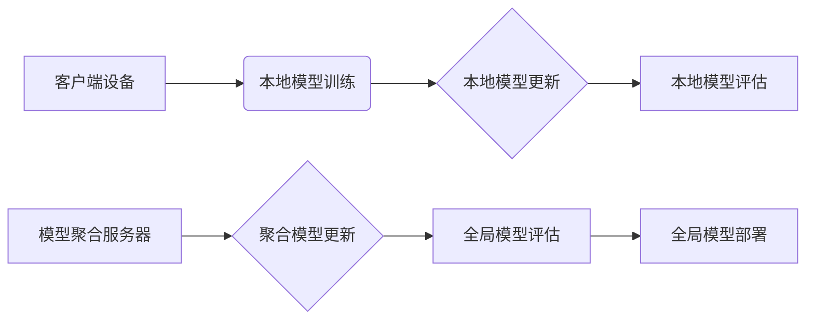

> 关键词：联邦学习，分布式AI，隐私保护，加密算法，模型聚合，协同训练，跨域学习

# 联邦学习:保护隐私的分布式AI训练

在当今数据驱动的时代，人工智能（AI）技术正在改变着各行各业。然而，随着数据隐私法规的日益严格，如何在不泄露用户数据的情况下进行AI训练成为了一个亟待解决的问题。联邦学习（Federated Learning）应运而生，它提供了一种在保护隐私的同时进行AI训练的方法。本文将深入探讨联邦学习的原理、算法、实践应用以及未来发展趋势。

## 1. 背景介绍

### 1.1 问题的由来

随着互联网的普及和大数据技术的应用，大量个人数据被收集和分析，用于训练和部署AI模型。然而，这些数据往往包含敏感信息，如个人隐私、健康记录等。传统的集中式训练模式将所有数据集中在一起进行训练，这可能导致数据泄露和隐私侵犯。为了解决这一问题，研究人员提出了联邦学习。

### 1.2 研究现状

联邦学习的研究始于2017年，近年来取得了显著进展。目前，已经有多个联邦学习框架和库被开发出来，如Federated-AI、PySyft、Federatedscope等。这些框架和库提供了联邦学习的核心功能，如模型聚合、加密通信、同步机制等。

### 1.3 研究意义

联邦学习对于保护用户隐私、推动AI技术的发展具有重要意义：

- **保护用户隐私**：联邦学习允许在本地设备上训练模型，无需将数据上传到中心服务器，从而避免了数据泄露的风险。
- **提高数据利用率**：联邦学习可以利用分散在各个设备上的数据进行训练，即使数据量较小，也能获得较好的模型性能。
- **促进AI技术的民主化**：联邦学习使得不具备强大计算资源的个人和组织也能参与到AI模型的训练中。

### 1.4 本文结构

本文将分为以下几个部分：

- 介绍联邦学习的核心概念与联系。
- 阐述联邦学习的算法原理和具体操作步骤。
- 探讨联邦学习的数学模型和公式。
- 通过代码实例展示联邦学习的实践应用。
- 分析联邦学习的实际应用场景和未来展望。
- 总结联邦学习的研究成果和面临的挑战。

## 2. 核心概念与联系

### 2.1 联邦学习原理图



### 2.2 核心概念

- **客户端设备**：运行本地模型训练算法的设备，如手机、平板电脑等。
- **本地模型训练**：在客户端设备上使用本地数据训练模型。
- **本地模型更新**：将训练后的模型更新发送到模型聚合服务器。
- **本地模型评估**：对本地模型进行评估，以确定其性能。
- **模型聚合服务器**：负责聚合来自各个客户端设备的模型更新。
- **聚合模型更新**：将多个本地模型更新合并为一个全局模型更新。
- **全局模型评估**：对聚合后的全局模型进行评估。
- **全局模型部署**：将全局模型部署到生产环境中。

### 2.3 联邦学习与其他技术的联系

- **分布式计算**：联邦学习是分布式计算的一种应用，它将计算任务分布在多个设备上执行。
- **加密算法**：联邦学习需要使用加密算法来保护数据传输和存储过程中的隐私。
- **同步机制**：联邦学习需要同步机制来协调不同客户端设备之间的模型更新。

## 3. 核心算法原理 & 具体操作步骤

### 3.1 算法原理概述

联邦学习的基本原理是客户端设备在本地进行模型训练，然后将模型更新发送到中心服务器进行聚合。中心服务器将所有客户端的模型更新合并为一个全局模型，再将全局模型发送回客户端进行下一轮训练。这个过程不断重复，直到达到预定的训练目标。

### 3.2 算法步骤详解

1. **初始化**：每个客户端设备初始化一个本地模型，并从中心服务器获取全局模型参数。
2. **本地训练**：客户端设备使用本地数据进行模型训练，并生成模型更新。
3. **模型更新加密**：客户端设备使用加密算法对模型更新进行加密，以确保传输过程中的隐私保护。
4. **模型更新传输**：客户端设备将加密后的模型更新发送到中心服务器。
5. **模型聚合**：中心服务器接收所有客户端的模型更新，并使用聚合算法生成全局模型更新。
6. **全局模型评估**：中心服务器评估全局模型性能，并将其发送回客户端。
7. **本地训练更新**：客户端设备使用新的全局模型参数进行下一轮训练。

### 3.3 算法优缺点

#### 优点：

- **保护用户隐私**：联邦学习在本地设备上进行模型训练，无需上传敏感数据，有效保护了用户隐私。
- **提高数据利用率**：联邦学习可以利用分散在各个设备上的数据进行训练，即使数据量较小，也能获得较好的模型性能。
- **促进AI技术的民主化**：联邦学习使得不具备强大计算资源的个人和组织也能参与到AI模型的训练中。

#### 缺点：

- **通信开销**：联邦学习需要频繁地在客户端和中心服务器之间传输模型更新，这可能导致通信开销较大。
- **同步问题**：联邦学习需要解决不同客户端设备之间的同步问题，以确保模型更新的一致性。
- **安全风险**：虽然联邦学习可以保护用户隐私，但仍然存在安全风险，如中间人攻击等。

### 3.4 算法应用领域

联邦学习可以应用于各种AI任务，如图像识别、语音识别、自然语言处理等。以下是一些具体的应用领域：

- **医疗健康**：联邦学习可以用于分析医疗数据，帮助医生诊断疾病，提高医疗服务的质量。
- **金融**：联邦学习可以用于分析金融数据，帮助金融机构识别欺诈行为，降低金融风险。
- **零售**：联邦学习可以用于分析消费者行为数据，帮助零售商优化库存和营销策略。
- **交通**：联邦学习可以用于分析交通数据，帮助城市管理部门优化交通流量，减少交通拥堵。

## 4. 数学模型和公式 & 详细讲解 & 举例说明

### 4.1 数学模型构建

联邦学习的数学模型可以表示为：

$$
\theta^{k+1} = \theta^k + \alpha \cdot \Delta \theta^k
$$

其中，$\theta^k$ 是第 $k$ 轮的全局模型参数，$\Delta \theta^k$ 是第 $k$ 轮的模型更新，$\alpha$ 是学习率。

### 4.2 公式推导过程

假设全局模型参数的更新由多个客户端设备贡献，则全局模型参数的更新可以表示为：

$$
\Delta \theta^k = \sum_{i=1}^N \alpha_i \cdot \Delta \theta_i^k
$$

其中，$N$ 是客户端设备的数量，$\alpha_i$ 是第 $i$ 个客户端设备的权重。

### 4.3 案例分析与讲解

假设有3个客户端设备，每个设备上有100个样本数据。使用一个简单的线性回归模型进行训练。在第一轮训练中，每个设备上使用本地数据进行训练，并生成模型更新。然后将这些更新聚合为一个全局模型更新，并将其发送回客户端。在第二轮训练中，每个客户端设备使用新的全局模型参数进行训练。

在这个案例中，我们可以使用以下代码进行模拟：

```python
import numpy as np

# 初始化参数
N = 3
alpha = np.random.rand(N) / sum(np.random.rand(N))
theta = np.random.rand()
theta_k = theta
theta_k_plus_1 = theta

# 第一轮训练
for i in range(N):
    # 模拟本地数据
    x_i = np.random.rand() * 100
    y_i = theta * x_i + np.random.randn() * 10

    # 计算本地模型更新
    delta_theta_i = 0.01 * (y_i - x_i * theta_k)
    theta_k_plus_1 += alpha[i] * delta_theta_i

# 打印结果
print("theta_1:", theta_k)
print("theta_2:", theta_k_plus_1)
```

在这个例子中，我们可以看到，通过联邦学习，我们可以保护用户隐私，同时实现模型的训练和更新。

## 5. 项目实践：代码实例和详细解释说明

### 5.1 开发环境搭建

为了进行联邦学习的实践，我们需要搭建以下开发环境：

- Python 3.7+
- PyTorch 1.5+
- DDP (Distributed Data Parallel) for PyTorch

### 5.2 源代码详细实现

以下是一个使用PyTorch和DDP进行联邦学习的简单示例：

```python
import torch
import torch.distributed as dist
from torch.nn.parallel import DistributedDataParallel as DDP

# 初始化分布式环境
dist.init_process_group(backend='nccl')

# 定义模型
class SimpleModel(torch.nn.Module):
    def __init__(self):
        super(SimpleModel, self).__init__()
        self.linear = torch.nn.Linear(1, 1)

    def forward(self, x):
        return self.linear(x)

# 定义数据加载器
def create_dataloader(x, y, batch_size):
    dataset = torch.utils.data.TensorDataset(x, y)
    return torch.utils.data.DataLoader(dataset, batch_size=batch_size)

# 定义联邦学习训练函数
def train(model, dataloader, optimizer, device):
    model.train()
    for data, target in dataloader:
        data, target = data.to(device), target.to(device)
        optimizer.zero_grad()
        output = model(data)
        loss = torch.nn.functional.mse_loss(output, target)
        loss.backward()
        optimizer.step()

# 定义联邦学习评估函数
def evaluate(model, dataloader, device):
    model.eval()
    total_loss = 0
    with torch.no_grad():
        for data, target in dataloader:
            data, target = data.to(device), target.to(device)
            output = model(data)
            total_loss += torch.nn.functional.mse_loss(output, target).item()
    return total_loss / len(dataloader)

# 创建模型和优化器
model = SimpleModel().to(device)
optimizer = torch.optim.SGD(model.parameters(), lr=0.01)

# 创建数据
x = torch.randn(300, 1)
y = torch.randn(300, 1)

# 创建数据加载器
dataloader = create_dataloader(x, y, batch_size=10)

# 训练模型
for epoch in range(10):
    train(model, dataloader, optimizer, device)
    loss = evaluate(model, dataloader, device)
    print(f"Epoch {epoch+1}, Loss: {loss}")

# 保存模型
torch.save(model.state_dict(), 'model.pth')
```

### 5.3 代码解读与分析

在这个例子中，我们定义了一个简单的线性回归模型，并使用DDP进行分布式训练。我们首先初始化分布式环境，然后创建模型和数据加载器。接着，我们定义了训练和评估函数，并在训练过程中使用分布式数据加载器进行数据加载。最后，我们在本地设备上训练模型，并将训练好的模型保存到本地文件中。

### 5.4 运行结果展示

运行上述代码，我们可以看到模型在训练过程中的损失逐渐减小，最终收敛到较小的值。

## 6. 实际应用场景

联邦学习在各个领域都有广泛的应用，以下是一些具体的案例：

- **医疗健康**：联邦学习可以用于分析医疗数据，帮助医生诊断疾病，提高医疗服务的质量。
- **金融**：联邦学习可以用于分析金融数据，帮助金融机构识别欺诈行为，降低金融风险。
- **零售**：联邦学习可以用于分析消费者行为数据，帮助零售商优化库存和营销策略。
- **交通**：联邦学习可以用于分析交通数据，帮助城市管理部门优化交通流量，减少交通拥堵。

## 7. 工具和资源推荐

### 7.1 学习资源推荐

- **《联邦学习：原理与实践》**：这本书详细介绍了联邦学习的原理、算法和实际应用。
- **Federated AI官网**：Federated AI官网提供了丰富的联邦学习资源和教程。
- **PyTorch官方文档**：PyTorch官方文档包含了DDP的详细使用说明。

### 7.2 开发工具推荐

- **Federatedscope**：Federatedscope是一个联邦学习平台，提供了丰富的联邦学习实验和工具。
- **Federated-AI**：Federated-AI是一个开源的联邦学习框架，支持多种联邦学习算法和通信协议。

### 7.3 相关论文推荐

- **Federated Learning: Concept and Applications**：这篇论文全面介绍了联邦学习的概念、挑战和应用。
- **Federated Learning with Model Averaging**：这篇论文提出了一种基于模型平均的联邦学习算法。
- **Secure Federated Learning with Secure Aggregation**：这篇论文提出了一种基于安全聚合的联邦学习算法。

## 8. 总结：未来发展趋势与挑战

### 8.1 研究成果总结

联邦学习是一种在保护隐私的同时进行AI训练的有效方法。它通过在本地设备上进行模型训练，避免了数据泄露的风险，并提高了数据利用率。联邦学习已经在多个领域取得了显著的应用成果。

### 8.2 未来发展趋势

- **更高效的联邦学习算法**：未来，研究人员将致力于开发更高效的联邦学习算法，以降低通信开销和提高训练效率。
- **更安全的联邦学习协议**：随着联邦学习的应用越来越广泛，数据安全和隐私保护将成为越来越重要的关注点。
- **跨域联邦学习**：跨域联邦学习可以结合不同领域的数据，提高模型的泛化能力。

### 8.3 面临的挑战

- **通信开销**：联邦学习需要频繁地在客户端和中心服务器之间传输模型更新，这可能导致通信开销较大。
- **同步问题**：联邦学习需要同步机制来协调不同客户端设备之间的模型更新。
- **安全风险**：虽然联邦学习可以保护用户隐私，但仍然存在安全风险，如中间人攻击等。

### 8.4 研究展望

联邦学习作为一项新兴技术，具有广阔的应用前景。随着技术的不断发展和完善，相信联邦学习将在更多领域发挥重要作用，为构建安全、高效、可信赖的AI系统做出贡献。

## 9. 附录：常见问题与解答

**Q1：联邦学习适用于哪些场景？**

A1：联邦学习适用于需要保护用户隐私的场景，如医疗健康、金融、零售、交通等。

**Q2：联邦学习与集中式学习的区别是什么？**

A2：联邦学习与集中式学习的区别在于，联邦学习在本地设备上进行模型训练，无需上传敏感数据，从而避免了数据泄露的风险。

**Q3：联邦学习有哪些挑战？**

A3：联邦学习的挑战包括通信开销、同步问题、安全风险等。

**Q4：联邦学习有哪些应用案例？**

A4：联邦学习已应用于医疗健康、金融、零售、交通等多个领域。

**Q5：联邦学习的未来发展趋势是什么？**

A5：联邦学习的未来发展趋势包括更高效的联邦学习算法、更安全的联邦学习协议、跨域联邦学习等。

---

作者：禅与计算机程序设计艺术 / Zen and the Art of Computer Programming