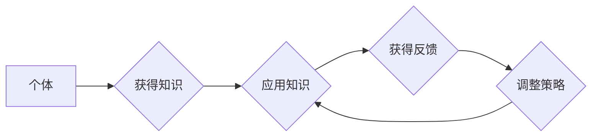

# 自信：因为每个人都可以学习和提高这些技能

> 关键词：自信，终身学习，技能提升，认知心理学，行为心理学，学习策略，实践应用

## 1. 背景介绍

在信息爆炸的时代，技能的重要性日益凸显。无论是职场竞争，还是个人成长，掌握一技之长都是不可或缺的。然而，面对不断变化的技术和知识体系，很多人感到迷茫和焦虑，缺乏自信。本文将探讨自信的来源，分析如何通过学习和实践提升技能，并探讨终身学习的重要性。

## 2. 核心概念与联系

### 2.1 核心概念

#### 自信

自信是指个体对自己能力的正面评价和信任。它是一种心理状态，能够帮助个体在面临挑战时保持积极的态度，并相信自己能够克服困难。

#### 终身学习

终身学习是指个体在整个人生过程中，通过不断学习新知识、新技能，以适应社会发展和个人成长的需求。

#### 认知心理学

认知心理学是研究人类认知过程的科学，包括感知、记忆、思维、语言等。

#### 行为心理学

行为心理学是研究人类行为和心理活动之间关系的科学，强调通过行为来了解心理。

### 2.2 核心概念原理和架构的 Mermaid 流程图



该流程图展示了个体通过终身学习不断获得知识、应用知识、获得反馈并调整策略的过程，形成一个持续学习的闭环。

## 3. 核心算法原理 & 具体操作步骤

### 3.1 算法原理概述

提升自信的核心原理在于不断学习、实践和应用，从而获得成就感，增强自我效能感。

### 3.2 算法步骤详解

#### 步骤1：明确学习目标

确定自己想要掌握的技能，并设定清晰的学习目标。

#### 步骤2：制定学习计划

根据学习目标，制定详细的学习计划，包括学习内容、时间安排和评估标准。

#### 步骤3：获取学习资源

寻找优质的学习资源，如在线课程、书籍、视频等。

#### 步骤4：主动学习

积极参与学习活动，主动思考，提高学习效率。

#### 步骤5：实践应用

将所学知识应用到实际生活中，检验学习成果。

#### 步骤6：反思总结

定期反思学习过程，总结经验教训，调整学习策略。

### 3.3 算法优缺点

#### 优点

- 提高自信心
- 增强自我效能感
- 提升个人能力
- 促进终身学习

#### 缺点

- 需要付出时间和精力
- 需要面对挑战和困难
- 可能会遇到挫折和失败

### 3.4 算法应用领域

该方法适用于各个领域，如编程、语言学习、艺术创作等。

## 4. 数学模型和公式 & 详细讲解 & 举例说明

### 4.1 数学模型构建

自信度 $S$ 可以通过以下公式进行量化：

$$
S = f(\text{知识掌握度}, \text{实践应用}, \text{成就感})
$$

其中，知识掌握度和成就感与学习过程和结果相关，实践应用则与个人习惯和外部环境相关。

### 4.2 公式推导过程

自信度 $S$ 是一个综合指标，由三个因素构成：

- 知识掌握度：表示个体对某个技能的掌握程度，可以用学习时间、练习次数等指标衡量。
- 实践应用：表示个体将所学知识应用到实际生活中的频率和效果。
- 成就感：表示个体在学习过程中获得的正向反馈和自我评价。

### 4.3 案例分析与讲解

小明想要学习Python编程，他设定了以下学习目标：

- 在3个月内掌握Python基础语法和常用库。
- 在4个月内完成一个小型项目。

小明制定了以下学习计划：

- 每天学习2小时，每周练习编程。
- 在线学习Python基础语法、数据结构和算法。
- 参与开源项目，积累实践经验。

经过3个月的努力，小明成功掌握了Python基础语法和常用库，并完成了一个小项目。在这个过程中，小明不断获得正向反馈，增强了自信心。

## 5. 项目实践：代码实例和详细解释说明

### 5.1 开发环境搭建

以Python编程为例，搭建开发环境：

1. 安装Python：从官网下载并安装Python。
2. 安装IDE：选择合适的IDE，如PyCharm、VSCode等。
3. 安装相关库：使用pip安装所需的库，如NumPy、Pandas等。

### 5.2 源代码详细实现

以下是一个简单的Python程序，用于计算两个数的和：

```python
def add(a, b):
    return a + b

result = add(3, 5)
print("The sum of 3 and 5 is:", result)
```

### 5.3 代码解读与分析

- `def add(a, b):` 定义一个名为`add`的函数，参数为`a`和`b`。
- `return a + b` 返回两个参数的和。
- `result = add(3, 5)` 调用`add`函数，将结果赋值给变量`result`。
- `print("The sum of 3 and 5 is:", result)` 打印两个数的和。

### 5.4 运行结果展示

运行上述代码，输出结果为：

```
The sum of 3 and 5 is: 8
```

## 6. 实际应用场景

### 6.1 职场技能提升

在职场中，不断提升技能是保持竞争力的关键。以下是一些实际应用场景：

- 学习项目管理技能，提高团队协作效率。
- 学习数据分析技能，提升决策能力。
- 学习编程技能，提高工作效率。

### 6.2 个人成长

在个人成长过程中，学习新技能可以帮助我们：

- 丰富人生阅历。
- 增强自信心。
- 提升生活质量。

## 7. 工具和资源推荐

### 7.1 学习资源推荐

- 网易云课堂：提供丰富的在线课程，涵盖各个领域。
- Coursera：全球领先的在线教育平台，提供来自世界顶级大学的课程。
- Udemy：提供海量的在线课程，满足不同学习需求。

### 7.2 开发工具推荐

- PyCharm：功能强大的Python IDE，支持代码调试、版本控制等。
- Visual Studio Code：轻量级、可扩展的代码编辑器，支持多种编程语言。
- Git：版本控制工具，帮助开发者管理代码版本。

### 7.3 相关论文推荐

- "The Role of Confidence in Learning and Performance" by James P. Ciborowski
- "The Impact of Self-Efficacy on Learning and Performance" by Albert Bandura
- "The Power of Habit: Why We Do What We Do in Life and Business" by Charles Duhigg

## 8. 总结：未来发展趋势与挑战

### 8.1 研究成果总结

本文从自信的来源、提升技能的方法、终身学习的重要性等方面进行了探讨，为读者提供了提升自信和技能的实用建议。

### 8.2 未来发展趋势

随着人工智能和在线教育的快速发展，未来学习资源和工具将更加丰富，学习方式也将更加灵活。终身学习将成为一种生活方式，个人能力将成为衡量个体价值的重要标准。

### 8.3 面临的挑战

- 学习资源的泛滥导致选择困难。
- 学习效率低下，难以坚持学习。
- 个人能力与市场需求不完全匹配。

### 8.4 研究展望

未来，研究应重点关注以下方向：

- 开发更加高效的学习方法。
- 个性化学习路径的设计。
- 跨学科知识的整合。

## 9. 附录：常见问题与解答

**Q1：如何克服学习过程中的困难？**

A：面对学习过程中的困难，首先要保持积极的心态，相信自己能够克服困难。其次，可以采取以下策略：

- 将大目标分解为小目标，逐步实现。
- 寻求他人的帮助，如参加学习小组、请教导师等。
- 调整学习计划，找到适合自己的学习节奏。

**Q2：如何平衡工作和学习？**

A：平衡工作和学习需要良好的时间管理能力。以下是一些建议：

- 制定合理的工作计划和休息计划。
- 利用碎片化时间进行学习。
- 与同事、朋友分享学习经验，互相鼓励。

**Q3：如何保持学习的热情？**

A：保持学习的热情需要不断追求新知识、新技能。以下是一些建议：

- 关注行业动态，了解新兴技术和趋势。
- 参加线上或线下的技术交流活动。
- 将学习与兴趣爱好相结合。

**Q4：如何将所学知识应用到实际工作中？**

A：将所学知识应用到实际工作中，需要以下步骤：

- 分析工作中遇到的问题，找到解决方案。
- 将解决方案与所学知识相结合。
- 持续实践，不断优化解决方案。

**Q5：如何评估学习效果？**

A：评估学习效果可以通过以下方法：

- 定期进行自我测试，检验知识掌握程度。
- 参加技能认证考试，获得行业认可。
- 与他人交流学习心得，了解自己的不足。

通过不断学习、实践和应用，每个人都可以提升技能，增强自信，实现个人成长。让我们一起努力，成为更好的自己！

---

作者：禅与计算机程序设计艺术 / Zen and the Art of Computer Programming