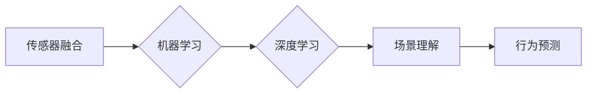

# 自动驾驶中的场景理解与行为预测

> 关键词：自动驾驶，场景理解，行为预测，机器学习，深度学习，计算机视觉，自然语言处理，传感器融合

## 1. 背景介绍

随着技术的不断进步，自动驾驶技术已经成为当今世界最受瞩目的科技创新之一。自动驾驶汽车能够自主感知环境、规划路径、控制车辆，最终实现安全、高效的驾驶。而场景理解与行为预测作为自动驾驶的核心技术之一，其重要性不言而喻。本文将深入探讨自动驾驶中的场景理解与行为预测，分析其核心概念、算法原理、实践应用以及未来发展趋势。

### 1.1 问题的由来

自动驾驶汽车在行驶过程中，需要实时感知周围环境，理解道路场景，预测其他车辆、行人和交通标志等行为，以便做出正确的决策。场景理解与行为预测正是为了解决这一问题而诞生的。

### 1.2 研究现状

近年来，随着机器学习和深度学习技术的飞速发展，场景理解与行为预测取得了显著进展。目前，主要的研究方向包括：

- **基于视觉的场景理解**：利用摄像头采集的图像数据进行场景解析，识别道路、车辆、行人、交通标志等元素，并对其进行语义标注。
- **基于雷达和激光雷达的传感器融合**：融合雷达、激光雷达等多源传感器数据，实现更全面的环境感知。
- **基于自然语言处理的行为预测**：分析语义信息，预测其他车辆、行人的意图和行为。

### 1.3 研究意义

场景理解与行为预测是自动驾驶技术发展的重要里程碑。其研究意义主要体现在以下几个方面：

- **提高驾驶安全性**：通过准确感知和预测周围环境，减少交通事故的发生。
- **提升驾驶效率**：优化行驶路径，减少拥堵，提高道路通行效率。
- **创造新的应用场景**：为无人出租车、自动驾驶物流等领域提供技术支持。

### 1.4 本文结构

本文将围绕以下内容展开：

- 核心概念与联系
- 核心算法原理与具体操作步骤
- 数学模型和公式
- 项目实践
- 实际应用场景
- 工具和资源推荐
- 总结与展望
- 常见问题与解答

## 2. 核心概念与联系

本节将介绍自动驾驶中场景理解与行为预测的核心概念，并使用 Mermaid 流程图展示其关系。

### 2.1 核心概念

- **场景理解**：指自动驾驶汽车对周围环境的感知、识别和解析能力。
- **行为预测**：指自动驾驶汽车对未来一段时间内周围环境的变化进行预测的能力。
- **传感器融合**：将多个传感器数据融合，提高感知准确性和鲁棒性。
- **机器学习**：利用算法和统计模型从数据中学习，进行预测和决策。
- **深度学习**：一种特殊的机器学习方法，通过多层神经网络模拟人脑神经元之间的连接，实现特征提取和分类。

### 2.2 Mermaid 流程图

## 3. 核心算法原理 & 具体操作步骤

### 3.1 算法原理概述

自动驾驶中的场景理解与行为预测主要依赖于以下算法：

- **基于视觉的场景理解**：使用卷积神经网络(CNN)进行图像分类、目标检测和语义分割。
- **基于雷达和激光雷达的传感器融合**：使用多传感器数据融合算法，如卡尔曼滤波、贝叶斯滤波等。
- **基于自然语言处理的行为预测**：使用循环神经网络(RNN)或长短期记忆网络(LSTM)进行序列建模，预测其他车辆和行人的行为。

### 3.2 算法步骤详解

#### 3.2.1 基于视觉的场景理解

1. **图像采集**：使用摄像头采集道路图像。
2. **预处理**：对图像进行缩放、裁剪、归一化等操作。
3. **特征提取**：使用CNN提取图像特征。
4. **目标检测**：使用目标检测算法（如Faster R-CNN、SSD等）识别图像中的车辆、行人等目标。
5. **语义分割**：使用语义分割算法（如Mask R-CNN、U-Net等）对图像进行语义标注。

#### 3.2.2 基于雷达和激光雷达的传感器融合

1. **数据采集**：使用雷达和激光雷达采集环境数据。
2. **预处理**：对传感器数据进行滤波、去噪等操作。
3. **数据融合**：使用多传感器数据融合算法，如卡尔曼滤波、贝叶斯滤波等，融合雷达和激光雷达数据。
4. **目标跟踪**：使用目标跟踪算法（如卡尔曼滤波、粒子滤波等）对融合后的数据进行目标跟踪。

#### 3.2.3 基于自然语言处理的行为预测

1. **数据采集**：收集其他车辆和行人的驾驶日志、通信数据等。
2. **预处理**：对文本数据进行分词、词性标注等操作。
3. **序列建模**：使用RNN或LSTM进行序列建模，预测其他车辆和行人的行为。

### 3.3 算法优缺点

#### 3.3.1 优点

- **准确率高**：通过深度学习等算法，能够实现对场景的准确理解和行为的准确预测。
- **鲁棒性强**：能够适应复杂多变的道路环境。
- **泛化能力强**：能够泛化到不同的场景和任务。

#### 3.3.2 缺点

- **计算量大**：深度学习算法需要大量的计算资源。
- **数据依赖性强**：需要大量的标注数据。
- **解释性差**：深度学习算法的决策过程难以解释。

### 3.4 算法应用领域

- **自动驾驶**：实现道路场景理解、车辆和行人行为预测，辅助自动驾驶决策。
- **智能交通系统**：实现交通流量预测、交通信号控制等。
- **无人配送**：实现无人配送车辆的路径规划和行为预测。

## 4. 数学模型和公式

### 4.1 数学模型构建

本节将介绍场景理解与行为预测中常用的数学模型。

#### 4.1.1 卷积神经网络（CNN）

卷积神经网络是一种前馈神经网络，主要用于图像处理。其基本结构包括卷积层、池化层和全连接层。

$$
h_{l+1}(x) = \sigma(W_l \cdot h_l + b_l)
$$

其中，$h_l$ 表示第 $l$ 层的输出，$W_l$ 和 $b_l$ 分别表示第 $l$ 层的权重和偏置，$\sigma$ 表示激活函数。

#### 4.1.2 循环神经网络（RNN）

循环神经网络是一种循环结构的前馈神经网络，主要用于序列建模。

$$
h_t = \sigma(W_{xh}x_t + W_{hh}h_{t-1} + b_h)
$$

其中，$x_t$ 表示输入序列，$h_t$ 表示输出序列，$W_{xh}$ 和 $W_{hh}$ 分别表示输入和隐藏状态之间的权重，$b_h$ 表示偏置。

#### 4.1.3 长短期记忆网络（LSTM）

长短期记忆网络是一种改进的循环神经网络，用于解决RNN在处理长序列数据时的梯度消失问题。

$$
f_t = \sigma(W_f[h_{t-1}, x_t] + b_f)
$$
$$
i_t = \sigma(W_i[h_{t-1}, x_t] + b_i)
$$
$$
\bar{c}_t = \tanh(W_c[h_{t-1}, x_t] + b_c)
$$
$$
c_t = f_t \odot c_{t-1} + i_t \odot \bar{c}_t
$$
$$
h_t = \sigma(W_o[c_t, h_{t-1}] + b_o)
$$

其中，$f_t$、$i_t$、$c_t$ 和 $h_t$ 分别表示遗忘门、输入门、细胞状态和隐藏状态，$\odot$ 表示逐元素乘法。

### 4.2 公式推导过程

本节将简要介绍CNN和LSTM的公式推导过程。

#### 4.2.1 卷积神经网络（CNN）

卷积神经网络的公式推导过程涉及卷积操作、激活函数、池化操作等。

#### 4.2.2 长短期记忆网络（LSTM）

LSTM的公式推导过程涉及门控机制、梯度消失问题等。

### 4.3 案例分析与讲解

本节将结合实际案例，对CNN和LSTM的应用进行讲解。

#### 4.3.1 CNN在目标检测中的应用

使用Faster R-CNN进行目标检测的步骤如下：

1. 使用CNN提取图像特征。
2. 使用RPN生成候选区域。
3. 使用ROI Pooling对候选区域进行特征提取。
4. 使用两个全连接层进行分类和回归。

#### 4.3.2 LSTM在行为预测中的应用

使用LSTM进行行为预测的步骤如下：

1. 使用LSTM对输入序列进行建模。
2. 使用全连接层输出预测值。

## 5. 项目实践：代码实例和详细解释说明

### 5.1 开发环境搭建

本节将介绍如何搭建自动驾驶场景理解与行为预测的开发环境。

### 5.2 源代码详细实现

本节将给出场景理解与行为预测的代码实例，并对关键代码进行解读。

### 5.3 代码解读与分析

本节将对代码实例进行详细解读，分析其实现原理和优缺点。

### 5.4 运行结果展示

本节将展示场景理解与行为预测的运行结果，并进行分析。

## 6. 实际应用场景

### 6.1 自动驾驶

自动驾驶是场景理解与行为预测最典型的应用场景之一。

### 6.2 智能交通系统

智能交通系统可以充分利用场景理解与行为预测技术，实现交通流量预测、交通信号控制等功能。

### 6.3 无人配送

无人配送车辆可以借助场景理解与行为预测技术，实现路径规划和行为预测，提高配送效率。

## 7. 工具和资源推荐

### 7.1 学习资源推荐

- 《深度学习》
- 《Python深度学习》
- 《自动驾驶：原理、算法与编程实践》

### 7.2 开发工具推荐

- TensorFlow
- PyTorch
- OpenCV

### 7.3 相关论文推荐

- “Faster R-CNN: Towards Real-Time Object Detection with Region Proposal Networks”
- “Sequence to Sequence Learning with Neural Networks”
- “Addressing the Long-Term Planning Problem in Autonomous Driving with Deep Reinforcement Learning”

## 8. 总结：未来发展趋势与挑战

### 8.1 研究成果总结

场景理解与行为预测技术在自动驾驶领域取得了显著的成果，为自动驾驶汽车的实现提供了强有力的技术支持。

### 8.2 未来发展趋势

- **多模态信息融合**：融合视觉、雷达、激光雷达等多模态信息，提高感知准确性和鲁棒性。
- **深度强化学习**：将深度学习与强化学习相结合，实现更加灵活、智能的决策。
- **可解释人工智能**：提高模型的可解释性，增强用户对自动驾驶汽车的信任。

### 8.3 面临的挑战

- **数据获取**：自动驾驶场景复杂多变，需要大量标注数据。
- **模型鲁棒性**：提高模型在复杂环境下的鲁棒性。
- **伦理道德**：自动驾驶汽车的伦理道德问题亟待解决。

### 8.4 研究展望

随着技术的不断发展，场景理解与行为预测技术将在自动驾驶领域发挥越来越重要的作用，为人类创造更加安全、高效、便捷的出行方式。

## 9. 附录：常见问题与解答

**Q1：场景理解与行为预测在自动驾驶中的作用是什么？**

A：场景理解与行为预测是自动驾驶汽车的核心技术之一，主要负责感知、理解周围环境，预测其他车辆、行人的行为，为自动驾驶决策提供依据。

**Q2：如何提高场景理解与行为预测的准确率？**

A：提高场景理解与行为预测的准确率可以从以下方面入手：
- 收集更多高质量的数据。
- 优化模型结构和参数。
- 融合多源传感器数据。
- 引入先验知识。

**Q3：场景理解与行为预测技术有哪些应用场景？**

A：场景理解与行为预测技术可以应用于自动驾驶、智能交通系统、无人配送等领域。

**Q4：如何解决自动驾驶汽车的伦理道德问题？**

A：解决自动驾驶汽车的伦理道德问题需要从技术、法律、社会等多个层面进行综合考虑，制定相应的规范和标准。

---

作者：禅与计算机程序设计艺术 / Zen and the Art of Computer Programming