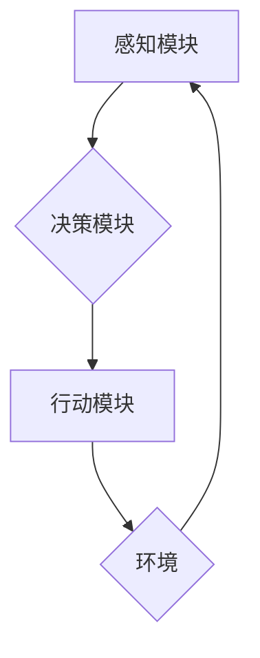

## AI Agent: AI的下一个风口 从感知到行动的过程

> 关键词：AI Agent, 强化学习, 决策推理, 感知模块, 行动模块, 智能体, 嵌入式AI, 实际应用

### 1. 背景介绍

人工智能（AI）技术近年来取得了飞速发展，从语音识别、图像识别到自然语言处理，AI已经渗透到我们生活的方方面面。然而，当前的AI技术主要集中在数据处理和模式识别上，缺乏真正的智能行为和自主决策能力。

AI Agent作为AI领域的新兴方向，旨在构建能够感知环境、理解信息、制定决策并执行行动的智能体。它将AI技术与现实世界紧密结合，赋予AI更强的自主性和适应性，从而推动AI技术向更高级的智能迈进。

### 2. 核心概念与联系

AI Agent是一个智能体，它通过感知环境、理解信息、制定决策并执行行动来实现目标。

**AI Agent 的核心概念包括：**

* **感知模块:** 收集环境信息，例如图像、声音、文本等。
* **决策模块:** 分析感知到的信息，制定最佳行动策略。
* **行动模块:** 执行决策，与环境进行交互。
* **目标:** AI Agent 的行动目标，例如完成任务、获得奖励等。
* **环境:** AI Agent 所处的外部世界，包括物理环境和信息环境。

**AI Agent 的工作流程:**



**AI Agent 与其他AI技术的关系:**

* **机器学习:** AI Agent 可以利用机器学习算法进行感知信息处理和决策优化。
* **深度学习:** 深度学习算法可以帮助AI Agent更好地理解复杂环境和信息。
* **自然语言处理:** 自然语言处理技术可以使AI Agent能够理解和生成人类语言，从而与人类进行更自然的交互。

### 3. 核心算法原理 & 具体操作步骤

**3.1 算法原理概述**

AI Agent 的核心算法主要包括强化学习、决策树、贝叶斯网络等。

* **强化学习:**  AI Agent 通过与环境交互，学习最优的行动策略，以最大化累积奖励。
* **决策树:**  根据环境信息，构建决策树模型，选择最优的行动路径。
* **贝叶斯网络:**  利用概率模型，分析环境信息之间的关系，预测未来事件并做出决策。

**3.2 算法步骤详解**

以强化学习为例，其核心步骤包括：

1. **环境建模:** 建立环境模型，描述环境状态、行动和奖励机制。
2. **策略选择:**  AI Agent 选择行动策略，例如贪婪策略、探索策略等。
3. **环境交互:**  AI Agent 执行行动，感知环境反馈，获得奖励或惩罚。
4. **策略更新:**  根据环境反馈，更新AI Agent 的行动策略，使其朝着最大化奖励的方向发展。

**3.3 算法优缺点**

* **强化学习:** 优点：能够学习复杂环境下的最优策略，适应性强。缺点：训练时间长，数据需求大。
* **决策树:** 优点：易于理解和实现，可解释性强。缺点：容易过拟合，难以处理复杂决策问题。
* **贝叶斯网络:** 优点：能够处理不确定性，预测未来事件。缺点：模型构建复杂，数据需求大。

**3.4 算法应用领域**

* **机器人控制:**  使机器人能够自主导航、避障、抓取物体等。
* **游戏AI:**  开发更智能的游戏对手，提高游戏体验。
* **推荐系统:**  根据用户行为，推荐个性化商品或服务。
* **医疗诊断:**  辅助医生诊断疾病，提高诊断准确率。

### 4. 数学模型和公式 & 详细讲解 & 举例说明

**4.1 数学模型构建**

强化学习的数学模型通常使用马尔可夫决策过程（MDP）来描述。

MDP 包含以下要素：

* **状态空间 S:** 环境可能存在的全部状态。
* **行动空间 A:** AI Agent 可以执行的全部行动。
* **状态转移概率 P(s'|s,a):** 从状态 s 执行行动 a 后，转移到状态 s' 的概率。
* **奖励函数 R(s,a):**  在状态 s 执行行动 a 后获得的奖励。
* **折扣因子 γ:**  未来奖励的权重。

**4.2 公式推导过程**

强化学习的目标是找到最优策略 π(s)，使得AI Agent 在所有状态下获得最大的累积奖励。

最优策略可以通过贝尔曼方程来求解：

$$
V^*(s) = \max_a \sum_{s'} P(s'|s,a) [R(s,a) + \gamma V^*(s')]
$$

其中，V*(s) 表示状态 s 的最优价值函数。

**4.3 案例分析与讲解**

例如，一个简单的强化学习问题是训练一个AI Agent 学习玩一个简单的游戏，例如贪吃蛇。

* **状态空间:** 游戏中的蛇的位置和食物的位置。
* **行动空间:** 蛇可以向四个方向移动。
* **状态转移概率:**  取决于蛇的移动方向和游戏规则。
* **奖励函数:**  当蛇吃到食物时获得奖励，当蛇撞到墙壁或自己身体时惩罚。

通过强化学习算法，AI Agent 可以学习到最优的移动策略，从而获得尽可能高的分数。

### 5. 项目实践：代码实例和详细解释说明

**5.1 开发环境搭建**

* Python 3.x
* TensorFlow 或 PyTorch 等深度学习框架
* OpenAI Gym 等强化学习库

**5.2 源代码详细实现**

```python
import gym
import tensorflow as tf

# 定义环境
env = gym.make('CartPole-v1')

# 定义神经网络模型
model = tf.keras.models.Sequential([
    tf.keras.layers.Dense(128, activation='relu', input_shape=(4,)),
    tf.keras.layers.Dense(64, activation='relu'),
    tf.keras.layers.Dense(2, activation='softmax')
])

# 定义损失函数和优化器
optimizer = tf.keras.optimizers.Adam()
loss_fn = tf.keras.losses.CategoricalCrossentropy()

# 训练循环
for episode in range(1000):
    state = env.reset()
    done = False
    total_reward = 0

    while not done:
        # 获取模型预测
        action_probs = model(tf.expand_dims(state, axis=0))
        action = tf.random.categorical(tf.math.log(action_probs), num_samples=1)[0, 0]

        # 执行行动
        next_state, reward, done, _ = env.step(action)

        # 更新状态
        state = next_state

        # 计算总奖励
        total_reward += reward

    # 更新模型参数
    with tf.GradientTape() as tape:
        loss = loss_fn(tf.one_hot(action, depth=2), action_probs)
    gradients = tape.gradient(loss, model.trainable_variables)
    optimizer.apply_gradients(zip(gradients, model.trainable_variables))

    # 打印训练进度
    print(f'Episode: {episode}, Total Reward: {total_reward}')

# 保存模型
model.save('cartpole_model.h5')
```

**5.3 代码解读与分析**

* 代码首先定义了环境和神经网络模型。
* 然后，代码定义了损失函数和优化器，用于训练模型。
* 训练循环中，AI Agent 与环境交互，根据环境反馈更新模型参数。
* 最后，代码保存了训练好的模型。

**5.4 运行结果展示**

训练完成后，AI Agent 可以成功控制小车平衡木杆，获得较高的奖励。

### 6. 实际应用场景

**6.1 智能机器人**

AI Agent 可以赋予机器人自主决策能力，使其能够在复杂环境中导航、避障、抓取物体等。例如，在物流仓库中，AI Agent 可以控制机器人自动搬运货物，提高效率和准确性。

**6.2 自动驾驶汽车**

AI Agent 可以帮助自动驾驶汽车感知周围环境、预测道路状况、做出安全驾驶决策。例如，AI Agent 可以识别交通信号灯、避开障碍物、调整车速等。

**6.3 个性化推荐系统**

AI Agent 可以根据用户的行为数据，学习用户的喜好，推荐个性化的商品或服务。例如，电商平台可以利用AI Agent 建立个性化推荐系统，提高用户购物体验。

**6.4 医疗诊断辅助系统**

AI Agent 可以辅助医生诊断疾病，提高诊断准确率。例如，AI Agent 可以分析患者的病历、检查结果、影像数据等，并给出诊断建议。

**6.5 未来应用展望**

随着AI技术的发展，AI Agent 的应用场景将更加广泛，例如：

* **虚拟助手:**  更智能、更自然的虚拟助手，能够理解用户的复杂指令，并提供更精准的帮助。
* **教育机器人:**  能够根据学生的学习进度和特点，提供个性化的学习指导和帮助。
* **金融风险管理:**  能够分析市场数据，预测金融风险，帮助金融机构进行风险控制。

### 7. 工具和资源推荐

**7.1 学习资源推荐**

* **书籍:**
    * Reinforcement Learning: An Introduction by Richard S. Sutton and Andrew G. Barto
    * Deep Reinforcement Learning Hands-On by Maxim Lapan
* **在线课程:**
    * Coursera: Reinforcement Learning Specialization
    * Udacity: Deep Reinforcement Learning Nanodegree

**7.2 开发工具推荐**

* **Python:**  主流的AI开发语言
* **TensorFlow:**  开源深度学习框架
* **PyTorch:**  开源深度学习框架
* **OpenAI Gym:**  强化学习库

**7.3 相关论文推荐**

* Deep Q-Network (DQN)
* Proximal Policy Optimization (PPO)
* Trust Region Policy Optimization (TRPO)

### 8. 总结：未来发展趋势与挑战

**8.1 研究成果总结**

近年来，AI Agent 领域取得了显著进展，例如：

* 强化学习算法取得了突破性进展，能够解决更复杂的任务。
* 深度学习技术被广泛应用于AI Agent 的感知模块和决策模块。
* AI Agent 的应用场景不断扩展，覆盖了多个领域。

**8.2 未来发展趋势**

* **更强大的算法:**  开发更强大的强化学习算法，能够学习更复杂的环境和任务。
* **更安全的AI Agent:**  研究AI Agent 的安全性问题，确保其在实际应用中能够安全可靠地运行。
* **更广泛的应用:**  将AI Agent 应用到更多领域，例如医疗、教育、金融等。

**8.3 面临的挑战**

* **数据需求:**  强化学习算法需要大量的训练数据，获取高质量的训练数据仍然是一个挑战。
* **计算资源:**  训练大型AI Agent 模型需要大量的计算资源，成本较高。
* **伦理问题:**  AI Agent 的发展也带来了一些伦理问题，例如责任归属、数据隐私等，需要引起重视和讨论。

**8.4 研究展望**

未来，AI Agent 领域将继续朝着更智能、更安全、更广泛应用的方向发展。

### 9. 附录：常见问题与解答

**9.1 如何选择合适的强化学习算法？**

选择合适的强化学习算法取决于具体的应用场景和任务特点。例如，对于离散动作空间的任务，可以使用Q-learning算法；对于连续动作空间的任务，可以使用策略梯度算法。

**9.2 如何解决AI Agent过拟合问题？**

过拟合问题可以通过以下方法解决：

* 增加训练数据量
* 使用正则化技术
* 使用交叉验证方法

**9.3 如何评估AI Agent的性能？**

AI Agent 的性能可以通过奖励函数、成功率、平均回报等