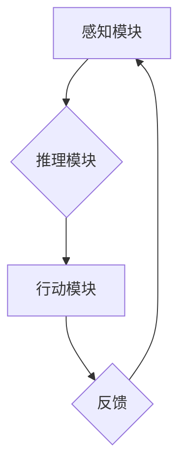

## AI Agent: AI的下一个风口 当前的研究难点与挑战

> 关键词：AI Agent, 智能代理, 强化学习, 决策推理, 自然语言理解, 知识图谱, 伦理问题

### 1. 背景介绍

人工智能（AI）技术近年来取得了飞速发展，从语音识别、图像识别到自然语言处理等领域取得了突破性进展。然而，传统的AI模型大多是针对特定任务设计的，缺乏泛化能力和自主学习能力。 

智能代理（AI Agent）作为AI领域的新兴方向，旨在构建能够自主感知环境、做出决策并与环境交互的智能实体。与传统的AI模型相比，AI Agent更加注重智能体的自主性和适应性，能够在复杂、动态的环境中进行学习和决策，从而更接近人类的智能行为模式。

### 2. 核心概念与联系

**2.1  智能代理的概念**

智能代理是一个能够感知环境、做出决策并与环境交互的软件实体。它通常具有以下特征：

* **自主性:** 智能代理能够独立地感知环境信息、制定决策并执行行动。
* **适应性:** 智能代理能够根据环境变化调整其行为策略，以实现目标。
* **学习能力:** 智能代理能够从经验中学习，不断改进其决策能力。
* **交互性:** 智能代理能够与其他代理或用户进行交互，协同完成任务。

**2.2  智能代理的架构**

智能代理通常由以下几个主要模块组成：

* **感知模块:** 用于获取环境信息，例如传感器数据、用户输入等。
* **推理模块:** 用于分析环境信息、制定决策和规划行动。
* **行动模块:** 用于执行决策，与环境进行交互。
* **学习模块:** 用于从经验中学习，改进决策策略。

**2.3  Mermaid 流程图**



**2.4  智能代理与其他AI技术的联系**

智能代理与其他AI技术密切相关，例如：

* **机器学习:** 智能代理的学习模块通常基于机器学习算法，例如强化学习、监督学习等。
* **自然语言处理:** 智能代理需要理解和处理自然语言信息，因此需要结合自然语言处理技术。
* **知识图谱:** 智能代理可以利用知识图谱存储和推理知识，提高其决策能力。

### 3. 核心算法原理 & 具体操作步骤

**3.1  算法原理概述**

强化学习是训练智能代理的核心算法之一。它基于“奖励机制”，通过不断与环境交互，学习最优的行动策略。

**3.2  算法步骤详解**

1. **环境建模:** 建立一个模拟真实世界的环境模型，包括状态空间、动作空间和奖励函数。
2. **代理初始化:** 初始化智能代理，赋予其初始策略和参数。
3. **环境交互:** 智能代理与环境交互，根据当前状态选择动作，并获得环境的反馈信息，包括下一个状态和奖励值。
4. **策略更新:** 根据获得的反馈信息，更新智能代理的策略参数，使其在未来能够选择更优的动作。
5. **重复步骤3-4:** 重复以上步骤，直到智能代理的策略收敛，能够在环境中获得最大奖励。

**3.3  算法优缺点**

* **优点:** 能够学习复杂、动态的环境，并找到最优的策略。
* **缺点:** 训练过程可能需要大量的时间和资源，并且容易陷入局部最优解。

**3.4  算法应用领域**

强化学习在许多领域都有广泛的应用，例如：

* **游戏AI:** 训练游戏中的AI对手，使其能够与人类玩家进行对抗。
* **机器人控制:** 训练机器人完成各种任务，例如导航、抓取等。
* **推荐系统:** 建立个性化的推荐系统，推荐用户感兴趣的内容。

### 4. 数学模型和公式 & 详细讲解 & 举例说明

**4.1  数学模型构建**

智能代理的决策过程可以建模为马尔可夫决策过程（MDP）。

MDP由以下几个要素组成：

* **状态空间 (S):** 环境可能存在的各种状态。
* **动作空间 (A):** 智能代理可以执行的动作集合。
* **转移概率 (P):** 从一个状态执行一个动作后转移到另一个状态的概率。
* **奖励函数 (R):** 智能代理在某个状态执行某个动作后获得的奖励值。
* **策略 (π):** 智能代理在每个状态选择动作的策略。

**4.2  公式推导过程**

智能代理的目标是找到最优策略，使得其在长期的交互过程中获得最大的总奖励。

最优策略可以用价值函数来表示，价值函数表示从某个状态开始执行某个策略的期望总奖励。

价值函数的更新公式为：

$$V(s) = \max_a \sum_{s'} P(s'|s,a) [R(s,a,s') + \gamma V(s')]$$

其中：

* $V(s)$ 是状态 $s$ 的价值函数。
* $a$ 是智能代理可以执行的动作。
* $s'$ 是状态 $s$ 执行动作 $a$ 后可能转移到的状态。
* $P(s'|s,a)$ 是从状态 $s$ 执行动作 $a$ 后转移到状态 $s'$ 的概率。
* $R(s,a,s')$ 是在状态 $s$ 执行动作 $a$ 后转移到状态 $s'$ 获得的奖励值。
* $\gamma$ 是折扣因子，控制未来奖励的权重。

**4.3  案例分析与讲解**

例如，训练一个智能代理玩游戏，我们可以将游戏状态定义为游戏中的棋盘布局，动作定义为玩家可以执行的棋步，奖励函数定义为玩家获得的分数。

通过强化学习算法，智能代理可以不断学习，找到最优的棋步策略，从而获得更高的分数。

### 5. 项目实践：代码实例和详细解释说明

**5.1  开发环境搭建**

* Python 3.x
* TensorFlow 或 PyTorch 等深度学习框架
* OpenAI Gym 等强化学习环境

**5.2  源代码详细实现**

```python
import gym
import tensorflow as tf

# 定义环境
env = gym.make('CartPole-v1')

# 定义神经网络模型
model = tf.keras.Sequential([
    tf.keras.layers.Dense(128, activation='relu'),
    tf.keras.layers.Dense(env.action_space.n)
])

# 定义损失函数和优化器
optimizer = tf.keras.optimizers.Adam()
loss_fn = tf.keras.losses.SparseCategoricalCrossentropy()

# 训练循环
for episode in range(1000):
    state = env.reset()
    done = False
    total_reward = 0

    while not done:
        # 选择动作
        action = model.predict(state[None, :])[0]
        action = tf.argmax(action).numpy()

        # 执行动作
        next_state, reward, done, _ = env.step(action)

        # 更新状态
        state = next_state

        # 计算损失
        with tf.GradientTape() as tape:
            predictions = model(state[None, :])
            loss = loss_fn(tf.one_hot(action, depth=env.action_space.n), predictions)

        # 反向传播
        gradients = tape.gradient(loss, model.trainable_variables)
        optimizer.apply_gradients(zip(gradients, model.trainable_variables))

        # 更新总奖励
        total_reward += reward

    print(f"Episode {episode+1}, Total Reward: {total_reward}")

```

**5.3  代码解读与分析**

* 代码首先定义了环境和神经网络模型。
* 然后，代码定义了损失函数和优化器，用于训练神经网络模型。
* 训练循环中，智能代理与环境交互，选择动作，执行动作，并根据环境的反馈信息更新模型参数。
* 最后，代码打印了每个episode的总奖励，用于评估模型的训练效果。

**5.4  运行结果展示**

训练完成后，智能代理能够在环境中完成任务，例如控制小车保持平衡。

### 6. 实际应用场景

**6.1  智能客服**

AI Agent可以作为智能客服，通过自然语言理解技术，理解用户的需求，并提供相应的帮助。

**6.2  个性化推荐**

AI Agent可以根据用户的历史行为和偏好，推荐个性化的商品、服务或内容。

**6.3  自动驾驶**

AI Agent可以作为自动驾驶系统的核心，感知周围环境，做出决策，控制车辆行驶。

**6.4  未来应用展望**

AI Agent在未来将有更广泛的应用场景，例如：

* **医疗保健:** AI Agent可以辅助医生诊断疾病、制定治疗方案。
* **教育:** AI Agent可以作为个性化学习助手，根据学生的学习进度和能力提供定制化的学习内容。
* **金融:** AI Agent可以用于风险管理、欺诈检测等金融领域。

### 7. 工具和资源推荐

**7.1  学习资源推荐**

* **书籍:**
    * Reinforcement Learning: An Introduction by Richard S. Sutton and Andrew G. Barto
    * Artificial Intelligence: A Modern Approach by Stuart Russell and Peter Norvig
* **在线课程:**
    * Coursera: Reinforcement Learning Specialization
    * Udacity: Intro to Artificial Intelligence

**7.2  开发工具推荐**

* **TensorFlow:** https://www.tensorflow.org/
* **PyTorch:** https://pytorch.org/
* **OpenAI Gym:** https://gym.openai.com/

**7.3  相关论文推荐**

* Deep Reinforcement Learning with Double Q-learning
* Proximal Policy Optimization Algorithms
* Asynchronous Methods for Deep Reinforcement Learning

### 8. 总结：未来发展趋势与挑战

**8.1  研究成果总结**

近年来，AI Agent领域取得了显著进展，例如：

* 强化学习算法取得了突破性进展，能够训练出更智能的代理。
* 自然语言理解技术不断发展，使得AI Agent能够更好地理解和交互人类语言。
* 知识图谱技术应用于AI Agent，提高其决策能力和知识推理能力。

**8.2  未来发展趋势**

* **更强大的学习能力:** 研究更有效的学习算法，使AI Agent能够更快、更有效地学习。
* **更复杂的决策推理:** 研究更高级的决策推理方法，使AI Agent能够处理更复杂、更动态的环境。
* **更强的解释性:** 研究使AI Agent决策过程更透明、可解释的方法，提高用户对AI Agent的信任。
* **更安全的AI Agent:** 研究确保AI Agent安全可靠的运行方法，避免其被恶意利用。

**8.3  面临的挑战**

* **数据获取和标注:** 训练AI Agent需要大量的数据，获取和标注这些数据成本高昂。
* **算法复杂度:** 强化学习算法通常非常复杂，难以理解和调试。
* **伦理问题:** AI Agent的自主性可能会带来伦理问题，例如责任归属、偏见等。

**8.4  研究展望**

AI Agent是人工智能领域的一个重要方向，未来将有更多的研究和应用。

我们需要不断探索新的算法、技术和方法，克服面临的挑战，最终实现AI Agent的真正智能化。

### 9. 附录：常见问题与解答

**9.1  什么是强化学习？**

强化学习是一种机器学习方法，通过奖励机制训练智能体，使其在环境中学习最优策略。

**9.2  AI Agent与机器人有什么区别？**

AI Agent是一个更抽象的概念，它可以是一个软件实体，也可以是一个物理机器人。机器人是AI Agent的一种具体实现形式。

**9.3  如何评估AI Agent的性能？**

AI Agent的性能通常通过奖励函数来评估，奖励函数定义了智能体在不同状态下获得的奖励值。

