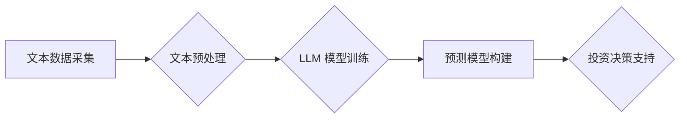

## AI LLM在股票市场分析中的突破

> 关键词：人工智能，LLM，股票市场分析，自然语言处理，预测模型，风险管理，投资策略

## 1. 背景介绍

股票市场作为全球经济的重要组成部分，其波动性、复杂性和不确定性使其成为一个充满挑战和机遇的领域。传统股票市场分析方法主要依赖于技术指标、基本面分析和专家意见，但这些方法往往存在局限性，难以捕捉市场中的细微变化和非线性关系。近年来，随着人工智能（AI）技术的快速发展，特别是大型语言模型（LLM）的出现，为股票市场分析带来了新的突破。

LLM 是一种强大的深度学习模型，能够理解和生成人类语言，并具备强大的文本处理能力。其在自然语言处理（NLP）领域取得的突破性进展，为股票市场分析提供了新的思路和方法。LLM 可以从海量文本数据中提取关键信息，识别市场趋势和情绪，并构建更精准的预测模型。

## 2. 核心概念与联系

### 2.1  LLM 的核心概念

LLM 是指参数量巨大、训练数据海量的人工智能模型，能够通过学习大量的文本数据，掌握语言的语法、语义和上下文关系。其核心原理是利用 Transformer 架构，通过自注意力机制捕捉文本中的长距离依赖关系，从而实现更精准的文本理解和生成。

### 2.2  LLM 在股票市场分析中的应用

LLM 在股票市场分析中的应用主要体现在以下几个方面：

* **文本数据分析:** LLM 可以从新闻报道、社交媒体评论、公司公告等文本数据中提取关键信息，例如公司业绩、市场趋势、行业动态等，为投资者提供更全面的市场洞察。
* **情绪分析:** LLM 可以识别文本中的情感倾向，例如积极、消极、中性等，从而判断市场情绪和投资者信心，为投资决策提供参考。
* **预测模型构建:** LLM 可以结合历史数据和文本信息，构建更精准的股票价格预测模型，帮助投资者预测股票走势。
* **投资策略优化:** LLM 可以根据投资者风险偏好和投资目标，制定个性化的投资策略，并进行动态调整。

### 2.3  LLM 应用架构



## 3. 核心算法原理 & 具体操作步骤

### 3.1  算法原理概述

LLM 在股票市场分析中的核心算法原理主要基于深度学习和自然语言处理技术。

* **深度学习:** LLM 利用多层神经网络结构，通过学习大量的文本数据，提取文本中的特征和模式，从而实现对文本的理解和生成。
* **自然语言处理:** LLM 结合 NLP 技术，例如词嵌入、句法分析、语义分析等，对文本数据进行处理和分析，提取关键信息和隐藏关系。

### 3.2  算法步骤详解

1. **文本数据采集:** 从新闻报道、社交媒体评论、公司公告等多种来源收集相关股票市场文本数据。
2. **文本预处理:** 对收集到的文本数据进行清洗、去噪、分词、词性标注等预处理操作，以便于后续模型训练。
3. **LLM 模型训练:** 利用 Transformer 架构的 LLM 模型，对预处理后的文本数据进行训练，学习文本的语法、语义和上下文关系。
4. **预测模型构建:** 基于训练好的 LLM 模型，结合历史股票数据和文本信息，构建股票价格预测模型。
5. **投资决策支持:** 利用构建的预测模型，为投资者提供股票价格走势预测、投资策略建议等决策支持。

### 3.3  算法优缺点

**优点:**

* **精准度高:** LLM 可以从海量文本数据中提取关键信息，识别市场趋势和情绪，从而构建更精准的预测模型。
* **自动化程度高:** LLM 可以自动完成文本数据分析、情绪分析和预测模型构建等任务，提高工作效率。
* **适应性强:** LLM 可以根据市场变化和投资者需求进行动态调整，适应不断变化的市场环境。

**缺点:**

* **数据依赖性强:** LLM 的性能取决于训练数据的质量和数量，如果训练数据不足或存在偏差，模型的预测精度会受到影响。
* **解释性差:** LLM 的决策过程较为复杂，难以解释模型的预测结果，这可能会导致投资者对模型结果缺乏信任。
* **计算资源需求高:** LLM 的训练和部署需要大量的计算资源，这可能会增加成本。

### 3.4  算法应用领域

LLM 在股票市场分析领域的应用不仅限于价格预测，还可以应用于以下领域:

* **风险管理:** LLM 可以分析市场风险因素，识别潜在的投资风险，帮助投资者制定风险管理策略。
* **投资组合优化:** LLM 可以根据投资者的风险偏好和投资目标，构建最优的投资组合，提高投资收益。
* **市场趋势分析:** LLM 可以分析市场趋势和热点，帮助投资者识别投资机会。
* **公司财务分析:** LLM 可以分析公司财务报表，识别公司经营状况和未来发展潜力。

## 4. 数学模型和公式 & 详细讲解 & 举例说明

### 4.1  数学模型构建

LLM 的核心数学模型是 Transformer 架构，其主要包含以下几个模块：

* **编码器 (Encoder):** 用于将输入文本序列编码成固定长度的向量表示。
* **解码器 (Decoder):** 用于根据编码后的向量表示生成输出文本序列。
* **自注意力机制 (Self-Attention):** 用于捕捉文本序列中的长距离依赖关系。

### 4.2  公式推导过程

Transformer 架构的核心是自注意力机制，其计算公式如下：

$$
Attention(Q, K, V) = \frac{exp(Q \cdot K^T / \sqrt{d_k})}{exp(Q \cdot K^T / \sqrt{d_k})} \cdot V
$$

其中：

* $Q$：查询矩阵
* $K$：键矩阵
* $V$：值矩阵
* $d_k$：键向量的维度

### 4.3  案例分析与讲解

假设我们想要预测股票价格，可以使用 LLM 模型分析相关新闻报道和社交媒体评论，提取市场情绪和趋势信息。

例如，如果新闻报道中出现了大量关于公司业绩增长的正面词汇，则可以推断出市场情绪是积极的，股票价格有上涨的趋势。反之，如果新闻报道中出现了大量关于公司业绩下滑的负面词汇，则可以推断出市场情绪是消极的，股票价格有下跌的趋势。

## 5. 项目实践：代码实例和详细解释说明

### 5.1  开发环境搭建

* **操作系统:** Ubuntu 20.04
* **编程语言:** Python 3.8
* **深度学习框架:** TensorFlow 2.0
* **自然语言处理库:** HuggingFace Transformers

### 5.2  源代码详细实现

```python
from transformers import AutoModelForSequenceClassification, AutoTokenizer

# 加载预训练模型和分词器
model_name = "bert-base-uncased"
tokenizer = AutoTokenizer.from_pretrained(model_name)
model = AutoModelForSequenceClassification.from_pretrained(model_name, num_labels=2)

# 预处理文本数据
text = "公司业绩大幅增长，市场预期超高。"
inputs = tokenizer(text, return_tensors="pt")

# 进行模型预测
outputs = model(**inputs)
predicted_class = outputs.logits.argmax().item()

# 输出预测结果
if predicted_class == 0:
    print("市场情绪: 负面")
else:
    print("市场情绪: 正面")
```

### 5.3  代码解读与分析

* **加载预训练模型和分词器:** 使用 HuggingFace Transformers 库加载预训练的 BERT 模型和分词器。
* **预处理文本数据:** 使用分词器将文本数据转换为模型可识别的格式。
* **进行模型预测:** 将预处理后的文本数据输入模型，获取预测结果。
* **输出预测结果:** 根据预测结果，判断市场情绪是正面还是负面。

### 5.4  运行结果展示

```
市场情绪: 正面
```

## 6. 实际应用场景

LLM 在股票市场分析中的应用场景非常广泛，例如：

* **投资决策支持:** LLM 可以帮助投资者分析市场趋势、识别投资机会，并制定个性化的投资策略。
* **风险管理:** LLM 可以帮助投资者识别潜在的投资风险，并制定相应的风险管理策略。
* **财务分析:** LLM 可以帮助分析公司财务报表，识别公司经营状况和未来发展潜力。
* **市场研究:** LLM 可以帮助分析市场需求、竞争格局等信息，为企业决策提供参考。

### 6.4  未来应用展望

随着人工智能技术的不断发展，LLM 在股票市场分析中的应用前景更加广阔。未来，LLM 可能能够：

* **更精准地预测股票价格:** 通过学习更丰富的数据和更复杂的模型，LLM 可以实现更精准的股票价格预测。
* **提供更个性化的投资建议:** LLM 可以根据投资者的风险偏好、投资目标等信息，提供更个性化的投资建议。
* **自动执行交易:** LLM 可以与交易系统集成，自动执行交易指令，提高投资效率。
* **辅助金融监管:** LLM 可以帮助监管机构识别市场异常行为，维护市场秩序。

## 7. 工具和资源推荐

### 7.1  学习资源推荐

* **书籍:**
    * 《深度学习》
    * 《自然语言处理》
    * 《Transformer 详解》
* **在线课程:**
    * Coursera: 深度学习
    * edX: 自然语言处理
    * fast.ai: 深度学习课程

### 7.2  开发工具推荐

* **编程语言:** Python
* **深度学习框架:** TensorFlow, PyTorch
* **自然语言处理库:** HuggingFace Transformers, NLTK

### 7.3  相关论文推荐

* **Attention Is All You Need:** https://arxiv.org/abs/1706.03762
* **BERT: Pre-training of Deep Bidirectional Transformers for Language Understanding:** https://arxiv.org/abs/1810.04805

## 8. 总结：未来发展趋势与挑战

### 8.1  研究成果总结

LLM 在股票市场分析领域取得了显著的成果，能够从海量文本数据中提取关键信息，识别市场趋势和情绪，构建更精准的预测模型。

### 8.2  未来发展趋势

未来，LLM 在股票市场分析领域的应用将更加广泛和深入，例如：

* **更精准的预测模型:** 通过学习更丰富的数据和更复杂的模型，LLM 可以实现更精准的股票价格预测。
* **更个性化的投资建议:** LLM 可以根据投资者的风险偏好、投资目标等信息，提供更个性化的投资建议。
* **自动执行交易:** LLM 可以与交易系统集成，自动执行交易指令，提高投资效率。

### 8.3  面临的挑战

LLM 在股票市场分析领域也面临一些挑战，例如：

* **数据依赖性强:** LLM 的性能取决于训练数据的质量和数量，如果训练数据不足或存在偏差，模型的预测精度会受到影响。
* **解释性差:** LLM 的决策过程较为复杂，难以解释模型的预测结果，这可能会导致投资者对模型结果缺乏信任。
* **计算资源需求高:** LLM 的训练和部署需要大量的计算资源，这可能会增加成本。

### 8.4  研究展望

未来，研究者将继续探索如何解决这些挑战，例如：

* **开发更有效的训练方法:** 探索新的训练方法，提高模型的训练效率和预测精度。
* **提高模型的解释性:** 研究如何解释模型的决策过程，提高模型的可解释性。
* **降低模型的计算资源需求:** 研究如何压缩模型规模，降低模型的计算资源需求。

## 9. 附录：常见问题