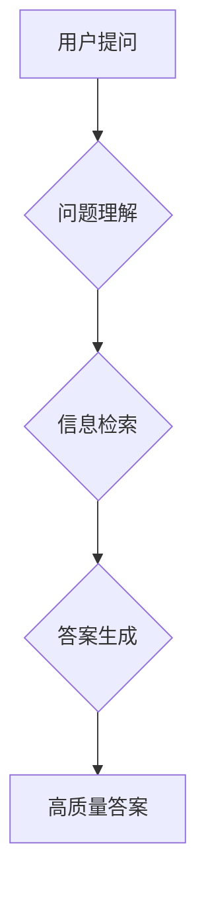

## AIGC从入门到实战：进阶：如何提问以获得高质量答案，解决复杂问题

> 关键词：AIGC, 自然语言处理, 问题提问, 答案质量, 复杂问题解决,  模型理解,  信息检索,  提示工程

### 1. 背景介绍

近年来，人工智能生成内容（AIGC）技术取得了飞速发展，从简单的文本生成到复杂的代码编写、图像创作、视频制作等领域都展现出强大的能力。其中，自然语言处理（NLP）作为AIGC的核心技术之一，在理解和生成人类语言方面取得了突破性进展。

AIGC模型，例如ChatGPT、LaMDA等，能够通过学习海量文本数据，掌握语言的语法、语义和上下文关系，从而生成流畅、自然的文本内容。然而，AIGC模型的性能很大程度上取决于用户提出的问题。一个清晰、准确、完整的提问能够帮助模型更好地理解用户意图，从而生成更高质量、更符合用户需求的答案。

反之，一个模糊、含糊、不完整的提问可能会导致模型产生误解，生成无关或错误的答案。因此，如何有效提问，以获得高质量的AIGC答案，是AIGC应用中至关重要的一环。

### 2. 核心概念与联系

**2.1 核心概念**

* **AIGC (人工智能生成内容):** 利用人工智能技术自动生成各种内容，包括文本、图像、音频、视频等。
* **NLP (自然语言处理):** 使计算机能够理解、处理和生成人类语言的技术领域。
* **语言模型:** 基于深度学习算法训练的模型，能够预测文本序列中的下一个词，并生成流畅、自然的文本。
* **问题理解:** AIGC模型理解用户提出的问题，识别关键信息和意图。
* **信息检索:** AIGC模型根据问题理解结果，从知识库或海量文本数据中检索相关信息。
* **答案生成:** AIGC模型根据检索到的信息，生成符合用户需求的答案。

**2.2  架构流程图**



### 3. 核心算法原理 & 具体操作步骤

**3.1 算法原理概述**

AIGC模型通常基于Transformer架构，利用自注意力机制学习语言的上下文关系，从而实现更准确的文本理解和生成。

**3.2 算法步骤详解**

1. **预处理:** 将用户提问进行文本预处理，例如分词、词性标注、去除停用词等，以便模型更好地理解问题内容。
2. **编码:** 将预处理后的文本转换为数字向量，以便模型进行计算处理。
3. **解码:** 根据编码后的向量，模型预测问题的答案，并将其转换为文本形式。
4. **后处理:** 对生成的答案进行语法检查、流畅度调整等后处理，以提高答案的质量。

**3.3 算法优缺点**

* **优点:** 能够生成流畅、自然的文本，并具备一定的理解能力。
* **缺点:** 仍然存在理解复杂问题和生成准确答案的局限性，容易受到训练数据的影响。

**3.4 算法应用领域**

* **聊天机器人:** 提供自然、人性化的对话体验。
* **文本摘要:** 自动生成文本的简要概述。
* **机器翻译:** 将文本从一种语言翻译成另一种语言。
* **代码生成:** 根据自然语言描述自动生成代码。

### 4. 数学模型和公式 & 详细讲解 & 举例说明

**4.1 数学模型构建**

AIGC模型通常采用Transformer架构，其核心是自注意力机制。自注意力机制能够学习文本序列中每个词与其他词之间的关系，从而更好地理解上下文信息。

**4.2 公式推导过程**

自注意力机制的计算公式如下：

$$
Attention(Q, K, V) = softmax(\frac{QK^T}{\sqrt{d_k}})V
$$

其中：

* $Q$：查询矩阵
* $K$：键矩阵
* $V$：值矩阵
* $d_k$：键向量的维度
* $softmax$：softmax函数，用于归一化注意力权重

**4.3 案例分析与讲解**

例如，在翻译句子“The cat sat on the mat”时，自注意力机制能够学习到“cat”与“sat”之间的关系，以及“sat”与“on”之间的关系，从而更好地理解句子的含义。

### 5. 项目实践：代码实例和详细解释说明

**5.1 开发环境搭建**

* Python 3.7+
* TensorFlow 或 PyTorch
* CUDA 和 cuDNN (可选，用于GPU加速)

**5.2 源代码详细实现**

```python
import tensorflow as tf

# 定义Transformer模型
class Transformer(tf.keras.Model):
    def __init__(self, vocab_size, embedding_dim, num_heads, num_layers):
        super(Transformer, self).__init__()
        #... (模型结构定义)

    def call(self, inputs):
        #... (模型前向传播过程)

# 实例化模型
model = Transformer(vocab_size=10000, embedding_dim=512, num_heads=8, num_layers=6)

# 训练模型
model.compile(optimizer='adam', loss='mse')
model.fit(train_data, train_labels, epochs=10)

# 预测答案
answer = model.predict(user_question)
```

**5.3 代码解读与分析**

* 代码定义了一个Transformer模型，并指定了模型参数，例如词汇大小、嵌入维度、注意力头数、层数等。
* 模型的`call`方法定义了模型的前向传播过程，包括词嵌入、多头注意力、前馈网络等操作。
* 代码使用Adam优化器和均方误差损失函数训练模型。
* 训练完成后，可以使用模型预测用户提出的问题答案。

**5.4 运行结果展示**

运行代码后，模型将根据用户提问生成相应的答案。

### 6. 实际应用场景

**6.1 聊天机器人**

AIGC技术可以用于构建更智能、更自然的聊天机器人，例如客服机器人、陪伴机器人等。

**6.2 文本生成**

AIGC可以用于生成各种文本内容，例如新闻报道、小说、诗歌、剧本等。

**6.3 教育领域**

AIGC可以用于个性化学习、自动批改作业、生成学习资源等。

**6.4 未来应用展望**

AIGC技术在未来将有更广泛的应用场景，例如：

* **虚拟助手:** 更智能、更人性化的虚拟助手，能够帮助用户完成各种任务。
* **内容创作:** 更高效、更便捷的内容创作工具，例如自动生成广告文案、新闻标题等。
* **科学研究:** 辅助科学家进行数据分析、模型构建等工作。

### 7. 工具和资源推荐

**7.1 学习资源推荐**

* **书籍:**
    * 《深度学习》
    * 《自然语言处理》
* **在线课程:**
    * Coursera: 自然语言处理
    * edX: 深度学习
* **博客和论坛:**
    * Hugging Face
    * TensorFlow Blog

**7.2 开发工具推荐**

* **TensorFlow:** 开源深度学习框架
* **PyTorch:** 开源深度学习框架
* **Hugging Face Transformers:** 提供预训练的AIGC模型和工具

**7.3 相关论文推荐**

* Attention Is All You Need
* BERT: Pre-training of Deep Bidirectional Transformers for Language Understanding

### 8. 总结：未来发展趋势与挑战

**8.1 研究成果总结**

AIGC技术取得了显著进展，能够生成高质量的文本内容，并应用于多个领域。

**8.2 未来发展趋势**

* **模型规模和能力提升:** 模型参数规模将继续扩大，模型能力将进一步提升。
* **多模态生成:** AIGC模型将能够生成多种模态的内容，例如文本、图像、音频、视频等。
* **个性化定制:** AIGC模型将能够根据用户的个性化需求生成定制化的内容。

**8.3 面临的挑战**

* **数据安全和隐私:** AIGC模型的训练需要大量数据，如何保证数据安全和隐私是一个重要挑战。
* **模型可解释性:** AIGC模型的决策过程往往难以理解，如何提高模型的可解释性是一个关键问题。
* **伦理问题:** AIGC技术可能带来一些伦理问题，例如内容生成中的偏见、虚假信息传播等，需要引起重视。

**8.4 研究展望**

未来，AIGC技术将继续发展，并应用于更多领域。研究者将致力于解决上述挑战，并探索AIGC技术的更多应用场景。

### 9. 附录：常见问题与解答

**9.1 如何提高AIGC模型的答案质量？**

* 提问要清晰、准确、完整。
* 提供足够的上下文信息。
* 使用合适的关键词和语法。
* 尝试不同的提问方式。

**9.2 如何避免AIGC模型生成虚假信息？**

* 使用可靠的数据源训练模型。
* 对模型生成的答案进行验证。
* 开发检测虚假信息的算法。

**9.3 AIGC技术有哪些伦理问题？**

* 内容生成中的偏见
* 虚假信息传播
* 侵犯知识产权

作者：禅与计算机程序设计艺术 / Zen and the Art of Computer Programming 


