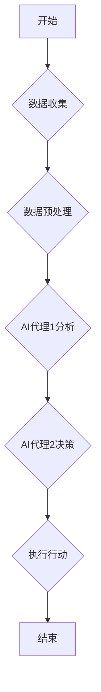

## AI人工智能代理工作流 AI Agent WorkFlow：在决策支持系统中的应用

> 关键词：人工智能代理、工作流、决策支持系统、智能自动化、机器学习、自然语言处理、流程优化

## 1. 背景介绍

随着人工智能技术的飞速发展，智能自动化已成为各行各业的热门话题。在决策支持系统领域，人工智能代理（AI Agent）作为一种智能化的决策助手，展现出巨大的潜力。AI代理能够自动学习、分析数据、识别模式，并根据预设规则或学习到的知识，为决策者提供建议和支持，从而提高决策效率和准确性。

传统的决策支持系统通常依赖于静态数据和预先定义的规则，难以应对复杂、动态的决策环境。而AI代理工作流（AI Agent WorkFlow）则通过将多个AI代理集成到一个工作流程中，能够实现更灵活、更智能的决策支持。

## 2. 核心概念与联系

### 2.1  人工智能代理（AI Agent）

人工智能代理是一种能够感知环境、做出决策并执行行动的软件实体。它通常具有以下特征：

* **自主性:** AI代理能够独立执行任务，无需人工干预。
* **学习能力:** AI代理能够从数据中学习，不断改进决策能力。
* **目标导向:** AI代理拥有明确的目标，并努力实现目标。
* **交互性:** AI代理能够与环境和用户进行交互。

### 2.2  工作流（WorkFlow）

工作流是一种描述业务流程的模型，它将一系列任务和活动连接起来，形成一个有序的执行流程。工作流通常具有以下特点：

* **可视化:** 工作流可以以图形化的方式表示，方便理解和管理。
* **可配置:** 工作流可以根据需要进行配置和调整。
* **可扩展:** 工作流可以轻松扩展，添加新的任务和活动。
* **可自动化:** 工作流可以自动化执行，提高效率。

### 2.3  AI代理工作流（AI Agent WorkFlow）

AI代理工作流将AI代理与工作流技术相结合，构建一个智能化的决策支持系统。它将多个AI代理集成到一个工作流程中，每个代理负责执行特定的任务或决策步骤。

**Mermaid 流程图**



## 3. 核心算法原理 & 具体操作步骤

### 3.1  算法原理概述

AI代理工作流的核心算法通常基于机器学习和自然语言处理技术。

* **机器学习:** AI代理可以利用机器学习算法从历史数据中学习，识别模式和趋势，从而提高决策准确性。常见的机器学习算法包括决策树、支持向量机、神经网络等。
* **自然语言处理:** AI代理可以理解和处理自然语言文本，例如用户输入的查询、文档中的信息等。自然语言处理技术可以帮助AI代理更有效地获取和分析信息。

### 3.2  算法步骤详解

1. **数据收集:** 从各种数据源收集相关数据，例如历史决策记录、市场数据、用户反馈等。
2. **数据预处理:** 对收集到的数据进行清洗、转换和格式化，使其适合AI代理的学习和分析。
3. **模型训练:** 利用机器学习算法对预处理后的数据进行训练，构建AI代理的决策模型。
4. **决策执行:** 当用户提出决策请求时，AI代理会根据训练好的模型分析数据、识别模式，并给出决策建议或执行相应的行动。
5. **结果评估:** 对AI代理的决策结果进行评估，并根据评估结果进行模型调整和优化。

### 3.3  算法优缺点

**优点:**

* **智能化:** AI代理能够自动学习和决策，提高决策效率和准确性。
* **自动化:** AI代理工作流可以自动化执行决策流程，减少人工干预。
* **可扩展性:** AI代理工作流可以轻松扩展，添加新的代理和任务。

**缺点:**

* **数据依赖:** AI代理的决策能力依赖于训练数据的质量和数量。
* **解释性:** 一些机器学习算法的决策过程难以解释，这可能导致决策缺乏透明度。
* **安全风险:** AI代理可能存在安全风险，例如被恶意攻击或产生不可预知的决策。

### 3.4  算法应用领域

AI代理工作流在各个领域都有广泛的应用，例如：

* **金融:** 投资决策、风险管理、欺诈检测
* **医疗:** 疾病诊断、治疗方案推荐、药物研发
* **制造:** 生产计划优化、设备维护、质量控制
* **电商:** 商品推荐、价格优化、客户服务

## 4. 数学模型和公式 & 详细讲解 & 举例说明

### 4.1  数学模型构建

AI代理工作流的数学模型通常基于概率论和统计学。

* **状态空间:** 定义决策问题的状态空间，即所有可能的决策状态。
* **动作空间:** 定义决策代理可以执行的动作空间，即所有可能的决策行动。
* **奖励函数:** 定义决策代理获得奖励的函数，用于评估决策的优劣。
* **转移概率:** 定义从一个状态到另一个状态的概率，取决于决策代理执行的动作。

### 4.2  公式推导过程

常见的AI代理工作流算法，例如强化学习算法，会利用Bellman方程进行决策优化。

$$
V(s) = \max_a \left[ R(s,a) + \gamma \sum_{s'} P(s'|s,a) V(s') \right]
$$

其中：

* $V(s)$ 是状态 $s$ 的价值函数。
* $R(s,a)$ 是在状态 $s$ 执行动作 $a$ 得到的奖励。
* $\gamma$ 是折扣因子，控制未来奖励的权重。
* $P(s'|s,a)$ 是从状态 $s$ 执行动作 $a$ 到状态 $s'$ 的转移概率。

### 4.3  案例分析与讲解

例如，在电商平台的商品推荐场景中，AI代理可以利用强化学习算法学习用户偏好，并根据用户的历史浏览记录、购买记录等数据，推荐最合适的商品。

在状态空间中，每个状态代表用户的当前浏览页面或商品列表。在动作空间中，AI代理可以执行“推荐商品”的动作，并根据用户的点击、购买等行为获得奖励。通过不断学习和优化，AI代理可以逐渐提高商品推荐的准确性和用户满意度。

## 5. 项目实践：代码实例和详细解释说明

### 5.1  开发环境搭建

* Python 3.x
* TensorFlow 或 PyTorch
* Jupyter Notebook

### 5.2  源代码详细实现

```python
# 导入必要的库
import tensorflow as tf

# 定义神经网络模型
model = tf.keras.models.Sequential([
    tf.keras.layers.Dense(64, activation='relu', input_shape=(10,)),
    tf.keras.layers.Dense(32, activation='relu'),
    tf.keras.layers.Dense(1, activation='sigmoid')
])

# 编译模型
model.compile(optimizer='adam', loss='binary_crossentropy', metrics=['accuracy'])

# 训练模型
model.fit(X_train, y_train, epochs=10)

# 评估模型
loss, accuracy = model.evaluate(X_test, y_test)
print('Loss:', loss)
print('Accuracy:', accuracy)
```

### 5.3  代码解读与分析

这段代码展示了如何使用TensorFlow构建一个简单的分类模型。

* 首先，导入必要的库。
* 然后，定义一个神经网络模型，包含三个全连接层。
* 接着，编译模型，指定优化器、损失函数和评估指标。
* 接下来，训练模型，使用训练数据进行迭代训练。
* 最后，评估模型，使用测试数据计算模型的损失和准确率。

### 5.4  运行结果展示

训练完成后，可以查看模型的损失和准确率，评估模型的性能。

## 6. 实际应用场景

AI代理工作流在决策支持系统中的应用场景非常广泛，例如：

* **金融风险管理:** AI代理可以分析市场数据、客户信息等，识别潜在的风险，并建议相应的风险控制措施。
* **医疗诊断辅助:** AI代理可以辅助医生诊断疾病，根据患者的症状、检查结果等数据，提供可能的诊断建议。
* **客户服务自动化:** AI代理可以处理客户的常见问题，例如订单查询、退货申请等，提高客户服务效率。

### 6.4  未来应用展望

随着人工智能技术的不断发展，AI代理工作流将在未来发挥更重要的作用。

* **更智能的决策:** AI代理将能够学习更复杂的决策规则，并做出更智能的决策。
* **更个性化的服务:** AI代理将能够根据用户的个人需求和偏好，提供更个性化的服务。
* **更广泛的应用场景:** AI代理工作流将应用于更多领域，例如教育、法律、政府等。

## 7. 工具和资源推荐

### 7.1  学习资源推荐

* **书籍:**
    * 《Reinforcement Learning: An Introduction》 by Richard S. Sutton and Andrew G. Barto
    * 《Deep Learning》 by Ian Goodfellow, Yoshua Bengio, and Aaron Courville
* **在线课程:**
    * Coursera: Machine Learning by Andrew Ng
    * Udacity: Deep Learning Nanodegree
* **博客和论坛:**
    * Towards Data Science
    * Reddit: r/MachineLearning

### 7.2  开发工具推荐

* **Python:** 
    * TensorFlow
    * PyTorch
    * scikit-learn
* **工作流引擎:**
    * Apache Airflow
    * Microsoft Azure Logic Apps
    * AWS Step Functions

### 7.3  相关论文推荐

* **AlphaGo:** Mastering the game of Go with deep neural networks and tree search
* **Deep Blue:** Chess-playing computer
* **BERT:** Pre-training of deep bidirectional transformers for language understanding

## 8. 总结：未来发展趋势与挑战

### 8.1  研究成果总结

AI代理工作流在决策支持系统领域取得了显著的成果，能够提高决策效率、准确性和智能化程度。

### 8.2  未来发展趋势

* **更强大的AI模型:** 随着深度学习技术的不断发展，AI代理将能够学习更复杂的决策规则，并做出更智能的决策。
* **更广泛的应用场景:** AI代理工作流将应用于更多领域，例如教育、法律、政府等。
* **更注重解释性:** 研究人员将更加注重AI代理决策过程的解释性，提高决策的透明度和可信度。

### 8.3  面临的挑战

* **数据安全和隐私:** AI代理工作流需要处理大量的数据，如何保证数据安全和隐私是一个重要的挑战。
* **算法可解释性:** 一些机器学习算法的决策过程难以解释，这可能导致决策缺乏透明度和可信度。
* **伦理问题:** AI代理的决策可能会产生伦理问题，例如偏见、歧视等，需要进行深入的伦理研究和规范。

### 8.4  研究展望

未来，AI代理工作流的研究将继续深入，探索更智能、更安全、更可解释的决策支持系统。


## 9. 附录：常见问题与解答

**Q1: AI代理工作流与传统决策支持系统有什么区别？**

**A1:** 传统决策支持系统通常依赖于静态数据和预先定义的规则，而AI代理工作流则利用机器学习和自然语言处理技术，能够自动学习和决策，并根据不断变化的环境进行调整。

**Q2: 如何评估AI代理工作流的性能？**

**A2:** AI代理工作流的性能可以根据具体的应用场景进行评估，例如，在金融风险管理场景中，可以评估AI代理