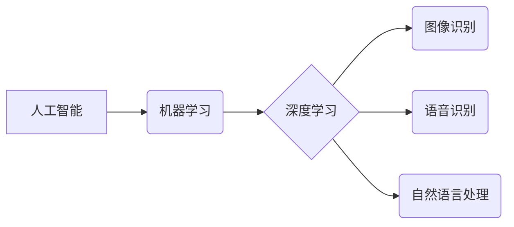

## 1. 背景介绍

人工智能（AI）近年来取得了令人瞩目的进展，在各个领域展现出巨大的潜力。从语音识别到图像生成，从医疗诊断到金融预测，AI正在改变着我们的生活。然而，尽管AI取得了如此辉煌的成就，但我们也必须认识到，AI在特定领域的局限性。

AI的局限性主要体现在以下几个方面：

* **数据依赖性:** AI模型的训练需要大量的数据，而数据质量和数量直接影响模型的性能。如果训练数据不足、不完整或存在偏差，模型的预测结果就会不可靠。
* **可解释性问题:** 许多AI模型是“黑箱”模型，这意味着我们无法完全理解模型是如何做出决策的。这在一些关键领域，例如医疗诊断和法律判决，可能会导致伦理和信任问题。
* **泛化能力有限:** AI模型通常在训练数据上表现良好，但在面对新的数据或场景时，泛化能力可能不足。这限制了AI在实际应用中的推广和应用范围。
* **缺乏常识和推理能力:** AI模型缺乏人类的常识和推理能力，难以处理复杂、多变的现实世界问题。

## 2. 核心概念与联系

**2.1 核心概念**

* **人工智能 (AI):** 人工智能是指模拟或超越人类智能的机器。它涵盖了多种技术，例如机器学习、深度学习、自然语言处理等。
* **机器学习 (ML):** 机器学习是人工智能的一个子领域，它使机器能够从数据中学习，并根据学习到的知识进行预测或决策。
* **深度学习 (DL):** 深度学习是机器学习的一个子领域，它使用多层神经网络来模拟人类大脑的学习过程。

**2.2 核心概念联系**

AI是人工智能的总称，而机器学习和深度学习是AI的重要技术手段。机器学习通过算法训练模型，使模型能够从数据中学习规律，深度学习则是机器学习的一种更高级形式，它使用更复杂的网络结构来模拟人类大脑的学习过程。

**Mermaid 流程图**



## 3. 核心算法原理 & 具体操作步骤

**3.1 算法原理概述**

机器学习算法的核心原理是通过训练模型来学习数据中的规律。训练过程通常包括以下步骤：

1. **数据收集和预处理:** 收集相关数据并进行清洗、转换、特征提取等预处理工作。
2. **模型选择:** 根据具体任务选择合适的机器学习算法，例如线性回归、逻辑回归、决策树、支持向量机等。
3. **模型训练:** 使用训练数据训练模型，调整模型参数，使模型能够准确地预测或分类数据。
4. **模型评估:** 使用测试数据评估模型的性能，例如准确率、召回率、F1-score等。
5. **模型调优:** 根据评估结果，调整模型参数或选择其他算法，进一步提高模型性能。

**3.2 算法步骤详解**

以线性回归算法为例，详细说明其训练步骤：

1. **数据收集和预处理:** 收集包含输入特征和输出目标的训练数据。例如，预测房价，输入特征包括房屋面积、房间数量、地理位置等，输出目标是房价。
2. **模型选择:** 选择线性回归算法，其模型形式为：y = wx + b，其中y是输出目标，x是输入特征，w和b是模型参数。
3. **模型训练:** 使用训练数据，通过最小化模型预测值与实际值的误差，迭代调整参数w和b，找到最佳参数值。
4. **模型评估:** 使用测试数据评估模型的性能，例如计算预测房价与实际房价的均方误差。
5. **模型调优:** 根据评估结果，调整模型参数或选择其他算法，例如添加正则化项，防止模型过拟合。

**3.3 算法优缺点**

* **优点:** 
    * 算法简单易懂，易于实现。
    * 计算效率高，适合处理大规模数据。
    * 可解释性强，可以直观地理解模型的决策过程。
* **缺点:** 
    * 只能处理线性关系，对于非线性关系的预测效果较差。
    * 对异常值敏感，容易受到异常值的影响。

**3.4 算法应用领域**

* 房价预测
* 股票价格预测
* 销售预测
* 医疗诊断辅助
* 欺诈检测

## 4. 数学模型和公式 & 详细讲解 & 举例说明

**4.1 数学模型构建**

线性回归模型的数学表达式为：

$$y = wx + b$$

其中：

* y 是输出目标变量
* x 是输入特征变量
* w 是权重参数，代表特征变量对目标变量的影响程度
* b 是偏置项，代表模型的偏移量

**4.2 公式推导过程**

线性回归模型的目标是找到最佳的权重参数w和偏置项b，使得模型预测值与实际值之间的误差最小。常用的误差函数是均方误差（MSE）：

$$MSE = \frac{1}{n} \sum_{i=1}^{n} (y_i - \hat{y}_i)^2$$

其中：

* n 是样本数量
* $y_i$ 是第i个样本的实际值
* $\hat{y}_i$ 是模型预测的第i个样本值

通过最小化MSE，可以得到最佳的w和b值。可以使用梯度下降算法来迭代更新w和b，直到MSE达到最小值。

**4.3 案例分析与讲解**

假设我们想要预测房屋价格，输入特征包括房屋面积和房间数量，输出目标是房屋价格。我们可以使用线性回归模型来建立预测模型。

训练数据包括多个房屋的面积、房间数量和价格信息。通过训练模型，我们可以得到最佳的权重参数w和偏置项b。

例如，假设模型得到以下参数：

* w_面积 = 1000
* w_房间 = 5000
* b = 100000

这意味着，房屋面积每增加1平方米，价格预计增加1000元；房间数量每增加1个，价格预计增加5000元。

## 5. 项目实践：代码实例和详细解释说明

**5.1 开发环境搭建**

* Python 3.x
* scikit-learn 库

**5.2 源代码详细实现**

```python
from sklearn.linear_model import LinearRegression
from sklearn.model_selection import train_test_split
import numpy as np

# 准备数据
X = np.array([[100, 2], [150, 3], [200, 4], [250, 5]])  # 面积, 房间数量
y = np.array([200000, 250000, 300000, 350000])  # 房价

# 将数据分成训练集和测试集
X_train, X_test, y_train, y_test = train_test_split(X, y, test_size=0.2, random_state=42)

# 创建线性回归模型
model = LinearRegression()

# 训练模型
model.fit(X_train, y_train)

# 预测测试集数据
y_pred = model.predict(X_test)

# 评估模型性能
print('Coefficients:', model.coef_)
print('Intercept:', model.intercept_)
print('Mean Squared Error:', np.mean((y_test - y_pred)**2))
```

**5.3 代码解读与分析**

* 首先，我们准备了房屋面积、房间数量和价格的数据。
* 然后，我们将数据分成训练集和测试集，用于训练和评估模型。
* 创建线性回归模型，并使用训练数据训练模型。
* 训练完成后，我们可以使用模型预测测试集数据。
* 最后，我们评估模型的性能，例如计算均方误差。

**5.4 运行结果展示**

运行代码后，会输出模型的权重参数、偏置项和均方误差。

## 6. 实际应用场景

**6.1 医疗诊断辅助**

AI可以分析患者的医疗影像数据，例如X光片、CT扫描和MRI扫描，帮助医生诊断疾病。例如，AI可以识别肺癌、乳腺癌和脑肿瘤等疾病。

**6.2 金融风险评估**

AI可以分析客户的财务数据，例如收入、支出和信用记录，评估客户的信用风险和投资风险。

**6.3 自动驾驶**

AI可以帮助汽车识别道路上的障碍物、交通信号和行人，实现自动驾驶功能。

**6.4 个性化推荐**

AI可以分析用户的行为数据，例如浏览历史、购买记录和评分，推荐个性化的商品、服务和内容。

**6.5 语言翻译**

AI可以实现机器翻译，将一种语言翻译成另一种语言。例如，Google Translate就是利用AI技术实现的。

**6.4 未来应用展望**

随着AI技术的不断发展，其应用场景将会更加广泛。例如，AI可以用于教育、娱乐、制造业、农业等领域。

## 7. 工具和资源推荐

**7.1 学习资源推荐**

* **在线课程:** Coursera、edX、Udacity等平台提供丰富的AI课程。
* **书籍:** 《深度学习》、《机器学习实战》等书籍是学习AI的经典教材。
* **博客和论坛:** AI社区网站和论坛可以获取最新的AI技术资讯和交流经验。

**7.2 开发工具推荐**

* **Python:** Python是AI开发最常用的编程语言。
* **TensorFlow:** TensorFlow是Google开发的开源深度学习框架。
* **PyTorch:** PyTorch是Facebook开发的开源深度学习框架。
* **scikit-learn:** scikit-learn是Python机器学习库。

**7.3 相关论文推荐**

* **《ImageNet Classification with Deep Convolutional Neural Networks》**
* **《Attention Is All You Need》**
* **《BERT: Pre-training of Deep Bidirectional Transformers for Language Understanding》**

## 8. 总结：未来发展趋势与挑战

**8.1 研究成果总结**

近年来，AI取得了令人瞩目的进展，在图像识别、语音识别、自然语言处理等领域取得了突破性成果。

**8.2 未来发展趋势**

* **模型更加强大:** AI模型将更加强大，能够处理更复杂的任务，例如自动驾驶、药物研发和科学发现。
* **数据更加丰富:** AI模型的训练需要大量数据，未来数据将更加丰富，来自各种传感器、设备和网络。
* **算法更加高效:** AI算法将更加高效，能够更快地学习和推理。
* **应用更加广泛:** AI将应用于更多领域，例如教育、医疗、金融、制造业等。

**8.3 面临的挑战**

* **数据隐私和安全:** AI模型的训练需要大量数据，如何保护数据隐私和安全是一个重要的挑战。
* **算法可解释性:** 许多AI模型是“黑箱”模型，难以理解其决策过程，这可能会导致伦理和信任问题。
* **公平性和偏见:** AI模型可能存在公平性和偏见问题，例如种族歧视和性别歧视。
* **人工智能伦理:** 人工智能的快速发展引发了伦理问题，例如人工智能的责任、人工智能的控制等。

**8.4 研究展望**

未来，AI研究将更加注重解决上述挑战，例如开发更加可解释的AI算法、构建更加公平和安全的AI系统、制定人工智能伦理规范等。


## 9. 附录：常见问题与解答

**9.1 如何选择合适的AI算法？**

选择合适的AI算法取决于具体的任务和数据特点。例如，对于分类任务，可以考虑逻辑回归、支持向量机、决策树等算法；对于回归任务，可以考虑线性回归、支持向量回归等算法。

**9.2 如何评估AI模型的性能？**

常用的AI模型性能评估