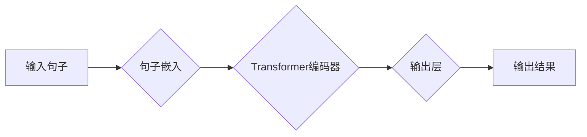

## ALBERT原理与代码实例讲解

> 关键词：ALBERT，预训练语言模型，Transformer，句子嵌入，微调，代码实例

## 1. 背景介绍

近年来，深度学习在自然语言处理领域取得了显著进展，预训练语言模型（Pretrained Language Models，PLMs）作为其重要组成部分，在文本分类、问答系统、机器翻译等任务中展现出强大的能力。BERT（Bidirectional Encoder Representations from Transformers）作为首个基于Transformer架构的预训练语言模型，凭借其强大的文本理解能力和高效的训练方法，迅速成为NLP领域的研究热点。然而，BERT模型参数量巨大，训练成本高昂，难以在资源有限的设备上部署。

为了解决BERT模型的上述问题，Google AI于2020年提出了ALBERT（A Lite BERT）模型。ALBERT模型通过**句子嵌入**、**因子分解**和**知识蒸馏**等技术，在保持BERT模型性能的同时，显著降低了模型参数量和训练成本。

## 2. 核心概念与联系

ALBERT模型的核心思想是通过**精简模型结构**和**优化训练方法**来提高模型效率。

**2.1 模型结构精简**

ALBERT模型主要通过以下两种方式精简模型结构：

* **句子嵌入：**BERT模型使用[CLS]标记来表示整个句子，而ALBERT模型则使用**句子嵌入**技术，将每个句子编码成一个固定长度的向量，并将其作为模型输入。这种方法可以减少模型参数量，并提高模型的效率。
* **因子分解：**ALBERT模型将Transformer的**多头注意力机制**中的**查询、键和值矩阵**进行因子分解，将每个矩阵分解成多个较小的矩阵，从而减少模型参数量。

**2.2 训练方法优化**

ALBERT模型通过以下两种方式优化训练方法：

* **知识蒸馏：**ALBERT模型使用**知识蒸馏**技术，将预训练的BERT模型作为教师模型，将ALBERT模型作为学生模型，通过最小化学生模型输出与教师模型输出之间的距离来学习。这种方法可以提高ALBERT模型的性能，并减少模型训练时间。
* **微调：**ALBERT模型在特定任务上进行微调，可以进一步提高模型的性能。

**2.3  ALBERT模型架构流程图**

## 3. 核心算法原理 & 具体操作步骤

### 3.1  算法原理概述

ALBERT模型的核心算法原理是基于Transformer架构的**句子嵌入**、**因子分解**和**知识蒸馏**技术。

* **句子嵌入：**将每个句子编码成一个固定长度的向量，作为模型输入。
* **因子分解：**将Transformer的多头注意力机制中的查询、键和值矩阵进行因子分解，减少模型参数量。
* **知识蒸馏：**利用预训练的BERT模型作为教师模型，将ALBERT模型作为学生模型，通过最小化学生模型输出与教师模型输出之间的距离来学习。

### 3.2  算法步骤详解

1. **句子嵌入：**将输入句子中的每个单词转换为词向量，并使用**平均池化**或**最大池化**方法将句子编码成一个固定长度的句子向量。
2. **Transformer编码器：**将句子向量作为输入，经过Transformer编码器的多层编码过程，得到句子表示。
3. **因子分解：**将Transformer的多头注意力机制中的查询、键和值矩阵进行因子分解，将每个矩阵分解成多个较小的矩阵，从而减少模型参数量。
4. **知识蒸馏：**将预训练的BERT模型作为教师模型，将ALBERT模型作为学生模型，通过最小化学生模型输出与教师模型输出之间的距离来学习。
5. **微调：**在特定任务上对ALBERT模型进行微调，进一步提高模型性能。

### 3.3  算法优缺点

**优点：**

* 模型参数量小，训练成本低。
* 性能接近BERT模型。
* 训练速度快。

**缺点：**

* 句子嵌入方法可能丢失部分句子信息。
* 因子分解方法可能影响模型性能。

### 3.4  算法应用领域

ALBERT模型在以下领域具有广泛的应用前景：

* 文本分类
* 问答系统
* 机器翻译
* 情感分析
* 文本摘要

## 4. 数学模型和公式 & 详细讲解 & 举例说明

### 4.1  数学模型构建

ALBERT模型的数学模型构建主要基于Transformer架构，其核心组件包括**多头注意力机制**和**前馈神经网络**。

**4.1.1 多头注意力机制**

多头注意力机制可以捕捉句子中不同单词之间的关系，并学习句子表示。其数学公式如下：

$$
Attention(Q, K, V) = softmax(\frac{QK^T}{\sqrt{d_k}})V
$$

其中：

* $Q$：查询矩阵
* $K$：键矩阵
* $V$：值矩阵
* $d_k$：键向量的维度
* $softmax$：softmax函数

**4.1.2 前馈神经网络**

前馈神经网络用于对注意力机制输出进行进一步的处理，并学习句子表示。其数学公式如下：

$$
FFN(x) = \max(0, xW_1 + b_1)W_2 + b_2
$$

其中：

* $x$：注意力机制输出
* $W_1$、$W_2$：权重矩阵
* $b_1$、$b_2$：偏置项

### 4.2  公式推导过程

ALBERT模型通过**句子嵌入**、**因子分解**和**知识蒸馏**技术来优化Transformer架构，其公式推导过程主要涉及以下几个方面：

* **句子嵌入：**使用平均池化或最大池化方法将句子编码成一个固定长度的句子向量。
* **因子分解：**将Transformer的多头注意力机制中的查询、键和值矩阵进行因子分解，将每个矩阵分解成多个较小的矩阵。
* **知识蒸馏：**利用预训练的BERT模型作为教师模型，将ALBERT模型作为学生模型，通过最小化学生模型输出与教师模型输出之间的距离来学习。

### 4.3  案例分析与讲解

假设我们有一个句子“The quick brown fox jumps over the lazy dog”。

1. **句子嵌入：**将每个单词转换为词向量，并使用平均池化方法将句子编码成一个句子向量。
2. **因子分解：**将Transformer的多头注意力机制中的查询、键和值矩阵进行因子分解，将每个矩阵分解成多个较小的矩阵。
3. **知识蒸馏：**利用预训练的BERT模型作为教师模型，将ALBERT模型作为学生模型，通过最小化学生模型输出与教师模型输出之间的距离来学习。

通过以上步骤，ALBERT模型可以学习到句子“The quick brown fox jumps over the lazy dog”的语义表示。

## 5. 项目实践：代码实例和详细解释说明

### 5.1  开发环境搭建

ALBERT模型的开发环境搭建需要以下软件：

* Python 3.6+
* TensorFlow 2.0+
* PyTorch 1.0+
* CUDA Toolkit 10.0+

### 5.2  源代码详细实现

ALBERT模型的源代码可以从HuggingFace模型库下载：https://huggingface.co/google/albert-base-v2

### 5.3  代码解读与分析

ALBERT模型的源代码主要包含以下几个部分：

* **模型架构定义：**定义ALBERT模型的结构，包括句子嵌入层、Transformer编码器层、输出层等。
* **模型参数初始化：**初始化模型参数，例如权重和偏置项。
* **模型训练：**定义模型训练过程，包括数据加载、模型前向传播、损失函数计算、反向传播和参数更新等。
* **模型评估：**定义模型评估过程，例如计算准确率、召回率和F1-score等指标。

### 5.4  运行结果展示

ALBERT模型的运行结果可以根据具体的任务进行展示，例如文本分类任务的准确率、问答系统的准确率等。

## 6. 实际应用场景

ALBERT模型在以下实际应用场景中具有广泛的应用前景：

* **搜索引擎：**ALBERT模型可以用于改进搜索引擎的文本理解能力，提高搜索结果的准确性和相关性。
* **聊天机器人：**ALBERT模型可以用于训练更智能的聊天机器人，使其能够更好地理解用户意图并提供更准确的回复。
* **机器翻译：**ALBERT模型可以用于改进机器翻译的质量，使其能够更准确地翻译不同语言之间的文本。

### 6.4  未来应用展望

随着ALBERT模型的不断发展和完善，其未来应用前景更加广阔。例如：

* **个性化推荐：**ALBERT模型可以用于分析用户的阅读偏好和行为模式，提供更个性化的推荐服务。
* **自动写作：**ALBERT模型可以用于辅助自动写作，例如生成新闻报道、撰写邮件等。
* **法律文本分析：**ALBERT模型可以用于分析法律文本，识别关键信息和法律关系。

## 7. 工具和资源推荐

### 7.1  学习资源推荐

* **ALBERT论文：**https://arxiv.org/abs/2005.10963
* **HuggingFace模型库：**https://huggingface.co/google/albert-base-v2
* **TensorFlow官方文档：**https://www.tensorflow.org/
* **PyTorch官方文档：**https://pytorch.org/

### 7.2  开发工具推荐

* **Jupyter Notebook：**用于代码编写和实验。
* **VS Code：**用于代码编写和调试。
* **Git：**用于代码版本控制。

### 7.3  相关论文推荐

* **BERT论文：**https://arxiv.org/abs/1810.04805
* **RoBERTa论文：**https://arxiv.org/abs/1907.11692
* **XLNet论文：**https://arxiv.org/abs/1906.08237

## 8. 总结：未来发展趋势与挑战

### 8.1  研究成果总结

ALBERT模型在保持BERT模型性能的同时，显著降低了模型参数量和训练成本，为在资源有限的设备上部署预训练语言模型提供了新的可能性。

### 8.2  未来发展趋势

ALBERT模型的未来发展趋势主要包括：

* **模型规模的进一步扩大：**通过增加模型参数量，可以进一步提高ALBERT模型的性能。
* **新的训练方法的探索：**探索新的训练方法，例如自监督学习和强化学习，可以进一步提高ALBERT模型的效率和性能。
* **多模态学习：**将ALBERT模型与其他模态数据，例如图像和音频数据，进行融合，可以构建更强大的多模态预训练语言模型。

### 8.3  面临的挑战

ALBERT模型也面临一些挑战：

* **数据标注成本：**预训练语言模型需要大量的标注数据，数据标注成本较高。
* **模型解释性：**预训练语言模型的内部机制复杂，难以解释其决策过程。
* **公平性与偏见：**预训练语言模型可能存在公平性与偏见问题，需要进行相应的缓解措施。

### 8.4  研究展望

未来，我们将继续研究ALBERT模型及其变体，探索新的训练方法和应用场景，推动预训练语言模型在人工智能领域的进一步发展。

## 9. 附录：常见问题与解答

**Q1：ALBERT模型与BERT模型相比有什么优势？**

A1：ALBERT模型在保持BERT模型性能的同时，显著降低了模型参数量和训练成本，更适合在资源有限的设备上部署。

**Q2：如何使用ALBERT模型进行文本分类？**

A2：可以使用HuggingFace模型库下载预