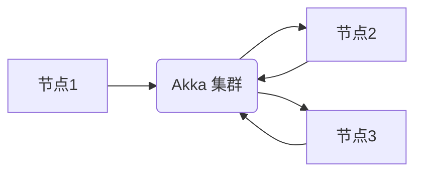

## Akka集群原理与代码实例讲解

> 关键词：Akka, 集群, 并发, 分布式, Actor, 消息传递, fault-tolerance

## 1. 背景介绍

在现代软件架构中，分布式系统越来越普遍，它们能够提供更高的可用性、可扩展性和容错性。然而，构建和维护分布式系统也带来了许多挑战，例如数据一致性、网络延迟和节点故障。

Akka 是一个用于构建分布式应用程序的开源框架，它基于 Actor 模型，提供了一种简洁、高效和可扩展的方式来处理并发和分布式计算。Akka 集群是 Akka 的一个重要组成部分，它允许 Actor 在多个节点之间进行通信和协作，从而构建大型、可靠的分布式系统。

## 2. 核心概念与联系

### 2.1 Actor 模型

Actor 模型是一种用于处理并发和分布式计算的并发编程模型。它将系统分解成独立的单元，称为 Actor，每个 Actor 都运行在一个独立的线程中，并通过消息传递进行通信。

**Actor 的特点：**

* **独立性:** 每个 Actor 都是独立的，它拥有自己的状态和行为。
* **消息传递:** Actor 之间通信通过发送消息的方式进行，消息是异步的，不会阻塞发送者。
* **并发:** 每个 Actor 都运行在一个独立的线程中，可以并发处理多个消息。
* **容错性:** Actor 模型具有良好的容错性，如果一个 Actor 发生故障，其他 Actor 可以继续运行，不会影响整个系统的稳定性。

### 2.2 Akka 集群

Akka 集群是 Akka 的一个扩展，它允许 Actor 在多个节点之间进行通信和协作。Akka 集群提供了以下功能：

* **节点发现:** 集群中的节点可以自动发现彼此，并建立连接。
* **消息路由:** Akka 集群可以根据消息内容路由消息到相应的节点。
* **状态复制:** Akka 集群可以复制 Actor 的状态到多个节点，从而提高系统的容错性。
* **故障检测和恢复:** Akka 集群可以检测节点故障，并自动将 Actor 从故障节点转移到其他节点。

**Akka 集群架构:**



## 3. 核心算法原理 & 具体操作步骤

### 3.1 算法原理概述

Akka 集群的核心算法是基于 Actor 模型和消息传递的。每个 Actor 都运行在一个独立的节点上，通过消息传递进行通信。

**消息传递过程:**

1. 发送者 Actor 将消息发送到消息队列。
2. 消息队列将消息路由到相应的接收者 Actor。
3. 接收者 Actor 从消息队列中接收消息，并根据消息内容执行相应的操作。

### 3.2 算法步骤详解

1. **节点发现:** 集群中的节点使用心跳机制或其他发现协议自动发现彼此。
2. **连接建立:** 节点之间建立 TCP 连接，用于消息传递。
3. **消息路由:** 当一个 Actor 发送消息时，Akka 集群会根据消息内容和接收者 Actor 的地址路由消息到相应的节点。
4. **消息传递:** 节点之间通过 TCP 连接传递消息。
5. **消息处理:** 接收者 Actor 从消息队列中接收消息，并根据消息内容执行相应的操作。

### 3.3 算法优缺点

**优点:**

* **并发性:** Actor 模型支持高并发，每个 Actor 都运行在一个独立的线程中。
* **分布式:** Akka 集群可以将 Actor 分布到多个节点上，提高系统的可扩展性和容错性。
* **消息传递:** 消息传递是异步的，不会阻塞发送者，提高了系统的效率。
* **容错性:** Akka 集群可以检测节点故障，并自动将 Actor 从故障节点转移到其他节点，提高系统的可靠性。

**缺点:**

* **学习曲线:** Actor 模型和 Akka 集群有一定的学习曲线。
* **调试复杂性:** 调试分布式系统比单机系统更复杂。

### 3.4 算法应用领域

Akka 集群广泛应用于以下领域:

* **金融系统:** 处理高并发交易和风险管理。
* **电商平台:** 提供商品推荐、订单处理和支付服务。
* **社交网络:** 处理用户消息、好友关系和数据分析。
* **物联网:** 连接和管理大量设备，处理传感器数据。

## 4. 数学模型和公式 & 详细讲解 & 举例说明

### 4.1 数学模型构建

Akka 集群的数学模型可以抽象为一个图论模型，其中节点代表集群中的 Actor，边代表 Actor 之间的通信关系。

**图论模型:**

* **节点:** $N = \{n_1, n_2,..., n_k\}$，其中 $n_i$ 代表集群中的第 $i$ 个 Actor。
* **边:** $E = \{(n_i, n_j) | n_i, n_j \in N, i \neq j\}$，其中 $(n_i, n_j)$ 代表 Actor $n_i$ 和 $n_j$ 之间的通信关系。

**图的性质:**

* **无向图:**  Actor 之间的通信是双向的。
* **有权图:**  边上的权重可以表示消息传递的延迟或成本。

### 4.2 公式推导过程

**节点故障概率:**

假设每个节点的故障概率为 $p$，则集群中至少有一个节点故障的概率为:

$$
P(故障) = 1 - (1-p)^k
$$

其中 $k$ 是集群中节点的数量。

**消息传递延迟:**

消息传递延迟取决于网络延迟和节点处理消息的时间。假设网络延迟为 $d$，节点处理消息的时间为 $t$，则消息传递延迟为:

$$
延迟 = d + t
$$

### 4.3 案例分析与讲解

**案例:**

一个电商平台使用 Akka 集群处理订单。集群中包含 5 个节点，每个节点运行多个 Actor，负责处理订单创建、支付、发货等操作。

**分析:**

* **节点故障概率:** 每个节点的故障概率为 0.01，则集群中至少有一个节点故障的概率为:

$$
P(故障) = 1 - (1-0.01)^5 \approx 0.05
$$

* **消息传递延迟:** 网络延迟为 10 毫秒，节点处理消息的时间为 50 毫秒，则消息传递延迟为:

$$
延迟 = 10 + 50 = 60 毫秒
$$

**结论:**

Akka 集群可以提高电商平台的可用性和性能，但需要考虑节点故障概率和消息传递延迟等因素。

## 5. 项目实践：代码实例和详细解释说明

### 5.1 开发环境搭建

* Java Development Kit (JDK) 8 或更高版本
* Scala 语言环境
* Akka 集群依赖库

### 5.2 源代码详细实现

```scala
// 定义一个 Actor，用于处理消息
class OrderActor extends Actor {
  def receive: Receive = {
    case "createOrder" =>
      println("创建订单")
      // 处理订单创建逻辑
    case "payOrder" =>
      println("支付订单")
      // 处理支付逻辑
    case "shipOrder" =>
      println("发货订单")
      // 处理发货逻辑
  }
}

// 定义一个 Actor 系统
object AkkaClusterExample {
  def main(args: Array[String]): Unit = {
    // 创建 Actor 系统
    val system = ActorSystem("AkkaCluster")

    // 创建一个 OrderActor 实例
    val orderActor = system.actorOf(Props[OrderActor], "orderActor")

    // 发送消息到 OrderActor
    orderActor! "createOrder"
    orderActor! "payOrder"
    orderActor! "shipOrder"
  }
}
```

### 5.3 代码解读与分析

* `OrderActor` 类定义了一个 Actor，它可以处理 "createOrder"、"payOrder" 和 "shipOrder" 三种类型的消息。
* `receive` 方法定义了 Actor 的行为，它根据接收到的消息执行相应的操作。
* `AkkaClusterExample` 对象定义了一个 Actor 系统，并创建了一个 `OrderActor` 实例。
* `system.actorOf()` 方法创建了一个 Actor，并将其注册到 Actor 系统中。
* `orderActor! "createOrder"` 方法发送 "createOrder" 消息到 `orderActor`。

### 5.4 运行结果展示

运行代码后，会输出以下结果:

```
创建订单
支付订单
发货订单
```

## 6. 实际应用场景

Akka 集群在各种实际应用场景中发挥着重要作用，例如:

* **金融系统:** 处理高并发交易和风险管理。
* **电商平台:** 提供商品推荐、订单处理和支付服务。
* **社交网络:** 处理用户消息、好友关系和数据分析。
* **物联网:** 连接和管理大量设备，处理传感器数据。

### 6.4 未来应用展望

随着分布式系统的发展，Akka 集群的应用场景将会更加广泛。未来，Akka 集群可能会应用于以下领域:

* **云计算:** 在云环境中构建和管理分布式应用程序。
* **大数据处理:** 处理海量数据，进行实时分析和决策。
* **人工智能:** 构建分布式机器学习平台，加速模型训练和推理。

## 7. 工具和资源推荐

### 7.1 学习资源推荐

* **Akka 官方文档:** https://akka.io/docs/akka/current/
* **Akka 入门教程:** https://www.oreilly.com/library/view/akka-in-action/9781491955183/
* **Akka 集群教程:** https://doc.akka.io/docs/akka/current/cluster.html

### 7.2 开发工具推荐

* **IntelliJ IDEA:** https://www.jetbrains.com/idea/
* **Eclipse:** https://www.eclipse.org/

### 7.3 相关论文推荐

* **Akka: A Concurrent Actor Framework for Java:** https://www.researchgate.net/publication/228843540_Akka_A_Concurrent_Actor_Framework_for_Java
* **Building Distributed Systems with Akka:** https://www.oreilly.com/library/view/building-distributed/9781491955183/

## 8. 总结：未来发展趋势与挑战

### 8.1 研究成果总结

Akka 集群是一个成熟的分布式系统框架，它提供了高效、可靠和可扩展的解决方案。Akka 集群的成功应用证明了 Actor 模型和消息传递在分布式系统中的优势。

### 8.2 未来发展趋势

* **更强大的容错性:** Akka 集群将继续改进容错机制，提高系统的可靠性和可用性。
* **更易于使用的 API:** Akka 集群的 API 将更加简洁易用，降低开发门槛。
* **更广泛的应用场景:** Akka 集群将应用于更多领域，例如云计算、大数据处理和人工智能。

### 8.3 面临的挑战

* **复杂性:** 分布式系统本身就比较复杂，Akka 集群的学习曲线也相对较长。
* **调试难度:** 调试分布式系统比单机系统更困难，需要更高级的调试工具和技巧。
* **性能优化:** 随着系统规模的增长，性能优化成为一个重要的挑战。

### 8.4 研究展望

未来，Akka 集群的研究方向将集中在以下几个方面:

* **更智能的容错机制:** 基于机器学习等技术，实现更智能的节点故障检测和恢复机制。
* **更强大的分布式数据管理:** 提供更完善的分布式数据存储和管理解决方案。
* **更易于开发的分布式应用程序:** 提供更高级的开发工具和框架，降低开发难度。

## 9. 附录：常见问题与解答

**常见问题