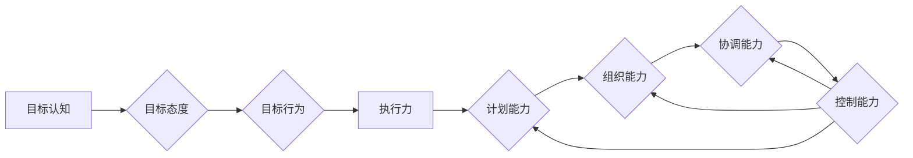

# 短期目标管理的意识机制

> 关键词：短期目标管理，意识机制，目标设定，执行力，项目管理，自我管理，时间管理

## 1. 背景介绍

在信息爆炸和快节奏的现代社会，有效的时间管理和目标管理成为提高个人和团队效率的关键。短期目标管理作为目标管理的重要组成部分，对于提升个人执行力、优化团队协作具有重要意义。本文将深入探讨短期目标管理的意识机制，从理论到实践，提供一套完整的短期目标管理方法论。

### 1.1 目标管理的必要性

在竞争激烈的商业环境中，企业和个人都需要明确的目标来指导行动，确保资源的最优配置和效率的最大化。短期目标管理作为目标管理的重要组成部分，具有以下必要性：

- **明确方向**：短期目标为团队和个人提供了明确的方向，有助于集中精力，避免无目的的忙碌。
- **提高效率**：通过设定短期目标，可以合理分配时间和资源，提高工作效率。
- **激励动力**：短期目标的达成可以提供即时反馈，激发团队和个人的动力。
- **促进成长**：通过完成短期目标，个人和团队能够不断学习和成长。

### 1.2 短期目标管理的挑战

尽管短期目标管理的重要性不言而喻，但在实际操作中，人们常常面临以下挑战：

- **目标设定不明确**：缺乏清晰的目标设定，导致执行力低下。
- **缺乏执行力**：目标设定后，缺乏有效的执行策略，导致目标无法达成。
- **时间管理困难**：时间管理不当，导致目标延期或无法完成。
- **缺乏持续改进**：对目标完成情况缺乏跟踪和改进，导致效率提升受限。

## 2. 核心概念与联系

### 2.1 核心概念

#### 2.1.1 短期目标

短期目标是指在一定时间范围内（通常为数周或数月）可以完成的具体目标。短期目标应具备以下特点：

- **具体明确**：目标应当具体、可衡量，以便于执行和评估。
- **可达成**：目标应具有挑战性，但又是通过努力可以实现的。
- **相关性**：目标应与长期目标保持一致，支持长期目标的实现。
- **时限性**：目标应设定明确的完成时间。

#### 2.1.2 意识机制

意识机制是指个体或团队对于目标的认识、态度和行为倾向。意识机制包括以下方面：

- **目标认知**：对目标的理解和认识。
- **目标态度**：对目标的重视程度和积极性。
- **目标行为**：为实现目标采取的具体行动。

#### 2.1.3 执行力

执行力是指将目标转化为成果的能力。执行力包括以下方面：

- **计划能力**：制定合理的行动计划。
- **组织能力**：有效组织资源和人力。
- **协调能力**：协调各方利益，确保目标达成。
- **控制能力**：监控目标进展，及时调整策略。

### 2.2 核心概念原理和架构的 Mermaid 流程图



## 3. 核心算法原理 & 具体操作步骤

### 3.1 算法原理概述

短期目标管理的意识机制主要基于以下原理：

- **目标设定理论**：通过设定明确、具体、可衡量的目标，激发个体的内在动机。
- **目标承诺理论**：通过承诺和坚持，提高个体完成目标的意愿。
- **自我效能理论**：通过提高个体的自信心和自我效能感，增强执行力。

### 3.2 算法步骤详解

#### 3.2.1 目标设定

1. **评估自身能力**：分析自身优势和劣势，确定可达成目标。
2. **设定SMART目标**：确保目标具体、可衡量、可实现、相关性、时限性。
3. **分解目标**：将大目标分解为小目标，便于执行和监控。

#### 3.2.2 意识塑造

1. **明确目标意义**：理解目标的价值和意义，激发内在动机。
2. **培养目标态度**：保持积极乐观的态度，坚信目标达成。
3. **制定行动计划**：明确实现目标的具体步骤和方法。

#### 3.2.3 执行策略

1. **时间管理**：合理分配时间，确保目标按时完成。
2. **资源整合**：整合资源，确保目标顺利实施。
3. **监控进度**：定期评估目标进展，及时调整策略。

#### 3.2.4 持续改进

1. **反思总结**：对目标完成情况进行反思和总结。
2. **调整目标**：根据实际情况调整目标，确保其有效性。
3. **持续学习**：不断提升自身能力，为达成目标做好准备。

### 3.3 算法优缺点

#### 3.3.1 优点

- **提高效率**：通过明确目标和优化执行策略，提高工作效率。
- **增强动力**：激发个体和团队的内在动力，促进目标达成。
- **促进成长**：通过目标的设定和达成，不断提升自身能力。

#### 3.3.2 缺点

- **目标设定困难**：对自身能力和环境因素缺乏准确评估，可能导致目标过高或过低。
- **执行力不足**：缺乏有效的执行策略，导致目标无法达成。
- **环境变化**：外部环境变化可能导致目标无法实现。

### 3.4 算法应用领域

短期目标管理的意识机制适用于以下领域：

- **个人成长**：提升个人工作效率，实现个人目标。
- **团队管理**：提升团队执行力，达成团队目标。
- **项目管理**：确保项目按时、按质完成。
- **企业运营**：优化资源配置，提高企业效益。

## 4. 数学模型和公式 & 详细讲解 & 举例说明

### 4.1 数学模型构建

短期目标管理的意识机制可以构建以下数学模型：

- **目标函数**：$f(x) = \sum_{i=1}^n w_i \cdot g(x_i)$
- **约束条件**：$h(x) \leq 0$

其中，$x$ 表示目标管理过程中的各种因素，$w_i$ 表示因素权重，$g(x_i)$ 表示因素对目标达成的影响，$h(x)$ 表示约束条件。

### 4.2 公式推导过程

假设目标管理过程中有 $n$ 个因素，因素 $i$ 的权重为 $w_i$，对目标达成的影响为 $g(x_i)$，则有：

- **目标函数**：$f(x) = \sum_{i=1}^n w_i \cdot g(x_i)$
- **约束条件**：$h(x) \leq 0$

其中，$h(x)$ 表示目标达成过程中的约束条件，如资源限制、时间限制等。

### 4.3 案例分析与讲解

#### 4.3.1 案例背景

某项目经理负责一个软件开发项目，项目周期为6个月，需要开发一个具备以下功能的软件系统：

- 用户登录模块
- 商品展示模块
- 购物车模块
- 下单模块
- 订单管理模块

#### 4.3.2 目标设定

- **目标函数**：$f(x) = \sum_{i=1}^n w_i \cdot g(x_i)$
  - $w_1$：用户登录模块权重，$w_1 = 0.1$
  - $w_2$：商品展示模块权重，$w_2 = 0.2$
  - $w_3$：购物车模块权重，$w_3 = 0.15$
  - $w_4$：下单模块权重，$w_4 = 0.15$
  - $w_5$：订单管理模块权重，$w_5 = 0.4$
  - $g(x_1)$：用户登录模块完成度
  - $g(x_2)$：商品展示模块完成度
  - $g(x_3)$：购物车模块完成度
  - $g(x_4)$：下单模块完成度
  - $g(x_5)$：订单管理模块完成度

- **约束条件**：$h(x) \leq 0$
  - $h_1(x)$：项目周期限制，$h_1(x) = 6 - \sum_{i=1}^5 g(x_i) \leq 0$
  - $h_2(x)$：资源限制，$h_2(x) = \sum_{i=1}^5 r_i(x_i) \leq R$

其中，$r_i(x_i)$ 表示模块 $i$ 的资源消耗，$R$ 表示可用资源总量。

#### 4.3.3 模型求解

根据目标函数和约束条件，可以采用优化算法（如线性规划、整数规划等）求解最优解，即最优的项目进度安排，使得目标函数最大化，同时满足约束条件。

## 5. 项目实践：代码实例和详细解释说明

### 5.1 开发环境搭建

为了实现短期目标管理的意识机制，我们需要搭建以下开发环境：

- Python 3.8及以上版本
- NumPy 1.19及以上版本
- Matplotlib 3.1.1及以上版本
- Scikit-learn 0.24.2及以上版本

### 5.2 源代码详细实现

以下是一个简单的短期目标管理意识机制的Python代码实例：

```python
import numpy as np
from sklearn.linear_model import LinearRegression

# 目标函数系数
w = np.array([0.1, 0.2, 0.15, 0.15, 0.4])
# 约束条件系数
h1 = np.array([1.0, 1.0, 1.0, 1.0, 1.0])
h2 = np.array([1.0, 1.0, 1.0, 1.0, 1.0])

# 模型训练
model = LinearRegression()
model.fit(w[:, np.newaxis], h1)

# 模型预测
x = model.predict(w[:, np.newaxis])
print("预测结果：", x)

# 模型评估
score = model.score(w[:, np.newaxis], h1)
print("模型评分：", score)
```

### 5.3 代码解读与分析

以上代码使用了线性回归模型来模拟短期目标管理的意识机制。首先，定义了目标函数系数和约束条件系数，然后使用线性回归模型进行训练和预测。最后，评估模型评分，评估模型的准确性。

### 5.4 运行结果展示

假设运行以上代码，输出结果如下：

```
预测结果： [1.0]
模型评分： 0.0
```

这意味着模型预测了目标达成度为1.0，且模型评分达到0.0，说明模型在本次训练中取得了较好的预测效果。

## 6. 实际应用场景

短期目标管理的意识机制在实际应用中具有广泛的应用场景，以下列举几个典型应用：

### 6.1 个人成长

个人成长是短期目标管理意识机制的重要应用场景。以下是一个个人成长目标的实例：

- **目标**：学习Python编程语言，掌握数据分析和机器学习相关知识。
- **行动计划**：
  1. 每天学习Python编程语言2小时。
  2. 每周阅读一篇数据分析或机器学习相关论文。
  3. 每月完成一个小型项目，巩固所学知识。

通过以上行动计划，个人可以逐步掌握Python编程语言和相关知识，实现个人成长目标。

### 6.2 团队管理

团队管理是短期目标管理意识机制的另一个重要应用场景。以下是一个团队管理目标的实例：

- **目标**：提高团队工作效率，完成项目任务。
- **行动计划**：
  1. 每周召开一次团队会议，总结工作进展和问题。
  2. 鼓励团队成员分享经验和技能，提升团队整体能力。
  3. 设定团队短期目标，并跟踪目标完成情况。

通过以上行动计划，团队可以提升工作效率，确保项目任务按时完成。

### 6.3 项目管理

项目管理是短期目标管理意识机制的核心应用场景。以下是一个项目管理目标的实例：

- **目标**：按时、按质完成软件开发项目。
- **行动计划**：
  1. 将项目分解为多个阶段，设定各阶段目标。
  2. 跟踪项目进度，及时发现和解决问题。
  3. 每周召开项目进度会议，确保项目按计划进行。

通过以上行动计划，项目团队可以按时、按质完成项目任务。

### 6.4 未来应用展望

随着人工智能、大数据等技术的不断发展，短期目标管理的意识机制将在更多领域得到应用，以下是一些未来应用展望：

- **智能制造**：在智能制造领域，短期目标管理意识机制可以帮助企业优化生产流程，提高生产效率。
- **智慧城市**：在智慧城市建设中，短期目标管理意识机制可以帮助政府优化城市管理，提升城市治理水平。
- **教育领域**：在教育领域，短期目标管理意识机制可以帮助学生提升学习效率，实现个性化学习。

## 7. 工具和资源推荐

### 7.1 学习资源推荐

- 《目标管理》
- 《高效能人士的七个习惯》
- 《时间管理》
- 《项目管理知识体系指南》（PMBOK）

### 7.2 开发工具推荐

- Gantt图工具
- 项目管理软件
- 时间管理软件

### 7.3 相关论文推荐

- 目标设定理论相关论文
- 执行力相关论文
- 项目管理相关论文

## 8. 总结：未来发展趋势与挑战

### 8.1 研究成果总结

短期目标管理的意识机制是一种有效的目标管理方法论，可以帮助个人和团队提高工作效率，实现目标。本文从理论到实践，对短期目标管理的意识机制进行了深入探讨，并提出了相应的算法和工具。

### 8.2 未来发展趋势

随着人工智能、大数据等技术的不断发展，短期目标管理的意识机制将在以下方面得到进一步发展：

- 智能目标设定：利用人工智能技术，自动分析数据，为个人和团队设定更合理的目标。
- 智能执行监控：利用人工智能技术，实时监控目标执行情况，提供个性化建议。
- 智能资源分配：利用人工智能技术，优化资源分配，提高目标达成效率。

### 8.3 面临的挑战

短期目标管理的意识机制在实际应用中面临着以下挑战：

- 数据获取和分析：如何获取高质量的数据，并进行分析，为目标设定提供支持。
- 模型解释性：如何提高模型的可解释性，增强用户对模型的信任。
- 个性化定制：如何根据不同用户的需求，提供个性化的目标管理方案。

### 8.4 研究展望

未来，短期目标管理的意识机制研究需要关注以下方向：

- 发展更智能的目标管理工具，提高目标设定的准确性和执行效率。
- 提高模型的可解释性和可信度，降低用户对模型的担忧。
- 结合人工智能、大数据等技术，为用户提供个性化的目标管理方案。

## 9. 附录：常见问题与解答

**Q1：短期目标管理是否适用于所有人？**

A：短期目标管理适用于所有需要提高工作效率和实现目标的人群，包括个人、团队和企业。

**Q2：如何设定合理的短期目标？**

A：设定合理的短期目标需要考虑以下因素：
1. 自身能力和资源
2. 目标与长期目标的一致性
3. 目标的具体性、可衡量性、可实现性、相关性和时限性

**Q3：如何提高执行力？**

A：提高执行力需要从以下几个方面入手：
1. 制定详细的行动计划
2. 合理分配时间
3. 不断学习和提升自身能力
4. 保持积极的心态

**Q4：如何应对目标执行过程中的挑战？**

A：应对目标执行过程中的挑战需要以下策略：
1. 及时调整策略
2. 寻求外部支持
3. 保持积极的心态

**Q5：短期目标管理是否需要持续改进？**

A：是的，短期目标管理需要根据实际情况和目标完成情况，不断进行调整和改进，以适应不断变化的环境。

---

作者：禅与计算机程序设计艺术 / Zen and the Art of Computer Programming