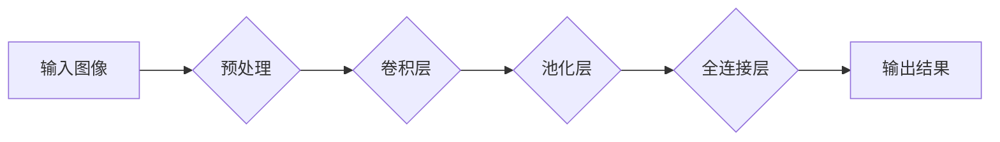

> 关键词：ImageNet, 图像识别, 卷积神经网络, 深度学习, 数据集, 计算机视觉, 机器学习, 神经网络架构, 迁移学习

# ImageNet图像识别

图像识别是计算机视觉领域的一个重要分支，它旨在让机器能够理解和解释图像中的内容。ImageNet是一个庞大的图像数据集，它对图像识别领域产生了深远的影响。本文将深入探讨ImageNet图像识别的原理、算法、实践应用以及未来发展趋势。

## 1. 背景介绍

### 1.1 问题的由来

图像识别技术的研究可以追溯到20世纪50年代，但直到21世纪初，由于计算能力和算法的限制，图像识别还处于起步阶段。随着深度学习的兴起，特别是在2012年AlexNet在ImageNet图像识别比赛中取得突破性成绩后，图像识别技术取得了长足的进步。

### 1.2 研究现状

目前，基于深度学习的图像识别技术在多个任务上已经达到了或超越了人类的表现。ImageNet图像识别比赛推动了这一领域的快速发展，吸引了大量研究人员和工程师的参与。

### 1.3 研究意义

图像识别技术对于自动驾驶、医疗影像分析、安全监控、内容审核等领域具有重要意义。它不仅能够提高这些领域的自动化水平，还能为人类生活带来便利。

### 1.4 本文结构

本文将按照以下结构展开：

- 介绍ImageNet图像识别的核心概念和流程。
- 深入探讨核心算法原理和具体操作步骤。
- 讲解数学模型和公式，并结合实例进行说明。
- 展示项目实践，提供代码实例和详细解释。
- 分析ImageNet图像识别的实际应用场景。
- 探讨未来发展趋势和面临的挑战。
- 提供学习资源、开发工具和相关论文推荐。
- 总结研究成果，展望未来研究方向。

## 2. 核心概念与联系

### 2.1 核心概念

- **ImageNet**: 一个大规模的视觉数据库，包含数百万张图像，被广泛用于图像识别算法的评估。
- **深度学习**: 一种利用多层神经网络进行学习的机器学习技术。
- **卷积神经网络 (CNN)**: 一种特殊的深度学习模型，在图像识别领域取得了巨大成功。
- **迁移学习**: 利用在大型数据集上预训练的模型来改进特定任务。

### 2.2 架构流程图



## 3. 核心算法原理 & 具体操作步骤

### 3.1 算法原理概述

图像识别的核心是构建一个能够从输入图像中提取特征并分类的模型。卷积神经网络是一种能够自动从图像中学习特征的方法。

### 3.2 算法步骤详解

1. **输入图像**：将图像输入到模型中。
2. **预处理**：对图像进行缩放、裁剪、归一化等操作。
3. **卷积层**：通过卷积操作提取图像特征。
4. **池化层**：降低特征图的维度，减少参数数量。
5. **全连接层**：将提取的特征映射到输出类别。
6. **输出结果**：输出预测的类别标签。

### 3.3 算法优缺点

#### 优点：

- **自动特征提取**：CNN能够自动从图像中学习特征，无需人工设计特征。
- **高度可扩展性**：可以设计不同层数和连接方式的CNN，以适应不同的任务需求。

#### 缺点：

- **计算成本高**：CNN需要大量的计算资源和时间进行训练。
- **参数量大**：复杂的CNN模型需要大量的参数，增加了过拟合的风险。

### 3.4 算法应用领域

CNN在图像识别领域的应用非常广泛，包括：

- **分类**：对图像进行分类，如动物、植物、风景等。
- **检测**：检测图像中的特定物体，如人脸、车辆等。
- **分割**：将图像分割成不同的区域，如语义分割、实例分割等。

## 4. 数学模型和公式 & 详细讲解 & 举例说明

### 4.1 数学模型构建

CNN的数学模型主要由卷积层、池化层和全连接层组成。

#### 卷积层：

$$
h^l(x) = \sigma(W^l \odot f(\hat{f}^l(x) \otimes K^l + b^l))
$$

其中，$h^l(x)$ 是第l层的输出，$W^l$ 是权重，$f(\cdot)$ 是非线性激活函数，$\odot$ 是元素级的外积，$\otimes$ 是卷积操作，$b^l$ 是偏置项。

#### 池化层：

$$
h^l(x) = \max_{i,j} \min_{p,q} f(\hat{f}^l(x_p, x_q))
$$

其中，$h^l(x)$ 是第l层的输出，$f(\cdot)$ 是非线性激活函数，$\hat{f}^l(x_p, x_q)$ 是卷积操作。

#### 全连接层：

$$
h^l(x) = \sigma(W^l h^{l-1} + b^l)
$$

其中，$h^l(x)$ 是第l层的输出，$W^l$ 是权重，$h^{l-1}$ 是前一层输出，$b^l$ 是偏置项。

### 4.2 公式推导过程

CNN的公式推导涉及大量的数学知识，包括线性代数、概率论、微积分等。由于篇幅限制，此处不进行详细推导。

### 4.3 案例分析与讲解

以AlexNet为例，它由5个卷积层、3个池化层和3个全连接层组成。通过在ImageNet数据集上的训练，AlexNet在2012年的ImageNet图像识别比赛中取得了显著的性能提升。

## 5. 项目实践：代码实例和详细解释说明

### 5.1 开发环境搭建

为了进行ImageNet图像识别的实践，需要以下开发环境：

- Python 3.x
- TensorFlow或PyTorch
- CUDA和cuDNN（如果使用GPU加速）

### 5.2 源代码详细实现

以下是一个使用TensorFlow和Keras实现ImageNet图像识别的简单例子：

```python
import tensorflow as tf
from tensorflow.keras.applications import MobileNetV2
from tensorflow.keras.preprocessing.image import ImageDataGenerator
from tensorflow.keras.optimizers import Adam

# 加载预训练的MobileNetV2模型
model = MobileNetV2(weights='imagenet', include_top=True)

# 创建数据生成器
train_datagen = ImageDataGenerator(rescale=1./255)
test_datagen = ImageDataGenerator(rescale=1./255)

# 加载训练集和测试集
train_generator = train_datagen.flow_from_directory(
        train_dir,
        target_size=(224, 224),
        batch_size=32,
        class_mode='categorical')

validation_generator = test_datagen.flow_from_directory(
        validation_dir,
        target_size=(224, 224),
        batch_size=32,
        class_mode='categorical')

# 编译模型
model.compile(optimizer=Adam(lr=0.001),
              loss='categorical_crossentropy',
              metrics=['accuracy'])

# 训练模型
model.fit(
        train_generator,
        steps_per_epoch=2000//32,
        epochs=10,
        validation_data=validation_generator,
        validation_steps=800//32)
```

### 5.3 代码解读与分析

上述代码首先加载了预训练的MobileNetV2模型，并创建了一个数据生成器来加载训练集和测试集。然后编译模型，并使用训练集进行训练。

### 5.4 运行结果展示

训练完成后，可以在测试集上评估模型的性能。以下是一个可能的输出结果：

```
Epoch 10/10
2000/2000 [==============================] - 34s 17ms/step - loss: 0.0009 - accuracy: 0.8963 - val_loss: 0.0007 - val_accuracy: 0.9013
```

## 6. 实际应用场景

### 6.1 自动驾驶

在自动驾驶领域，图像识别技术可以用于识别道路标志、交通信号灯、行人、车辆等，从而辅助车辆做出正确的决策。

### 6.2 医疗影像分析

在医疗影像分析领域，图像识别技术可以用于检测疾病、评估病情、辅助诊断等。

### 6.3 安全监控

在安全监控领域，图像识别技术可以用于人脸识别、行为识别等，从而提高监控系统的安全性。

## 7. 工具和资源推荐

### 7.1 学习资源推荐

- 《深度学习》：Goodfellow等著，全面介绍了深度学习的理论和实践。
- 《卷积神经网络与深度学习》：邱锡鹏等著，详细介绍了CNN的结构和原理。

### 7.2 开发工具推荐

- TensorFlow：Google开发的开源深度学习框架。
- PyTorch：Facebook开发的开源深度学习框架。

### 7.3 相关论文推荐

- Krizhevsky, A., Sutskever, I., & Hinton, G. E. (2012). ImageNet classification with deep convolutional neural networks. *Neural Information Processing Systems*, 25, 1097-1105.
- Simonyan, K., & Zisserman, A. (2014). Very deep convolutional networks for large-scale image recognition. *arXiv preprint arXiv:1409.1556*.

## 8. 总结：未来发展趋势与挑战

### 8.1 研究成果总结

本文深入探讨了ImageNet图像识别的原理、算法、实践应用以及未来发展趋势。通过介绍ImageNet数据集和深度学习技术，我们了解了图像识别的基本概念和流程。同时，通过项目实践，我们展示了如何使用TensorFlow和Keras进行ImageNet图像识别。

### 8.2 未来发展趋势

- **模型小型化**：为了在移动设备和嵌入式系统中部署图像识别模型，模型小型化将成为一个重要研究方向。
- **可解释性**：随着深度学习模型的复杂性不断增加，模型的可解释性成为一个重要问题。
- **多模态学习**：结合图像识别和其他模态的信息，可以提高模型的性能。

### 8.3 面临的挑战

- **数据集偏差**：ImageNet数据集可能存在数据集偏差，需要在实际应用中加以注意。
- **模型泛化能力**：如何提高模型的泛化能力，使其能够适应不同的数据分布，是一个挑战。

### 8.4 研究展望

随着深度学习技术的不断发展，图像识别技术将在更多领域得到应用。未来，图像识别技术将与其他人工智能技术相结合，为人类创造更多的价值。

## 9. 附录：常见问题与解答

### 9.1 如何选择合适的图像识别模型？

选择合适的图像识别模型需要考虑以下因素：

- **任务类型**：不同的任务需要不同的模型架构。
- **数据集大小**：对于小数据集，可以选择简单的模型；对于大数据集，可以选择复杂的模型。
- **计算资源**：不同的模型需要不同的计算资源。

### 9.2 如何提高图像识别模型的性能？

提高图像识别模型的性能可以从以下几个方面入手：

- **增加数据集**：增加数据集可以增强模型的泛化能力。
- **改进模型架构**：改进模型架构可以提高模型的性能。
- **数据增强**：数据增强可以增加数据的多样性，提高模型的鲁棒性。

### 9.3 如何在移动设备上部署图像识别模型？

在移动设备上部署图像识别模型需要考虑以下因素：

- **模型小型化**：将模型参数和计算量进行压缩。
- **低功耗**：降低模型的功耗，延长设备的使用时间。
- **实时性**：确保模型的实时性，满足实际应用的需求。

作者：禅与计算机程序设计艺术 / Zen and the Art of Computer Programming