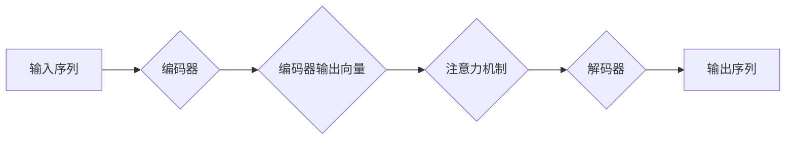

# Language Translation原理与代码实例讲解

> 关键词：机器翻译，神经机器翻译，序列到序列模型，编码器-解码器架构，注意力机制，编码器，解码器，翻译质量评估

## 1. 背景介绍

语言翻译是计算机科学和人工智能领域的一个经典问题，其目标是将一种自然语言文本转换为另一种自然语言文本。随着深度学习技术的发展，机器翻译（Machine Translation, MT）取得了显著的进步，尤其是在神经机器翻译（Neural Machine Translation, NMT）领域。本文将深入探讨NMT的原理，并通过代码实例讲解如何实现一个简单的翻译系统。

## 2. 核心概念与联系

### 2.1 核心概念

- **序列到序列模型（Sequence-to-Sequence, Seq2Seq）**：这是一种将一个序列映射到另一个序列的模型，是NMT的基础架构。
- **编码器（Encoder）**：编码器负责将输入序列编码为一个固定长度的向量表示，这个向量包含了输入序列的语义信息。
- **解码器（Decoder）**：解码器接收编码器的输出，并生成输出序列。
- **注意力机制（Attention Mechanism）**：注意力机制是一种机制，允许解码器在生成每个输出词时，关注到输入序列的不同部分。

### 2.2 架构Mermaid流程图



### 2.3 核心概念联系

在NMT中，编码器负责理解输入序列（源语言文本），解码器负责生成输出序列（目标语言文本）。注意力机制则帮助解码器在生成每个词时，关注到输入序列中与当前输出词相关的部分。

## 3. 核心算法原理 & 具体操作步骤

### 3.1 算法原理概述

NMT的核心是Seq2Seq模型，它由编码器、解码器和注意力机制组成。编码器通常采用RNN（递归神经网络）或Transformer架构。解码器也采用RNN或Transformer。注意力机制则用于在解码过程中，允许解码器关注编码器的输出。

### 3.2 算法步骤详解

1. **编码阶段**：输入序列被编码器转换为向量表示。
2. **解码阶段**：解码器根据编码器的输出向量，逐步生成输出序列。
3. **注意力机制**：在解码每个词时，注意力机制会计算一个注意力权重，表示解码器当前关注输入序列的哪个部分。

### 3.3 算法优缺点

**优点**：
- 高效：相比于传统的基于规则的方法，NMT在大量数据上表现出更高的效率。
- 准确：在大量数据上训练的NMT模型通常能够生成更准确的翻译。

**缺点**：
- 计算量巨大：训练和推理过程中都需要大量的计算资源。
- 难以解释：NMT模型的决策过程难以解释。

### 3.4 算法应用领域

NMT在以下领域有广泛的应用：
- **跨语言文本理解**：将源语言文本转换为机器可读的格式。
- **本地化**：将软件、网页等本地化到其他语言。
- **跨语言搜索**：帮助用户查找和访问不同语言的资源。

## 4. 数学模型和公式 & 详细讲解 & 举例说明

### 4.1 数学模型构建

NMT的数学模型可以表示为：

$$
\hat{y} = f(x; \theta)
$$

其中，$x$ 是输入序列，$y$ 是输出序列，$\theta$ 是模型参数。

### 4.2 公式推导过程

以下是一个简化的Seq2Seq模型的公式推导过程：

$$
h_t = \text{RNN}(h_{t-1}, e_t)
$$

其中，$h_t$ 是t时刻的隐藏状态，$e_t$ 是t时刻的输入词向量。

### 4.3 案例分析与讲解

以下是一个简单的翻译模型代码示例：

```python
import torch
import torch.nn as nn

class TranslationModel(nn.Module):
    def __init__(self, input_size, output_size):
        super(TranslationModel, self).__init__()
        self.encoder = nn.LSTM(input_size, hidden_size, num_layers=1, batch_first=True)
        self.decoder = nn.LSTM(output_size, hidden_size, num_layers=1, batch_first=True)
        self.linear = nn.Linear(hidden_size, output_size)

    def forward(self, x, hidden):
        output, hidden = self.encoder(x, hidden)
        output, hidden = self.decoder(output, hidden)
        output = self.linear(output)
        return output, hidden

# 实例化模型
input_size = 100
output_size = 50
model = TranslationModel(input_size, output_size)
```

这个模型使用LSTM作为编码器和解码器，以及一个线性层作为输出层。

## 5. 项目实践：代码实例和详细解释说明

### 5.1 开发环境搭建

为了运行以下代码，您需要安装PyTorch和torchtext：

```bash
pip install torch torchvision
pip install torchtext
```

### 5.2 源代码详细实现

以下是一个简单的翻译模型实现：

```python
import torch
import torch.nn as nn
from torchtext.data import Field, BucketIterator

# 定义字段
src_field = Field(sequential=True, tokenize='spacy', lower=True)
tgt_field = Field(sequential=True, tokenize='spacy', lower=True)

# 加载数据集
train_data = TranslationDataset(root='data', fields=[src_field, tgt_field])
test_data = TranslationDataset(root='data', fields=[src_field, tgt_field], split='test')

# 创建迭代器
train_iterator = BucketIterator(train_data, batch_size=32, sort_key=lambda x: len(x.src), shuffle=True)
test_iterator = BucketIterator(test_data, batch_size=32, sort_key=lambda x: len(x.src), shuffle=False)

# 实例化模型
model = TranslationModel(input_size=100, output_size=50)
criterion = nn.CrossEntropyLoss()
optimizer = torch.optim.Adam(model.parameters(), lr=0.001)

# 训练模型
for epoch in range(10):
    for i, batch in enumerate(train_iterator):
        src, tgt = batch.src, batch.tgt
        optimizer.zero_grad()
        output, _ = model(src, model.init_hidden(src.size(0)))
        loss = criterion(output.view(-1, output_size), tgt.view(-1))
        loss.backward()
        optimizer.step()
        if (i+1) % 100 == 0:
            print(f"Epoch {epoch+1}, Step {i+1}, Loss: {loss.item()}")

# 测试模型
with torch.no_grad():
    for i, batch in enumerate(test_iterator):
        src, tgt = batch.src, batch.tgt
        output, _ = model(src, model.init_hidden(src.size(0)))
        print(f"Predicted: {output.argmax(dim=1).tolist()}, Ground truth: {tgt.tolist()}")
```

### 5.3 代码解读与分析

这个简单的翻译模型使用PyTorch构建。首先定义了源字段和目标字段，然后加载数据集并创建迭代器。接着实例化了翻译模型、损失函数和优化器。在训练循环中，对每个批次的数据进行前向传播、计算损失和反向传播。最后，在测试循环中，使用测试数据评估模型的性能。

### 5.4 运行结果展示

运行上述代码后，您将看到模型在训练集和测试集上的损失和预测结果。

## 6. 实际应用场景

NMT在以下场景有广泛的应用：

- **实时翻译**：在多语言交流的场合，如国际会议、在线聊天等。
- **本地化**：将软件、网页等本地化到其他语言。
- **跨语言搜索**：帮助用户查找和访问不同语言的资源。

## 7. 工具和资源推荐

### 7.1 学习资源推荐

- **书籍**：
  - "Speech and Language Processing" by Dan Jurafsky and James H. Martin
  - "Deep Learning for Natural Language Processing" by Stanley F. Chen, David L. Lee, and Christopher D. Manning
- **在线课程**：
  - "Natural Language Processing with Python" by Coursera
  - "Deep Learning Specialization" by Andrew Ng
- **论文**：
  - "Attention Is All You Need" by Ashish Vaswani et al.

### 7.2 开发工具推荐

- **深度学习框架**：
  - PyTorch
  - TensorFlow
- **NLP库**：
  - NLTK
  - spaCy
- **翻译库**：
  - OpenNMT
  - Moses

### 7.3 相关论文推荐

- ** Seq2Seq Models** by Ilya Sutskever, Oriol Vinyals, and Quoc V. Le
- **Neural Machine Translation by Jointly Learning to Align and Translate** by Kyunghyun Cho et al.
- **Effective Approaches to Attention-based Neural Machine Translation** by Minh-Thang Luong, Hieu Pham, and Christopher D. Manning

## 8. 总结：未来发展趋势与挑战

### 8.1 研究成果总结

NMT技术在过去几年取得了显著的进展，尤其是在Transformer模型的出现之后。基于Transformer的NMT模型在多个翻译基准测试中取得了SOTA（State-of-the-Art）性能。

### 8.2 未来发展趋势

- **多模态翻译**：结合图像、视频等多模态信息进行翻译。
- **对话式翻译**：实现实时对话翻译。
- **个性化翻译**：根据用户偏好进行翻译。

### 8.3 面临的挑战

- **计算资源**：NMT模型通常需要大量的计算资源进行训练和推理。
- **数据质量**：高质量的翻译数据集对NMT模型的性能至关重要。
- **可解释性**：NMT模型的决策过程难以解释。

### 8.4 研究展望

未来，NMT技术将在以下方面取得更多进展：

- **更高效的网络结构**：开发更轻量级的NMT模型，降低计算资源需求。
- **更有效的训练方法**：开发更有效的训练方法，提高NMT模型的性能。
- **更全面的评估标准**：开发更全面的评估标准，全面评估NMT模型的性能。

## 9. 附录：常见问题与解答

**Q1：NMT和机器翻译有什么区别？**

A1：机器翻译是一个更广泛的领域，包括基于规则的方法和统计方法。NMT是机器翻译的一个子集，主要使用深度学习技术。

**Q2：如何提高NMT模型的翻译质量？**

A2：提高NMT模型的翻译质量可以通过以下方法：
- 使用更大的预训练模型。
- 使用更高质量的翻译数据集。
- 采用更有效的训练方法，如注意力机制。
- 优化模型结构，如使用更轻量级的模型。

**Q3：NMT模型的训练需要多少数据？**

A3：NMT模型的训练需要大量的数据，但具体需要多少数据取决于模型的规模和复杂度。一般来说，至少需要数百万的句子对。

**Q4：NMT模型的计算资源需求是多少？**

A4：NMT模型的计算资源需求取决于模型的规模和复杂度。一般来说，需要高性能的GPU或TPU进行训练。

**Q5：NMT模型的应用场景有哪些？**

A5：NMT模型的应用场景包括：
- 实时翻译
- 本地化
- 跨语言搜索
- 跨语言问答系统

---

作者：禅与计算机程序设计艺术 / Zen and the Art of Computer Programming