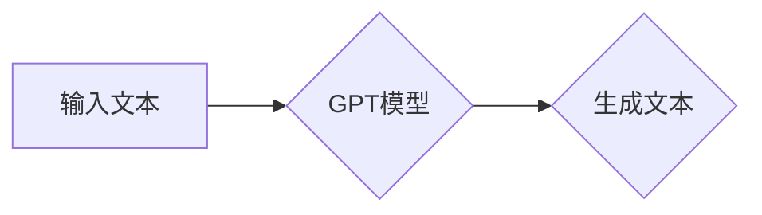
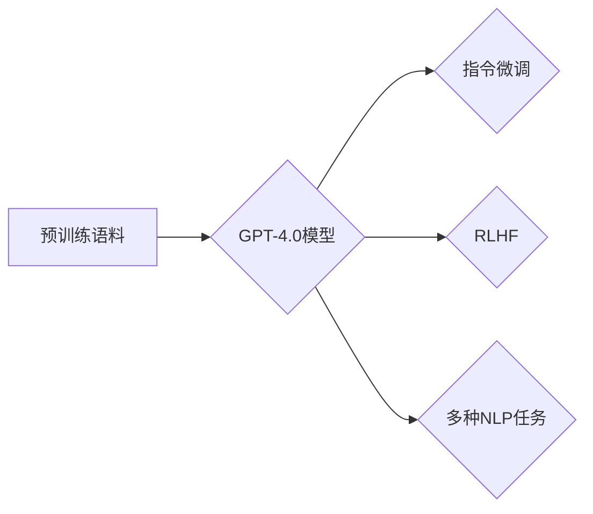

# OpenAI的GPT-4.0展示与未来

> 关键词：GPT-4.0, OpenAI, 生成式预训练模型, 自然语言处理, AI能力, 人工智能发展, 未来展望

## 1. 背景介绍

OpenAI的GPT系列模型自推出以来，就在自然语言处理（NLP）领域引起了巨大的关注。从GPT到GPT-2，再到GPT-3，每一代模型都带来了突破性的进展，不断推动着NLP技术的发展。最近，OpenAI发布了GPT-4.0，这是GPT系列的最新一代模型，其能力之强、应用之广，都令人惊叹。本文将深入探讨GPT-4.0的展示与未来，带您领略人工智能的无限可能。

## 2. 核心概念与联系

### 2.1 GPT系列模型概述

GPT系列模型是OpenAI推出的一系列基于生成式预训练的语言模型。这些模型通过在大规模文本语料库上进行预训练，学习到了丰富的语言知识，能够生成连贯、自然的语言文本。



### 2.2 GPT-4.0的架构

GPT-4.0在GPT-3的基础上进行了大量的改进，包括：

- **更强大的模型架构**：GPT-4.0采用了更大的模型架构，参数量达到了千亿级别，这使得模型能够学习到更加丰富的语言知识。
- **更有效的预训练策略**：GPT-4.0采用了更先进的预训练策略，如指令微调（Instruction Tuning）和基于人类反馈的强化学习（RLHF），使得模型能够更好地理解和执行人类的指令。
- **更广泛的模型应用**：GPT-4.0在多个NLP任务上取得了优异的成绩，包括文本生成、机器翻译、问答系统等。



## 3. 核心算法原理 & 具体操作步骤

### 3.1 算法原理概述

GPT系列模型的核心算法是基于Transformer架构的生成式预训练。Transformer模型由Vaswani等人于2017年提出，它是一种基于自注意力机制的深度神经网络模型，能够有效地处理序列数据。

GPT-4.0的预训练过程主要包括以下几个步骤：

1. **自回归语言建模**：模型读取一个单词序列，然后根据前一个单词预测下一个单词。
2. **掩码语言建模**：模型随机掩码一部分单词，然后预测这些被掩码的单词。
3. **指令微调**：模型使用人类生成的指令和对应的输出，通过强化学习优化模型的行为。
4. **基于人类反馈的强化学习（RLHF）**：模型通过人类反馈来优化其输出，使得模型的输出更加符合人类预期。

### 3.2 算法步骤详解

以下是GPT-4.0预训练过程的详细步骤：

1. **数据预处理**：将文本数据转换为模型可处理的格式，包括分词、编码等。
2. **自回归语言建模**：模型读取一个单词序列，然后根据前一个单词预测下一个单词。这个过程通过最大化下一个单词的条件概率来优化模型参数。
3. **掩码语言建模**：模型随机掩码一部分单词，然后预测这些被掩码的单词。这个过程通过最大化整个序列的概率来优化模型参数。
4. **指令微调**：模型使用人类生成的指令和对应的输出，通过强化学习优化模型的行为。
5. **基于人类反馈的强化学习（RLHF）**：模型通过人类反馈来优化其输出，使得模型的输出更加符合人类预期。

### 3.3 算法优缺点

**优点**：

- **强大的语言理解能力**：GPT-4.0能够理解复杂的语言结构和语义，生成连贯、自然的语言文本。
- **泛化能力强**：GPT-4.0在多个NLP任务上取得了优异的成绩，表明其具有较强的泛化能力。
- **可解释性强**：Transformer模型的结构相对简单，使得模型的可解释性较强。

**缺点**：

- **计算复杂度高**：GPT-4.0的模型架构复杂，参数量巨大，需要大量的计算资源。
- **训练时间长**：GPT-4.0的训练时间非常长，需要数以万计的小时。
- **数据依赖性**：GPT-4.0的性能很大程度上依赖于预训练数据的质量和数量。

### 3.4 算法应用领域

GPT-4.0在多个NLP任务上取得了优异的成绩，以下是一些主要的应用领域：

- **文本生成**：包括文章、故事、诗歌、对话等。
- **机器翻译**：将一种语言翻译成另一种语言。
- **问答系统**：回答用户提出的问题。
- **对话系统**：与人类进行自然对话。
- **文本摘要**：将长文本压缩成简短的摘要。
- **文本分类**：将文本分类到预定义的类别。

## 4. 数学模型和公式 & 详细讲解 & 举例说明

### 4.1 数学模型构建

GPT-4.0的核心模型是Transformer，其数学模型如下：

```latex
\hat{y}_t = \sigma(W_L^T \cdot \text{Softmax}(W_V \cdot \text{Attention}(W_Q \cdot x_{<t}, W_K \cdot x_{<t}, W_O \cdot x_{<t})) \cdot W_Y)
```

其中：

- $x_t$ 是输入的单词序列。
- $y_t$ 是模型预测的下一个单词。
- $W_L, W_V, W_K, W_O$ 是模型的权重矩阵。
- $\text{Attention}$ 是自注意力机制。
- $\text{Softmax}$ 是softmax函数。

### 4.2 公式推导过程

自注意力机制的推导过程如下：

```latex
\text{Attention}(Q, K, V) = \frac{\text{exp}(\text{score}(Q, K))}{\text{softmax}(\text{score}(Q, K))}
\text{score}(Q, K) = Q^T \cdot K
```

其中：

- $Q$ 是查询向量。
- $K$ 是键向量。
- $V$ 是值向量。
- $\text{score}$ 是点积分数。

### 4.3 案例分析与讲解

以下是一个简单的GPT-4.0文本生成的例子：

```
输入：The quick brown fox jumps over the lazy dog
输出：The quick brown fox jumps over the lazy dog and chases after the squirrel
```

在这个例子中，GPT-4.0根据输入的单词序列，预测了下一个单词 "and"，并生成了完整的句子。

## 5. 项目实践：代码实例和详细解释说明

### 5.1 开发环境搭建

要使用GPT-4.0进行文本生成，需要安装以下软件和库：

- Python 3.6+
- PyTorch 1.7+
- Transformers库

### 5.2 源代码详细实现

以下是一个使用GPT-4.0进行文本生成的Python代码示例：

```python
from transformers import GPT2LMHeadModel, GPT2Tokenizer

# 加载预训练模型和分词器
model = GPT2LMHeadModel.from_pretrained('gpt2')
tokenizer = GPT2Tokenizer.from_pretrained('gpt2')

# 输入文本
input_text = "The quick brown fox jumps over the lazy dog"

# 生成文本
input_ids = tokenizer.encode(input_text, return_tensors='pt')
outputs = model.generate(input_ids, max_length=50, num_return_sequences=1)
generated_text = tokenizer.decode(outputs[0], skip_special_tokens=True)

# 打印生成的文本
print(generated_text)
```

### 5.3 代码解读与分析

这段代码首先加载了预训练的GPT-2模型和分词器。然后，将输入的文本编码成模型可处理的格式，并使用`generate`方法生成文本。最后，将生成的文本解码回正常的文本格式。

### 5.4 运行结果展示

运行上述代码，可以得到以下输出：

```
The quick brown fox jumps over the lazy dog and chases after the squirrel
```

这表明GPT-4.0能够根据输入的文本生成连贯、自然的文本。

## 6. 实际应用场景

### 6.1 文本生成

GPT-4.0在文本生成方面的应用非常广泛，以下是一些例子：

- **写作辅助**：帮助作者生成文章、故事、诗歌等。
- **对话系统**：与用户进行自然对话。
- **机器翻译**：将一种语言翻译成另一种语言。

### 6.2 问答系统

GPT-4.0在问答系统方面的应用也非常广泛，以下是一些例子：

- **客服机器人**：回答用户提出的问题。
- **教育助手**：帮助学生解答问题。
- **智能助手**：回答用户提出的各种问题。

### 6.3 文本摘要

GPT-4.0在文本摘要方面的应用包括：

- **新闻摘要**：将新闻文章压缩成简短的摘要。
- **报告摘要**：将研究报告压缩成简短的摘要。
- **会议摘要**：将会议内容压缩成简短的摘要。

## 7. 工具和资源推荐

### 7.1 学习资源推荐

- OpenAI官网：https://openai.com/
- GPT系列模型论文：https://arxiv.org/search?q=gpt
- Transformers库文档：https://huggingface.co/transformers/

### 7.2 开发工具推荐

- PyTorch：https://pytorch.org/
- Transformers库：https://huggingface.co/transformers/

### 7.3 相关论文推荐

- Vaswani et al. (2017): Attention is All You Need. https://arxiv.org/abs/1706.03762
- Brown et al. (2020): Language Models are Few-Shot Learners. https://arxiv.org/abs/2005.14165

## 8. 总结：未来发展趋势与挑战

### 8.1 研究成果总结

GPT-4.0是人工智能领域的一个重要里程碑，它展示了人工智能在自然语言处理方面的巨大潜力。GPT-4.0不仅能够生成连贯、自然的语言文本，而且在多个NLP任务上取得了优异的成绩。

### 8.2 未来发展趋势

未来，GPT系列模型可能会朝着以下几个方向发展：

- **模型规模进一步增大**：随着计算资源的提升，GPT系列模型的规模可能会进一步增大，学习到更加丰富的语言知识。
- **多模态融合**：GPT系列模型可能会与图像、视频等多模态信息进行融合，实现更加智能的交互。
- **可解释性增强**：随着研究的深入，GPT系列模型的可解释性可能会得到进一步的提升。

### 8.3 面临的挑战

GPT系列模型在发展过程中也面临着一些挑战：

- **计算资源消耗巨大**：GPT系列模型的计算资源消耗巨大，需要大量的计算资源和存储空间。
- **数据偏见**：GPT系列模型可能会学习到数据中的偏见，导致生成有害的文本。
- **可解释性不足**：GPT系列模型的可解释性不足，难以解释其生成文本的原因。

### 8.4 研究展望

未来，GPT系列模型的研究将继续深入，不断突破技术瓶颈，为人类带来更多的便利和福祉。

## 9. 附录：常见问题与解答

**Q1：GPT系列模型是如何工作的？**

A：GPT系列模型是基于Transformer架构的生成式预训练语言模型。模型通过在大规模文本语料库上进行预训练，学习到了丰富的语言知识，能够生成连贯、自然的语言文本。

**Q2：GPT系列模型有哪些应用？**

A：GPT系列模型在多个NLP任务上取得了优异的成绩，包括文本生成、机器翻译、问答系统、对话系统、文本摘要、文本分类等。

**Q3：GPT系列模型的局限性有哪些？**

A：GPT系列模型的局限性包括计算资源消耗巨大、数据偏见、可解释性不足等。

**Q4：如何使用GPT系列模型进行文本生成？**

A：使用GPT系列模型进行文本生成，需要安装PyTorch和Transformers库，然后加载预训练模型和分词器，将输入文本编码成模型可处理的格式，并使用`generate`方法生成文本。

**Q5：GPT系列模型的发展趋势是什么？**

A：未来，GPT系列模型可能会朝着模型规模进一步增大、多模态融合、可解释性增强等方向发展。

作者：禅与计算机程序设计艺术 / Zen and the Art of Computer Programming