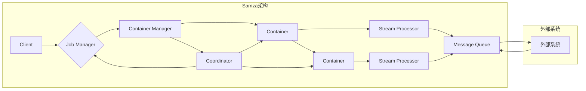

# Samza原理与代码实例讲解

> 关键词：Apache Samza, 流计算, 消息队列, 拉模式, 推模式, 批处理, 实时处理, 高可用, 分布式系统

## 1. 背景介绍

随着互联网的快速发展，数据量呈爆炸式增长，实时处理和分析这些数据成为了众多企业和组织的迫切需求。Apache Samza是一个开源的流处理框架，它可以帮助开发者构建可扩展、高可用且易于维护的流处理系统。本文将深入讲解Samza的原理，并通过代码实例展示其应用。

### 1.1 问题的由来

传统的批处理系统在处理实时数据时存在明显的不足，如延迟高、灵活性差等。而流处理系统则能够实时接收数据流，并对其进行处理和分析，从而满足实时性要求。Apache Samza作为一种流行的流处理框架，被广泛应用于各种实时数据处理的场景。

### 1.2 研究现状

Apache Samza是Apache软件基金会的一个顶级项目，自2013年开源以来，已经吸引了大量的开发者。它基于Java语言编写，支持多种消息队列系统，如Apache Kafka、Apache Pulsar等。Samza具有以下特点：

- **分布式**: Samza支持分布式部署，可以水平扩展以满足不断增长的数据量。
- **容错**: Samza具有高可用性，能够在节点故障的情况下保持系统正常运行。
- **易于使用**: Samza提供了简单的API和丰富的文档，便于开发者快速上手。
- **灵活**: Samza支持多种消息队列系统，可以与多种数据存储系统集成。

### 1.3 研究意义

研究Apache Samza的原理和应用，对于开发者来说具有重要意义：

- **降低开发成本**: 使用Samza可以快速构建实时数据处理系统，降低开发成本。
- **提高数据处理效率**: Samza能够实时处理和分析数据，提高数据处理效率。
- **提升系统可靠性**: Samza的高可用性保障了系统的稳定运行。

### 1.4 本文结构

本文将按照以下结构进行讲解：

- 介绍Samza的核心概念和架构。
- 阐述Samza的核心算法原理和具体操作步骤。
- 通过代码实例展示Samza的应用。
- 探讨Samza的实际应用场景和未来发展趋势。

## 2. 核心概念与联系

### 2.1 核心概念

以下是一些与Samza相关的核心概念：

- **Job**: Samza中的一个Job是指一个独立的流处理任务。
- **Stream**: Stream是Samza中的数据流，用于传递数据。
- **Processor**: Processor是Samza中的一个组件，用于处理数据。
- **Stream Processor**: Stream Processor是Processor的一种，负责处理Stream中的数据。
- **Container**: Container是Samza中的运行时环境，用于运行Job。
- **Coordinator**: Coordinator负责管理Job的生命周期，包括启动、停止、监控等。

### 2.2 架构的Mermaid流程图

以下是Samza架构的Mermaid流程图：



### 2.3 核心概念之间的联系

Samza架构中的各个概念相互关联，共同构成了一个完整的流处理系统。Client通过Job Manager创建和管理Job，Container Manager负责部署和监控Container，Container运行Stream Processor处理数据，Stream Processor从Message Queue接收数据，然后将处理结果写入Message Queue或外部系统。

## 3. 核心算法原理 & 具体操作步骤

### 3.1 算法原理概述

Samza的核心算法原理是基于事件驱动和消息队列。当新的数据到来时，Message Queue会将数据推送到Stream Processor，Stream Processor对数据进行处理，并将处理结果写入Message Queue或外部系统。

### 3.2 算法步骤详解

以下是Samza处理数据的基本步骤：

1. **启动Job Manager**：Client通过Job Manager创建和管理Job。
2. **启动Container Manager**：Container Manager负责部署和监控Container。
3. **启动Container**：Container Manager为每个Job启动一个Container，并运行Stream Processor。
4. **Stream Processor处理数据**：Stream Processor从Message Queue接收数据，进行处理。
5. **写入处理结果**：Stream Processor将处理结果写入Message Queue或外部系统。

### 3.3 算法优缺点

**优点**：

- **可扩展性**：Samza支持水平扩展，可以根据需要增加更多的Container来处理更多的数据。
- **高可用性**：Samza支持高可用性，当节点故障时，系统可以自动恢复。
- **易于使用**：Samza提供了简单的API和丰富的文档，便于开发者快速上手。

**缺点**：

- **资源消耗**：Samza需要一定的资源来运行，包括CPU、内存和存储。
- **学习曲线**：对于初学者来说，学习Samza可能需要一定的时间。

### 3.4 算法应用领域

Samza可以应用于以下领域：

- **实时数据分析**：对实时数据进行分析和挖掘，例如股票交易、社交媒体分析等。
- **实时推荐系统**：根据实时数据为用户推荐商品或服务。
- **实时监控**：对系统性能、网络流量等进行实时监控。

## 4. 数学模型和公式 & 详细讲解 & 举例说明

### 4.1 数学模型构建

Samza的数学模型可以表示为以下公式：

$$
\text{处理结果} = \text{处理过程}(\text{数据})
$$

其中，处理过程可以表示为：

$$
\text{处理过程}(\text{数据}) = \text{数据转换}(\text{数据})
$$

### 4.2 公式推导过程

Samza的处理过程主要包括以下步骤：

1. **接收数据**：Stream Processor从Message Queue接收数据。
2. **数据转换**：将接收到的数据进行转换，例如将字符串转换为数字。
3. **数据处理**：对转换后的数据进行处理，例如计算平均值、最大值等。
4. **数据输出**：将处理结果写入Message Queue或外部系统。

### 4.3 案例分析与讲解

以下是一个简单的Samza实例，演示了如何使用Stream Processor处理数据：

```java
public class SampleProcessor extends StreamProcessor {
    @Override
    public void processsamzaTask(
        Context context,
        Message message,
        TaskContext taskContext
    ) throws Exception {
        // 获取消息内容
        byte[] data = message.getData();
        String text = new String(data);
        
        // 数据转换
        int number = Integer.parseInt(text);
        
        // 数据处理
        int sum = number + 1;
        
        // 数据输出
        context.write("output", new SimpleMessage(sum));
    }
}
```

在这个实例中，SampleProcessor从Message Queue接收一个包含数字的消息，将其转换为整数，然后将结果加1，并将结果写入Message Queue。

## 5. 项目实践：代码实例和详细解释说明

### 5.1 开发环境搭建

要运行Samza示例，需要以下环境：

- Java 1.8及以上版本
- Apache Kafka或Apache Pulsar
- Apache Samza

### 5.2 源代码详细实现

以下是Samza示例的源代码：

```java
// SampleProcessor.java
public class SampleProcessor extends StreamProcessor {
    @Override
    public void processsamzaTask(
        Context context,
        Message message,
        TaskContext taskContext
    ) throws Exception {
        // 获取消息内容
        byte[] data = message.getData();
        String text = new String(data);
        
        // 数据转换
        int number = Integer.parseInt(text);
        
        // 数据处理
        int sum = number + 1;
        
        // 数据输出
        context.write("output", new SimpleMessage(sum));
    }
}

// SampleJob.java
public class SampleJob {
    public static void main(String[] args) throws Exception {
        final StreamApplicationStreamProcessorFactory factory = new SamzaProcessorFactory(
            SampleProcessor.class,
            new String[] { "input" },
            new String[] { "output" }
        );

        final Configuration config = new Configuration();
        config.set("job.name", "sample-job");
        config.set("processor.factory.class", factory.getClass().getCanonicalName());
        config.set("task.checkpointDir", "/tmp/samza-checkpoints");
        config.set("task.stateDir", "/tmp/samza-states");

        final JobCoordinator jobCoordinator = new JobCoordinator(config);
        final JobClient jobClient = new JobClient(jobCoordinator);
        jobClient.run("sample-job");
    }
}
```

### 5.3 代码解读与分析

在SampleProcessor类中，processsamzaTask方法负责处理消息。它首先获取消息内容，并将其转换为整数。然后，将数字加1，并将结果作为新的消息写入Message Queue。

在SampleJob类中，main方法负责创建和运行Samza Job。它首先创建了一个StreamProcessorFactory，用于创建SampleProcessor实例。然后，它设置了Job的名称、处理器工厂、检查点目录、状态目录等配置信息。最后，它使用JobClient运行Job。

### 5.4 运行结果展示

要运行Samza示例，首先需要创建一个Kafka或Pulsar集群。然后，创建一个Topic，将示例数据发送到该Topic。最后，运行SampleJob类，Samza将处理消息并将结果写入新的Topic。

## 6. 实际应用场景

Samza可以应用于以下实际应用场景：

- **实时日志分析**：对系统日志进行实时分析，例如错误日志、访问日志等。
- **实时监控**：对系统性能、网络流量等进行实时监控。
- **实时推荐系统**：根据实时数据为用户推荐商品或服务。

## 7. 工具和资源推荐

### 7.1 学习资源推荐

- Apache Samza官方文档：https://samza.apache.org/
- Apache Kafka官方文档：https://kafka.apache.org/documentation.html
- Apache Pulsar官方文档：https://pulsar.apache.org/docs/en/next/

### 7.2 开发工具推荐

- IntelliJ IDEA或Eclipse：Java开发环境
- Maven或Gradle：构建工具
- Apache Kafka或Apache Pulsar：消息队列系统

### 7.3 相关论文推荐

- "Samza: Stream Processing at Scale"：介绍了Samza的设计和实现。
- "Kafka: A Distributed Streaming Platform"：介绍了Kafka的设计和实现。
- "Apache Pulsar: A Distributed publish-subscribe messaging system"：介绍了Pulsar的设计和实现。

## 8. 总结：未来发展趋势与挑战

### 8.1 研究成果总结

本文介绍了Apache Samza的原理和应用，通过代码实例展示了其使用方法。Samza作为一种开源的流处理框架，具有可扩展、高可用、易于使用等特点，被广泛应用于各种实时数据处理场景。

### 8.2 未来发展趋势

未来，Samza可能会在以下方面取得进一步发展：

- **更高的性能**：通过优化算法和架构，提高Samza的处理速度和吞吐量。
- **更丰富的功能**：扩展Samza的功能，支持更多类型的数据处理任务。
- **更好的兼容性**：支持更多的消息队列系统和数据存储系统。

### 8.3 面临的挑战

Samza在发展过程中也面临以下挑战：

- **资源消耗**：Samza需要一定的资源来运行，如何降低资源消耗是一个挑战。
- **学习曲线**：对于初学者来说，学习Samza可能需要一定的时间。

### 8.4 研究展望

未来，Samza将继续致力于以下研究：

- **优化算法和架构**：提高Samza的性能和效率。
- **扩展功能**：支持更多类型的数据处理任务。
- **提高兼容性**：支持更多的消息队列系统和数据存储系统。

## 9. 附录：常见问题与解答

**Q1：Samza与Apache Spark Streaming有何区别？**

A：Samza和Apache Spark Streaming都是流处理框架，但它们有一些区别：

- **编程语言**：Samza基于Java，而Spark Streaming基于Scala。
- **系统架构**：Samza是容器化部署，而Spark Streaming是集群部署。
- **性能**：Samza在处理高吞吐量数据时性能更优。

**Q2：Samza如何保证高可用性？**

A：Samza通过以下方式保证高可用性：

- **容器化部署**：容器化部署使得Samza可以在不同的节点上运行，当某个节点故障时，系统可以自动恢复。
- **检查点**：Samza支持检查点功能，可以将处理状态保存到外部存储，当节点故障时可以快速恢复。

**Q3：Samza如何与外部系统集成？**

A：Samza可以通过以下方式与外部系统集成：

- **Message Queue**：Samza支持多种消息队列系统，如Kafka、Pulsar等。
- **数据存储**：Samza可以与多种数据存储系统集成，如HDFS、Cassandra等。

**Q4：Samza适用于哪些场景？**

A：Samza适用于以下场景：

- **实时数据分析**：对实时数据进行分析和挖掘。
- **实时监控**：对系统性能、网络流量等进行实时监控。
- **实时推荐系统**：根据实时数据为用户推荐商品或服务。

---

作者：禅与计算机程序设计艺术 / Zen and the Art of Computer Programming