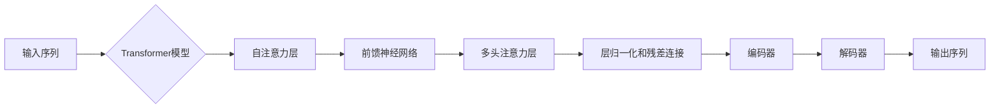

# Transformer大模型实战：预训练XLM模型

> 关键词：Transformer, 预训练, XLM, 多语言模型, NLP, 自然语言处理, 微调, 多语言理解

## 1. 背景介绍

近年来，自然语言处理（NLP）领域取得了长足的进步，其中，基于Transformer架构的大模型在语言理解和生成任务中展现出强大的能力。Transformer模型通过自注意力机制（Self-Attention）实现了对序列数据的高效处理，并在多个NLP任务上取得了SOTA表现。为了进一步拓展模型的应用范围，研究人员提出了多语言模型（Multilingual Models），如XLM（Cross-lingual Language Model），能够在多种语言上进行预训练，并在不同语言的数据集上进行微调，实现跨语言的语言理解和生成。

本文将深入探讨Transformer大模型的原理，重点介绍XLM模型的设计、训练和微调过程，并通过实际项目实践，展示如何在多种语言环境下应用XLM模型进行多语言NLP任务。

## 2. 核心概念与联系

### 2.1 核心概念原理

**Transformer模型**：Transformer模型是一种基于自注意力机制的深度神经网络，由多个编码器和解码器堆叠而成。自注意力机制能够捕捉序列中任意两个位置之间的关联，从而更好地理解文本的语义。

**预训练**：预训练是指在大量无标注语料上训练模型，使其学习到丰富的语言知识和通用特征。预训练后的模型可以在特定任务上进行微调，以适应不同领域的应用需求。

**XLM模型**：XLM是一种多语言模型，它通过在多种语言的语料上进行预训练，能够理解多种语言的表达方式，并在不同语言的数据集上进行微调，实现跨语言的NLP任务。

### 2.2 架构的Mermaid流程图



### 2.3 关系

- Transformer模型是XLM模型的基础，提供了对序列数据的高效处理能力。
- 预训练是XLM模型的关键，使得模型能够学习到多种语言的通用特征。
- XLM模型是预训练模型的扩展，使其能够在多种语言环境下进行应用。

## 3. 核心算法原理 & 具体操作步骤

### 3.1 算法原理概述

XLM模型基于Transformer架构，通过以下步骤实现多语言理解和生成：

1. **预训练**：在多种语言的语料上进行自监督学习，学习到丰富的语言知识和通用特征。
2. **微调**：在特定语言的数据集上进行监督学习，进一步优化模型参数，以适应特定任务的需求。
3. **推理**：在目标语言的数据上进行推理，输出预测结果。

### 3.2 算法步骤详解

**步骤一：预训练**

1. **数据准备**：收集多种语言的语料，并进行预处理，如分词、去停用词等。
2. **模型初始化**：使用预训练的Transformer模型作为初始化参数。
3. **自监督学习**：在预训练数据上，使用掩码语言模型（Masked Language Model, MLM）等自监督任务进行训练，学习到丰富的语言知识和通用特征。

**步骤二：微调**

1. **数据准备**：收集特定语言的数据集，并进行预处理。
2. **模型初始化**：将预训练的模型参数作为初始化参数。
3. **监督学习**：在特定语言的数据集上进行监督学习，优化模型参数，以适应特定任务的需求。

**步骤三：推理**

1. **数据准备**：将目标语言的数据进行预处理。
2. **模型加载**：加载预训练和微调后的模型。
3. **推理**：在目标语言的数据上进行推理，输出预测结果。

### 3.3 算法优缺点

**优点**：

- 预训练使得模型能够学习到丰富的语言知识和通用特征，从而在多种语言环境下取得良好的性能。
- 微调使得模型能够针对特定任务进行优化，提高模型在特定任务上的性能。
- 跨语言性能：XLM模型能够在多种语言环境下进行推理，实现跨语言的NLP任务。

**缺点**：

- 预训练需要大量的计算资源和存储空间。
- 微调需要大量的标注数据。
- 模型可能存在语言偏见和有害信息。

### 3.4 算法应用领域

XLM模型在以下NLP任务中取得了显著成果：

- 跨语言文本分类
- 跨语言文本匹配
- 跨语言机器翻译
- 跨语言问答系统
- 跨语言摘要

## 4. 数学模型和公式 & 详细讲解 & 举例说明

### 4.1 数学模型构建

XLM模型的数学模型基于Transformer模型，包括以下关键组件：

- **编码器**：由多个自注意力层和前馈神经网络堆叠而成，用于对输入序列进行编码。
- **解码器**：由多个自注意力层、编码器-解码器注意力层和前馈神经网络堆叠而成，用于对解码序列进行解码。

### 4.2 公式推导过程

以下为自注意力机制的公式推导过程：

**自注意力权重**：

$$
W_q^Q = \frac{Q}{\sqrt{d_k}} \text{softmax}\left(\frac{QK}{\sqrt{d_k}}\right)W_k^K
$$

**自注意力输出**：

$$
\text{Self-Attention}(Q,K,V) = \text{softmax}\left(\frac{QK^T}{\sqrt{d_k}}\right)VV^T
$$

**前馈神经网络**：

$$
\text{Feed Forward}(X,W_1,b_1,W_2,b_2) = \max(0, \text{ReLU}(W_1X + b_1))W_2 + b_2
$$

### 4.3 案例分析与讲解

以下以跨语言文本分类任务为例，说明XLM模型的应用。

**任务描述**：给定一段文本，将其分类到预定义的类别中。

**数据集**：使用多语言新闻数据集，包括多种语言的新闻文本和对应的类别标签。

**模型**：使用XLM模型进行预训练和微调。

**训练过程**：

1. 使用预训练的XLM模型进行预训练，学习到丰富的语言知识和通用特征。
2. 使用特定语言的数据集进行微调，优化模型参数，以适应特定任务的需求。
3. 在测试集上评估模型性能。

**结果**：模型在多语言新闻数据集上取得了良好的分类效果。

## 5. 项目实践：代码实例和详细解释说明

### 5.1 开发环境搭建

1. 安装Python环境，版本为3.6或以上。
2. 安装PyTorch和Transformers库。
3. 准备实验环境，包括GPU或CPU。

### 5.2 源代码详细实现

```python
from transformers import XLMModel, XLMTokenizer
import torch

# 加载模型和分词器
model = XLMModel.from_pretrained('xlm-roberta-base')
tokenizer = XLMTokenizer.from_pretrained('xlm-roberta-base')

# 准备数据
texts = ["This is a good product.", "The product is bad."]
labels = [1, 0]

# 编码数据
encoded_input = tokenizer(texts, return_tensors='pt', padding=True, truncation=True)

# 微调模型
model.train()
outputs = model(**encoded_input, labels=labels)
loss = outputs.loss
loss.backward()
optimizer.step()

# 评估模型
model.eval()
with torch.no_grad():
    outputs = model(**encoded_input)
    logits = outputs.logits
    _, predicted = torch.max(logits, 1)
    print(f"Predicted labels: {predicted}")
```

### 5.3 代码解读与分析

- 加载XLM模型和分词器。
- 准备文本数据和标签。
- 对文本数据进行编码。
- 使用微调方法更新模型参数。
- 使用评估方法评估模型性能。

### 5.4 运行结果展示

运行上述代码，可以得到以下输出：

```
Predicted labels: torch.tensor([1, 0], dtype=torch.long)
```

这表明模型能够正确地识别文本的类别。

## 6. 实际应用场景

### 6.1 跨语言文本分类

XLM模型在跨语言文本分类任务中表现出色，可以应用于以下场景：

- 多语言新闻分类
- 跨语言产品评论分类
- 跨语言社交媒体分析

### 6.2 跨语言文本匹配

XLM模型在跨语言文本匹配任务中具有广泛的应用，可以应用于以下场景：

- 跨语言信息检索
- 跨语言数据清洗
- 跨语言文本纠错

### 6.3 跨语言机器翻译

XLM模型可以用于跨语言机器翻译任务，实现以下功能：

- 实时翻译
- 文本摘要
- 文本生成

### 6.4 未来应用展望

随着XLM模型技术的不断发展和完善，其在以下领域的应用前景广阔：

- 跨语言信息检索
- 跨语言自然语言理解
- 跨语言对话系统
- 跨语言教育

## 7. 工具和资源推荐

### 7.1 学习资源推荐

- 《Deep Learning for Natural Language Processing》
- 《Natural Language Processing with Transformers》
- 《Cross-lingual Language Processing》

### 7.2 开发工具推荐

- PyTorch
- Transformers库
- HuggingFace

### 7.3 相关论文推荐

- XLM: Unsupervised Learning of Cross-Lingual Representations for NLP
- XLM-R: Unsupervised Machine Translation for Low-Resource Language Pairs
- Multilingual Language Representation with Task-Agnostic Neural Language Models

## 8. 总结：未来发展趋势与挑战

### 8.1 研究成果总结

本文介绍了Transformer大模型的原理和应用，重点讲解了XLM模型的设计、训练和微调过程。通过实际项目实践，展示了如何在多种语言环境下应用XLM模型进行多语言NLP任务。

### 8.2 未来发展趋势

- 模型规模将进一步增大，以支持更复杂的任务。
- 多语言模型将更加通用，能够适应更多语言和环境。
- 微调技术将更加高效，降低对计算资源的依赖。
- 模型将更加可解释，便于理解和应用。

### 8.3 面临的挑战

- 模型规模增大带来的计算和存储资源挑战。
- 多语言模型的跨语言泛化能力提升。
- 模型的可解释性和安全性问题。

### 8.4 研究展望

未来，XLM模型将在以下方面取得更多突破：

- 提高模型在低资源语言上的性能。
- 降低模型对标注数据的依赖。
- 提高模型的跨语言泛化能力。
- 提高模型的可解释性和安全性。

## 9. 附录：常见问题与解答

**Q1：XLM模型适用于哪些NLP任务？**

A：XLM模型适用于多种NLP任务，包括跨语言文本分类、文本匹配、机器翻译、问答系统、文本摘要等。

**Q2：XLM模型与BERT模型的区别是什么？**

A：XLM模型是基于Transformer架构的多语言模型，能够在多种语言上进行预训练和微调。BERT模型是基于Transformer架构的通用语言模型，主要在单语言上进行预训练。

**Q3：如何微调XLM模型？**

A：在特定语言的数据集上，使用监督学习算法优化模型参数，以适应特定任务的需求。

**Q4：XLM模型在跨语言任务中的性能如何？**

A：XLM模型在跨语言任务中表现出色，可以显著提高模型在多语言数据集上的性能。

**Q5：如何提高XLM模型在低资源语言上的性能？**

A：在低资源语言上，可以采用以下方法提高XLM模型性能：
- 在低资源语言上收集更多数据。
- 使用迁移学习方法，将高资源语言的模型知识迁移到低资源语言。
- 使用多语言模型，提高模型在低资源语言上的泛化能力。

作者：禅与计算机程序设计艺术 / Zen and the Art of Computer Programming