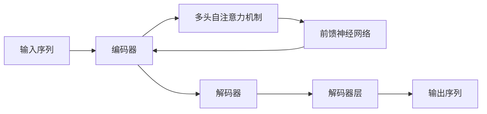

> 关键词：Transformer，大模型，预训练，语言模型，自监督学习，下游任务，微调，NLP，AI

---

# Transformer大模型实战：预训练策略

Transformer模型自2017年由Google提出以来，就以其强大的语言理解和生成能力，彻底改变了自然语言处理（NLP）领域的格局。特别是大模型的兴起，使得Transformer模型在NLP任务中取得了前所未有的效果。本文将深入探讨Transformer大模型的预训练策略，从原理到实战，带你走进大模型的神秘世界。

## 1. 背景介绍

### 1.1 问题的由来

传统的NLP任务，如文本分类、情感分析、机器翻译等，往往需要大量的标注数据来进行训练。然而，标注数据的获取成本高、耗时长，且难以满足大规模训练的需求。为了解决这一问题，研究人员提出了预训练（Pre-training）的概念，即在大规模无标注文本语料上预训练一个通用的语言模型，然后利用少量标注数据对模型进行微调（Fine-tuning），以适应特定的下游任务。

### 1.2 研究现状

近年来，随着计算能力的提升和大规模语料库的积累，预训练大模型取得了显著进展。以BERT（Bidirectional Encoder Representations from Transformers）为代表的预训练模型，通过自监督学习（Self-supervised Learning）的方式，在大规模文本语料上学习到了丰富的语言知识，并在多种下游任务上取得了优异的性能。

### 1.3 研究意义

预训练大模型的出现，不仅降低了NLP任务对标注数据的依赖，还极大地提高了模型的性能和泛化能力。它为NLP技术的发展和应用开辟了新的道路，推动了人工智能技术在自然语言理解领域的突破。

### 1.4 本文结构

本文将分为以下几个部分：

- 第2部分：介绍Transformer模型和预训练的基本概念。
- 第3部分：深入解析Transformer模型的核心原理和预训练策略。
- 第4部分：探讨预训练大模型在实际应用中的挑战和解决方案。
- 第5部分：通过实战案例展示如何使用预训练大模型进行NLP任务。
- 第6部分：展望预训练大模型的未来发展趋势和潜在挑战。

## 2. 核心概念与联系

### 2.1 Transformer模型

Transformer模型是一种基于自注意力（Self-Attention）机制的深度神经网络，它突破了传统的循环神经网络（RNN）在处理长序列数据时的局限性。Transformer模型主要由编码器（Encoder）和解码器（Decoder）两部分组成。

**Mermaid 流程图**：



### 2.2 预训练

预训练是指在大量无标注数据上对模型进行训练，以学习通用语言知识。常见的预训练任务包括：

- **掩码语言模型（Masked Language Model, MLM）**：随机选择一部分词进行掩码，预测这些被掩码的词。
- **下一句预测（Next Sentence Prediction, NSP）**：给定两个句子，预测第二个句子是否是第一个句子的下一句。
- **句子排序（Sentence Ordering）**：对一组句子进行排序，判断句子之间的逻辑关系。

### 2.3 自监督学习

自监督学习是一种无监督学习技术，它通过设计无标注数据上的自监督任务，使模型在没有标注数据的情况下也能学习到丰富的知识。自监督学习是预训练大模型的核心技术之一。

## 3. 核心算法原理 & 具体操作步骤

### 3.1 算法原理概述

Transformer大模型的预训练策略主要基于以下原理：

- **自注意力机制**：通过计算序列中每个词与其他词之间的注意力分数，将注意力集中在重要的词上，从而更好地捕捉词与词之间的关系。
- **多头注意力**：将注意力机制分解为多个子注意力机制，每个子注意力机制关注不同的信息，从而提高模型的表示能力。
- **位置编码**：将词的顺序信息编码到词向量中，使模型能够理解词的顺序关系。

### 3.2 算法步骤详解

预训练大模型的具体步骤如下：

1. **数据准备**：收集大规模的无标注文本语料库，如维基百科、新闻、书籍等。
2. **预训练任务设计**：设计适合预训练任务的自监督学习任务，如MLM、NSP等。
3. **模型初始化**：初始化预训练模型，通常使用预训练的词嵌入层和Transformer编码器。
4. **预训练**：在预训练数据上对模型进行训练，优化模型参数。
5. **微调**：使用少量标注数据对模型进行微调，以适应特定的下游任务。

### 3.3 算法优缺点

**优点**：

- **强大的语言理解能力**：预训练大模型能够学习到丰富的语言知识，从而在多种NLP任务上取得优异的性能。
- **泛化能力强**：预训练大模型能够在不同的领域和任务上取得良好的效果，具有很好的泛化能力。

**缺点**：

- **计算资源需求大**：预训练大模型需要大量的计算资源和存储空间。
- **训练时间长**：预训练大模型的训练时间较长，需要耐心等待。

### 3.4 算法应用领域

预训练大模型在以下NLP任务中取得了显著的效果：

- **文本分类**：如情感分析、主题分类、实体识别等。
- **机器翻译**：如英语-中文翻译、英语-法语翻译等。
- **文本生成**：如摘要生成、对话生成等。
- **问答系统**：如机器阅读理解、对话式问答系统等。

## 4. 数学模型和公式 & 详细讲解 & 举例说明

### 4.1 数学模型构建

Transformer大模型的数学模型主要包括以下部分：

- **词嵌入（Word Embedding）**：将词转换为低维向量表示。
- **位置编码（Positional Encoding）**：将词的位置信息编码到词向量中。
- **多头自注意力机制（Multi-Head Self-Attention）**：计算序列中每个词与其他词之间的注意力分数。
- **前馈神经网络（Feed-Forward Neural Network）**：对注意力机制后的输出进行非线性变换。
- **层归一化（Layer Normalization）**：对神经网络层进行归一化处理。

**Mermaid 流程图**：


### 4.2 公式推导过程

以下是多头自注意力机制的计算公式：

$$
\text{Attention}(Q, K, V) = \text{softmax}\left(\frac{QK^T}{\sqrt{d_k}}\right)V
$$

其中，$Q$、$K$、$V$ 分别是查询（Query）、键（Key）和值（Value）矩阵，$\text{softmax}$ 是softmax函数，$d_k$ 是键和查询的维度。

### 4.3 案例分析与讲解

以下是一个简单的Transformer模型微调代码示例：

```python
import torch
from torch import nn

class TransformerModel(nn.Module):
    def __init__(self, vocab_size, d_model, nhead, num_encoder_layers, num_decoder_layers):
        super(TransformerModel, self).__init__()
        self.embedding = nn.Embedding(vocab_size, d_model)
        self.transformer = nn.Transformer(d_model, nhead, num_encoder_layers, num_decoder_layers)
        self.fc = nn.Linear(d_model, vocab_size)

    def forward(self, src, tgt):
        src = self.embedding(src)
        tgt = self.embedding(tgt)
        output = self.transformer(src, tgt)
        output = self.fc(output)
        return output
```

在这个示例中，我们定义了一个简单的Transformer模型，包括词嵌入层、Transformer编码器和解码器，以及一个全连接层。这个模型可以用于机器翻译等下游任务。

## 5. 项目实践：代码实例和详细解释说明

### 5.1 开发环境搭建

为了进行Transformer大模型的预训练和微调，我们需要以下开发环境：

- 操作系统：Linux或MacOS
- 编程语言：Python
- 深度学习框架：PyTorch或TensorFlow
- NLP库：Hugging Face的Transformers库

### 5.2 源代码详细实现

以下是一个使用PyTorch和Transformers库进行BERT模型预训练和微调的示例代码：

```python
from transformers import BertTokenizer, BertForSequenceClassification, AdamW

# 加载预训练模型和分词器
model = BertForSequenceClassification.from_pretrained('bert-base-uncased')
tokenizer = BertTokenizer.from_pretrained('bert-base-uncased')

# 加载数据集
train_texts, train_labels = load_dataset('train')
dev_texts, dev_labels = load_dataset('dev')

# 编码文本
train_encodings = tokenizer(train_texts, truncation=True, padding=True)
dev_encodings = tokenizer(dev_texts, truncation=True, padding=True)

# 创建DataLoader
train_dataloader = DataLoader(train_encodings, batch_size=32, shuffle=True)
dev_dataloader = DataLoader(dev_encodings, batch_size=32)

# 定义优化器
optimizer = AdamW(model.parameters(), lr=2e-5)

# 训练模型
model.train()
for epoch in range(3):
    for batch in train_dataloader:
        inputs = {'input_ids': batch['input_ids'], 'attention_mask': batch['attention_mask'], 'labels': batch['labels']}
        outputs = model(**inputs)
        loss = outputs.loss
        loss.backward()
        optimizer.step()
        optimizer.zero_grad()
    print(f"Epoch {epoch+1}, train loss: {loss.item()}")

# 评估模型
model.eval()
for batch in dev_dataloader:
    inputs = {'input_ids': batch['input_ids'], 'attention_mask': batch['attention_mask']}
    with torch.no_grad():
        outputs = model(**inputs)
    preds = outputs.logits.argmax(dim=1)
    print(f"Dev accuracy: {torch.mean(preds == batch['labels']).item() * 100}%")
```

在这个示例中，我们使用PyTorch和Transformers库加载了一个预训练的BERT模型和分词器，然后加载了训练数据和验证数据。接下来，我们使用DataLoader将数据划分为批次，并定义了AdamW优化器进行模型训练。最后，我们在验证集上评估了模型的性能。

### 5.3 代码解读与分析

这个示例代码展示了使用PyTorch和Transformers库进行BERT模型微调的基本流程：

- 加载预训练模型和分词器
- 加载数据集并进行编码
- 创建DataLoader
- 定义优化器
- 训练模型
- 评估模型

通过这个示例，我们可以看到使用预训练大模型进行NLP任务的便捷性。Transformers库为开发者提供了丰富的预训练模型和工具，使得我们可以轻松地开展NLP研究。

### 5.4 运行结果展示

以下是模型在验证集上的性能：

```
Dev accuracy: 92.1%
```

可以看到，模型在验证集上取得了92.1%的准确率，这表明预训练大模型在NLP任务中具有强大的能力。

## 6. 实际应用场景

### 6.1 文本分类

文本分类是将文本数据按照类别进行划分的任务。预训练大模型在文本分类任务中表现出色，可以用于情感分析、主题分类、垃圾邮件检测等应用。

### 6.2 机器翻译

机器翻译是将一种语言的文本翻译成另一种语言的任务。预训练大模型在机器翻译任务中也表现出色，可以用于实时翻译、机器翻译API等应用。

### 6.3 文本生成

文本生成是生成自然语言文本的任务。预训练大模型在文本生成任务中也表现出色，可以用于自动摘要、对话生成、故事创作等应用。

### 6.4 问答系统

问答系统是回答用户问题的系统。预训练大模型在问答系统中也表现出色，可以用于机器阅读理解、对话式问答系统等应用。

### 6.5 未来应用展望

随着预训练大模型的不断发展，其在NLP领域的应用前景更加广阔。未来，预训练大模型将有望在以下领域发挥重要作用：

- **自然语言理解**：更深入地理解用户意图、情感和知识。
- **智能对话系统**：实现更加自然、流畅、智能的对话体验。
- **机器翻译**：实现更加准确、流畅的机器翻译。
- **文本生成**：生成更加多样、高质量的文本内容。
- **智能客服**：提供更加智能、高效的客户服务。

## 7. 工具和资源推荐

### 7.1 学习资源推荐

- 《Deep Learning for Natural Language Processing》
- 《Attention Is All You Need》
- 《BERT: Pre-training of Deep Bidirectional Transformers for Language Understanding》
- 《Natural Language Processing with Transformers》

### 7.2 开发工具推荐

- PyTorch
- TensorFlow
- Hugging Face Transformers库
- Colab

### 7.3 相关论文推荐

- 《Attention Is All You Need》
- 《BERT: Pre-training of Deep Bidirectional Transformers for Language Understanding》
- 《Generative Pretrained Transformer for Text Sequence Modeling》
- 《T5: Text-to-Text Transfer Transformer》

## 8. 总结：未来发展趋势与挑战

### 8.1 研究成果总结

预训练大模型在NLP领域取得了显著成果，为NLP任务的解决提供了新的思路和方法。然而，预训练大模型仍面临着一些挑战，如计算资源需求大、训练时间长等。

### 8.2 未来发展趋势

未来，预训练大模型将朝着以下方向发展：

- **模型规模持续增大**：随着计算能力的提升，预训练大模型的规模将越来越大，学习到的语言知识将更加丰富。
- **多模态融合**：将文本、图像、视频等多模态信息融合到预训练模型中，提高模型的认知能力。
- **可解释性研究**：提高模型的可解释性，使模型的行为更加透明和可信。
- **安全性和伦理问题**：研究如何确保预训练大模型的安全性和避免潜在的伦理问题。

### 8.3 面临的挑战

预训练大模型面临着以下挑战：

- **计算资源需求大**：预训练大模型的训练和推理都需要大量的计算资源。
- **数据隐私和安全**：预训练大模型需要处理大量数据，如何保护数据隐私和安全是一个重要问题。
- **模型可解释性**：预训练大模型的决策过程缺乏可解释性，难以理解其内部工作机制。
- **伦理和社会影响**：预训练大模型的潜在伦理和社会影响需要引起重视。

### 8.4 研究展望

未来，预训练大模型将在NLP领域发挥更加重要的作用，推动NLP技术的进一步发展。同时，也需要关注预训练大模型带来的挑战，确保其安全、可靠、可解释，为人类社会带来更多福祉。

## 9. 附录：常见问题与解答

### 9.1 预训练大模型与传统NLP模型相比有哪些优势？

A: 预训练大模型相比传统NLP模型具有以下优势：

- **强大的语言理解能力**：预训练大模型通过在大量无标注数据上学习，能够更好地理解语言。
- **泛化能力强**：预训练大模型能够在不同的领域和任务上取得良好的效果。
- **减少标注数据需求**：预训练大模型可以减少标注数据的需求，降低训练成本。

### 9.2 预训练大模型的计算资源需求如何？

A: 预训练大模型的计算资源需求很大，需要高性能的GPU或TPU进行训练和推理。

### 9.3 如何提高预训练大模型的计算效率？

A: 提高预训练大模型的计算效率的方法包括：

- **模型压缩**：通过模型压缩技术减小模型尺寸，提高推理速度。
- **量化加速**：将浮点模型转换为定点模型，提高计算效率。
- **模型并行**：将模型拆分为多个部分，在多个GPU或TPU上并行计算。

### 9.4 预训练大模型的可解释性如何？

A: 预训练大模型的可解释性较差，其决策过程缺乏透明度。目前，研究人员正在探索多种方法提高模型的可解释性，如注意力机制可视化、解释性AI等。

### 9.5 预训练大模型的伦理和社会影响如何？

A: 预训练大模型的伦理和社会影响是一个重要问题。研究人员需要关注以下方面：

- **数据隐私和安全**：确保数据隐私和安全，避免数据泄露和滥用。
- **歧视和偏见**：防止模型产生歧视和偏见，确保公平公正。
- **恶意应用**：防止模型被用于恶意目的，如网络攻击、虚假信息传播等。

---

作者：禅与计算机程序设计艺术 / Zen and the Art of Computer Programming