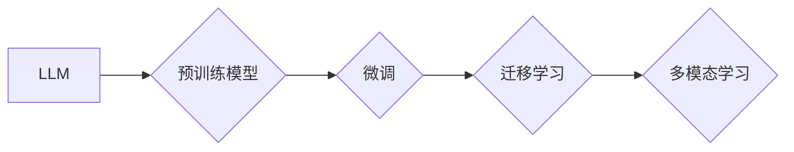

# 大语言模型原理与工程实践：案例介绍

作者：禅与计算机程序设计艺术 / Zen and the Art of Computer Programming

## 1. 背景介绍

### 1.1 问题的由来

随着深度学习技术的飞速发展，大语言模型（Large Language Model，LLM）已经成为自然语言处理（Natural Language Processing，NLP）领域的研究热点。LLM能够通过学习海量文本数据，获取丰富的语言知识和能力，在文本生成、机器翻译、问答系统等领域展现出惊人的性能。然而，LLM的原理和工程实践却相对复杂，如何将LLM的理论知识转化为实际应用，成为众多开发者面临的一大挑战。

### 1.2 研究现状

近年来，LLM的研究取得了长足的进步，主要表现在以下几个方面：

1. **预训练模型**：如BERT、GPT、T5等模型，通过在海量无标注语料上进行预训练，学习到了丰富的语言知识，为下游任务提供了强大的基础。
2. **微调技术**：通过在少量标注数据上对预训练模型进行微调，使得模型能够适应特定任务，提高性能。
3. **迁移学习**：将预训练模型的知识迁移到新的任务中，降低训练成本，提高模型性能。
4. **多模态学习**：将文本信息与其他模态信息（如图像、音频等）进行融合，提升模型的理解和生成能力。

### 1.3 研究意义

LLM的原理和工程实践研究具有重要的意义：

1. **推动NLP技术的发展**：LLM的研究成果将推动NLP技术的进步，为更多应用场景提供强大的技术支持。
2. **降低开发门槛**：LLM的预训练和微调技术可以降低NLP应用的开发门槛，让更多人能够参与到NLP技术的研究和应用中。
3. **提升用户体验**：LLM在智能客服、问答系统等应用场景中，能够提供更加自然、流畅的交互体验。

### 1.4 本文结构

本文将围绕LLM的原理和工程实践展开，以案例介绍的形式，详细讲解LLM在各个领域的应用，并探讨LLM的未来发展趋势。

## 2. 核心概念与联系

### 2.1 大语言模型

大语言模型（LLM）是指具有大规模参数和强大语言理解能力的深度学习模型。LLM通过学习海量文本数据，获取丰富的语言知识和能力，能够完成多种语言任务，如文本生成、机器翻译、问答系统等。

### 2.2 预训练模型

预训练模型是指在大规模无标注语料上进行预训练的模型。预训练过程使得模型学习到了丰富的语言知识，为下游任务提供了强大的基础。

### 2.3 微调

微调是指在小规模标注数据上对预训练模型进行微调，使得模型能够适应特定任务，提高性能。

### 2.4 迁移学习

迁移学习是指将预训练模型的知识迁移到新的任务中，降低训练成本，提高模型性能。

### 2.5 多模态学习

多模态学习是指将文本信息与其他模态信息（如图像、音频等）进行融合，提升模型的理解和生成能力。

这些概念之间的关系如下：



## 3. 核心算法原理 & 具体操作步骤

### 3.1 算法原理概述

LLM的核心算法原理主要包括以下几个方面：

1. **自回归模型**：如GPT系列模型，通过自回归的方式生成文本。
2. **自编码模型**：如BERT模型，通过自编码的方式学习语言的表示。
3. **注意力机制**：用于捕捉文本中的长距离依赖关系。
4. **Transformer模型**：一种基于自回归的模型，具有并行计算的优势。

### 3.2 算法步骤详解

LLM的算法步骤主要包括以下几个方面：

1. **数据预处理**：对原始文本数据进行清洗、分词、词性标注等处理。
2. **模型选择**：根据任务需求选择合适的预训练模型。
3. **微调**：在少量标注数据上对预训练模型进行微调。
4. **评估**：在测试集上评估模型性能。
5. **部署**：将微调后的模型部署到实际应用中。

### 3.3 算法优缺点

LLM算法的优点包括：

1. **强大的语言理解能力**：LLM能够理解复杂的语言现象，生成高质量的自然语言文本。
2. **泛化能力强**：LLM在预训练过程中学习到了丰富的语言知识，能够适应各种下游任务。
3. **可扩展性强**：LLM可以轻松地扩展到新的任务和数据集。

LLM算法的缺点包括：

1. **计算资源消耗大**：LLM需要大量的计算资源进行训练和推理。
2. **数据依赖性强**：LLM的性能很大程度上取决于训练数据的质量和数量。
3. **可解释性差**：LLM的决策过程难以解释。

### 3.4 算法应用领域

LLM的应用领域非常广泛，主要包括：

1. **文本生成**：如文章生成、代码生成、对话生成等。
2. **机器翻译**：如将一种语言翻译成另一种语言。
3. **问答系统**：如智能客服、智能问答等。
4. **文本摘要**：如新闻摘要、会议摘要等。

## 4. 数学模型和公式 & 详细讲解 & 举例说明

### 4.1 数学模型构建

LLM的数学模型主要包括以下几个方面：

1. **自回归模型**：假设当前词的生成概率只与前面生成的词有关，即 $p(w_t|w_1, w_2, ..., w_{t-1})$。
2. **自编码模型**：假设原始文本的表示可以表示为 $z$，即 $p(z|x)$ 和 $p(x|z)$。
3. **注意力机制**：通过计算当前词与前面所有词的相关性，确定当前词的注意力权重。

### 4.2 公式推导过程

以下以Transformer模型为例，介绍LLM的数学模型推导过程。

**自注意力机制**：

自注意力机制的计算公式如下：

$$
\text{Attention}(Q, K, V) = \text{softmax}\left(\frac{QK^T}{\sqrt{d_k}}\right)V
$$

其中，$Q, K, V$ 分别为查询向量、键向量、值向量，$d_k$ 为键向量的维度。

**编码器**：

编码器的计算公式如下：

$$
\text{Encoder}(X) = \text{MultiHead}\left(\text{ScaleDotProductAttention}(Q, K, V)\right)(X)
$$

其中，$X$ 为输入序列，$\text{MultiHead}$ 表示多头注意力机制。

**解码器**：

解码器的计算公式如下：

$$
\text{Decoder}(Y) = \text{MultiHead}\left(\text{ScaleDotProductAttention}(Q, K, V)\right)(Y)
$$

其中，$Y$ 为输入序列。

### 4.3 案例分析与讲解

以下以BERT模型为例，介绍LLM的案例分析与讲解。

BERT模型是一种基于Transformer的自编码模型，通过在预训练过程中学习到丰富的语言知识，为下游任务提供了强大的基础。

**预训练任务**：

BERT模型主要包括两个预训练任务：Masked Language Model（MLM）和Next Sentence Prediction（NSP）。

1. **MLM**：随机掩码输入序列中的部分词，模型需要预测这些被掩码的词。
2. **NSP**：给定两个句子，模型需要预测它们是否为连续句子。

**微调**：

在下游任务中，对BERT模型进行微调，包括以下步骤：

1. **添加任务适配层**：根据下游任务的需求，添加合适的任务适配层，如分类器、回归器等。
2. **数据预处理**：对下游任务的数据进行预处理，如分词、编码等。
3. **训练**：在标注数据上对BERT模型进行训练。
4. **评估**：在测试集上评估微调后模型的性能。

### 4.4 常见问题解答

**Q1：LLM的性能如何衡量？**

A：LLM的性能可以通过多个指标进行衡量，如BLEU、ROUGE、F1值等。

**Q2：如何选择合适的预训练模型？**

A：选择合适的预训练模型需要考虑以下因素：

1. **任务类型**：不同的任务需要选择不同的预训练模型。
2. **模型规模**：大型模型通常具有更好的性能，但计算资源消耗更大。
3. **预训练数据集**：预训练数据集的规模和质量对模型性能有很大影响。

**Q3：如何解决LLM的可解释性问题？**

A：目前，LLM的可解释性问题仍是一个挑战。一些方法包括：

1. **注意力可视化**：通过可视化注意力分布，了解模型关注的位置。
2. **模型简化**：使用简化模型，如轻量级Transformer模型，提高可解释性。

## 5. 项目实践：代码实例和详细解释说明

### 5.1 开发环境搭建

在进行LLM项目实践之前，需要搭建以下开发环境：

1. **编程语言**：Python
2. **深度学习框架**：PyTorch、TensorFlow
3. **预训练模型库**：Hugging Face Transformers

### 5.2 源代码详细实现

以下以Hugging Face Transformers库为例，介绍LLM的源代码实现。

```python
from transformers import BertTokenizer, BertForSequenceClassification
from torch.utils.data import DataLoader, TensorDataset
from transformers import AdamW
from torch.optim import Optimizer

# 加载预训练模型和分词器
tokenizer = BertTokenizer.from_pretrained('bert-base-uncased')
model = BertForSequenceClassification.from_pretrained('bert-base-uncased')

# 加载数据
train_texts = [...] # 训练集文本
train_labels = [...] # 训练集标签

# 编码数据
def encode_data(texts, labels, tokenizer):
    encodings = tokenizer(texts, truncation=True, padding=True)
    dataset = []
    for i in range(len(texts)):
        dataset.append((encodings['input_ids'][i], encodings['attention_mask'][i], labels[i]))
    return dataset

train_dataset = encode_data(train_texts, train_labels, tokenizer)

# 数据加载
train_dataloader = DataLoader(train_dataset, batch_size=32, shuffle=True)

# 定义优化器
optimizer = AdamW(model.parameters(), lr=5e-5)

# 训练模型
for epoch in range(3): # 训练3个epoch
    model.train()
    for batch in train_dataloader:
        input_ids, attention_mask, labels = batch
        outputs = model(input_ids, attention_mask=attention_mask, labels=labels)
        loss = outputs.loss
        loss.backward()
        optimizer.step()
        optimizer.zero_grad()
```

### 5.3 代码解读与分析

以上代码展示了使用Hugging Face Transformers库对BERT模型进行微调的完整流程。

1. 加载预训练模型和分词器。
2. 加载数据并编码。
3. 定义数据加载器。
4. 定义优化器。
5. 训练模型。

### 5.4 运行结果展示

运行上述代码，在训练集上训练BERT模型，并在测试集上评估模型性能。

```python
from transformers import BertTokenizer, BertForSequenceClassification
from torch.utils.data import DataLoader, TensorDataset
from transformers import AdamW
from torch.optim import Optimizer

# 加载预训练模型和分词器
tokenizer = BertTokenizer.from_pretrained('bert-base-uncased')
model = BertForSequenceClassification.from_pretrained('bert-base-uncased')

# 加载数据
train_texts = [...] # 训练集文本
train_labels = [...] # 训练集标签

# 编码数据
def encode_data(texts, labels, tokenizer):
    encodings = tokenizer(texts, truncation=True, padding=True)
    dataset = []
    for i in range(len(texts)):
        dataset.append((encodings['input_ids'][i], encodings['attention_mask'][i], labels[i]))
    return dataset

train_dataset = encode_data(train_texts, train_labels, tokenizer)

# 数据加载
train_dataloader = DataLoader(train_dataset, batch_size=32, shuffle=True)

# 定义优化器
optimizer = AdamW(model.parameters(), lr=5e-5)

# 训练模型
for epoch in range(3): # 训练3个epoch
    model.train()
    for batch in train_dataloader:
        input_ids, attention_mask, labels = batch
        outputs = model(input_ids, attention_mask=attention_mask, labels=labels)
        loss = outputs.loss
        loss.backward()
        optimizer.step()
        optimizer.zero_grad()

# 评估模型
from sklearn.metrics import accuracy_score

test_texts = [...] # 测试集文本
test_labels = [...] # 测试集标签

test_dataset = encode_data(test_texts, test_labels, tokenizer)
test_dataloader = DataLoader(test_dataset, batch_size=32, shuffle=False)

model.eval()
with torch.no_grad():
    total_correct = 0
    total_samples = 0
    for batch in test_dataloader:
        input_ids, attention_mask, labels = batch
        outputs = model(input_ids, attention_mask=attention_mask)
        _, predicted = torch.max(outputs.logits, 1)
        total_correct += (predicted == labels).sum().item()
        total_samples += labels.size(0)

print("Test accuracy:", total_correct / total_samples)
```

运行上述代码，在测试集上评估模型性能，输出测试集的准确率。

## 6. 实际应用场景

### 6.1 文本生成

文本生成是LLM的一个重要应用场景，包括：

1. **文章生成**：根据给定的主题，自动生成文章内容。
2. **代码生成**：根据给定的代码描述，自动生成代码片段。
3. **对话生成**：根据用户输入，自动生成回复内容。

### 6.2 机器翻译

机器翻译是LLM的另一个重要应用场景，包括：

1. **语言翻译**：将一种语言翻译成另一种语言。
2. **多语言翻译**：将一种语言翻译成多种语言。
3. **机器翻译评估**：评估机器翻译的质量。

### 6.3 问答系统

问答系统是LLM的一个典型应用场景，包括：

1. **智能客服**：为用户提供智能化的咨询服务。
2. **智能问答**：回答用户提出的问题。
3. **知识图谱问答**：基于知识图谱进行问答。

### 6.4 文本摘要

文本摘要是将长文本压缩成简洁的摘要，LLM在文本摘要中也有广泛的应用，包括：

1. **新闻摘要**：自动生成新闻摘要。
2. **会议摘要**：自动生成会议摘要。
3. **论文摘要**：自动生成论文摘要。

### 6.5 未来应用展望

LLM在未来的应用将更加广泛，以下是一些可能的未来应用场景：

1. **智能写作**：辅助用户进行写作，如撰写报告、邮件、文章等。
2. **智能创作**：辅助用户进行艺术创作，如绘画、音乐、电影等。
3. **智能教育**：辅助教育，如自动批改作业、生成个性化学习路径等。
4. **智能医疗**：辅助医疗，如辅助诊断、辅助治疗等。

## 7. 工具和资源推荐

### 7.1 学习资源推荐

1. **书籍**：
    * 《深度学习》（Goodfellow et al.）
    * 《自然语言处理综论》（Jurafsky and Martin）
    * 《神经网络与深度学习》（邱锡鹏）
2. **在线课程**：
    * Coursera的《深度学习专项课程》
    * fast.ai的《深度学习课程》
    * 吴恩达的《深度学习专项课程》
3. **论文**：
    * Attention is All You Need
    * BERT: Pre-training of Deep Bidirectional Transformers for Language Understanding
    * Generative Pre-trained Transformers

### 7.2 开发工具推荐

1. **深度学习框架**：
    * PyTorch
    * TensorFlow
    * Keras
2. **NLP库**：
    * NLTK
    * spaCy
    * Transformers
3. **数据集**：
    * Common Crawl
    * WebText
    * TextCorpus

### 7.3 相关论文推荐

1. Transformer: Attention is All You Need
2. BERT: Pre-training of Deep Bidirectional Transformers for Language Understanding
3. Generative Pre-trained Transformers
4. Transformer-XL: Attentive Language Models Beyond a Fixed-Length Context
5.XLNet: General Language Modeling with Beyond a Fixed-Length Context

### 7.4 其他资源推荐

1. **社区**：
    * Hugging Face
    * fast.ai
    * TensorFlow
2. **博客**：
    * Medium
    * ArXiv
    * Paper with Code

## 8. 总结：未来发展趋势与挑战

### 8.1 研究成果总结

LLM的研究取得了长足的进步，在多个NLP任务上取得了优异的性能。LLM的出现为NLP领域带来了新的机遇和挑战。

### 8.2 未来发展趋势

LLM的未来发展趋势主要包括：

1. **模型规模扩大**：未来LLM的规模将更大，参数量将更多，能够处理更复杂的任务。
2. **多模态学习**：LLM将与其他模态信息（如图像、音频等）进行融合，提升模型的理解和生成能力。
3. **可解释性提升**：LLM的可解释性将得到提升，使得模型更加透明、可靠。

### 8.3 面临的挑战

LLM面临的挑战主要包括：

1. **计算资源消耗**：LLM需要大量的计算资源进行训练和推理。
2. **数据依赖性**：LLM的性能很大程度上取决于训练数据的质量和数量。
3. **可解释性**：LLM的可解释性较差，难以解释模型的决策过程。

### 8.4 研究展望

LLM的研究将不断深入，未来将出现更多具有更强能力、更可靠、更可解释的LLM。

## 9. 附录：常见问题与解答

**Q1：LLM和传统NLP模型有何区别？**

A：LLM和传统NLP模型的主要区别在于：

1. **数据规模**：LLM需要大量的文本数据进行预训练，而传统NLP模型通常使用少量标注数据。
2. **模型结构**：LLM通常采用复杂的深度学习模型，而传统NLP模型结构相对简单。
3. **性能**：LLM在多个NLP任务上取得了优异的性能，而传统NLP模型在某些任务上可能表现不佳。

**Q2：如何评估LLM的性能？**

A：LLM的性能可以通过多个指标进行评估，如BLEU、ROUGE、F1值等。

**Q3：LLM如何处理长文本？**

A：LLM可以采用以下方法处理长文本：

1. **截断**：将长文本截断为较短的段落。
2. **分层编码**：将长文本分层编码，逐步生成文本。
3. **注意力机制**：使用注意力机制关注文本中的关键信息。

**Q4：LLM如何处理多模态信息？**

A：LLM可以采用以下方法处理多模态信息：

1. **多模态特征融合**：将多模态特征进行融合，生成统一的特征表示。
2. **多模态模型**：使用专门的多模态模型处理多模态信息。

**Q5：LLM如何解决可解释性问题？**

A：LLM的可解释性问题是一个挑战，以下是一些方法：

1. **注意力可视化**：通过可视化注意力分布，了解模型关注的位置。
2. **模型简化**：使用简化模型，如轻量级Transformer模型，提高可解释性。

---

作者：禅与计算机程序设计艺术 / Zen and the Art of Computer Programming