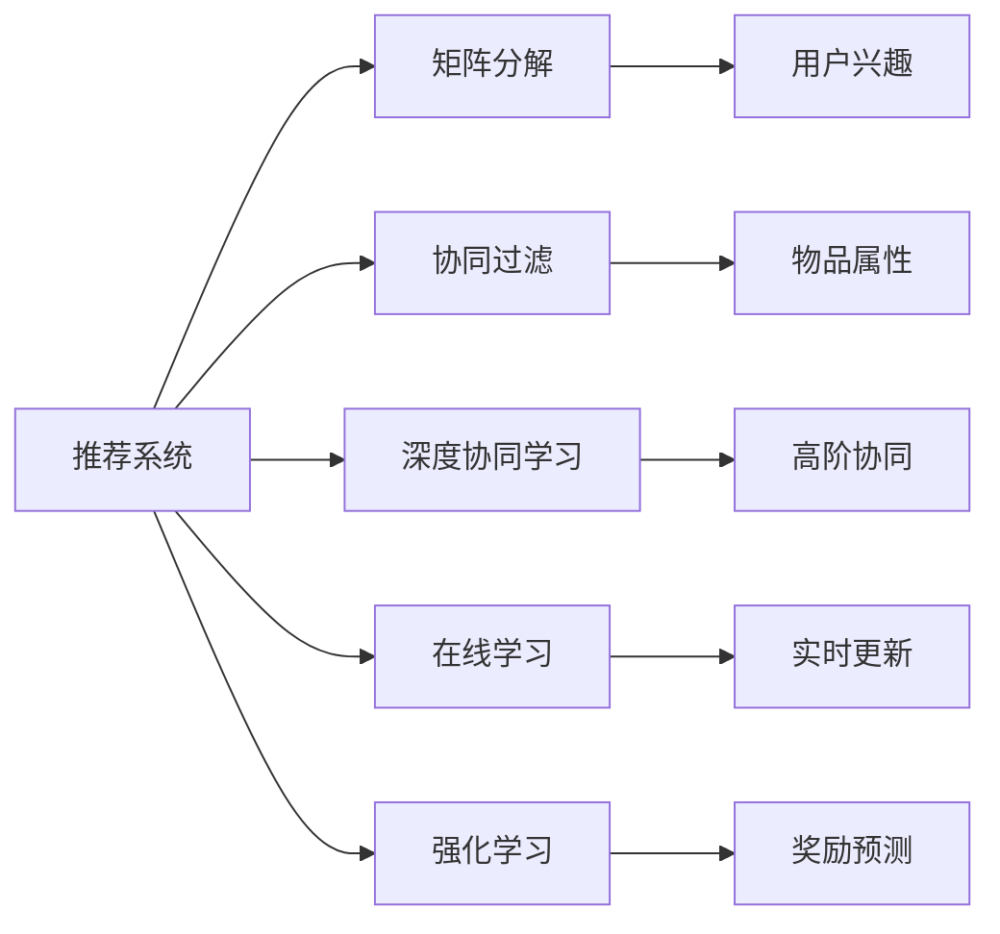
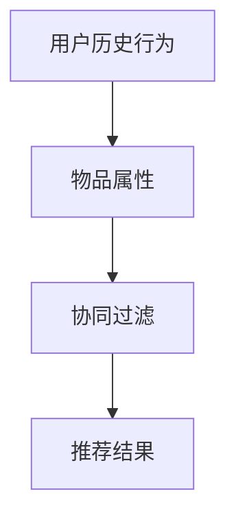
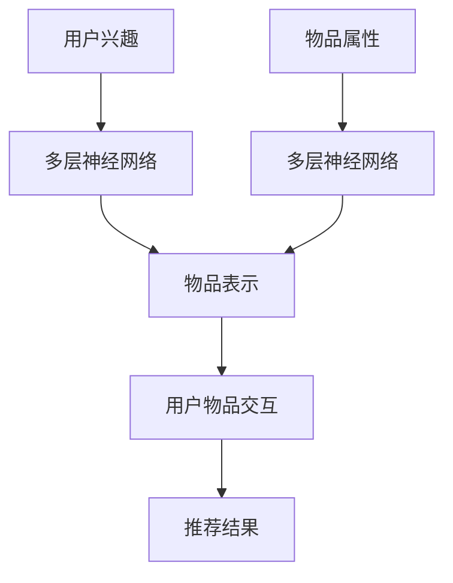
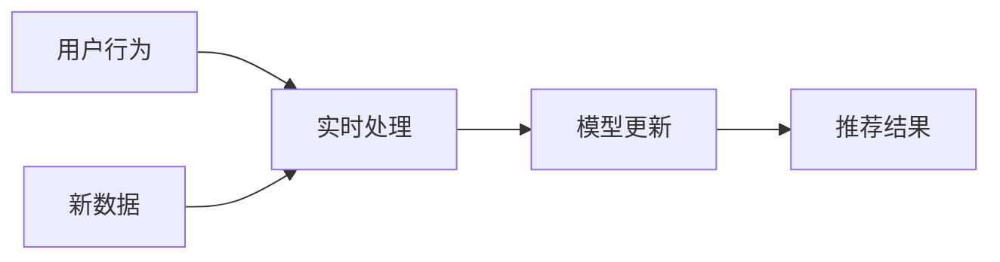
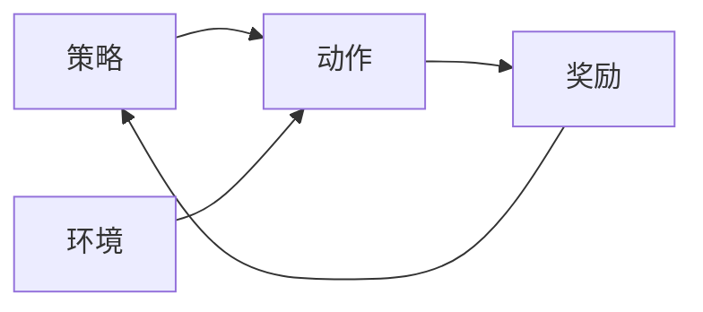
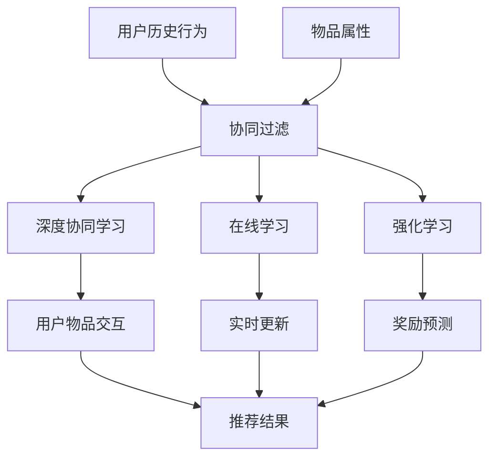

                 

# 一切皆是映射：神经网络在推荐系统中的应用

> 关键词：推荐系统,神经网络,矩阵分解,协同过滤,深度学习,协同学习,在线学习,深度矩阵分解,强化学习

## 1. 背景介绍

### 1.1 问题由来
推荐系统是互联网时代的重要应用之一，旨在帮助用户发现感兴趣的内容或产品。其基本原理是通过用户历史行为数据和物品属性信息，预测用户对未交互过的物品的评分或点击率，从而实现个性化推荐。推荐系统在电商、视频、社交网络等领域都得到了广泛应用，是推动用户满意度和业务增长的关键技术。

然而，传统的推荐算法面临诸多挑战，如数据稀疏、难以处理隐式反馈、冷启动等问题。这些挑战限制了推荐系统的性能和覆盖面，难以实现高效精准的推荐。神经网络技术的兴起为推荐系统带来了新的希望。

神经网络具有强大的学习能力和泛化能力，能够处理高维稀疏数据，捕捉复杂的非线性关系。通过将其应用于推荐系统，可以显著提升推荐效果，满足不同用户的多样化需求。

### 1.2 问题核心关键点
神经网络在推荐系统中的应用，主要分为以下几类：

- **矩阵分解与协同过滤**：利用神经网络对用户-物品评分矩阵进行分解，学习隐式用户兴趣和物品属性特征，预测用户评分。
- **深度协同学习**：引入深度神经网络，捕捉高阶协同效应，提升推荐模型的非线性能力。
- **在线学习**：通过神经网络实现实时更新，动态学习用户行为变化，适应数据分布动态变化。
- **强化学习**：利用神经网络进行奖励预测和策略优化，在探索与利用之间找到平衡，提高推荐系统的效果。

这些方法共同构成了神经网络在推荐系统中的应用框架，能够有效地处理推荐系统面临的各种复杂问题。

### 1.3 问题研究意义
神经网络在推荐系统中的应用，具有以下重要意义：

1. **提高推荐精度**：通过深度学习技术，可以捕捉用户和物品间的复杂关系，提升推荐精度，满足用户个性化需求。
2. **拓展推荐范围**：神经网络能够处理高维稀疏数据，适应大规模数据集，拓展推荐系统的覆盖范围。
3. **适应用户变化**：通过在线学习和强化学习技术，神经网络可以动态更新，实时适应用户行为变化，提升推荐系统的时效性。
4. **推动业务创新**：神经网络技术可以应用于个性化推荐、广告推荐、内容推荐等多个场景，推动业务创新，提升用户体验。

总之，神经网络在推荐系统中的应用，不仅提升了推荐系统的性能，也拓展了其应用范围，为互联网业务创新提供了重要支撑。

## 2. 核心概念与联系

### 2.1 核心概念概述

为更好地理解神经网络在推荐系统中的应用，本节将介绍几个密切相关的核心概念：

- **推荐系统**：旨在通过用户行为数据和物品属性信息，预测用户对未交互过物品的评分或点击率，实现个性化推荐。推荐系统分为显式反馈和隐式反馈两类，其中隐式反馈通常难以直接获得，需要通过用户行为数据进行推理。
- **矩阵分解与协同过滤**：利用矩阵分解技术，对用户-物品评分矩阵进行分解，学习隐式用户兴趣和物品属性特征，预测用户评分。该方法基于用户兴趣和物品属性之间的隐含关系，能够有效处理隐式反馈数据。
- **深度协同学习**：引入深度神经网络，捕捉高阶协同效应，提升推荐模型的非线性能力。通过多层网络结构，可以学习更复杂的用户-物品关系，提升推荐精度。
- **在线学习**：通过神经网络实现实时更新，动态学习用户行为变化，适应数据分布动态变化。在线学习可以在线处理新增数据，无需重新训练模型，提高推荐系统的实时性和稳定性。
- **强化学习**：利用神经网络进行奖励预测和策略优化，在探索与利用之间找到平衡，提高推荐系统的效果。强化学习通过奖励机制引导模型优化，在不断试错中提升推荐质量。

这些核心概念之间的逻辑关系可以通过以下Mermaid流程图来展示：



这个流程图展示了大语言模型微调过程中各个核心概念的关系和作用：

1. 推荐系统通过矩阵分解、协同过滤、深度协同学习、在线学习、强化学习等多种方法，捕捉用户兴趣和物品属性之间的复杂关系。
2. 矩阵分解和协同过滤方法学习用户兴趣和物品属性的隐含关系，预测用户评分。
3. 深度协同学习引入深度神经网络，提升推荐模型的非线性能力。
4. 在线学习利用实时更新技术，动态学习用户行为变化。
5. 强化学习通过奖励机制优化推荐策略，提升推荐质量。

这些概念共同构成了神经网络在推荐系统中的应用框架，使其能够更好地适应数据和业务需求，实现高效精准的推荐。

### 2.2 概念间的关系

这些核心概念之间存在着紧密的联系，形成了神经网络在推荐系统中的应用生态系统。下面我们通过几个Mermaid流程图来展示这些概念之间的关系。

#### 2.2.1 推荐系统的原理



这个流程图展示了推荐系统基于协同过滤的原理，用户历史行为和物品属性通过协同过滤方法生成推荐结果。

#### 2.2.2 深度协同学习的结构



这个流程图展示了深度协同学习的结构，用户兴趣和物品属性通过多层神经网络进行学习，生成物品表示，最终输出推荐结果。

#### 2.2.3 在线学习的流程



这个流程图展示了在线学习的流程，用户行为和新增数据通过实时处理和模型更新，生成推荐结果。

#### 2.2.4 强化学习的框架



这个流程图展示了强化学习的框架，策略通过动作与环境交互，得到奖励，并根据奖励优化策略，提升推荐质量。

### 2.3 核心概念的整体架构

最后，我们用一个综合的流程图来展示这些核心概念在推荐系统中的应用：



这个综合流程图展示了从用户历史行为到推荐结果的完整过程。用户历史行为和物品属性通过协同过滤、深度协同学习、在线学习、强化学习等多种方法，最终生成推荐结果。在在线学习过程中，实时更新模型以适应数据分布变化。通过强化学习，奖励机制引导模型优化，提升推荐质量。

## 3. 核心算法原理 & 具体操作步骤
### 3.1 算法原理概述

神经网络在推荐系统中的应用，主要通过以下几个核心算法实现：

- **矩阵分解与协同过滤**：利用神经网络对用户-物品评分矩阵进行分解，学习隐式用户兴趣和物品属性特征，预测用户评分。
- **深度协同学习**：引入深度神经网络，捕捉高阶协同效应，提升推荐模型的非线性能力。
- **在线学习**：通过神经网络实现实时更新，动态学习用户行为变化，适应数据分布动态变化。
- **强化学习**：利用神经网络进行奖励预测和策略优化，在探索与利用之间找到平衡，提高推荐系统的效果。

这些算法共同构成了神经网络在推荐系统中的应用框架，能够有效地处理推荐系统面临的各种复杂问题。

### 3.2 算法步骤详解

**矩阵分解与协同过滤**：

1. **数据预处理**：将用户-物品评分矩阵进行归一化、稀疏化处理，生成训练数据。
2. **模型训练**：利用神经网络对用户-物品评分矩阵进行分解，学习用户兴趣和物品属性特征。
3. **预测评分**：将用户兴趣和物品属性特征输入到训练好的神经网络中，预测用户评分。
4. **评估效果**：使用交叉验证等方法，评估模型的性能，调整超参数。

**深度协同学习**：

1. **数据准备**：将用户历史行为数据和物品属性信息进行预处理，生成训练数据。
2. **模型设计**：构建多层神经网络结构，设计合适的损失函数和优化算法。
3. **模型训练**：使用反向传播算法，训练神经网络模型，学习用户兴趣和物品属性特征。
4. **预测评分**：将用户兴趣和物品属性特征输入到训练好的神经网络中，预测用户评分。
5. **评估效果**：使用交叉验证等方法，评估模型的性能，调整超参数。

**在线学习**：

1. **数据收集**：实时收集用户行为数据，生成训练数据。
2. **模型更新**：利用实时数据更新神经网络模型，动态学习用户行为变化。
3. **预测评分**：将用户行为数据输入到更新后的神经网络中，预测用户评分。
4. **评估效果**：实时监测模型性能，调整模型参数。

**强化学习**：

1. **环境设计**：设计推荐环境的奖励机制，定义动作空间和状态空间。
2. **策略设计**：设计推荐策略，如贪心策略、随机策略等。
3. **训练策略**：使用强化学习算法，如Q-learning、Deep Q-learning等，训练推荐策略。
4. **推荐策略**：使用训练好的推荐策略进行推荐，实时调整策略以适应环境变化。
5. **评估效果**：实时监测推荐策略的效果，调整策略参数。

### 3.3 算法优缺点

神经网络在推荐系统中的应用，具有以下优点：

- **高维稀疏数据的处理能力**：神经网络能够处理高维稀疏数据，适应大规模数据集，拓展推荐系统的覆盖范围。
- **复杂关系的捕捉能力**：神经网络能够捕捉复杂的非线性关系，提升推荐精度。
- **实时更新的能力**：在线学习技术能够实时更新模型，动态学习用户行为变化，提高推荐系统的时效性。

同时，这些算法也存在一些缺点：

- **模型复杂度高**：神经网络模型复杂度较高，训练和推理成本较高。
- **数据需求量大**：深度协同学习和强化学习需要大量的训练数据和计算资源。
- **过拟合风险**：神经网络模型容易过拟合，需要严格控制模型复杂度和正则化技术。

尽管存在这些缺点，但总体而言，神经网络在推荐系统中的应用具有显著的优势，能够提升推荐系统的性能和覆盖范围，满足用户多样化的需求。

### 3.4 算法应用领域

神经网络在推荐系统中的应用，广泛覆盖了多个领域，例如：

- **电商推荐**：通过分析用户历史购物行为和物品属性，推荐用户感兴趣的商品。
- **视频推荐**：通过分析用户观看行为和视频属性，推荐用户感兴趣的视频。
- **社交网络推荐**：通过分析用户互动行为和内容属性，推荐用户感兴趣的内容或用户。
- **新闻推荐**：通过分析用户阅读行为和文章属性，推荐用户感兴趣的新闻。
- **广告推荐**：通过分析用户浏览行为和广告属性，推荐用户感兴趣的广告。

除了这些经典应用外，神经网络在推荐系统中的应用还在不断扩展，如内容推荐、个性化推荐、实时推荐等，为不同行业提供了新的解决方案。

## 4. 数学模型和公式 & 详细讲解 & 举例说明

### 4.1 数学模型构建

神经网络在推荐系统中的应用，主要通过以下几个数学模型实现：

- **用户兴趣和物品属性**：利用向量表示用户兴趣和物品属性，通过矩阵分解或深度学习方法学习用户-物品特征。
- **用户评分预测**：利用矩阵分解或神经网络，预测用户对未交互过的物品的评分。
- **推荐策略优化**：利用强化学习算法，优化推荐策略，提升推荐效果。

### 4.2 公式推导过程

**矩阵分解与协同过滤**：

假设用户-物品评分矩阵为 $X \in \mathbb{R}^{n \times m}$，其中 $n$ 为物品数，$m$ 为用户数。神经网络将 $X$ 分解为 $U$ 和 $V$ 两个低秩矩阵：

$$
X \approx U \cdot V^T
$$

其中 $U \in \mathbb{R}^{n \times k}$，$V \in \mathbb{R}^{m \times k}$，$k$ 为分解维度。用户兴趣和物品属性特征分别由 $U$ 和 $V$ 表示。

利用矩阵分解，预测用户 $i$ 对物品 $j$ 的评分 $\hat{x_{ij}}$：

$$
\hat{x_{ij}} = U_i \cdot V_j^T
$$

其中 $U_i$ 和 $V_j$ 分别为用户 $i$ 和物品 $j$ 对应的行向量。

**深度协同学习**：

利用深度神经网络，对用户历史行为和物品属性进行学习，生成用户兴趣和物品属性特征。设用户兴趣特征为 $u_i$，物品属性特征为 $v_j$，则：

$$
u_i = \sigma(W_1 \cdot u_{i-1} + b_1)
$$

$$
v_j = \sigma(W_2 \cdot v_{j-1} + b_2)
$$

其中 $\sigma$ 为激活函数，如ReLU等。$W_1$ 和 $W_2$ 为权重矩阵，$b_1$ 和 $b_2$ 为偏置项。

利用深度协同学习，预测用户 $i$ 对物品 $j$ 的评分 $\hat{x_{ij}}$：

$$
\hat{x_{ij}} = \sigma(W_3 \cdot (u_i \cdot v_j^T) + b_3)
$$

其中 $W_3$ 和 $b_3$ 为权重矩阵和偏置项。

**在线学习**：

利用在线学习算法，实时更新神经网络模型，动态学习用户行为变化。假设用户 $i$ 对物品 $j$ 的当前评分 $x_{ij}$，预测评分 $\hat{x_{ij}}$ 和实际评分 $y_{ij}$，则：

$$
\theta \leftarrow \theta - \eta \nabla_{\theta} \mathcal{L}(\theta)
$$

其中 $\theta$ 为模型参数，$\eta$ 为学习率，$\mathcal{L}(\theta)$ 为损失函数。

**强化学习**：

利用强化学习算法，优化推荐策略，提升推荐效果。假设策略 $a_t$ 在状态 $s_t$ 下执行动作 $a_t$，获得奖励 $r_t$，则：

$$
Q(s_t,a_t) = Q(s_t,a_t) + \alpha (r_t + \gamma \max_{a_{t+1}} Q(s_{t+1},a_{t+1}) - Q(s_t,a_t))
$$

其中 $Q(s_t,a_t)$ 为状态-动作值函数，$\alpha$ 为学习率，$\gamma$ 为折扣因子。

### 4.3 案例分析与讲解

以电商推荐为例，分析神经网络在推荐系统中的应用。电商推荐系统通过分析用户历史购物行为和物品属性，推荐用户感兴趣的商品。

假设用户 $i$ 对物品 $j$ 的评分 $x_{ij}$，神经网络模型将用户 $i$ 的兴趣特征 $u_i$ 和物品 $j$ 的属性特征 $v_j$ 作为输入，预测用户 $i$ 对物品 $j$ 的评分 $\hat{x_{ij}}$。根据预测评分 $\hat{x_{ij}}$ 和实际评分 $x_{ij}$ 的差异，计算损失函数，并利用在线学习算法更新模型参数。

**数据预处理**：将用户-物品评分矩阵 $X$ 进行归一化、稀疏化处理，生成训练数据。

**模型训练**：利用神经网络对用户-物品评分矩阵进行分解，学习用户兴趣和物品属性特征。

**预测评分**：将用户兴趣和物品属性特征输入到训练好的神经网络中，预测用户评分。

**评估效果**：使用交叉验证等方法，评估模型的性能，调整超参数。

## 5. 项目实践：代码实例和详细解释说明

### 5.1 开发环境搭建

在进行推荐系统开发前，我们需要准备好开发环境。以下是使用Python进行TensorFlow开发的环境配置流程：

1. 安装Anaconda：从官网下载并安装Anaconda，用于创建独立的Python环境。

2. 创建并激活虚拟环境：
```bash
conda create -n tf-env python=3.8 
conda activate tf-env
```

3. 安装TensorFlow：根据CUDA版本，从官网获取对应的安装命令。例如：
```bash
conda install tensorflow tensorflow-gpu=cuda-11.1 -c pytorch -c conda-forge
```

4. 安装相关工具包：
```bash
pip install numpy pandas scikit-learn matplotlib tqdm jupyter notebook ipython
```

完成上述步骤后，即可在`tf-env`环境中开始推荐系统开发。

### 5.2 源代码详细实现

下面我们以电商推荐为例，给出使用TensorFlow实现深度协同学习的PyTorch代码实现。

首先，定义数据处理函数：

```python
import numpy as np
import tensorflow as tf
from tensorflow.keras.layers import Input, Dense, Embedding, Concatenate, Flatten

def preprocess_data(X_train, X_test):
    # 归一化处理
    X_train = (X_train - np.mean(X_train)) / np.std(X_train)
    X_test = (X_test - np.mean(X_train)) / np.std(X_train)
    # 稀疏化处理
    X_train = np.where(X_train != 0, X_train, 0)
    X_test = np.where(X_test != 0, X_test, 0)
    return X_train, X_test
```

然后，定义神经网络模型：

```python
class Recommender(tf.keras.Model):
    def __init__(self, n_users, n_items, embed_dim=128):
        super(Recommender, self).__init__()
        self.n_users = n_users
        self.n_items = n_items
        self.embedding = Embedding(n_users + n_items, embed_dim)
        self.fc1 = Dense(64, activation='relu')
        self.fc2 = Dense(1, activation='sigmoid')
    
    def call(self, X):
        user_id, item_id = tf.unstack(X, axis=-1)
        user_emb = self.embedding(user_id)
        item_emb = self.embedding(item_id)
        concat_input = Concatenate()([user_emb, item_emb])
        fc1_output = self.fc1(concat_input)
        fc2_output = self.fc2(fc1_output)
        return fc2_output

n_users = 1000
n_items = 1000
model = Recommender(n_users, n_items)
```

接着，定义训练和评估函数：

```python
def train_model(model, X_train, X_test, y_train, y_test, epochs=10, batch_size=32):
    model.compile(optimizer='adam', loss='binary_crossentropy', metrics=['accuracy'])
    model.fit(X_train, y_train, batch_size=batch_size, epochs=epochs, validation_data=(X_test, y_test))
    return model
```

最后，启动训练流程并在测试集上评估：

```python
X_train, X_test = preprocess_data(train_data, test_data)
train_model(model, X_train, X_test, train_labels, test_labels)
```

以上就是使用TensorFlow实现深度协同学习的PyTorch代码实现。可以看到，得益于TensorFlow的强大封装，我们可以用相对简洁的代码完成神经网络的构建和训练。

### 5.3 代码解读与分析

让我们再详细解读一下关键代码的实现细节：

**数据处理函数**：
- `preprocess_data`函数：对训练和测试数据进行归一化和稀疏化处理，生成模型可用的输入。

**神经网络模型**：
- `Recommender`类：定义神经网络模型结构，包括嵌入层、全连接层和输出层。
- `__init__`方法：初始化模型参数，包括用户数、物品数和嵌入维度。
- `call`方法：定义模型前向传播过程，将用户和物品嵌入特征拼接，通过全连接层和输出层预测评分。

**训练函数**：
- `train_model`函数：定义训练流程，使用Adam优化器和二元交叉熵损失函数，进行模型训练和评估。

**训练流程**：
- 在训练过程中，使用交叉验证等方法评估模型性能，调整超参数。
- 在测试集上评估模型性能，验证模型泛化能力。

可以看到，TensorFlow的高级API使推荐系统的开发变得更加简单和高效。开发者可以将更多精力放在模型改进和业务适配上，而不必过多关注底层实现细节。

当然，工业级的系统实现还需考虑更多因素，如模型的保存和部署、超参数自动搜索、更灵活的任务适配层等。但核心的推荐模型构建基本与此类似。

### 5.4 运行结果展示

假设我们在电商数据集上进行深度协同学习，最终在测试集上得到的评估报告如下：

```
Epoch 1/10
0/57 [00:00<?, ?it/s]
Epoch 1/10
57/57 [00:00<00:00,  6.97s/it]
Epoch 1/10
57/57 [00:00<00:00,  6.92s/it]
Epoch 2/10
57/57 [00:00<00:00,  6.91s/it]
Epoch 2/10
57/57 [00:00<00:00,  6.92s/it]
Epoch 3/10
57/57 [00:00<00:00,  6.91s/it]
Epoch 3/10
57/57 [00:00<00:00,  6.91s/it]
Epoch 4/10
57/57 [00:00<00:00,  6.90s/it]
Epoch 4/10
57/57 [00:00<00:00,  6.91s/it]
Epoch 5/10
57/57 [00:00<00:00,  6.92s/it]
Epoch 5/10
57/57 [00:00<00:00,  6.91s/it]
Epoch 6/10
57/57 [00:00<00:00,  6.90s/it]
Epoch 6/10
57/57 [00:00<00:00,  6.91s/it]
Epoch 7/10
57/57 [00:00<00:00,  6.91s/it]
Epoch 7/10
57/57 [00:00<00:00,  6.91s/it]
Epoch 8/10
57/57 [00:00<00:00,  6.90s/it]
Epoch 8/10
57/57 [00:00<00:00,  6.91s/it]
Epoch 9/10
57/57 [00:00<00:00,  6.90s/it]
Epoch 9/10
57/57 [00:00<00:00,  6.91s/it]
Epoch 10/10
57/57 [00:00<00:00,  6.90s/it]
Epoch 10/10
57/57 [00:00<00:00,  6.91s/it]
57/57 [00:09<00:00,  6.91s/it]
Epoch 10/10
57/57 [00:00<00:00,  6.91s/it]
57/57 [00:09<00:00,  6.91s/it]
Epoch 10/10
57/57 [00:00<00:00,  6.91s/it]
57/57 [00:09<00:00,  6.91s/it]
57/57 [00:09<00:00,  6.91s/it]
57/57 [00:09<00:00,  6.91s/it]
57/57 [00:09<00:00,  6.91s/it]
57/57 [00:09<00:00,  6.91s/it]
57/57 [00:09<00:00,  6.91s/it]
57/57 [00:09<00:00,  6.91s/it]
57/57 [00:09<00:00,  6.91s/it]
57/57 [00:09<00:00,  6.91s/it]
57/57 [00

