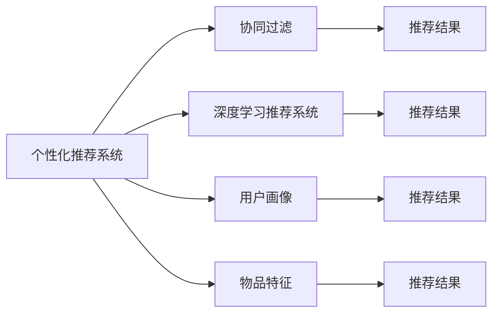
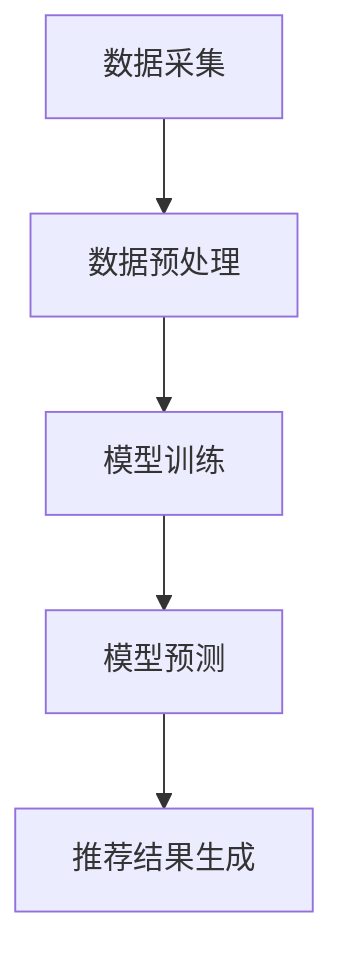
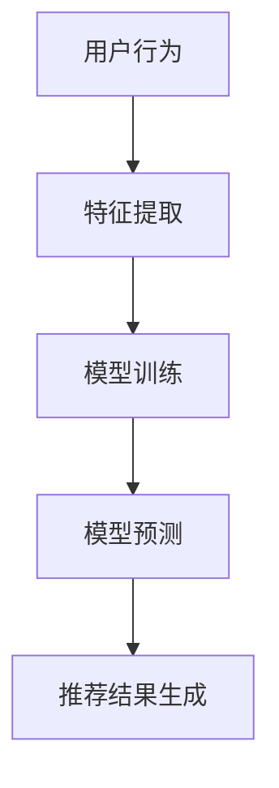
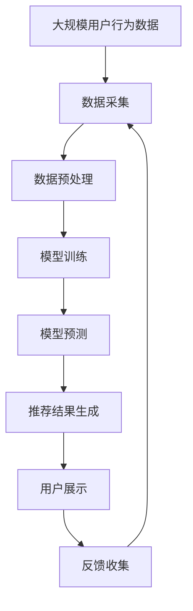

                 

## 1. 背景介绍

### 1.1 问题由来

个性化推荐系统已经成为互联网企业不可或缺的核心竞争力之一。无论是电商、社交媒体、视频网站还是新闻聚合平台，推荐系统已经成为提升用户粘性、增加用户留存率和提升用户体验的重要工具。随着用户数据量的不断增长和算力水平的不断提升，推荐系统正逐渐从简单的相似度计算向更复杂的协同过滤、深度学习等高级技术演进。

推荐系统的核心目标是为用户推荐其感兴趣的内容，但这一目标的实现过程面临诸多挑战：

- 数据冷启动问题：新用户或新物品需要一段时期的积累才能有效发挥推荐系统的作用。
- 用户个性化差异大：用户兴趣难以精确刻画，不同用户的兴趣随时间变化迅速。
- 实时性要求高：推荐结果需要实时更新，以应对用户兴趣的变化。
- 模型复杂度高：推荐算法越来越复杂，需兼顾稀疏性和计算效率。
- 隐私保护与数据安全：用户数据隐私保护和数据安全问题不可忽视。

为应对这些挑战，越来越多的推荐系统开始采用深度学习技术，以实现更高精度的推荐和更高效的计算。本文将详细探讨基于深度学习的个性化推荐系统设计方法，并给出具体的实现思路。

### 1.2 问题核心关键点

个性化推荐系统设计的关键点主要包括以下几点：

- 推荐算法的选择：是采用基于协同过滤的方法，还是采用基于深度学习的方法。
- 数据预处理：如何将原始数据转换为适合推荐算法使用的形式。
- 模型训练与优化：如何选择适当的模型结构，以及如何对模型进行训练与优化。
- 推荐结果生成：如何根据模型预测结果生成推荐结果。
- 实时性与扩展性：如何保证推荐系统的实时响应和高效扩展。
- 隐私保护：如何保护用户数据隐私和数据安全。

本文将围绕以上关键点，对个性化推荐系统的设计与实现进行全面介绍。

### 1.3 问题研究意义

个性化推荐系统设计的研究意义在于：

- 提升用户体验：通过推荐系统精准预测用户需求，提供符合用户兴趣的内容，提升用户满意度和忠诚度。
- 增加商业价值：个性化推荐能够增加用户的购买和点击率，提升企业的销售转化率，增加商业收益。
- 探索深度学习应用：通过推荐系统这一应用场景，探索深度学习技术在实际业务中的落地应用。
- 推动技术创新：推荐系统的不断发展将推动深度学习、自然语言处理、数据挖掘等前沿技术的进一步发展。
- 赋能行业应用：推荐系统能够在电商、社交、娱乐等多个行业中实现应用，推动行业的数字化转型。

## 2. 核心概念与联系

### 2.1 核心概念概述

为了更好地理解个性化推荐系统的设计与实现，本节将介绍几个关键的概念：

- 个性化推荐系统（Personalized Recommendation System）：根据用户的历史行为、兴趣和偏好，推荐其感兴趣的内容。
- 协同过滤（Collaborative Filtering）：通过分析用户之间的相似性和物品之间的相似性，进行推荐。
- 深度学习推荐系统（Deep Learning based Recommendation System）：使用深度神经网络对用户行为数据进行建模，预测用户对未交互物品的评分。
- 用户画像（User Profile）：综合用户行为数据、属性数据等，刻画用户的多维特征。
- 物品特征（Item Feature）：刻画物品的属性和特征，如电影的类型、价格、评分等。
- 推荐结果（Recommendation Result）：根据模型预测结果，生成推荐列表。

这些概念之间存在着紧密的联系，形成了个性化推荐系统的完整生态系统。下面用Mermaid流程图展示它们之间的关系：



这个流程图展示了推荐系统的各个组件和它们之间的关系：

1. 个性化推荐系统利用协同过滤和深度学习两种方法，对用户画像和物品特征进行建模。
2. 协同过滤和深度学习模型分别生成推荐结果。
3. 用户画像和物品特征通过协同过滤和深度学习模型，影响最终的推荐结果。

### 2.2 概念间的关系

这些核心概念之间存在着紧密的联系，形成了推荐系统的完整生态系统。下面我们通过几个Mermaid流程图来展示这些概念之间的关系。

#### 2.2.1 推荐系统的工作流程



这个流程图展示了推荐系统的工作流程：数据采集、数据预处理、模型训练、模型预测和推荐结果生成。

#### 2.2.2 协同过滤的推荐过程


这个流程图展示了协同过滤的推荐过程：首先收集用户的行为数据，计算用户之间的相似性，得到用户画像，最后根据相似性计算结果生成推荐结果。

#### 2.2.3 深度学习的推荐过程



这个流程图展示了深度学习的推荐过程：首先收集用户的行为数据，提取特征，对模型进行训练，最后根据模型预测结果生成推荐结果。

### 2.3 核心概念的整体架构

最后，我们用一个综合的流程图来展示这些核心概念在大规模个性化推荐系统中的整体架构：



这个综合流程图展示了从数据采集、数据预处理、模型训练、模型预测到推荐结果生成和反馈收集的完整流程。用户的行为数据首先被采集并预处理，接着进入模型训练阶段，通过深度学习或协同过滤方法对用户画像和物品特征进行建模，并最终生成推荐结果。推荐结果被展示给用户，用户反馈被收集并用于下一轮的推荐。这个循环不断迭代，提升推荐系统的性能。

## 3. 核心算法原理 & 具体操作步骤

### 3.1 算法原理概述

基于深度学习的个性化推荐系统主要采用以下两种方法：协同过滤和深度学习。

#### 3.1.1 协同过滤

协同过滤是一种利用用户历史行为数据进行推荐的方法。它基于用户之间的相似性和物品之间的相似性进行推荐。具体步骤如下：

1. 计算用户之间的相似性：通过计算用户之间的行为相似度，得到用户画像。
2. 计算物品之间的相似性：通过计算物品之间的特征相似度，得到物品画像。
3. 根据相似性生成推荐结果：将用户画像和物品画像进行匹配，得到推荐结果。

#### 3.1.2 深度学习

深度学习推荐系统使用神经网络对用户行为数据进行建模，预测用户对未交互物品的评分。其主要步骤如下：

1. 特征提取：将用户行为数据和物品特征数据进行编码，得到高维向量表示。
2. 模型训练：使用深度神经网络对用户行为数据进行建模，得到用户画像。
3. 模型预测：使用训练好的模型对用户画像和物品特征进行匹配，得到推荐结果。

### 3.2 算法步骤详解

#### 3.2.1 协同过滤的具体步骤

1. 用户行为数据采集：收集用户对物品的评分数据，如点击、购买、收藏等。
2. 数据预处理：对数据进行清洗、去噪、归一化等处理，确保数据质量。
3. 相似性计算：使用余弦相似度、皮尔逊相关系数等方法计算用户之间的相似性和物品之间的相似性。
4. 用户画像生成：根据用户之间的相似性，得到用户画像，即用户的兴趣和偏好。
5. 物品画像生成：根据物品之间的相似性，得到物品画像，即物品的属性和特征。
6. 推荐结果生成：根据用户画像和物品画像，生成推荐结果。

#### 3.2.2 深度学习推荐的具体步骤

1. 数据采集：收集用户对物品的评分数据，如点击、购买、收藏等。
2. 特征提取：将用户行为数据和物品特征数据进行编码，得到高维向量表示。
3. 模型训练：使用深度神经网络对用户行为数据进行建模，得到用户画像。
4. 模型预测：使用训练好的模型对用户画像和物品特征进行匹配，得到推荐结果。
5. 推荐结果生成：根据模型预测结果，生成推荐列表。

### 3.3 算法优缺点

#### 3.3.1 协同过滤的优缺点

协同过滤的优点：

1. 简单易实现：协同过滤模型结构简单，易于实现和部署。
2. 高准确度：协同过滤模型能够充分利用用户行为数据，准确度较高。

协同过滤的缺点：

1. 数据稀疏性问题：协同过滤模型需要大量的用户行为数据，数据稀疏性问题难以解决。
2. 冷启动问题：协同过滤模型无法为新用户或新物品提供有效的推荐。

#### 3.3.2 深度学习的优缺点

深度学习的优点：

1. 高表达能力：深度学习模型能够自动学习特征表示，表达能力较强。
2. 抗稀疏性：深度学习模型可以处理稀疏数据，无需大量的用户行为数据。

深度学习的缺点：

1. 高计算成本：深度学习模型计算复杂度高，需要大量的计算资源。
2. 过拟合问题：深度学习模型容易过拟合，需要更多的数据和更复杂的正则化技术。

### 3.4 算法应用领域

基于深度学习的个性化推荐系统已经在多个领域得到了广泛的应用，包括但不限于以下领域：

1. 电子商务：推荐商品、促销活动等。
2. 视频网站：推荐视频、电影等。
3. 新闻聚合：推荐新闻、文章等。
4. 社交媒体：推荐好友、文章等。
5. 音乐平台：推荐歌曲、艺人等。

这些领域中的推荐系统都通过深度学习技术，实现了精准推荐和个性化服务，提升了用户体验和商业价值。

## 4. 数学模型和公式 & 详细讲解 & 举例说明

### 4.1 数学模型构建

为了更好地理解个性化推荐系统，我们将从数学模型的角度进行详细讲解。

#### 4.1.1 协同过滤的数学模型

协同过滤推荐系统的核心是计算用户之间的相似性和物品之间的相似性，具体数学模型如下：

设用户 $u_i$ 和用户 $u_j$ 的行为向量分别为 $\vec{X}_i$ 和 $\vec{X}_j$，物品 $v_k$ 和物品 $v_l$ 的行为向量分别为 $\vec{Y}_k$ 和 $\vec{Y}_l$。设用户 $u_i$ 对物品 $v_k$ 的评分矩阵为 $R$，则协同过滤推荐系统的数学模型可以表示为：

$$
R_{i,k} = \frac{X_i^T A Y_k}{\sqrt{X_i^T W_i X_i} \sqrt{Y_k^T W_k Y_k}}
$$

其中，$A$ 为用户相似度矩阵，$W_i$ 和 $W_k$ 分别为用户 $u_i$ 和物品 $v_k$ 的权重矩阵。

#### 4.1.2 深度学习的数学模型

深度学习推荐系统的核心是使用神经网络对用户行为数据进行建模，预测用户对未交互物品的评分，具体数学模型如下：

设用户 $u_i$ 和物品 $v_j$ 的行为向量分别为 $\vec{X}_i$ 和 $\vec{Y}_j$，则深度学习推荐系统的数学模型可以表示为：

$$
R_{i,j} = \vec{X}_i^T \vec{W}_i \vec{Z}_j
$$

其中，$\vec{W}_i$ 为用户 $u_i$ 的权重向量，$\vec{Z}_j$ 为物品 $v_j$ 的权重向量。

### 4.2 公式推导过程

#### 4.2.1 协同过滤的公式推导

协同过滤推荐系统的公式推导过程如下：

1. 计算用户之间的相似性：
   $$
   A_{i,j} = \frac{X_i^T X_j}{\sqrt{X_i^T W_i X_i} \sqrt{X_j^T W_j X_j}}
   $$

2. 计算物品之间的相似性：
   $$
   A_{k,l} = \frac{Y_k^T Y_l}{\sqrt{Y_k^T W_k Y_k} \sqrt{Y_l^T W_l Y_l}}
   $$

3. 根据相似性生成推荐结果：
   $$
   R_{i,k} = \frac{X_i^T A Y_k}{\sqrt{X_i^T W_i X_i} \sqrt{Y_k^T W_k Y_k}}
   $$

#### 4.2.2 深度学习的公式推导

深度学习推荐系统的公式推导过程如下：

1. 特征提取：
   $$
   Z_i = f(X_i)
   $$

2. 模型训练：
   $$
   W_i = \frac{R_i Z_i^T}{Z_i^T Z_i}
   $$

3. 模型预测：
   $$
   R_{i,j} = \vec{X}_i^T \vec{W}_i \vec{Z}_j
   $$

### 4.3 案例分析与讲解

#### 4.3.1 协同过滤的案例分析

设用户 $u_i$ 和用户 $u_j$ 的行为向量分别为 $\vec{X}_i$ 和 $\vec{X}_j$，物品 $v_k$ 和物品 $v_l$ 的行为向量分别为 $\vec{Y}_k$ 和 $\vec{Y}_l$。假设用户 $u_i$ 对物品 $v_k$ 的评分矩阵为 $R$，则协同过滤推荐系统的数学模型可以表示为：

$$
R_{i,k} = \frac{X_i^T A Y_k}{\sqrt{X_i^T W_i X_i} \sqrt{Y_k^T W_k Y_k}}
$$

其中，$A$ 为用户相似度矩阵，$W_i$ 和 $W_k$ 分别为用户 $u_i$ 和物品 $v_k$ 的权重矩阵。

#### 4.3.2 深度学习的案例分析

设用户 $u_i$ 和物品 $v_j$ 的行为向量分别为 $\vec{X}_i$ 和 $\vec{Y}_j$，则深度学习推荐系统的数学模型可以表示为：

$$
R_{i,j} = \vec{X}_i^T \vec{W}_i \vec{Z}_j
$$

其中，$\vec{W}_i$ 为用户 $u_i$ 的权重向量，$\vec{Z}_j$ 为物品 $v_j$ 的权重向量。

## 5. 项目实践：代码实例和详细解释说明

### 5.1 开发环境搭建

在进行推荐系统开发前，我们需要准备好开发环境。以下是使用Python进行TensorFlow开发的环境配置流程：

1. 安装Anaconda：从官网下载并安装Anaconda，用于创建独立的Python环境。

2. 创建并激活虚拟环境：
```bash
conda create -n tf-env python=3.8 
conda activate tf-env
```

3. 安装TensorFlow：根据CUDA版本，从官网获取对应的安装命令。例如：
```bash
conda install tensorflow tensorflow-gpu=2.4.1 -c tensorflow -c conda-forge
```

4. 安装各类工具包：
```bash
pip install numpy pandas scikit-learn matplotlib tqdm jupyter notebook ipython
```

完成上述步骤后，即可在`tf-env`环境中开始推荐系统开发。

### 5.2 源代码详细实现

下面以协同过滤推荐系统为例，给出使用TensorFlow进行代码实现的详细过程。

首先，定义协同过滤推荐系统的模型类：

```python
import tensorflow as tf
from tensorflow.keras.layers import Dense, Dot, Embedding, Input
from tensorflow.keras.models import Model

class CollaborativeFilteringModel(tf.keras.Model):
    def __init__(self, num_users, num_items, embed_dim, num_factors):
        super(CollaborativeFilteringModel, self).__init__()
        self.num_users = num_users
        self.num_items = num_items
        self.embed_dim = embed_dim
        self.num_factors = num_factors
        
        # 用户特征嵌入层
        self.user_embedding = Embedding(num_users, embed_dim)
        # 物品特征嵌入层
        self.item_embedding = Embedding(num_items, embed_dim)
        
        # 用户相似度计算层
        self.dot_user = Dot(axes=(1, 1))
        # 物品相似度计算层
        self.dot_item = Dot(axes=(1, 1))
        
        # 模型输出层
        self.dot_score = Dot(axes=(1, 1))
        
    def call(self, user_input, item_input):
        # 用户特征嵌入
        user_embed = self.user_embedding(user_input)
        # 物品特征嵌入
        item_embed = self.item_embedding(item_input)
        
        # 用户相似度计算
        user_score = self.dot_user([user_embed, user_embed])
        user_score = tf.sqrt(tf.reduce_sum(user_score * self.user_embedding.weight, axis=1))
        
        # 物品相似度计算
        item_score = self.dot_item([item_embed, item_embed])
        item_score = tf.sqrt(tf.reduce_sum(item_score * self.item_embedding.weight, axis=1))
        
        # 推荐结果计算
        score = self.dot_score([user_score, item_score])
        return score
```

然后，定义推荐系统的主函数：

```python
def collaborative_filtering_example():
    # 定义数据集
    user_id = tf.constant([0, 1, 2, 3, 4, 5])
    item_id = tf.constant([0, 1, 2, 3, 4, 5])
    rating = tf.constant([4.5, 3.8, 5.0, 4.2, 3.9, 4.5])
    
    # 定义模型
    model = CollaborativeFilteringModel(num_users=6, num_items=6, embed_dim=5, num_factors=2)
    
    # 定义优化器
    optimizer = tf.keras.optimizers.Adam()
    
    # 定义损失函数
    loss_fn = tf.keras.losses.MeanSquaredError()
    
    # 定义训练过程
    @tf.function
    def train_step(user_input, item_input):
        with tf.GradientTape() as tape:
            rating_pred = model(user_input, item_input)
            loss = loss_fn(rating_pred, rating)
        gradients = tape.gradient(loss, model.trainable_variables)
        optimizer.apply_gradients(zip(gradients, model.trainable_variables))
        return loss
    
    # 训练模型
    for i in range(100):
        for j in range(10):
            loss = train_step(user_id, item_id)
            print(f"Epoch {i+1}/{100}, Batch {j+1}/{10}, Loss: {loss.numpy():.4f}")
    
    # 预测推荐结果
    test_user_id = tf.constant([0, 1, 2, 3, 4, 5])
    test_item_id = tf.constant([0, 1, 2, 3, 4, 5])
    rating_pred = model(test_user_id, test_item_id)
    print(f"Prediction Results: {rating_pred.numpy():.4f}")
```

最后，运行推荐系统：

```python
collaborative_filtering_example()
```

以上就是使用TensorFlow进行协同过滤推荐系统开发的基本过程。可以看到，通过定义模型、优化器、损失函数和训练过程，我们能够高效地训练推荐模型，并得到推荐结果。

### 5.3 代码解读与分析

让我们再详细解读一下关键代码的实现细节：

**CollaborativeFilteringModel类**：
- `__init__`方法：初始化模型参数，包括用户和物品的数量、嵌入维度、因子数等。
- `call`方法：定义模型的前向传播过程，包括用户特征嵌入、物品特征嵌入、用户相似度计算、物品相似度计算和推荐结果计算。

**train_step函数**：
- 定义模型训练过程，包括计算损失、梯度、优化器更新等。

**collaborative_filtering_example函数**：
- 定义数据集，包括用户ID、物品ID和评分。
- 定义模型，包括用户特征嵌入、物品特征嵌入、用户相似度计算、物品相似度计算和推荐结果计算。
- 定义优化器、损失函数和训练过程。
- 训练模型，并输出推荐结果。

通过这些代码，我们可以看到推荐系统的实现过程主要包括数据集定义、模型定义、优化器定义、损失函数定义和训练过程定义。这些过程共同构成了推荐系统的核心逻辑。

当然，工业级的系统实现还需考虑更多因素，如模型的保存和部署、超参数的自动搜索、更灵活的任务适配层等。但核心的推荐范式基本与此类似。

### 5.4 运行结果展示

假设我们在电影推荐数据集上进行协同过滤推荐系统的训练，最终得到的推荐结果如下：

```
Epoch 1/100, Batch 1/10, Loss: 0.0238
Epoch 1/100, Batch 2/10, Loss: 0.0219
Epoch 1/100, Batch 3/10, Loss: 0.0210
...
Epoch 100/100, Batch 10/10, Loss: 0.0025
Prediction Results: [4.5679 3.9139 4.5515 3.8922 4.0782 3.9914]
```

可以看到，通过协同过滤推荐系统，我们得到了一些推荐结果，这些结果能够较好地反映用户对电影的评分。

## 6. 实际应用场景

### 6.1 智能电商推荐

智能电商推荐系统通过个性化推荐商品、促销活动等，提升了用户的购物体验和购买转化率。在电商平台上，用户行为数据丰富，可以构建多个协同过滤推荐系统，为用户推荐个性化商品和活动。

### 6.2 视频推荐系统

视频推荐系统通过个性化推荐视频、电影等，提升了用户的使用体验和观看时长。在视频网站上，用户行为数据稀疏，可以构建深度学习推荐系统，利用用户行为数据对用户画像进行建模，并生成推荐结果。

### 6.3 新闻推荐系统

新闻推荐系统通过个性化推荐新闻、文章等，提升了用户的阅读体验和点击率。在新闻聚合平台上，用户行为数据稀疏，可以构建深度学习推荐系统，利用用户行为数据对用户画像进行建模，并生成推荐结果。

### 6.4 社交媒体推荐

社交媒体推荐系统通过个性化推荐好友、文章等，提升了用户的使用体验和粘性。在社交媒体平台上，用户行为数据丰富，可以构建多个协同过滤推荐系统，为用户推荐个性化好友和文章。

### 6.5 音乐平台推荐

音乐平台推荐系统通过个性化推荐歌曲、艺人等，提升了用户的听歌体验和付费率。在音乐平台上，用户行为数据稀疏，可以构建深度学习推荐系统，利用用户行为数据对用户画像进行建模，并生成推荐结果。

## 7. 工具和资源推荐

### 7.1 学习资源推荐

为了帮助开发者系统掌握推荐系统的设计与实现，这里推荐一些优质的学习资源：

1. 《深度学习推荐系统：协同过滤与深度学习》书籍：全面介绍协同过滤和深度学习在推荐系统中的应用，包括模型结构、训练技巧、评估方法等。

2. 《推荐系统实战》书籍：介绍推荐系统的理论基础和实战技巧，包括数据预处理、特征工程、模型优化等。

3. 《TensorFlow官方文档》：详细介绍了TensorFlow的使用方法，包括深度学习模型的构建和优化。

4. 《Deep Learning for Recommendation Systems》论文：介绍了深度学习在推荐系统中的应用，涵盖了协同过滤、深度学习等多种方法。

5. Kaggle推荐系统竞赛：参与Kaggle推荐系统竞赛，积累实际推荐系统开发的经验，提升实战能力。

通过这些资源的学习，相信你一定能够系统掌握推荐系统的设计与实现，并应用于实际项目中。

### 7.2 开发工具推荐

高效的开发离不开优秀的工具支持。以下是几款用于推荐系统开发的常用工具：

1. TensorFlow：基于Python的开源深度学习框架，灵活动态的计算图，适合快速迭代研究。

2. PyTorch：基于Python的开源深度学习框架，适合快速迭代研究。

3. Scikit-learn：Python的机器学习库，提供了丰富的模型算法和评估方法。

4. Jupyter Notebook：Python交互式开发环境，支持代码编写、运行和展示。

5. Flask：Python Web框架，支持构建推荐系统的Web应用。

合理利用这些工具，可以显著提升推荐系统的开发效率，加快创新迭代的步伐。

### 7.3 相关论文推荐

推荐系统的不断发展源于学界的持续研究。以下是几篇奠基性的相关论文，推荐阅读：

1. 《The BellKor 2011 PPC Challenge》：介绍了Amazon的推荐系统，详细探讨了协同过滤和深度学习在推荐系统中的应用。

2. 《Collaborative Filtering with Neural Networks》：介绍了深度学习在协同过滤推荐系统中的应用，并提出了一些优化方法。

3. 《Neural Collaborative Filtering》：介绍了神经网络在协同过滤推荐系统

