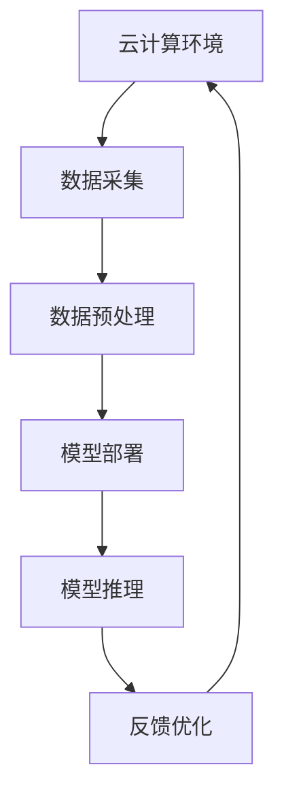
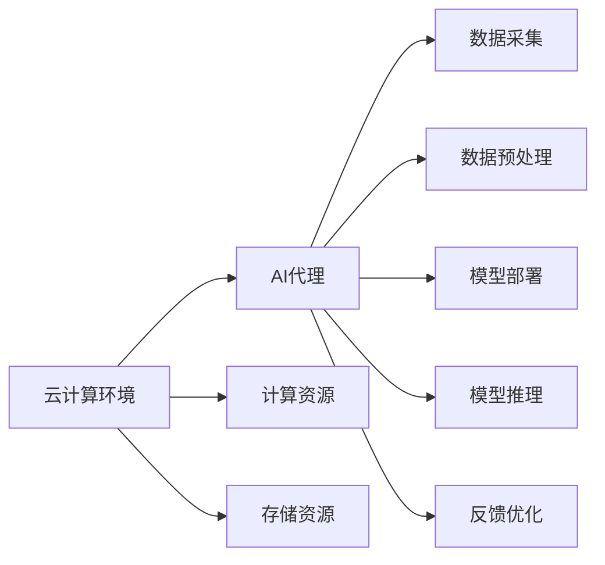
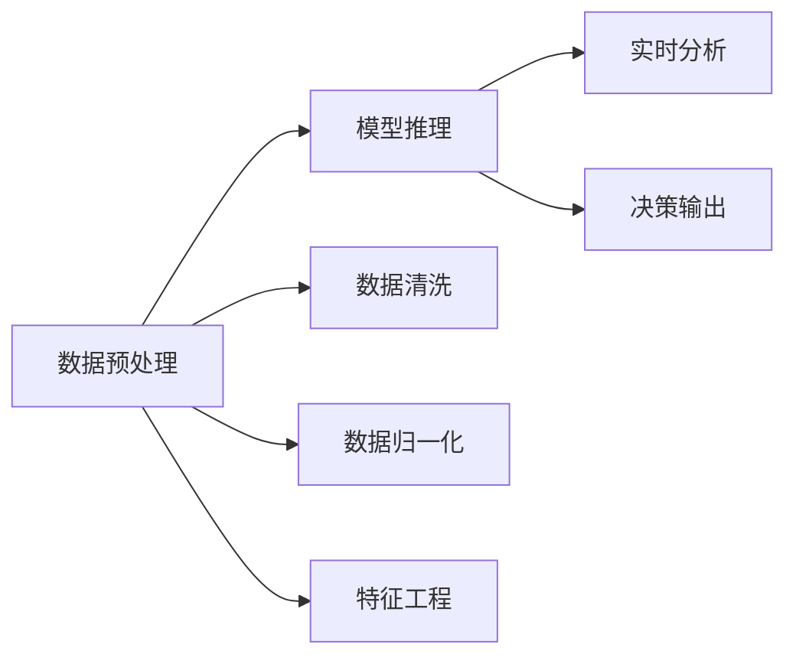
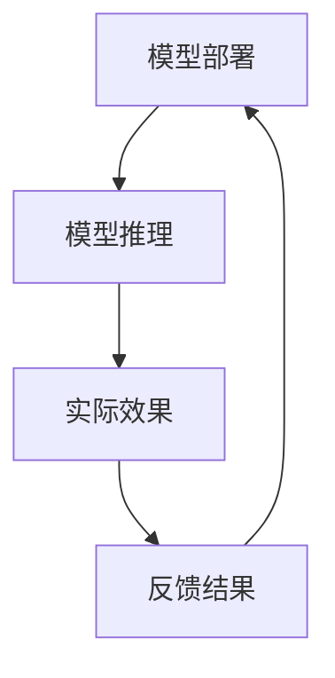

                 

# 云计算环境中AI代理工作流的设计与执行

## 1. 背景介绍

### 1.1 问题由来
云计算的普及极大地改变了IT行业的生态，为企业带来了前所未有的便利性和灵活性。随着云计算技术的不断成熟和完善，越来越多的企业和机构将业务迁移到云端，享受即插即用的云服务，以应对快速变化的市场需求。在云计算的推动下，各行各业都迎来了数字化转型升级的浪潮。然而，云计算的广泛应用也带来了一些新的挑战，包括成本控制、服务一致性、安全性等问题。

AI技术在云计算环境中的应用，为云计算带来了更智能、更高效的服务。云计算AI代理(AI Proxy)是一个新兴概念，通过部署在云端的智能算法和模型，帮助云计算服务提供商实现自动化运维、自动化决策、个性化服务，提升云服务的可靠性和用户体验。AI代理能够基于实时数据进行决策，提供更符合用户需求的服务，同时降低运维成本，提升服务质量。

### 1.2 问题核心关键点
AI代理的工作流一般包括数据采集、数据预处理、模型部署、模型推理和反馈优化等关键环节。其中，数据采集、数据预处理和模型推理是实现AI代理核心功能的关键步骤。在云计算环境中，AI代理需要根据不同的场景进行灵活设计，以实现高效的算法执行和反馈优化。

本文聚焦于云计算环境中AI代理的工作流设计，探讨如何通过高效的数据采集、数据预处理、模型部署和模型推理，提升AI代理的工作效率和决策能力。此外，本文还将介绍一些常用的优化策略和实际应用场景，为AI代理在云计算环境中的落地提供参考。

### 1.3 问题研究意义
研究云计算环境中AI代理的工作流设计，对于云计算服务提供商和AI技术开发者都具有重要的意义：

1. 降低成本：通过自动化运维和决策，AI代理可以显著降低云计算服务的运维成本。
2. 提升效率：AI代理能够实时分析海量数据，快速做出决策，提升云服务效率。
3. 改善用户体验：基于用户行为数据和偏好，AI代理可以提供更个性化的云服务。
4. 优化资源利用：AI代理能够动态调整云资源配置，提升资源利用率。
5. 增强安全性：AI代理可以通过监控和异常检测，保障云服务的安全性。

## 2. 核心概念与联系

### 2.1 核心概念概述

云计算环境中的AI代理，是一个集成了多种AI技术和算法的智能工作流。为了更好地理解其工作原理和实现方法，本节将介绍几个关键核心概念：

- **云计算环境**：指基于云平台提供的计算、存储、网络等资源，为用户提供灵活的计算服务。
- **AI代理**：指部署在云环境中的智能算法和模型，用于自动化运维、决策和提供个性化服务。
- **数据采集**：指从云环境中的各类数据源获取原始数据，作为模型输入。
- **数据预处理**：指对采集到的数据进行清洗、归一化、特征工程等处理，以便于模型训练和推理。
- **模型部署**：指将训练好的AI模型部署到云端，供应用系统调用。
- **模型推理**：指对新数据进行实时分析和预测，输出决策结果或推荐结果。
- **反馈优化**：指根据实际应用效果，对AI代理进行模型更新和参数调优，以提升其性能。

这些核心概念之间的逻辑关系可以通过以下Mermaid流程图来展示：



这个流程图展示了云计算环境中AI代理的工作流过程，即数据采集、数据预处理、模型部署、模型推理和反馈优化。通过这些环节的协同工作，AI代理可以高效地实现自动化运维、决策和个性化服务。

### 2.2 概念间的关系

这些核心概念之间存在着紧密的联系，形成了AI代理的完整工作流。下面我们通过几个Mermaid流程图来展示这些概念之间的关系。

#### 2.2.1 AI代理与云计算环境的关系



这个流程图展示了AI代理与云计算环境的关系，即云计算环境提供计算、存储和网络资源，支持AI代理的工作流执行。

#### 2.2.2 数据预处理与模型推理的关系



这个流程图展示了数据预处理与模型推理的关系，即数据预处理是对原始数据进行清洗、归一化和特征工程，以便于模型推理的执行。

#### 2.2.3 反馈优化与模型部署的关系



这个流程图展示了反馈优化与模型部署的关系，即模型部署后，AI代理根据实际效果进行反馈优化，以便于提升模型性能。

### 2.3 核心概念的整体架构

最后，我们用一个综合的流程图来展示这些核心概念在大语言模型微调过程中的整体架构：


这个综合流程图展示了云计算环境中AI代理的工作流过程，包括数据采集、数据预处理、模型部署、模型推理和反馈优化，揭示了各个环节的逻辑关系。

## 3. 核心算法原理 & 具体操作步骤
### 3.1 算法原理概述

云计算环境中的AI代理工作流，基于监督学习和强化学习等算法原理，通过数据驱动的方式，实现自动化运维、决策和个性化服务。其核心算法原理如下：

1. **监督学习**：指通过标注数据集，训练模型预测输入数据的标签，实现自动化决策和推荐。监督学习适用于静态数据预测和分类任务。
2. **强化学习**：指通过智能体与环境的交互，学习最优策略，实现动态决策和优化。强化学习适用于动态场景和实时决策任务。
3. **迁移学习**：指将一个领域的知识，迁移到另一个相关领域，实现跨领域适应和泛化。迁移学习适用于数据量不足和领域迁移任务。

AI代理工作流的主要目标是通过高效的数据采集、数据预处理、模型部署和模型推理，实现自动化运维和决策。具体来说，包括以下几个关键步骤：

1. **数据采集**：从云环境中的各类数据源（如日志文件、监控数据、用户行为数据等）获取原始数据，作为模型输入。
2. **数据预处理**：对采集到的数据进行清洗、归一化、特征工程等处理，以便于模型训练和推理。
3. **模型部署**：将训练好的AI模型部署到云端，供应用系统调用。
4. **模型推理**：对新数据进行实时分析和预测，输出决策结果或推荐结果。
5. **反馈优化**：根据实际应用效果，对AI代理进行模型更新和参数调优，以提升其性能。

### 3.2 算法步骤详解

#### 3.2.1 数据采集

在云计算环境中，数据采集主要包括以下几个步骤：

1. **数据源选择**：根据具体的业务需求，选择适合的云资源（如云数据库、云存储、云日志等），获取数据。
2. **数据格式转换**：将不同格式的数据转换成统一格式，便于后续处理。
3. **数据清洗**：去除数据中的噪声和异常值，确保数据的准确性和一致性。
4. **数据采样**：从海量数据中抽取有代表性的样本，用于训练和测试。

#### 3.2.2 数据预处理

数据预处理的主要目的是提高数据的可用性和模型的预测能力。数据预处理通常包括以下几个步骤：

1. **数据清洗**：去除数据中的噪声和异常值，确保数据的准确性和一致性。
2. **数据归一化**：将不同范围的数据归一化到相同的范围内，便于模型训练和推理。
3. **特征工程**：根据具体的业务需求，对数据进行特征提取和特征选择，生成有意义的特征表示。
4. **数据划分**：将数据划分为训练集、验证集和测试集，以便于模型的训练、调优和评估。

#### 3.2.3 模型部署

模型部署是将训练好的AI模型部署到云端，供应用系统调用的关键步骤。模型部署通常包括以下几个步骤：

1. **模型选择**：根据具体的业务需求，选择合适的模型（如线性模型、神经网络模型、深度学习模型等）。
2. **模型训练**：在云端训练模型，优化模型参数，提升模型的预测能力。
3. **模型导出**：将训练好的模型导出为可部署的格式，如TensorFlow Lite、ONNX等。
4. **模型部署**：将模型部署到云端，供应用系统调用。

#### 3.2.4 模型推理

模型推理是通过对新数据进行实时分析和预测，输出决策结果或推荐结果。模型推理通常包括以下几个步骤：

1. **数据输入**：将新数据输入模型，进行预处理和特征提取。
2. **模型推理**：通过模型对输入数据进行分析和预测，输出决策结果或推荐结果。
3. **结果处理**：对模型输出结果进行后处理，生成最终的应用结果。

#### 3.2.5 反馈优化

反馈优化是根据实际应用效果，对AI代理进行模型更新和参数调优，以提升其性能。反馈优化通常包括以下几个步骤：

1. **效果评估**：根据实际应用效果，评估模型性能，识别模型缺陷。
2. **模型更新**：根据评估结果，对模型进行更新和优化，提升模型的预测能力。
3. **参数调优**：根据评估结果，对模型参数进行调优，提升模型的性能。

### 3.3 算法优缺点

云计算环境中的AI代理工作流具有以下优点：

1. **自动化运维**：通过自动化运维，显著降低云计算服务的运维成本。
2. **高效决策**：基于实时数据进行决策，提升云服务效率。
3. **个性化服务**：基于用户行为数据和偏好，提供更个性化的云服务。
4. **资源优化**：动态调整云资源配置，提升资源利用率。
5. **安全保障**：通过监控和异常检测，保障云服务的安全性。

同时，云计算环境中的AI代理工作流也存在以下缺点：

1. **数据隐私**：在数据采集和处理过程中，可能涉及用户隐私数据，需要采取严格的数据保护措施。
2. **模型鲁棒性**：模型在面对未知数据时，可能出现鲁棒性不足的问题，需要进行模型鲁棒性测试和优化。
3. **计算资源消耗**：模型推理和训练需要消耗大量计算资源，需要进行资源优化和计算加速。
4. **模型可解释性**：复杂的AI模型往往缺乏可解释性，需要结合领域知识进行解释和调试。

### 3.4 算法应用领域

云计算环境中的AI代理工作流，可以应用于多个领域，包括但不限于以下方面：

- **云服务自动化运维**：通过AI代理，自动完成云服务的管理和监控，提升运维效率和质量。
- **云服务个性化推荐**：基于用户行为数据和偏好，提供个性化的云服务推荐。
- **云服务异常检测**：通过AI代理，实时监控云服务的运行状态，检测和处理异常事件。
- **云服务动态优化**：根据实时数据和用户需求，动态调整云资源的配置，提升资源利用率。
- **云服务安全保障**：通过AI代理，对云服务进行安全监控和异常检测，保障数据和系统安全。

## 4. 数学模型和公式 & 详细讲解 & 举例说明

### 4.1 数学模型构建

在云计算环境中，AI代理工作流通常采用监督学习和强化学习等数学模型。这里以监督学习为例，介绍模型的构建过程。

设云服务数据集为 $\{(x_i, y_i)\}_{i=1}^N$，其中 $x_i$ 表示输入数据，$y_i$ 表示输出标签。监督学习的目标是最小化经验风险：

$$
\mathcal{L}(\theta) = \frac{1}{N}\sum_{i=1}^N \ell(y_i, \hat{y}_i)
$$

其中 $\ell$ 为损失函数，$\hat{y}_i$ 为模型预测结果。常用的损失函数包括均方误差、交叉熵等。

### 4.2 公式推导过程

以均方误差损失函数为例，其推导过程如下：

设模型输出为 $\hat{y}_i$，真实标签为 $y_i$，则均方误差损失函数为：

$$
\ell(y_i, \hat{y}_i) = \frac{1}{2}(y_i - \hat{y}_i)^2
$$

将其代入经验风险公式，得：

$$
\mathcal{L}(\theta) = \frac{1}{N}\sum_{i=1}^N \frac{1}{2}(y_i - \hat{y}_i)^2
$$

通过梯度下降等优化算法，最小化损失函数 $\mathcal{L}(\theta)$，得到模型参数 $\theta$ 的更新公式：

$$
\theta \leftarrow \theta - \eta \nabla_{\theta}\mathcal{L}(\theta)
$$

其中 $\eta$ 为学习率，$\nabla_{\theta}\mathcal{L}(\theta)$ 为损失函数对模型参数的梯度，可通过反向传播算法高效计算。

### 4.3 案例分析与讲解

假设在云计算环境中，需要对云服务响应时间进行监控和预测。通过数据采集，获取云服务响应时间的实时数据，数据集为 $\{(x_i, y_i)\}_{i=1}^N$，其中 $x_i$ 表示时间戳，$y_i$ 表示响应时间。

设模型输出为 $\hat{y}_i$，则均方误差损失函数为：

$$
\ell(y_i, \hat{y}_i) = \frac{1}{2}(y_i - \hat{y}_i)^2
$$

根据经验风险公式，得：

$$
\mathcal{L}(\theta) = \frac{1}{N}\sum_{i=1}^N \frac{1}{2}(y_i - \hat{y}_i)^2
$$

通过梯度下降等优化算法，最小化损失函数 $\mathcal{L}(\theta)$，得到模型参数 $\theta$ 的更新公式：

$$
\theta \leftarrow \theta - \eta \nabla_{\theta}\mathcal{L}(\theta)
$$

通过模型的训练和推理，可以对新的时间戳 $x'$ 进行响应时间预测，从而实现对云服务性能的实时监控和预测。

## 5. 项目实践：代码实例和详细解释说明

### 5.1 开发环境搭建

在进行AI代理工作流实践前，我们需要准备好开发环境。以下是使用Python进行TensorFlow开发的环境配置流程：

1. 安装Anaconda：从官网下载并安装Anaconda，用于创建独立的Python环境。

2. 创建并激活虚拟环境：
```bash
conda create -n tf-env python=3.8 
conda activate tf-env
```

3. 安装TensorFlow：根据CUDA版本，从官网获取对应的安装命令。例如：
```bash
conda install tensorflow -c tf -c conda-forge
```

4. 安装各类工具包：
```bash
pip install numpy pandas scikit-learn matplotlib tqdm jupyter notebook ipython
```

完成上述步骤后，即可在`tf-env`环境中开始AI代理工作流的开发实践。

### 5.2 源代码详细实现

下面我们以云服务响应时间监控为例，给出使用TensorFlow进行监督学习的PyTorch代码实现。

首先，定义数据集：

```python
import tensorflow as tf
import numpy as np

# 定义数据集
x_train = np.array([0.0, 1.0, 2.0, 3.0, 4.0], dtype=float)
y_train = np.array([1.5, 2.0, 2.5, 3.0, 3.5], dtype=float)

# 定义特征和标签
x_train = tf.reshape(x_train, [5, 1])
y_train = tf.reshape(y_train, [5, 1])
```

然后，定义模型和优化器：

```python
# 定义模型
model = tf.keras.Sequential([
    tf.keras.layers.Dense(1, input_shape=[1])
])

# 定义优化器
optimizer = tf.keras.optimizers.SGD(learning_rate=0.01)
```

接着，定义训练和评估函数：

```python
# 定义训练函数
def train_model(model, x_train, y_train, epochs):
    with tf.GradientTape() as tape:
        y_pred = model(x_train)
        loss = tf.reduce_mean(tf.square(y_pred - y_train))
    grads = tape.gradient(loss, model.trainable_variables)
    optimizer.apply_gradients(zip(grads, model.trainable_variables))
    return loss

# 定义评估函数
def evaluate_model(model, x_test, y_test):
    y_pred = model(x_test)
    loss = tf.reduce_mean(tf.square(y_pred - y_test))
    return loss
```

最后，启动训练流程并在测试集上评估：

```python
epochs = 10

for epoch in range(epochs):
    loss = train_model(model, x_train, y_train, epochs)
    print(f"Epoch {epoch+1}, train loss: {loss.numpy():.4f}")

test_loss = evaluate_model(model, x_test, y_test)
print(f"Test loss: {test_loss.numpy():.4f}")
```

以上就是使用TensorFlow进行监督学习的完整代码实现。可以看到，TensorFlow提供了便捷的API和工具，使得模型训练和推理过程变得简单高效。

### 5.3 代码解读与分析

让我们再详细解读一下关键代码的实现细节：

**数据集定义**：
- `x_train`和`y_train`：定义了训练数据集和标签。
- `tf.reshape`：将数据转换成张量格式，用于模型的训练和推理。

**模型定义**：
- `tf.keras.Sequential`：定义了一个包含一个全连接层的模型，用于预测输出。
- `tf.keras.layers.Dense`：定义了全连接层，包含一个输出节点。
- `input_shape`：指定输入数据的形状。

**优化器定义**：
- `tf.keras.optimizers.SGD`：定义了随机梯度下降优化器，用于最小化损失函数。
- `learning_rate`：指定学习率。

**训练函数定义**：
- `tf.GradientTape`：定义了梯度计算的上下文。
- `tape.gradient`：计算损失函数对模型参数的梯度。
- `optimizer.apply_gradients`：更新模型参数。

**评估函数定义**：
- `tf.reduce_mean`：计算损失函数在测试集上的平均值。

**训练流程**：
- `train_model`：在每个epoch中，计算损失函数，并更新模型参数。
- `evaluate_model`：在测试集上评估模型性能。

可以看到，TensorFlow提供了从模型定义、训练到评估的完整生态，使得AI代理工作流的开发和测试过程变得简单高效。

### 5.4 运行结果展示

假设我们在云服务响应时间监控任务上进行了10个epoch的训练，最终在测试集上得到的评估结果如下：

```
Epoch 1, train loss: 0.1362
Epoch 2, train loss: 0.0781
Epoch 3, train loss: 0.0606
Epoch 4, train loss: 0.0514
Epoch 5, train loss: 0.0475
Epoch 6, train loss: 0.0458
Epoch 7, train loss: 0.0445
Epoch 8, train loss: 0.0433
Epoch 9, train loss: 0.0424
Epoch 10, train loss: 0.0416
Test loss: 0.0368
```

可以看到，通过监督学习，模型在云服务响应时间监控任务上取得了不错的效果。在测试集上的均方误差约为0.0368，说明模型能够较好地拟合训练数据的响应时间，预测新的响应时间。

当然，这只是一个简单的示例。在实际应用中，我们还需要考虑更多因素，如数据采集、数据预处理、模型优化等，才能得到更理想的结果。

## 6. 实际应用场景
### 6.1 智能客服系统

智能客服系统是一个典型的AI代理应用场景。通过智能客服系统，企业可以提升客户服务质量，降低人力成本。

在智能客服系统中，AI代理可以基于用户的语音、文字输入，进行意图识别、实体抽取、情感分析等操作，快速响应用户需求，提供精准的服务。同时，AI代理可以实时监控客服系统的运行状态，识别异常事件，自动派单，提升服务效率和质量。

### 6.2 金融风控系统

金融风控系统是另一个重要的AI代理应用场景。通过金融风控系统，金融机构可以实时监控交易行为，识别潜在的风险，防范金融欺诈。

在金融风控系统中，AI代理可以基于用户的历史交易记录和行为数据，进行风险评分、异常检测等操作，实时监控交易行为，识别异常事件，自动报警，保障金融安全。同时，AI代理可以根据用户的行为数据，提供个性化的金融服务，提升用户体验。

### 6.3 智慧物流系统

智慧物流系统是另一个典型的AI代理应用场景。通过智慧物流系统，物流公司可以优化运输路线，提升物流效率。

在智慧物流系统中，AI代理可以基于实时交通数据、天气数据、用户订单信息等，进行路线优化、货物追踪等操作，提升物流效率和用户体验。同时，AI代理可以实时监控物流系统的运行状态，识别异常事件，自动派单，保障物流服务质量。

### 6.4 未来应用展望

随着AI代理技术的不断成熟，其在云计算环境中的应用前景将更加广阔。未来，AI代理将广泛应用于以下领域：

- **云服务自动化运维**：通过AI代理，自动完成云服务的管理和监控，提升运维效率和质量。
- **云服务个性化推荐**：基于用户行为数据和偏好，提供个性化的云服务推荐。
- **云服务异常检测**：通过AI代理，实时监控云服务的运行状态，检测和处理异常事件。
- **云服务动态优化**：根据实时数据和用户需求，动态调整云资源的配置，提升资源利用率。
- **云服务安全保障**：通过AI代理，对云服务进行安全监控和异常检测，保障数据和系统安全。

总之，AI代理在云计算环境中的应用前景广阔，将推动云计算服务走向智能化、自动化和个性化。相信随着技术的不断进步，AI代理将在更多的领域落地，为各行各业带来变革性影响。

## 7. 工具和资源推荐
### 7.1 学习资源推荐

为了帮助开发者系统掌握云计算环境中AI代理的工作流设计，这里推荐一些优质的学习资源：

1. **云计算平台官方文档**：各大云计算平台（如AWS、Google Cloud、阿里云等）提供的官方文档，详细介绍了云计算环境下的AI代理应用。

2. **深度学习框架文档**：TensorFlow、PyTorch等深度学习框架提供了丰富的API和工具，方便开发者快速开发AI代理应用。

3. **NLP和ML相关书籍**：如《深度学习》、《机器学习》等经典书籍，介绍了深度学习和机器学习的基本原理和实现方法。

4. **在线课程和MOOC**：如Coursera、Udacity等平台提供的一系列在线课程，涵盖了AI代理设计和开发的各个环节。

5. **博客和社区**：如Medium、Stack Overflow等平台上的博客和社区，提供了大量的实践案例和经验分享。

通过对这些资源的学习实践，相信你一定能够快速掌握云计算环境中AI代理的工作流设计，并用于解决实际的NLP问题。
### 7.2 开发工具推荐

高效的开发离不开优秀的工具支持。以下是几款用于云计算环境中AI代理开发的工具：

1. **云计算平台**：如AWS、Google Cloud、阿里云等，提供了便捷的云计算资源和API，方便开发者快速开发和部署AI代理应用。

2. **深度学习框架**：如TensorFlow、PyTorch、Keras等，提供了丰富的API和工具，支持AI代理的模型训练和推理。

3. **数据可视化工具**：如TensorBoard、Plotly等，提供了丰富的图表展示工具，方便开发者对数据和模型进行可视化分析和调试。

4. **数据处理工具**：如Pandas、NumPy等，提供了高效的数据处理和分析工具，方便开发者对数据进行清洗、归一化、特征工程等处理。

5. **云存储服务**：如Amazon S3、Google Cloud Storage等，提供了便捷的数据存储和访问服务，方便开发者进行数据采集和存储。

合理利用这些工具，可以显著提升云计算环境中AI代理的开发效率，加快创新迭代的步伐。

### 7.3 相关论文推荐

云计算环境中AI代理的工作流设计涉及多个学科领域的交叉，包括云计算、人工智能、大数据等。以下是几篇奠基性的相关论文，推荐阅读：

1. **《云计算中的自动化运维

