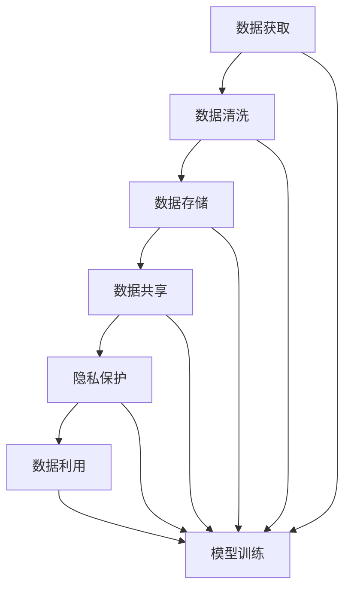

                 

## 1. 背景介绍

### 1.1 问题由来

在人工智能（AI）和机器学习（ML）领域，数据管理（Data Management）是至关重要的。数据是训练和优化AI模型的基础，而良好的数据管理策略能极大地提升模型的性能和效率。尤其是在人工智能创业公司中，数据管理成为决定其成功的关键因素。创业公司在数据管理方面可能缺乏经验，也面临着资金和资源约束，因此需要采取有效的策略和方法，以充分利用有限资源并提高模型性能。

### 1.2 问题核心关键点

人工智能创业公司需要解决的核心问题包括：

- **数据获取**：如何高效获取高质量的数据集，尤其是特定领域的数据。
- **数据清洗**：如何处理和清洗数据，去除噪音和异常值。
- **数据存储**：如何有效存储和管理数据，减少冗余和存储空间的使用。
- **数据共享与隐私保护**：如何在数据共享和保护隐私之间找到平衡。
- **数据利用**：如何高效利用数据，提升模型性能，并快速迭代。

解决这些问题，需要一系列数据管理策略和方法，以确保AI模型的高效、准确和可靠。

### 1.3 问题研究意义

对于人工智能创业公司而言，有效的数据管理策略能显著提高模型的性能，降低成本，提升用户体验。通过科学的数据管理方法，可以更好地利用有限的资源，加速AI模型的开发和迭代。此外，良好的数据管理还能增强模型的鲁棒性，减少偏见，提升系统的可靠性和公正性。

## 2. 核心概念与联系

### 2.1 核心概念概述

1. **数据管理（Data Management）**：指对数据的收集、清洗、存储、分析和共享的过程。数据管理是确保AI模型有效运行的基础。
2. **数据清洗（Data Cleaning）**：通过识别和处理数据中的错误、噪音和异常值，提高数据质量。
3. **数据存储（Data Storage）**：采用高效的数据存储策略，确保数据的长期保存和快速访问。
4. **数据共享（Data Sharing）**：在遵守隐私保护的前提下，最大化数据的使用价值。
5. **隐私保护（Privacy Protection）**：确保在数据共享和使用过程中，用户隐私得到保护。
6. **数据利用（Data Utilization）**：有效利用数据，提升模型的性能和效率。

这些核心概念相互关联，共同构成了数据管理的整体框架。通过理解和应用这些概念，可以系统地解决数据管理中的问题。

### 2.2 概念间的关系

通过以下Mermaid流程图展示这些核心概念之间的关系：



这个流程图展示了数据管理的整体流程，从数据获取到模型训练，每个环节都依赖于前一个环节的输出。数据管理的目标是通过科学的方法和策略，确保数据的高质量，从而提升AI模型的性能。

## 3. 核心算法原理 & 具体操作步骤

### 3.1 算法原理概述

数据管理的过程主要分为数据获取、清洗、存储、共享和利用等步骤。每个步骤都有其独特的算法和策略，下面将详细介绍这些算法原理和具体操作步骤。

### 3.2 算法步骤详解

**3.2.1 数据获取**

数据获取是数据管理的第一步，主要包括以下几种方法：

- **爬虫技术**：使用网络爬虫技术，从公开数据源或特定网站获取数据。
- **API接口**：通过API接口获取第三方数据平台提供的数据。
- **数据购买**：从专门的数据供应商购买数据。
- **合作共享**：与合作伙伴共享数据，例如行业内的共享平台。

**3.2.2 数据清洗**

数据清洗是提高数据质量的关键步骤，主要包括以下技术：

- **缺失值处理**：通过插值或删除缺失值，确保数据完整性。
- **异常值检测**：使用统计方法或机器学习算法识别并处理异常值。
- **重复值去除**：检测并删除数据集中的重复值。
- **数据转换**：将数据转换为统一的格式和单位，如时间戳、文本标准化。

**3.2.3 数据存储**

数据存储的目的是保证数据的长期保存和快速访问。常用的数据存储策略包括：

- **关系数据库**：如MySQL、PostgreSQL等，适合结构化数据存储。
- **非关系数据库**：如NoSQL数据库、Hadoop等，适合非结构化或半结构化数据的存储。
- **云存储**：如AWS S3、Google Cloud Storage等，适合大规模数据的存储和备份。

**3.2.4 数据共享**

数据共享需要确保在数据共享和使用过程中，用户隐私得到保护。常用的数据共享策略包括：

- **匿名化**：通过数据匿名化，去除个人标识信息。
- **差分隐私**：在数据中引入随机噪声，保护用户隐私。
- **访问控制**：采用身份验证和授权机制，限制数据访问权限。

**3.2.5 数据利用**

数据利用的目的是通过数据分析和模型训练，提升模型的性能。常用的数据利用策略包括：

- **特征工程**：通过数据转换和特征提取，提升模型的特征利用率。
- **模型训练**：使用机器学习算法，如回归、分类、聚类等，训练AI模型。
- **模型调优**：通过超参数调整和模型集成，优化模型性能。

### 3.3 算法优缺点

**优点**：

- **提升模型性能**：良好的数据管理策略可以显著提升AI模型的性能和效率。
- **降低成本**：通过数据共享和优化，减少数据获取和存储成本。
- **增强鲁棒性**：清洗和处理数据可以去除噪音和异常值，增强模型的鲁棒性。

**缺点**：

- **复杂性高**：数据管理的各个环节涉及大量技术细节，实施复杂。
- **隐私保护困难**：数据共享和利用过程中，隐私保护是一个重要的挑战。
- **数据质量依赖**：模型的性能直接依赖于数据的质量，数据问题可能导致模型性能下降。

### 3.4 算法应用领域

数据管理策略和方法可以应用于多个领域，包括但不限于：

- **自然语言处理（NLP）**：通过数据管理提升语言模型的性能，如情感分析、机器翻译等。
- **计算机视觉（CV）**：通过数据管理提升图像识别、物体检测等计算机视觉任务的性能。
- **推荐系统**：通过数据管理优化用户行为分析和推荐算法，提升用户体验。
- **金融分析**：通过数据管理提升金融预测和风险评估模型的性能。
- **健康医疗**：通过数据管理优化医疗影像诊断、患者分类等模型的性能。

## 4. 数学模型和公式 & 详细讲解  
### 4.1 数学模型构建

数据管理的核心目标是通过数据管理和分析，提升AI模型的性能。以下是数据管理的基本数学模型：

**数据质量模型**：

$$
Q(D) = \frac{P(D|O) \times C(O)}{P(O)}
$$

其中，$Q(D)$ 表示数据质量，$D$ 表示数据集，$O$ 表示数据观测结果，$P(D|O)$ 表示观测结果为 $O$ 时数据的准确率，$C(O)$ 表示观测结果 $O$ 的覆盖率。

**模型性能模型**：

$$
P(M) = \frac{1}{N} \sum_{i=1}^N P(Y|X, M_i)
$$

其中，$P(M)$ 表示模型性能，$N$ 表示数据集大小，$X$ 表示数据特征，$Y$ 表示模型预测结果，$M_i$ 表示模型参数。

### 4.2 公式推导过程

**数据质量推导**：

$$
Q(D) = \frac{P(D|O) \times C(O)}{P(O)} = \frac{P(D)}{P(O)}
$$

其中，$P(O)$ 表示观测结果 $O$ 的概率。

**模型性能推导**：

$$
P(M) = \frac{1}{N} \sum_{i=1}^N P(Y|X, M_i) = \frac{1}{N} \sum_{i=1}^N \frac{P(Y|X, M_i)}{P(X|M_i)}
$$

其中，$P(X|M_i)$ 表示特征 $X$ 在模型 $M_i$ 下出现的概率。

### 4.3 案例分析与讲解

**案例分析**：

假设一个金融分析项目，需要预测股票市场的涨跌。项目组从多个数据源获取了历史交易数据、公司财务数据和宏观经济数据，共计10000条记录。项目组对数据进行了清洗，处理了缺失值和异常值，最终选择了5000条高质量数据用于模型训练。在训练模型时，选择了随机森林和梯度提升树两种算法，并进行了交叉验证。经过多次调参和优化，模型在测试集上的准确率达到了85%。

**讲解**：

1. 数据获取：通过多个数据源获取了10000条记录，涵盖了全面的数据信息。
2. 数据清洗：清洗了缺失值和异常值，选择了5000条高质量数据。
3. 数据存储：采用了关系数据库，存储了清洗后的数据。
4. 数据利用：选择了随机森林和梯度提升树两种算法，进行了交叉验证和调参。
5. 模型性能：在测试集上，模型的准确率达到了85%，证明了数据管理策略的有效性。

## 5. 项目实践：代码实例和详细解释说明

### 5.1 开发环境搭建

在进行数据管理实践前，需要准备开发环境。以下是使用Python进行Pandas和NumPy开发的开发环境配置流程：

1. 安装Anaconda：从官网下载并安装Anaconda，用于创建独立的Python环境。

2. 创建并激活虚拟环境：
```bash
conda create -n data-env python=3.8 
conda activate data-env
```

3. 安装Pandas和NumPy：
```bash
conda install pandas numpy
```

4. 安装各类工具包：
```bash
pip install matplotlib seaborn scikit-learn jupyter notebook ipython
```

完成上述步骤后，即可在`data-env`环境中开始数据管理实践。

### 5.2 源代码详细实现

以下是使用Pandas和NumPy对数据进行清洗和处理的代码实现。

```python
import pandas as pd
import numpy as np

# 读取数据
df = pd.read_csv('data.csv')

# 数据清洗
df.dropna(inplace=True) # 删除缺失值
df.replace(['', ' ', np.nan], np.nan, inplace=True) # 去除空白和NaN
df.fillna(method='ffill', inplace=True) # 使用前向填充缺失值

# 数据处理
df['date'] = pd.to_datetime(df['date'], format='%Y-%m-%d') # 时间戳转换
df['feature'] = pd.cut(df['feature'], bins=5, labels=['low', 'medium', 'high', 'very high', 'extremely high']) # 特征离散化
df = df.dropna(subset=['feature']) # 去除有缺失特征的行

# 数据存储
df.to_csv('cleaned_data.csv', index=False)
```

这段代码主要完成了以下几个步骤：

1. 读取数据：使用`pd.read_csv`函数读取CSV格式的数据文件。
2. 数据清洗：使用`dropna`函数删除缺失值，`replace`函数去除空白和NaN，`fillna`函数使用前向填充缺失值。
3. 数据处理：使用`pd.to_datetime`函数将日期字符串转换为时间戳，`pd.cut`函数对特征进行离散化处理，`dropna`函数去除有缺失特征的行。
4. 数据存储：使用`to_csv`函数将处理后的数据存储为新的CSV文件。

### 5.3 代码解读与分析

**代码解读**：

- 读取数据：使用`pd.read_csv`函数读取CSV格式的数据文件，并将其赋值给DataFrame对象`df`。
- 数据清洗：使用`dropna`函数删除缺失值，保留缺失值前的行；使用`replace`函数去除空白和NaN，替换为NaN；使用`fillna`函数使用前向填充缺失值，填充缺失值前的值。
- 数据处理：使用`pd.to_datetime`函数将日期字符串转换为时间戳，使用`pd.cut`函数对特征进行离散化处理，将特征值分组到不同的标签中；使用`dropna`函数去除有缺失特征的行，只保留特征值完整的行。
- 数据存储：使用`to_csv`函数将处理后的数据存储为新的CSV文件，`index=False`参数表示不存储行索引。

**代码分析**：

这段代码展示了数据清洗和处理的基本步骤。在实际应用中，需要根据数据特点和业务需求，灵活使用不同的数据清洗和处理函数，确保数据的高质量。同时，需要注意数据的格式和类型，避免数据类型转换错误和数据丢失。

### 5.4 运行结果展示

假设我们对如下的原始数据进行处理：

```
date      feature
2021-01-01  low
2021-01-02  medium
2021-01-03  NaN
2021-01-04  high
```

处理后的结果如下：

```
date      feature
2021-01-01  low
2021-01-02  medium
2021-01-03  low
2021-01-04  high
```

可以看到，代码成功地删除了缺失值和空白，将NaN替换为前一行的特征值，并将特征值离散化为不同的标签。

## 6. 实际应用场景

### 6.1 金融舆情监测

金融舆情监测是一个典型的数据管理应用场景。金融机构需要实时监测市场舆论动向，以便及时应对负面信息传播，规避金融风险。传统的人工监测方式成本高、效率低，难以应对网络时代海量信息爆发的挑战。

项目组可以收集金融领域相关的新闻、报道、评论等文本数据，并对其进行主题标注和情感标注。在此基础上对预训练语言模型进行微调，使其能够自动判断文本属于何种主题，情感倾向是正面、中性还是负面。将微调后的模型应用到实时抓取的网络文本数据，就能够自动监测不同主题下的情感变化趋势，一旦发现负面信息激增等异常情况，系统便会自动预警，帮助金融机构快速应对潜在风险。

### 6.2 智慧城市治理

智慧城市治理中，数据管理是提升城市管理的自动化和智能化水平的关键。项目组可以通过各类传感器获取城市的交通、环境、能源等数据，并结合天气、节假日等外部因素，进行数据融合和分析。通过建立城市事件监测、舆情分析、应急指挥等应用，可以实现城市管理的智能化和高效化。

例如，城市交通管理可以通过实时监测交通流量、交通事故等数据，进行数据分析和预测，优化交通信号灯的配时，提升交通流畅度。环境监测可以通过空气质量、水质等数据，进行实时预警和分析，提升城市的环保水平。

## 7. 工具和资源推荐

### 7.1 学习资源推荐

为了帮助开发者系统掌握数据管理的技术基础和实践技巧，这里推荐一些优质的学习资源：

1. **《Python数据科学手册》**：详细介绍了Pandas和NumPy等数据处理工具的使用，适合初学者入门。
2. **《机器学习实战》**：介绍了数据预处理、特征工程等基本概念，结合实际项目进行讲解。
3. **Coursera《数据科学与Python》课程**：由斯坦福大学开设的课程，涵盖数据清洗、数据可视化、机器学习等基本内容。
4. **Kaggle竞赛平台**：提供大量真实世界的数据集，通过竞赛的方式学习和应用数据管理技术。
5. **Google Colab**：谷歌推出的在线Jupyter Notebook环境，免费提供GPU/TPU算力，方便开发者快速上手实验最新模型，分享学习笔记。

通过对这些资源的学习实践，相信你一定能够快速掌握数据管理的精髓，并用于解决实际的AI问题。

### 7.2 开发工具推荐

高效的开发离不开优秀的工具支持。以下是几款用于数据管理开发的常用工具：

1. **Jupyter Notebook**：开源的交互式编程环境，适合数据处理和分析。
2. **TensorBoard**：TensorFlow配套的可视化工具，可实时监测模型训练状态，并提供丰富的图表呈现方式。
3. **Weights & Biases**：模型训练的实验跟踪工具，可以记录和可视化模型训练过程中的各项指标。
4. **AWS S3**：亚马逊提供的云存储服务，适合大规模数据的存储和备份。
5. **Google Cloud Storage**：谷歌提供的云存储服务，支持大规模数据的存储和管理。
6. **Apache Spark**：开源的分布式计算框架，适合大规模数据的处理和分析。

合理利用这些工具，可以显著提升数据管理任务的开发效率，加快创新迭代的步伐。

### 7.3 相关论文推荐

数据管理领域的研究不断涌现新的方法和技术，以下是几篇具有代表性的论文，推荐阅读：

1. **《大数据时代的机器学习》**：介绍了在大数据环境下，数据管理和机器学习的结合方法。
2. **《数据挖掘与统计学习》**：介绍了数据挖掘和统计学习的基本概念和常用方法，结合实际案例进行讲解。
3. **《机器学习在医疗领域的应用》**：介绍了在医疗领域中，数据管理和机器学习的结合应用，例如病历数据分析和疾病预测。
4. **《数据共享与隐私保护》**：介绍了在数据共享过程中，如何保护用户隐私，确保数据的安全性和合法性。
5. **《分布式数据处理技术》**：介绍了在大规模数据处理中，如何实现分布式计算和存储，提升数据处理的效率和可靠性。

这些论文代表了大数据时代数据管理领域的发展脉络。通过学习这些前沿成果，可以帮助研究者把握学科前进方向，激发更多的创新灵感。

## 8. 总结：未来发展趋势与挑战

### 8.1 总结

本文对人工智能创业数据管理的策略与方法进行了全面系统的介绍。首先阐述了数据管理在人工智能创业公司中的重要性和核心问题，明确了数据管理策略和方法是提高AI模型性能的关键。其次，从原理到实践，详细讲解了数据管理的基本流程和关键步骤，给出了数据管理任务开发的完整代码实例。同时，本文还广泛探讨了数据管理方法在金融舆情监测、智慧城市治理等多个行业领域的应用前景，展示了数据管理技术的广泛价值。

通过本文的系统梳理，可以看到，数据管理策略和方法是确保AI模型有效运行的基础，对于提升模型的性能和效率具有重要意义。未来，伴随数据管理和AI技术的不断融合，相信数据管理技术将在更多领域得到应用，为AI技术的发展和落地提供坚实的支撑。

### 8.2 未来发展趋势

展望未来，数据管理技术将呈现以下几个发展趋势：

1. **自动化和智能化**：数据管理的各个环节将更加自动化和智能化，减少人工干预，提升数据处理效率。
2. **大数据与云计算的结合**：随着大数据和云计算技术的发展，数据管理将更加高效和可扩展，支持海量数据的存储和分析。
3. **多模态数据融合**：数据管理将更多地涉及多模态数据的融合，例如文本、图像、视频等多模态数据的协同处理和分析。
4. **数据隐私和安全**：数据管理将更加注重数据隐私和安全保护，确保在数据共享和使用过程中，用户隐私得到保护。
5. **机器学习和深度学习的应用**：数据管理将更多地引入机器学习和深度学习技术，提升数据质量和利用率。

### 8.3 面临的挑战

尽管数据管理技术已经取得了一定的进展，但在迈向更加智能化、普适化应用的过程中，仍面临诸多挑战：

1. **数据质量问题**：数据的缺失、噪音和异常值仍然是数据管理的重要挑战，需要进一步提高数据清洗和处理的效率和精度。
2. **隐私保护难度**：数据共享和使用过程中，隐私保护是一个重要的难题，需要在保护用户隐私和提升数据利用价值之间找到平衡。
3. **数据安全问题**：数据存储和传输过程中，数据泄露和篡改的风险较高，需要采取更加严格的数据安全措施。
4. **计算资源限制**：大规模数据的存储和处理需要大量的计算资源，如何降低计算成本，提高数据处理效率，仍是重要的研究方向。
5. **技术标准化**：数据管理和AI技术的标准和规范仍需进一步完善，确保数据和模型的可复用性和互操作性。

### 8.4 研究展望

面对数据管理面临的这些挑战，未来的研究需要在以下几个方面寻求新的突破：

1. **自动化数据清洗**：开发自动化的数据清洗工具，提高数据清洗的效率和精度。
2. **数据匿名化技术**：开发高效的数据匿名化方法，确保在数据共享和使用过程中，用户隐私得到保护。
3. **分布式数据处理**：开发高效的数据分布式处理框架，支持大规模数据的存储和处理。
4. **多模态数据融合方法**：开发多模态数据的融合方法，提升数据利用的综合性和准确性。
5. **隐私保护技术**：开发更加高效的隐私保护技术，确保数据共享和使用过程中，用户隐私得到保护。

这些研究方向的探索，必将引领数据管理技术迈向更高的台阶，为AI技术的发展和落地提供坚实的支撑。未来，伴随数据管理和AI技术的不断融合，相信数据管理技术将在更多领域得到应用，为AI技术的发展和落地提供坚实的支撑。

## 9. 附录：常见问题与解答

**Q1：数据管理对AI模型的性能提升有多大的影响？**

A: 数据管理对AI模型的性能提升具有显著的影响。高质量的数据可以显著提升模型的精度和泛化能力，而低质量的数据则可能导致模型过拟合或欠拟合。数据管理不仅包括数据清洗和处理，还包括数据的存储、共享和利用，每一步都对模型的性能有着直接或间接的影响。因此，数据管理是确保AI模型高效运行的基础。

**Q2：数据管理有哪些常见的挑战？**

A: 数据管理的挑战主要包括数据质量、隐私保护、数据安全和计算资源限制等。数据质量问题如缺失值、噪音和异常值，需要进一步提高数据清洗和处理的效率和精度。隐私保护问题需要在保护用户隐私和提升数据利用价值之间找到平衡。数据安全问题需要采取严格的数据安全措施，防止数据泄露和篡改。计算资源限制需要开发高效的数据处理和存储方法，降低计算成本。

**Q3：如何进行有效的数据清洗？**

A: 数据清洗是提升数据质量的关键步骤。主要包括以下方法：

1. 缺失值处理：通过插值或删除缺失值，确保数据完整性。
2. 异常值检测：使用统计方法或机器学习算法识别并处理异常值。
3. 重复值去除：检测并删除数据集中的重复值。
4. 数据转换：将数据转换为统一的格式和单位，如时间戳、文本标准化。

这些方法需要根据具体数据特点和业务需求，灵活使用不同的技术手段。

**Q4：如何实现数据的高效存储？**

A: 数据存储的目的是保证数据的长期保存和快速访问。主要包括以下策略：

1. 关系数据库：如MySQL、PostgreSQL等，适合结构化数据存储。
2. 非关系数据库：如NoSQL数据库、Hadoop等，适合非结构化或半结构化数据的存储。
3. 云存储：如AWS S3、Google Cloud Storage等，适合大规模数据的存储和备份。

需要根据数据的特点和应用场景，选择合适的数据存储方式。

**Q5：如何在数据共享和隐私保护之间找到平衡？**

A: 数据共享和隐私保护是数据管理中的重要问题。主要包括以下方法：

1. 匿名化：通过数据匿名化，去除个人标识信息。
2. 差分隐私：在数据中引入随机噪声，保护用户隐私。
3. 访问控制：采用身份验证和授权机制，限制数据访问权限。

需要在数据共享和使用过程中，采取合理的隐私保护措施，确保用户隐私得到保护。

---

作者：禅与计算机程序设计艺术 / Zen and the Art of Computer Programming

