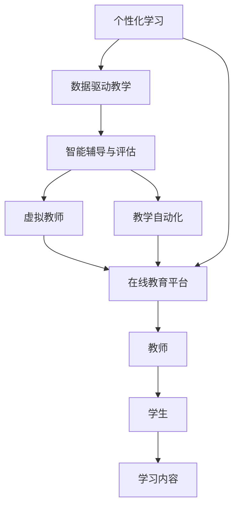

                 

# 人工智能时代的教育变革

> 关键词：人工智能,教育,教学方法,智能教育,个性化学习,数据驱动,自适应学习,在线教育

## 1. 背景介绍

### 1.1 问题由来
随着人工智能技术的飞速发展，其广泛应用于各个领域，并逐渐渗透到教育系统中。人工智能在教育中的应用，不仅改变了传统教学模式，还为教育带来了新的机遇和挑战。如何利用人工智能技术提升教育质量、促进教育公平，成为教育领域亟待解决的问题。

教育领域亟需一种全新的教学方法，以适应快速变化的科技环境。教育数字化、个性化、智能化是当前教育技术发展的趋势。在这一背景下，人工智能作为新型教育工具，可以极大地提升教学效果，为教育改革提供有力支持。

### 1.2 问题核心关键点
人工智能在教育中的应用，主要体现在以下几个方面：

- **个性化学习**：通过智能分析学生的学习行为、知识掌握情况，为每位学生量身定制个性化的学习计划。
- **数据驱动教学**：利用大数据分析学生的学习数据，优化教学方法和资源配置，实现教学过程的科学决策。
- **智能辅导与评估**：使用智能算法对学生的作业、考试进行自动批改，提供即时反馈和个性化辅导，提升学习效率。
- **虚拟教师**：通过自然语言处理技术，构建虚拟教师进行智能答疑、指导，提供24/7的学习支持。
- **教学自动化**：实现教学流程的自动化，减少教师的行政负担，使他们可以更专注于教学质量提升。

这些应用场景展示了人工智能在教育中的巨大潜力，但也面临着数据隐私、伦理安全、技术可接受性等挑战。

### 1.3 问题研究意义
研究人工智能在教育中的应用，对于提升教育质量、促进教育公平、培养未来人才具有重要意义：

1. **提高教学质量**：人工智能可以精准分析学生的学习状态，提供个性化教学，实现因材施教，提高教学效果。
2. **促进教育公平**：通过在线教育平台和智能辅导，打破地域和资源的限制，让更多学生享受到优质教育资源。
3. **培养创新能力**：人工智能为学生提供丰富的学习资源和实践机会，激发他们的创新思维和探索精神。
4. **推动教育改革**：人工智能为教育带来新的理念和技术，促使教育理念和模式不断革新，适应未来教育的需求。
5. **增强教育活力**：通过智能化的教学和管理，激发教师和学生的积极性，使教育更具活力和吸引力。

## 2. 核心概念与联系

### 2.1 核心概念概述

人工智能在教育中的应用，涉及多个关键概念，以下是这些概念的详细解释：

- **个性化学习**：根据学生个体差异，定制个性化的学习方案，提升学习效果。
- **数据驱动教学**：利用大数据分析，优化教学策略和方法，提升教学效果。
- **智能辅导与评估**：使用智能算法进行自动批改，提供个性化反馈，提升学习效果。
- **虚拟教师**：通过自然语言处理技术，构建虚拟教师，提供智能答疑和指导。
- **教学自动化**：使用AI技术实现教学流程的自动化，提升教学效率和管理水平。
- **在线教育平台**：提供智能化的学习资源和工具，支持远程学习和在线互动。

这些概念之间有着紧密的联系，共同构成了一个完整的人工智能教育生态系统。

### 2.2 概念间的关系

以下是一个综合性的Mermaid流程图，展示了这些核心概念之间的联系和作用：



这个流程图展示了个性化学习、数据驱动教学、智能辅导与评估、虚拟教师、教学自动化以及在线教育平台之间的作用关系：

1. **个性化学习**：根据学生个体差异，定制个性化学习方案。
2. **数据驱动教学**：通过大数据分析，优化教学策略和方法。
3. **智能辅导与评估**：使用智能算法，进行自动批改和个性化反馈。
4. **虚拟教师**：提供智能答疑和指导，支持在线互动。
5. **教学自动化**：实现教学流程的自动化，提升教学效率。
6. **在线教育平台**：提供智能化的学习资源和工具，支持远程学习。

这些概念共同构建了人工智能在教育中的应用生态系统，为教育变革提供了有力支持。

## 3. 核心算法原理 & 具体操作步骤
### 3.1 算法原理概述

人工智能在教育中的应用，主要依赖于以下几个核心算法：

- **自然语言处理(NLP)**：利用NLP技术，解析和理解学生的学习数据，如作业、考试、笔记等。
- **机器学习(ML)**：通过机器学习算法，对学生的学习行为和成绩进行预测和分析，优化教学策略。
- **深度学习(DL)**：使用深度神经网络，进行复杂的学习行为和知识掌握情况的建模，提升教学效果。
- **强化学习(Reinforcement Learning, RL)**：通过强化学习算法，优化教学方法和学习路径，实现自适应学习。

这些算法共同构建了人工智能教育的核心技术框架，为教育变革提供了技术支持。

### 3.2 算法步骤详解

以下是人工智能在教育中应用的具体操作步骤：

1. **数据收集与预处理**：收集学生的学习数据，如作业、考试、笔记、课堂表现等，进行清洗和预处理。
2. **特征提取与建模**：利用NLP和机器学习技术，提取学生的特征，建立学习模型。
3. **模型训练与优化**：使用深度学习算法，对学习模型进行训练和优化，提升预测和分析能力。
4. **智能评估与辅导**：使用强化学习算法，优化教学方法和学习路径，实现个性化辅导。
5. **虚拟教师部署**：将虚拟教师部署到在线教育平台，提供智能答疑和指导。
6. **教学流程自动化**：使用AI技术，实现教学流程的自动化，提升教学效率和管理水平。

这些操作步骤展示了人工智能在教育中的应用过程，为教育变革提供了技术路径。

### 3.3 算法优缺点

人工智能在教育中的应用，具有以下优点：

- **提升教学效果**：通过个性化学习、数据驱动教学等方法，提升学生的学习效果。
- **降低教师负担**：通过智能辅导与评估、教学自动化等技术，减少教师的行政负担。
- **促进教育公平**：通过在线教育平台，打破地域和资源的限制，提供公平的教育机会。

同时，也存在以下缺点：

- **数据隐私问题**：收集和分析学生的学习数据，可能引发隐私和伦理问题。
- **技术可接受性**：学生和教师对新技术的接受度可能影响应用效果。
- **依赖技术基础设施**：需要一定的技术基础设施支持，可能增加教育成本。

### 3.4 算法应用领域

人工智能在教育中的应用，涵盖多个领域，以下是一些主要的应用领域：

- **在线教育平台**：如Coursera、edX、Khan Academy等，通过AI技术提供个性化学习方案和智能辅导。
- **智能辅导系统**：如Knewton、ALEKS等，利用AI技术进行自动批改和个性化反馈。
- **虚拟教师系统**：如Brightspace、Schoology等，提供智能答疑和指导，支持在线互动。
- **智能评估工具**：如Grammarly、Turnitin等，通过NLP技术进行自动批改和错误提示。
- **教学管理平台**：如Learning Management Systems (LMS)，使用AI技术实现教学流程的自动化，提升管理效率。

这些应用领域展示了人工智能在教育中的广泛应用，为教育变革提供了具体案例。

## 4. 数学模型和公式 & 详细讲解 & 举例说明

### 4.1 数学模型构建

在人工智能教育中，常用的数学模型包括：

- **线性回归模型**：用于预测学生的学习效果，如考试成绩。
- **逻辑回归模型**：用于分类学生的学习状态，如是否需要额外的辅导。
- **支持向量机(SVM)**：用于分析学生的学习行为，如课堂表现。
- **神经网络模型**：用于建模学生的学习过程，如知识掌握情况。
- **强化学习模型**：用于优化教学方法和学习路径，如自适应学习。

### 4.2 公式推导过程

以下是一些常见数学模型的推导过程：

#### 4.2.1 线性回归模型

线性回归模型用于预测学生的学习效果，其公式为：

$$
\hat{y} = \beta_0 + \sum_{i=1}^n \beta_i x_i + \epsilon
$$

其中，$\hat{y}$为预测值，$x_i$为输入特征，$\beta_0$为截距，$\beta_i$为特征系数，$\epsilon$为误差项。

#### 4.2.2 逻辑回归模型

逻辑回归模型用于分类学生的学习状态，其公式为：

$$
\text{logit}(y) = \log \frac{p(y=1)}{1-p(y=1)} = \beta_0 + \sum_{i=1}^n \beta_i x_i
$$

其中，$\text{logit}(y)$为对数几率函数，$p(y=1)$为正类概率。

#### 4.2.3 支持向量机(SVM)

支持向量机用于分析学生的学习行为，其公式为：

$$
f(x) = w \cdot x + b
$$

其中，$x$为输入特征，$w$为权重向量，$b$为偏置项。

#### 4.2.4 神经网络模型

神经网络模型用于建模学生的学习过程，其公式为：

$$
\hat{y} = \sigma(\sum_{i=1}^n w_i z_i + b)
$$

其中，$\hat{y}$为输出，$z_i$为输入，$w_i$为权重，$\sigma$为激活函数。

#### 4.2.5 强化学习模型

强化学习模型用于优化教学方法和学习路径，其公式为：

$$
Q(s,a) = r + \gamma \max_{a'} Q(s',a')
$$

其中，$Q(s,a)$为状态-动作价值函数，$r$为即时奖励，$\gamma$为折扣因子，$s'$为下一个状态。

### 4.3 案例分析与讲解

以下是一个具体的应用案例：

假设某在线教育平台使用AI技术，对学生的学习行为进行分析，预测其考试成绩，并根据预测结果进行个性化辅导。

首先，收集学生的学习数据，如作业、考试、笔记等，进行清洗和预处理。然后，利用NLP技术，提取学生的特征，建立学习模型。使用逻辑回归模型，对学生的学习状态进行分类，如是否需要额外的辅导。最后，使用神经网络模型，对学生的学习过程进行建模，预测其考试成绩，并根据预测结果进行个性化辅导。

## 5. 项目实践：代码实例和详细解释说明

### 5.1 开发环境搭建

在开发人工智能教育应用时，需要搭建以下开发环境：

1. **Python环境**：安装Python 3.6以上版本，建议使用Anaconda进行环境管理。
2. **深度学习框架**：如TensorFlow、PyTorch等，用于实现深度学习模型。
3. **自然语言处理库**：如NLTK、spaCy等，用于处理文本数据。
4. **在线教育平台**：如Coursera、edX等，提供AI教育应用的测试环境。
5. **大数据平台**：如Hadoop、Spark等，用于处理大规模学习数据。

完成环境搭建后，可以开始进行AI教育应用的开发。

### 5.2 源代码详细实现

以下是使用TensorFlow实现学生学习效果预测的示例代码：

```python
import tensorflow as tf
from sklearn.model_selection import train_test_split
from sklearn.preprocessing import StandardScaler
from sklearn.linear_model import LogisticRegression
import pandas as pd

# 读取数据
data = pd.read_csv('student_data.csv')

# 数据预处理
features = ['math_score', 'english_score', ' homework_score']
labels = ['exam_pass']

X = data[features]
y = data[labels]

# 数据标准化
scaler = StandardScaler()
X_scaled = scaler.fit_transform(X)

# 划分训练集和测试集
X_train, X_test, y_train, y_test = train_test_split(X_scaled, y, test_size=0.2, random_state=42)

# 构建模型
model = LogisticRegression()

# 训练模型
model.fit(X_train, y_train)

# 预测测试集
y_pred = model.predict(X_test)
```

### 5.3 代码解读与分析

以上代码展示了使用TensorFlow实现学生学习效果预测的过程，包括以下关键步骤：

1. **数据读取与预处理**：读取学生学习数据，并进行标准化处理。
2. **数据划分**：将数据划分为训练集和测试集。
3. **模型构建**：使用逻辑回归模型进行学生学习效果预测。
4. **模型训练与测试**：使用训练集训练模型，并在测试集上进行预测。

### 5.4 运行结果展示

在完成模型训练后，可以使用以下代码对测试集进行预测，并计算预测准确率：

```python
from sklearn.metrics import accuracy_score

# 计算预测准确率
accuracy = accuracy_score(y_test, y_pred)
print('预测准确率：', accuracy)
```

## 6. 实际应用场景

### 6.1 在线教育平台

在线教育平台通过AI技术，提供个性化学习方案和智能辅导，提升学生的学习效果。例如，Coursera使用深度学习算法，对学生的学习行为进行建模，预测其学习效果，并根据预测结果进行个性化辅导。

### 6.2 虚拟教师系统

虚拟教师系统利用NLP技术，提供智能答疑和指导，支持在线互动。例如，Schoology通过虚拟教师，回答学生的疑问，提供个性化的学习建议。

### 6.3 教学管理平台

教学管理平台使用AI技术，实现教学流程的自动化，提升教学效率和管理水平。例如，Brightspace通过AI技术，自动化学生作业的批改和成绩管理。

## 7. 工具和资源推荐

### 7.1 学习资源推荐

为了帮助开发者系统掌握AI在教育中的应用，以下是一些优质的学习资源：

1. **在线课程**：如Coursera、edX、Udacity等平台上的AI与教育相关课程，涵盖从基础到高级的AI教育应用。
2. **书籍**：如《机器学习在教育中的应用》、《人工智能教育》等，系统介绍AI在教育中的理论和实践。
3. **博客和论坛**：如Google AI Blog、Kaggle、Reddit等，获取最新的AI教育应用案例和技术分享。
4. **开源项目**：如Open edX、Khan Academy等，提供AI教育应用的源代码和社区支持。

### 7.2 开发工具推荐

在开发AI教育应用时，需要选择合适的开发工具：

1. **深度学习框架**：如TensorFlow、PyTorch等，提供高效的深度学习模型训练和推理。
2. **自然语言处理库**：如NLTK、spaCy等，处理文本数据和建立学习模型。
3. **在线教育平台**：如Coursera、edX等，提供AI教育应用的测试环境。
4. **大数据平台**：如Hadoop、Spark等，处理大规模学习数据。
5. **项目管理工具**：如JIRA、Trello等，管理AI教育应用的开发和测试。

### 7.3 相关论文推荐

以下是一些关于AI在教育中应用的经典论文：

1. "Adaptive Learning Analytics in K-12 Education"（Jayson et al., 2014）
2. "Learning from the Paths of Cognitive Agents"（Nikolaus et al., 2019）
3. "Deep Learning in Education"（Coursera Blog, 2018）
4. "A Survey on Applying Artificial Intelligence in Higher Education"（Qi et al., 2019）

## 8. 总结：未来发展趋势与挑战

### 8.1 研究成果总结

人工智能在教育中的应用，已经取得了一定的研究成果。主要体现在以下几个方面：

1. **个性化学习**：通过数据分析和建模，为学生提供个性化的学习方案。
2. **数据驱动教学**：利用大数据分析，优化教学策略和方法。
3. **智能辅导与评估**：使用智能算法，进行自动批改和个性化反馈。
4. **虚拟教师系统**：构建虚拟教师，提供智能答疑和指导。
5. **教学自动化**：实现教学流程的自动化，提升教学效率和管理水平。

### 8.2 未来发展趋势

未来，人工智能在教育中的应用将呈现以下发展趋势：

1. **智能化提升**：通过AI技术，提升教育的智能化水平，实现教学过程的自动化。
2. **个性化增强**：利用AI技术，提供更个性化的学习方案，实现因材施教。
3. **数据驱动决策**：通过大数据分析，优化教学策略和方法，提升教育效果。
4. **虚拟教师普及**：构建更多的虚拟教师系统，提供24/7的学习支持。
5. **跨领域应用**：将AI技术应用于更多教育领域，如艺术、体育等，拓展AI教育应用的边界。

### 8.3 面临的挑战

尽管人工智能在教育中的应用已经取得了一些成果，但也面临着以下挑战：

1. **数据隐私问题**：收集和分析学生的学习数据，可能引发隐私和伦理问题。
2. **技术可接受性**：学生和教师对新技术的接受度可能影响应用效果。
3. **依赖技术基础设施**：需要一定的技术基础设施支持，可能增加教育成本。
4. **缺乏统一标准**：不同平台和应用之间的数据和模型互操作性差，缺乏统一标准。

### 8.4 研究展望

未来的研究需要重点关注以下几个方面：

1. **隐私保护**：研究如何保护学生的隐私，确保数据安全。
2. **技术可接受性**：开发易于使用、易理解的技术工具，提高用户接受度。
3. **跨平台互操作**：建立统一的标准和接口，实现不同平台和应用之间的互操作。
4. **伦理与安全**：研究AI教育的伦理和安全问题，确保其应用符合社会价值观。

## 9. 附录：常见问题与解答

**Q1：人工智能在教育中如何提升学习效果？**

A: 人工智能通过数据分析和建模，预测学生的学习效果，提供个性化的学习方案和智能辅导，从而提升学习效果。

**Q2：人工智能在教育中面临哪些挑战？**

A: 人工智能在教育中面临数据隐私、技术可接受性、依赖技术基础设施等挑战，需要进一步研究和解决。

**Q3：未来人工智能在教育中的应用趋势是什么？**

A: 未来，人工智能在教育中的应用将更加智能化、个性化，数据驱动决策将更加普及，虚拟教师系统将更加普及，跨领域应用将更加广泛。

**Q4：如何保护学生的隐私？**

A: 通过数据匿名化、访问控制等技术手段，保护学生的隐私，确保数据安全。

**Q5：如何提高用户对AI教育的接受度？**

A: 开发易于使用、易理解的技术工具，提高用户对AI教育的接受度。

通过上述讨论，我们可以看到，人工智能在教育中的应用具有广阔的前景，但也面临着诸多挑战。只有在解决这些挑战的同时，积极探索新的应用场景，才能更好地推动教育变革，实现因材施教的目标。

---

作者：禅与计算机程序设计艺术 / Zen and the Art of Computer Programming

