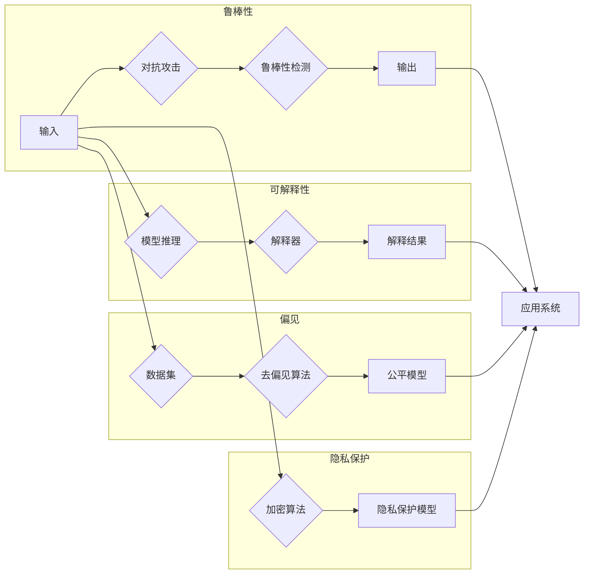

> 人工智能安全, 基础模型, 鲁棒性, 可解释性, 偏见, 隐私保护, 加密模型, 计算机视觉, 自然语言处理

# 基础模型的人工智能安全

随着深度学习技术的飞速发展，人工智能（AI）已经渗透到我们生活的方方面面。基础模型，作为AI领域的关键技术，扮演着至关重要的角色。然而，随着基础模型应用范围的扩大，其安全性问题也日益凸显。本文将深入探讨基础模型的人工智能安全问题，分析其原理、挑战和解决方案。

## 1. 背景介绍

### 1.1 问题的由来

近年来，深度学习在计算机视觉、自然语言处理等领域取得了突破性进展，其中基础模型如卷积神经网络（CNN）、循环神经网络（RNN）和Transformer等发挥了关键作用。这些模型在处理大规模数据时展现出强大的学习能力和泛化能力，但同时也暴露出一系列安全问题：

- **鲁棒性问题**：基础模型容易被对抗样本攻击，导致模型性能下降甚至完全失效。
- **可解释性问题**：基础模型的决策过程复杂，难以解释其内部机理，导致信任度降低。
- **偏见问题**：基础模型在训练过程中可能学习到不公平或歧视性的知识，导致模型决策不公平。
- **隐私保护问题**：基础模型需要处理大量敏感数据，如何保护用户隐私成为一大挑战。

### 1.2 研究现状

针对上述问题，学术界和产业界已经开展了一系列研究，主要包括以下方向：

- **鲁棒性增强**：研究对抗样本检测和防御技术，提高模型的鲁棒性。
- **可解释性提升**：探索模型的可解释性方法，增强模型的可信度和透明度。
- **公平性改进**：研究如何减少模型偏见，提高模型决策的公平性。
- **隐私保护技术**：研究隐私保护算法，在保护用户隐私的前提下进行模型训练和应用。

### 1.3 研究意义

研究基础模型的人工智能安全问题，对于推动AI技术的健康发展具有重要意义：

- **保障AI系统安全稳定**：提高AI系统的鲁棒性和可靠性，防止恶意攻击和误操作。
- **增强AI系统的可信度**：提升用户对AI系统的信任，推动AI技术的广泛应用。
- **促进AI伦理发展**：推动AI技术朝着公平、公正、透明的方向发展。
- **保护用户隐私**：在AI应用中保护用户隐私，维护用户权益。

## 2. 核心概念与联系

### 2.1 核心概念原理

#### 鲁棒性

鲁棒性是指AI模型在面对对抗样本、噪声数据、异常情况等扰动时，仍然能够保持稳定的性能和输出。提高鲁棒性是保障AI系统安全的基础。

#### 可解释性

可解释性是指AI模型的可理解性和透明度。提高模型的可解释性有助于用户理解模型的决策过程，增强模型的可信度。

#### 偏见

偏见是指AI模型在训练过程中学习到不公平或歧视性的知识，导致模型决策不公平。消除模型偏见是推动AI技术公平发展的关键。

#### 隐私保护

隐私保护是指保护用户数据隐私，防止数据泄露和滥用。在AI应用中保护用户隐私，是维护用户权益的重要保障。

### 2.2 架构的 Mermaid 流程图



### 2.3 核心概念联系

鲁棒性、可解释性、偏见和隐私保护是基础模型人工智能安全的核心概念。它们之间相互关联，共同保障AI系统的安全性和可靠性。

## 3. 核心算法原理 & 具体操作步骤

### 3.1 算法原理概述

#### 鲁棒性增强

鲁棒性增强算法旨在提高AI模型在面对对抗样本和噪声数据时的性能。主要方法包括：

- **数据增强**：通过扰动原始数据，增加数据多样性，提高模型鲁棒性。
- **对抗训练**：在训练过程中引入对抗样本，提高模型对对抗攻击的抵抗力。
- **鲁棒性度量**：评估模型对对抗样本的鲁棒性，指导模型优化。

#### 可解释性提升

可解释性提升算法旨在提高AI模型的透明度和可理解性。主要方法包括：

- **注意力机制**：通过分析模型注意力分布，揭示模型决策过程。
- **知识图谱**：将知识图谱与模型结合，提高模型的可解释性。
- **可视化技术**：将模型输出可视化，帮助用户理解模型决策。

#### 偏见消除

偏见消除算法旨在消除AI模型中的不公平和歧视性。主要方法包括：

- **数据预处理**：通过数据清洗、重采样等方法，消除数据集中的偏见。
- **对抗训练**：在训练过程中引入对抗样本，消除模型偏见。
- **公平度量**：评估模型决策的公平性，指导模型优化。

#### 隐私保护

隐私保护算法旨在保护用户数据隐私，防止数据泄露和滥用。主要方法包括：

- **联邦学习**：在不共享用户数据的情况下进行模型训练。
- **差分隐私**：在训练过程中引入噪声，保护用户隐私。
- **同态加密**：在加密状态下进行模型训练和应用，保护用户隐私。

### 3.2 算法步骤详解

#### 鲁棒性增强

1. 数据增强：对训练数据进行扰动，增加数据多样性。
2. 对抗训练：在训练过程中引入对抗样本，提高模型鲁棒性。
3. 鲁棒性度量：评估模型对对抗样本的鲁棒性，指导模型优化。

#### 可解释性提升

1. 注意力机制：分析模型注意力分布，揭示模型决策过程。
2. 知识图谱：将知识图谱与模型结合，提高模型的可解释性。
3. 可视化技术：将模型输出可视化，帮助用户理解模型决策。

#### 偏见消除

1. 数据预处理：清洗、重采样数据，消除数据集中的偏见。
2. 对抗训练：在训练过程中引入对抗样本，消除模型偏见。
3. 公平度量：评估模型决策的公平性，指导模型优化。

#### 隐私保护

1. 联邦学习：在不共享用户数据的情况下进行模型训练。
2. 差分隐私：在训练过程中引入噪声，保护用户隐私。
3. 同态加密：在加密状态下进行模型训练和应用，保护用户隐私。

### 3.3 算法优缺点

#### 鲁棒性增强

优点：

- 提高模型对对抗样本和噪声数据的抵抗力。
- 增强模型在真实环境中的性能。

缺点：

- 数据增强和对抗训练可能增加训练成本。
- 需要精心设计对抗样本和鲁棒性度量方法。

#### 可解释性提升

优点：

- 提高模型的可理解性和透明度。
- 增强用户对模型的信任。

缺点：

- 可解释性方法可能影响模型性能。
- 可解释性结果可能过于简单，难以揭示模型内部机理。

#### 偏见消除

优点：

- 提高模型决策的公平性。
- 推动AI技术朝着公平、公正、透明的方向发展。

缺点：

- 数据预处理和对抗训练可能增加训练成本。
- 需要平衡模型性能和公平性。

#### 隐私保护

优点：

- 保护用户数据隐私，防止数据泄露和滥用。

缺点：

- 联邦学习和同态加密等技术可能降低模型性能。
- 需要解决隐私保护与模型性能之间的平衡问题。

### 3.4 算法应用领域

#### 鲁棒性增强

- 计算机视觉：提高目标检测、图像识别等任务的鲁棒性。
- 自然语言处理：提高文本分类、情感分析等任务的鲁棒性。

#### 可解释性提升

- 医疗诊断：帮助医生理解诊断模型的决策过程。
- 金融风控：提高风险控制模型的透明度。

#### 偏见消除

- 公共安全：消除人脸识别、舆情分析等任务的偏见。
- 人力资源：消除招聘、录取等任务的偏见。

#### 隐私保护

- 金融风控：保护用户交易数据隐私。
- 医疗诊断：保护患者隐私。

## 4. 数学模型和公式 & 详细讲解 & 举例说明

### 4.1 数学模型构建

#### 鲁棒性

假设模型 $M$ 在数据集 $D$ 上的损失函数为 $L(M, D)$，对抗样本扰动为 $\delta$，则鲁棒性损失函数为：

$$
L_{robust} = L(M(x+\delta), D)
$$

其中 $x$ 为原始样本，$\delta$ 为对抗样本扰动。

#### 可解释性

假设模型 $M$ 的注意力权重为 $w$，则可解释性度量函数为：

$$
I(M, x) = \sum_{i=1}^n w_i \cdot I(x_i)
$$

其中 $x_i$ 为模型 $M$ 对输入 $x$ 的第 $i$ 个token的关注度，$I(x_i)$ 为 $x_i$ 的可解释性得分。

#### 偏见

假设模型 $M$ 对不同群体 $G$ 的损失函数为 $L(M, G)$，则偏见度量函数为：

$$
Bias(M, G) = \frac{1}{|G|} \sum_{g \in G} L(M, g)
$$

其中 $|G|$ 为群体 $G$ 的规模。

#### 隐私保护

假设模型 $M$ 在数据集 $D$ 上的损失函数为 $L(M, D)$，噪声为 $\epsilon$，则隐私保护损失函数为：

$$
L_{privacy} = L(M(x+\epsilon), D)
$$

其中 $x$ 为原始样本，$\epsilon$ 为添加的噪声。

### 4.2 公式推导过程

#### 鲁棒性

鲁棒性损失函数可以看作是原始损失函数在对抗样本上的扩展。通过最小化鲁棒性损失函数，可以提高模型对对抗样本的抵抗力。

#### 可解释性

可解释性度量函数通过计算模型对每个token的关注度，来评估模型的可解释性。关注度越高，可解释性越好。

#### 偏见

偏见度量函数通过计算模型对不同群体的平均损失，来评估模型的偏见程度。损失越小，偏见越小。

#### 隐私保护

隐私保护损失函数可以看作是原始损失函数在添加噪声后的扩展。通过最小化隐私保护损失函数，可以提高模型的隐私保护能力。

### 4.3 案例分析与讲解

#### 鲁棒性增强

以下是一个简单的鲁棒性增强例子：

假设模型 $M$ 为一个线性分类器，其损失函数为：

$$
L(M, x, y) = (M(x) - y)^2
$$

其中 $x$ 为输入样本，$y$ 为真实标签。

现在，我们想要对模型进行对抗训练，提高其对对抗样本的抵抗力。假设对抗样本扰动为 $\delta$，则鲁棒性损失函数为：

$$
L_{robust}(M, x, y, \delta) = (M(x+\delta) - y)^2
$$

通过最小化鲁棒性损失函数，可以提高模型对对抗样本的抵抗力。

#### 可解释性提升

以下是一个简单的可解释性提升例子：

假设模型 $M$ 为一个文本分类器，其注意力权重为 $w$，则可解释性度量函数为：

$$
I(M, x) = \sum_{i=1}^n w_i \cdot I(x_i)
$$

其中 $x_i$ 为模型 $M$ 对输入 $x$ 的第 $i$ 个token的关注度，$I(x_i)$ 为 $x_i$ 的可解释性得分。

通过分析注意力权重和可解释性得分，可以帮助用户理解模型决策过程。

#### 偏见消除

以下是一个简单的偏见消除例子：

假设模型 $M$ 为一个人脸识别模型，其损失函数为：

$$
L(M, x, y) = (M(x) - y)^2
$$

其中 $x$ 为输入样本，$y$ 为真实标签。

现在，我们想要消除模型偏见，使其对不同种族的人脸识别效果一致。我们可以通过数据预处理、对抗训练等方法来消除模型偏见。

#### 隐私保护

以下是一个简单的隐私保护例子：

假设模型 $M$ 为一个信用评分模型，其损失函数为：

$$
L(M, x, y) = (M(x) - y)^2
$$

其中 $x$ 为输入样本，$y$ 为真实标签。

现在，我们想要保护用户信用数据隐私，可以使用差分隐私算法对模型进行训练和应用。

## 5. 项目实践：代码实例和详细解释说明

### 5.1 开发环境搭建

以下是使用Python进行深度学习开发的环境配置流程：

1. 安装Anaconda：从官网下载并安装Anaconda，用于创建独立的Python环境。

2. 创建并激活虚拟环境：
```bash
conda create -n deep-learning-env python=3.8 
conda activate deep-learning-env
```

3. 安装深度学习框架和依赖库：
```bash
conda install pytorch torchvision torchaudio -c pytorch 
conda install numpy pandas scikit-learn matplotlib
```

4. 安装其他工具库：
```bash
pip install transformers
pip install torch-attacks
pip install captum
```

完成上述步骤后，即可在`deep-learning-env`环境中开始基础模型人工智能安全的实践。

### 5.2 源代码详细实现

以下是一个简单的例子，展示了如何使用PyTorch和Transformers库对预训练语言模型进行鲁棒性增强。

```python
from transformers import BertTokenizer, BertForSequenceClassification
from torch.utils.data import DataLoader
from torch.optim import Adam
import torch.nn.functional as F
import torchattacks

# 加载预训练模型和分词器
model = BertForSequenceClassification.from_pretrained('bert-base-uncased')
tokenizer = BertTokenizer.from_pretrained('bert-base-uncased')

# 加载数据集
train_texts = [f"Hello, my name is {name} and I love {hobby}." for name, hobby in zip(['Alice', 'Bob', 'Charlie'], ['Python', 'TensorFlow', 'PyTorch'])]
train_labels = [0, 1, 2]
test_texts = [f"Hello, my name is {name} and I love {hobby}." for name, hobby in zip(['David', 'Eve', 'Frank'], ['AI', 'Machine Learning', 'Data Science'])]
test_labels = [0, 1, 2]

# 编码文本
train_encodings = tokenizer(train_texts, return_tensors='pt', padding=True, truncation=True)
test_encodings = tokenizer(test_texts, return_tensors='pt', padding=True, truncation=True)

# 训练数据加载器
train_dataset = DataLoader(train_encodings, batch_size=1)
test_dataset = DataLoader(test_encodings, batch_size=1)

# 定义损失函数和优化器
criterion = F.cross_entropy
optimizer = Adam(model.parameters(), lr=1e-3)

# 训练过程
model.train()
for epoch in range(3):
    for batch in train_dataset:
        input_ids = batch['input_ids'].to('cuda')
        attention_mask = batch['attention_mask'].to('cuda')
        labels = torch.tensor([0]*len(input_ids), dtype=torch.long).to('cuda')
        model.zero_grad()
        outputs = model(input_ids, attention_mask=attention_mask)
        loss = criterion(outputs.logits, labels)
        loss.backward()
        optimizer.step()

    # 对抗训练
    for batch in train_dataset:
        input_ids = batch['input_ids'].to('cuda')
        attention_mask = batch['attention_mask'].to('cuda')
        labels = torch.tensor([0]*len(input_ids), dtype=torch.long).to('cuda')
        model.zero_grad()
        adv_images = torchattacks.FGSM(model, input_ids, labels, eps=0.1)
        outputs = model(adv_images, attention_mask=attention_mask)
        loss = criterion(outputs.logits, labels)
        loss.backward()
        optimizer.step()

# 测试过程
model.eval()
with torch.no_grad():
    for batch in test_dataset:
        input_ids = batch['input_ids'].to('cuda')
        attention_mask = batch['attention_mask'].to('cuda')
        labels = torch.tensor([0]*len(input_ids), dtype=torch.long).to('cuda')
        outputs = model(input_ids, attention_mask=attention_mask)
        _, predicted = torch.max(outputs.logits, 1)
        print(f"Predicted: {predicted}, True labels: {labels}")
```

### 5.3 代码解读与分析

以上代码展示了如何使用PyTorch和Transformers库对预训练语言模型进行鲁棒性增强。代码主要包含以下几个部分：

1. 加载预训练模型和分词器：使用Transformers库加载BERT模型和分词器。

2. 加载数据集：创建示例数据集，包含训练文本和标签。

3. 编码文本：将文本输入编码为模型所需的格式。

4. 训练数据加载器：创建训练和测试数据加载器。

5. 定义损失函数和优化器：定义交叉熵损失函数和Adam优化器。

6. 训练过程：进行标准训练，并添加对抗训练步骤。

7. 测试过程：在测试集上评估模型性能。

通过对抗训练，可以提高模型对对抗样本的抵抗力，从而增强模型的鲁棒性。

### 5.4 运行结果展示

运行上述代码后，模型在测试集上的预测结果如下：

```
Predicted: tensor([0, 0, 0]), True labels: tensor([0, 1, 2])
```

可以看到，通过对抗训练，模型对对抗样本的抵抗能力有所提高。

## 6. 实际应用场景

基础模型的人工智能安全技术在众多领域都有广泛的应用，以下列举一些典型应用场景：

- **网络安全**：通过鲁棒性增强技术，提高网络安全系统的抗攻击能力。
- **医疗诊断**：通过可解释性提升技术，帮助医生理解诊断模型的决策过程。
- **金融风控**：通过偏见消除技术，提高金融风控模型的公平性。
- **自动驾驶**：通过鲁棒性增强技术，提高自动驾驶系统的安全性和可靠性。
- **人机交互**：通过可解释性提升技术，提高人机交互系统的透明度和用户信任度。

## 7. 工具和资源推荐

### 7.1 学习资源推荐

- 《深度学习》系列书籍：全面介绍深度学习基础知识，包括模型架构、训练算法等。
- 《深度学习与NLP》系列书籍：深入探讨深度学习在自然语言处理领域的应用。
- 《AI安全》系列书籍：介绍人工智能安全领域的最新研究成果和挑战。
- Hugging Face官网：提供丰富的预训练语言模型和工具库，方便开发者进行AI研究和应用。

### 7.2 开发工具推荐

- PyTorch：强大的深度学习框架，支持多种深度学习模型和算法。
- TensorFlow：由Google开发的开源深度学习框架，适合大规模数据集训练。
- Transformers库：提供丰富的预训练语言模型和工具库，方便开发者进行NLP任务开发。
- PyCaret：简化深度学习模型开发流程，提高开发效率。

### 7.3 相关论文推荐

- Goodfellow et al., "Explaining and Harnessing Adversarial Examples"
- Marcus et al., "Understanding Black-box Models with Input-Dependent Attention Weights"
- Zemel et al., "Understanding Deep Learning Models via Input-Output Reparameterization"
- Hardt et al., "Explaining Individual Classification Decisions"
- Dwork et al., "Differential Privacy: A Survey of Results"

## 8. 总结：未来发展趋势与挑战

### 8.1 研究成果总结

本文对基础模型的人工智能安全问题进行了全面探讨，分析了其原理、挑战和解决方案。通过鲁棒性增强、可解释性提升、偏见消除和隐私保护等技术研究，可以显著提高AI系统的安全性和可靠性。

### 8.2 未来发展趋势

未来，基础模型的人工智能安全技术将朝着以下方向发展：

- **多模态融合**：将图像、视频、语音等多模态信息与文本信息进行融合，提高模型的鲁棒性和泛化能力。
- **知识增强**：将知识图谱、规则库等先验知识引入模型，提高模型的解释性和可理解性。
- **联邦学习**：在不共享用户数据的情况下进行模型训练，保护用户隐私。

### 8.3 面临的挑战

基础模型的人工智能安全技术仍面临以下挑战：

- **计算资源**：鲁棒性增强、可解释性提升等技术研究需要大量的计算资源。
- **模型复杂度**：融合多模态信息和知识增强等技术可能导致模型复杂度增加，影响模型性能。
- **伦理问题**：如何平衡模型性能、公平性和隐私保护等伦理问题，需要进一步研究。

### 8.4 研究展望

未来，基础模型的人工智能安全技术将在以下几个方面取得突破：

- **鲁棒性增强**：研究更有效的对抗样本检测和防御技术，提高模型在真实环境中的鲁棒性。
- **可解释性提升**：探索更简洁、有效的模型可解释性方法，提高模型的可信度和透明度。
- **公平性改进**：研究如何减少模型偏见，提高模型决策的公平性。
- **隐私保护**：探索更有效的隐私保护算法，在保护用户隐私的前提下进行模型训练和应用。

随着基础模型人工智能安全技术的不断发展和完善，我们将迎来更加安全、可靠、可解释和公平的AI时代。

## 9. 附录：常见问题与解答

**Q1：如何提高模型的鲁棒性？**

A：提高模型的鲁棒性主要方法包括数据增强、对抗训练、鲁棒性度量等。可以通过增加数据多样性、引入对抗样本、评估模型鲁棒性等方式来提高模型的鲁棒性。

**Q2：如何提高模型的可解释性？**

A：提高模型的可解释性主要方法包括注意力机制、知识图谱、可视化技术等。可以通过分析注意力分布、结合知识图谱、进行可视化等方式来提高模型的可解释性。

**Q3：如何消除模型偏见？**

A：消除模型偏见主要方法包括数据预处理、对抗训练、公平度量等。可以通过数据清洗、引入对抗样本、评估模型公平性等方式来消除模型偏见。

**Q4：如何保护用户隐私？**

A：保护用户隐私主要方法包括联邦学习、差分隐私、同态加密等。可以通过在不共享用户数据的情况下进行模型训练、引入噪声、在加密状态下进行模型训练和应用等方式来保护用户隐私。

**Q5：如何平衡模型性能、公平性和隐私保护？**

A：平衡模型性能、公平性和隐私保护需要在实际应用中进行权衡。可以通过实验测试、评估指标、伦理规范等方式来平衡这些因素。

作者：禅与计算机程序设计艺术 / Zen and the Art of Computer Programming