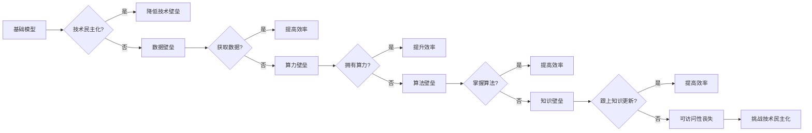

# 基础模型的可访问性丧失

> 关键词：基础模型，可访问性，人工智能，技术民主化，数据壁垒，算力壁垒，算法壁垒

## 1. 背景介绍

随着人工智能技术的迅猛发展，基础模型（如深度学习模型、自然语言处理模型等）已经成为推动这一领域进步的关键。这些模型在医疗、金融、交通、教育等多个领域展现出了巨大的潜力。然而，基础模型的可访问性正逐渐丧失，这背后反映了人工智能技术民主化的挑战。

### 1.1 技术民主化的兴起

技术民主化是指将先进技术从少数人手中普及到更广泛的社会群体，使其能够利用技术工具提升生活质量、创造价值。在人工智能领域，技术民主化意味着让更多的人能够访问和利用先进的人工智能模型。

### 1.2 可访问性丧失的现状

尽管人工智能技术取得了巨大进步，但以下因素导致基础模型的可访问性正在丧失：

- **数据壁垒**：数据是训练和部署人工智能模型的关键资源。然而，高质量的数据往往集中在少数大型科技公司手中，普通研究者和小型企业难以获取。
- **算力壁垒**：深度学习模型训练需要大量的计算资源，高昂的硬件成本和能源消耗限制了小规模组织和个人进入这一领域。
- **算法壁垒**：人工智能算法的复杂性和专业性要求研究者具备深厚的数学和编程基础，这使得非专业人士难以掌握。
- **知识壁垒**：人工智能领域的知识更新迅速，普通研究者和小型企业难以跟上最新的研究进展。

### 1.3 研究意义

探讨基础模型的可访问性丧失问题，对于推动人工智能技术民主化具有重要意义：

- **促进创新**：降低技术壁垒，鼓励更多的人参与到人工智能研究中，推动技术创新和应用。
- **提升效率**：让更多的人能够利用人工智能技术解决实际问题，提高社会生产效率。
- **缩小数字鸿沟**：通过普及人工智能知识和技术，缩小数字鸿沟，促进社会公平。

## 2. 核心概念与联系

为了更好地理解基础模型的可访问性丧失问题，我们首先需要明确以下几个核心概念：

- **基础模型**：指经过大规模数据训练，具有通用性和可迁移性的机器学习模型。
- **技术民主化**：指将先进技术普及到更广泛的社会群体，使其能够利用技术工具提升生活质量、创造价值。
- **数据壁垒**：指数据资源的不平等分布，导致部分群体难以获取所需数据。
- **算力壁垒**：指计算资源的稀缺和昂贵，限制了小规模组织和个人进行计算任务。
- **算法壁垒**：指算法的复杂性和专业性要求，使得非专业人士难以掌握。
- **知识壁垒**：指人工智能领域的知识更新迅速，非专业人士难以跟上最新的研究进展。

这些概念的逻辑关系可以用以下Mermaid流程图表示：



从图中可以看出，基础模型的可访问性丧失是由多种因素共同作用的结果，这些因素相互关联，共同构成了技术民主化的挑战。

## 3. 核心算法原理 & 具体操作步骤

### 3.1 算法原理概述

解决基础模型可访问性丧失问题，需要从以下几个方面入手：

- **数据开放与共享**：推动数据资源开放和共享，降低数据壁垒。
- **算力资源池化**：建立算力资源池，降低算力壁垒。
- **算法简化与普及**：简化算法设计，降低算法壁垒。
- **知识普及与培训**：普及人工智能知识，降低知识壁垒。

### 3.2 算法步骤详解

#### 3.2.1 数据开放与共享

- **建立数据共享平台**：鼓励数据所有者将数据上传到平台，并设定合理的共享机制。
- **数据清洗与标注**：对共享数据进行清洗和标注，提高数据质量。
- **数据接口标准化**：制定数据接口标准，方便数据使用。

#### 3.2.2 算力资源池化

- **建立算力云平台**：提供弹性的算力资源，降低用户使用门槛。
- **共享算力资源**：鼓励大型计算机构为小型组织和个人提供算力资源。
- **优化资源调度**：优化算力资源调度算法，提高资源利用率。

#### 3.2.3 算法简化与普及

- **开发轻量级模型**：设计轻量级模型，降低计算复杂度。
- **提供算法库**：开发开源算法库，方便用户快速使用。
- **算法可视化**：将算法设计可视化，降低学习门槛。

#### 3.2.4 知识普及与培训

- **开设在线课程**：提供人工智能基础知识课程，普及人工智能知识。
- **组织研讨会**：定期组织研讨会，交流最新研究成果。
- **建立人才培训体系**：建立人工智能人才培训体系，培养专业人才。

### 3.3 算法优缺点

以上方法各有优缺点，以下是几种方法的优缺点分析：

- **数据开放与共享**：优点是可以有效降低数据壁垒，缺点是数据安全和隐私保护问题需要妥善解决。
- **算力资源池化**：优点是降低算力壁垒，缺点是需要建设和管理算力云平台。
- **算法简化与普及**：优点是降低算法壁垒，缺点是可能牺牲算法的精度和效率。
- **知识普及与培训**：优点是提高人工智能人才储备，缺点是需要投入大量资源和时间。

### 3.4 算法应用领域

以上方法可以应用于以下领域：

- **教育**：通过在线课程和研讨会，普及人工智能知识，培养人工智能人才。
- **科研**：通过数据共享和算力资源池化，促进人工智能研究。
- **产业**：通过算法简化和普及，推动人工智能技术在产业中的应用。

## 4. 数学模型和公式 & 详细讲解 & 举例说明

### 4.1 数学模型构建

为了量化评估基础模型的可访问性丧失问题，我们可以构建以下数学模型：

设 $A$ 为基础模型的可访问性，$D$ 为数据壁垒，$C$ 为算力壁垒，$K$ 为算法壁垒，$E$ 为知识壁垒，则可表示为：

$$
A = f(D,C,K,E)
$$

其中，$f$ 为一个复合函数，表示基础模型的可访问性与数据壁垒、算力壁垒、算法壁垒和知识壁垒之间的关系。

### 4.2 公式推导过程

假设数据壁垒、算力壁垒、算法壁垒和知识壁垒对基础模型可访问性的影响程度分别为 $a, b, c, d$，则有：

$$
A = aD + bC + cK + dE
$$

其中，$a, b, c, d$ 为正常数。

### 4.3 案例分析与讲解

以下以医疗领域为例，分析基础模型可访问性丧失问题。

**案例**：某医院希望利用人工智能技术进行疾病诊断，但面临着以下问题：

- **数据壁垒**：缺乏高质量的临床数据，难以进行模型训练。
- **算力壁垒**：缺乏高性能计算资源，难以进行模型训练和推理。
- **算法壁垒**：缺乏人工智能专业知识，难以选择合适的算法和模型。
- **知识壁垒**：缺乏人工智能人才，难以进行模型开发和部署。

**分析**：针对以上问题，可以采取以下措施：

- **数据壁垒**：与医学院校、研究机构合作，获取临床数据。
- **算力壁垒**：利用云计算平台，获取高性能计算资源。
- **算法壁垒**：参考开源算法库，选择合适的算法和模型。
- **知识壁垒**：组织人工智能培训，培养专业人才。

通过以上措施，可以有效提高医院对人工智能技术的可访问性，从而推动医疗领域的智能化发展。

## 5. 项目实践：代码实例和详细解释说明

### 5.1 开发环境搭建

为了更好地理解如何解决基础模型可访问性丧失问题，以下以使用TensorFlow.js进行机器学习模型部署为例，说明开发环境搭建过程。

1. 安装Node.js和npm：从官网下载Node.js和npm，并完成安装。
2. 创建项目文件夹：在终端中，使用以下命令创建项目文件夹：
```bash
mkdir ml-project
cd ml-project
```
3. 初始化npm项目：使用以下命令初始化npm项目：
```bash
npm init -y
```
4. 安装TensorFlow.js：使用以下命令安装TensorFlow.js：
```bash
npm install @tensorflow/tfjs @tensorflow-models/image-models
```

### 5.2 源代码详细实现

以下是一个简单的TensorFlow.js模型部署示例：

```javascript
// 引入TensorFlow.js和模型
import * as tf from '@tensorflow/tfjs'
import * as imageModel from '@tensorflow-models/image-models'

// 加载模型
async function loadModel() {
  const model = await imageModel.ssd.load()
  return model
}

// 预测图片
async function predictImage(model, image) {
  const tensor = tf.browser.fromImage(image)
  const predictions = await model.classify(tensor)
  return predictions
}

// 主函数
async function main() {
  const model = await loadModel()
  const image = new Image()
  image.src = 'https://example.com/path/to/image.jpg'
  image.onload = () => {
    const predictions = predictImage(model, image)
      .then((predictions) => {
        console.log(predictions)
      })
      .catch((error) => {
        console.error(error)
      })
  }
}

main()
```

### 5.3 代码解读与分析

以上代码展示了如何使用TensorFlow.js加载SSD模型，并使用该模型对图片进行分类。以下是代码的详细解读：

- 第1行：引入TensorFlow.js和图像模型库。
- 第2-3行：加载SSD模型。
- 第4-7行：定义预测图片的函数，将图片转换为TensorFlow.js张量，并使用模型进行分类。
- 第8-10行：定义主函数，加载模型并加载图片，然后在图片加载完成后进行预测。
- 第11行：调用主函数，启动模型加载和预测过程。

### 5.4 运行结果展示

将以上代码保存为 `index.js` 文件，并在浏览器中打开 `index.html` 文件。在 `index.html` 文件中，添加以下代码：

```html
<!DOCTYPE html>
<html>
<head>
  <title>TensorFlow.js SSD Model</title>
  <script src="index.js"></script>
</head>
<body>
  
</body>
</html>
```

在浏览器中打开 `index.html` 文件后，将显示加载的图片和模型的预测结果。

## 6. 实际应用场景

### 6.1 教育领域

在教育领域，基础模型的可访问性丧失问题可以通过以下方式解决：

- **在线课程**：提供人工智能基础知识课程，普及人工智能知识。
- **虚拟实验室**：建立虚拟实验室，让学生在虚拟环境中进行实践操作。
- **开源项目**：鼓励学生参与开源项目，提高实践能力。

### 6.2 医疗领域

在医疗领域，基础模型的可访问性丧失问题可以通过以下方式解决：

- **数据共享平台**：建立数据共享平台，促进医疗数据的开放和共享。
- **远程医疗**：利用人工智能技术，实现远程医疗诊断和治疗。
- **智能药物研发**：利用人工智能技术，加速新药研发进程。

### 6.3 产业领域

在产业领域，基础模型的可访问性丧失问题可以通过以下方式解决：

- **工业互联网**：利用人工智能技术，实现生产过程的智能化。
- **智慧城市**：利用人工智能技术，提升城市管理效率。
- **智能农业**：利用人工智能技术，提高农业生产效率。

## 7. 工具和资源推荐

### 7.1 学习资源推荐

- **在线课程**：
  - Coursera：提供人工智能、机器学习、数据科学等在线课程。
  - edX：提供计算机科学、数据科学、人工智能等在线课程。
  - Udemy：提供各种在线课程，包括人工智能、编程、数据科学等。
- **书籍**：
  - 《Python机器学习》
  - 《深度学习》
  - 《人工智能：一种现代的方法》
- **开源项目**：
  - TensorFlow
  - PyTorch
  - Keras

### 7.2 开发工具推荐

- **编程语言**：Python、JavaScript
- **深度学习框架**：TensorFlow、PyTorch
- **机器学习库**：scikit-learn、scipy
- **数据可视化**：Matplotlib、Seaborn

### 7.3 相关论文推荐

- **《Deep Learning》**：Goodfellow et al.
- **《Artificial Intelligence: A Modern Approach》**：Russell & Norvig.
- **《Reinforcement Learning: An Introduction》**：Sutton & Barto.

## 8. 总结：未来发展趋势与挑战

### 8.1 研究成果总结

本文探讨了基础模型的可访问性丧失问题，分析了造成这一现象的原因，并提出了相应的解决方案。通过数据开放与共享、算力资源池化、算法简化与普及、知识普及与培训等措施，可以有效提高基础模型的可访问性，推动人工智能技术民主化。

### 8.2 未来发展趋势

未来，人工智能技术将继续向以下几个方向发展：

- **模型小型化**：设计更轻量级的模型，降低计算和存储需求。
- **模型可解释性**：提高模型的可解释性，增强用户对模型的信任。
- **模型安全性与可靠性**：提高模型的安全性和可靠性，确保模型在实际应用中的稳定性。

### 8.3 面临的挑战

未来，基础模型的可访问性丧失问题仍然面临以下挑战：

- **数据安全与隐私**：如何在保护数据安全与隐私的前提下，实现数据开放与共享。
- **算力资源分配**：如何合理分配有限的算力资源，满足不同用户的需求。
- **算法公平性与透明度**：如何提高算法的公平性和透明度，避免歧视和不公正现象。

### 8.4 研究展望

为了应对未来挑战，我们需要在以下方面进行深入研究：

- **数据共享与隐私保护**：研究数据共享与隐私保护技术，实现数据的安全共享。
- **算力资源调度**：研究高效的算力资源调度算法，提高资源利用率。
- **算法评估与改进**：研究算法评估方法，改进算法的公平性和透明度。

通过不断的研究和探索，相信我们能够克服基础模型可访问性丧失问题，推动人工智能技术更好地服务于人类社会。

## 9. 附录：常见问题与解答

**Q1：什么是基础模型？**

A：基础模型是指经过大规模数据训练，具有通用性和可迁移性的机器学习模型。

**Q2：数据壁垒如何影响基础模型的可访问性？**

A：数据壁垒是指数据资源的不平等分布，导致部分群体难以获取所需数据。这限制了这些人或组织利用人工智能技术。

**Q3：如何解决算力壁垒问题？**

A：可以通过建立算力资源池、共享算力资源等方式，降低算力壁垒。

**Q4：如何解决算法壁垒问题？**

A：可以通过开发轻量级模型、提供算法库、算法可视化等方式，降低算法壁垒。

**Q5：如何解决知识壁垒问题？**

A：可以通过开设在线课程、组织研讨会、建立人才培训体系等方式，普及人工智能知识，降低知识壁垒。

**Q6：基础模型可访问性丧失问题对人工智能技术发展有何影响？**

A：基础模型可访问性丧失问题会导致人工智能技术发展缓慢，阻碍技术民主化进程。

**Q7：如何推动人工智能技术民主化？**

A：可以通过数据开放与共享、算力资源池化、算法简化与普及、知识普及与培训等措施，推动人工智能技术民主化。

作者：禅与计算机程序设计艺术 / Zen and the Art of Computer Programming