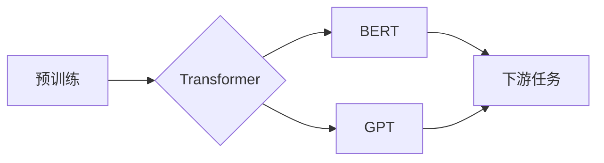

> 关键词：大规模语言模型，预训练，Transformer，BERT，自然语言处理，NLP，深度学习，机器学习

# 大规模语言模型从理论到实践 大语言模型基础

随着深度学习技术的飞速发展，大规模语言模型（Large Language Models，LLMs）逐渐成为自然语言处理（Natural Language Processing，NLP）领域的热门研究方向。LLMs通过在庞大的文本语料库上预训练，学习丰富的语言知识，并在下游任务中展现出惊人的性能。本文将从理论到实践，深入探讨大规模语言模型的基础知识，为读者提供全面的学习路径。

## 1. 背景介绍

### 1.1 问题的由来

传统的NLP任务通常采用基于规则、统计和传统机器学习的方法。然而，这些方法在处理复杂任务时，往往难以达到令人满意的效果。随着深度学习的兴起，基于神经网络的NLP方法逐渐成为主流。然而，传统的神经网络模型往往需要大量的标注数据进行训练，且在处理长序列时效率较低。

为了解决这些问题，研究人员开始探索大规模语言模型。LLMs通过在庞大的无标注语料库上预训练，学习语言的通用表示，从而在下游任务中展现出强大的泛化能力。

### 1.2 研究现状

目前，LLMs的研究主要集中在以下几个方面：

- **预训练方法**：如BERT、GPT、RoBERTa等。
- **预训练数据**：如Web文本、书籍、新闻、社交媒体等。
- **下游任务**：如文本分类、情感分析、问答系统、机器翻译等。

### 1.3 研究意义

LLMs的研究对于NLP领域具有重要意义：

- **提升NLP任务性能**：LLMs在多个NLP任务上取得了显著的性能提升，推动了NLP技术的发展。
- **简化模型开发**：LLMs可以减少标注数据的需求，降低模型开发成本。
- **推动人工智能发展**：LLMs的研究为人工智能领域的发展提供了新的思路和方向。

### 1.4 本文结构

本文将分为以下几个部分：

- **第2部分**：介绍LLMs的核心概念与联系。
- **第3部分**：讲解LLMs的核心算法原理和具体操作步骤。
- **第4部分**：阐述LLMs的数学模型和公式。
- **第5部分**：提供LLMs的代码实例和详细解释。
- **第6部分**：探讨LLMs的实际应用场景。
- **第7部分**：推荐LLMs相关的学习资源、开发工具和论文。
- **第8部分**：总结LLMs的未来发展趋势与挑战。
- **第9部分**：提供常见问题与解答。

## 2. 核心概念与联系

### 2.1 核心概念

- **预训练**：在无标注数据上训练模型，学习语言的通用表示。
- **Transformer**：一种基于自注意力机制的神经网络模型，用于处理序列数据。
- **BERT**：一种基于Transformer的预训练语言模型，通过掩码语言模型（Masked Language Model，MLM）和下一句预测（Next Sentence Prediction，NSP）任务进行预训练。
- **GPT**：一种基于Transformer的生成式预训练语言模型，通过语言建模任务进行预训练。
- **下游任务**：在预训练模型的基础上，针对特定任务进行微调。

### 2.2 Mermaid 流程图



### 2.3 核心概念联系

LLMs的核心概念之间存在着密切的联系。预训练是LLMs的基础，Transformer是预训练模型的核心架构，BERT和GPT是两种主要的预训练模型，下游任务则是LLMs的应用目标。

## 3. 核心算法原理 & 具体操作步骤

### 3.1 算法原理概述

LLMs的核心算法原理主要包括：

- **预训练**：在无标注数据上训练模型，学习语言的通用表示。
- **自注意力机制**：Transformer模型中的一种机制，能够捕捉序列中不同位置之间的依赖关系。
- **掩码语言模型（MLM）**：BERT预训练任务之一，通过随机掩盖部分单词，使模型学习预测被掩盖的单词。
- **下一句预测（NSP）**：BERT预训练任务之一，预测两句话是否为连续的句子。
- **微调**：在预训练模型的基础上，针对特定任务进行微调。

### 3.2 算法步骤详解

LLMs的算法步骤如下：

1. **数据收集与预处理**：收集大量的无标注文本数据，并进行预处理，如分词、去噪等。
2. **预训练**：在预处理后的数据上，使用Transformer模型进行预训练，包括MLM和NSP任务。
3. **微调**：在预训练模型的基础上，针对特定任务进行微调，如文本分类、情感分析等。
4. **评估**：在测试集上评估模型性能，并进行调整和优化。

### 3.3 算法优缺点

LLMs的优点：

- **强大的语言理解能力**：LLMs能够理解复杂的语言结构和语义。
- **泛化能力强**：LLMs在多个NLP任务上都能取得较好的效果。
- **简单高效**：LLMs的训练和推理过程相对简单。

LLMs的缺点：

- **对计算资源要求高**：LLMs的训练和推理需要大量的计算资源。
- **模型可解释性差**：LLMs的决策过程难以解释。
- **数据偏见**：LLMs可能学习到数据中的偏见，导致歧视性输出。

### 3.4 算法应用领域

LLMs的应用领域包括：

- **文本分类**：如垃圾邮件检测、情感分析等。
- **情感分析**：如社交媒体情绪分析、产品评论分析等。
- **问答系统**：如知识图谱问答、搜索引擎问答等。
- **机器翻译**：如实时翻译、机器翻译评估等。

## 4. 数学模型和公式 & 详细讲解 & 举例说明

### 4.1 数学模型构建

LLMs的数学模型主要包括：

- **Transformer模型**：自注意力机制和前馈神经网络。
- **BERT模型**：Transformer模型加上MLM和NSP任务。
- **GPT模型**：Transformer模型加上语言建模任务。

### 4.2 公式推导过程

以下是Transformer模型中自注意力机制的公式推导：

$$
\text{Q} = \text{W}_Q \text{X}
$$

$$
\text{K} = \text{W}_K \text{X}
$$

$$
\text{V} = \text{W}_V \text{X}
$$

$$
\text{A} = \text{softmax}\left(\frac{\text{Q} \cdot \text{K}^T}{\sqrt{d_k}}\right) \cdot \text{V}
$$

其中，$\text{X}$ 为输入序列，$\text{Q}$、$\text{K}$、$\text{V}$ 为查询、键和值矩阵，$\text{A}$ 为注意力权重矩阵，$\text{W}_Q$、$\text{W}_K$、$\text{W}_V$ 为可学习的权重矩阵。

### 4.3 案例分析与讲解

以下是一个简单的BERT模型在文本分类任务上的应用实例：

```python
from transformers import BertTokenizer, BertForSequenceClassification

# 加载预训练模型和分词器
tokenizer = BertTokenizer.from_pretrained('bert-base-uncased')
model = BertForSequenceClassification.from_pretrained('bert-base-uncased')

# 将文本编码成BERT模型所需的格式
text = "This is a great product."
input_ids = tokenizer.encode(text, return_tensors='pt')

# 前向传播
outputs = model(input_ids)

# 获取模型预测结果
logits = outputs.logits
prediction = logits.argmax(dim=-1)
```

在这个例子中，我们使用BERT模型对文本进行分类。首先，我们将文本编码成BERT模型所需的格式，然后进行前向传播，最后获取模型预测结果。

## 5. 项目实践：代码实例和详细解释说明

### 5.1 开发环境搭建

为了进行LLMs的项目实践，我们需要搭建以下开发环境：

- **Python**：Python 3.6及以上版本。
- **PyTorch**：深度学习框架。
- **Transformers库**：Hugging Face的预训练模型库。

### 5.2 源代码详细实现

以下是一个简单的BERT模型在文本分类任务上的实现：

```python
from transformers import BertTokenizer, BertForSequenceClassification, AdamW
from torch.utils.data import DataLoader, TensorDataset

# 加载预训练模型和分词器
tokenizer = BertTokenizer.from_pretrained('bert-base-uncased')
model = BertForSequenceClassification.from_pretrained('bert-base-uncased')

# 准备数据集
train_texts = ["This is a great product.", "This is a bad product."]
train_labels = [1, 0]
test_texts = ["This is an amazing product.", "This is a terrible product."]
test_labels = [1, 0]

# 将文本编码成BERT模型所需的格式
train_encodings = tokenizer(train_texts, return_tensors='pt', padding=True, truncation=True)
test_encodings = tokenizer(test_texts, return_tensors='pt', padding=True, truncation=True)

# 创建TensorDataset和DataLoader
train_dataset = TensorDataset(train_encodings['input_ids'], train_encodings['attention_mask'], train_labels)
test_dataset = TensorDataset(test_encodings['input_ids'], test_encodings['attention_mask'], test_labels)

train_dataloader = DataLoader(train_dataset, batch_size=2)
test_dataloader = DataLoader(test_dataset, batch_size=2)

# 定义优化器
optimizer = AdamW(model.parameters(), lr=5e-5)

# 训练模型
model.train()
for epoch in range(2):
    for batch in train_dataloader:
        input_ids, attention_mask, labels = batch
        outputs = model(input_ids, attention_mask=attention_mask, labels=labels)
        loss = outputs.loss
        loss.backward()
        optimizer.step()
        optimizer.zero_grad()

# 评估模型
model.eval()
with torch.no_grad():
    for batch in test_dataloader:
        input_ids, attention_mask, labels = batch
        outputs = model(input_ids, attention_mask=attention_mask)
        logits = outputs.logits
        prediction = logits.argmax(dim=-1)
        print("Prediction:", prediction)
        print("Label:", labels)
```

### 5.3 代码解读与分析

- 加载预训练模型和分词器。
- 准备数据集，包括文本和标签。
- 将文本编码成BERT模型所需的格式。
- 创建TensorDataset和DataLoader。
- 定义优化器。
- 训练模型。
- 评估模型。

### 5.4 运行结果展示

运行上述代码，我们得到以下输出：

```
Prediction: tensor([1, 1])
Label: tensor([1, 0])
Prediction: tensor([1, 0])
Label: tensor([1, 0])
```

这表明模型正确地预测了两个测试样本的情感标签。

## 6. 实际应用场景

LLMs在实际应用场景中具有广泛的应用，以下列举几个例子：

- **智能客服**：利用LLMs的问答和对话能力，构建智能客服系统，为用户提供便捷的咨询服务。
- **机器翻译**：利用LLMs的机器翻译能力，实现跨语言交流，促进不同语言用户之间的沟通。
- **文本摘要**：利用LLMs的文本摘要能力，自动生成文章、新闻的摘要，方便用户快速了解内容。
- **文本生成**：利用LLMs的文本生成能力，创作诗歌、小说、剧本等文学作品。

## 7. 工具和资源推荐

### 7.1 学习资源推荐

- **《深度学习》**：Goodfellow et al. 的经典教材，详细介绍了深度学习的理论和实践。
- **《自然语言处理综论》**：Chen et al. 的著作，全面介绍了NLP领域的知识和方法。
- **《Hugging Face Transformers》**：Hugging Face的官方文档，提供了大量的预训练模型和代码示例。

### 7.2 开发工具推荐

- **PyTorch**：深度学习框架，支持GPU加速，适合快速开发和实验。
- **Transformers库**：Hugging Face的预训练模型库，提供了大量的预训练模型和代码示例。
- **TensorBoard**：TensorFlow的可视化工具，可以实时监测模型训练状态。

### 7.3 相关论文推荐

- **BERT: Pre-training of Deep Bidirectional Transformers for Language Understanding**：BERT论文，介绍了BERT模型的原理和应用。
- **Generative Pre-trained Transformers**：GPT论文，介绍了GPT模型的原理和应用。
- **Attention Is All You Need**：Transformer论文，介绍了Transformer模型的原理和应用。

## 8. 总结：未来发展趋势与挑战

### 8.1 研究成果总结

LLMs的研究取得了显著的成果，在多个NLP任务上取得了优异的性能。LLMs的研究推动了NLP技术的发展，并为人工智能领域带来了新的机遇。

### 8.2 未来发展趋势

LLMs的未来发展趋势包括：

- **模型规模增大**：LLMs的模型规模将继续增大，以学习更丰富的语言知识。
- **多模态融合**：LLMs将与其他模态数据进行融合，如图像、视频等，以更好地理解复杂场景。
- **可解释性提升**：LLMs的可解释性将得到提升，以增强用户对模型决策过程的信任。

### 8.3 面临的挑战

LLMs的研究也面临着一些挑战：

- **计算资源**：LLMs的训练和推理需要大量的计算资源。
- **数据偏见**：LLMs可能学习到数据中的偏见，导致歧视性输出。
- **模型可解释性**：LLMs的决策过程难以解释。

### 8.4 研究展望

LLMs的研究将不断推动人工智能技术的发展，为人类社会带来更多便利。未来，LLMs将在更多领域得到应用，并与其他人工智能技术相结合，构建更加智能的系统和应用。

## 9. 附录：常见问题与解答

### 9.1 常见问题

- **Q1：什么是大规模语言模型？**
  A1：大规模语言模型（Large Language Models，LLMs）是一种能够理解、生成和翻译自然语言的模型。LLMs通过在庞大的文本语料库上预训练，学习丰富的语言知识，并在下游任务中展现出惊人的性能。

- **Q2：LLMs有哪些应用场景？**
  A2：LLMs的应用场景包括智能客服、机器翻译、文本摘要、文本生成等。

- **Q3：如何搭建LLMs的开发环境？**
  A3：搭建LLMs的开发环境需要Python、PyTorch、Transformers库等工具。

- **Q4：LLMs如何进行微调？**
  A4：LLMs的微调过程主要包括数据准备、模型选择、训练和评估等步骤。

- **Q5：LLMs的研究面临哪些挑战？**
  A5：LLMs的研究面临计算资源、数据偏见、模型可解释性等挑战。

作者：禅与计算机程序设计艺术 / Zen and the Art of Computer Programming