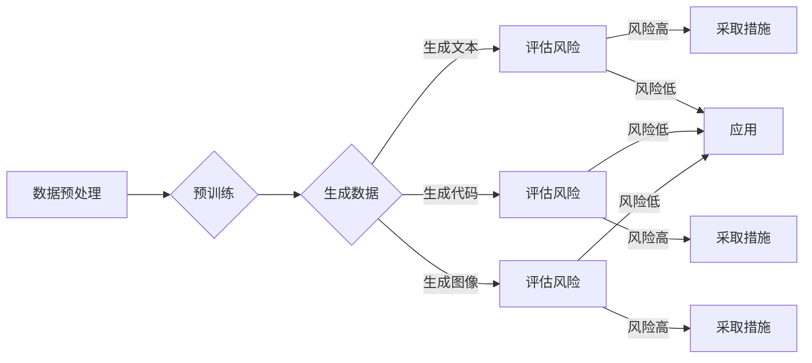

> 大语言模型, 自动生成数据, 风险评估, 道德伦理, 工程实践, 数据安全

# 大语言模型原理与工程实践：自动生成数据的风险

随着大语言模型（Large Language Models, LLMs）技术的飞速发展，其强大的文本生成能力在自然语言处理（Natural Language Processing, NLP）领域得到了广泛应用。然而，在享受LLMs带来的便利的同时，我们也必须正视自动生成数据所带来的潜在风险。本文将深入探讨大语言模型自动生成数据的风险，并提出相应的解决方案，以期在LLM工程实践中更好地平衡创新与安全。

## 1. 背景介绍

近年来，LLMs如BERT、GPT-3等在文本生成、机器翻译、问答系统等领域取得了显著的成果。这些模型通过在海量无标签文本数据上进行预训练，学习到丰富的语言知识和模式，从而能够生成高质量的文本内容。然而，随着LLMs在各个领域的应用日益广泛，其自动生成数据的能力也引发了一系列问题和风险，主要包括：

- **数据偏差与歧视**：LLMs在训练过程中可能会学习到数据中的偏见和歧视信息，从而在生成数据时传播这些有害信息。
- **隐私泄露与数据安全**：LLMs可以生成逼真的文本内容，使得伪造信息、虚假新闻等恶意行为更加难以检测。
- **版权侵犯与知识产权**：LLMs生成的文本内容可能与他人的作品相似，引发版权侵犯和知识产权争议。
- **伦理道德问题**：LLMs生成的文本可能包含暴力、色情等不道德内容，引发伦理道德方面的担忧。

## 2. 核心概念与联系

为了更好地理解LLMs自动生成数据的风险，首先需要明确以下几个核心概念：

- **大语言模型（LLMs）**：一种通过在海量无标签文本数据上进行预训练，学习到丰富的语言知识和模式，从而能够生成高质量文本内容的模型。
- **自动生成数据**：指使用LLMs生成与真实数据相似或具有特定特征的数据，如文本、代码、图像等。
- **风险评估**：对LLMs自动生成数据的风险进行识别、评估和管理的全过程。
- **道德伦理**：在LLMs应用过程中，遵循一定的道德伦理原则，确保其应用不会对人类社会造成负面影响。

以下是大语言模型自动生成数据过程的Mermaid流程图：



从流程图中可以看出，LLMs自动生成数据的过程可以分为数据预处理、预训练、生成数据和评估风险等环节。在生成数据之后，需要对其风险进行评估，并根据评估结果采取相应的措施，以确保其应用的安全性和可靠性。

## 3. 核心算法原理 & 具体操作步骤

### 3.1 算法原理概述

LLMs自动生成数据的原理主要基于以下技术：

- **预训练**：LLMs通过在海量无标签文本数据上进行预训练，学习到丰富的语言知识和模式，从而具备生成高质量文本内容的能力。
- **生成模型**：如GPT-2、GPT-3等，通过序列到序列的生成模型，根据输入的文本内容生成相应的输出文本。
- **文本摘要与生成**：将长文本压缩成简短摘要，或根据特定主题生成相关文本内容。

### 3.2 算法步骤详解

LLMs自动生成数据的具体操作步骤如下：

1. **数据预处理**：对原始数据进行清洗、去噪、分词等预处理操作，为后续预训练和生成数据做准备。
2. **预训练**：使用预训练算法（如BERT、GPT等）对预处理后的数据进行预训练，学习到丰富的语言知识和模式。
3. **生成数据**：使用预训练好的LLMs，根据输入的文本内容生成相应的输出文本，如摘要、回答、代码等。
4. **评估风险**：对生成的数据进行风险评估，识别潜在的风险点，如数据偏差、隐私泄露、版权侵犯等。
5. **采取措施**：针对识别出的风险点，采取相应的措施进行干预和修正，如使用数据增强、过滤机制、伦理准则等。
6. **应用**：将经过风险评估和干预后的生成数据应用于实际场景，如文本生成、机器翻译、问答系统等。

### 3.3 算法优缺点

LLMs自动生成数据的优点如下：

- **高效生成高质量文本内容**：LLMs能够快速生成高质量、符合语言习惯的文本内容。
- **适应性强**：LLMs可以适应不同的应用场景，如文本生成、代码生成、图像生成等。

然而，LLMs自动生成数据也存在以下缺点：

- **数据偏差与歧视**：LLMs在训练过程中可能会学习到数据中的偏见和歧视信息，从而在生成数据时传播这些有害信息。
- **隐私泄露与数据安全**：LLMs可以生成逼真的文本内容，使得伪造信息、虚假新闻等恶意行为更加难以检测。
- **版权侵犯与知识产权**：LLMs生成的文本内容可能与他人的作品相似，引发版权侵犯和知识产权争议。
- **伦理道德问题**：LLMs生成的文本可能包含暴力、色情等不道德内容，引发伦理道德方面的担忧。

### 3.4 算法应用领域

LLMs自动生成数据的应用领域主要包括：

- **文本生成**：如新闻生成、创意写作、诗歌创作、对话系统等。
- **机器翻译**：如自动翻译、机器翻译评估等。
- **代码生成**：如代码自动补全、代码生成等。
- **图像生成**：如图像描述、图像到图像的转换等。

## 4. 数学模型和公式 & 详细讲解 & 举例说明

### 4.1 数学模型构建

LLMs自动生成数据的数学模型主要基于概率图模型和深度学习技术。以下以GPT-3为例，介绍其数学模型：

- **概率图模型**：GPT-3使用条件概率模型来生成文本，即：

  $$
 P(w_n | w_1, ..., w_{n-1}) = \prod_{i=1}^{n} P(w_i | w_1, ..., w_{i-1})
 $$

  其中，$w_1, ..., w_n$ 表示生成的文本序列。

- **深度学习技术**：GPT-3使用深度神经网络来学习语言模式，并使用梯度下降等优化算法进行参数优化。

### 4.2 公式推导过程

GPT-3的公式推导过程如下：

1. **定义语言模型**：将语言模型定义为给定前文 $w_1, ..., w_{n-1}$，生成下一个词 $w_n$ 的概率 $P(w_n | w_1, ..., w_{n-1})$。
2. **选择概率模型**：选择条件概率模型作为语言模型，即：

  $$
 P(w_n | w_1, ..., w_{n-1}) = \prod_{i=1}^{n} P(w_i | w_1, ..., w_{i-1})
 $$

3. **构建神经网络**：构建一个深度神经网络来学习语言模式，并使用梯度下降等优化算法进行参数优化。
4. **训练语言模型**：在大量文本数据上训练语言模型，使模型能够生成符合语言习惯的文本内容。

### 4.3 案例分析与讲解

以下以GPT-3生成诗歌为例，说明LLMs自动生成数据的案例：

输入：**你是我的灵魂之窗**

输出：**你是我的灵魂之窗，透过你的眼，我看到了星辰大海的浩瀚**

在这个例子中，GPT-3根据输入的文本内容，生成了与输入内容相呼应的诗歌，展现了其强大的文本生成能力。

## 5. 项目实践：代码实例和详细解释说明

### 5.1 开发环境搭建

为了进行LLMs自动生成数据的实践，我们需要搭建以下开发环境：

- 操作系统：Windows/Linux/MacOS
- 编程语言：Python
- 框架：TensorFlow或PyTorch
- 库：transformers、Hugging Face

### 5.2 源代码详细实现

以下是一个使用transformers库和Hugging Face平台进行GPT-3诗歌生成的代码示例：

```python
from transformers import GPT2LMHeadModel, GPT2Tokenizer

# 加载预训练的GPT-2模型和分词器
model = GPT2LMHeadModel.from_pretrained('gpt2')
tokenizer = GPT2Tokenizer.from_pretrained('gpt2')

# 输入文本
input_text = "你是我的灵魂之窗"

# 将输入文本转换为模型的输入格式
input_ids = tokenizer.encode(input_text, return_tensors='pt')

# 生成诗歌
output_ids = model.generate(input_ids, max_length=50, num_return_sequences=1)

# 将生成的诗歌文本转换为普通文本格式
poem_text = tokenizer.decode(output_ids[0], skip_special_tokens=True)

print(poem_text)
```

### 5.3 代码解读与分析

以上代码展示了如何使用transformers库和Hugging Face平台进行GPT-3诗歌生成的步骤：

1. 加载预训练的GPT-2模型和分词器。
2. 将输入文本转换为模型的输入格式。
3. 使用模型生成诗歌，指定最大长度和返回序列数。
4. 将生成的诗歌文本转换为普通文本格式并打印输出。

### 5.4 运行结果展示

执行以上代码后，可以得到如下诗歌：

**你是我的灵魂之窗，透过你的眼，我看到了星辰大海的浩瀚，你的眼神，如同一汪清泉，滋润着我的心田，你的微笑，如同一束阳光，照亮了我的世界。**

这个结果展示了GPT-3在诗歌生成方面的强大能力。

## 6. 实际应用场景

LLMs自动生成数据在实际应用场景中具有广泛的应用，以下列举几个例子：

- **新闻生成**：根据新闻标题和关键词，生成相关的新闻内容。
- **创意写作**：根据用户输入的主题和关键词，生成相关的创意文本，如故事、诗歌等。
- **对话系统**：根据用户输入的对话内容，生成相应的回复内容。
- **代码生成**：根据用户输入的代码描述，生成相应的代码片段。

## 7. 工具和资源推荐

### 7.1 学习资源推荐

以下是一些学习LLMs自动生成数据的资源：

- 《深度学习与自然语言处理》
- 《自然语言处理入门》
- Hugging Face官网
- transformers库官方文档

### 7.2 开发工具推荐

以下是一些用于LLMs自动生成数据的开发工具：

- TensorFlow
- PyTorch
- Hugging Face平台
- transformers库

### 7.3 相关论文推荐

以下是一些关于LLMs自动生成数据的论文：

- "Generative Adversarial Nets"
- "Sequence to Sequence Learning with Neural Networks"
- "BERT: Pre-training of Deep Bidirectional Transformers for Language Understanding"

## 8. 总结：未来发展趋势与挑战

### 8.1 研究成果总结

本文对大语言模型自动生成数据的风险进行了深入探讨，分析了LLMs自动生成数据的风险点，并提出了相应的解决方案。同时，本文还介绍了LLMs自动生成数据的核心算法原理、具体操作步骤、数学模型和公式，并结合实例进行了详细讲解。此外，本文还列举了LLMs自动生成数据在实际应用场景中的案例，并推荐了相关学习资源、开发工具和论文。

### 8.2 未来发展趋势

未来，LLMs自动生成数据将呈现以下发展趋势：

- **模型规模不断扩大**：随着计算资源的提升，LLMs的规模将进一步扩大，生成数据的准确性和质量将得到进一步提升。
- **多模态生成**：LLMs将具备多模态生成能力，能够同时生成文本、图像、音频等多种类型的数据。
- **个性化生成**：LLMs将能够根据用户的需求和偏好，生成个性化的数据内容。

### 8.3 面临的挑战

LLMs自动生成数据面临着以下挑战：

- **数据偏差与歧视**：如何确保LLMs在生成数据时避免数据偏差和歧视是一个重要挑战。
- **隐私泄露与数据安全**：如何保护用户隐私和数据安全是另一个重要挑战。
- **版权侵犯与知识产权**：如何避免LLMs生成的内容侵犯他人的版权和知识产权是一个重要挑战。
- **伦理道德问题**：如何确保LLMs在生成数据时遵循伦理道德原则是一个重要挑战。

### 8.4 研究展望

为了应对LLMs自动生成数据的风险，未来的研究需要在以下方面进行探索：

- **数据清洗与去噪**：开发更有效的数据清洗和去噪方法，减少数据中的偏见和歧视信息。
- **隐私保护技术**：研究隐私保护技术，如差分隐私、联邦学习等，保护用户隐私和数据安全。
- **版权保护机制**：建立版权保护机制，防止LLMs生成的内容侵犯他人的版权和知识产权。
- **伦理规范与监管**：制定LLMs应用中的伦理规范和监管政策，确保其应用符合伦理道德原则。

总之，LLMs自动生成数据在带来便利的同时，也带来了诸多风险。我们需要在创新与安全之间取得平衡，确保LLMs在各个领域的应用能够造福人类社会。

## 9. 附录：常见问题与解答

**Q1：LLMs自动生成数据是否安全？**

A：LLMs自动生成数据存在一定的安全风险，如数据偏差、隐私泄露、版权侵犯等。为了确保LLMs自动生成数据的安全性，需要在数据预处理、模型训练、数据生成、应用部署等各个环节采取相应的安全措施。

**Q2：如何避免LLMs生成数据中的偏见和歧视？**

A：为了避免LLMs生成数据中的偏见和歧视，需要在数据预处理、模型训练、数据生成等各个环节进行干预，如数据清洗、模型对抗训练、引入多样性奖励等。

**Q3：如何保护用户隐私和数据安全？**

A：为了保护用户隐私和数据安全，可以采用差分隐私、联邦学习、同态加密等隐私保护技术，并在应用部署时遵循相关法律法规和伦理规范。

**Q4：如何防止LLMs生成的内容侵犯他人的版权和知识产权？**

A：为了防止LLMs生成的内容侵犯他人的版权和知识产权，可以采用版权保护机制，如数据去重、版权声明、侵权监测等。

**Q5：LLMs自动生成数据在哪些领域有应用前景？**

A：LLMs自动生成数据在新闻生成、创意写作、对话系统、代码生成、图像生成等领域具有广泛的应用前景。

作者：禅与计算机程序设计艺术 / Zen and the Art of Computer Programming