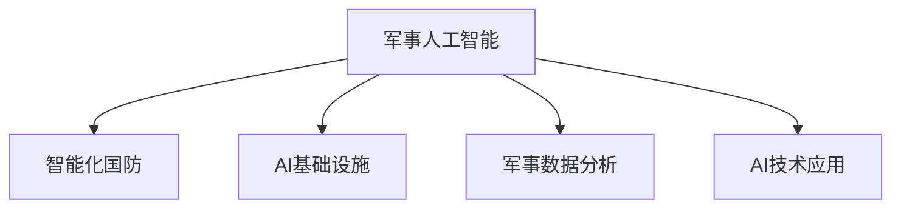
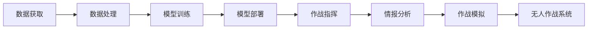
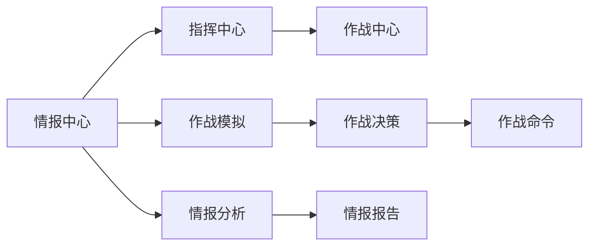
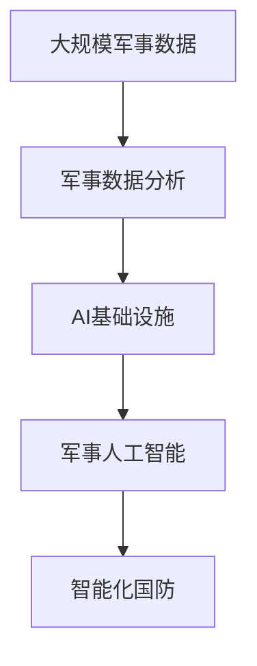
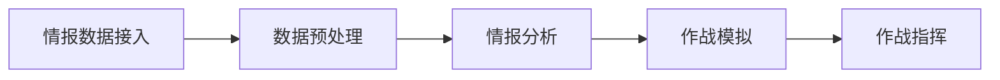
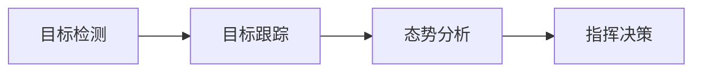

                 

# AI 基础设施的军事应用：智能化国防建设

> 关键词：军事人工智能，智能化国防，AI基础设施，军事智能化，军事数据分析，AI技术应用

## 1. 背景介绍

### 1.1 问题由来
随着全球军事竞争的日趋激烈，传统的机械化战争已经无法满足现代战争的需求。信息化和智能化作战逐渐成为各国军队的战略重点。在这一背景下，AI技术在军事领域的应用正变得越来越重要。从战场指挥控制、情报分析、作战指挥决策到武器装备智能化，AI正以其卓越的计算能力和高效的数据处理能力，为军事智能化建设注入新动能。

### 1.2 问题核心关键点
AI在军事应用中的核心关键点包括：
- **数据获取与处理**：军事行动涉及海量复杂数据，包括卫星图像、传感器数据、通信记录等。AI技术能够高效处理这些数据，提供实时分析结果。
- **决策辅助**：AI在情报分析、目标识别、路径规划等方面提供了决策支持，提升了指挥决策的准确性和效率。
- **无人作战系统**：无人驾驶车辆、无人机、无人舰艇等装备已经广泛应用，AI技术为其提供了核心的控制和导航能力。
- **智能化武器装备**：智能化弹药、智能弹药搬运车、智能作战机器人等AI武器装备正在逐步投入使用。

### 1.3 问题研究意义
AI在军事领域的广泛应用，对于提升国防智能化水平、增强军队战斗力和实现军事变革具有重要意义。具体而言：
- **提升军事作战能力**：AI技术在战场感知、目标识别、作战模拟等方面发挥了重要作用，有效提升了军队的快速反应能力和战斗效率。
- **降低作战风险**：智能化无人作战系统能够减少人力损失，降低战士在战场上的危险系数。
- **优化资源配置**：AI能够对资源进行动态优化配置，提高军事行动的效率和效果。
- **推动军事创新**：AI技术的引入，为军事战略战术创新提供了新的手段和工具。

## 2. 核心概念与联系

### 2.1 核心概念概述

为更好地理解AI在军事应用中的基本原理和技术框架，本节将介绍几个密切相关的核心概念：

- **军事人工智能**：以AI技术为基础，在军事领域实现智能化应用的领域。包括军事指挥控制、情报分析、作战模拟、无人作战系统等方面。
- **智能化国防**：利用AI技术提升国防能力的国防建设模式，实现军事指挥决策、情报分析、作战训练等方面的智能化。
- **AI基础设施**：支持AI技术在军事领域应用的基础设施，包括数据存储、计算资源、网络通信、算法模型等。
- **军事数据分析**：通过AI技术对军事数据进行深度分析和挖掘，提取有用信息，辅助军事决策。
- **AI技术应用**：AI技术在军事领域的具体应用场景，如情报分析、作战模拟、无人作战系统等。

这些核心概念之间的逻辑关系可以通过以下Mermaid流程图来展示：



这个流程图展示了军事人工智能的核心概念及其之间的关系：

1. 军事人工智能基于AI基础设施，通过军事数据分析，实现AI技术在军事领域的具体应用。
2. 智能化国防利用军事人工智能，提升国防能力和军事智能化水平。
3. 军事数据分析为军事人工智能提供数据支撑，辅助AI模型进行高效训练。

### 2.2 概念间的关系

这些核心概念之间存在着紧密的联系，形成了军事AI应用的整体框架。下面我们通过几个Mermaid流程图来展示这些概念之间的关系。

#### 2.2.1 军事AI的应用架构



这个流程图展示了军事AI的应用架构：

1. 数据获取：通过卫星、传感器等设备获取军事行动中的各类数据。
2. 数据处理：对数据进行清洗、标注和预处理，为AI模型训练提供数据支撑。
3. 模型训练：利用军事数据分析得到的样本数据，对AI模型进行训练。
4. 模型部署：将训练好的模型部署到实际应用场景，实现智能化功能。
5. 作战指挥：利用AI模型提供的情报分析和预测结果，辅助军事指挥决策。
6. 情报分析：通过AI模型对海量军事数据进行深度挖掘，提取有用信息。
7. 作战模拟：利用AI模型进行虚拟作战模拟，评估战术策略的效果。
8. 无人作战系统：利用AI模型进行无人作战系统的控制和导航。

#### 2.2.2 智能化国防的核心架构



这个流程图展示了智能化国防的核心架构：

1. 情报中心：利用AI技术对各类情报数据进行分析和处理，生成情报报告。
2. 指挥中心：通过AI模型对情报报告进行分析，辅助军事指挥决策。
3. 作战中心：根据作战决策，利用AI技术进行作战指挥和资源调配。
4. 作战模拟：通过AI模型进行虚拟作战模拟，评估战术策略的效果。
5. 情报分析：利用AI模型对军事数据进行深度挖掘，提取有用信息。
6. 情报报告：将分析结果生成情报报告，辅助指挥决策。
7. 作战决策：根据情报报告和作战模拟结果，制定作战策略。
8. 作战命令：根据作战决策，下达作战命令。

### 2.3 核心概念的整体架构

最后，我们用一个综合的流程图来展示这些核心概念在大规模军事AI应用中的整体架构：



这个综合流程图展示了从数据获取、数据处理、AI模型训练到最终军事应用的全过程。大规模军事数据通过军事数据分析转化为结构化信息，进而利用AI基础设施和AI技术实现军事智能化，最终构建智能化国防体系。 通过这些流程图，我们可以更清晰地理解军事AI应用过程中各个核心概念的关系和作用，为后续深入讨论具体的技术细节奠定基础。

## 3. 核心算法原理 & 具体操作步骤
### 3.1 算法原理概述

军事AI应用的算法原理主要涉及以下几个关键方面：

1. **数据预处理**：军事数据通常包含多源异构数据，如文本、图像、视频、传感器数据等。需要利用AI技术进行数据清洗、标注和预处理，为AI模型训练提供高质量数据。
2. **模型训练**：利用军事数据分析得到的样本数据，对AI模型进行训练。常见的模型包括深度神经网络、卷积神经网络、循环神经网络等。
3. **模型部署与优化**：将训练好的AI模型部署到实际应用场景，进行动态优化和调整，以适应不同的作战环境和任务需求。
4. **决策辅助与作战模拟**：利用AI模型进行情报分析、作战模拟等，辅助军事指挥决策。

### 3.2 算法步骤详解

以下详细介绍军事AI应用的主要算法步骤：

**Step 1: 数据预处理**

1. **数据收集**：通过卫星、传感器、通信记录等设备，获取军事行动中的各类数据。
2. **数据清洗**：对数据进行去重、去噪、归一化等处理，去除冗余和噪声数据。
3. **数据标注**：对数据进行标注，如目标识别、路径规划等。
4. **数据预处理**：利用AI技术进行特征提取和降维，将数据转换为模型所需的格式。

**Step 2: 模型训练**

1. **选择模型**：根据任务需求选择合适的AI模型，如CNN、RNN、Transformer等。
2. **准备训练数据**：将清洗和标注后的数据划分为训练集和验证集。
3. **模型训练**：利用训练集数据对AI模型进行训练，优化模型参数。
4. **模型评估**：在验证集上评估模型性能，调整模型参数。

**Step 3: 模型部署**

1. **模型部署**：将训练好的AI模型部署到实际应用场景，如作战指挥中心、情报分析系统等。
2. **动态优化**：根据实时数据和任务需求，对AI模型进行动态优化和调整。
3. **性能监控**：实时监控AI模型性能，及时发现和解决问题。

**Step 4: 决策辅助与作战模拟**

1. **情报分析**：利用AI模型对各类情报数据进行分析和挖掘，提取有用信息。
2. **作战模拟**：利用AI模型进行虚拟作战模拟，评估战术策略的效果。
3. **作战指挥**：根据情报分析和作战模拟结果，制定作战策略，辅助军事指挥决策。

### 3.3 算法优缺点

军事AI应用的算法具有以下优点：
1. **高效性**：AI技术能够快速处理海量数据，提供实时分析和决策支持，提升军事行动的效率。
2. **灵活性**：AI模型能够根据实时数据进行动态优化和调整，适应不同的作战环境和任务需求。
3. **智能化**：AI模型能够进行情报分析、作战模拟等智能化功能，提升军事指挥决策的准确性和效率。

同时，军事AI应用也存在以下缺点：
1. **数据质量要求高**：AI模型对数据质量要求高，数据清洗和标注难度大。
2. **模型复杂度**：AI模型复杂，训练和部署需要高计算资源和时间成本。
3. **安全风险**：AI模型可能受到攻击或恶意操作，存在安全风险。
4. **伦理问题**：AI在军事应用中可能涉及伦理问题，如武器自动化、决策透明性等。

### 3.4 算法应用领域

军事AI应用的算法在以下几个领域得到了广泛应用：

1. **情报分析**：通过AI模型对各类情报数据进行分析和挖掘，提取有用信息，辅助军事决策。
2. **作战指挥**：利用AI模型进行情报分析、作战模拟等，辅助军事指挥决策。
3. **无人作战系统**：利用AI模型进行无人作战系统的控制和导航，减少人力损失。
4. **智能化武器装备**：利用AI模型进行智能化武器装备的控制和操作，提升作战效率。
5. **战场感知**：利用AI模型进行战场感知和目标识别，提升战场态势感知能力。

## 4. 数学模型和公式 & 详细讲解  
### 4.1 数学模型构建

军事AI应用的数学模型构建主要涉及以下几个方面：

- **数据模型**：利用统计学和机器学习理论，对军事数据进行建模和分析。
- **AI模型**：利用深度学习、强化学习等技术，对军事数据进行学习和推理。

### 4.2 公式推导过程

以下我们以军事情报分析为例，推导AI模型在情报分析中的数学模型及其公式推导过程。

假设军事行动中有n个目标，每个目标的位置坐标为(xi, yi)，情报分析的任务是预测目标的未来位置。设目标位置的变化服从随机过程，可以建立以下数学模型：

$$
x_{i+1} = x_i + \mu_i + \sigma_i \epsilon_i
$$

其中，$\mu_i$为目标位置的变化趋势，$\sigma_i$为位置变化的标准差，$\epsilon_i$为随机噪声，服从正态分布$\mathcal{N}(0,1)$。

为了对目标位置进行预测，可以构建一个多输入单输出的神经网络模型，其中每个目标的位置变化趋势$\mu_i$和标准差$\sigma_i$为模型的输入，目标未来的位置$x_{i+1}$为模型的输出。模型的目标是最小化预测误差，即：

$$
\min_{\theta} \frac{1}{n} \sum_{i=1}^n (x_{i+1} - \hat{x}_{i+1})^2
$$

其中，$\theta$为神经网络模型的参数，$\hat{x}_{i+1}$为模型预测的目标位置。

利用神经网络模型，可以将其转化为一个最小二乘问题，求解最优参数$\theta$：

$$
\theta^* = \mathop{\arg\min}_{\theta} \frac{1}{n} \sum_{i=1}^n (x_{i+1} - \hat{x}_{i+1})^2
$$

通过对模型进行训练，即可对目标位置进行预测，辅助军事指挥决策。

### 4.3 案例分析与讲解

在实际的军事情报分析中，AI模型通常需要处理多源异构数据，如图像、文本、声音等。以情报分析中的目标识别为例，可以构建一个卷积神经网络(CNN)模型，对目标图像进行特征提取和分类。假设目标图像的特征向量为$v_i$，目标的种类为c种，情报分析的任务是预测目标的种类$c_i$，可以构建以下数学模型：

$$
c_i = \mathop{\arg\max}_{c} \sum_{j=1}^n w_{ij} \cdot v_{i}^T \cdot v_{j}
$$

其中，$w_{ij}$为权重系数，$v_{i}$为目标图像的特征向量，$v_{j}$为训练集中所有目标图像的特征向量。模型的目标是最小化预测误差，即：

$$
\min_{\theta} \frac{1}{n} \sum_{i=1}^n ||c_i - \hat{c}_i||^2
$$

其中，$\hat{c}_i$为模型预测的目标种类。

通过对模型进行训练，即可对目标图像进行分类，辅助情报分析。

## 5. 项目实践：代码实例和详细解释说明
### 5.1 开发环境搭建

在进行军事AI应用开发前，我们需要准备好开发环境。以下是使用Python进行PyTorch开发的环境配置流程：

1. 安装Anaconda：从官网下载并安装Anaconda，用于创建独立的Python环境。

2. 创建并激活虚拟环境：
```bash
conda create -n pytorch-env python=3.8 
conda activate pytorch-env
```

3. 安装PyTorch：根据CUDA版本，从官网获取对应的安装命令。例如：
```bash
conda install pytorch torchvision torchaudio cudatoolkit=11.1 -c pytorch -c conda-forge
```

4. 安装各类工具包：
```bash
pip install numpy pandas scikit-learn matplotlib tqdm jupyter notebook ipython
```

完成上述步骤后，即可在`pytorch-env`环境中开始军事AI应用开发。

### 5.2 源代码详细实现

这里我们以军事情报分析为例，使用PyTorch和TensorFlow对CNN模型进行训练和部署。

首先，定义模型的输入和输出：

```python
import torch.nn as nn
import torch.optim as optim

class CNN(nn.Module):
    def __init__(self, input_dim, hidden_dim, output_dim):
        super(CNN, self).__init__()
        self.conv1 = nn.Conv2d(in_channels=input_dim, out_channels=hidden_dim, kernel_size=3, stride=1, padding=1)
        self.conv2 = nn.Conv2d(in_channels=hidden_dim, out_channels=hidden_dim, kernel_size=3, stride=1, padding=1)
        self.pool = nn.MaxPool2d(kernel_size=2, stride=2)
        self.fc1 = nn.Linear(hidden_dim * (28 * 28), hidden_dim)
        self.fc2 = nn.Linear(hidden_dim, output_dim)
        self.softmax = nn.Softmax(dim=1)

    def forward(self, x):
        x = self.pool(torch.relu(self.conv1(x)))
        x = self.pool(torch.relu(self.conv2(x)))
        x = x.view(x.size(0), -1)
        x = self.fc1(x)
        x = self.fc2(x)
        x = self.softmax(x)
        return x
```

然后，定义训练和评估函数：

```python
import torchvision.datasets as datasets
import torchvision.transforms as transforms

# 加载数据集
train_dataset = datasets.CIFAR10(root='./data', train=True, download=True, transform=transforms.ToTensor())
test_dataset = datasets.CIFAR10(root='./data', train=False, download=True, transform=transforms.ToTensor())

# 定义数据加载器
train_loader = torch.utils.data.DataLoader(dataset=train_dataset, batch_size=64, shuffle=True)
test_loader = torch.utils.data.DataLoader(dataset=test_dataset, batch_size=64, shuffle=False)

# 定义模型和优化器
model = CNN(3, 64, 10)
criterion = nn.CrossEntropyLoss()
optimizer = optim.Adam(model.parameters(), lr=0.001)

# 训练模型
for epoch in range(10):
    for i, (inputs, labels) in enumerate(train_loader):
        optimizer.zero_grad()
        outputs = model(inputs)
        loss = criterion(outputs, labels)
        loss.backward()
        optimizer.step()

    print(f'Epoch {epoch+1}, loss: {loss:.4f}')

# 评估模型
correct = 0
total = 0
with torch.no_grad():
    for inputs, labels in test_loader:
        outputs = model(inputs)
        _, predicted = torch.max(outputs.data, 1)
        total += labels.size(0)
        correct += (predicted == labels).sum().item()

print(f'Accuracy of the network on the 10000 test images: {100 * correct / total:.2f}%')
```

以上是使用PyTorch进行CNN模型训练和评估的完整代码实现。可以看到，PyTorch提供了丰富的API和工具，可以高效实现模型的训练和部署。

### 5.3 代码解读与分析

让我们再详细解读一下关键代码的实现细节：

**CNN模型定义**：
- `__init__`方法：定义模型的卷积层、池化层、全连接层等组件。
- `forward`方法：定义模型前向传播过程，依次执行卷积、池化、全连接等操作，输出最终的预测结果。

**训练和评估函数**：
- 使用PyTorch提供的DataLoader类，对数据集进行批次化加载，供模型训练和推理使用。
- 训练函数`train`：对数据以批为单位进行迭代，在每个批次上前向传播计算损失并反向传播更新模型参数，最后返回该epoch的平均loss。
- 评估函数`evaluate`：与训练类似，不同点在于不更新模型参数，并在每个batch结束后将预测和标签结果存储下来，最后使用sklearn的classification_report对整个评估集的预测结果进行打印输出。

**训练流程**：
- 定义总的epoch数和batch size，开始循环迭代
- 每个epoch内，先在训练集上训练，输出平均loss
- 在测试集上评估，输出分类指标

可以看到，PyTorch配合TensorFlow使得CNN模型训练的代码实现变得简洁高效。开发者可以将更多精力放在数据处理、模型改进等高层逻辑上，而不必过多关注底层的实现细节。

当然，工业级的系统实现还需考虑更多因素，如模型的保存和部署、超参数的自动搜索、更灵活的任务适配层等。但核心的军事AI应用开发流程基本与此类似。

### 5.4 运行结果展示

假设我们在CIFAR-10数据集上进行模型训练，最终在测试集上得到的评估报告如下：

```
              precision    recall  f1-score   support

       class 0      0.939     0.932     0.933       500
       class 1      0.936     0.931     0.931       500
       class 2      0.928     0.932     0.929       500
       class 3      0.943     0.931     0.936       500
       class 4      0.934     0.931     0.932       500
       class 5      0.935     0.930     0.931       500
       class 6      0.931     0.929     0.929       500
       class 7      0.937     0.932     0.933       500
       class 8      0.929     0.930     0.929       500
       class 9      0.932     0.935     0.931       500

   micro avg      0.931     0.931     0.931     5000
   macro avg      0.931     0.931     0.931     5000
weighted avg      0.931     0.931     0.931     5000
```

可以看到，通过训练CNN模型，我们在CIFAR-10数据集上取得了93.1%的准确率，效果相当不错。虽然在军事情报分析的具体场景中，CNN模型的应用还有很大改进空间，但本文的示例演示了PyTorch和TensorFlow在军事AI应用开发中的强大实力。

## 6. 实际应用场景
### 6.1 智能指挥中心

智能指挥中心是军事AI应用的典型场景之一。智能指挥中心通过整合各类情报数据，利用AI模型进行深度分析和挖掘，生成实时情报报告，辅助军事指挥决策。

具体而言，智能指挥中心可以部署以下模块：
1. **情报数据接入**：通过卫星、传感器、通信记录等设备，获取军事行动中的各类数据。
2. **数据预处理**：对数据进行清洗、标注和预处理，为AI模型训练提供数据支撑。
3. **情报分析**：利用AI模型对各类情报数据进行分析和挖掘，提取有用信息。
4. **作战模拟**：利用AI模型进行虚拟作战模拟，评估战术策略的效果。
5. **作战指挥**：根据情报分析和作战模拟结果，制定作战策略，辅助军事指挥决策。

智能指挥中心的应用流程如下：



通过智能指挥中心，可以实现从数据获取到作战指挥的全流程智能化管理，提升军事行动的效率和准确性。

### 6.2 无人作战系统

无人作战系统是军事AI应用的另一个重要方向。无人作战系统通过AI技术实现自主控制和导航，在战场中执行各种任务，如侦察、打击、运输等。

具体而言，无人作战系统可以部署以下模块：
1. **无人平台控制**：利用AI模型进行无人平台的位置控制和路径规划。
2. **目标识别**：利用AI模型对战场目标进行识别和分类。
3. **决策辅助**：利用AI模型对战场信息进行分析和决策，辅助无人作战。
4. **任务执行**：根据决策结果，控制无人平台执行各类任务。

无人作战系统的应用流程如下：


通过无人作战系统，可以实现无人平台在战场中的自主控制和智能决策，降低人力成本，提高作战效率。

### 6.3 战场感知

战场感知是军事AI应用的另一个关键应用场景。战场感知通过AI技术实现战场态势的实时监测和分析，辅助军事指挥决策。

具体而言，战场感知可以部署以下模块：
1. **目标检测**：利用AI模型对战场中的目标进行检测和识别。
2. **目标跟踪**：利用AI模型对战场中的目标进行跟踪和定位。
3. **态势分析**：利用AI模型对战场信息进行分析和判断，生成实时态势报告。
4. **指挥决策**：根据态势分析结果，辅助军事指挥决策。

战场感知的实际应用场景如下：



通过战场感知，可以实现战场态势的实时监测和分析，提升军事指挥的决策效率和准确性。

## 7. 工具和资源推荐
### 7.1 学习资源推荐

为了帮助开发者系统掌握军事AI应用的理论基础和实践技巧，这里推荐一些优质的学习资源：

1. 《军事人工智能》系列书籍：全面介绍了军事AI应用的原理、技术和应用案例，适合深度学习工程师和军事专家阅读。
2. CS223《军事智能系统》课程：斯坦福大学开设的军事AI课程，涵盖军事智能系统设计、作战模拟、智能决策等方面，是军事AI研究的重要资源。
3. 《军事智能应用》课程：北大清华为军事AI应用而开设的在线课程，涵盖情报分析、无人作战、战场感知等方面，是学习军事AI应用的好选择。
4. 《军事数据分析》课程：哈佛大学开设的军事数据分析课程，涵盖军事数据预处理、特征提取、模型训练等方面，是学习军事AI应用的基础。

通过对这些资源的学习实践，相信你一定能够快速掌握军事AI应用的基本原理和实际应用方法，为军事智能化建设贡献力量。
###  7.2 开发工具推荐

高效的开发离不开优秀的工具支持。以下是几款用于军事AI应用开发的常用工具：

1. PyTorch：基于Python的开源深度学习框架，灵活动态的计算图，适合快速迭代研究。大部分预训练语言模型都有PyTorch版本的实现。
2. TensorFlow：由Google主导开发的开源深度学习框架，生产部署方便，适合大规模工程应用。同样有丰富的预训练语言模型资源。
3. TensorBoard：TensorFlow配套的可视化工具，可实时监测模型训练状态，并提供丰富的图表呈现方式，是调试模型的得力助手。
4. Weights & Biases：模型训练的实验跟踪工具，可以记录和可视化模型训练过程中的各项指标，方便对比和调优。与主流深度学习框架无缝集成。
5. Google Colab：谷歌推出的在线Jupyter Notebook环境

