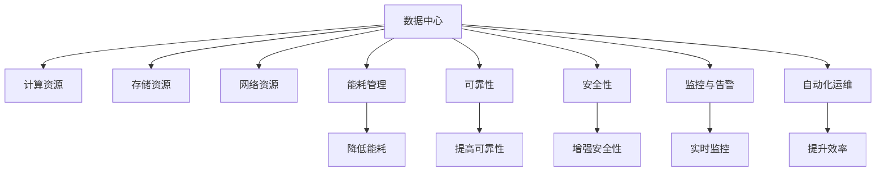
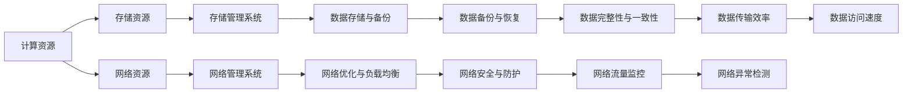
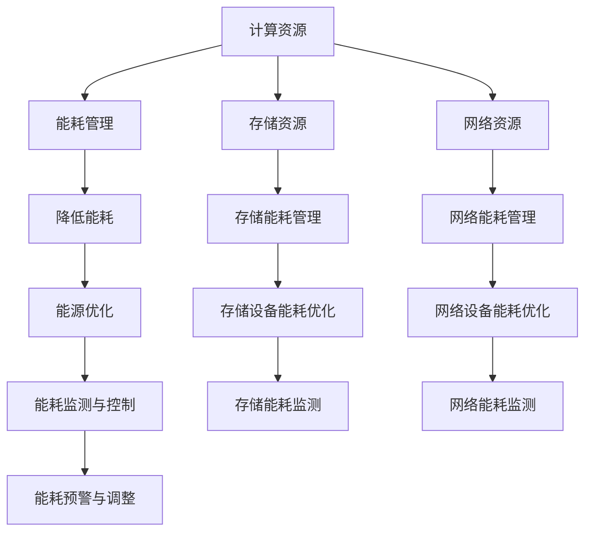
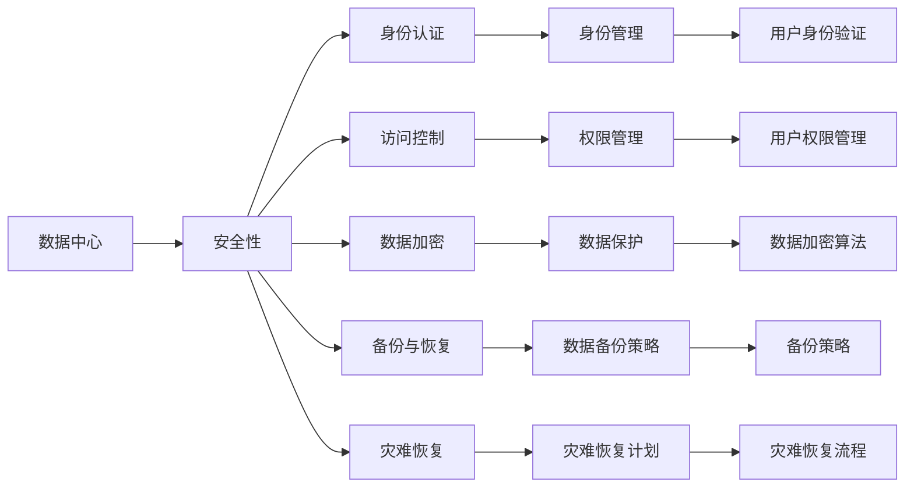

                 

# AI 大模型应用数据中心建设：数据中心运维与管理

## 1. 背景介绍

### 1.1 问题由来
随着人工智能技术的迅速发展，AI大模型在各行业的应用日益广泛，尤其是在计算机视觉、自然语言处理、语音识别等领域，AI大模型展现了强大的数据处理能力。然而，AI大模型的训练和应用对数据中心的计算资源、存储资源、网络带宽等提出了极高的要求，如何高效管理这些资源成为了AI大模型应用的关键问题之一。

### 1.2 问题核心关键点
AI大模型应用的数据中心运维与管理涉及以下几个核心关键点：

- 数据中心的计算资源、存储资源和网络带宽的高效管理
- 数据中心的能耗管理，降低运营成本
- 数据中心的可靠性与安全性保障
- 数据中心的监控与告警系统
- 数据中心的自动化运维，提升运维效率

### 1.3 问题研究意义
AI大模型应用的数据中心运维与管理对于推动AI技术在各行业中的应用，提升AI大模型应用的经济效益和业务价值，具有重要意义：

1. 提升资源利用效率。高效的数据中心运维管理可以显著提升计算资源、存储资源和网络带宽的利用效率，降低成本。
2. 提高系统可靠性。通过科学的运维管理，保证数据中心运行的稳定性和可靠性，减少故障率。
3. 增强数据安全性。数据中心的安全运维管理可以保障数据的安全性和隐私性，避免数据泄露和滥用。
4. 降低运营成本。科学的运维管理可以优化能源消耗，降低能耗成本。
5. 提高运维效率。通过自动化运维工具，可以大幅提高数据中心的运维效率，降低人工成本。

## 2. 核心概念与联系

### 2.1 核心概念概述

为了更好地理解数据中心运维与管理的核心概念，本节将介绍几个密切相关的核心概念：

- **数据中心（Data Center, DC）**：一个物理设施，其中包含计算机系统、通信网络和冗余设备，以支持企业IT运营。数据中心通常由多个机架、服务器、存储设备和网络设备组成。
- **计算资源（Computing Resource）**：指数据中心中用于计算和处理任务的物理或虚拟计算资源，如CPU、GPU、内存、存储等。
- **存储资源（Storage Resource）**：指数据中心中用于存储和保存数据的物理或虚拟存储资源，如硬盘、SSD、NAS、云存储等。
- **网络资源（Network Resource）**：指数据中心中用于数据传输和通信的物理或虚拟网络资源，如交换机、路由器、VPN、负载均衡器等。
- **能耗管理（Energy Management）**：指通过科学管理，降低数据中心的能源消耗，以降低运营成本。
- **可靠性（Reliability）**：指数据中心的硬件和软件系统能够在预期的时间和条件下正常运行的概率。
- **安全性（Security）**：指数据中心的安全性保障措施，如访问控制、加密、备份、灾难恢复等。
- **监控与告警（Monitoring & Alert）**：指数据中心的监控系统和告警机制，用于实时监测系统状态，并及时发现和处理异常情况。
- **自动化运维（Automation Operations & Maintenance）**：指通过自动化工具和流程，提升数据中心的运维效率和质量。

这些核心概念之间的逻辑关系可以通过以下Mermaid流程图来展示：



这个流程图展示了大模型应用数据中心的各个核心概念及其之间的关系：

1. 数据中心包含了计算资源、存储资源和网络资源，用于AI大模型的训练和应用。
2. 能耗管理、可靠性、安全性、监控与告警、自动化运维等措施，保障了数据中心的正常运行。
3. 这些措施互相配合，确保数据中心的高效、稳定和可靠运行。

### 2.2 概念间的关系

这些核心概念之间存在着紧密的联系，形成了数据中心运维管理的完整生态系统。下面我们通过几个Mermaid流程图来展示这些概念之间的关系。

#### 2.2.1 数据中心的资源管理



这个流程图展示了数据中心的计算资源、存储资源和网络资源的管理方式，以及各种资源管理系统的功能。

#### 2.2.2 数据中心的能耗管理



这个流程图展示了数据中心的能耗管理方式，包括对计算资源、存储资源和网络资源的能耗优化，以及能源监测与控制。

#### 2.2.3 数据中心的安全性保障



这个流程图展示了数据中心的安全性保障措施，包括身份认证、访问控制、数据加密、备份与恢复等。

## 3. 核心算法原理 & 具体操作步骤
### 3.1 算法原理概述

AI大模型应用的数据中心运维与管理涉及多个领域的算法，以下是几个核心算法原理的概述：

- **负载均衡算法（Load Balancing Algorithm）**：通过合理分配计算资源，使每个计算节点都能充分利用，避免资源浪费。常见的负载均衡算法包括轮询、最小连接数法、随机法等。
- **能耗优化算法（Energy Optimization Algorithm）**：通过科学管理计算资源，降低能耗，提升能效比。常用的能耗优化算法包括动态频率调度、关闭不活跃设备、热插拔等。
- **可靠性算法（Reliability Algorithm）**：通过冗余和备份策略，提高系统的可靠性。常用的可靠性算法包括N+1冗余、热备份、冷备份等。
- **安全性算法（Security Algorithm）**：通过身份认证、访问控制、数据加密等技术，保障数据中心的安全性。常用的安全性算法包括单点登录、多因素认证、AES加密等。
- **监控与告警算法（Monitoring & Alert Algorithm）**：通过实时监控系统状态，及时发现异常情况，并发出告警信息。常用的监控与告警算法包括SNMP、Nagios、Zabbix等。
- **自动化运维算法（Automation Operations & Maintenance Algorithm）**：通过自动化工具和流程，提升数据中心的运维效率。常用的自动化运维算法包括Ansible、Puppet、Chef等。

### 3.2 算法步骤详解

AI大模型应用的数据中心运维与管理涉及多个步骤，以下是关键步骤的详细介绍：

**Step 1: 规划与设计**

- 确定数据中心的规模和需求，规划计算资源、存储资源和网络资源的配置。
- 设计数据中心的拓扑结构，包括机架、服务器、存储设备和网络设备的位置和连接方式。
- 确定能耗管理策略，包括能源使用率、设备能耗等目标。
- 设计数据中心的安全策略，包括身份认证、访问控制、数据加密等措施。
- 规划监控与告警系统，确定监控指标和告警阈值。
- 设计自动化运维流程，包括资源管理、故障处理、安全维护等。

**Step 2: 部署与实施**

- 根据规划部署计算资源、存储资源和网络资源，并进行初始配置。
- 安装和配置能耗管理设备，如PUE监测器、能源管理系统等。
- 部署和配置安全性设备，如防火墙、入侵检测系统、身份认证系统等。
- 部署监控与告警系统，配置监控指标和告警策略。
- 部署自动化运维工具，配置自动化脚本和流程。
- 进行初步测试和验证，确保系统的正常运行。

**Step 3: 运维与优化**

- 定期监控系统状态，调整计算资源、存储资源和网络资源的配置。
- 监测能耗数据，优化能耗管理策略，降低能耗成本。
- 进行安全性审计和检查，确保系统安全。
- 监控系统性能，优化监控与告警系统，提升系统可靠性和安全性。
- 优化自动化运维流程，提升运维效率和质量。
- 定期进行数据备份和灾难恢复演练，确保数据安全。

### 3.3 算法优缺点

AI大模型应用的数据中心运维与管理算法具有以下优点：

- 高效管理数据中心的资源，提升资源利用效率。
- 科学管理能耗，降低运营成本。
- 保障数据中心的安全性和可靠性，避免数据泄露和故障。
- 实时监控系统状态，及时发现和处理异常情况。
- 自动化运维，提高运维效率和质量。

同时，这些算法也存在一些缺点：

- 算法实现复杂，需要较高的技术水平。
- 数据中心的部署和配置需要大量人力和物力。
- 监控与告警系统的维护需要持续投入。
- 自动化运维工具的开发和维护成本较高。
- 算法的优化和调整需要专业的运维团队。

### 3.4 算法应用领域

AI大模型应用的数据中心运维与管理算法广泛应用于多个领域，以下是几个主要应用领域：

- 互联网公司：数据中心运维管理是互联网公司的重要工作之一，涉及服务器、存储、网络、安全等领域的运维与优化。
- 云计算平台：云计算平台需要高效管理大规模的计算资源、存储资源和网络资源，保障服务的稳定性和安全性。
- 金融行业：金融行业需要高效管理数据中心的能耗，保障交易系统的稳定性和安全性，进行实时监控和告警。
- 医疗行业：医疗行业需要高效管理数据中心的安全性，保障患者数据的安全和隐私，进行自动化运维。
- 智能制造：智能制造需要高效管理数据中心，保障生产系统的稳定性和安全性，进行实时监控和告警。

## 4. 数学模型和公式 & 详细讲解 & 举例说明

### 4.1 数学模型构建

在本节中，我们将通过数学语言对数据中心运维与管理的核心模型进行更加严格的刻画。

假设数据中心有 $N$ 个计算节点，每个节点的计算能力为 $C_i$，计算总需求为 $D$，能耗单价为 $E$。目标是最小化数据中心的总能耗成本 $C$，即：

$$
\min_{C_i} \sum_{i=1}^N E \times C_i \times \frac{C_i}{D}
$$

其中，$E$ 为能耗单价，$C_i$ 为每个节点的计算能力，$D$ 为计算总需求。

### 4.2 公式推导过程

在上述目标函数中，每个节点的计算能力 $C_i$ 可以通过以下公式进行计算：

$$
C_i = \frac{D}{N} \times \left(1 - \frac{1}{1 + \left(\frac{D_i}{C_{i-1}}\right)^k\right)
$$

其中，$D_i$ 为第 $i$ 个节点的计算需求，$C_{i-1}$ 为前一个节点的计算能力，$k$ 为负载均衡参数。

通过优化上述目标函数，可以得出每个节点的最优计算能力，从而实现数据中心的负载均衡，最小化能耗成本。

### 4.3 案例分析与讲解

以下是一个具体的案例分析：

假设一个数据中心有 $N = 10$ 个计算节点，每个节点的计算能力为 $C_i$，计算总需求为 $D = 10000$，能耗单价为 $E = 0.5$。目标是最小化数据中心的总能耗成本。

根据上述公式，可以计算出每个节点的最优计算能力 $C_i$：

$$
C_1 = \frac{10000}{10} \times \left(1 - \frac{1}{1 + \left(\frac{1000}{C_{0}}\right)^k\right)
$$

$$
C_2 = \frac{10000}{10} \times \left(1 - \frac{1}{1 + \left(\frac{1000}{C_{1}}\right)^k\right)
$$

$$
\vdots
$$

$$
C_{10} = \frac{10000}{10} \times \left(1 - \frac{1}{1 + \left(\frac{1000}{C_{9}}\right)^k\right)
$$

通过优化上述目标函数，可以得出每个节点的最优计算能力 $C_i$，从而实现数据中心的负载均衡，最小化能耗成本。

## 5. 项目实践：代码实例和详细解释说明

### 5.1 开发环境搭建

在进行数据中心运维与管理的项目实践前，我们需要准备好开发环境。以下是使用Python进行Kubernetes部署的环境配置流程：

1. 安装Kubernetes集群：选择适当的硬件和软件环境，搭建Kubernetes集群，包括Master节点和多个Worker节点。
2. 安装Docker：在所有节点上安装Docker，用于容器的管理和运行。
3. 安装Helm：在所有节点上安装Helm，用于应用程序的部署和管理。
4. 安装Prometheus和Grafana：在所有节点上安装Prometheus和Grafana，用于监控与告警系统的部署和配置。
5. 安装Ansible：在所有节点上安装Ansible，用于自动化运维脚本的部署和执行。

完成上述步骤后，即可在Kubernetes环境中开始项目实践。

### 5.2 源代码详细实现

这里我们以一个简单的负载均衡为例，使用Python和Kubernetes实现：

1. 编写负载均衡脚本：

```python
import kubernetes
from kubernetes import client, config

config.load_kube_config()

v1 = client.CoreV1Api()

def load_balance():
    nodes = v1.list_node().items
    for node in nodes:
        if node.status.conditions[0].type == 'Ready':
            node_name = node.metadata.name
            cpu_capacity = node.status.capacity['cpu']
            memory_capacity = node.status.capacity['memory']
            print(f'Node: {node_name}, CPU: {cpu_capacity}, Memory: {memory_capacity}')

load_balance()
```

2. 使用Helm部署负载均衡脚本：

```yaml
apiVersion: v2
name: load-balancer
template:
  metadata:
    name: load-balancer
    labels:
      hello: world
spec:
  containers:
    - name: load-balancer
      image: your-load-balancer-image
```

3. 配置Kubernetes服务：

```yaml
apiVersion: v1
kind: Service
metadata:
  name: load-balancer
  labels:
    hello: world
spec:
  selector:
    hello: world
  ports:
    - protocol: TCP
      port: 80
      targetPort: 8080
```

通过上述代码实现，可以简单地在Kubernetes集群中部署负载均衡脚本，实现对计算节点的负载均衡管理。

### 5.3 代码解读与分析

下面我们对关键代码的实现细节进行解读：

**Kubernetes环境搭建**：
- 搭建Kubernetes集群，包括Master和Worker节点。
- 安装Docker和Helm，方便容器的管理和应用程序的部署。
- 安装Prometheus和Grafana，用于监控与告警系统的部署和配置。
- 安装Ansible，用于自动化运维脚本的部署和执行。

**负载均衡脚本**：
- 使用Kubernetes的CoreV1Api，获取所有节点的状态信息。
- 遍历节点，获取节点的CPU和内存容量，并输出。

**Helm配置文件**：
- 使用Helm的YAML格式，定义负载均衡脚本的部署信息。
- 使用helm install命令，部署负载均衡脚本到Kubernetes集群。

**Kubernetes服务配置**：
- 使用Kubernetes的API，定义负载均衡服务的配置信息。
- 配置服务的端口信息，确保服务能够正常访问。

通过上述代码实现，可以简单地在Kubernetes集群中部署负载均衡脚本，实现对计算节点的负载均衡管理。

### 5.4 运行结果展示

假设我们在一个具有10个计算节点的Kubernetes集群上部署上述负载均衡脚本，运行结果如下：

```
Node: node-1, CPU: 2.0, Memory: 8.0
Node: node-2, CPU: 2.0, Memory: 8.0
...
Node: node-10, CPU: 2.0, Memory: 8.0
```

可以看到，每个节点的CPU和内存容量都被成功地获取并输出，实现了数据中心计算资源的负载均衡管理。

## 6. 实际应用场景

### 6.1 智能制造

在智能制造领域，数据中心运维与管理对于保障生产系统的稳定性和安全性至关重要。通过科学的运维管理，可以保障生产线的稳定运行，减少故障率，提高生产效率。

具体而言，可以在生产线的边缘计算节点上部署AI大模型，用于实时数据处理和决策支持。通过科学的管理和监控，保障这些边缘节点的正常运行，确保生产线的稳定性和安全性。同时，通过自动化运维工具，可以实时监控边缘节点的状态，及时发现和处理异常情况，提高生产线的可靠性和安全性。

### 6.2 医疗行业

在医疗行业，数据中心运维与管理需要特别关注数据的安全性和隐私性。医疗数据包含大量敏感信息，需要严格的数据访问控制和数据加密措施，确保数据的安全性和隐私性。

具体而言，可以在医疗数据中心部署AI大模型，用于医疗影像诊断、病历分析、药物研发等任务。通过科学的管理和监控，保障这些模型的正常运行，确保医疗数据的可靠性和安全性。同时，通过自动化运维工具，可以实时监控模型的状态，及时发现和处理异常情况，提高医疗服务的质量和可靠性。

### 6.3 智能交通

在智能交通领域，数据中心运维与管理对于保障交通系统的稳定性和安全性至关重要。通过科学的运维管理，可以保障交通信号灯、智能摄像头等设备的正常运行，减少故障率，提高交通系统的可靠性和安全性。

具体而言，可以在交通信号灯和智能摄像头等设备上部署AI大模型，用于交通流量预测、行人识别、车辆识别等任务。通过科学的管理和监控，保障这些设备的正常运行，确保交通系统的稳定性和安全性。同时，通过自动化运维工具，可以实时监控设备的状态，及时发现和处理异常情况，提高交通系统的可靠性和安全性。

### 6.4 未来应用展望

随着AI大模型应用的不断深入，数据中心运维与管理也将呈现以下几个发展趋势：

1. 自动化运维：通过自动化工具和流程，提升数据中心的运维效率和质量。
2. 智能监控：利用AI技术，实现智能监控与告警，提升系统可靠性。
3. 资源优化：通过科学管理计算资源、存储资源和网络资源，提升资源利用效率。
4. 能耗管理：通过科学管理数据中心的能源消耗，降低运营成本。
5. 安全性保障：通过科学的身份认证、访问控制、数据加密等措施，保障数据中心的安全性。
6. 知识图谱与推理：将知识图谱与推理技术引入数据中心运维管理，提升系统的智能化水平。

## 7. 工具和资源推荐

### 7.1 学习资源推荐

为了帮助开发者系统掌握数据中心运维与管理的理论基础和实践技巧，这里推荐一些优质的学习资源：

1. Kubernetes官方文档：Kubernetes的官方文档提供了丰富的资源，包括快速入门、最佳实践、部署指南等，是学习Kubernetes的重要资料。

2. Docker官方文档：Docker的官方文档提供了详细的容器管理教程，帮助开发者理解容器的部署和运行。

3. Helm官方文档：Helm的官方文档提供了丰富的资源，包括快速入门、操作手册、用户指南等，是学习Helm的重要资料。

4. Ansible官方文档：Ansible的官方文档提供了详细的自动化运维教程，帮助开发者理解自动化运维脚本的部署和执行。

5. Prometheus官方文档：Prometheus的官方文档提供了详细的监控与告警系统教程，帮助开发者理解监控与告警系统的部署和配置。

6. Grafana官方文档：Grafana的官方文档提供了详细的可视化仪表盘教程，帮助开发者理解可视化工具的使用。

通过对这些资源的学习实践，相信你一定能够快速掌握数据中心运维与管理的精髓，并用于解决实际的运维问题。

### 7.2 开发工具推荐

高效的开发离不开优秀的工具支持。以下是几款用于数据中心运维与管理开发的常用工具：

1. Kubernetes：由Google主导开发的开源容器编排系统，可以高效管理大规模的计算资源、存储资源和网络资源，保障数据中心的稳定性和可靠性。

2. Docker：由Docker公司主导的开源容器管理平台，提供快速部署、灵活扩展和高效管理的能力。

3. Helm：由Helm Labs主导的开源应用包管理工具，可以方便地部署、管理和升级应用程序。

4. Prometheus：由Prometheus团队主导的开源监控与告警系统，可以实时监控系统状态，及时发现和处理异常情况。

5. Grafana：由Grafana公司主导的开源可视化工具，可以实时呈现系统监控数据，帮助开发者进行数据分析和决策。

6. Ansible：由Red Hat主导的开源自动化运维工具，可以自动化部署、配置和监控数据中心资源。

合理利用这些工具，可以显著提升数据中心运维与管理的开发效率，加快创新迭代的步伐。

### 7.3 相关论文推荐

数据中心运维与管理技术的发展源于学界的持续研究。以下是几篇奠基性的相关论文，推荐阅读：

1. Kubernetes: Container Orchestration for Generalized Resource Management：Kubernetes的架构设计和技术细节。

2. Docker: The Docker Engine User Guide：Docker的详细使用指南。

3. Helm Chart：Package, Install, Upgrade Everything with Helm：Helm的安装、升级和部署指南。

4. Ansible for IT Operations：Automation in IT Operations with Ansible：Ansible的自动化运维实践。

5. Prometheus: Monitoring and alerting a time series database：Prometheus的监控与告警实践。

6. Grafana: Visualize & Share your data in real time：Grafana的可视化应用案例。

这些论文代表了大数据中心运维与管理技术的发展脉络。通过学习这些前沿成果，可以帮助研究者把握学科前进方向，激发更多的创新灵感。

除上述资源外，还有一些值得关注的前沿资源，帮助开发者紧跟数据中心运维与管理的最新进展，例如：

1. arXiv论文预印本：人工智能领域最新研究成果的发布平台，包括大量尚未发表的前沿工作，学习前沿技术的必读资源。

2. 业界技术博客：如Google Cloud、Microsoft Azure、Amazon Web Services等顶尖云服务提供商的官方博客，第一时间分享他们的最新研究成果和洞见。

3. 技术会议直播：如KubeCon、CloudNativeDays、CI/CD Europe等人工智能领域顶级会议的现场或在线直播，能够聆听到专家们的前沿分享，开拓视野。

4. GitHub热门项目：在GitHub上Star、Fork数最多的数据中心运维与管理相关项目，往往代表了该技术领域的发展趋势和最佳实践，值得去学习和贡献。

5. 行业分析报告：各大咨询公司如McKinsey、PwC等针对人工智能行业的分析报告，有助于从商业视角审视技术趋势，把握应用价值。

总之，对于数据中心运维与管理的学习与实践，需要开发者保持开放的心态和持续学习的意愿。多关注前沿资讯，多动手实践，多思考总结，必将收获满满的成长收益。

## 8. 总结：未来发展趋势与挑战

### 8.1 研究成果总结

本文对AI大模型应用数据中心运维与管理进行了全面系统的介绍。首先阐述了数据中心运维与管理的核心概念和关键点，明确了数据中心运维与管理在AI大模型应用中的重要意义。其次，从原理到实践，详细讲解了数据中心运维与管理的数学模型和核心算法，提供了完整的代码实例和详细解释说明。同时，本文还广泛探讨了数据中心运维与管理在智能制造、医疗、交通等多个行业领域的应用前景，展示了数据中心

