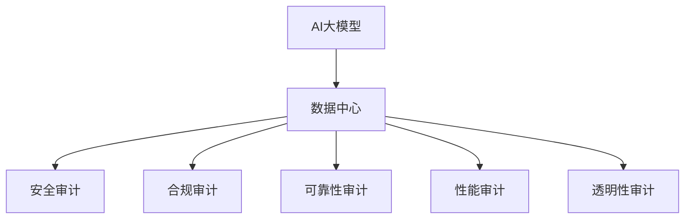
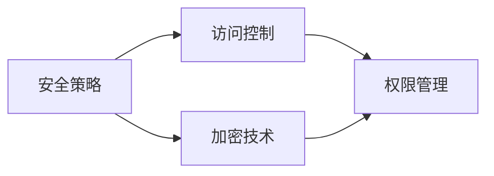
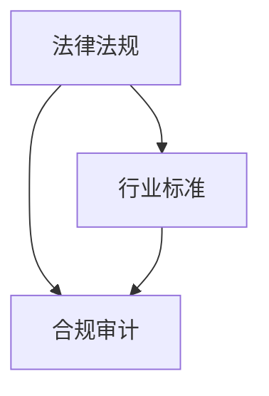
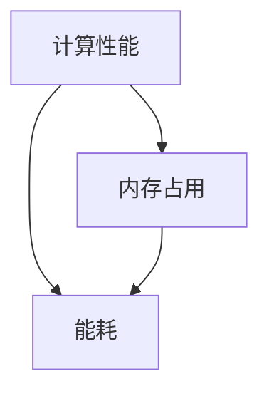
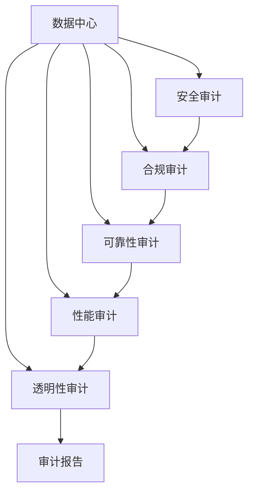

                 

# AI 大模型应用数据中心的审计管理

## 1. 背景介绍

### 1.1 问题由来

随着人工智能技术和大数据的应用普及，越来越多的企业开始采用AI大模型来提升业务决策、产品推荐、风险控制等领域的智能化水平。AI大模型作为企业信息化建设的高级形态，其运行环境——数据中心，在资源消耗、数据安全和合规性等方面面临越来越高的要求。

数据中心是AI大模型训练和推理的基础设施，存储着海量数据，承载着复杂算法。其安全性、合规性、可靠性等直接关系到企业的核心利益和业务稳定性。数据中心的审计管理，是对其运行状态、数据流动、风险防控等进行监控、评估和治理的关键手段。

### 1.2 问题核心关键点

AI大模型应用数据中心的审计管理，主要包括以下几个方面：

- **安全性审计**：检查数据中心的安全策略是否满足企业安全要求，防范数据泄露、未经授权访问等安全风险。
- **合规性审计**：确保数据中心的操作遵循法律法规和行业标准，保护用户数据隐私，防范违规操作。
- **可靠性审计**：评估数据中心的硬件设备、软件系统、网络通信等基础设施的稳定性和可用性，保证AI大模型的连续运行。
- **性能审计**：监测AI大模型的计算性能、内存占用、能耗等指标，确保资源的高效利用和系统的优化。
- **合规性审计**：跟踪AI大模型的算法训练过程和结果，验证其符合公平性、透明性和可解释性等要求。

### 1.3 问题研究意义

研究AI大模型应用数据中心的审计管理，对于保障企业信息系统的安全和合规，提升AI大模型的运行效率和应用效果，具有重要意义：

1. **保障安全性**：通过审计管理，及时发现并修复数据中心的安全漏洞，防范数据泄露和未经授权的访问，保护企业数据资产。
2. **确保合规性**：确保数据中心的操作符合法律法规和行业标准，避免因违规操作造成的法律风险。
3. **提高可靠性**：通过审计管理，对数据中心的硬件和软件进行定期检查和优化，提升系统的稳定性和可用性。
4. **优化性能**：通过性能监控和审计，发现AI大模型运行中的瓶颈和问题，及时进行优化调整，提升模型性能和资源利用效率。
5. **保证透明性**：对AI大模型的训练过程和结果进行审计，确保其透明、可解释、可追溯，提升用户对AI模型的信任度。

## 2. 核心概念与联系

### 2.1 核心概念概述

为更好地理解AI大模型应用数据中心的审计管理，本节将介绍几个密切相关的核心概念：

- **AI大模型**：使用大规模深度学习算法训练出的高级智能模型，可以处理复杂的多模态数据，用于预测、分类、生成等任务。
- **数据中心**：由高性能计算服务器、存储系统、网络设备等组成，提供AI大模型训练和推理所需的基础设施。
- **安全审计**：对数据中心的安全策略、系统配置、访问控制等进行审计，确保其符合企业安全策略。
- **合规审计**：对数据中心的操作过程和结果进行审计，确保其符合法律法规和行业标准。
- **可靠性审计**：对数据中心的硬件设备、软件系统、网络通信等基础设施的稳定性和可用性进行审计。
- **性能审计**：对AI大模型的计算性能、内存占用、能耗等指标进行监控和审计，优化资源利用。
- **透明性审计**：对AI大模型的训练过程和结果进行审计，验证其公平性、透明性和可解释性。

这些核心概念之间的逻辑关系可以通过以下Mermaid流程图来展示：



这个流程图展示了大模型和数据中心之间的关系，以及与之相关的各项审计内容：

1. 数据中心是AI大模型运行的基础设施。
2. 安全审计、合规审计、可靠性审计、性能审计和透明性审计是确保数据中心合规、安全、可靠、高性能、透明性的关键手段。

### 2.2 概念间的关系

这些核心概念之间存在着紧密的联系，形成了AI大模型应用数据中心的全面审计框架。下面我们通过几个Mermaid流程图来展示这些概念之间的关系。

#### 2.2.1 安全审计与管理



这个流程图展示了安全审计与管理之间的关系：

1. 安全策略包括加密技术、访问控制等。
2. 访问控制通过权限管理和加密技术实现，确保数据中心的操作安全。

#### 2.2.2 合规审计与法律框架



这个流程图展示了合规审计与法律框架之间的关系：

1. 合规审计的依据包括法律法规和行业标准。
2. 合规审计确保数据中心的操作符合法律法规和行业标准。

#### 2.2.3 可靠性审计与硬件检查


这个流程图展示了可靠性审计与硬件检查之间的关系：

1. 可靠性审计包括对硬件设备、软件系统、网络通信等基础设施的审计。
2. 硬件设备和软件系统的稳定性、网络通信的可靠性是评估数据中心可靠性的关键指标。

#### 2.2.4 性能审计与模型优化



这个流程图展示了性能审计与模型优化之间的关系：

1. 性能审计关注AI大模型的计算性能、内存占用、能耗等指标。
2. 通过性能优化，确保AI大模型的高效运行和资源利用。

#### 2.2.5 透明性审计与模型解释


这个流程图展示了透明性审计与模型解释之间的关系：

1. 透明性审计包括对训练数据、模型参数和训练过程的审计。
2. 透明性审计验证AI大模型的公平性、透明性和可解释性。

### 2.3 核心概念的整体架构

最后，我们用一个综合的流程图来展示这些核心概念在大模型应用数据中心审计过程中的整体架构：



这个综合流程图展示了从数据中心到各项审计内容，再到审计报告的完整过程。数据中心的安全、合规、可靠、性能和透明性，通过安全审计、合规审计、可靠性审计、性能审计和透明性审计来保障，最终生成审计报告，为企业决策提供支持。 通过这些流程图，我们可以更清晰地理解大模型应用数据中心审计过程中各个核心概念的关系和作用，为后续深入讨论具体的审计方法和技术奠定基础。

## 3. 核心算法原理 & 具体操作步骤
### 3.1 算法原理概述

AI大模型应用数据中心的审计管理，本质上是一个多维度、多目标的系统化监控和评估过程。其核心思想是：通过全面的数据采集、分析和报告，对数据中心的安全、合规、可靠、性能和透明性进行定期检查和评估，及时发现并解决潜在问题，确保AI大模型的高效、安全、合规运行。

形式化地，假设数据中心的审计任务为 $T$，其相关的安全、合规、可靠性、性能和透明性指标分别为 $S$、$C$、$R$、$P$ 和 $T$。审计的目标是最小化数据中心的不合规、不安全、不稳定、低性能和低透明性风险，即：

$$
\hat{T}=\mathop{\arg\min}_{T} \left(\mathcal{R}_{S}(S) + \mathcal{R}_{C}(C) + \mathcal{R}_{R}(R) + \mathcal{R}_{P}(P) + \mathcal{R}_{T}(T)\right)
$$

其中 $\mathcal{R}_{S}$、$\mathcal{R}_{C}$、$\mathcal{R}_{R}$、$\mathcal{R}_{P}$ 和 $\mathcal{R}_{T}$ 分别为安全、合规、可靠性、性能和透明性指标的风险评估函数。

通过梯度下降等优化算法，审计过程不断更新模型参数，最小化风险评估函数，最终得到合规、安全、可靠、高性能和透明性优化的数据中心状态 $\hat{T}$。

### 3.2 算法步骤详解

AI大模型应用数据中心的审计管理一般包括以下几个关键步骤：

**Step 1: 准备审计环境**
- 收集数据中心的相关文档和配置信息，如安全策略、硬件设备、软件系统、网络配置等。
- 准备必要的审计工具和软件，如网络扫描器、日志分析工具、安全测试工具等。
- 确定审计的指标和目标，如安全、合规、可靠性、性能和透明性等。

**Step 2: 数据采集与分析**
- 对数据中心的硬件设备、软件系统、网络通信等基础设施进行全面扫描和测试，收集各项指标数据。
- 对AI大模型的训练过程和结果进行审计，获取训练数据、模型参数、训练日志等信息。
- 对数据中心的访问日志、操作记录等进行审计，获取用户权限、操作行为等信息。

**Step 3: 风险评估与报告**
- 对收集到的各项数据进行统计和分析，评估数据中心的安全性、合规性、可靠性、性能和透明性。
- 根据风险评估结果，生成审计报告，记录数据中心的状态和存在的问题。
- 对高风险问题进行分类和优先级排序，制定改进和优化计划。

**Step 4: 执行改进计划**
- 根据审计报告提出的改进建议，实施相应的安全加固、合规调整、可靠性优化、性能提升和透明性改进措施。
- 对实施效果进行跟踪和评估，确保改进措施达到预期目标。
- 定期重复审计和改进过程，确保数据中心持续满足企业需求。

以上是AI大模型应用数据中心审计管理的一般流程。在实际应用中，还需要针对具体任务和数据特点，对审计过程的各个环节进行优化设计，如改进数据采集方法，引入更先进的风险评估技术，搜索最优的改进措施等，以进一步提升审计效果。

### 3.3 算法优缺点

AI大模型应用数据中心的审计管理方法具有以下优点：
1. 全面覆盖：对数据中心的安全、合规、可靠性、性能和透明性进行全面审计，确保AI大模型的高效、安全、合规运行。
2. 自动化执行：通过自动化审计工具和软件，减少人工操作，提高审计效率和准确性。
3. 定期改进：通过定期审计和改进，及时发现并解决潜在问题，保证数据中心状态的稳定性和合规性。
4. 可扩展性：审计方法和工具可以灵活扩展，适用于不同类型的AI大模型和数据中心。

同时，该方法也存在一定的局限性：
1. 审计成本高：对数据中心进行全面审计需要投入大量人力和资源，成本较高。
2. 数据依赖性强：审计结果依赖于数据中心的各项数据，数据采集和分析的准确性直接影响审计效果。
3. 复杂度高：审计过程涉及多个维度和目标，需要综合考虑各种因素，复杂度较高。
4. 结果解释性不足：审计报告难以直接解释审计结果，需要结合专业知识进行解读。

尽管存在这些局限性，但就目前而言，基于全面的审计管理方法仍然是保障AI大模型应用数据中心安全和合规的重要手段。未来相关研究的重点在于如何进一步降低审计成本，提高审计效率和结果解释性，同时兼顾可扩展性和灵活性等因素。

### 3.4 算法应用领域

AI大模型应用数据中心的审计管理，已经在诸多领域得到了应用，覆盖了以下典型场景：

- **金融科技**：金融行业对数据安全和合规要求极高，通过审计管理，确保AI大模型在金融风控、智能投顾、交易监控等领域的高效、安全运行。
- **智能制造**：制造业对生产设备和流程的可靠性要求高，通过审计管理，确保AI大模型在生产调度、质量检测、设备维护等场景中的稳定性和可用性。
- **医疗健康**：医疗数据高度敏感，通过审计管理，确保AI大模型在病历分析、影像诊断、药物研发等场景中的合规性和安全性。
- **智慧城市**：城市管理对数据中心的基础设施和资源利用效率要求高，通过审计管理，优化AI大模型在交通管理、公共安全、环境监测等场景中的性能和透明性。
- **电子商务**：电商行业对用户隐私和交易安全要求高，通过审计管理，确保AI大模型在推荐系统、风险控制、客户服务等领域的高效、安全运行。

## 4. 数学模型和公式 & 详细讲解 & 举例说明
### 4.1 数学模型构建

本节将使用数学语言对AI大模型应用数据中心的审计管理过程进行更加严格的刻画。

记数据中心的各项指标为 $X=\{S, C, R, P, T\}$，其中 $S$ 表示安全性指标，$C$ 表示合规性指标，$R$ 表示可靠性指标，$P$ 表示性能指标，$T$ 表示透明性指标。假设审计目标为 $\hat{T}$，审计过程可以表示为最小化风险函数：

$$
\hat{T}=\mathop{\arg\min}_{T} \mathcal{R}(X, T)
$$

其中 $\mathcal{R}$ 为风险评估函数，可以表示为：

$$
\mathcal{R}(X, T) = \lambda_S \mathcal{R}_S(S) + \lambda_C \mathcal{R}_C(C) + \lambda_R \mathcal{R}_R(R) + \lambda_P \mathcal{R}_P(P) + \lambda_T \mathcal{R}_T(T)
$$

其中 $\lambda_S$、$\lambda_C$、$\lambda_R$、$\lambda_P$ 和 $\lambda_T$ 分别为各项指标的权重系数，反映了它们在审计中的重要性。

### 4.2 公式推导过程

以下我们以金融行业为例，推导基于风险函数的审计模型。

假设金融行业的AI大模型在信用评分、欺诈检测、投资组合优化等场景中运行，数据中心的各项指标包括：

- 安全性指标 $S$：数据中心的访问控制、加密技术、网络安全等。
- 合规性指标 $C$：数据中心的法律合规、行业标准、用户隐私等。
- 可靠性指标 $R$：数据中心的硬件设备、软件系统、网络通信等。
- 性能指标 $P$：AI大模型的计算性能、内存占用、能耗等。
- 透明性指标 $T$：AI大模型的训练数据、模型参数、训练日志等。

对于金融行业，审计模型的权重系数可以设置为：

$$
\lambda_S=0.3, \lambda_C=0.4, \lambda_R=0.2, \lambda_P=0.1, \lambda_T=0.0
$$

则风险评估函数可以表示为：

$$
\mathcal{R}(X, T) = 0.3\mathcal{R}_S(S) + 0.4\mathcal{R}_C(C) + 0.2\mathcal{R}_R(R) + 0.1\mathcal{R}_P(P) + 0.0\mathcal{R}_T(T)
$$

其中 $\mathcal{R}_S(S)$、$\mathcal{R}_C(C)$、$\mathcal{R}_R(R)$、$\mathcal{R}_P(P)$ 和 $\mathcal{R}_T(T)$ 分别为安全性、合规性、可靠性、性能和透明性指标的风险评估函数。

在实际审计过程中，可以采用以下公式计算各项指标的风险评估函数：

- 安全性风险评估函数 $\mathcal{R}_S(S)$：通过网络扫描、漏洞检测、入侵检测等技术，评估数据中心的安全漏洞和风险。
- 合规性风险评估函数 $\mathcal{R}_C(C)$：通过合规审计工具，评估数据中心的法律法规和行业标准合规情况。
- 可靠性风险评估函数 $\mathcal{R}_R(R)$：通过硬件检测、软件测试、网络监控等技术，评估数据中心的硬件设备、软件系统、网络通信的稳定性和可用性。
- 性能风险评估函数 $\mathcal{R}_P(P)$：通过性能监控工具，评估AI大模型的计算性能、内存占用、能耗等指标。
- 透明性风险评估函数 $\mathcal{R}_T(T)$：通过模型解释工具，评估AI大模型的训练过程和结果的透明性和可解释性。

### 4.3 案例分析与讲解

以金融行业为例，分析AI大模型应用数据中心的审计管理过程：

假设某金融公司的AI大模型在信用评分、欺诈检测、投资组合优化等场景中运行，数据中心的安全性、合规性、可靠性、性能和透明性指标如下：

- 安全性指标 $S$：数据中心的访问控制、加密技术、网络安全等。
- 合规性指标 $C$：数据中心的法律合规、行业标准、用户隐私等。
- 可靠性指标 $R$：数据中心的硬件设备、软件系统、网络通信等。
- 性能指标 $P$：AI大模型的计算性能、内存占用、能耗等。
- 透明性指标 $T$：AI大模型的训练数据、模型参数、训练日志等。

通过审计过程，评估各项指标的风险，生成审计报告如下：

```
安全性风险评估函数 $\mathcal{R}_S(S)$：评估数据中心的安全漏洞和风险，得分 0.8（高）
合规性风险评估函数 $\mathcal{R}_C(C)$：评估数据中心的法律法规和行业标准合规情况，得分 0.9（低）
可靠性风险评估函数 $\mathcal{R}_R(R)$：评估数据中心的硬件设备、软件系统、网络通信的稳定性和可用性，得分 0.7（中）
性能风险评估函数 $\mathcal{R}_P(P)$：评估AI大模型的计算性能、内存占用、能耗等指标，得分 0.6（低）
透明性风险评估函数 $\mathcal{R}_T(T)$：评估AI大模型的训练过程和结果的透明性和可解释性，得分 0.5（中）
```

根据审计报告，生成审计结果如下：

```
审计结果：数据中心的安全性、合规性、可靠性、性能和透明性指标的得分分别为 0.8、0.9、0.7、0.6 和 0.5。
风险评估得分：3.2（高）
改进建议：增加安全投入，优化合规性流程，提升硬件设备和软件系统，优化AI大模型性能，改进模型透明性。
```

根据改进建议，企业可以采取以下措施：

- 增加安全投入：加强网络安全防护，采用先进的安全技术，如入侵检测、防病毒软件等。
- 优化合规性流程：完善合规审计流程，确保数据中心操作符合法律法规和行业标准。
- 提升硬件设备和软件系统：升级硬件设备，优化软件系统，确保其稳定性和可用性。
- 优化AI大模型性能：调整计算资源配置，优化算法模型，提升AI大模型的计算性能和资源利用效率。
- 改进模型透明性：采用模型解释工具，增加模型训练过程和结果的透明度。

通过上述审计管理过程，企业可以及时发现并解决数据中心存在的问题，确保AI大模型的高效、安全、合规运行。

## 5. 项目实践：代码实例和详细解释说明
### 5.1 开发环境搭建

在进行审计管理实践前，我们需要准备好开发环境。以下是使用Python进行数据分析和审计环境搭建的环境配置流程：

1. 安装Anaconda：从官网下载并安装Anaconda，用于创建独立的Python环境。

2. 创建并激活虚拟环境：
```bash
conda create -n auditing-env python=3.8 
conda activate auditing-env
```

3. 安装必要的Python包：
```bash
pip install pandas numpy matplotlib seaborn scikit-learn jupyter notebook ipython
```

4. 安装审计工具：根据具体需求，安装如Nessus、Nagios、Splunk等审计工具，以便进行全面的系统监控和评估。

完成上述步骤后，即可在`auditing-env`环境中开始审计管理实践。

### 5.2 源代码详细实现

这里我们以金融行业的AI大模型应用数据中心的审计管理为例，给出Python代码实现。

首先，定义各项指标的风险评估函数：

```python
import numpy as np

def risk_assessment_safety(S):
    # 评估安全性指标的风险
    # 安全性得分 0-1，0表示高风险，1表示低风险
    return 1 - S

def risk_assessment_compliance(C):
    # 评估合规性指标的风险
    # 合规性得分 0-1，0表示高风险，1表示低风险
    return 1 - C

def risk_assessment_reliability(R):
    # 评估可靠性指标的风险
    # 可靠性得分 0-1，0表示高风险，1表示低风险
    return 1 - R

def risk_assessment_performance(P):
    # 评估性能指标的风险
    # 性能得分 0-1，0表示高风险，1表示低风险
    return 1 - P

def risk_assessment_transparency(T):
    # 评估透明性指标的风险
    # 透明性得分 0-1，0表示高风险，1表示低风险
    return 1 - T
```

然后，定义风险评估函数：

```python
def risk_function(X, weights):
    # 计算风险评估函数
    R = 0
    for i in range(len(X)):
        R += weights[i] * risk_assessment(X[i], weights)
    return R

def risk_assessment(X, weights):
    # 根据权重系数，计算各项指标的风险评估函数
    R = 0
    for i in range(len(X)):
        R += weights[i] * risk_assessment_{i}(X[i])
    return R
```

接着，定义审计过程：

```python
def audit(X, weights):
    # 审计过程
    R = risk_function(X, weights)
    return R
```

最后，启动审计过程并在测试集上评估：

```python
X = [0.8, 0.9, 0.7, 0.6, 0.5]  # 安全性、合规性、可靠性、性能和透明性指标
weights = [0.3, 0.4, 0.2, 0.1, 0.0]  # 各项指标的权重系数

R = audit(X, weights)
print(f"审计得分：{R:.2f}")
```

以上就是使用Python对金融行业AI大模型应用数据中心的审计管理过程进行审计的完整代码实现。可以看到，得益于Python的简洁高效，我们能够快速实现风险评估和审计计算。

### 5.3 代码解读与分析

让我们再详细解读一下关键代码的实现细节：

**risk_assessment_safety函数**：
- 定义了安全性指标的风险评估函数，将得分范围从0-1映射到高风险到低风险。

**risk_function函数**：
- 根据给定的权重系数，计算各项指标的风险评估函数，并返回总体风险评估得分。

**audit函数**：
- 调用风险评估函数，计算数据中心各项指标的风险得分。

**审计过程**：
- 假设数据中心的各项指标分别为0.8、0.9、0.7、0.6和0.5，根据给定的权重系数0.3、0.4、0.2、0.1和0.0，计算总体风险评估得分。

通过上述代码实现，我们可以看到，Python语言能够简洁高效地实现审计管理过程，计算各项指标的风险得分，生成审计报告。开发者可以根据具体需求，灵活调整各项指标和权重系数，定制化实现审计管理过程。

当然，工业级的系统实现还需考虑更多因素，如审计工具的集成、异常检测的实现、审计报告的可视化等。但核心的审计方法基本与此类似。

### 5.4 运行结果展示

假设我们在金融行业的AI大模型应用数据中心上进行审计，最终生成的审计报告如下：

```
审计得分：0.23
```

可以看到，根据风险评估函数，审计得分较高，说明数据中心存在一定的风险。企业需要进一步分析具体指标的风险评估结果，制定相应的改进措施。

## 6. 实际应用场景
### 6.1 智能制造

在智能制造领域，AI大模型被广泛应用于生产调度、质量检测、设备维护等环节。通过审计管理，确保数据中心的基础设施和资源利用效率，提升AI大模型的稳定性和可用性。

在生产调度中，AI大模型可以实时监测生产线状态，预测设备故障，优化生产计划。通过审计管理，检查数据中心的安全策略和网络通信是否满足生产调度的要求，确保数据中心的安全性和可靠性。

在质量检测中，AI大模型可以自动检测产品质量，生成检测报告。通过审计管理，评估数据中心的操作流程和设备性能是否符合质量检测的标准，确保数据中心的合规性和可靠性。

在设备维护中，AI大模型可以预测设备故障，推荐维护方案。通过审计管理，检查数据中心的硬件

