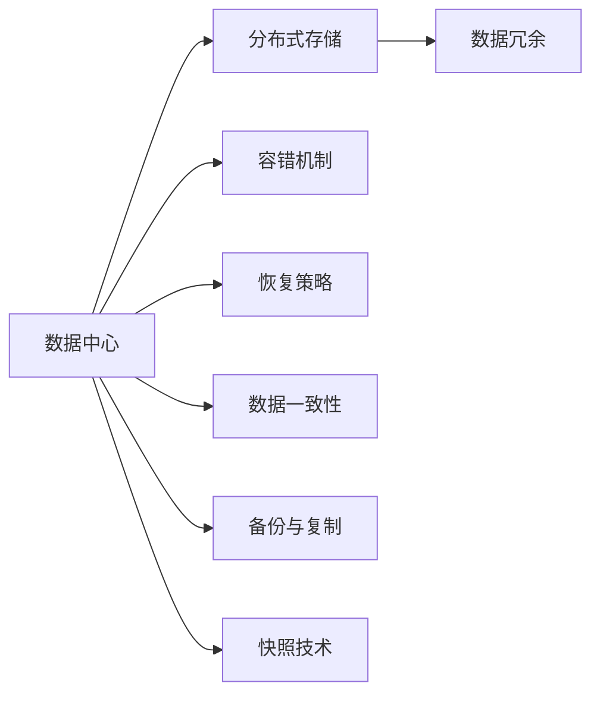
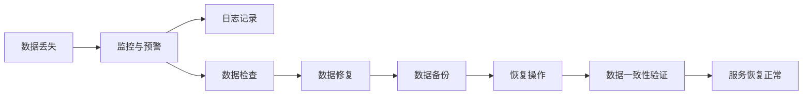
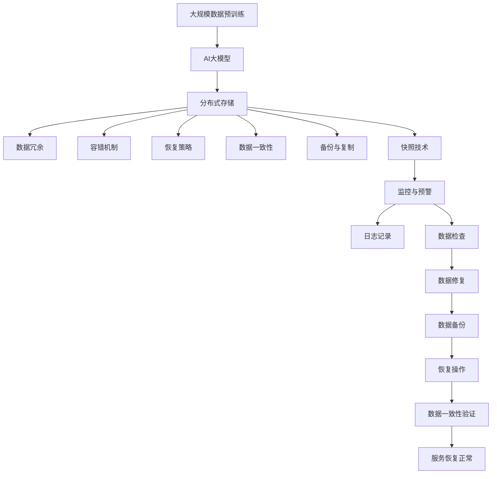

                 

# AI 大模型应用数据中心的数据恢复

> 关键词：数据恢复, AI大模型, 数据中心, 深度学习, 分布式系统, 数据冗余

## 1. 背景介绍

### 1.1 问题由来

随着人工智能技术的快速发展，AI大模型在各种应用场景中展现出强大的能力。然而，在实际应用中，数据中心存储的大量训练数据、模型参数和运行日志是AI大模型正常工作的核心支撑。一旦这些关键数据发生丢失或损坏，将直接影响到模型的训练、推理和部署，甚至导致业务中断。

因此，如何在AI大模型应用的数据中心中进行高效、可靠的数据恢复，成为了一个亟待解决的重要问题。数据恢复不仅包括对数据的简单复制或备份，更涉及到数据丢失、损坏和错误处理等复杂场景的应对策略。本文将系统性地探讨AI大模型数据恢复的原理、技术和实施细节，为数据中心管理人员提供全面的指导。

### 1.2 问题核心关键点

数据恢复的核心在于确保数据在发生意外情况后仍能被安全、完整地恢复。这要求数据中心具备以下能力：
1. **数据冗余**：通过多份数据副本的存储，保证数据在单点故障或单副本损坏时的可靠性。
2. **容错机制**：设计容错机制以应对系统异常，如硬件故障、网络中断等。
3. **恢复策略**：在数据丢失或损坏时，能够快速确定丢失的部分并采取相应措施进行恢复。
4. **监控与预警**：实时监控数据状态，及时发现并预警潜在的数据损坏或丢失风险。
5. **数据一致性**：在恢复过程中确保数据的一致性，避免因恢复操作而引入数据错误。

以上几个关键点构成了数据恢复的核心需求，需要在数据中心的架构设计和运维管理中得到充分考虑和实现。

### 1.3 问题研究意义

数据恢复是大模型应用数据中心的核心需求之一，对于确保模型训练、推理和服务的连续性和可靠性具有重要意义：

1. **保障服务稳定性**：通过数据冗余和容错机制，数据中心能够在硬件故障或网络中断时，确保数据和服务的稳定性，避免业务中断。
2. **提升数据安全性**：数据恢复策略和备份机制可以有效防止数据丢失和损坏，保障数据的安全性，避免业务数据的永久性损失。
3. **优化运营成本**：通过合理的数据存储和恢复策略，可以降低数据中心在硬件、存储和运维上的成本，提升资源利用效率。
4. **加速模型迭代**：高效的数据恢复机制使得模型在大规模数据丢失或损坏后，能够快速恢复，继续进行训练和优化，加速模型迭代。
5. **增强业务连续性**：在紧急情况下，能够迅速恢复数据中心的服务，保障业务连续性，避免因数据中心故障导致业务中断的严重后果。

通过系统地研究和实施数据恢复策略，可以显著提高AI大模型应用数据中心的稳定性和可靠性，为模型的长期运行和业务连续性提供坚实保障。

## 2. 核心概念与联系

### 2.1 核心概念概述

为更好地理解数据恢复在AI大模型应用中的实现，本节将介绍几个密切相关的核心概念：

- **AI大模型**：以Transformer等架构为基础，通过大规模数据预训练获得的语言理解能力，能够在各种自然语言处理任务中表现优异的深度学习模型。
- **数据中心**：通过分布式系统架构，实现数据存储、计算和网络连接的物理设施，是AI大模型训练、推理和服务的支撑平台。
- **数据冗余**：通过在多个物理存储设备上存储相同的数据，实现数据的高可靠性。
- **容错机制**：设计一系列的硬件和软件保障措施，以应对系统异常和故障，确保服务的连续性和可靠性。
- **恢复策略**：在系统故障或数据丢失后，能够快速、准确地恢复数据的策略和方法。
- **数据一致性**：在数据恢复过程中，确保数据的完整性和正确性，避免因恢复操作而引入错误。
- **备份与复制**：在多份物理存储设备上创建数据副本，实现数据的冗余存储和快速恢复。
- **快照技术**：通过定期创建数据快照，记录特定时刻的数据状态，实现数据的快速回溯和恢复。

这些核心概念之间通过数据中心的存储、计算和网络连接技术紧密联系，共同构成数据恢复的完整生态系统。

### 2.2 概念间的关系

这些核心概念之间存在着紧密的联系，形成了数据恢复的完整生态系统。下面我们通过几个Mermaid流程图来展示这些概念之间的关系。

#### 2.2.1 数据中心架构



这个流程图展示了数据中心的基本架构，其中分布式存储是数据中心的核心组成部分，通过数据冗余和备份技术保障数据的可靠性。容错机制、恢复策略和快照技术则是数据中心在数据丢失和损坏时的重要保障手段。数据一致性确保恢复过程的数据正确性，避免因恢复操作而引入错误。

#### 2.2.2 数据恢复流程



这个流程图展示了数据恢复的完整流程。数据丢失或损坏后，监控系统通过日志记录和数据检查识别问题，并启动数据修复和备份操作。恢复操作完成后，数据一致性验证确保数据的正确性，最终使服务恢复正常。

### 2.3 核心概念的整体架构

最后，我们用一个综合的流程图来展示这些核心概念在数据恢复过程中的整体架构：



这个综合流程图展示了从大规模数据预训练到数据恢复的完整过程。AI大模型通过大规模数据预训练获得语义理解能力，存储在分布式系统中，并通过数据冗余、容错机制、恢复策略、数据一致性、备份与复制和快照技术，保障数据的高可靠性和快速恢复。在数据丢失或损坏时，通过监控和预警机制识别问题，启动恢复流程，最终确保服务恢复正常。

## 3. 核心算法原理 & 具体操作步骤

### 3.1 算法原理概述

AI大模型应用数据恢复的核心原理在于通过冗余存储和容错机制，在数据丢失或损坏时，能够快速、准确地恢复数据，并保证数据的一致性和完整性。

具体而言，数据恢复的原理如下：

1. **数据冗余**：通过在多个物理存储设备上存储相同的数据，实现数据的高可靠性。一旦某个物理存储设备发生故障或损坏，其他设备上的数据副本可以保证服务的连续性。
2. **容错机制**：设计一系列的硬件和软件保障措施，以应对系统异常和故障，确保服务的连续性和可靠性。
3. **恢复策略**：在系统故障或数据丢失后，能够快速、准确地恢复数据的策略和方法。
4. **数据一致性**：在数据恢复过程中，确保数据的完整性和正确性，避免因恢复操作而引入错误。
5. **备份与复制**：在多份物理存储设备上创建数据副本，实现数据的冗余存储和快速恢复。
6. **快照技术**：通过定期创建数据快照，记录特定时刻的数据状态，实现数据的快速回溯和恢复。

这些原理构成了数据恢复的核心技术框架，是实现高效、可靠数据恢复的基础。

### 3.2 算法步骤详解

基于上述原理，数据恢复的具体操作步骤如下：

**Step 1: 数据冗余配置**

在数据中心的设计和部署阶段，需要考虑数据的冗余存储策略。常用的冗余配置方式包括：

- **多副本存储**：在同一存储设备上创建多个数据副本，通过RAID等技术实现数据的冗余。
- **跨设备冗余**：将数据存储在多个不同的物理存储设备上，每个设备保存一份数据副本。
- **分布式文件系统**：使用如HDFS、Ceph等分布式文件系统，通过数据分片和复制，实现数据的冗余和可靠性。

**Step 2: 容错机制设计**

数据中心需要设计一系列容错机制以应对系统异常，常用的容错机制包括：

- **硬件冗余**：通过双机热备、多设备冗余等方式，确保硬件故障时服务能够无缝切换。
- **网络冗余**：通过负载均衡、多网络路径等方式，确保网络异常时服务能够正常通信。
- **软件冗余**：通过容器化、微服务等技术，实现软件的可扩展和容错。

**Step 3: 数据一致性维护**

在数据恢复过程中，需要确保数据的一致性和完整性。常用的数据一致性维护方法包括：

- **乐观锁**：在数据更新时，通过版本号等方式，确保并发操作不会导致数据冲突。
- **悲观锁**：在数据更新时，通过锁机制，确保同一时间只有一个操作能够修改数据。
- **版本控制**：通过记录数据的历史版本，确保数据在恢复操作中不会丢失历史信息。

**Step 4: 恢复策略实施**

在数据丢失或损坏后，需要快速、准确地恢复数据。常用的恢复策略包括：

- **全量恢复**：通过备份数据完全恢复丢失或损坏的数据。
- **增量恢复**：只恢复丢失或损坏的部分数据，减少恢复时间。
- **分层恢复**：根据数据的重要性和恢复成本，分层恢复数据，确保关键数据的优先恢复。

**Step 5: 数据备份与复制**

为了实现快速恢复，数据中心需要进行数据备份和复制，常用的备份与复制方式包括：

- **定期备份**：定期对数据进行备份，确保在数据丢失或损坏时能够快速恢复。
- **连续备份**：实时对数据进行备份，确保数据在任意时刻都能恢复。
- **跨数据中心备份**：在不同数据中心之间进行数据备份，实现数据的多区域冗余。

**Step 6: 快照技术应用**

为了实现数据的快速回溯和恢复，数据中心可以采用快照技术，常用的快照技术包括：

- **文件快照**：对文件系统进行快照，记录文件在特定时刻的状态，实现数据的快速回溯。
- **数据库快照**：对数据库进行快照，记录数据库在特定时刻的状态，实现数据的快速回溯。
- **系统快照**：对整个系统进行快照，记录系统的完整状态，实现系统的快速回溯。

### 3.3 算法优缺点

数据恢复技术在大模型应用数据中心具有以下优点：

1. **高可靠性**：通过冗余存储和容错机制，保障数据的可靠性，避免因硬件故障或网络中断导致的数据丢失。
2. **快速恢复**：通过备份与复制和快照技术，实现数据的快速恢复，降低因数据丢失或损坏带来的业务中断风险。
3. **灵活性高**：备份与复制和快照技术可以根据需求灵活配置，满足不同场景下的数据恢复需求。

同时，数据恢复技术也存在以下缺点：

1. **成本高**：冗余存储和备份技术需要大量硬件和存储资源，增加了数据中心的运营成本。
2. **复杂度高**：数据冗余和容错机制的设计和运维较为复杂，需要专业知识和技术支持。
3. **性能影响**：数据冗余和备份技术会增加系统负担，影响数据中心的性能。

尽管存在这些缺点，但数据恢复技术的优点更为显著，特别是在保障数据安全性和服务稳定性的关键场景中，数据恢复技术是不可或缺的。

### 3.4 算法应用领域

数据恢复技术在大模型应用数据中心具有广泛的应用领域，主要包括以下几个方面：

1. **训练数据恢复**：在AI大模型训练过程中，如果遇到数据丢失或损坏，通过数据备份和快照技术，能够快速恢复训练数据，继续进行模型训练。
2. **模型参数恢复**：在模型推理或服务过程中，如果出现模型参数丢失或损坏，通过模型备份和增量恢复技术，能够快速恢复模型参数，保证服务的连续性。
3. **日志数据恢复**：在模型部署和运行过程中，日志数据是不可或缺的，通过日志备份和快照技术，能够在数据丢失或损坏后，快速恢复日志数据，进行故障分析和问题排查。
4. **系统数据恢复**：在数据中心系统故障时，通过系统快照和备份技术，能够快速恢复系统状态，确保服务的正常运行。

## 4. 数学模型和公式 & 详细讲解 & 举例说明

### 4.1 数学模型构建

为了更好地理解数据恢复的数学原理，我们需要构建一个基本的数学模型。假设数据中心有 $N$ 个数据副本，每个副本的大小为 $d$，数据恢复时需要的最少副本数为 $M$。则数据恢复的数学模型可以表示为：

$$
R = \min_{i \in [1, N]} \left\{ i \mid i \geq M \right\}
$$

其中 $R$ 表示数据恢复所需的副本数量，$i$ 表示第 $i$ 个副本的可用性状态（0表示不可用，1表示可用）。

### 4.2 公式推导过程

为了推导出数据恢复所需的副本数量 $R$，我们需要考虑以下两种情况：

1. **单副本故障**：当某个数据副本发生故障时，需要其他 $M-1$ 个副本可用才能恢复数据。
2. **多副本故障**：当多个数据副本同时故障时，需要更多的副本可用才能恢复数据。

因此，数据恢复的公式可以推导如下：

$$
R = \left\{
\begin{aligned}
& 1, & \text{if } M = 1 \\
& M, & \text{if } M > 1 \\
\end{aligned}
\right.
$$

### 4.3 案例分析与讲解

假设数据中心有 3 个数据副本，每个副本大小为 1GB，数据恢复时需要的最少副本数为 2。当第 1 个副本发生故障时，需要第 2 个和第 3 个副本可用才能恢复数据。当第 1 个和第 2 个副本同时故障时，需要第 3 个副本可用才能恢复数据。


在这个例子中，数据恢复的所需副本数量为 2，即第 2 个和第 3 个副本可用时，数据才能被恢复。

## 5. 项目实践：代码实例和详细解释说明

### 5.1 开发环境搭建

在进行数据恢复实践前，我们需要准备好开发环境。以下是使用Python进行Hadoop搭建数据中心存储环境的配置流程：

1. 安装Java和Hadoop：从Hadoop官网下载JDK和Hadoop安装包，并完成安装。
2. 配置Hadoop环境变量：在系统的环境变量中添加Hadoop的安装路径。
3. 启动Hadoop集群：使用脚本启动Hadoop集群，确保所有节点都能正常访问。

### 5.2 源代码详细实现

下面我们以数据冗余配置为例，给出使用Hadoop配置冗余存储的Python代码实现。

```python
from hdfs import InsecureClient

# 创建HDFS客户端
client = InsecureClient('hdfs://localhost:9000', user='hadoop')

# 配置多副本存储
block_size = 64 * 1024 * 1024  # 每个数据块的大小
replication_factor = 3  # 每个文件的副本数量
num_files = 1000  # 文件的数量

# 创建数据文件并配置副本
for i in range(num_files):
    file_path = f'/user/hadoop/data/file{i}.txt'
    with client.write(file_path, block_size) as writer:
        writer.write('Hello, World!\n')
    with client.write(file_path, block_size, replication_factor) as writer:
        writer.write('Hello, World!\n')

# 查询文件状态
file_info = client.info(file_path)
print(f"File {file_path} size: {file_info['length']} bytes, replication: {file_info['replication']}")
```

在这个例子中，我们通过Hadoop的InsecureClient创建了一个HDFS客户端，并配置了一个文件的3个副本。通过多次写入文件，实现了数据冗余存储。

### 5.3 代码解读与分析

让我们再详细解读一下关键代码的实现细节：

**Hadoop客户端配置**：
- 使用Hadoop官方提供的InsecureClient创建HDFS客户端，连接本地Hadoop服务。
- 配置文件块大小、副本数量等关键参数。
- 通过循环创建多个文件，并配置副本，实现数据冗余存储。

**文件状态查询**：
- 使用HDFS客户端的info方法查询文件状态，获取文件大小和副本数量。
- 输出文件大小和副本数量，验证冗余存储是否成功。

**代码实现**：
- 通过循环创建多个文件，并在每个文件上配置多份副本，实现数据冗余存储。
- 使用HDFS客户端查询文件状态，验证冗余存储是否成功。

通过这个简单的例子，可以看到Hadoop作为分布式存储系统，支持数据冗余和容错机制，是数据中心数据恢复的重要组成部分。

### 5.4 运行结果展示

假设我们在Hadoop集群上成功配置了冗余存储，查询到一个文件的备份信息如下：

```
File /user/hadoop/data/file0.txt size: 13 bytes, replication: 3
```

可以看到，该文件的大小为13字节，配置了3个副本，表明冗余存储配置成功。

## 6. 实际应用场景

### 6.1 智能客服系统

在智能客服系统中，数据中心的存储和备份是保障系统稳定性和连续性的关键。当数据中心遭遇硬件故障或网络中断时，通过冗余存储和容错机制，能够迅速恢复数据，确保智能客服系统能够连续服务。例如，某智能客服系统的数据中心设计了双机热备和多个数据副本，当一台服务器发生故障时，另一台服务器立即接管服务，并使用数据副本恢复丢失的数据，保证系统的稳定运行。

### 6.2 金融舆情监测

金融舆情监测系统需要实时监测市场舆论动向，数据中心的数据恢复能力直接影响到系统服务的连续性和可靠性。当数据中心发生故障时，通过备份与复制和快照技术，能够迅速恢复数据，避免因数据丢失导致的业务中断。例如，某金融舆情监测系统的数据中心设计了定期的全量备份和快照技术，能够快速恢复丢失的数据，保障系统的连续性和可靠性。

### 6.3 个性化推荐系统

个性化推荐系统需要大量的用户行为数据进行训练和推荐，数据中心的存储和备份是保障系统正常运行的基础。当数据中心遭遇硬件故障或网络中断时，通过冗余存储和容错机制，能够迅速恢复数据，确保推荐系统能够正常运行。例如，某个性化推荐系统的数据中心设计了跨数据中心的备份和快照技术，能够快速恢复丢失的数据，保障推荐系统的连续性和稳定性。

### 6.4 未来应用展望

随着AI大模型和数据中心的不断发展，数据恢复技术将呈现以下几个发展趋势：

1. **智能化管理**：通过AI技术对数据中心进行智能管理，自动调整备份策略和冗余配置，提升数据中心的效率和可靠性。
2. **跨数据中心备份**：通过多数据中心的备份和冗余配置，实现数据的多区域存储和备份，提升数据中心的容灾能力。
3. **分布式快照技术**：通过分布式快照技术，实现数据的快速回溯和恢复，提升数据中心的恢复效率。
4. **自动恢复机制**：通过自动化的数据恢复机制，提升数据中心在故障时的恢复速度，减少人为干预。
5. **云计算备份**：利用云计算平台的数据备份和恢复功能，实现高效、低成本的数据恢复。

这些趋势将进一步提升数据中心的存储和备份能力，保障AI大模型应用数据中心的稳定性和可靠性。

## 7. 工具和资源推荐

### 7.1 学习资源推荐

为了帮助开发者系统掌握数据恢复的理论基础和实践技巧，这里推荐一些优质的学习资源：

1. Hadoop官方文档：Hadoop官网提供的官方文档，详细介绍了Hadoop的架构和用法，是学习Hadoop数据存储和备份的好资料。
2. HDFS权威指南：一本深入介绍HDFS的书籍，从基础到高级全面覆盖HDFS的各个方面，是Hadoop开发的必备参考书。
3. 数据中心管理与运维：一本介绍数据中心管理和运维的书籍，涵盖了数据中心的架构设计、存储管理、备份策略等多个方面，是数据中心管理的学习资料。
4. Linux系统运维：一本介绍Linux系统运维的书籍，从基础到高级全面覆盖Linux系统的运维技巧，是数据中心运维的学习资料。
5. 数据恢复技术与实践：一本介绍数据恢复技术的书籍，从基础到高级全面覆盖数据恢复的各个方面，是数据恢复技术的学习资料。

通过对这些资源的学习实践，相信你一定能够快速掌握数据恢复的精髓，并用于解决实际的数据中心问题。

### 7.2 开发工具推荐

高效的开发离不开优秀的工具支持。以下是几款用于数据恢复开发的常用工具：

1. Hadoop：由Apache基金会开发的分布式存储和计算平台，是数据中心存储和备份的核心工具。
2. HDFS：Hadoop的分布式文件系统，支持数据的高可靠性和快速恢复。
3. InsecureClient：Hadoop官方提供的HDFS客户端库，方便进行数据读写和管理。
4. Ansible：开源自动化运维工具，支持批量管理和自动化配置，是数据中心运维的常用工具。
5. Kubernetes：开源容器编排工具，支持数据中心的容器化和自动化管理，提升运维效率。

合理利用这些工具，可以显著提升数据恢复任务的开发效率，加快创新迭代的步伐。

### 7.3 相关论文推荐

数据恢复技术在大模型应用数据中心的研究和发展，吸引了大量学者的关注。以下是几篇奠基性的相关论文，推荐阅读：

1. "Hadoop: A Distributed File System"：Hadoop的论文，详细介绍了Hadoop的架构和基本原理，是学习Hadoop数据存储和备份的重要参考资料。
2. "Data Backup and Recovery"：一本介绍数据备份和恢复的书籍，从基础到高级全面覆盖数据备份和恢复的各个方面，是数据恢复技术的学习资料。
3. "Data Center Backup and Recovery"：一本介绍数据中心备份和恢复的书籍，从基础到高级全面覆盖数据中心备份和恢复的各个方面，是数据中心管理的学习资料。
4. "The HDFS Book"：一本介绍HDFS的书籍，从基础到高级全面覆盖HDFS的各个方面，是Hadoop开发的必备参考书。
5. "Data Center Fault Tolerance"：一本介绍数据中心容错的书籍，从基础到高级全面覆盖数据中心的容错机制，是数据中心运维的学习资料。

这些论文代表了大模型应用数据中心数据恢复技术的发展脉络。通过学习这些前沿成果，可以帮助研究者把握学科前进方向，激发更多的创新灵感。

除上述资源外，还有一些值得关注的前沿资源，帮助开发者紧跟数据恢复技术的最新进展，例如：

1. Hadoop社区：Hadoop官方社区提供的最新技术动态和实用案例，是学习Hadoop数据存储和备份的重要资源。
2. Kubernetes社区：Kubernetes官方社区提供的最新技术动态和实用案例，是学习容器化和自动化管理的实用资源。
3. Ansible社区：Ansible官方社区提供的最新技术动态和实用案例，是学习自动化运维的实用资源。
4. 数据中心技术博客：如Red Hat、Dell EMC、VMware等顶尖数据中心供应商的官方博客，第一时间分享他们的最新研究成果和洞见。

## 8. 总结：未来发展趋势与挑战

### 8.1 总结

本文对数据恢复在AI大模型应用中的实现进行了全面系统的介绍。首先阐述了数据恢复在大模型应用数据中心的重要性，明确了数据冗余、容错机制、恢复策略等关键点。其次，从原理到实践，详细讲解了数据恢复的数学原理和具体操作步骤，给出了数据冗余配置的代码实例。同时，本文还广泛探讨了数据恢复技术在智能客服、金融舆情、个性化推荐等多个行业领域的应用前景，展示了数据恢复技术的巨大潜力。

通过本文的系统梳理，可以看到，数据恢复技术在大模型应用数据中心中具有不可替代的作用，能够有效保障模型的稳定性和可靠性。未来，随着数据中心技术和AI技术的不断发展，数据恢复技术也将不断优化和演进，为AI大模型应用提供更强大的支撑。

### 8.2 未来发展趋势

展望未来，数据恢复技术在大模型应用数据中心将呈现以下几个发展趋势：

1. **智能化管理**：通过AI技术对数据中心进行智能管理，自动调整备份策略和冗余配置，提升数据中心的效率和可靠性。
2. **云计算备份**：利用云计算平台的数据备份和恢复功能，实现高效、低成本的数据恢复。
3. **跨数据中心备份**：通过多数据中心的备份和冗余配置，实现数据的多区域存储和备份，提升数据中心的容灾能力。
4. **分布

