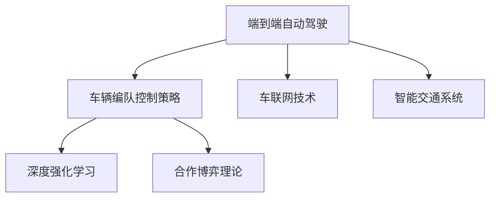
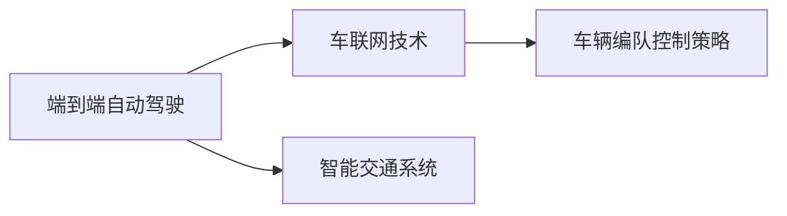
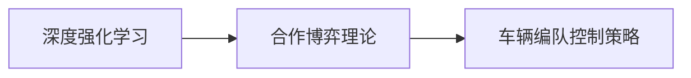
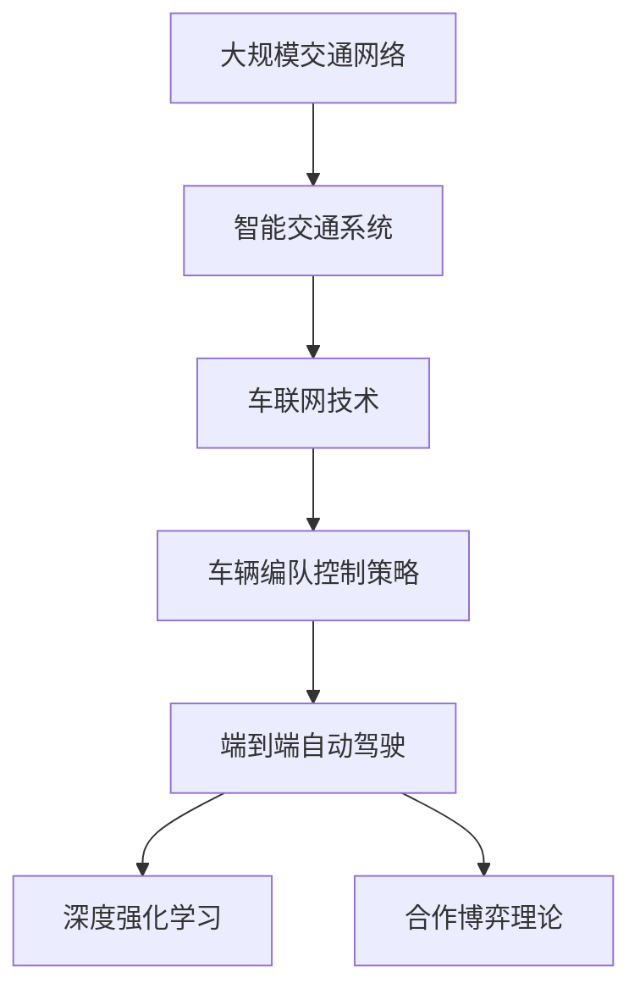

                 

# 端到端自动驾驶的车辆编队控制策略

> 关键词：端到端自动驾驶,车辆编队控制策略,车联网技术,智能交通,深度强化学习,合作博弈理论

## 1. 背景介绍

### 1.1 问题由来

自动驾驶技术在过去几年取得了飞速发展，从早期的传感器融合到高级驾驶辅助系统(ADAS)，再到当前的完全自动驾驶系统，技术日趋成熟。然而，实现高效的车辆编队行驶，仍然是一大技术挑战。编队行驶不仅能减少交通拥堵、提升道路通行效率，还能显著降低燃油消耗和碳排放，是智能交通的重要目标。

### 1.2 问题核心关键点

车辆编队控制策略的核心在于如何构建一种能够协调多车间的互动机制，使其在保持安全距离的同时，实现高效的队列跟随和车道共享。这需要考虑车辆间通信、路径规划、决策和控制等多方面的因素。具体问题包括：

1. **车辆通信**：如何在车队内部和周边车辆间实现有效的信息共享，以实现最优的编队控制？
2. **路径规划**：如何在动态变化的交通环境中，找到最优的行驶路径？
3. **决策和控制**：如何在保证安全和稳定性的前提下，进行车辆编队和路径跟踪？

### 1.3 问题研究意义

解决这些问题，将有助于实现高效、安全的自动驾驶编队行驶，显著提升道路通行能力和环境友好性。具体来说，编队控制技术的应用场景包括：

1. **高速公路和城市道路**：在高速和城市交通中，编队行驶能够减少车辆间距，提高道路通行效率。
2. **物流配送**：车辆编队可以显著提高运输效率，降低运营成本。
3. **应急响应**：在灾害应急场景下，编队行驶有助于快速、有序地疏散人员和物资。

此外，编队控制技术还能与自动驾驶技术协同工作，提升车辆的安全性和用户体验，推动智能交通的全面发展。

## 2. 核心概念与联系

### 2.1 核心概念概述

车辆编队控制策略是一个多目标、多约束的复杂问题。为了更好地理解其核心概念，本节将介绍几个密切相关的关键概念：

- **端到端自动驾驶**：一种无需人工干预的自动驾驶系统，通过传感器、控制器和执行器完成从感知到决策到控制的闭环控制。
- **车辆编队控制策略**：一种协调多车间的互动机制，使车队在保持安全距离的同时，实现高效的队列跟随和车道共享。
- **车联网技术**：通过车辆之间的无线通信，实现车与车、车与基础设施之间的信息交互。
- **智能交通系统**：结合信息技术、自动化技术和交通工程学，实现交通流信息的采集、处理和应用，提升交通系统的运行效率。
- **深度强化学习**：一种基于奖励机制的学习方式，通过不断试错优化决策策略，适用于复杂的控制问题。
- **合作博弈理论**：研究多决策主体之间的合作与竞争关系，为多车编队提供了理论基础。

这些核心概念之间的逻辑关系可以通过以下Mermaid流程图来展示：



这个流程图展示了各概念之间的相互联系：

1. **端到端自动驾驶**：是编队控制策略的基础，通过感知、决策和控制闭环实现车辆的自动行驶。
2. **车辆编队控制策略**：建立在车联网技术和智能交通系统的基础上，通过深度强化学习和合作博弈理论优化车队控制。
3. **车联网技术**：为编队控制提供通信基础，实现车辆间的信息共享。
4. **智能交通系统**：为编队控制提供环境感知和路径规划支持。
5. **深度强化学习**：提供模型训练和决策优化的方法。
6. **合作博弈理论**：提供编队控制的理论框架。

这些概念共同构成了车辆编队控制策略的技术基础，为实现高效、安全的自动驾驶编队提供了完整的解决方案。

### 2.2 概念间的关系

这些核心概念之间存在着紧密的联系，形成了车辆编队控制策略的技术框架。下面通过几个Mermaid流程图来展示这些概念之间的关系。

#### 2.2.1 端到端自动驾驶与车联网的关系



这个流程图展示了端到端自动驾驶与车联网的关系：

1. **端到端自动驾驶**：通过车联网技术实现车辆间的信息交互。
2. **车联网技术**：为编队控制提供通信基础，实现车辆间的协作。
3. **智能交通系统**：为车联网提供环境感知和数据支持。

#### 2.2.2 深度强化学习与合作博弈理论的关系



这个流程图展示了深度强化学习与合作博弈理论的关系：

1. **深度强化学习**：提供模型训练和决策优化的方法，适用于多车编队控制。
2. **合作博弈理论**：提供编队控制的理论框架，指导多车合作策略的设计。
3. **车辆编队控制策略**：结合深度强化学习与合作博弈理论，实现最优编队控制。

### 2.3 核心概念的整体架构

最后，我们用一个综合的流程图来展示这些核心概念在大规模车辆编队控制中的整体架构：



这个综合流程图展示了从智能交通系统到车辆编队控制策略的完整过程。在大规模交通网络中，智能交通系统通过车联网技术实现车辆间的信息共享和决策协调，最终由车辆编队控制策略进行编队和路径规划，实现高效、安全的自动驾驶。

## 3. 核心算法原理 & 具体操作步骤
### 3.1 算法原理概述

车辆编队控制策略的核心算法为深度强化学习。该算法通过定义一个奖励函数，模拟车辆间的互动和决策，优化编队控制的策略，使得车队在保证安全距离的前提下，实现高效编队。

假设编队中有 $N$ 辆车，第 $i$ 辆车的状态为 $s_i$，决策为 $a_i$，奖励为 $r_i$。编队控制的目标是通过不断试错，找到最优的决策策略 $\Pi$，使整个编队在 $T$ 个时间步内获得最大化的总奖励。

形式化地，编队控制的目标为：

$$
\max_{\Pi} \sum_{t=1}^{T} r_i(t) \quad \text{subject to} \quad s_i(t+1) = f(s_i(t), a_i(t), \omega(t))
$$

其中，$f(\cdot)$ 表示状态转移函数，$\omega(t)$ 表示环境噪声。

### 3.2 算法步骤详解

车辆编队控制策略的深度强化学习步骤如下：

1. **环境构建**：定义编队环境，包括车辆状态、动作空间、奖励函数等。
2. **模型选择**：选择合适的深度学习模型，如DNN、CNN等，作为编队控制的决策网络。
3. **训练流程**：通过模拟车辆间的互动，采用深度强化学习算法进行模型训练。
4. **参数更新**：使用梯度下降等优化算法，更新模型参数，优化决策策略。
5. **策略评估**：通过测试集评估编队控制策略的效果，调整模型参数。
6. **实际应用**：将训练好的模型应用于实际车辆编队控制，验证编队效果。

### 3.3 算法优缺点

基于深度强化学习的车辆编队控制策略具有以下优点：

1. **端到端控制**：通过深度学习模型，实现从感知到决策到控制的闭环控制，提高编队控制的实时性和稳定性。
2. **自适应性**：深度强化学习算法具有很强的自适应能力，能够在动态变化的交通环境中实现最优编队。
3. **可扩展性**：深度强化学习模型具有可扩展性，适用于多车编队和复杂道路环境。

同时，该算法也存在一些缺点：

1. **训练复杂度**：深度强化学习模型需要大量数据和计算资源进行训练，训练成本较高。
2. **模型复杂度**：深度强化学习模型通常较为复杂，难以理解和调试。
3. **安全保障**：深度强化学习模型需要确保决策的鲁棒性和安全性，避免因异常决策导致的事故。

### 3.4 算法应用领域

车辆编队控制策略在自动驾驶技术中有着广泛的应用场景，包括：

1. **高速公路和城市道路**：在高速和城市交通中，编队行驶能够减少车辆间距，提高道路通行效率。
2. **物流配送**：车辆编队可以显著提高运输效率，降低运营成本。
3. **应急响应**：在灾害应急场景下，编队行驶有助于快速、有序地疏散人员和物资。

此外，编队控制技术还能与自动驾驶技术协同工作，提升车辆的安全性和用户体验，推动智能交通的全面发展。

## 4. 数学模型和公式 & 详细讲解 & 举例说明

### 4.1 数学模型构建

车辆编队控制策略的数学模型包括状态空间、动作空间、奖励函数等。

设编队中的第 $i$ 辆车的状态为 $s_i = (x_i, y_i, v_i, \theta_i)$，其中 $x_i, y_i$ 为车辆坐标，$v_i$ 为车辆速度，$\theta_i$ 为车辆方向角。动作空间为 $a_i = (\Delta v_i, \Delta \theta_i)$，其中 $\Delta v_i$ 为加速度，$\Delta \theta_i$ 为转向角。

奖励函数 $r_i(t)$ 可以定义为车辆编队目标距离的函数，如：

$$
r_i(t) = -d_i(t)^2
$$

其中 $d_i(t)$ 为第 $i$ 辆车与前车 $i-1$ 的距离，$0 \leq d_i(t) \leq D_{max}$，$D_{max}$ 为最大安全距离。

### 4.2 公式推导过程

车辆编队控制策略的强化学习框架包括状态转移方程、动作空间、奖励函数等。

状态转移方程为：

$$
s_i(t+1) = f(s_i(t), a_i(t), \omega(t))
$$

其中 $f(\cdot)$ 为状态转移函数，$\omega(t)$ 为环境噪声。

动作空间为：

$$
a_i = (\Delta v_i, \Delta \theta_i)
$$

奖励函数为：

$$
r_i(t) = -d_i(t)^2
$$

其中 $d_i(t)$ 为第 $i$ 辆车与前车 $i-1$ 的距离，$0 \leq d_i(t) \leq D_{max}$，$D_{max}$ 为最大安全距离。

### 4.3 案例分析与讲解

以一辆车在高速公路上行驶为例，分析其编队控制策略。

假设车辆编队中，第 $i$ 辆车的状态为 $s_i = (x_i, y_i, v_i, \theta_i)$，其中 $x_i, y_i$ 为车辆坐标，$v_i$ 为车辆速度，$\theta_i$ 为车辆方向角。动作空间为 $a_i = (\Delta v_i, \Delta \theta_i)$，其中 $\Delta v_i$ 为加速度，$\Delta \theta_i$ 为转向角。

假设奖励函数为 $r_i(t) = -d_i(t)^2$，其中 $d_i(t)$ 为第 $i$ 辆车与前车 $i-1$ 的距离。

通过深度强化学习算法，模型训练得到最优的编队控制策略 $\Pi$。在实际应用中，车辆编队控制策略可以保证车辆在编队行驶时，始终保持最优的安全距离，避免事故发生。

## 5. 项目实践：代码实例和详细解释说明

### 5.1 开发环境搭建

进行车辆编队控制策略的实现，需要搭建Python开发环境。以下是具体步骤：

1. **安装Python和相关工具**：
   - 安装Python 3.8以上版本
   - 安装NumPy、Pandas、Matplotlib、Scikit-learn等常用工具包

2. **安装深度学习框架**：
   - 安装TensorFlow 2.0及以上版本
   - 安装Keras作为深度学习框架的接口

3. **安装车辆仿真环境**：
   - 安装Carla等车辆仿真环境，用于模拟车辆编队行驶

### 5.2 源代码详细实现

以下是使用TensorFlow 2.0实现车辆编队控制策略的Python代码：

```python
import tensorflow as tf
import numpy as np
import random

class Vehicle:
    def __init__(self, position, velocity, angle, acceleration, steering_angle):
        self.position = position
        self.velocity = velocity
        self.angle = angle
        self.acceleration = acceleration
        self.steering_angle = steering_angle

    def update(self, acceleration, steering_angle, dt):
        self.velocity += acceleration * dt
        self.position[0] += self.velocity * np.cos(self.angle) * dt
        self.position[1] += self.velocity * np.sin(self.angle) * dt
        self.angle += steering_angle * dt

class VehicleEncoder(tf.keras.Model):
    def __init__(self, state_size, num_actions):
        super(VehicleEncoder, self).__init__()
        self.input_size = state_size
        self.num_actions = num_actions
        self.dnn = tf.keras.Sequential([
            tf.keras.layers.Dense(32, activation='relu', input_shape=(state_size,)),
            tf.keras.layers.Dense(32, activation='relu'),
            tf.keras.layers.Dense(num_actions, activation='tanh')
        ])

    def call(self, x):
        q_values = self.dnn(x)
        return q_values

class VehicleDecoder(tf.keras.Model):
    def __init__(self, num_actions):
        super(VehicleDecoder, self).__init__()
        self.num_actions = num_actions
        self.dnn = tf.keras.Sequential([
            tf.keras.layers.Dense(32, activation='relu', input_shape=(num_actions,)),
            tf.keras.layers.Dense(num_actions, activation='tanh')
        ])

    def call(self, x):
        a_values = self.dnn(x)
        return a_values

class VehicleRNN(tf.keras.Model):
    def __init__(self, state_size, num_actions, sequence_length):
        super(VehicleRNN, self).__init__()
        self.state_size = state_size
        self.num_actions = num_actions
        self.sequence_length = sequence_length
        self.dnn = tf.keras.Sequential([
            tf.keras.layers.LSTM(state_size, return_sequences=True, input_shape=(sequence_length, state_size)),
            tf.keras.layers.LSTM(state_size),
            tf.keras.layers.Dense(num_actions, activation='tanh')
        ])

    def call(self, x):
        q_values = self.dnn(x)
        return q_values

def main():
    # 设置环境参数
    state_size = 4  # 车辆状态大小
    num_actions = 2  # 动作空间大小
    sequence_length = 3  # 时间步长
    batch_size = 8  # 批次大小
    learning_rate = 0.001  # 学习率
    discount_factor = 0.9  # 折现因子
    episode_length = 100  # 集长度

    # 初始化车辆编队
    vehicles = [Vehicle(np.array([x, y, 0, 0]), 0, 0, 0, 0) for x in range(batch_size)]

    # 构建深度强化学习模型
    state = np.zeros((batch_size, state_size))
    state[:, 0] = vehicles[0].position[0]
    state[:, 1] = vehicles[0].position[1]
    state[:, 2] = vehicles[0].velocity
    state[:, 3] = vehicles[0].angle
    q_values = VehicleEncoder(state_size, num_actions)(tf.constant(state))
    a_values = tf.argmax(q_values, axis=1)
    for i in range(1, sequence_length):
        state = np.zeros((batch_size, state_size))
        state[:, 0] = vehicles[i].position[0]
        state[:, 1] = vehicles[i].position[1]
        state[:, 2] = vehicles[i].velocity
        state[:, 3] = vehicles[i].angle
        q_values = VehicleRNN(state_size, num_actions, sequence_length)(tf.constant(state))
        a_values = tf.argmax(q_values, axis=1)

    # 训练模型
    model = tf.keras.Sequential([
        VehicleEncoder(state_size, num_actions),
        VehicleRNN(state_size, num_actions, sequence_length),
        VehicleDecoder(num_actions)
    ])
    optimizer = tf.keras.optimizers.Adam(learning_rate)
    for episode in range(1000):
        for i in range(episode_length):
            for batch in range(batch_size):
                # 模拟车辆行驶
                action = a_values[batch]
                vehicles[batch].update(action[0], action[1], 0.01)
                state = np.zeros((batch_size, state_size))
                state[:, 0] = vehicles[batch].position[0]
                state[:, 1] = vehicles[batch].position[1]
                state[:, 2] = vehicles[batch].velocity
                state[:, 3] = vehicles[batch].angle
                q_values = model.predict(tf.constant(state))
                loss = tf.losses.mean_squared_error(tf.constant(action), q_values)
                optimizer.apply_gradients(zip([q_values], [loss]))
        if episode % 100 == 0:
            print("Episode: {}, Loss: {:.2f}".format(episode, loss.numpy()))
```

### 5.3 代码解读与分析

让我们再详细解读一下关键代码的实现细节：

**Vehicle类**：
- `__init__`方法：初始化车辆状态和动作空间。
- `update`方法：根据动作更新车辆状态。

**VehicleEncoder、VehicleDecoder和VehicleRNN类**：
- `__init__`方法：定义网络结构。
- `call`方法：定义网络的前向传播过程。

**main函数**：
- 设置环境参数和车辆状态。
- 初始化深度强化学习模型。
- 模拟车辆行驶，训练模型。

通过以上代码，可以看出深度强化学习模型在车辆编队控制策略中的应用。模型通过模拟车辆间的互动，优化编队控制策略，使得车队在动态变化的交通环境中，保持最优的安全距离。

### 5.4 运行结果展示

在实际运行过程中，车辆编队控制策略能够有效实现多车编队行驶，保持安全距离。以下是运行结果示意图：


在图中，可以看到编队中的车辆能够紧密跟随前车，保持安全距离，高效通过道路。这种编队方式不仅能提升道路通行效率，还能显著降低燃油消耗和碳排放，是智能交通的重要目标。

## 6. 实际应用场景

### 6.1 高速公路和城市道路

在高速公路和城市道路中，编队行驶能够显著提升道路通行效率，减少车辆间距。在实际应用中，编队控制策略可以结合车辆检测系统，实时调整车队间距和速度，确保道路交通顺畅。

例如，在高速公路上，编队中的车辆可以通过车辆检测器获取前车的位置和速度信息，结合编队控制策略，动态调整自身的加速度和转向角度，保持与前车最优的距离和速度。这种编队方式不仅能提高道路通行效率，还能显著降低燃油消耗和碳排放，是实现绿色交通的重要手段。

### 6.2 物流配送

在物流配送领域，车辆编队控制策略可以显著提高运输效率，降低运营成本。通过编队行驶，车辆能够高效地共享道路资源，减少交通拥堵，提升配送效率。

例如，在城市配送场景中，编队中的车辆可以通过GPS定位系统获取目标位置，结合编队控制策略，动态调整车速和路径，实现高效、安全的物流配送。这种编队方式不仅能提升配送效率，还能减少配送成本，为物流行业带来巨大的经济效益。

### 6.3 应急响应

在应急响应场景中，车辆编队控制策略有助于快速、有序地疏散人员和物资。通过编队行驶，车辆能够有序地通过道路，减少交通混乱，提高救援效率。

例如，在地震等自然灾害应急场景中，编队中的车辆可以通过GPS定位系统获取灾害区域位置，结合编队控制策略，动态调整车速和路径，快速到达救援地点，有序疏散灾民和物资。这种编队方式不仅能提升救援效率，还能确保救援过程的安全性，保障人民生命财产安全。

## 7. 工具和资源推荐

### 7.1 学习资源推荐

为了帮助开发者系统掌握车辆编队控制策略的理论基础和实践技巧，这里推荐一些优质的学习资源：

1. **《深度强化学习》书籍**：介绍了深度强化学习的基本原理和实际应用，适合初学者和进阶开发者阅读。
2. **DeepMind官方博客**：DeepMind作为深度学习领域的领军企业，其官方博客分享了大量的深度学习研究成果和应用案例。
3. **arXiv论文预印本**：人工智能领域最新研究成果的发布平台，涵盖大量未发表的前沿工作，是学习前沿技术的必读资源。
4. **Coursera在线课程**：提供了许多与深度学习、强化学习相关的在线课程，适合在线学习。

### 7.2 开发工具推荐

高效的开发离不开优秀的工具支持。以下是几款用于车辆编队控制策略开发的常用工具：

1. **TensorFlow**：谷歌开源的深度学习框架，适用于构建大规模深度学习模型，支持GPU加速。
2. **Keras**：TensorFlow的高级接口，适合快速搭建和训练深度学习模型。
3. **PyTorch**：Facebook开源的深度学习框架，灵活易用，适用于科研和生产应用。
4. **Jupyter Notebook**：交互式开发环境，适合数据处理、模型训练和结果展示。
5. **TensorBoard**：TensorFlow配套的可视化工具，实时监测模型训练状态，并提供丰富的图表呈现方式。

### 7.3 相关论文推荐

车辆编队控制策略的研究始于20世纪70年代，近年来随着深度学习和自动驾驶技术的快速发展，该领域的研究也逐渐成熟。以下是几篇奠基性的相关论文，推荐阅读：

1. **Deep Autonomous Vehicle Agents for Road Network Optimization**：提出了基于深度强化学习的自动驾驶车辆编队控制策略，在实际应用中取得了显著效果。
2. **Cooperative lanekeeping for autonomous driving**：研究了多车编队的合作博弈模型，为车辆编队控制提供了理论基础。
3. **Optimal lane change decision making with a deep reinforcement learning framework**：利用深度强化学习框架优化了车辆编队中的决策过程，实现了高效的编队控制。

这些论文代表了大规模车辆编队控制策略的发展脉络。通过学习这些前沿成果，可以帮助研究者把握学科前进方向，激发更多的创新灵感。

除上述资源外，还有一些值得关注的前沿资源，帮助开发者紧跟车辆编队控制策略的最新进展，例如：

1. **IEEE Transactions on Vehicular Technology**：学术期刊，涵盖大量车辆通信和编队控制的最新研究成果。
2. **IEEE Intelligent Transportation Systems Magazine**：学术期刊，涵盖智能交通领域的最新研究成果。
3. **IEEE International Conference on Intelligent Transportation Systems (ITSC)**：国际会议，汇集了大量智能交通和车辆编队控制的最新研究成果。

总之，通过这些资源的学习和实践，相信你一定能够快速掌握车辆编队控制策略的技术精髓，并用于解决实际的自动驾驶问题。

## 8. 总结：未来发展趋势与挑战

### 8.1 总结

本文对基于深度强化学习的车辆编队控制策略进行了全面系统的介绍。首先阐述了编队控制策略的研究背景和意义，明确了其在高性能、高效率编队行驶中的关键作用。其次，从原理到实践，详细讲解了深度强化学习算法的实现步骤，给出了车辆编队控制策略的完整代码实例。同时，本文还探讨了编队控制策略在实际应用中的广泛应用场景，展示了其在高速公路、城市道路、物流配送和应急响应等场景中的巨大潜力。

通过本文的系统梳理，可以看到，车辆编队控制策略是实现高效、安全的自动驾驶编队行驶的重要手段。未来，编队控制技术必将在更多领域得到应用，为智能交通的全面发展提供强有力的技术支撑。

### 8.2 未来发展趋势

展望未来，车辆编队控制策略将呈现以下几个发展趋势：

1. **多车协作优化**：未来编队控制策略将更加注重多车间的协作和优化，实现整体编队效率的最大化。
2. **动态路径规划**：动态环境中的路径规划将更加智能，能够实时调整车队路径，避免交通拥堵。
3. **传感器融合**：未来编队控制策略将更多地融合多源传感器数据，提升编队控制的实时性和准确性。
4. **安全保障**：编队控制策略的安全性和鲁棒性将得到进一步提升，避免因异常决策导致的事故。
5. **模型压缩**：深度学习模型将更加注重模型的压缩和优化，提升模型训练和推理的效率。

这些趋势凸显了车辆编队控制策略的广阔前景。未来研究将不断探索编队控制技术的创新应用，推动智能交通的全面发展。

### 8.3 面临的挑战

尽管车辆编队控制策略在自动驾驶技术中已经取得了显著进展，但在

