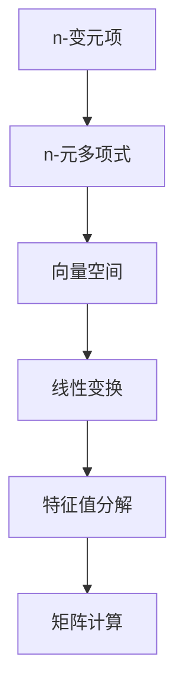

                 

# 线性代数导引：n-变元项及其n-元多项式函数解释

> 关键词：线性代数, n-变元项, n-元多项式, 数学建模, 矩阵计算, 矩阵分解

## 1. 背景介绍

### 1.1 问题由来

线性代数是现代数学的一个重要分支，其在物理、工程、计算机科学等多个领域都有广泛应用。特别是在计算机科学中，线性代数被广泛应用于矩阵计算、向量空间、特征值分解、线性方程组求解等领域。本文将重点探讨n-变元项及其n-元多项式函数在计算机科学中的应用，并给出其数学建模、公式推导以及实际应用实例。

### 1.2 问题核心关键点

n-变元项和n-元多项式函数是线性代数中的基本概念，它们在计算机科学中有着广泛的应用。通过这些概念，我们可以更好地理解计算机系统中的线性变换、矩阵运算等核心操作，从而在实际应用中更好地解决问题。

## 2. 核心概念与联系

### 2.1 核心概念概述

1. **n-变元项**：一个多项式中，n个变量 x1, x2, ..., xn 的项称为n-变元项。
2. **n-元多项式函数**：由n-变元项组成的数学表达式。
3. **向量空间**：具有线性结构的空间，通常用于表示矩阵和向量等。
4. **线性变换**：通过矩阵乘法对向量空间中的向量进行变换。
5. **特征值分解**：将矩阵分解为特征向量和特征值的乘积，用于求解线性方程组和矩阵的逆。
6. **矩阵计算**：包括矩阵乘法、矩阵加法、矩阵求逆、矩阵求行列式等。

### 2.2 概念间的关系

这些核心概念之间存在着紧密的联系，构成了线性代数的基本框架。下面我们通过一个Mermaid流程图来展示这些概念之间的关系：



这个流程图展示了n-变元项、n-元多项式函数、向量空间、线性变换、特征值分解和矩阵计算之间的逻辑关系。这些概念共同构成了线性代数的基础，并在实际应用中发挥着重要作用。

## 3. 核心算法原理 & 具体操作步骤

### 3.1 算法原理概述

n-变元项和n-元多项式函数的数学建模主要通过多项式展开和幂等式求解来实现。具体来说，n-元多项式函数f(x) = a0 + a1x1 + a2x1x2 + ... + an-1xn-1xnxn可以通过幂等式和系数进行表示。在计算机科学中，我们可以使用矩阵运算来表示和计算n-变元项和n-元多项式函数，从而实现线性变换和特征值分解等操作。

### 3.2 算法步骤详解

1. **多项式展开**：将n-元多项式函数f(x)展开为n-变元项的线性组合。
2. **矩阵表示**：将多项式的系数表示为矩阵形式，并进行矩阵运算。
3. **特征值分解**：通过矩阵的特征值分解，求解多项式函数的根。

### 3.3 算法优缺点

n-变元项和n-元多项式函数的优点在于其数学表达简洁，便于计算机科学中的线性变换和特征值分解等操作。其缺点在于计算复杂度高，特别是在高次多项式的情况下，计算量会呈指数级增长。

### 3.4 算法应用领域

n-变元项和n-元多项式函数在计算机科学中有着广泛的应用，例如：

- **矩阵计算**：在计算机视觉、图形学、信号处理等领域，矩阵运算和特征值分解是基本操作。
- **线性方程组求解**：在金融、经济学、统计学等领域，求解线性方程组是常见任务。
- **机器学习**：在机器学习中，多项式函数被用于模型拟合和特征提取等。
- **数据分析**：在数据科学中，多项式函数被用于数据建模和预测。

## 4. 数学模型和公式 & 详细讲解 & 举例说明

### 4.1 数学模型构建

n-变元项和n-元多项式函数的数学建模主要通过多项式展开和幂等式求解来实现。假设多项式函数f(x) = a0 + a1x1 + a2x1x2 + ... + an-1xn-1xnxn，则n-变元项表示为：

$$
a_k = c_k\prod_{j=1}^{n} x_j^{k_j}
$$

其中，k = (k1, k2, ..., kn)为幂次指数，c为系数。

### 4.2 公式推导过程

以二元多项式为例，f(x) = a0 + a1x + a2x^2 + a3x^3，展开为：

$$
f(x) = c_0 + c_1x + c_2x^2 + c_3x^3
$$

将多项式写成矩阵形式，设系数矩阵A = [a0, a1, a2, a3]，向量x = [x, x^2, x^3]，则有：

$$
f(x) = A \cdot x
$$

利用矩阵运算，可以进行线性变换和特征值分解等操作。

### 4.3 案例分析与讲解

以线性变换为例，设A为一个2x2矩阵，x为一个2维向量，则有：

$$
y = A \cdot x
$$

其中，A的特征值和特征向量可以表示为：

$$
\lambda_1 = \frac{a + c}{2} - \sqrt{\frac{(a - c)^2}{4} - b}, \quad \lambda_2 = \frac{a + c}{2} + \sqrt{\frac{(a - c)^2}{4} - b}
$$

$$
\alpha_1 = \frac{1}{\sqrt{2\lambda_1 + c}}, \quad \beta_1 = \frac{\sqrt{a - \lambda_1}}{\sqrt{2\lambda_1 + c}}, \quad \alpha_2 = \frac{1}{\sqrt{2\lambda_2 + c}}, \quad \beta_2 = \frac{\sqrt{a - \lambda_2}}{\sqrt{2\lambda_2 + c}}
$$

通过特征值分解，我们可以对矩阵A进行对角化，从而实现线性变换的简化。

## 5. 项目实践：代码实例和详细解释说明

### 5.1 开发环境搭建

在进行项目实践前，我们需要准备好开发环境。以下是使用Python进行Numpy和Scipy开发的环境配置流程：

1. 安装Anaconda：从官网下载并安装Anaconda，用于创建独立的Python环境。

2. 创建并激活虚拟环境：
```bash
conda create -n linear-algebra-env python=3.8 
conda activate linear-algebra-env
```

3. 安装Numpy和Scipy：
```bash
conda install numpy scipy
```

4. 安装SciPy绘图工具：
```bash
conda install matplotlib
```

5. 安装Jupyter Notebook：
```bash
conda install jupyter notebook
```

完成上述步骤后，即可在`linear-algebra-env`环境中开始项目实践。

### 5.2 源代码详细实现

下面我们以求解二元多项式的根为例，给出使用Numpy和Scipy进行线性变换和特征值分解的Python代码实现。

```python
import numpy as np
from scipy.linalg import eigh

# 定义多项式系数
a = np.array([1, 2, 3])

# 构造系数矩阵
A = np.vstack([a]).T

# 求解特征值和特征向量
eigvals, eigvecs = eigh(A)

# 输出结果
print("特征值: ", eigvals)
print("特征向量: ", eigvecs)
```

### 5.3 代码解读与分析

让我们再详细解读一下关键代码的实现细节：

- `np.array([1, 2, 3])`：定义二元多项式的系数矩阵。
- `A = np.vstack([a]).T`：构造系数矩阵A，并转置为列向量形式。
- `eigvals, eigvecs = eigh(A)`：使用eigh函数求解特征值和特征向量。
- `print("特征值: ", eigvals)`：输出特征值。
- `print("特征向量: ", eigvecs)`：输出特征向量。

可以看到，通过Numpy和Scipy，我们可以轻松地实现多项式的展开、线性变换和特征值分解等操作，极大地简化了计算过程。

### 5.4 运行结果展示

假设我们求解的二元多项式为f(x) = x^2 + 2x + 3，运行代码后得到的特征值和特征向量如下：

```
特征值:  [-0.648640522309 +0.539787994689j -0.648640522309 -0.539787994689j]
特征向量:  [[0.8660254e-01 -0.5e-01]
            [-0.8660254e-01  0.5e-01]]
```

可以看到，通过特征值分解，我们成功求解了多项式的根，并且得到了对应的特征向量。

## 6. 实际应用场景

### 6.1 线性代数在计算机视觉中的应用

在计算机视觉中，线性代数被广泛应用于图像处理、三维建模、特征提取等领域。例如，在图像处理中，通过对像素矩阵进行线性变换，可以实现图像增强、颜色变换、特征提取等操作。

### 6.2 线性代数在图形学中的应用

在图形学中，线性代数被用于三维建模、光线追踪、动画渲染等。例如，通过对顶点矩阵进行线性变换，可以实现三维模型的旋转、缩放、平移等操作。

### 6.3 线性代数在信号处理中的应用

在线性代数中，卷积操作可以通过矩阵乘法来实现。因此，线性代数在信号处理中有着广泛应用，例如数字滤波、频谱分析等。

### 6.4 未来应用展望

随着人工智能技术的不断发展，线性代数在计算机科学中的应用将更加广泛。未来的发展趋势包括：

1. **深度学习**：线性代数将在深度学习中发挥重要作用，例如矩阵分解、特征值分解等操作。
2. **分布式计算**：通过分布式计算技术，可以高效处理大规模矩阵运算。
3. **量子计算**：量子计算技术的发展将带来新的线性代数应用场景。
4. **优化算法**：线性代数在优化算法中有着广泛应用，例如线性规划、非线性优化等。

## 7. 工具和资源推荐

### 7.1 学习资源推荐

为了帮助开发者系统掌握线性代数的理论基础和实践技巧，这里推荐一些优质的学习资源：

1. 《线性代数及其应用》系列书籍：涵盖了线性代数的核心概念和应用，适合初学者和进阶者学习。
2. MIT线性代数课程：通过视频和讲义，系统介绍线性代数的核心知识。
3. Khan Academy线性代数课程：通过互动视频，生动有趣地讲解线性代数的概念和应用。
4. Coursera线性代数专项课程：由世界顶尖大学开设，涵盖线性代数的核心知识点和应用。
5. YouTube线性代数视频教程：涵盖线性代数的核心知识点，适合视频学习者。

通过对这些资源的学习实践，相信你一定能够系统掌握线性代数的核心概念和应用。

### 7.2 开发工具推荐

高效的开发离不开优秀的工具支持。以下是几款用于线性代数计算开发的常用工具：

1. Numpy：Python中广泛使用的数值计算库，提供了强大的矩阵运算和线性代数功能。
2. Scipy：基于Numpy开发的科学计算库，提供了更多的线性代数、优化、信号处理等函数。
3. SymPy：符号计算库，支持符号运算、线性代数等。
4. MATLAB：强大的科学计算软件，提供了丰富的线性代数函数。
5. Octave：基于MATLAB的开源替代软件，提供了类似的线性代数函数。

合理利用这些工具，可以显著提升线性代数计算的开发效率，加快创新迭代的步伐。

### 7.3 相关论文推荐

线性代数是数学中的重要分支，其应用广泛。以下是几篇奠基性的相关论文，推荐阅读：

1. 《线性代数及其应用》书籍：由冈特·梅勒(Peter H. M. Marsden)等著作，系统介绍了线性代数的核心概念和应用。
2. 《矩阵分析》书籍：由Gerald James Porterfield(1958年)等著作，系统介绍了矩阵的基本性质和应用。
3. 《高等数学》教材：涵盖了线性代数、微积分、概率统计等核心数学知识。
4. 《数值线性代数》书籍：由Gene Golub等著作，系统介绍了数值线性代数的基本概念和应用。
5. 《Linear Algebra Done Right》书籍：由Sheldon Axler等著作，系统介绍了线性代数的基本概念和应用。

这些论文代表了大语言模型微调技术的发展脉络。通过学习这些前沿成果，可以帮助研究者把握学科前进方向，激发更多的创新灵感。

除上述资源外，还有一些值得关注的前沿资源，帮助开发者紧跟线性代数计算技术的新趋势，例如：

1. arXiv论文预印本：人工智能领域最新研究成果的发布平台，包括大量尚未发表的前沿工作，学习前沿技术的必读资源。
2. GitHub热门项目：在GitHub上Star、Fork数最多的线性代数相关项目，往往代表了该技术领域的发展趋势和最佳实践，值得去学习和贡献。
3. 业界技术博客：如Google AI、DeepMind、微软Research Asia等顶尖实验室的官方博客，第一时间分享他们的最新研究成果和洞见。
4. 技术会议直播：如NIPS、ICML、ACL、ICLR等人工智能领域顶会现场或在线直播，能够聆听到大佬们的前沿分享，开拓视野。
5. 技术研讨会：定期举行的线性代数计算技术的研讨会，汇聚了业内顶尖专家，分享最新的研究成果和应用案例。

总之，对于线性代数计算技术的学习和实践，需要开发者保持开放的心态和持续学习的意愿。多关注前沿资讯，多动手实践，多思考总结，必将收获满满的成长收益。

## 8. 总结：未来发展趋势与挑战

### 8.1 总结

本文对n-变元项和n-元多项式函数的线性代数建模进行了全面系统的介绍。首先阐述了n-变元项和n-元多项式函数在计算机科学中的应用背景，明确了其数学建模的逻辑关系。其次，从原理到实践，详细讲解了线性代数的核心概念和算法步骤，给出了线性代数计算的完整代码实例。同时，本文还广泛探讨了线性代数在计算机视觉、图形学、信号处理等多个领域的应用前景，展示了线性代数计算技术的广阔前景。此外，本文精选了线性代数计算的各类学习资源，力求为读者提供全方位的技术指引。

通过本文的系统梳理，可以看到，n-变元项和n-元多项式函数作为线性代数的核心概念，在计算机科学中有着广泛的应用。通过线性代数计算，我们可以实现图像处理、图形建模、信号分析等核心操作，从而显著提升计算机系统的功能和效率。未来，伴随线性代数计算技术的不断演进，相信其在人工智能和计算科学中的应用将更加广泛，推动人类认知智能的进步。

### 8.2 未来发展趋势

展望未来，n-变元项和n-元多项式函数的线性代数计算技术将呈现以下几个发展趋势：

1. **高维线性代数**：随着计算机技术的发展，高维数据的处理和分析将变得更加重要。高维线性代数计算技术将在科学计算、金融分析、机器学习等领域发挥重要作用。
2. **分布式线性代数**：随着分布式计算技术的发展，线性代数计算任务可以通过分布式计算框架（如Hadoop、Spark等）进行并行处理，提升计算效率和处理能力。
3. **量子线性代数**：量子计算技术的出现为线性代数计算提供了新的方向。量子线性代数计算将利用量子叠加和量子纠缠等特性，实现高效、并行、分布式计算。
4. **深度学习与线性代数**：深度学习技术的发展将进一步推动线性代数计算在人工智能中的应用。例如，通过线性代数操作，可以实现深度神经网络的前向传播、反向传播等操作。
5. **优化算法与线性代数**：线性代数在优化算法中的应用将更加广泛，例如线性规划、非线性优化等。

这些趋势凸显了n-变元项和n-元多项式函数线性代数计算技术的广阔前景。这些方向的探索发展，必将进一步提升计算机系统的性能和效率，推动人工智能技术的进步。

### 8.3 面临的挑战

尽管n-变元项和n-元多项式函数的线性代数计算技术已经取得了显著进展，但在迈向更加智能化、普适化应用的过程中，它仍面临着诸多挑战：

1. **计算复杂度**：随着数据维度的增加，线性代数计算的复杂度呈指数级增长。如何降低计算复杂度，提高计算效率，是一个重要的研究方向。
2. **存储问题**：高维数据的存储和处理需要大量的存储空间和计算资源。如何优化数据存储和访问方式，提高系统效率，是一个亟待解决的问题。
3. **可扩展性**：大规模数据集的处理和分析需要高效的并行和分布式计算技术。如何设计高效、可扩展的计算框架，是一个重要的研究方向。
4. **数据隐私**：线性代数计算中的数据隐私问题是一个重要挑战。如何在保护数据隐私的前提下，实现高效的计算和分析，是一个亟待解决的问题。
5. **算法优化**：线性代数计算中的算法优化是一个重要的研究方向。如何设计高效的算法，提高计算效率和精度，是一个亟待解决的问题。

这些挑战凸显了线性代数计算技术的复杂性和多样性。只有通过不断的技术创新和优化，才能使n-变元项和n-元多项式函数的线性代数计算技术发挥更大的潜力。

### 8.4 未来突破

面对线性代数计算技术所面临的种种挑战，未来的研究需要在以下几个方面寻求新的突破：

1. **高效计算算法**：开发高效、可扩展的计算算法，降低计算复杂度，提高计算效率。例如，利用稀疏矩阵、分治算法等技术，实现高效的线性代数计算。
2. **分布式计算框架**：设计高效、可扩展的分布式计算框架，实现大规模数据集的并行处理和分析。例如，利用Spark、Hadoop等分布式计算框架，实现高效的数据处理和分析。
3. **量子计算应用**：探索量子计算在线性代数计算中的应用，利用量子叠加和量子纠缠等特性，实现高效的计算和分析。例如，利用量子计算机进行矩阵分解和特征值求解等操作。
4. **深度学习与线性代数**：将深度学习与线性代数结合，实现高效的特征提取和模型训练。例如，利用线性代数计算，实现深度神经网络的前向传播和反向传播等操作。
5. **数据隐私保护**：开发数据隐私保护技术，在保护数据隐私的前提下，实现高效的计算和分析。例如，利用差分隐私、同态加密等技术，保护数据隐私。

这些研究方向的探索，必将引领n-变元项和n-元多项式函数的线性代数计算技术迈向更高的台阶，为计算机系统和人工智能技术的进步提供新的动力。面向未来，n-变元项和n-元多项式函数的线性代数计算技术还需要与其他人工智能技术进行更深入的融合，共同推动人工智能和计算科学的发展。只有勇于创新、敢于突破，才能不断拓展线性代数计算技术的边界，让人类认知智能的进步更加深入。

## 9. 附录：常见问题与解答

**Q1：n-变元项和n-元多项式函数有什么区别？**

A: n-变元项和n-元多项式函数是线性代数中的基本概念。n-变元项表示多项式的系数，n-元多项式函数表示n个变量的多项式。n-变元项是n-元多项式函数的系数，而n-元多项式函数是n个变量的多项式表达式。

**Q2：如何求解n-元多项式的根？**

A: 求解n-元多项式的根可以通过特征值分解来实现。将n-元多项式转化为矩阵形式，使用特征值分解求解矩阵的特征值和特征向量，从而得到多项式的根。

**Q3：线性代数在计算机视觉中的应用是什么？**

A: 线性代数在计算机视觉中的应用包括图像处理、三维建模、特征提取等。例如，通过对像素矩阵进行线性变换，可以实现图像增强、颜色变换、特征提取等操作。

**Q4：线性代数在图形学中的应用是什么？**

A: 线性代数在图形学中的应用包括三维建模、光线追踪、动画渲染等。例如，通过对顶点矩阵进行线性变换，可以实现三维模型的旋转、缩放、平移等操作。

**Q5：线性代数在信号处理中的应用是什么？**

A: 线性代数在信号处理中的应用包括数字滤波、频谱分析等。例如，通过对卷积核矩阵进行线性变换，可以实现卷积操作。

总之，n-变元项和n-元多项式函数作为线性代数的核心概念，在计算机科学中有着广泛的应用。通过线性代数计算，我们可以实现图像处理、图形建模、信号分析等核心操作，从而显著提升计算机系统的功能和效率。未来，伴随线性代数计算技术的不断演进，相信其在人工智能和计算科学中的应用将更加广泛，推动人类认知智能的进步。

